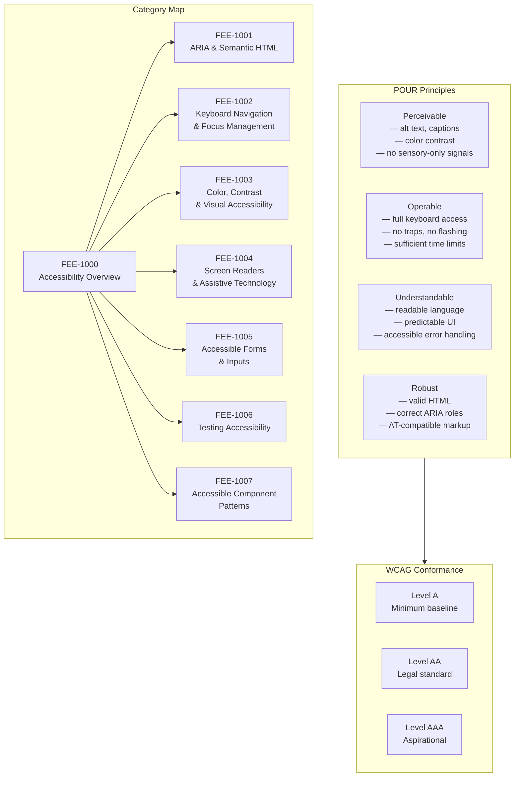

# Accessibility (a11y) Overview

:::info
This category covers the full accessibility spectrum — from semantic HTML and ARIA roles through keyboard navigation, color contrast, screen reader behavior, and accessible component patterns — with a focus on building products that work for everyone by default, not as an afterthought.
:::

## Context

Accessibility (abbreviated **a11y** — there are 11 letters between the "a" and the "y") is the practice of designing and engineering digital products so that people with disabilities can perceive, understand, navigate, and interact with them effectively. The spectrum of disability relevant to web products is broad:

- **Visual** — blindness, low vision, color blindness, photosensitivity
- **Motor** — limited hand mobility, tremors, inability to use a mouse, switch access
- **Auditory** — deafness, hard of hearing (relevant to audio/video content)
- **Cognitive** — dyslexia, ADHD, memory impairment, difficulty processing complex language

Disability is not rare. According to the World Health Organization, an estimated 1.3 billion people — approximately 16% of the global population — experience some form of significant disability. When you include temporary disability (a broken wrist, a post-surgery recovery) and situational limitation (bright sunlight making a screen unreadable, holding a child in one arm while using a phone), the proportion of your users who benefit from accessible design at any given moment is far larger than 16%.

### The legal landscape

Accessibility is increasingly a legal requirement, not merely a best practice:

- **ADA (Americans with Disabilities Act)** — US law covering state and local government entities now explicitly requires WCAG 2.1 Level AA conformance for digital properties under Title II. Federal contractors and large private organizations face similar obligations under Title III case law.
- **EN 301 549** — The harmonized European standard for ICT product and service accessibility. It directly incorporates WCAG 2.1 Level AA as its web content baseline.
- **EAA (European Accessibility Act)** — Became enforceable across all EU member states on 28 June 2025. Applies to organizations that sell products or services to EU consumers, unless they qualify for the micro-enterprise exemption: fewer than 10 employees AND annual turnover (or balance sheet total) not exceeding €2 million. Both conditions must be met to be exempt — an organization with 15 employees but only €1M turnover is still covered. Covered categories include e-commerce, banking, transportation ticketing, and telecommunications.

The practical upshot: if your product serves users in the US or EU — and most web products do — WCAG 2.1 Level AA conformance is effectively mandatory.

### WCAG conformance levels

The Web Content Accessibility Guidelines (WCAG), published by the W3C, define three conformance levels:

| Level | Description | Practical meaning |
|-------|-------------|-------------------|
| **A** | Minimum | Satisfies the most basic criteria; significant barriers likely remain |
| **AA** | Mid-range | The legal and industry standard; strong accessibility |
| **AAA** | Highest | Aspirational; not required for whole sites; may be impossible for some content types |

WCAG 2.1 was the baseline for most legal frameworks through 2024. WCAG 2.2, published October 2023 (updated December 2024), adds nine new success criteria — many addressing cognitive and motor barriers. The delta between 2.1 AA and 2.2 AA is relatively small, and teams should target 2.2 AA for new projects.

Each WCAG success criterion is graded at one of the three levels. Meeting AA requires satisfying all Level A criteria plus all Level AA criteria. Meeting AAA additionally requires all Level AAA criteria. Even a fully AAA-conformant site will not be accessible to every person with every combination of disability — particularly in the cognitive, language, and learning areas — which is why continuous user research with disabled users matters alongside conformance.

### The POUR principles

All WCAG success criteria organize under four foundational principles, commonly referred to as **POUR**:

**Perceivable** — Information and UI components must be presentable to users in ways they can perceive. Content cannot be invisible to all of a user's senses. Examples: text alternatives for images (`alt` attributes), captions for video, sufficient color contrast, content that does not rely on color alone to convey meaning.

**Operable** — UI components and navigation must be operable. Users must be able to interact with all functionality using their chosen input method. Examples: full keyboard operability, no keyboard traps, sufficient time to read and use content, no content that flashes more than three times per second (seizure risk).

**Understandable** — Information and the operation of the UI must be understandable. Users must be able to comprehend the content and how the interface behaves. Examples: readable and predictable language, labels for inputs, error identification and suggestion, consistent navigation.

**Robust** — Content must be robust enough to be interpreted reliably by a wide range of user agents, including current and future assistive technologies. Examples: valid HTML, name/role/value exposed correctly for all UI components, status messages programmatically determinable.

POUR is not just a mnemonic. It is a diagnostic tool. When an accessibility issue appears, mapping it to a POUR principle immediately points you toward the category of fix required: perception problem (missing alt text) calls for a Perceivable fix; an interactive element unreachable by keyboard is an Operable problem; an unclear error message is Understandable; a custom widget that screen readers misinterpret is a Robust problem.

### What this category covers

- **ARIA and Semantic HTML** (FEE-1001): Why native HTML elements carry free accessibility semantics, and when ARIA is — and is not — the right tool.
- **Keyboard Navigation and Focus Management** (FEE-1002): Building fully keyboard-operable interfaces, managing focus programmatically, and avoiding focus traps.
- **Color, Contrast, and Visual Accessibility** (FEE-1003): Contrast ratio requirements, color-independent communication, and motion/animation considerations.
- **Screen Readers and Assistive Technology** (FEE-1004): How screen readers interpret the DOM, live regions, and AT-specific behavior differences.
- **Accessible Forms and Inputs** (FEE-1005): Labels, fieldsets, error handling, and accessible validation patterns.
- **Testing Accessibility** (FEE-1006): Automated linting, manual testing, screen reader testing, and axe/Lighthouse tooling.
- **Accessible Component Patterns** (FEE-1007): Building dialogs, menus, tabs, and other interactive widgets to the ARIA Authoring Practices Guide patterns.

The entries build on one another. FEE-1001 establishes the semantic foundation that every other entry depends on. FEE-1002 through FEE-1005 address specific accessibility dimensions. FEE-1006 provides the tooling and testing process to verify compliance. FEE-1007 applies all prior entries to the concrete component patterns that appear in most applications.

## Design Thinking

### Accessibility is a spectrum, not a binary

It is tempting to frame accessibility as a compliance checkbox: either your site passes the audit or it does not. This framing is misleading in two ways.

First, users exist on a spectrum of ability that shifts constantly. A user with 20/20 vision in a bright office becomes effectively a low-vision user when reading the same screen in direct sunlight. A user with full hand mobility becomes a keyboard-only user the day after wrist surgery. A user without any diagnosed cognitive condition can struggle with a form that has twelve fields and unclear error messages under stress. Accessibility accommodations do not serve a separate population of "disabled users" — they reduce friction for all users across the full range of conditions they actually encounter.

Second, conformance levels are thresholds, not targets. A page that passes WCAG 2.1 AA automated checks can still be nearly unusable for a screen reader user if the ARIA roles are semantically correct but the reading order is illogical, or if live regions fire too frequently and interrupt the user mid-sentence. Conformance is a floor. The ceiling is determined by how deeply you understand the experience of users with disabilities — which only comes from testing with real users.

### Accessible by default beats retrofit

The construction industry has a widely cited rule of thumb: adding ramp access to an existing building costs approximately ten times what it would have cost to include it in the original design. The same asymmetry applies to software.

Retrofitting accessibility into a component library or application that was built without it requires: auditing every existing component, rewriting interactive widgets whose DOM structure is fundamentally incompatible with AT, adding ARIA attributes that compensate for incorrect HTML structure, and regression-testing everything touched. The work is not just multiplicative — it is often architecturally constrained. A custom dropdown built entirely from `div` elements with click handlers has no keyboard semantics, no ARIA role, no focus management, and no label association. Retrofitting it correctly may require rewriting it from scratch.

Contrast this with building accessible by default. A `button` element is keyboard-operable and screen-reader-announced for free. A `label` associated with an `input` is announced by every screen reader without a single ARIA attribute. An `h2` creates document structure that AT users navigate by. The browser and the assistive technology do the work; the developer only has to choose the right element.

The retrofit tax compounds over time. Every new component added to an inaccessible codebase inherits the patterns already present. If the codebase uses `div` with `onClick` everywhere, the next developer will follow that pattern. If the codebase uses semantic HTML with proper ARIA only where necessary, the next developer will follow that pattern. The culture is set by what already exists.

### Semantic HTML is the foundation

Browsers and assistive technologies have decades of investment in the accessibility semantics of native HTML elements. When you use a `button`, the browser exposes it to the accessibility tree as a control with a name, a role, and a pressed state. Screen readers know to announce it. Keyboard users know it responds to Enter and Space. Voice control users can target it by name. All of this is free.

When you build an equivalent control from a `div`, you inherit none of that. You must add `role="button"`, `tabindex="0"`, keyboard event handlers for Enter and Space, and appropriate ARIA state attributes — and you must keep all of them synchronized with the visual state of the component. You are reimplementing what the browser already does, imperfectly, for every case you encounter.

The first rule of ARIA use is literal: do not use ARIA if a native HTML element or attribute already provides the required semantics. ARIA is a tool for extending or correcting the accessibility tree where HTML alone is insufficient — not a replacement for correct HTML.

This principle has a corollary for component authoring: the accessibility quality of a component is largely determined at the time its DOM structure is designed. A component whose root is a semantic element with correct structure can be made accessible with minimal additional work. A component whose root is a generic container requires ARIA compensation at every interaction point.

### Framework accessibility defaults

No mainstream JavaScript framework provides accessibility for free. Each framework determines how HTML is rendered — and all of them will render whatever the developer writes, accessible or not.

**React** — No built-in accessibility enforcement. React renders the JSX the developer writes. Correct semantics, keyboard behavior, and ARIA usage are entirely the developer's responsibility. The `eslint-plugin-jsx-a11y` plugin catches common mistakes at lint time (missing `alt`, missing labels, invalid ARIA usage), but it is not enabled by default in most setups. React's server components and concurrent features do not change the accessibility model.

**Vue** — Same model as React. Vue renders the template the developer writes. The `eslint-plugin-vuejs-accessibility` plugin provides similar static analysis. No built-in accessibility layer.

**Angular** — Ships with the **Angular CDK (Component Dev Kit)** which includes an `a11y` module. The CDK provides `FocusTrap`, `LiveAnnouncer`, `FocusMonitor`, and a set of high-level accessibility utilities that are not present in React or Vue. This does not mean Angular apps are automatically accessible — developers must still choose to use these utilities — but the infrastructure exists in the platform.

**Svelte** — Same model as React and Vue. Svelte compiles the developer's template to the DOM; accessibility is the developer's responsibility. The Svelte compiler does include built-in accessibility warnings (a11y warnings are surfaced at compile time for common issues like missing `alt` on images), which is more than React's default setup but less than Angular CDK's runtime utilities.

The practical consequence: accessibility quality in any of these frameworks is a function of team discipline and process, not framework defaults. Lint rules, design system accessibility requirements, and testing gates matter far more than framework choice.

## Visual

### POUR Principles and Category Map

The following diagram shows three connected subgraphs: the four POUR principles, the three WCAG conformance levels, and the FEE category map for this series. The edge between the POUR and WCAG subgraphs indicates a general relationship — the diagram does not depict a specific criterion-level mapping. The category map shows how FEE-1000 connects to the seven sub-topics that follow.

## Related FEEs

- [FEE-1001: ARIA & Semantic HTML](1001.md)
- [FEE-1002: Keyboard Navigation & Focus Management](1002.md)
- [FEE-1003: Color, Contrast & Visual Accessibility](1003.md)
- [FEE-1004: Screen Readers & Assistive Technology](1004.md)
- [FEE-1005: Accessible Forms & Inputs](1005.md)
- [FEE-1006: Testing Accessibility](1006.md)
- [FEE-1007: Accessible Component Patterns](1007.md)
- [FEE-100: HTML & Semantic Markup Overview](../HTML%20and%20Semantic%20Markup/100.md)
