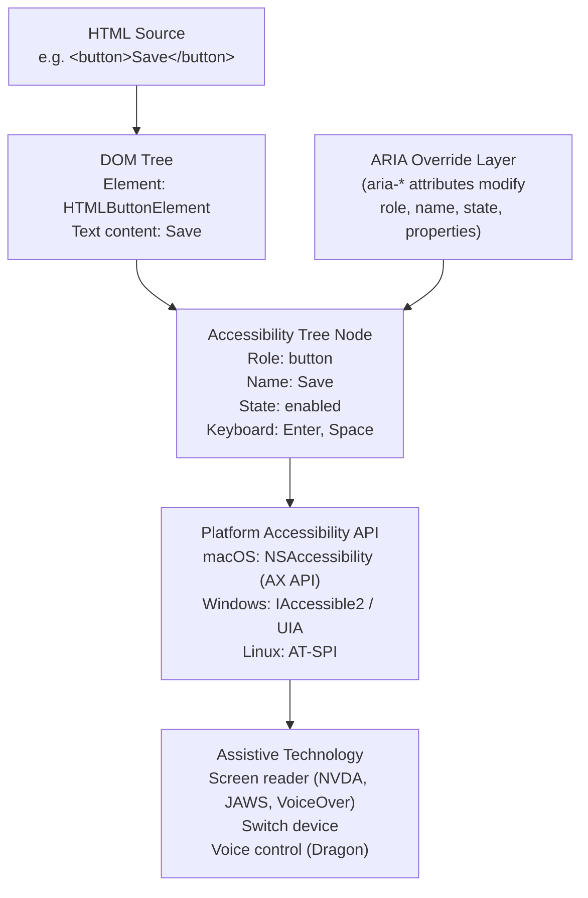
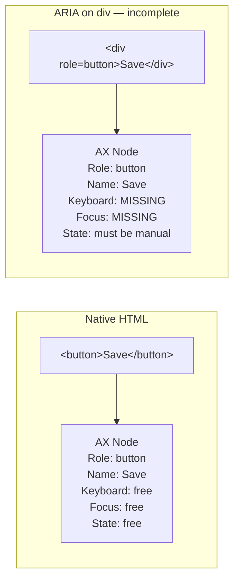

# [FEE-1001] ARIA & Semantic HTML

:::info
Semantic HTML gives you accessibility for free. ARIA extends it. Understanding when to use each — and in what order — is the single most impactful accessibility skill a frontend engineer can develop.
:::

## Context

### What is the accessibility tree?

Browsers maintain two trees for every page: the **DOM tree** (the full document model) and the **accessibility tree** (a parallel representation that strips purely visual information and exposes each element's semantic role, name, state, and properties to assistive technologies (AT)).

When a screen reader, switch device, or voice control software needs to understand a UI, it queries the accessibility tree — not the DOM directly, and not the visual rendering. The platform accessibility API (NSAccessibility — the "AX API" — on macOS, IAccessible2/UIA on Windows) sits between the browser and the assistive technology, translating the tree into an interface the AT can consume.

Every HTML element maps to a node in the accessibility tree with a set of implied properties:

- **Role** — what kind of thing it is (`button`, `heading`, `list`, `checkbox`, ...)
- **Name** — the human-readable label used to identify it
- **Description** — optional supplementary information
- **State** — dynamic conditions (`checked`, `expanded`, `disabled`, `selected`, ...)
- **Value** — for range inputs and other value-bearing controls

Native HTML elements carry these properties automatically. ARIA attributes (`role`, `aria-*`) let authors override or supplement them.

### What is ARIA?

**ARIA** (Accessible Rich Internet Applications) is a W3C specification — currently at version 1.2 — that defines:

- A set of **roles** that can be assigned to any element to declare what kind of widget it is
- A set of **properties** that describe characteristics of a widget that do not change during normal use
- A set of **states** that describe current conditions of a widget that change during interaction

ARIA is a vocabulary for the accessibility tree. It changes only what the accessibility tree reports — a `div` with `role="button"` is announced as a button but still ignores Enter and Space.

### Implicit ARIA roles of native HTML elements

Every native HTML element has an implicit ARIA role. When you use the element correctly, you get that role — and often its associated name computation and state — without writing a single ARIA attribute.

| HTML Element | Implicit ARIA Role | Notes |
|---|---|---|
| `<button>` | `button` | Keyboard-operable; responds to Enter and Space natively |
| `<a href="...">` | `link` | Responds to Enter; no href = generic role |
| `<nav>` | `navigation` | Landmark; helps AT users jump to navigation |
| `<main>` | `main` | Landmark; one per page |
| `<header>` | `banner` (at page level) | When a direct child of `body`; landmark role is lost when nested inside `article`, `aside`, `main`, `nav`, or `section` |
| `<footer>` | `contentinfo` (at page level) | When a direct child of `body`; landmark role is lost when nested inside `article`, `aside`, `main`, `nav`, or `section` |
| `<aside>` | `complementary` | Landmark |
| `<section>` | `region` (when named) | Only has landmark role if it has an accessible name |
| `<article>` | `article` | Self-contained, independently distributable content |
| `<h1>`–`<h6>` | `heading` (level 1–6) | Document outline; AT users navigate by heading |
| `<ul>`, `<ol>` | `list` | Children have `listitem` role |
| `<input type="checkbox">` | `checkbox` | State: `checked`, `unchecked`, `mixed` |
| `<input type="radio">` | `radio` | |
| `<select>` | `combobox` | `listbox` when the `multiple` attribute is set or `size` > 1 |
| `<form>` | `form` (when named) | Only landmark when it has an accessible name |
| `<table>` | `table` | |
| `<dialog>` | `dialog` | |

The landmark roles (`navigation`, `main`, `banner`, `contentinfo`, `complementary`, `region`, `form`, `search`) are particularly important because screen reader users navigate landmarks to jump around the page quickly — similar to how sighted users scan visually for major sections.

### ARIA roles

When native HTML cannot express the required semantics — typically for custom interactive widgets — ARIA roles fill the gap. Common roles:

| Role | Usage |
|---|---|
| `role="dialog"` | A modal or non-modal dialog overlay |
| `role="alertdialog"` | A dialog that requires immediate user attention and a response |
| `role="alert"` | A live region (an element whose content changes AT announces automatically — see "Live regions" below) for urgent, assertive announcements (implies `aria-live="assertive"`) |
| `role="status"` | A live region for non-urgent status messages (implies `aria-live="polite"`) |
| `role="tablist"` | Container for a set of tabs |
| `role="tab"` | An individual tab in a tablist |
| `role="tabpanel"` | The panel associated with a tab |
| `role="menu"` | A widget that offers a list of choices |
| `role="menuitem"` | An option within a menu |
| `role="combobox"` | An input combined with a popup list |
| `role="grid"` | An interactive table with cell selection |
| `role="tree"` | A hierarchical list |
| `role="tooltip"` | A short description of an element, shown on hover/focus |

### ARIA properties

Properties describe fixed or semi-fixed characteristics. They supplement or override the element's computed accessible name and description. Core naming and relationship properties:

| Property | Usage |
|---|---|
| `aria-label` | Provides a string directly as the accessible name |
| `aria-labelledby` | References another element's text as the accessible name |
| `aria-describedby` | References another element's text as the accessible description |
| `aria-controls` | Identifies the element(s) this widget controls |

The full property list (`aria-owns`, `aria-haspopup`, `aria-level`, and others) is defined in the [WAI-ARIA 1.2 specification](https://www.w3.org/TR/wai-aria-1.2/#state_prop_def).

### ARIA states

States describe dynamic conditions that change during interaction and should be reflected in real time. The ones this article uses:

| State | Usage |
|---|---|
| `aria-expanded` | Whether a collapsible section or popup is open (`true` / `false`) |
| `aria-hidden` | Removes element from accessibility tree (`true` / `false`) |
| `aria-disabled` | Marks element as disabled without removing it from focus order |
| `aria-checked` | For checkboxes, radios, and toggle buttons (`true` / `false` / `mixed`) |
| `aria-selected` | For options in a listbox, tabs, or grid cells |
| `aria-pressed` | For toggle buttons (`true` / `false` / `mixed`) |

Additional states such as `aria-busy`, `aria-invalid`, and `aria-current` are defined in the same [WAI-ARIA 1.2 section](https://www.w3.org/TR/wai-aria-1.2/#state_prop_def).

### Live regions

Live regions allow dynamic content changes to be announced to screen reader users without requiring them to move focus. They are essential for content that updates asynchronously: toast notifications, form validation messages, search result counts, chat messages.

Two values of `aria-live` cover most cases:

- **`aria-live="polite"`** — The announcement waits until the user is idle (finished speaking/reading). Use this for non-urgent updates such as search results loading, success notifications, or status updates. This is the correct default for almost all live regions.
- **`aria-live="assertive"`** — The announcement interrupts whatever the AT is currently reading. Use only for urgent information where a delay would cause real confusion or danger — for example, a session timeout warning counting down, or a critical error that prevents form submission.

Overusing `assertive` is a significant accessibility problem. Interrupting the AT mid-sentence is disorienting, and many screen reader users consider it rude behavior from websites. Default to `polite`. Reach for `assertive` only when the information cannot wait.

Additional live region attributes:
- `aria-atomic="true"` — When updated, announce the entire region, not just the changed portion
- `aria-relevant` — Specifies which types of changes are relevant (`additions`, `removals`, `text`, `all`). Default is `additions text`.

## Visual

### Accessibility Tree Flow

The following diagram shows how a DOM element becomes accessible to assistive technology. The browser parses the HTML, builds the DOM, and derives the accessibility tree from it. ARIA attributes modify the accessibility tree layer. The platform accessibility API (such as NSAccessibility on macOS or UI Automation on Windows) exposes the tree to the assistive technology.



### Native element vs ARIA override comparison



The diagram illustrates why `<button>` is always preferred: the accessibility tree node looks the same at the role/name level, but the native element provides keyboard and focus behavior that the ARIA-on-div pattern requires manual JavaScript to replicate.

## Example

### 1. Semantic HTML implicit roles — good vs bad

```html
<!-- BAD: visual structure with no semantics -->
<div class="header">
  <div class="nav">
    <div class="nav-link">Home</div>
    <div class="nav-link">About</div>
  </div>
</div>
<div class="main-content">
  <div class="big-text">Welcome</div>
  <div class="content-area">...</div>
</div>
<div class="sidebar">...</div>

<!-- GOOD: semantic structure with implicit landmark and heading roles -->
<header>
  <nav aria-label="Primary">
    <a href="/">Home</a>
    <a href="/about">About</a>
  </nav>
</header>
<main>
  <h1>Welcome</h1>
  <p>...</p>
</main>
<aside aria-label="Related links">...</aside>
```

The good pattern gives screen reader users landmark navigation for free. The `nav` is announced as a navigation landmark. The `main` allows direct jumping to main content. The `h1` is navigable by heading. None of this requires ARIA.

### 2. The div-as-button anti-pattern

```html
<!-- BAD: looks like a button, acts like nothing -->
<div class="btn" onclick="submitForm()">Submit</div>
<!-- Problems:
     - Not in tab order (keyboard users cannot reach it)
     - No role (screen reader sees generic "group" or nothing meaningful)
     - Enter and Space do nothing
     - Cannot be disabled with the disabled attribute
-->

<!-- ALSO BAD: partially fixed but still wrong -->
<div class="btn"
     role="button"
     tabindex="0"
     onclick="submitForm()">Submit</div>
<!-- Still problems:
     - Enter fires click natively on button, but NOT on div — must add keydown handler
     - Space fires click on button (after preventing scroll), but NOT on div — must add keydown handler
     - aria-disabled must be manually synchronized
     - No automatic form submission behavior
-->

<!-- GOOD: use the right element -->
<button type="submit">Submit</button>
<!-- Benefits:
     - Implicit role="button" in accessibility tree
     - In tab order without tabindex
     - Enter and Space fire click natively
     - disabled attribute removes from tab order and suppresses events
     - Submits its parent form natively when type="submit"
-->
```

### 3. aria-label vs aria-labelledby

```html
<!-- aria-label: use when no visible text exists -->
<button aria-label="Close">
  <!-- focusable="false" only matters for legacy IE/Edge, which put SVGs in the tab order -->
  <svg aria-hidden="true" focusable="false">
    <use href="#icon-x" />
  </svg>
</button>

<!-- aria-labelledby: use to reference visible text -->
<section aria-labelledby="shipping-heading">
  <h2 id="shipping-heading">Shipping Address</h2>
  <form>
    <!-- inputs here -->
  </form>
</section>

<!-- aria-labelledby with multiple references: combines text in order -->
<tr>
  <th id="col-price" scope="col">Price</th>
</tr>
<tr>
  <th id="row-product-name" scope="row">Widget</th>
  <td>
    <input
      type="number"
      aria-labelledby="col-price row-product-name"
      id="price-widget"
    />
  </td>
</tr>
```

### 4. aria-live for dynamic content

```html
<!-- Polite live region: search results, status updates -->
<div role="status" aria-live="polite" aria-atomic="true">
  <!-- Updated by JavaScript when search results load -->
  <!-- Initially empty; screen readers will announce changes -->
</div>

<!-- JavaScript update: -->
<!-- document.querySelector('[role="status"]').textContent = '24 results found'; -->

<!-- Assertive live region: urgent errors only -->
<div role="alert">
  <!-- Only for urgent errors that cannot wait for user idle -->
  <!-- role="alert" already implies aria-live="assertive" and aria-atomic="true" -->
</div>

<!-- toast notification pattern (polite) -->
<div
  id="toast-region"
  role="status"
  aria-live="polite"
  aria-atomic="true"
  class="sr-only"
></div>
```

Note: `role="alert"` automatically implies `aria-live="assertive"` and `aria-atomic="true"`, and `role="status"` implies `aria-live="polite"` and `aria-atomic="true"` per the ARIA spec. Pairing the role with explicit `aria-live` and `aria-atomic` attributes, as the `role="status"` examples above do, is therefore redundant per spec — but it improves compatibility with older screen readers, which is why it remains common practice. The `role="alert"` example deliberately omits them: MDN cautions that pairing `role="alert"` with an explicit `aria-live="assertive"` can cause double announcements in iOS VoiceOver.

### 5. aria-expanded on a disclosure widget

```html
<!-- Disclosure widget: show/hide a section -->
<button
  aria-expanded="false"
  aria-controls="faq-answer-1"
  id="faq-btn-1"
>
  What is the return policy?
</button>
<div id="faq-answer-1" hidden>
  <p>Items can be returned within 30 days of purchase.</p>
</div>

<!-- JavaScript manages state: -->
<!--
const btn = document.getElementById('faq-btn-1');
const panel = document.getElementById('faq-answer-1');
btn.addEventListener('click', () => {
  const isExpanded = btn.getAttribute('aria-expanded') === 'true';
  btn.setAttribute('aria-expanded', String(!isExpanded));
  panel.hidden = isExpanded;
});
-->
```

When the button is activated:
- `aria-expanded` toggles between `"false"` and `"true"` — screen readers announce the new state.
- `hidden` attribute toggles on the panel — removes it from visual display and accessibility tree.
- Screen reader users hear: "What is the return policy? collapsed button" → click → "What is the return policy? expanded button".

### 6. aria-hidden usage — correct vs incorrect

```html
<!-- CORRECT: hide decorative icon from AT -->
<button>
  <svg aria-hidden="true" focusable="false">
    <use href="#icon-save" />
  </svg>
  Save document
</button>

<!-- CORRECT: hide an entire decorative section -->
<div aria-hidden="true">
  <!-- purely decorative visual separator -->
</div>

<!-- WRONG: aria-hidden on a focusable element -->
<button aria-hidden="true">Close</button>
<!-- Keyboard users can focus this; screen reader users cannot perceive it.
     The button is a ghost: it exists for keyboard users but is invisible to AT. -->

<!-- WRONG: aria-hidden on a container that holds focusable elements -->
<div aria-hidden="true">
  <button>Cancel</button>  <!-- keyboard-reachable but AT-hidden ghost -->
  <button>Confirm</button> <!-- same problem -->
</div>

<!-- FIX: if you want to hide interactive content, also make it non-focusable -->
<div aria-hidden="true" style="display:none">
  <!-- display:none removes from both visual rendering and accessibility tree,
       and prevents focus. Use this instead of aria-hidden on containers
       with focusable descendants. -->
</div>
```

## Best Practices

**MUST prefer native HTML elements over ARIA re-implementations.** MUST reach for `<button>`, `<label>`, and `<h2>` before `<div role="button">`, `aria-label`, or `<div role="heading" aria-level="2">`. Native elements provide role, name computation, keyboard behavior, and focus order for free. Every ARIA-only replacement requires you to reimplement what the browser already ships, and you will miss edge cases.

**MUST NOT apply `aria-hidden="true"` to focusable elements or elements containing focusable children.** Hiding an element from the accessibility tree while leaving it keyboard-reachable creates a ghost control: keyboard users can focus it but screen reader users cannot perceive or understand it. To hide interactive content from both sighted and non-sighted users, use `display:none` or the `hidden` attribute — both also remove the element from the tab order. For content that must stay visible but become non-interactive (for example, the page behind an open modal), use the `inert` attribute, which removes the subtree from both the focus order and the accessibility tree.

**MUST NOT use ARIA roles that contradict native element semantics in unsupported ways.** Do not place `role="heading"` on a `<button>`, or `role="button"` on a `<table>`. The role MUST be used on an element whose native semantics do not conflict with it. Conflicting roles produce an accessibility tree that is inconsistent and confusing for assistive technology users.

**MUST keep ARIA state attributes synchronized with actual component state at all times.** Attributes such as `aria-expanded`, `aria-checked`, and `aria-selected` MUST be updated every time the corresponding visual or interactive state changes. Stale ARIA state is actively worse than no ARIA state — it misinforms screen reader users about the current condition of a widget.

## Design Thinking

### Why semantic HTML gives accessibility for free

Native HTML elements carry decades of browser investment. When you write `<button>`, the browser's layout engine, accessibility engine, and event system all recognize it:

- The accessibility engine maps it to the platform accessibility API with role `button`, computes an accessible name from its text content, and exposes keyboard interactions (Enter and Space trigger the default action) automatically.
- The browser's focus system includes it in the tab order without any `tabindex`.
- The platform accessibility API exposes it to screen readers with the appropriate role name in the AT's language (a VoiceOver user hears "button", a JAWS user hears "button", a NVDA user hears "button").

None of this happens with `<div>`. A `div` has no role, no keyboard behavior, and no place in the tab order. To make it functionally equivalent to `<button>`, you must add `role="button"`, `tabindex="0"`, a `keydown` event handler for Enter and Space, and any relevant ARIA states. You are reimplementing what the browser already implements — and you will inevitably miss edge cases.

The same logic applies to heading structure. An `<h2>` creates a heading-level-2 node in the accessibility tree. Screen reader users navigate headings constantly using keyboard shortcuts (H key in NVDA and JAWS, Control+Option+Command+H in VoiceOver). A `<div class="heading">` with a larger font size creates nothing in the accessibility tree. Content organized with real headings is navigable; content styled to look like headings is not.

Choose the right element and the browser does the rest.

### Why the first rule of ARIA exists

The W3C's Using ARIA document states: "If you can use a native HTML element or attribute with the semantics and behavior you require already built in, instead of re-purposing an element and adding an ARIA role, state or property to make it accessible, then do so."

This rule exists because ARIA has a fundamental limitation: **it adds semantics to the accessibility tree, but it adds no behavior to the element**.

Consider `<div role="button">Click me</div>`:

- A screen reader will announce it as a button. The role is correct.
- It has no `tabindex`, so keyboard users cannot reach it at all (unless `tabindex="0"` is also added).
- Even with `tabindex="0"`, pressing Enter or Space on it does nothing — these keys are not wired to `click` events on a `div`.
- The developer must add: `tabindex="0"`, `keydown` handler checking for `event.key === 'Enter'` and `event.key === ' '` (Space) to manually fire a click, and prevent the default scroll behavior of Space.
- If the button has a disabled state, they must add `aria-disabled="true"` and ensure click and keyboard handlers respect it, because `disabled` attribute does not work on `div`.
- If the button has a toggle pressed state, they must add `aria-pressed` and keep it synchronized.

At each step, the developer is hand-building what `<button>` provides for free. And at each step there are ways to get it wrong — an easy miss is Space, which must both fire the click and have its default page-scroll suppressed. The native element is not just more convenient; it is more robust because its behavior is implemented in the browser, where it has been tested against thousands of screen readers, AT configurations, and edge cases.

Reserve ARIA for the cases HTML cannot express, such as an editable autocomplete combobox or a tree.

### Why aria-label vs aria-labelledby matters

Both `aria-label` and `aria-labelledby` provide an accessible name for an element. The choice between them has real implications for quality, maintainability, and internationalization.

**`aria-label`** provides a string literal directly:

```html
<button aria-label="Close dialog">
  <svg aria-hidden="true"><!-- icon --></svg>
</button>
```

Advantages: simple, self-contained, works when there is no visible label text.
Disadvantages: the string is invisible — it does not appear in the UI. It must be manually translated in every locale. If the visible context changes, the `aria-label` value may become stale without anyone noticing. Automated tools cannot easily check whether `aria-label` content is current and accurate.

**`aria-labelledby`** references visible text by its `id`:

```html
<section aria-labelledby="billing-heading">
  <h2 id="billing-heading">Billing Address</h2>
  <!-- ... -->
</section>
```

Advantages: the accessible name is derived from visible text. If the visible text changes, the accessible name changes automatically. Translation systems that handle visible text also handle the accessible name. It is inherently consistent between visual and non-visual presentation.
Disadvantages: requires an element with an `id` to reference; slightly more markup.

The internationalization argument is decisive for most production applications: `aria-labelledby` references text that is already in your localization pipeline. `aria-label` string literals are invisible to most i18n toolchains — they must be handled outside the normal i18n pipeline. In a large application with many components and many locales, the maintenance burden of `aria-label` strings is significant.

The practical guidance:
- When visible text already exists that names the element, use `aria-labelledby` to reference it.
- When there is no visible text (icon-only buttons, purely visual sections), use `aria-label`.
- When the label text needs to be richer than a single element's text (combining multiple elements), `aria-labelledby` can reference multiple ids: `aria-labelledby="first-id second-id"`.

### The progressive enhancement argument

Progressive enhancement applied to accessibility means: start with correct semantics, enhance with ARIA only where needed.

**Layer 1 — Correct HTML structure**: Use semantic elements (`nav`, `main`, `h1`–`h6`, `button`, `label`, `input`, etc.) with correct attributes (`type`, `for`, `href`, `alt`). This alone satisfies a large fraction of accessibility requirements without any ARIA.

**Layer 2 — ARIA for custom widgets**: When you build an interactive widget that has no native HTML equivalent — a date picker, an autocomplete combobox, a tree navigation, a multi-select listbox — add the appropriate ARIA roles, properties, and states. This is the correct use case for ARIA.

**Layer 3 — JavaScript for behavior**: Add keyboard event handlers to implement the interaction patterns defined in the ARIA Authoring Practices Guide. ARIA declares the role; JavaScript implements the expected keyboard behavior for that role.

Each layer should be correct on its own. A `<button>` with no ARIA and no custom JavaScript is fully accessible. An ARIA-enhanced widget with incomplete keyboard handling is less accessible than the native element it was trying to replace. An elaborate ARIA implementation built on incorrect HTML structure produces an accessible tree that describes a UI that does not match the visual presentation — which is confusing for AT users.

The progressive enhancement lens also helps prioritize accessibility work: fixing incorrect HTML structure always comes before adding ARIA, because ARIA on broken structure creates a broken accessibility tree.

## Common Mistakes

### Using ARIA roles without implementing the expected keyboard behavior

Adding `role="listbox"` or `role="combobox"` to a container tells the screen reader to treat it as that widget type. Screen reader users then expect the keyboard interaction patterns defined in the ARIA Authoring Practices Guide: arrow keys to move between options, Home/End for first/last, character search for type-ahead. If the keyboard behavior is not implemented, the widget is more confusing to AT users than a plain `<select>` would have been.

**Fix**: When you use a complex ARIA role, implement the full keyboard pattern. Reference the [ARIA APG patterns](https://www.w3.org/WAI/ARIA/apg/patterns/) for the required keyboard behavior.

### Using aria-label on elements that already have visible labels

```html
<!-- WRONG: aria-label overrides the visible text -->
<button aria-label="Submit the form to create your account">Submit</button>
<!-- Screen reader announces "Submit the form to create your account",
     but voice control users saying "click Submit" may not be able to activate it
     because the spoken word "Submit" no longer matches the accessible name. -->

<!-- CORRECT: let the visible text be the accessible name -->
<button>Submit</button>
```

When `aria-label` is present, it completely overrides the element's computed accessible name from its content. The visible text and the accessible name diverge. This breaks voice control software (Dragon NaturallySpeaking) because users activate controls by speaking their visible label — if the accessible name does not match the visible text, the spoken command fails.

### Injecting a live region into the DOM together with its content

```html
<!-- WRONG: the live region is created with its message already inside -->
<!-- JavaScript:
     container.innerHTML =
       '<div role="status" aria-live="polite">File uploaded successfully</div>';
-->
<!-- Screen readers announce *changes* inside a live region they have already
     discovered. A region inserted with its content already in place is often
     not announced at all. -->

<!-- CORRECT: render the empty region at page load, update its text later -->
<div role="status" aria-live="polite" id="upload-status">
  <span aria-hidden="true">✓</span>
  <!-- decorative icon: aria-hidden="true" is the correct pattern here -->
</div>
<!-- JavaScript, after the upload completes:
     document.getElementById('upload-status')
       .appendChild(document.createTextNode('File uploaded successfully'));
-->
```

Live region announcements are triggered by content changes inside a region that assistive technology has already registered. Render the container empty (or with only decorative content) at page load, then inject the message text when the event occurs. Hiding a decorative icon inside the region with `aria-hidden="true"` is fine — that is the standard pattern for decorative content anywhere, including inside live regions.

### Forgetting that section and form only become landmarks when named

```html
<!-- NOT a landmark (no accessible name) -->
<section>
  <p>Some content</p>
</section>

<!-- IS a landmark -->
<section aria-labelledby="featured-heading">
  <h2 id="featured-heading">Featured Articles</h2>
  <p>Some content</p>
</section>
```

A `<section>` without an accessible name has no landmark role — it is treated as a generic container. Add `aria-labelledby` referencing a visible heading, or `aria-label` for unlabeled sections.

### Overusing aria-live="assertive"

Every `aria-live="assertive"` announcement interrupts the AT immediately. On a busy page with multiple dynamic regions, this produces a constant stream of interruptions. Screen reader users find this disorienting and have no way to stop it once it starts.

Assertive announcements are rarely appropriate — session timeouts, critical authentication errors, browser compatibility warnings that prevent the page from working, and little else. Everything else should be `polite`.

### Redundant alt text on images inside buttons

```html
<!-- WRONG: redundant announcement -->
<button>
   Save
</button>
<!-- Screen reader announces: "Save Save button" -->

<!-- CORRECT: decorative image in a button with visible text -->
<button>
   Save
</button>
<!-- Screen reader announces: "Save button" -->

<!-- CORRECT: image-only button (no visible text) -->
<button>
  
</button>
<!-- Screen reader announces: "Save document button" -->
```

### Using tabindex values greater than 0

```html
<!-- WRONG: creates a custom focus order that confuses keyboard users -->
<button tabindex="3">First visually</button>
<button tabindex="1">Second visually</button>
<button tabindex="2">Third visually</button>

<!-- CORRECT: let DOM order determine tab order -->
<button>First visually (first in DOM = first in tab order)</button>
<button>Second visually</button>
<button>Third visually</button>
```

Positive `tabindex` values override the natural DOM tab order. The visual order and the tab order diverge, which is disorienting for sighted keyboard users. `tabindex="0"` adds an element to the natural tab order at its DOM position. `tabindex="-1"` removes it from the natural tab order but allows programmatic focus. Never use `tabindex` values of 1 or higher in production code.

## Related Topics

- [Accessibility Overview](/en/Accessibility/1000)
- [HTML & Semantic Markup Overview](/en/HTML%20and%20Semantic%20Markup/100)
- [Keyboard Navigation & Focus Management](/en/Accessibility/1002)
- [Accessible Component Patterns](/en/Accessibility/1007)

## References

- [WAI-ARIA 1.2 Specification — W3C](https://www.w3.org/TR/wai-aria-1.2/)
- [ARIA Authoring Practices Guide (APG) — W3C](https://www.w3.org/WAI/ARIA/apg/)
- [Using ARIA — W3C (Discontinued Draft)](https://www.w3.org/TR/using-aria/)
- [ARIA in HTML — W3C Recommendation](https://www.w3.org/TR/html-aria/)
- [MDN: ARIA — MDN Web Docs](https://developer.mozilla.org/en-US/docs/Web/Accessibility/ARIA)
- [WebAIM: Introduction to ARIA](https://webaim.org/techniques/aria/)
- [The First Rule of ARIA — WebAIM blog](https://webaim.org/blog/aria-cause-solution/)
