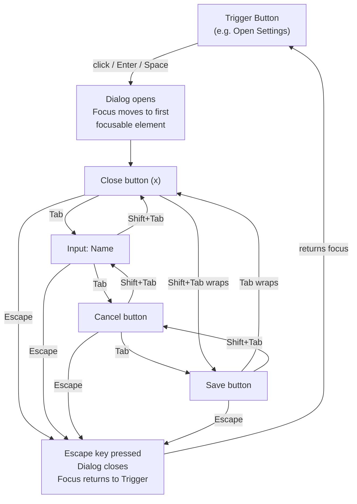

# Keyboard Navigation & Focus Management

:::info
Keyboard accessibility is the foundation of all other assistive technology support. Every interaction that works by keyboard works by switch device, voice control, and most screen readers. Get the keyboard layer right, and the rest becomes far easier.
:::

## Context

### Who depends on keyboard navigation?

Keyboard navigation is not a niche concern. A broad spectrum of users rely on it:

- **Motor disabilities**: Users with conditions like cerebral palsy, multiple sclerosis, ALS, or repetitive strain injuries may be unable to operate a mouse with sufficient precision or at all. They navigate entirely by keyboard or by assistive devices that emulate keyboard input (switch devices, sip-and-puff controllers, eye-tracking systems).
- **Power users and developers**: Many experienced users prefer keyboard navigation for speed. Tab, arrow keys, and keyboard shortcuts reduce hand travel and accelerate navigation through long forms and data tables.
- **Voice control software users**: Applications like Dragon NaturallySpeaking (Dragon) allow users to speak commands to control their computer. Voice control relies on the same underlying accessibility APIs as keyboard navigation. If a control is not focusable, Dragon cannot activate it by voice.
- **Screen reader users**: While screen readers have their own navigation modes (heading navigation, landmark navigation), they also use keyboard interaction patterns for operating interactive controls. A screen reader user working through a modal dialog or a data grid depends entirely on the keyboard patterns the author has implemented.

The WCAG 2.1 success criteria most directly related to keyboard access are:

- **2.1.1 Keyboard (Level A)**: All functionality is operable through a keyboard interface. This is a Level A requirement — the minimum baseline.
- **2.1.2 No Keyboard Trap (Level A)**: If keyboard focus moves to a component, focus can be moved away using only the keyboard.
- **2.4.3 Focus Order (Level A)**: Navigation sequence preserves meaning and operability.
- **2.4.7 Focus Visible (Level AA)**: Any keyboard operable UI component has a visible focus indicator.
- **2.4.11 Focus Appearance (Level AA, WCAG 2.2)**: Focus indicators meet minimum size and contrast requirements.

### Tab order and DOM order

The browser determines tab order from the DOM structure. By default, all natively focusable elements — `<a href>`, `<button>`, `<input>`, `<select>`, `<textarea>`, `<details>` — receive focus in the order they appear in the DOM.

This creates a simple and powerful rule: **your visual layout should match your DOM order**. When CSS is used to visually reorder elements (via `flex-direction: row-reverse`, `order` property, CSS grid placement, or `position: absolute`), the visual order and the DOM order can diverge. Keyboard users and screen reader users follow DOM order; sighted mouse users follow visual order. The result is a disorienting disconnect where the focus jumps appear to skip backwards or forwards relative to what is visible on screen.

The `tabindex` attribute modifies this default behavior in three ways:

| Value | Effect |
|---|---|
| `tabindex="-1"` | Removes from natural tab order; element can still receive focus programmatically via `.focus()` |
| `tabindex="0"` | Adds element to natural tab order at its DOM position (useful for non-focusable elements that need to become focusable) |
| `tabindex="1"` or any positive value | Moves element to the front of the tab order, before all `tabindex="0"` and naturally focusable elements |

The third case — positive tabindex — is the anti-pattern. See Design Thinking for why.

### Focus indicators

A focus indicator is the visual signal that shows which element currently has keyboard focus. Without it, keyboard users cannot tell where they are on the page.

The browser provides default focus indicators — typically a blue outline (Chrome/Edge) or a dotted ring (Firefox). These defaults are often removed by CSS resets or design system stylesheets via `outline: none` or `outline: 0`.

CSS provides two pseudo-classes for styling focus:

- `:focus` — applies whenever the element has focus, regardless of how focus was received (keyboard, mouse click, touch, programmatic `.focus()`).
- `:focus-visible` — applies only when the browser determines that the focus indicator should be visible. This is typically when focus was received via keyboard or when the element is an `<input>` or form control. Focus received from mouse click does not trigger `:focus-visible` on most elements.

### Focus traps

A focus trap is intentional behavior: keyboard focus is constrained within a specific region of the page. When a modal dialog is open, focus must not be allowed to escape into the background content. A user pressing Tab repeatedly must cycle through the focusable elements inside the dialog — and when they reach the last one, Tab wraps back to the first. Shift+Tab reverses the cycle.

The modern HTML approach uses the `inert` attribute on the background content. An element with `inert` is non-interactive: it cannot receive focus, mouse events, or selection, and it is removed from the accessibility tree. Setting `inert` on all content outside the open dialog automatically traps focus inside the dialog without manual keyboard event interception.

Older approaches intercept `keydown` events for Tab and Shift+Tab, query all focusable elements within the dialog, and manually manage wrapping. This is error-prone: the list of focusable elements is harder to compute correctly than it appears, and dynamically added elements within the dialog must be tracked.

### Imperative focus management

The browser's native focus behavior handles most cases automatically. But several situations require explicit, imperative focus management via `.focus()`:

1. **After opening a modal dialog**: Move focus to the first focusable element inside the dialog (or to the dialog element itself if it has `role="dialog"` and `tabindex="-1"`). Without this, focus remains on the trigger button behind the modal — screen reader users are stranded in background content.
2. **After closing a modal dialog**: Return focus to the element that triggered the dialog to open. This preserves the user's position in the page.
3. **After deleting a list item**: If the deleted item held focus, move focus to the next item, or to the previous item if no next item exists, or to the list container if the list is now empty. Letting focus disappear to the `<body>` forces screen reader users to re-navigate to their position.
4. **After route changes in single-page applications**: The browser natively moves focus to the top of the page on navigation. SPAs handle routing in JavaScript and do not trigger this browser behavior. Without manual focus management, screen reader users may remain focused on a stale element from the previous route.

### Skip links

Skip links are hidden anchor links placed at the beginning of a page that allow keyboard users to jump past repeated navigation. On every page load, a keyboard user would otherwise need to Tab through every navigation item before reaching the main content. For a header with twenty navigation links, that is twenty Tab presses — on every page, every time.

A skip link is typically the first focusable element on the page. It is visually hidden until it receives focus, at which point it appears and allows the user to activate it and jump to the main content area.

### Focus management in React Aria and Vue

Component libraries provide abstractions for focus management:

**React Aria's `FocusScope`**: A component that constrains Tab navigation within its children. The `contain` prop activates focus trap behavior; `autoFocus` automatically focuses the first focusable child when mounted. Used internally by `useDialog`, `useModal`, and other hooks.

**Vue's `useFocusTrap`** (from VueUse or similar): A composable that programmatically traps focus within a target element. When activated, Tab and Shift+Tab are intercepted and cycle through the element's focusable descendants.

Both abstractions handle the complexity of querying focusable elements, managing the Tab cycle, and restoring focus on cleanup — which is why reaching for a library implementation is almost always preferable to rolling a manual trap.

## Principle

> **MUST NOT** use `outline: none` or `outline: 0` without providing a visible alternative focus indicator. Removing the outline without replacement makes keyboard navigation invisible and violates WCAG 2.4.7 (Focus Visible).
>
> **SHOULD** manage focus explicitly after modal dialogs open and close, after route changes in single-page applications, and after deleting focused items. Let focus go to the right place — do not let it disappear.
>
> **MUST NOT** use `tabindex` values greater than zero (`tabindex="1"`, `tabindex="2"`, etc.). Positive tabindex values create a custom tab order that overrides DOM order, causing confusing, non-linear focus traversal for keyboard users.

## Design Thinking

### Why tabindex > 0 breaks accessibility

Positive tabindex values create a two-phase tab order. The browser first visits all elements with `tabindex="1"` in DOM order, then all with `tabindex="2"`, and so on — only after exhausting all positive-tabindex elements does it proceed to naturally focusable elements and `tabindex="0"` elements in DOM order.

In practice, developers rarely use a consistent, planned positive-tabindex scheme. What typically happens is that one component adds `tabindex="3"` to a button because someone wanted it focused "early", another component has `tabindex="1"` added later as a quick fix, and the result is a tab order that bears no relationship to the visual layout.

Even with a planned scheme, positive tabindex is fragile: adding a new `tabindex="2"` element anywhere on the page shifts the focus order for all other elements. The visual order and the tab order drift apart over time. Keyboard users discover that Tab takes them somewhere unexpected, and there is no visible signal that explains the jump.

The correct solution is to fix the DOM order so it matches the visual order, or to use CSS that does not break the relationship between DOM position and visual position. Let the natural tab order do its job.

### Why :focus-visible replaced :focus

The original CSS `:focus` pseudo-class was designed for keyboard navigation but applies to all focus events, including mouse clicks. When a designer styled `button:focus` with a prominent focus ring, users clicking buttons with a mouse would see the ring appear and remain until they clicked elsewhere. This was considered visually noisy and inconsistent with native application behavior, where focus rings appear on keyboard interaction but not on mouse click.

The common response was to remove focus indicators entirely with `button:focus { outline: none }` — often applied globally in CSS resets. This fixed the "focus ring on mouse click" problem but destroyed keyboard navigability for all users.

`:focus-visible` was introduced specifically to solve this tension. Browsers apply `:focus-visible` using a heuristic: if the user is using a keyboard (the most recent interaction was a key press), `:focus-visible` is applied when an element receives focus. If the user is using a mouse, most elements do not receive `:focus-visible` on click.

The result: designers get a clean visual without a persistent focus ring on mouse-clicked buttons, and keyboard users retain the visible focus indicator they depend on. Both requirements are satisfied by the same CSS rule.

The modern pattern is:

```css
/* Remove the default ring for mouse users */
:focus:not(:focus-visible) {
  outline: none;
}

/* Show a custom ring for keyboard users */
:focus-visible {
  outline: 3px solid #005fcc;
  outline-offset: 2px;
}
```

Or more concisely, simply style `:focus-visible` and rely on browsers to apply the heuristic correctly.

### Why focus management after route change matters in SPAs

In a traditional multi-page application, every link click causes a full page load. The browser discards the current page, loads the new document, and places focus on the document body. Screen reader users are positioned at the top of the new page and can begin navigating from there using headings, landmarks, or sequential Tab.

Single-page applications intercept link clicks and update the page content by manipulating the DOM — no page load occurs. From the browser's perspective, the document did not change. Focus remains exactly where it was: on the link that was clicked, or on whatever element had focus before the navigation.

For screen reader users, this means:
- If they activated a "Settings" link, focus stays on the "Settings" link — even though the settings page is now rendered.
- They have no signal that the page changed. The screen reader does not announce a page transition.
- They are stranded at a stale position in an old page context.

The fix is to detect route changes and imperatively move focus to a sensible location: either the `<h1>` of the new page, a skip-link target, or a dedicated "page loaded" announcement region with `aria-live`. React Router's future focus management features, Next.js's focus handling, and Nuxt's transitions all attempt to address this — but the responsibility often falls to the application author.

### The inert attribute as the modern focus trap

The `inert` attribute, added to HTML in 2022 and now supported in all modern browsers, is the declarative solution to focus trapping.

Before `inert`, focus trapping required:
1. Querying all focusable elements within the dialog.
2. Intercepting `keydown` Tab and Shift+Tab events.
3. Computing the first and last focusable elements.
4. Manually redirecting focus when Tab would move past the last element or Shift+Tab past the first.
5. Also preventing clicks on background content.

This query is deceptively difficult: what counts as focusable? Elements with `tabindex="-1"` are programmatically focusable but not keyboard-focusable. Disabled form elements are not focusable. Visible elements inside a hidden container are not focusable. The correct query requires checking visibility, disabled state, tabindex, and element type.

The `inert` attribute handles all of this declaratively. Setting `inert` on an element makes it and all its descendants:
- Non-focusable (keyboard and programmatic)
- Non-clickable
- Invisible to the accessibility tree

Applying `inert` to everything outside the open dialog — typically the `<main>` content and other landmarks — means focus is naturally constrained to the dialog with no keyboard event interception required.

```js
// Open modal: inert the background
document.getElementById('main-content').inert = true;
document.getElementById('sidebar').inert = true;
dialogEl.removeAttribute('inert');
dialogEl.querySelector('[autofocus], button, [href], input').focus();

// Close modal: restore
document.getElementById('main-content').inert = false;
document.getElementById('sidebar').inert = false;
triggerEl.focus();
```

The limitation is older browser support — `inert` is not available in Internet Explorer and was only recently shipped in Safari (March 2022). For older targets, a polyfill or a manual trap is required.

## Visual

### Focus trap cycle in a modal dialog

When a modal dialog is open, Tab must cycle through focusable elements within the dialog. Shift+Tab reverses the direction. Escape closes the dialog and returns focus to the element that triggered it.



The diagram shows the complete cycle. Tab traverses forward through all focusable elements in DOM order; when Tab is pressed on the last element (Save button), focus wraps to the first element (Close button). Shift+Tab traverses backward; when Shift+Tab is pressed on the first element, focus wraps to the last. Escape is an exit hatch that destroys the trap and returns focus to the original trigger.

## Example

### 1. Tab order: natural DOM order vs tabindex > 0 anti-pattern

```html
<!-- BAD: tabindex > 0 creates a custom, confusing tab order -->
<!-- Tab order will be: "Submit" (tabindex=3), "Email" (tabindex=2), "Name" (tabindex=1) -->
<!-- This reverses the visual order for keyboard users -->
<form>
  <label for="name">Name</label>
  <input id="name" type="text" tabindex="1">

  <label for="email">Email</label>
  <input id="email" type="text" tabindex="2">

  <button type="submit" tabindex="3">Submit</button>
</form>

<!-- GOOD: let DOM order be the tab order -->
<!-- Tab order follows visual order naturally -->
<form>
  <label for="name">Name</label>
  <input id="name" type="text">

  <label for="email">Email</label>
  <input id="email" type="text">

  <button type="submit">Submit</button>
</form>

<!-- ACCEPTABLE use of tabindex="-1": programmatically focusable, not in tab sequence -->
<div id="dialog" role="dialog" aria-modal="true" tabindex="-1">
  <!-- dialog content -->
</div>
<!-- Later in JS: document.getElementById('dialog').focus() -->
```

### 2. :focus vs :focus-visible

```css
/* BAD: outline:none with no replacement — keyboard users lose focus indicator entirely */
button:focus {
  outline: none;
}

/* ALSO BAD: :focus shows ring on mouse click too — the problem that led to outline:none abuse */
button:focus {
  outline: 3px solid #005fcc;
}
/* Clicking any button with a mouse shows the ring until user clicks elsewhere */

/* GOOD: :focus-visible — ring appears for keyboard, hidden for mouse */
button:focus-visible {
  outline: 3px solid #005fcc;
  outline-offset: 2px;
  border-radius: 2px;
}

/* Optionally suppress the default browser ring for mouse users while keeping :focus-visible */
button:focus:not(:focus-visible) {
  outline: none;
}
```

### 3. outline: none anti-pattern and its alternative

```css
/* BAD: global outline reset — destroys keyboard navigability for all users */
* {
  outline: none; /* or outline: 0 */
}

/* BAD: component-level suppression with no alternative */
.custom-button:focus {
  outline: none;
  /* nothing added — keyboard users cannot see where focus is */
}

/* GOOD: remove default, provide custom indicator */
.custom-button:focus {
  outline: none; /* remove browser default */
  box-shadow: 0 0 0 3px rgba(0, 95, 204, 0.5); /* custom ring using box-shadow */
}

/* BETTER: use :focus-visible so the ring only appears for keyboard */
.custom-button:focus-visible {
  outline: 3px solid #005fcc;
  outline-offset: 2px;
}

.custom-button:focus:not(:focus-visible) {
  outline: none;
}

/* WCAG 2.2 minimum requirements for focus appearance (2.4.11):
   - Area of focus indicator >= perimeter of component * 2 CSS pixels
   - Contrast ratio >= 3:1 between focused and unfocused states */
```

### 4. Skip link implementation

```html
<!-- Place this as the FIRST element in <body> -->
<a href="#main-content" class="skip-link">Skip to main content</a>

<!-- Target landmark -->
<main id="main-content" tabindex="-1">
  <!-- page content -->
</main>
```

```css
/* Visually hidden until focused */
.skip-link {
  position: absolute;
  top: -100%;
  left: 0;
  padding: 0.5rem 1rem;
  background: #005fcc;
  color: #fff;
  font-weight: bold;
  z-index: 9999;
  text-decoration: none;
  border-radius: 0 0 4px 0;
  /* Transition makes it slide in smoothly */
  transition: top 0.1s;
}

.skip-link:focus {
  top: 0;
}
```

The `tabindex="-1"` on `<main>` is important: it allows the anchor target to receive programmatic focus when the skip link is activated, ensuring the browser scrolls to the right position and screen readers begin reading from there.

### 5. Focus trap in a modal dialog

#### Manual implementation (no library)

```js
function openDialog(dialogEl, triggerEl) {
  // Store the trigger to restore focus on close
  dialogEl._trigger = triggerEl;

  // Make background inert (modern approach)
  document.getElementById('app').inert = true;

  // Show dialog
  dialogEl.removeAttribute('hidden');
  dialogEl.removeAttribute('inert');

  // Move focus into dialog
  const firstFocusable = dialogEl.querySelector(
    'button, [href], input, select, textarea, [tabindex]:not([tabindex="-1"])'
  );
  if (firstFocusable) firstFocusable.focus();
}

function closeDialog(dialogEl) {
  // Restore background
  document.getElementById('app').inert = false;

  // Hide dialog
  dialogEl.setAttribute('hidden', '');

  // Return focus to trigger
  if (dialogEl._trigger) {
    dialogEl._trigger.focus();
    dialogEl._trigger = null;
  }
}

// Escape key handler
document.addEventListener('keydown', (e) => {
  if (e.key === 'Escape') {
    const openDialog = document.querySelector('[role="dialog"]:not([hidden])');
    if (openDialog) closeDialog(openDialog);
  }
});
```

#### React Aria FocusScope

```jsx
import { FocusScope } from '@react-aria/focus';
import { useDialog } from '@react-aria/dialog';
import { useOverlay } from '@react-aria/overlays';

function Modal({ isOpen, onClose, children, title }) {
  const ref = useRef(null);
  const { overlayProps } = useOverlay({ isOpen, onClose, isDismissable: true }, ref);
  const { dialogProps, titleProps } = useDialog({}, ref);

  if (!isOpen) return null;

  const overlayStyle = { position: 'fixed', inset: 0, background: 'rgba(0,0,0,0.5)' };

  return (
    <div style={overlayStyle}>
      {/* FocusScope contain=true traps focus; autoFocus focuses first child */}
      <FocusScope contain restoreFocus autoFocus>
        <div
          {...overlayProps}
          {...dialogProps}
          ref={ref}
          role="dialog"
          aria-modal="true"
          aria-labelledby="dialog-title"
        >
          <h2 {...titleProps} id="dialog-title">{title}</h2>
          {children}
          <button onClick={onClose}>Close</button>
        </div>
      </FocusScope>
    </div>
  );
}
```

`FocusScope` with `contain` handles the Tab/Shift+Tab cycle automatically. `restoreFocus` returns focus to the previously focused element when the `FocusScope` unmounts. `autoFocus` moves focus to the first focusable descendant on mount.

#### Vue useFocusTrap (VueUse)

```vue
<script setup>
import { ref, watch } from 'vue';
import { useFocusTrap } from '@vueuse/integrations/useFocusTrap';

const props = defineProps({ isOpen: Boolean });
const emit = defineEmits(['close']);

const dialogEl = ref(null);
const { activate, deactivate } = useFocusTrap(dialogEl, {
  // Return focus to the trigger when the trap deactivates
  returnFocusOnDeactivate: true,
  // Escape key deactivates and closes
  onDeactivate: () => emit('close'),
});

watch(() => props.isOpen, (open) => {
  if (open) activate();
  else deactivate();
});
</script>

<template>
  <div
    v-if="isOpen"
    ref="dialogEl"
    role="dialog"
    aria-modal="true"
    aria-labelledby="dialog-title"
  >
    <h2 id="dialog-title">Dialog Title</h2>
    <button @click="$emit('close')">Close</button>
    <slot />
  </div>
</template>
```

### 6. Imperative focus after modal close returning to trigger

```js
// Pattern: always store the trigger reference before opening a modal
let lastFocusedElement = null;

function openModal(triggerElement) {
  // Capture where focus is now
  lastFocusedElement = triggerElement || document.activeElement;

  const modal = document.getElementById('my-modal');
  modal.removeAttribute('hidden');

  // Move focus into the modal
  const focusTarget = modal.querySelector('[autofocus]')
    || modal.querySelector('button, input, [href], select, textarea');
  if (focusTarget) focusTarget.focus();
}

function closeModal() {
  const modal = document.getElementById('my-modal');
  modal.setAttribute('hidden', '');

  // Return focus to the element that opened the modal
  if (lastFocusedElement) {
    lastFocusedElement.focus();
    lastFocusedElement = null;
  }
}
```

```jsx
// React pattern: useRef to capture trigger
function App() {
  const [isOpen, setIsOpen] = useState(false);
  const openButtonRef = useRef(null);

  return (
    <>
      <button ref={openButtonRef} onClick={() => setIsOpen(true)}>
        Open Settings
      </button>

      {isOpen && (
        <Modal
          onClose={() => {
            setIsOpen(false);
            // FocusScope restoreFocus handles this automatically,
            // but manual: openButtonRef.current?.focus()
          }}
          title="Settings"
        >
          {/* modal content */}
        </Modal>
      )}
    </>
  );
}
```

### 7. Focus management after SPA route change

```js
// React Router v6 — focus the page heading after navigation
import { useEffect, useRef } from 'react';
import { useLocation } from 'react-router-dom';

function RouteChangeAnnouncer() {
  const location = useLocation();
  const headingRef = useRef(null);

  useEffect(() => {
    // After route change, focus the main heading or skip-link target
    if (headingRef.current) {
      headingRef.current.focus();
    }
  }, [location.pathname]);

  return (
    <h1 ref={headingRef} tabIndex={-1} className="route-heading">
      {/* page title set by each route */}
    </h1>
    {/* Add to CSS: .route-heading:focus { outline: none } */}
  );
}
```

```js
// Vue Router — focus management in afterEach guard
router.afterEach(() => {
  // Wait one tick for DOM to update
  nextTick(() => {
    const heading = document.querySelector('main h1');
    if (heading) {
      heading.setAttribute('tabindex', '-1');
      heading.focus();
      // Optionally remove tabindex after focus to avoid visual indicator
      // heading.removeAttribute('tabindex');
    }
  });
});
```

## Common Mistakes

### Removing focus indicator without providing an alternative

```css
/* WRONG — seen in thousands of CSS resets */
* { outline: none; }
*:focus { outline: none; }

/* The intent was to remove the browser's sometimes-ugly default ring.
   The result is zero visual feedback for keyboard users.
   WCAG 2.4.7 (Level AA) requires visible focus for all keyboard-operable components. */
```

Fix: Style `:focus-visible` with a custom indicator. Never suppress focus indicators globally without a replacement.

### Opening a modal without moving focus inside

```js
// WRONG: modal appears, focus stays on the trigger button behind it
function openModal() {
  modal.classList.add('visible');
  // No focus management — keyboard/screen reader users stuck in background
}

// CORRECT
function openModal() {
  modal.classList.add('visible');
  const firstFocusable = modal.querySelector('button, input, [href]');
  firstFocusable?.focus();
}
```

### Forgetting to restore focus when closing a modal

```js
// WRONG: focus is lost to <body> when modal closes
function closeModal() {
  modal.classList.remove('visible');
  // No focus restoration — user must re-navigate from the beginning
}

// CORRECT: return focus to the trigger
function closeModal() {
  modal.classList.remove('visible');
  openButton.focus(); // or stored lastFocusedElement.focus()
}
```

### Using display:none inside a modal to hide background, then wondering why focus escapes

```html
<!-- WRONG: aria-hidden alone does not prevent focus -->
<div id="background" aria-hidden="true">
  <button>Background button</button>
  <!-- keyboard users can still Tab to this -->
</div>

<!-- CORRECT option 1: inert attribute -->
<div id="background" inert>
  <button>Background button</button>
</div>

<!-- CORRECT option 2: display:none (also removes from tab order) -->
<div id="background" style="display:none">
  <button>Background button</button>
</div>
```

### Skip link target not receiving focus

```html
<!-- WRONG: clicking skip link scrolls to #main but focus stays at the link -->
<main id="main-content">
  <!-- tabindex="-1" is missing; clicking the skip link does not move focus -->
</main>

<!-- CORRECT: tabindex="-1" allows the target to receive programmatic focus -->
<main id="main-content" tabindex="-1">
  <!-- Now the skip link activation moves focus here -->
</main>
```

### Building a focus trap that leaks focus via scrollable regions or iframes

When a modal contains an iframe or a scrollable element with its own focusable content, manual focus traps often miss these. The focusable element query that works for standard DOM elements may not account for iframe content or elements with overflow scroll. Use a proven library (`FocusScope`, `focus-trap`) rather than hand-rolling the trap.

### Not handling focus in dynamically added list items after deletion

```js
// WRONG: deleting focused list item, focus disappears to <body>
list.removeChild(focusedItem);

// CORRECT: move focus to adjacent item before or after deletion
const nextItem = focusedItem.nextElementSibling || focusedItem.previousElementSibling;
list.removeChild(focusedItem);
if (nextItem) nextItem.focus();
else list.focus(); // fallback to container if list is empty
```

## Related FEEs

- [FEE-1000: Accessibility Overview](1000.md)
- [FEE-1001: ARIA & Semantic HTML](1001.md)
- [FEE-1007: Accessible Component Patterns](1007.md)

## References

- [WCAG 2.1 Success Criterion 2.1.1: Keyboard — W3C](https://www.w3.org/TR/WCAG21/#keyboard)
- [WCAG 2.2 Success Criterion 2.4.11: Focus Appearance — W3C](https://www.w3.org/TR/WCAG22/#focus-appearance)
- [:focus-visible CSS Selector — MDN Web Docs](https://developer.mozilla.org/en-US/docs/Web/CSS/:focus-visible)
- [The inert attribute — HTML spec, WHATWG](https://html.spec.whatwg.org/multipage/interaction.html#the-inert-attribute)
- [Managing Focus in SVGs and Components — W3C ARIA Authoring Practices Guide](https://www.w3.org/WAI/ARIA/apg/practices/keyboard-interface/)
- [Skip Navigation Links — WebAIM](https://webaim.org/techniques/skipnav/)
- [React Aria FocusScope — Adobe Spectrum](https://react-spectrum.adobe.com/react-aria/FocusScope.html)
- [SPA Focus Management on Route Change — Marcy Sutton (accessible-react.com)](https://accessible-react.com/routing)
