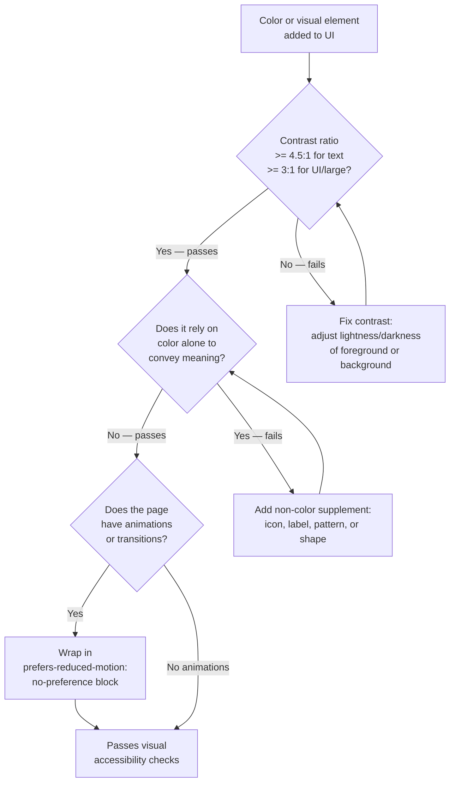

# Color, Contrast & Visual Accessibility

:::info
Color is the most over-relied-upon communication channel in UI design, and contrast is the most commonly violated WCAG criterion. Getting color right means understanding the mathematics of relative luminance, the biology of color vision deficiency, and the engineering of adaptive color systems.
:::

## Context

### Who is affected by poor color and contrast choices?

Poor color and contrast decisions affect a far larger population than most teams assume:

- **Low-vision users**: Approximately 246 million people worldwide have moderate-to-severe vision impairment. Many have reduced contrast sensitivity — they can see color, but low-contrast text or UI elements are difficult or impossible to read without magnification. Low contrast text directly violates WCAG 1.4.3.
- **Color-blind users**: Roughly 8% of males and 0.5% of females of Northern European descent have some form of color vision deficiency. Deuteranopia (reduced sensitivity to green) and protanopia (reduced sensitivity to red) together make red-green discrimination unreliable for this population. A red error state without a supporting icon or label is invisible as an error indicator for these users.
- **Aging users**: Contrast sensitivity declines with age. By age 70, the lens of the eye yellows and the pupil constricts, requiring approximately twice the contrast of a young adult to achieve equivalent legibility.
- **Users with photosensitivity**: Bright backgrounds or high-saturation color schemes can trigger discomfort or migraines for users with photosensitivity. Dark mode reduces the luminance load.
- **Users with dyslexia**: High contrast pure black-on-white text can cause a visual effect called "glare" or "halation" in some dyslexic readers. Slightly off-white backgrounds (e.g., #f8f8f8 or warm tones) reduce this effect while maintaining sufficient contrast.
- **Users with vestibular disorders**: Animations, parallax effects, and motion can cause vertigo and nausea in users with vestibular dysfunction. Approximately 35% of adults over 40 have experienced vestibular dysfunction. The `prefers-reduced-motion` media query allows these users to opt out.
- **Windows High Contrast Mode users**: Users on Windows can activate a high contrast mode that overrides all author-specified colors with a limited system palette. Sites that position color-dependent information without structural or semantic fallbacks break entirely in this mode.

### WCAG contrast requirements

WCAG 2.1 specifies contrast requirements under Success Criterion 1.4.3 (Contrast, Minimum) at Level AA and 1.4.6 (Contrast, Enhanced) at Level AAA. A separate criterion, 1.4.11 (Non-text Contrast), covers UI components and graphical objects.

| WCAG Criterion | Level | Requirement | Applies To |
|---|---|---|---|
| 1.4.3 Contrast (Minimum) | AA | 4.5:1 | Normal text (< 18pt / < 14pt bold) |
| 1.4.3 Contrast (Minimum) | AA | 3:1 | Large text (>= 18pt or >= 14pt bold) |
| 1.4.6 Contrast (Enhanced) | AAA | 7:1 | Normal text |
| 1.4.6 Contrast (Enhanced) | AAA | 4.5:1 | Large text |
| 1.4.11 Non-text Contrast | AA | 3:1 | UI components (borders, icons, focus indicators), graphical objects |

The contrast ratio is computed as `(L1 + 0.05) / (L2 + 0.05)` where L1 is the relative luminance of the lighter color and L2 is the relative luminance of the darker color.

### Tools for checking contrast

Several tools make it practical to verify contrast during development and design:

- **WebAIM Contrast Checker** (webaim.org/resources/contrastchecker/): Enter foreground and background hex values and immediately see contrast ratio, AA pass/fail, and AAA pass/fail. Also accepts link colors and has an eyedropper API in browsers that support it.
- **Chrome DevTools**: In the Elements panel, clicking any CSS color value opens a color picker with the computed contrast ratio displayed inline. The tooltip shows a checkmark for AA pass and a second checkmark for AAA pass. The DevTools also visualize which accessible colors are possible by shading the color picker gradient.
- **axe DevTools** (browser extension): Runs automated accessibility audits on the rendered page, flags contrast failures with the exact ratio and the minimum required ratio, and links to the WCAG criterion.
- **Figma plugins**: Contrast plugins (Able, Contrast, A11y Annotation Kit) allow designers to verify contrast ratios directly in design files before implementation.

### Color blindness: types and prevalence

Color vision deficiency is inherited (X-linked recessive) and affects cone photoreceptors in the retina:

- **Deuteranopia** (most common): Absence or malfunction of M-cones (medium wavelength, green-sensitive). Affects approximately 6% of males. Red and green appear as shades of yellow-brown. This is the "red/green color blindness" most people have heard of.
- **Protanopia**: Absence or malfunction of L-cones (long wavelength, red-sensitive). Affects approximately 2% of males. Red appears very dark; red-green discrimination is lost.
- **Tritanopia** (rare): Malfunction of S-cones (short wavelength, blue-sensitive). Affects less than 0.01% of the population. Blue-yellow discrimination is lost.
- **Achromatopsia**: Complete absence of color vision (monochromacy). Extremely rare (1 in 30,000). All color information is lost; vision is in shades of gray.

Combined, approximately 8% of males cannot reliably distinguish red from green. Any UI that uses red and green as the sole differentiator between states — error vs success, allowed vs forbidden, selected vs unselected — fails for these users.

### Don't rely on color alone

WCAG 1.4.1 (Use of Color, Level A) states: "Color is not used as the only visual means of conveying information, indicating an action, prompting a response, or distinguishing a visual element."

This is a Level A criterion — the minimum baseline. Relying on color alone is not just a Level AA or AAA concern; it is the floor requirement.

The fix is always to supplement color with at least one of:
- **Icons**: A red circle-minus for error, a green checkmark for success, a yellow triangle-warning for warning.
- **Labels**: The word "Error", "Success", or "Warning" in text alongside the color.
- **Patterns**: In charts and data visualizations, use hatching, dashing, or shape differences in addition to color.
- **Position or shape**: Error messages below a field, success indicators with a distinct shape.

### Dark mode: prefers-color-scheme

The `prefers-color-scheme` CSS media query, supported in all modern browsers since 2019, reflects the user's operating system color scheme preference (light or dark). CSS custom properties are the idiomatic way to implement dark mode theming because they cascade and can be overridden at any level of the DOM.

### Reduced motion: prefers-reduced-motion

The `prefers-reduced-motion` CSS media query reflects whether the user has requested reduced motion in their operating system accessibility settings. Vestibular disorders — conditions affecting the inner ear's balance and spatial orientation systems — cause animations and parallax to trigger real physical symptoms including dizziness, nausea, and disorientation.

The media query can be used in CSS with `@media (prefers-reduced-motion: reduce)` or `@media (prefers-reduced-motion: no-preference)`. The `no-preference` value is safer as a base: define animations under `no-preference`, and the default (no `@media`) is no animation, which is already appropriate for `reduce`.

### High contrast mode: forced-colors

Windows High Contrast Mode (WHCM) is an accessibility feature that overrides all author-defined colors with a system-enforced palette of approximately seven color keywords (`ButtonText`, `Canvas`, `CanvasText`, `Highlight`, `HighlightText`, `LinkText`, `GrayText`). CSS `background-image`, `box-shadow`, `text-shadow`, and most gradient effects are suppressed. The `forced-colors` media query, introduced in 2020, allows authors to detect this mode and adjust styles accordingly.

## Principle

> **SHOULD** meet WCAG AA contrast minimum — 4.5:1 for normal text, 3:1 for large text and UI component boundaries. Use automated tooling (axe, Lighthouse, DevTools contrast ratio) to verify during development, not just at design hand-off.
>
> **MUST NOT** use color as the only means of conveying information. Every color-coded state (error, warning, success, required, selected) must have a non-color supplement: an icon, a label, a pattern, or a structural indicator.
>
> **SHOULD** support `prefers-reduced-motion` by wrapping all CSS transitions and animations in a `@media (prefers-reduced-motion: no-preference)` block, ensuring users who have enabled reduced motion in their OS settings receive a motion-free experience.

## Design Thinking

### Why contrast ratios are mathematical

The WCAG contrast ratio formula is not arbitrary. It is derived from the **relative luminance** model of human vision. Relative luminance (L) for an sRGB color is computed by:

1. Normalize each channel (R, G, B) to the range 0–1.
2. Apply gamma correction: `c_linear = c / 12.92` if `c <= 0.04045`, else `c_linear = ((c + 0.055) / 1.055) ^ 2.4`.
3. Compute `L = 0.2126 * R_linear + 0.7152 * G_linear + 0.0722 * B_linear`.

The channel weights (0.2126, 0.7152, 0.0722) represent the luminance contribution of each primary in human photopic vision — green contributes roughly 72% of perceived brightness, red about 21%, and blue about 7%.

The **4.5:1 ratio threshold** was chosen because it approximates the contrast sensitivity required for a person with 20/40 vision (the standard for legal driving in many jurisdictions) to read normal-size text under typical office lighting. 20/40 vision means the person can read at 20 feet what a person with normal vision can read at 40 feet — a common consequence of uncorrected presbyopia (age-related farsightedness) or mild low vision.

The **7:1 AAA threshold** is calibrated for users with 20/80 vision who have some contrast sensitivity loss, approximately the threshold for legal blindness classification in some jurisdictions.

This mathematical grounding means the ratio is a real-world usability prediction, not an arbitrary compliance target.

### Why color-only information fails

Color blindness is not a rare edge case. Approximately 1 in 12 males and 1 in 200 females has some form of color vision deficiency. In a product with 10,000 daily users with a typical gender distribution, that is roughly 400 users who cannot reliably distinguish red from green.

A form with red-highlighted required fields — no asterisk, no label, no icon — communicates nothing useful to a deuteranope. A dashboard with green positive trends and red negative trends is indistinguishable to a protanope. A chart with red and green data series is meaningless to approximately 8% of the male population looking at it.

This is not a styling preference. It is a structural failure mode that excludes a statistically significant user population. WCAG 1.4.1 is Level A — the minimum — because the W3C recognized that color-only information is a basic exclusion mechanism.

The design solution requires no creative compromise: an icon or label costs nothing, takes one line of HTML, and simultaneously helps all users (most users read labels faster than decoding color semantics).

### Why prefers-reduced-motion is underused

The `prefers-reduced-motion` media query has broad browser support (all modern browsers since 2019), but it is implemented in perhaps 5–10% of production web applications. The gap is cultural: animation is associated with polish and brand quality, and accessibility is mentally bucketed as a separate concern.

The medical reality is stark. Vestibular disorders — including benign paroxysmal positional vertigo (BPPV), vestibular migraine, Meniere's disease, and labyrinthitis — are estimated to affect 35% of adults over age 40. For these users, unexpected parallax scrolling, autoplay hero animations, or loading spinners that move continuously can trigger vertigo that lasts hours.

The implementation cost is minimal. Wrapping animations in `@media (prefers-reduced-motion: no-preference)` — rather than the reduce-override pattern — means the default is no animation. Animations are opt-in for users who have not requested reduction. This is the safer default.

CSS frameworks like Tailwind CSS include a `motion-safe:` variant for exactly this reason, making it a one-word addition to any animated utility.

### Why dark mode accessibility matters

Dark mode is commonly discussed as an aesthetic or battery-saving feature, but it has direct accessibility implications:

- **Photosensitivity**: Users with photophobia, migraines, or certain medications-related sensitivity find high-luminance white backgrounds physically painful. Dark mode reduces peak brightness.
- **Dyslexia**: Some dyslexic users report that pure black text on white backgrounds causes a "visual noise" effect, where letters appear to vibrate or swim. Off-black text on a dark background (or cream text on a very dark background) can reduce this.
- **Low-light environments**: Users in dark environments use dark mode to avoid retinal adaptation issues that make returning to normal vision uncomfortable.

The key engineering concern in dark mode is that **contrast requirements do not relax**. A color scheme that passes 4.5:1 in light mode must also pass 4.5:1 in dark mode. Many dark mode implementations swap colors naively (black becomes white, white becomes black) without re-checking contrast for accent colors, link colors, or muted text. The result is a dark mode that fails WCAG even though the light mode passed.

## Visual

### Color accessibility decision tree



## Example

### 1. WCAG contrast levels at a glance

```css
/* ------- FAIL: insufficient contrast ------- */

/* White text on medium blue — 2.3:1 — fails AA for all text sizes */
.badge-fail {
  color: #ffffff;
  background-color: #6699cc;
}

/* Gray text on white — ~2.3:1 — fails AA for all text sizes */
.muted-fail {
  color: #aaaaaa;
  background-color: #ffffff;
}

/* ------- PASS: AA compliant ------- */

/* White text on dark blue — ~10.9:1 — passes AA and AAA */
.badge-pass-aaa {
  color: #ffffff;
  background-color: #003d80;
}

/* Dark gray text on white — ~16.1:1 — passes AA and AAA */
.body-text-pass {
  color: #222222;
  background-color: #ffffff;
}

/* Dark text on yellow — ~7.7:1 — passes AA for normal text */
.warning-badge-pass {
  color: #3d3000;
  background-color: #ffcc00;
}
```

### 2. Color-alone FAIL vs PASS: status indicator

```html
<!-- BAD: color is the only differentiator — invisible to color-blind users -->
<ul class="status-list">
  <li class="status status--error">Payment declined</li>
  <li class="status status--success">Profile updated</li>
  <li class="status status--warning">Session expiring soon</li>
</ul>

<!-- GOOD: color + icon + role label — readable regardless of color vision -->
<ul class="status-list">
  <li class="status status--error" role="alert">
    <svg aria-hidden="true" focusable="false" class="icon icon--error">
      <!-- circle with X icon paths -->
    </svg>
    <span class="status__label">Error:</span>
    Payment declined
  </li>
  <li class="status status--success">
    <svg aria-hidden="true" focusable="false" class="icon icon--success">
      <!-- checkmark icon paths -->
    </svg>
    <span class="status__label">Success:</span>
    Profile updated
  </li>
  <li class="status status--warning" role="status">
    <svg aria-hidden="true" focusable="false" class="icon icon--warning">
      <!-- triangle-exclamation icon paths -->
    </svg>
    <span class="status__label">Warning:</span>
    Session expiring soon
  </li>
</ul>
```

```css
/* Color provides redundant reinforcement; not the sole indicator */
.status--error  { color: #b91c1c; } /* red — also has error icon + "Error:" label */
.status--success { color: #15803d; } /* green — also has checkmark icon + "Success:" label */
.status--warning { color: #b45309; } /* amber — also has warning icon + "Warning:" label */

.status__label {
  font-weight: bold;
  margin-right: 0.25rem;
}
```

### 3. prefers-color-scheme dark mode with CSS custom properties

```css
/* Define the token layer — color semantics, not raw values */
:root {
  /* Light mode defaults */
  --color-bg-page:       #ffffff;
  --color-bg-surface:    #f4f4f5;
  --color-text-primary:  #111827;
  --color-text-muted:    #6b7280;
  --color-border:        #d1d5db;
  --color-link:          #1d4ed8;
  --color-focus-ring:    #2563eb;
  --color-status-error:  #b91c1c;
  --color-status-success: #15803d;
}

/* Dark mode — same token names, different values */
/* Contrast must be re-verified for each dark mode value */
@media (prefers-color-scheme: dark) {
  :root {
    --color-bg-page:       #111827;
    --color-bg-surface:    #1f2937;
    --color-text-primary:  #f9fafb;  /* 16.0:1 on #111827 — passes AAA */
    --color-text-muted:    #9ca3af;  /* 4.6:1 on #111827 — passes AA */
    --color-border:        #374151;
    --color-link:          #60a5fa;  /* 4.5:1 on #111827 — passes AA */
    --color-focus-ring:    #93c5fd;
    --color-status-error:  #fca5a5;  /* light red — passes contrast on dark bg */
    --color-status-success: #6ee7b7; /* light green — passes contrast on dark bg */
  }
}

/* Components consume tokens — they never hardcode raw color values */
body {
  background-color: var(--color-bg-page);
  color: var(--color-text-primary);
}

.card {
  background-color: var(--color-bg-surface);
  border: 1px solid var(--color-border);
}

a {
  color: var(--color-link);
}

/* Manual override: user explicitly chose dark mode via a toggle button */
/* Set data-theme="dark" on <html> to override OS preference */
[data-theme="dark"] {
  --color-bg-page:       #111827;
  --color-bg-surface:    #1f2937;
  --color-text-primary:  #f9fafb;
  --color-text-muted:    #9ca3af;
  --color-border:        #374151;
  --color-link:          #60a5fa;
  --color-focus-ring:    #93c5fd;
  --color-status-error:  #fca5a5;
  --color-status-success: #6ee7b7;
}
```

### 4. prefers-reduced-motion: disabling animations

```css
/* Pattern: define animations INSIDE the no-preference query.
   The default (outside the media query) is already motion-free.
   This is safer than the override pattern below. */

/* Safe base: no animation by default */
.btn {
  transition: none;
}

.spinner {
  animation: none;
}

.card {
  transform: none;
}

/* Animations are opt-in for users without a motion preference */
@media (prefers-reduced-motion: no-preference) {
  .btn {
    transition: background-color 0.2s ease, box-shadow 0.2s ease;
  }

  .spinner {
    animation: spin 1s linear infinite;
  }

  .card--enter {
    animation: slide-up 0.3s ease-out;
  }
}

@keyframes spin {
  to { transform: rotate(360deg); }
}

@keyframes slide-up {
  from {
    opacity: 0;
    transform: translateY(16px);
  }
  to {
    opacity: 1;
    transform: translateY(0);
  }
}

/* Alternative override pattern (common but less safe as a default):
   Define all animations normally, then disable inside reduce block */
@media (prefers-reduced-motion: reduce) {
  *,
  *::before,
  *::after {
    animation-duration: 0.01ms !important;
    animation-iteration-count: 1 !important;
    transition-duration: 0.01ms !important;
    scroll-behavior: auto !important;
  }
}
```

```js
// JavaScript: check prefers-reduced-motion before triggering JS-driven animations
const mq = window.matchMedia('(prefers-reduced-motion: reduce)');

function animateElement(el) {
  if (mq.matches) {
    // Skip animation entirely — apply final state immediately
    el.style.opacity = '1';
    el.style.transform = 'translateY(0)';
    return;
  }

  // Full animation for users who haven't opted out of motion
  el.animate(
    [
      { opacity: 0, transform: 'translateY(16px)' },
      { opacity: 1, transform: 'translateY(0)' }
    ],
    { duration: 300, easing: 'ease-out', fill: 'forwards' }
  );
}
```

Note: `mq.matches` is a static snapshot read at call time — it does not update if the user changes their OS motion preference while the page is open. In SPAs where the preference might change mid-session, add `mq.addEventListener('change', handler)` to react to live preference changes without requiring a page reload.

### 5. forced-colors media query for Windows High Contrast Mode

```css
/* Base styles — use color custom properties and semantic color keywords */
.btn {
  background-color: var(--color-brand);
  color: var(--color-on-brand);
  border: 2px solid transparent; /* transparent border is invisible in normal mode */
}

/* In forced-colors mode, most colors are replaced by system keywords.
   Transparent borders become invisible — add a ButtonText border so the
   button boundary is visible in high contrast mode. */
@media (forced-colors: active) {
  .btn {
    border-color: ButtonText;
    /* Use system color keywords to ensure WHCM compatibility */
    background-color: ButtonFace;
    color: ButtonText;
    /* forced-colors overrides box-shadow and SVG fills — use border instead */
    box-shadow: none;
  }

  /* Icons using SVG fill or background-image lose their color.
     Use currentColor for SVG paths to inherit ButtonText color. */
  .icon {
    fill: currentColor;
  }

  /* Ensure focus ring is visible — system FocusRing keyword */
  .btn:focus-visible {
    outline: 3px solid Highlight;
  }
}

/* System color keywords available in forced-colors context:
   ButtonBorder, ButtonFace, ButtonText, Canvas, CanvasText,
   Field, FieldText, GrayText, Highlight, HighlightText, LinkText,
   Mark, MarkText, SelectedItem, SelectedItemText, VisitedText */
```

```html
<!-- SVG icons: always use fill="currentColor" so they adapt to forced-colors -->
<svg aria-hidden="true" focusable="false" class="icon" viewBox="0 0 24 24">
  <path fill="currentColor" d="M9 16.17L4.83 12l-1.42 1.41L9 19 21 7l-1.41-1.41z"/>
</svg>
```

## Common Mistakes

### Checking contrast only at design time

Design-time contrast checks verify static mockups. The production UI may have:
- Semi-transparent overlays that change the effective background color.
- Text rendered over images or gradients.
- Dynamically colored text (e.g., user-specified theme colors).
- Hover or active states with different colors that were not verified.

Fix: use DevTools contrast ratio and axe during development to check the rendered output, not the design file. Automate contrast checks with axe-core in CI.

### Assuming dark mode is just an inversion

Many teams implement dark mode by swapping `#ffffff` to `#000000` and `#000000` to `#ffffff`. Accent colors, muted text, borders, and status colors rarely survive this inversion with acceptable contrast.

Fix: treat dark mode as a full redesign of the color system. Verify every token against its dark mode background value, especially muted text, link colors, and status indicator colors.

### Using color-only charts and data visualizations

Pie charts with six slices in red, orange, yellow, green, blue, and purple are illegible to deuteranopes: the red, orange, and yellow slices become nearly indistinguishable.

Fix: add data labels directly to chart segments, use distinct patterns or textures (hatching) in addition to color, and choose a colorblind-safe palette (e.g., the IBM Carbon accessible color pairs, or the ColorBrewer qualitative palettes designed for color vision deficiency).

### Adding prefers-reduced-motion as an afterthought

Adding a `prefers-reduced-motion: reduce` override at the end of a stylesheet with `!important` on duration values is a fragile, last-resort patch. It may not catch JavaScript-driven animations, Web Animations API calls, or third-party animation libraries.

Fix: structure animations with `prefers-reduced-motion: no-preference` from the beginning. Gate JavaScript animations on `matchMedia('(prefers-reduced-motion: reduce)').matches` before triggering them. For libraries like GSAP, use `gsap.globalTimeline.timeScale(0)` when reduced motion is requested.

### Hardcoding SVG fill colors

SVG icons with hardcoded fill hex values (`fill="#c0392b"`) become invisible or incorrect in forced-colors mode because WHCM cannot override inline fill attributes.

Fix: always use `fill="currentColor"` on SVG paths. The color is then inherited from the element's CSS `color` property, which WHCM can override with `ButtonText` or `CanvasText` as appropriate.

### Ignoring placeholder and muted text contrast

CSS `placeholder` text and "muted" secondary text frequently fall below 4.5:1 because designers intentionally de-emphasize them. But WCAG 1.4.3 applies to all text in the interface, including placeholder text and helper text.

Fix: muted text must still meet 4.5:1. Use opacity-based muting only if the resulting color on the actual background still meets the ratio. A common safe value is `--color-text-muted` at approximately `#6b7280` on white (#ffffff), which yields 4.6:1.

### Not testing in Windows High Contrast Mode

Many development environments are macOS or Linux, where High Contrast Mode (WHCM) is not available. Teams never test in WHCM and discover at launch that their site is unusable on Windows with accessibility settings enabled.

Fix: test in Windows with High Contrast Mode on. Alternatively, use Chrome DevTools' "Emulate CSS media feature forced-colors: active" in the Rendering panel. Also test the prefers-color-scheme and prefers-reduced-motion emulation settings in DevTools.

## Related FEEs

- [FEE-1000: Accessibility Overview](1000.md)
- [FEE-204: CSS Custom Properties for Theming](../CSS%20and%20Layout%20Systems/204.md)
- [FEE-1006: Automated Contrast Checking](1006.md)

## References

- [WCAG 2.1 Success Criterion 1.4.3: Contrast (Minimum) — W3C](https://www.w3.org/TR/WCAG21/#contrast-minimum)
- [WCAG 2.1 Success Criterion 1.4.1: Use of Color — W3C](https://www.w3.org/TR/WCAG21/#use-of-color)
- [WCAG 2.1 Success Criterion 1.4.11: Non-text Contrast — W3C](https://www.w3.org/TR/WCAG21/#non-text-contrast)
- [Understanding Relative Luminance — WCAG 2.1 Techniques (G17) — W3C](https://www.w3.org/TR/WCAG20-TECHS/G17.html)
- [WebAIM Contrast Checker — WebAIM](https://webaim.org/resources/contrastchecker/)
- [prefers-reduced-motion: Taking a no-motion-first approach to animations — CSS-Tricks](https://css-tricks.com/prefers-reduced-motion-taking-a-no-motion-first-approach-to-animations/)
- [forced-colors Media Query — MDN Web Docs](https://developer.mozilla.org/en-US/docs/Web/CSS/@media/forced-colors)
- [Color Blindness Prevalence — Colour Blind Awareness](https://www.colourblindawareness.org/colour-blindness/)
- [prefers-color-scheme — MDN Web Docs](https://developer.mozilla.org/en-US/docs/Web/CSS/@media/prefers-color-scheme)
- [Vestibular Disorders and Animations — A List Apart (Val Head)](https://alistapart.com/article/designing-safer-web-animation-for-motion-sensitivity/)
