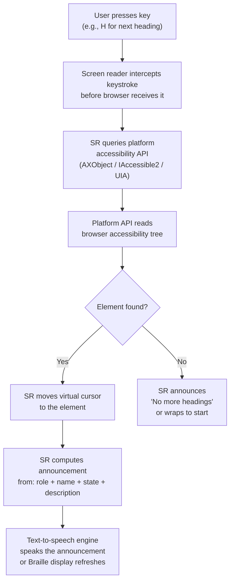
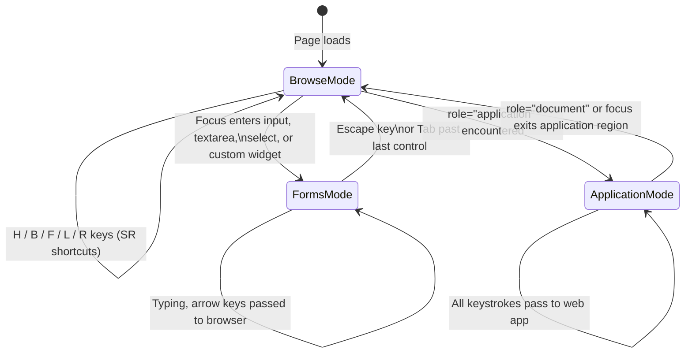

# Screen Readers & Assistive Technology

:::info
Screen readers do not read your page — they read the accessibility tree. Understanding how assistive technologies interact with that tree, which AT+browser pairings matter in production, and how users actually navigate with a keyboard transforms abstract accessibility rules into concrete engineering decisions.
:::

## Context

### What is a screen reader?

A **screen reader** is software that translates the accessibility tree into speech output (via a text-to-speech engine) or Braille output (via a refreshable Braille display). Screen readers are the primary assistive technology for users who are blind or have severe low vision, but they are also used by users with dyslexia, cognitive disabilities, and situational impairments (e.g., driving, cooking, eyes temporarily occupied).

Critically: a screen reader does **not** parse HTML directly. It queries the platform accessibility API — AXObject on macOS and iOS, IAccessible2 or UI Automation (UIA) on Windows, AT-SPI on Linux — which in turn reflects the browser's accessibility tree. This means:

1. Visual layout is invisible to a screen reader. A `<div>` styled to look like a button is not a button unless it has `role="button"` in the accessibility tree.
2. CSS `display: none` and `visibility: hidden` remove content from the accessibility tree entirely — intentional or not.
3. The announcement you hear is computed from the accessible name, role, state, and description — not from visual appearance, font size, or color.

### The accessibility tree vs the DOM

The browser builds the accessibility tree from the DOM, but they are not the same structure. Key differences:

- Purely presentational elements (empty `<div>`, `<span>`, layout wrappers with no semantic role) are often pruned or collapsed in the accessibility tree.
- Elements hidden with `aria-hidden="true"` are excluded from the tree, even if visually present.
- `aria-label`, `aria-labelledby`, and `aria-describedby` change the accessible name or description without touching the DOM text at all.
- Dynamically inserted content (notifications, modals, toast messages) does not automatically announce to the user — it requires ARIA live regions or explicit focus management.

### Browse mode vs application mode vs forms mode

Screen readers operate in different interaction modes depending on context. Understanding these modes is essential for building components that work correctly.

**Browse mode** (also called "reading mode" in some SRs) is the default mode. In browse mode:
- The screen reader intercepts most keystrokes before they reach the browser.
- Users navigate with a rich set of single-key commands: `H` for next heading, `B` for next button, `F` for next form control, `L` for next list, etc.
- The SR reads content sequentially and allows virtual cursor navigation through the accessibility tree.
- Most content-focused pages (articles, documentation, product listings) operate in browse mode.

**Forms mode** (NVDA) / **Interaction mode** (JAWS) activates when focus enters a form control or interactive widget:
- The screen reader passes keystrokes through to the browser instead of intercepting them.
- This allows text input, arrow-key navigation within comboboxes, date pickers, sliders, etc.
- NVDA enters forms mode automatically on focusable inputs; the user can also toggle it manually with `Enter` or `Space`.
- Exiting forms mode returns the user to browse mode.

**Application mode** is triggered by `role="application"` in the markup:
- The SR disables all browse-mode shortcuts and passes almost all keystrokes through to the web app.
- This is appropriate only for complex widgets that implement their own full keyboard interaction model (e.g., a spreadsheet editor, an IDE-style code editor).
- Using `role="application"` incorrectly — on a content region rather than a true application widget — destroys the user's ability to navigate with SR keyboard shortcuts. This is one of the most damaging ARIA misuses.

**Document mode** is explicit browse mode. `role="document"` (or a nested document inside an application) tells the SR to re-enable its reading shortcuts for the region.

### Major screen readers

| Screen Reader | OS | Cost | Primary Browser | Approx. Market Share (WebAIM 2024) |
|---|---|---|---|---|
| NVDA | Windows | Free (open source) | Chrome, Firefox | ~31% primary SR |
| JAWS | Windows | $90–$1,100/yr (enterprise) | Chrome, IE legacy | ~40% primary SR |
| VoiceOver | macOS | Built-in (free) | Safari | ~9% desktop |
| VoiceOver | iOS | Built-in (free) | Safari | ~71% of mobile SR users |
| TalkBack | Android | Built-in (free) | Chrome | ~24% of mobile SR users |
| Narrator | Windows | Built-in (free) | Edge | ~2–3% primary SR |

Notes on market share: WebAIM's Screen Reader User Survey (2024 edition) shows JAWS retaining enterprise dominance (long-standing corporate licenses, government mandates) while NVDA continues growing among home users and developers. On mobile, VoiceOver on iOS is the dominant platform — over 70% of mobile SR users — making it the non-negotiable mobile testing target.

### The AT and browser pairing problem

Screen readers do not interact with web pages in isolation. They consume accessibility information through the platform accessibility API, which is populated by a specific browser. The pairing matters because:

- **Different browsers expose the accessibility tree differently.** Chrome's implementation of ARIA live regions differs subtly from Firefox's. Safari's AXObject exposure of certain ARIA patterns differs from both.
- **Different SRs interpret the tree differently.** JAWS has decades of custom logic that works around historical browser bugs, some of which now produces incorrect announcements when those bugs are fixed. NVDA is closer to the spec but may announce things JAWS silently suppresses (or vice versa).
- **The announcement you hear is a product of SR + browser, not just HTML.** A correct `aria-label` on a button might be announced perfectly by NVDA+Chrome and ignored by an older JAWS+IE11 pairing.

This is why automated tools like axe-core can detect structural problems (missing labels, wrong roles, invalid ARIA usage) but cannot verify announcement phrasing — that requires manual testing with actual screen reader software.

### Testing matrix

The following pairings represent the production-realistic combinations that cover the vast majority of real-world AT users:

| Priority | Screen Reader | Browser | OS | Why |
|---|---|---|---|---|
| P1 | VoiceOver | Safari | iOS | 71%+ of mobile SR users; de facto mobile standard |
| P1 | NVDA | Chrome | Windows | Largest free SR; growing share; Chrome is dominant browser |
| P1 | JAWS | Chrome | Windows | Enterprise and government standard; critical for B2B products |
| P2 | VoiceOver | Safari | macOS | Mac power users and developers; catches macOS-specific issues |
| P2 | TalkBack | Chrome | Android | Android mobile; Chrome pairing is standard |
| P3 | NVDA | Firefox | Windows | Firefox-specific tree differences; useful for regression testing |
| P3 | Narrator | Edge | Windows | Built-in Windows SR; government kiosks, managed corporate devices |

P1 pairings should be tested in every accessibility audit. P2 adds coverage for secondary platforms. P3 is regression-oriented or compliance-driven.

### Why VoiceOver+Safari is the mobile testing baseline

iOS VoiceOver is not one option among many for mobile — it is the dominant mobile assistive technology. Several factors explain this:

1. **Market penetration**: Apple ships VoiceOver enabled on every iOS device since iPhone 3GS (2009). No installation required, no cost barrier.
2. **Usage data**: WebAIM's 2024 survey reports that among respondents who use a mobile screen reader as their primary or secondary SR, over 70% name VoiceOver on iOS.
3. **Browser restriction**: iOS allows only WebKit-based browsers (a platform policy). All browsers on iOS — Chrome, Firefox, Edge — run on WebKit. Safari therefore reflects the actual rendering engine used by every iOS browser. Testing VoiceOver+Safari covers the entire iOS browser surface.
4. **AT interaction layer**: VoiceOver interacts with iOS apps — including browsers — through UIAccessibility APIs. Testing on the actual device (not a simulator) is necessary to capture gesture-based navigation behavior (swipe left/right to move between elements, double-tap to activate).

### Switch access and alternative input

Beyond screen readers, other assistive technologies depend on a well-structured accessibility tree:

**Switch access** allows users with limited motor control to navigate interfaces using one or two physical switches (or sip-and-puff devices). The device cycles through focusable elements — scanning — and the user activates a switch to select. This makes:
- Correct tab order critical (logical DOM order)
- Efficient keyboard shortcuts and skip links valuable (reduce scan distance)
- Keyboard traps fatal (the user cannot escape without a switch reconfiguration)

**Voice control — Dragon NaturallySpeaking (Nuance Dragon)** allows users to navigate and interact with software entirely by voice:
- Users say "Click Submit" and Dragon identifies the submit button by its accessible name.
- If a button has no accessible name — or only an icon with no `aria-label` — Dragon cannot target it by voice.
- Dragon also supports "Click [number]" — it overlays numbers on all interactive elements — but the primary path is by accessible name.
- On macOS and iOS, the built-in Voice Control feature provides similar functionality.

**Eye tracking** (e.g., Tobii Dynavox) generates mouse-equivalent input from gaze position. The same keyboard and pointer accessibility that enables switch access and voice control also enables eye tracking.

---

## Design Thinking

### Why automated tools cannot fully replace manual SR testing

Automated accessibility checkers (axe-core, Lighthouse, IBM Equal Access) are invaluable for catching structural issues at scale. They can reliably detect:

- Missing image `alt` attributes
- Missing form labels
- Invalid ARIA role/property combinations
- Color contrast failures
- Missing document language

What they cannot detect is **how a screen reader announces your interface** to a user. This distinction matters enormously in practice:

- A button may have a technically valid accessible name but announce awkwardly: "button, icon-chevron-right-16px" because an icon library's SVG title was inadvertently included in the accessible name computation.
- An `aria-live` region may be structurally correct but announce at the wrong moment because of how a specific SR polls the accessibility tree.
- A custom combobox may pass axe validation but leave NVDA users stuck in forms mode with no way to close the dropdown using the keyboard pattern the SR expects.
- A modal dialog may receive focus correctly but JAWS may not restrict virtual cursor navigation within it (requiring `aria-modal="true"` as a supplementary hint — which axe does not enforce).

The announcement phrasing, timing, and mode-switching behavior of a component can only be validated by operating the actual screen reader software. Testing with at least NVDA+Chrome and VoiceOver+Safari covers the two largest user populations and the two most divergent accessibility tree implementations.

### Why heading hierarchy is navigation infrastructure

Sighted users scan a page visually: they skim headings, pull-quotes, and bullet-point summaries to orient themselves before reading in detail. Screen reader users navigate the same way — but through heading navigation shortcuts rather than visual scanning.

A page without headings is analogous to a technical manual with no chapter titles, section headers, or table of contents. A user who arrives at a 3,000-word article with no headings must listen to the screen reader read from the top, linearly, until they reach the content they need. There is no shortcut.

With correct headings:
- The user presses `H` to jump forward through headings or `Shift+H` to jump backward.
- In NVDA and JAWS, the Elements List (NVDA: `NVDA+F7`, JAWS: `Insert+F6`) shows all headings as a navigable list — equivalent to a dynamic table of contents.
- Heading level matters: `h1` is the page title, `h2` are major sections, `h3` are subsections. Skipping levels (jumping from `h1` to `h4`) creates false hierarchy that confuses the SR user's mental model of the page.

From an engineering standpoint, heading hierarchy should be treated as navigation API — a contract between the document and its AT users — not as a visual formatting choice. Visual size adjustments belong in CSS (`font-size`), not in the heading level (`h4` instead of `h2` because it "looks smaller").

### The NVDA+Chrome vs JAWS dynamic

NVDA and JAWS are both Windows screen readers that read the same HTML, but their histories, architectures, and behaviors differ substantially:

**JAWS** (Job Access With Speech) has been the enterprise standard for over 30 years. Corporate accessibility requirements, government procurement standards (Section 508), and many institutional AT programs default to JAWS. Its long history means:
- Extensive legacy heuristics that compensate for old browser bugs — some of which misfire on modern, spec-compliant browsers
- Slower adoption of new ARIA features (some ARIA 1.2 patterns only work correctly in recent JAWS versions)
- Predictable, well-documented behavior for common patterns that enterprise dev teams have optimized for
- High cost means home users and smaller organizations may use older versions

**NVDA** (NonVisual Desktop Access) is free, open-source, and actively developed. Its behavior is:
- Closer to the ARIA specification (fewer legacy workarounds)
- Faster to implement new ARIA patterns
- Preferred by many developers for day-to-day testing because it is free and lightweight
- Growing among individual users and in educational and non-profit contexts

The implication for testing: **NVDA+Chrome** is the right choice for catching specification-compliance issues and is the most accessible to developers without AT budgets. **JAWS+Chrome** is critical for products serving enterprise, government, or institutional users. Testing both exposes divergent behaviors that a single pairing would miss.

### Why SR testing requires actual devices and real SR software

Simulators and emulators do not faithfully reproduce AT behavior:
- The iOS Simulator does not accurately reproduce VoiceOver gesture behavior
- Automated SR simulation tools produce idealized announcements rather than real ones
- Browser DevTools "accessibility mode" shows the tree but not how any given SR traverses or announces it

Reliable SR testing requires:
1. A real Windows machine (or VM) with NVDA installed (free from nvaccess.org)
2. A JAWS license for enterprise testing (or a timed evaluation license)
3. A physical iPhone or iPad with VoiceOver enabled
4. An Android device with TalkBack enabled

---

## Best Practices

**SHOULD test with at least NVDA+Chrome and VoiceOver+Safari as the primary testing matrix before shipping accessible features.** These two pairings cover the largest Windows and mobile screen reader populations and expose the two most divergent accessibility tree implementations. NVDA+Chrome reveals specification-compliance issues; VoiceOver+Safari covers over 70% of mobile screen reader users. MUST test both before any release involving new interactive components or flows.

**MUST NOT use `role="application"` on content regions.** Application mode disables all browse-mode keyboard shortcuts — the single-key navigation by heading (H), button (B), form control (F), link (K), and landmark (R) that screen reader users depend on. MUST reserve `role="application"` exclusively for genuine application widget regions such as a code editor or spreadsheet where the widget itself defines a complete keyboard interaction model. Misapplying it to documentation, article, or page content regions renders those regions effectively unnavigable for screen reader users.

**SHOULD test with real screen reader software, not DevTools simulations.** Browser accessibility panels show the computed accessibility tree but cannot replicate how NVDA, JAWS, or VoiceOver traverses, modes-switches, or announces content. Automated tools like axe-core detect structural problems but cannot verify announcement phrasing, live region timing, or forms-mode behavior. MUST run manual screen reader testing on every new interactive component before shipping — no tool substitutes for this.

## Visual

### Screen reader interaction flow



### Browse mode vs forms mode transition



---

## Example

### SR keyboard navigation shortcuts

The following shortcuts apply in browse mode. They work in NVDA and JAWS unless noted. VoiceOver on macOS uses the VoiceOver modifier key (Caps Lock or Control+Option) in combination with arrow keys rather than single-key shortcuts.

| Element Type | Move Forward | Move Backward | NVDA Elements List |
|---|---|---|---|
| Heading (any level) | `H` | `Shift+H` | `NVDA+F7`, then filter Headings |
| Heading level 1 | `1` | `Shift+1` | — |
| Heading level 2 | `2` | `Shift+2` | — |
| Heading level 3 | `3` | `Shift+3` | — |
| Landmark / Region | `R` (NVDA) / `;` or `R` (JAWS 2019+) | `Shift+R` | `NVDA+F7`, then filter Landmarks |
| Form control | `F` | `Shift+F` | — |
| Button | `B` | `Shift+B` | — |
| Link | `K` (NVDA) / `Tab` | `Shift+K` | `NVDA+F7`, then filter Links |
| List | `L` | `Shift+L` | — |
| List item | `I` | `Shift+I` | — |
| Table | `T` | `Shift+T` | — |
| Table cell (in table) | `Ctrl+Alt+Arrow` | — | Navigate table grid |
| Image | `G` | `Shift+G` | — |
| Next focusable element | `Tab` | `Shift+Tab` | — |

VoiceOver on iOS uses gestures:
- **Swipe right**: next element
- **Swipe left**: previous element
- **Double-tap**: activate element
- **Three-finger swipe up/down**: scroll
- **Rotor (two-finger twist)**: change navigation mode (Headings, Links, Form Controls, etc.)

### Good heading hierarchy vs missing headings

**What a page with correct headings sounds like to a screen reader user:**

```html
<!-- Good: Clear hierarchy the SR can navigate -->
<h1>API Reference — Authentication</h1>

<h2>Overview</h2>
<p>This API uses Bearer token authentication...</p>

<h2>Getting a token</h2>
<h3>Using the dashboard</h3>
<p>Navigate to Settings > API Keys...</p>

<h3>Using the CLI</h3>
<p>Run: auth login --scope read:all</p>

<h2>Token expiration</h2>
<p>Tokens expire after 90 days...</p>
```

With this structure, an NVDA user pressing `H` repeatedly hears:
> "API Reference — Authentication, heading level 1"
> "Overview, heading level 2"
> "Getting a token, heading level 2"
> "Using the dashboard, heading level 3"
> "Using the CLI, heading level 3"
> "Token expiration, heading level 2"

The user can jump directly to "Token expiration" without listening to the preceding content.

**What a page with no headings sounds like:**

```html
<!-- Bad: No structural landmarks for navigation -->
<div class="title">API Reference — Authentication</div>
<div class="section-title">Overview</div>
<p>This API uses Bearer token authentication...</p>
<div class="section-title">Getting a token</div>
<!-- ... 800 more words ... -->
```

Pressing `H` in NVDA produces: "No headings found." The user must `Tab` or `Down Arrow` through every element sequentially to find the section they need.

### Browse mode to forms mode transition example

```html
<!-- The SR is in browse mode. User presses F (form control) -->
<form>
  <label for="email">Email address</label>
  <input type="email" id="email" name="email">
  <!-- Focus arrives here. SR announces:
       "Email address, edit, type in text" (NVDA)
       "Email address, edit text" (JAWS)
       SR automatically enters forms mode.
       H, B, L keys now type letters, not navigate. -->

  <label for="country">Country</label>
  <select id="country" name="country">
    <option value="tw">Taiwan</option>
    <option value="us">United States</option>
  </select>
  <!-- SR announces: "Country, list box, Taiwan" -->

  <button type="submit">Submit</button>
  <!-- Tab to button. SR exits forms mode.
       NVDA announces: "Submit, button" -->
</form>
```

### What Dragon NaturallySpeaking needs to target a button

```html
<!-- Good: Dragon can say "Click Submit order" -->
<button type="submit">Submit order</button>

<!-- Good: aria-label provides the voice target -->
<button type="submit" aria-label="Submit order">
  <svg aria-hidden="true" focusable="false"><!-- icon --></svg>
</button>

<!-- Bad: No accessible name. Dragon cannot target this by voice. -->
<!-- User must say "Click 3" (overlay numbers) — inefficient and error-prone -->
<button type="submit">
  <svg><!-- icon with no title, no aria-label --></svg>
</button>
```

### ARIA live region for dynamic announcements

```html
<!-- Status message that announces without moving focus -->
<div
  role="status"
  aria-live="polite"
  aria-atomic="true"
  class="sr-only"
>
  <!-- Inject text here dynamically: "3 results found" -->
  <!-- SR announces when content changes, without interrupting current speech -->
</div>

<!-- Urgent error — interrupts current announcement -->
<div
  role="alert"
  aria-live="assertive"
  aria-atomic="true"
>
  <!-- "Error: Session expired. Please log in again." -->
</div>
```

Note: injecting content into a pre-existing live region works more reliably across SR+browser combinations than creating and immediately populating a new live region. Create the empty container on page load; inject messages into it dynamically.

---

## Common Mistakes

### Skipping heading levels

```html
<!-- Bad: Jumps from h1 to h4 — creates false hierarchy -->
<h1>Settings</h1>
<h4>Account</h4>   <!-- visually styled to look like h2 but semantically h4 -->
<h4>Security</h4>

<!-- Good: Use CSS for visual sizing, correct levels for structure -->
<h1>Settings</h1>
<h2>Account</h2>
<h2>Security</h2>
```

### Using `aria-hidden` on focusable elements

```html
<!-- Bad: Element is hidden from SR but still receives Tab focus -->
<!-- SR announces nothing; user is confused about where focus went -->
<button aria-hidden="true">Close</button>

<!-- Good: If hidden from SR, also remove from tab order -->
<button aria-hidden="true" tabindex="-1">Close</button>
<!-- Or: remove the button from the DOM entirely when not needed -->
```

### Populating a live region immediately after creation

```javascript
// Bad: SR may not register the live region before the announcement fires
const el = document.createElement('div');
el.setAttribute('role', 'status');
el.setAttribute('aria-live', 'polite');
el.textContent = '3 results found'; // May not announce
document.body.appendChild(el);

// Good: Create the region on load, inject text later
// HTML: <div role="status" aria-live="polite" id="sr-status"></div>
document.getElementById('sr-status').textContent = '3 results found';
```

### Modal dialogs without focus trapping

```html
<!-- If focus escapes the modal, SR users can navigate behind it -->
<!-- with virtual cursor (browse mode), accessing content that is -->
<!-- visually obscured. Implement focus trapping AND aria-modal="true" -->

<div role="dialog" aria-modal="true" aria-labelledby="dialog-title">
  <h2 id="dialog-title">Confirm deletion</h2>
  <p>This action cannot be undone.</p>
  <button>Cancel</button>
  <button>Delete</button>
  <!-- Focus must cycle between Cancel and Delete; -->
  <!-- Escape key must close the dialog and return focus to the trigger -->
</div>
```

### Using placeholder as the only label

```html
<!-- Bad: Placeholder disappears on input; SR may announce it unreliably -->
<input type="email" placeholder="Email address">

<!-- Good: Visible label with for/id association -->
<label for="email">Email address</label>
<input type="email" id="email" placeholder="name@example.com">
```

---

## Related FEEs

- [FEE-1000: Accessibility Overview](1000.md) — The full a11y landscape: WCAG, POUR principles, legal requirements
- [FEE-1001: ARIA & Semantic HTML](1001.md) — How the accessibility tree is built; when to use ARIA vs native HTML
- [FEE-1002: Keyboard Navigation & Focus Management](1002.md) — keyboard navigation modes (browse, forms, application) discussed in context of screen reader interaction
- [FEE-1006: Screen Reader Testing in CI](1006.md) — Integrating SR testing into automated pipelines

---

## References

1. **WebAIM Screen Reader User Survey #10 (2024)** — https://webaim.org/projects/screenreadersurvey10/
   The primary source for SR market share data, browser pairings, and user preferences. Run periodically since 2009; the 2024 edition covers NVDA, JAWS, VoiceOver, TalkBack, Narrator, and ORCA usage and preferences.

2. **W3C WAI — Understanding browse mode and forms mode (ARIA Authoring Practices Guide)** — https://www.w3.org/WAI/ARIA/apg/
   The APG documents expected keyboard interaction patterns for ARIA widget roles and explains when mode switching occurs. Includes working examples for comboboxes, dialogs, tree views, tabs, and more.

3. **Deque Systems — Screen Reader Testing** — https://dequeuniversity.com/screenreaders/
   Deque University's SR testing guides for NVDA, JAWS, VoiceOver, and TalkBack. Includes keyboard shortcut references, testing procedures, and SR-specific gotchas.

4. **Apple Developer — Accessibility on iOS (VoiceOver)** — https://developer.apple.com/accessibility/
   Apple's authoritative documentation for VoiceOver gestures, UIAccessibility APIs, and iOS AT integration. Essential reference for understanding why iOS VoiceOver+Safari is the mobile baseline.

5. **NVDA User Guide** — https://www.nvaccess.org/files/nvda/documentation/userGuide.html
   NV Access's official guide covering NVDA's modes, keyboard shortcuts, Elements List, settings, and SR+browser pairing behavior. Free reference for any developer testing with NVDA.
