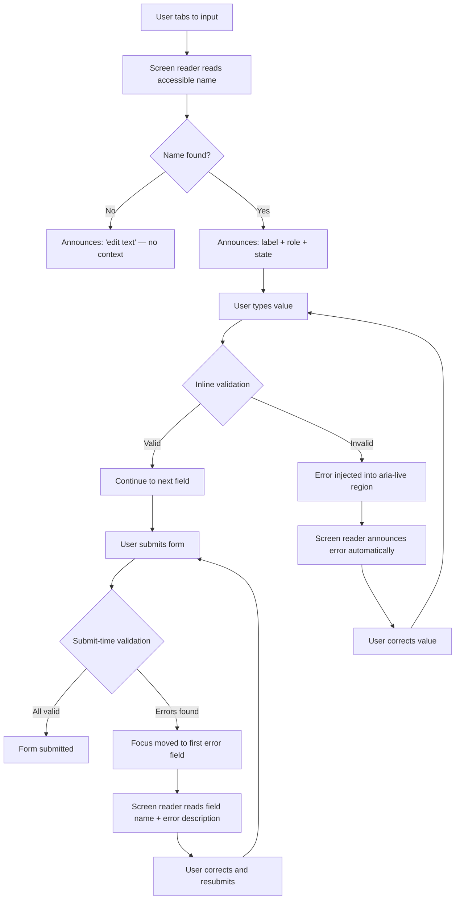

# Accessible Forms & Inputs

:::info
Forms are the most interaction-dense parts of any web application. They are also where accessibility breaks down most often. Every input needs an accessible name, every error message needs to be associated with its field, and every group of related controls needs a structural container. Getting this right means every user — sighted or not — can complete the task.
:::

## Context

### Why forms are a high-risk zone for accessibility

HTML forms — login screens, checkout flows, search filters, settings panels — are the mechanisms through which users accomplish goals. When a form is inaccessible, the user cannot complete the task at all. This is not a degraded experience; it is a blocked experience.

Screen reader users interact with forms in a specific way: they tab through controls in focus order, and for each control the screen reader announces the **accessible name** (what the field is for), the **role** (text input, checkbox, combobox, etc.), and **state** (required, invalid, checked). If any of that information is missing or wrong, the user is navigating blind.

Keyboard-only users share the same focus-order dependency. Motor-impaired users relying on switch access or voice control depend on visible, accurate labels to target controls by name.

The key insight is that accessibility in forms is not about adding ARIA decorations after the fact — it is about structuring the HTML correctly from the start. Most accessible form behavior is built into the browser for free when you use the right native elements.

### The accessible name computation

Every interactive element has an **accessible name** — the string the screen reader announces when the element receives focus. For form controls, the accessible name is computed from several sources in priority order:

1. `aria-labelledby` — references one or more elements by ID; their text content is concatenated
2. `aria-label` — a direct string, no visible element required
3. The associated `<label>` element — either via `for`/`id` binding or by wrapping the control
4. The `title` attribute — fallback, not recommended as a primary label
5. The `placeholder` attribute — last resort, and a very poor one (see Design Thinking)

Understanding this computation order explains why certain patterns work and others silently fail.

### Forms mode and screen reader behavior

When a screen reader user moves focus into a form control, most screen readers switch from browse mode into **forms mode** (NVDA) or **interaction mode** (JAWS). In this mode:

- Keystrokes are passed through to the browser rather than intercepted by the screen reader.
- The screen reader reads the accessible name, role, and state of the focused control.
- Surrounding text that is not explicitly associated with the input is **not read**.

This is why the visual proximity of a label to an input is completely irrelevant to accessibility: a `<p>` visually positioned above an `<input>` provides zero accessible name to that input unless it is programmatically associated.

### WCAG requirements

Accessible forms touch several WCAG 2.1 Level AA success criteria:

- **1.3.1 Info and Relationships** — structure and relationships conveyed through presentation must be programmatically determinable
- **1.3.5 Identify Input Purpose** — the purpose of each input collecting personal data must be programmatically determinable (autocomplete)
- **2.4.6 Headings and Labels** — labels must describe their purpose
- **3.3.1 Error Identification** — if an input error is detected, the item in error and a description of the error must be presented to the user in text
- **3.3.2 Labels or Instructions** — labels or instructions must be provided for content requiring user input
- **4.1.3 Status Messages** — status messages must be programmatically determinable (live regions)

---

## Design Thinking

### Why every input needs an accessible name

When a screen reader user tabs into an input with no accessible name, the screen reader announces something like "edit text" or "text field" — role only, no context. The user has no idea what they are supposed to type. They must navigate backwards to read surrounding text, hoping to infer the purpose — if surrounding text is even in the right reading order.

This is not a hypothetical inconvenience. In a login form with two unlabeled inputs, a screen reader user hears "edit text, edit text" and cannot distinguish the email field from the password field without reading the entire surrounding page.

The fix is architectural, not cosmetic: every `<input>`, `<textarea>`, and `<select>` must have a programmatic association with its label. Visual proximity is not enough.

### Why placeholder text fails as a label

Placeholder text seems like a reasonable label substitute at first glance. In practice it fails in at least three ways:

**1. It disappears when the user starts typing.** Users who have a slow processing speed, memory impairment, or who are re-checking their input must clear the field to recall what it was asking — or rely on external memory.

**2. Contrast is typically insufficient.** WCAG 1.4.3 requires a 4.5:1 contrast ratio for normal text. Most placeholder styling uses a 40-50% opacity gray that falls well below this threshold. Browsers often apply `color: graytext` by default, which fails on many background colors.

**3. Screen readers handle it inconsistently.** Some screen readers read the placeholder as the accessible name if no other name is available; others do not. The behavior varies by browser+SR combination. You cannot depend on it.

The correct pattern: always include a `<label>` element. If the design requires a no-visible-label look (e.g., a search bar where the button context makes the purpose clear), use `aria-label` or visually-hidden label technique — not placeholder.

### Why fieldset + legend is required for radio groups

Consider a radio group asking "Do you agree to the terms?". The two options are "Yes" and "No". Each radio button, when focused individually, has an accessible name of "Yes" or "No". Without a fieldset and legend, that is all the screen reader announces: "Yes, radio button, 1 of 2." The user has no idea what question they are answering.

With `<fieldset>` and `<legend>Do you agree to the terms?</legend>`, screen readers announce: "Do you agree to the terms? Yes, radio button, 1 of 2." The group context travels with every option.

This matters even more when there are multiple radio groups on a single page. Without legend context, "Small, Medium, Large" and "Poor, Good, Excellent" options are completely ambiguous to a non-visual user.

The same logic applies to checkbox groups: a set of checkboxes for "Select your interests" needs a fieldset+legend to convey the grouping question.

### Why custom select components are accessibility nightmares

Native `<select>` is a solved problem. Every browser ships a working implementation with:
- Full keyboard navigation (arrow keys, type-ahead)
- Screen reader announcement of selected option and total count
- Touch-friendly UI on mobile
- OS-level styling integration
- Zero JavaScript required

The ARIA combobox pattern (`role="combobox"`, `aria-expanded`, `aria-controls`, `aria-activedescendant`) is the specification for building a custom select-like widget. It requires:
- Managing `aria-expanded` on open/close
- Managing `aria-activedescendant` to track keyboard focus within the listbox
- Implementing keyboard interaction: `ArrowDown`, `ArrowUp`, `Home`, `End`, `Enter`, `Escape`, `Tab`, type-ahead character search
- Managing focus correctly when the listbox opens and closes
- Handling mobile/touch separately
- Testing across NVDA+Firefox, JAWS+Chrome, VoiceOver+Safari — each of which has quirks in how they handle combobox patterns

This is 20+ lines of non-trivial keyboard event handling for a widget that does exactly what `<select>` does. The only legitimate reason to build a custom combobox is when native `<select>` cannot meet a specific requirement (e.g., rendering rich content with images inside options, or supporting multi-column layouts). Even then, use an established library like Headless UI or Radix UI rather than rolling your own.

---

## Best Practices

**MUST associate every input with a visible label — not a placeholder, not a title attribute, not a visually adjacent paragraph.** When a screen reader user tabs into a form control, it announces the accessible name, role, and state. If the accessible name is missing, the user hears only "edit text" with no context. The correct pattern MUST be an explicit `<label>` with a `for`/`id` binding, a wrapping `<label>`, or `aria-label` when no visible label is possible. Placeholder text disappears when the user starts typing and is treated inconsistently across screen reader and browser combinations.

**MUST associate every error message with its input via `aria-describedby`.** An error message that is visually adjacent to a field but not programmatically linked is invisible to screen reader users in forms mode — only the accessible name, role, and state of the focused control are announced, not surrounding text. MUST set `aria-describedby` on the input referencing the error element's `id`, and also set `aria-invalid="true"` on the input when an error is present, so the screen reader announces "invalid entry" along with the error description when the field receives focus.

**SHOULD use native `<select>` before building a custom combobox.** The native `<select>` element provides full keyboard navigation (arrow keys, type-ahead), screen reader announcement of selected option and count, and mobile-native UI without any JavaScript. The ARIA combobox pattern requires implementing `aria-expanded`, `aria-activedescendant`, keyboard handling for ArrowDown, ArrowUp, Home, End, Enter, Escape, Tab, and type-ahead character search — and varies in behavior across NVDA+Chrome, JAWS+Chrome, and VoiceOver+Safari. SHOULD build a custom combobox only when native `<select>` cannot meet the requirement.

## Visual

Form accessibility data flow from input focus through error announcement:



---

## Example

### 1. Label association — four methods

```html
<!-- METHOD 1: Explicit label with for/id binding (recommended) -->
<label for="email">Email address</label>
<input type="email" id="email" name="email" autocomplete="email" />

<!-- METHOD 2: Implicit label (wrapping) — accessible, but for/id is more robust -->
<label>
  Password
  <input type="password" name="password" autocomplete="current-password" />
</label>

<!-- METHOD 3: aria-label — for cases where a visible label is not desired -->
<input
  type="search"
  aria-label="Search products"
  placeholder="Search…"
/>

<!-- METHOD 4: aria-labelledby — reference existing text as the label -->
<h2 id="shipping-heading">Shipping address</h2>
<label for="street">Street</label>
<input type="text" id="street" aria-labelledby="shipping-heading street-label" />
<span id="street-label" class="visually-hidden">Street address line 1</span>

<!-- BAD: placeholder only — no accessible name when user starts typing -->
<!-- Do not do this -->
<input type="email" placeholder="Enter your email" />
```

### 2. Fieldset + legend for radio groups

```html
<!-- BAD: radio group without fieldset — SR announces "Yes, radio button" with no question context -->
<p>Do you agree to the terms?</p>
<input type="radio" id="agree-yes" name="agree" value="yes" />
<label for="agree-yes">Yes</label>
<input type="radio" id="agree-no" name="agree" value="no" />
<label for="agree-no">No</label>

<!-- GOOD: fieldset + legend provides group context with every option -->
<fieldset>
  <legend>Do you agree to the terms?</legend>
  <input type="radio" id="agree-yes" name="agree" value="yes" />
  <label for="agree-yes">Yes</label>
  <input type="radio" id="agree-no" name="agree" value="no" />
  <label for="agree-no">No</label>
</fieldset>

<!-- GOOD: checkbox group — same principle applies -->
<fieldset>
  <legend>Select your interests</legend>
  <input type="checkbox" id="interest-design" name="interests" value="design" />
  <label for="interest-design">Design</label>
  <input type="checkbox" id="interest-eng" name="interests" value="engineering" />
  <label for="interest-eng">Engineering</label>
  <input type="checkbox" id="interest-pm" name="interests" value="pm" />
  <label for="interest-pm">Product Management</label>
</fieldset>
```

### 3. Error messages with aria-describedby and aria-live

```html
<!-- BAD: error exists visually but has no association with the input -->
<label for="username">Username</label>
<input type="text" id="username" />
<p class="error">Username is required.</p>
<!-- SR user tabs back to the input and hears only: "Username, edit text" — no error -->

<!-- GOOD: error is associated via aria-describedby and injected into a live region -->
<label for="username">Username</label>
<input
  type="text"
  id="username"
  aria-describedby="username-error"
  aria-invalid="true"
/>
<p id="username-error" class="error" role="alert">
  Username is required.
</p>
<!--
  When SR focuses the input: "Username, edit text, invalid entry, Username is required."
  role="alert" is an implicit aria-live="assertive" — the error is announced immediately
  when it appears in the DOM, even without focus change.
-->

<!-- ALTERNATIVE: explicit aria-live region for inline validation feedback -->
<label for="password">Password</label>
<input
  type="password"
  id="password"
  aria-describedby="password-hint password-error"
/>
<p id="password-hint">Must be at least 8 characters.</p>
<p id="password-error" aria-live="polite" class="error"></p>
<!--
  aria-live="polite" announces the error after the current speech finishes.
  Use "assertive" only for critical errors that need immediate interruption.
  JavaScript sets textContent of #password-error when validation runs.
-->
```

**JavaScript to inject error:**

```js
function showError(inputId, errorId, message) {
  const input = document.getElementById(inputId);
  const errorEl = document.getElementById(errorId);

  input.setAttribute('aria-invalid', 'true');
  errorEl.textContent = message;
  // aria-live polite will announce this update automatically
}

function clearError(inputId, errorId) {
  const input = document.getElementById(inputId);
  const errorEl = document.getElementById(errorId);

  input.removeAttribute('aria-invalid');
  errorEl.textContent = '';
}
```

### 4. Required fields

```html
<!-- Native required attribute triggers browser validation UI and sets aria-required implicitly -->
<label for="email">
  Email address
  <span aria-hidden="true">*</span>
  <span class="visually-hidden">(required)</span>
</label>
<input type="email" id="email" required />

<!-- Explicit aria-required for custom validation flows where you suppress native UI -->
<label for="phone">Phone number</label>
<input
  type="tel"
  id="phone"
  aria-required="true"
  aria-describedby="phone-format"
/>
<p id="phone-format">Format: +1 (555) 000-0000</p>
<!--
  Note: required and aria-required="true" are equivalent in accessibility tree terms.
  Use required for native browser validation; add aria-required="true" only when
  you are handling validation entirely in JavaScript and have disabled native UI
  with novalidate on the form.
-->

<!-- Form-level required field legend -->
<p><span aria-hidden="true">*</span> indicates required fields</p>
```

### 5. Autocomplete attribute

```html
<!-- Autocomplete attribute enables browser autofill AND satisfies WCAG 1.3.5 -->
<!-- Full list: https://html.spec.whatwg.org/multipage/form-control-infrastructure.html#autofill -->

<label for="name">Full name</label>
<input type="text" id="name" name="name" autocomplete="name" />

<label for="email">Email</label>
<input type="email" id="email" name="email" autocomplete="email" />

<label for="tel">Phone</label>
<input type="tel" id="tel" name="tel" autocomplete="tel" />

<label for="street">Street address</label>
<input type="text" id="street" name="street" autocomplete="street-address" />

<label for="city">City</label>
<input type="text" id="city" name="city" autocomplete="address-level2" />

<label for="country">Country</label>
<select id="country" name="country" autocomplete="country">
  <option value="">Select a country</option>
  <option value="US">United States</option>
  <option value="TW">Taiwan</option>
</select>

<!-- Credit card section — use autocomplete="cc-*" tokens -->
<label for="cc-number">Card number</label>
<input type="text" id="cc-number" name="cc-number" autocomplete="cc-number" inputmode="numeric" />

<label for="cc-exp">Expiry date</label>
<input type="text" id="cc-exp" name="cc-exp" autocomplete="cc-exp" />

<label for="cc-csc">Security code</label>
<input type="text" id="cc-csc" name="cc-csc" autocomplete="cc-csc" inputmode="numeric" />
```

### 6. Native select vs custom combobox complexity

```html
<!-- NATIVE SELECT — works everywhere, free keyboard nav, SR support built in -->
<label for="country-select">Country</label>
<select id="country-select" name="country" autocomplete="country">
  <option value="">— Select —</option>
  <option value="US">United States</option>
  <option value="TW">Taiwan</option>
  <option value="JP">Japan</option>
</select>
```

```html
<!-- CUSTOM COMBOBOX (ARIA pattern) — everything you must implement yourself -->
<label id="country-label">Country</label>
<div
  role="combobox"
  aria-labelledby="country-label"
  aria-expanded="false"
  aria-haspopup="listbox"
  aria-controls="country-listbox"
  tabindex="0"
  id="country-combobox"
>
  <span id="country-selected-value">— Select —</span>
</div>
<ul
  role="listbox"
  id="country-listbox"
  aria-labelledby="country-label"
  hidden
>
  <li role="option" aria-selected="false" data-value="US">United States</li>
  <li role="option" aria-selected="false" data-value="TW">Taiwan</li>
  <li role="option" aria-selected="false" data-value="JP">Japan</li>
</ul>
```

```js
// What you must implement for the custom combobox to be accessible:
const combobox = document.getElementById('country-combobox');
const listbox  = document.getElementById('country-listbox');
const options  = listbox.querySelectorAll('[role="option"]');
let activeIndex = -1;

combobox.addEventListener('keydown', (e) => {
  switch (e.key) {
    case 'ArrowDown':
      e.preventDefault();
      openListbox();
      moveActiveOption(1);
      break;
    case 'ArrowUp':
      e.preventDefault();
      openListbox();
      moveActiveOption(-1);
      break;
    case 'Home':
      e.preventDefault();
      setActiveOption(0);
      break;
    case 'End':
      e.preventDefault();
      setActiveOption(options.length - 1);
      break;
    case 'Enter':
    case ' ':
      if (!listbox.hidden) {
        selectActiveOption();
      } else {
        openListbox();
      }
      break;
    case 'Escape':
      closeListbox();
      break;
    case 'Tab':
      closeListbox();
      break;
    default:
      // Type-ahead character search
      handleTypeAhead(e.key);
  }
});

// Plus: click handling, outside-click dismissal, touch events, focus management,
// aria-activedescendant updates, option selection announcement...
// This is why you use native <select>.
```

---

## Common Mistakes

### 1. Radio group without fieldset + legend

```html
<!-- Wrong -->
<p>Shirt size</p>
<input type="radio" id="sm" name="size" value="S" /><label for="sm">Small</label>
<input type="radio" id="md" name="size" value="M" /><label for="md">Medium</label>

<!-- Right -->
<fieldset>
  <legend>Shirt size</legend>
  <input type="radio" id="sm" name="size" value="S" /><label for="sm">Small</label>
  <input type="radio" id="md" name="size" value="M" /><label for="md">Medium</label>
</fieldset>
```

### 2. Marking only visual asterisk as required without text alternative

```html
<!-- Wrong: SR user hears no indication the field is required -->
<label for="name">Name *</label>
<input type="text" id="name" />

<!-- Right: asterisk hidden from SR, supplemented with explicit required attribute -->
<label for="name">
  Name <span aria-hidden="true">*</span>
</label>
<input type="text" id="name" required />
<!-- Or: provide a visually-hidden "(required)" span inside the label -->
```

### 3. Disabling native form validation without providing an accessible alternative

```html
<!-- If you use novalidate, you own ALL validation and error announcement -->
<form novalidate>
  <label for="email">Email</label>
  <input type="email" id="email" aria-describedby="email-error" aria-required="true" />
  <p id="email-error" role="alert"></p>
  <!-- JavaScript must: validate on submit, inject error text, set aria-invalid,
       move focus to first error field, announce errors via live region -->
</form>
```

### 4. Forgetting autocomplete on personal data fields

WCAG 1.3.5 (Level AA) requires autocomplete tokens on inputs that collect personal data. Omitting `autocomplete` fails conformance and forces users — particularly those with motor disabilities who rely on autofill — to type information manually every time.

---

## Related FEEs

- [FEE-1000: Accessibility Overview](1000.md)
- [FEE-1001: ARIA Attributes](1001.md)
- [FEE-1002: Keyboard Navigation in Forms](1002.md)
- [FEE-1004: Screen Readers & Assistive Technology](1004.md)

---

## References

1. **WAI-ARIA Authoring Practices Guide — Combobox Pattern**
   https://www.w3.org/WAI/ARIA/apg/patterns/combobox/
   The canonical reference for building custom combobox widgets with ARIA, and the clearest illustration of why native `<select>` should be preferred when the requirements permit it.

2. **WebAIM — Creating Accessible Forms**
   https://webaim.org/techniques/forms/
   Comprehensive practical guidance on label association, error handling, required fields, and fieldset/legend usage, with screen reader behavior notes throughout.

3. **MDN Web Docs — The HTML autocomplete attribute**
   https://developer.mozilla.org/en-US/docs/Web/HTML/Reference/Attributes/autocomplete
   Full reference for all autocomplete token values with descriptions of what personal data each represents, directly relevant to WCAG 1.3.5 conformance.

4. **Deque University — Placeholder is Not a Label**
   https://www.deque.com/blog/accessible-forms-the-problem-with-placeholders/
   Detailed analysis of why placeholder text fails as a label substitute across contrast, memory, and screen reader dimensions.

5. **WCAG 2.1 Success Criterion 3.3.1 Error Identification**
   https://www.w3.org/WAI/WCAG21/Understanding/error-identification.html
   Normative definition and sufficient techniques for identifying and describing input errors to users.

6. **WCAG 2.1 Success Criterion 1.3.5 Identify Input Purpose**
   https://www.w3.org/WAI/WCAG21/Understanding/identify-input-purpose.html
   Normative requirement for autocomplete attribute on personal data fields, with list of input purposes.
