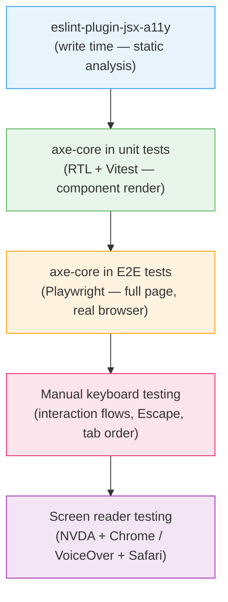

# Testing Accessibility: axe, Lighthouse & Screen Readers

:::info
Automated tools catch structural accessibility violations that human review misses at scale: missing labels, wrong ARIA attributes, and contrast failures. But automated tools are blind to meaning. They cannot tell you whether a label makes sense, whether an error message is helpful, or whether a custom dropdown closes correctly on Escape. A complete accessibility testing strategy combines static analysis, automated testing in CI, and manual verification with real assistive technology.
:::

## Context

### The coverage ceiling of automated tools

axe-core, the engine behind most accessibility testing tools, is maintained by Deque Systems. As of version 4.12 it ships roughly 90 rules enabled by default (about 60 mapped to WCAG A/AA success criteria and about 27 best-practice checks), and every rule checks for a violation that DOM inspection can detect.

The share of real-world issues that automated testing actually catches depends on how coverage is measured. Studies that count by WCAG success criteria (how many of the roughly 50 WCAG A/AA success criteria automation can verify) consistently land around 20-40%. Deque's own 2021 analysis of over 13,000 audited pages measured coverage differently, by issue volume rather than by criteria: the share of all logged defects that axe actually flagged. That analysis found 57%, because a handful of high-frequency violations (missing alt text, insufficient contrast, missing form labels) dominate real audits and are exactly what axe is built to catch. The two figures are not in conflict; they answer different questions, one about testable rules, one about the defects a typical page actually contains. Either way, a majority of WCAG success criteria still require a human to verify.

This gap is not a limitation of axe specifically. It is a property of the problem: many WCAG success criteria involve judgments about meaning, context, and user experience that no markup inspection can answer.

- **WCAG 2.4.6 (Headings and Labels)**: axe can verify that every input has a label. It cannot determine whether the label is descriptive enough for a user to understand what to enter.
- **WCAG 3.3.3 (Error Suggestion)**: axe can detect that an error message exists. It cannot judge whether the message explains how to fix the problem.
- **WCAG 2.1.1 (Keyboard)**: axe can confirm that interactive elements are focusable. It cannot simulate the interaction required to open a custom dropdown and verify it closes on Escape.
- **WCAG 1.3.2 (Meaningful Sequence)**: axe detects gross DOM order violations but cannot evaluate whether the reading order makes semantic sense in context.

A 0-violations axe report certifies the DOM-checkable baseline. It does not certify that the page is usable with assistive technology; that requires the manual layers described below.

### The shift-left a11y testing model

Accessibility issues found late in development are expensive: a missing label found by a screen reader tester the week before launch requires design review, development work, and a new test cycle. The same issue flagged by an ESLint rule at the moment of writing costs a single keyboard shortcut.

The shift-left model stages accessibility checks from earliest (write time) to latest (manual testing), with each layer catching what the previous could not. The examples below are React/JSX-flavored; Vue, Angular, and Svelte projects swap in framework-specific equivalents at the static-analysis and unit-test layers (see Tools in the ecosystem below), while the axe-core, Lighthouse, and manual layers apply unchanged.

1. **Static analysis (eslint-plugin-jsx-a11y for React/JSX)**: Catches structural violations at write time, before the component renders. Zero runtime cost, the fastest possible feedback loop.
2. **Unit tests with axe-core (axe in React Testing Library (RTL) / Vitest)**: Runs the full axe rule set against rendered component DOM. Catches dynamic state issues that static analysis cannot see, such as rendered conditionals and ARIA attributes set by JavaScript.
3. **Integration tests with axe-core (axe in Playwright)**: Runs axe against full page renders including routing, async data, and real browser layout. Catches issues that only appear in full composition.
4. **Manual keyboard testing**: Exercises interaction flows that automated tools cannot simulate, including focus trapping in modals, Escape key behavior in dropdowns, and skip navigation.
5. **Screen reader testing**: Verifies the actual announced experience. axe can confirm an ARIA label exists. Only a screen reader tells you how it sounds to a real user.

### Tools in the ecosystem

**axe-core** is the open-source accessibility testing engine maintained by Deque Systems. It implements WCAG 2.0, 2.1, and 2.2 rules as a JavaScript library. Most browser extensions, test integrations, and CI tools in the accessibility space are either built on axe-core or use it as a reference.

**@axe-core/playwright** is the official Playwright integration, maintained by Deque. It injects axe-core into the browser page and returns a structured violations report that can be asserted in tests. A separate, community-maintained package named `axe-playwright` also exists with a different API; this article uses the official Deque package throughout.

**@axe-core/react** logs axe-core violations to the browser console in development mode by instrumenting React's virtual DOM output. It does not support React 18 and later, and Deque now steers modern-React users to alternatives; its predecessor, `react-axe`, carries an npm deprecation notice. For dev-mode console reporting on a current React version, use Storybook's accessibility addon (below) or the Vitest/RTL integration shown in the Example section.

**Storybook's accessibility addon** (`@storybook/addon-a11y`) runs axe-core against each story in isolation and surfaces violations in the Storybook UI as you build. It works with React, Vue, Angular, and Svelte components alike, and is a common way teams already using Storybook catch axe violations during development.

**Lighthouse** is Google's open-source audit tool for web quality. Its Accessibility audit runs a subset of axe rules plus additional checks, such as tab order analysis and use of landmark regions. Lighthouse produces a 0-100 score and is available in Chrome DevTools, as a CLI, and as a CI tool via `lighthouse-ci`.

**eslint-plugin-jsx-a11y** is a static analysis plugin for ESLint that checks JSX (React) source for accessibility issues before it renders, making it the fastest feedback loop in the stack. Other frameworks have equivalents built the same way: `eslint-plugin-vuejs-accessibility` for Vue templates, the accessibility rules in `@angular-eslint/eslint-plugin-template` for Angular, and Svelte's own compiler, which emits a11y warnings at build time without a separate plugin.

**cypress-axe** and **pa11y-ci** cover two gaps this article's Playwright-focused examples leave. `cypress-axe` runs the same axe-core engine inside Cypress for teams already standardized on it. `pa11y-ci`, built independently of axe-core, is suited to scanning many URLs, such as a marketing site or a documentation portal, without an application test suite to hang assertions off.

### Browser DevTools accessibility panels

**Chrome DevTools, Accessibility panel**: In DevTools, select any element and open the Accessibility panel (under Elements). It shows the accessibility tree node for the element: computed accessible name, role, states (focused, required, etc.), and ARIA properties. The panel also has a "Show accessibility tree" toggle that switches the entire Elements panel from the DOM tree to the full-page accessibility tree, useful for verifying heading structure and landmark regions in one view.

**Firefox Accessibility Inspector**: Firefox's Accessibility Inspector (DevTools → Accessibility tab) shows the full accessibility tree alongside tabbing order visualization. The "Check for issues" feature runs a built-in audit covering contrast, keyboard, and text labels. Firefox's implementation is particularly useful for verifying focus order and detecting elements that block keyboard navigation.

---

## Visual

Accessibility testing layers, from earliest feedback to deepest coverage:



---

## Example

### 1. @axe-core/playwright: run axe in a Playwright test and fail CI on violations

```bash
# Install
npm install --save-dev @axe-core/playwright
```

```typescript
// tests/a11y/home.spec.ts
import { test, expect } from '@playwright/test';
import AxeBuilder from '@axe-core/playwright';

test.describe('Home page accessibility', () => {
  test('should have no automatically detectable WCAG violations', async ({ page }) => {
    await page.goto('/');

    const accessibilityScanResults = await new AxeBuilder({ page })
      .withTags(['wcag2a', 'wcag2aa', 'wcag21a', 'wcag21aa'])
      .analyze();

    // This assertion fails the test (and CI) if axe finds violations.
    // The error message includes the violation rule, element, and remediation hint.
    expect(accessibilityScanResults.violations).toEqual([]);
  });

  test('login form should have no violations', async ({ page }) => {
    await page.goto('/login');

    // Scope axe to a specific region to reduce noise from known issues elsewhere
    const results = await new AxeBuilder({ page })
      .include('#login-form')
      .withTags(['wcag2aa', 'wcag21aa'])
      .analyze();

    expect(results.violations).toEqual([]);
  });

  test('print a readable violations report for debugging', async ({ page }) => {
    await page.goto('/dashboard');

    const results = await new AxeBuilder({ page }).analyze();

    if (results.violations.length > 0) {
      // Log a human-readable summary for CI logs
      const summary = results.violations.map((v) => ({
        id: v.id,
        impact: v.impact,
        description: v.description,
        nodes: v.nodes.map((n) => n.target),
      }));
      console.log('Accessibility violations:', JSON.stringify(summary, null, 2));
    }

    expect(results.violations).toEqual([]);
  });
});
```

### 2. axe-core in Vitest + React Testing Library (RTL): component-level testing

```bash
# Install
npm install --save-dev axe-core jest-axe
# Or for Vitest:
npm install --save-dev axe-core vitest-axe
```

```typescript
// src/components/LoginForm.test.tsx
import { render } from '@testing-library/react';
import { axe, toHaveNoViolations } from 'vitest-axe';
import { expect, test } from 'vitest';
import { LoginForm } from './LoginForm';

// Extend Vitest's expect with the a11y matcher
expect.extend(toHaveNoViolations);

test('LoginForm has no axe violations in default state', async () => {
  const { container } = render(<LoginForm />);

  // axe() runs the full axe-core rule set against the rendered DOM
  const results = await axe(container);
  expect(results).toHaveNoViolations();
});

test('LoginForm has no axe violations when error state is shown', async () => {
  const { container } = render(
    <LoginForm initialError="Invalid email or password." />
  );

  // Test the error state specifically — dynamic ARIA (aria-invalid, aria-describedby)
  // is only present in the rendered DOM, not in the JSX source
  const results = await axe(container);
  expect(results).toHaveNoViolations();
});

test('Modal has no violations when open', async () => {
  const { container } = render(<ConfirmModal isOpen={true} />);

  // axe can check: role="dialog", aria-modal, aria-labelledby pointing to a valid heading
  const results = await axe(container);
  expect(results).toHaveNoViolations();
});
```

### 3. eslint-plugin-jsx-a11y configuration

```bash
# Install
npm install --save-dev eslint-plugin-jsx-a11y
```

```javascript
// eslint.config.js (flat config, ESLint 9+)
import jsxA11y from 'eslint-plugin-jsx-a11y';

export default [
  // Apply the recommended ruleset as a base
  jsxA11y.flatConfigs.recommended,
  {
    files: ['**/*.{jsx,tsx}'],
    plugins: {
      'jsx-a11y': jsxA11y,
    },
    rules: {
      // Recommended rules (errors) — these are WCAG-critical
      'jsx-a11y/alt-text': 'error',               // img must have alt
      'jsx-a11y/anchor-is-valid': 'error',         // anchors must be valid links
      'jsx-a11y/aria-props': 'error',              // only valid ARIA attributes
      'jsx-a11y/aria-proptypes': 'error',          // correct value types for ARIA
      'jsx-a11y/aria-role': 'error',               // only valid ARIA roles
      'jsx-a11y/aria-unsupported-elements': 'error', // no ARIA on elements that don't support it
      'jsx-a11y/heading-has-content': 'error',     // headings must have text content
      'jsx-a11y/img-redundant-alt': 'error',       // no "image" or "photo" in alt text
      'jsx-a11y/interactive-supports-focus': 'error', // interactive roles must be focusable
      'jsx-a11y/label-has-associated-control': 'error', // label must be programmatically linked
      'jsx-a11y/no-access-key': 'warn',            // accesskey causes screen reader conflicts
      'jsx-a11y/no-autofocus': 'warn',             // autofocus disrupts screen reader flow
      'jsx-a11y/no-distracting-elements': 'error', // no marquee or blink
      'jsx-a11y/role-has-required-aria-props': 'error', // required ARIA props per role
      'jsx-a11y/tabindex-no-positive': 'error',    // positive tabindex breaks natural order
    },
  },
];
```

```json
// For projects still using .eslintrc (ESLint 8)
{
  "plugins": ["jsx-a11y"],
  "extends": ["plugin:jsx-a11y/recommended"],
  "rules": {
    "jsx-a11y/label-has-associated-control": ["error", {
      "assert": "either"
    }]
  }
}
```

### 4. Manual keyboard testing checklist

Before shipping any interactive component or flow, run through this checklist using only the keyboard (no mouse):

```
Keyboard Testing Checklist
==========================

[ ] All interactive elements receive focus in a logical visual order (top to bottom, left to right)
[ ] Focus indicator is visible on every focused element (no outline:none without a custom style)
[ ] Tab moves forward through interactive elements; Shift+Tab moves backward
[ ] Links open their target or trigger expected navigation
[ ] Buttons activate on Enter and Space
[ ] Native form controls work with expected keys:
    [ ] Checkboxes toggle with Space
    [ ] Radio buttons change with arrow keys within a group
    [ ] Select dropdowns open with Space/Enter and navigate with arrow keys
[ ] Custom dropdown / combobox:
    [ ] Opens with Enter or Space on the trigger button
    [ ] Arrow keys navigate options within the open dropdown
    [ ] Enter or Space selects the focused option
    [ ] Escape closes the dropdown and returns focus to the trigger
    [ ] Tab closes the dropdown and moves to the next focusable element
[ ] Modal dialog:
    [ ] Opens with focus moving inside the dialog
    [ ] Focus is trapped inside (Tab cycles within the modal only)
    [ ] Escape closes the modal and returns focus to the element that triggered it
    [ ] Modal can be closed with a keyboard-accessible close button
[ ] Skip navigation link appears on first Tab press from top of page
[ ] No keyboard traps: focus can exit every component using Tab or Escape
[ ] Accordion / disclosure: Space or Enter toggles; arrow keys navigate panels (if applicable)
[ ] Date picker: keyboard navigation works for day/month/year selection
[ ] Toast / notification: can be dismissed with keyboard (or disappears without requiring interaction)
```

### 5. Chrome DevTools Accessibility panel: what to check

Open Chrome DevTools (F12), click on any element in the Elements panel, then open the **Accessibility** panel (tab at top right of the bottom pane, next to Styles and Computed).

Key things to inspect:

**Accessibility tree node**: Shows the role, name, and state as computed by the browser's accessibility engine. Compare this against what you expect the screen reader to announce. If the "Name" field is empty for a button, that button has no accessible name. axe catches this too, but the panel lets you see why.

**Full-page accessibility tree**: Click the "Show accessibility tree" toggle in the Accessibility panel. In current Chrome this is a built-in control, not an experimental flag; the Elements panel switches to display the accessibility tree instead of the DOM tree. Use this to:
- Verify heading hierarchy (h1 to h2 to h3, no skipped levels)
- Check that landmark regions (header, main, nav, footer) are present and correct
- Identify interactive elements that appear in the DOM but are excluded from the accessibility tree (`aria-hidden="true"` or `display:none`)

**ARIA attributes**: The panel lists every ARIA attribute on the element and whether it is valid. An `aria-labelledby` pointing to a nonexistent ID shows as broken here. axe would also flag this as a violation, but the panel makes the cause immediately visible.

### 6. Lighthouse CI: enforce an accessibility score threshold

```bash
# Install lighthouse-ci
npm install --save-dev @lhci/cli
```

```json
// lighthouserc.json
{
  "ci": {
    "collect": {
      "url": ["http://localhost:4173/", "http://localhost:4173/login"],
      "startServerCommand": "pnpm preview",
      "numberOfRuns": 3
    },
    "assert": {
      "assertions": {
        "categories:accessibility": ["error", { "minScore": 0.9 }],
        "categories:performance": ["warn", { "minScore": 0.8 }]
      }
    },
    "upload": {
      "target": "temporary-public-storage"
    }
  }
}
```

```yaml
# .github/workflows/lighthouse.yml
name: Lighthouse CI

on:
  pull_request:
    branches: [main]

jobs:
  lhci:
    runs-on: ubuntu-latest
    steps:
      - uses: actions/checkout@v4
      - uses: actions/setup-node@v4
        with:
          node-version: 20
      - run: npm ci
      - run: npm run build
      - run: npx lhci autorun
        env:
          LHCI_GITHUB_APP_TOKEN: ${{ secrets.LHCI_GITHUB_APP_TOKEN }}
```

Note: Lighthouse accessibility scoring is weighted by impact. A score of 0.9 is a weighted average, so a single high-impact violation (like missing form labels on a page with many inputs) can drop the score more than several low-impact violations combined. Use the Lighthouse score as a trend indicator alongside @axe-core/playwright's zero-violations requirement.

---

## Best Practices

**SHOULD run axe-core in CI on every pull request and treat violations as test failures, not warnings.** Integrating axe-core via `@axe-core/playwright` or `vitest-axe` in the test suite means a form input that renders without a programmatic label fails CI before it merges, the same way a missing ARIA attribute or an insufficient contrast ratio does. Treat a 0-violations axe report as a precondition for shipping, not a certificate of accessibility: measured by issue volume it still misses a meaningful share of real-world WCAG defects (see Context).

**SHOULD test with keyboard only before shipping any interactive component.** Open, navigate, close, and dismiss every interactive widget without touching the mouse. Tab through forms, activate dropdowns with Enter or Space, close modals with Escape, and MUST verify that focus returns to the trigger element. A dropdown that never returns focus to its trigger after Escape is a common example: it passes every automated check and only fails when a real person tries to use it with a keyboard.

**SHOULD test with at least one real screen reader before launching new user flows.** NVDA + Chrome on Windows is free and covers the largest free screen-reader user base. VoiceOver + Safari is built into macOS and iOS and is non-negotiable for mobile. Screen reader testing answers a question no automated tool can: does the announced name-role-state sequence read naturally when the screen reader speaks it? That includes live regions (dynamic content a screen reader announces without focus moving there) and the difference between browse mode, where the screen reader reads the page as a document, and forms mode, where keystrokes pass straight through to the focused control.

---

## Design Thinking

### What axe-core can and cannot see

axe-core is excellent at what it can see: DOM structure, attribute presence, computed CSS values for contrast, and the logical consistency of ARIA attribute combinations. Running axe-core in CI gives you a guaranteed baseline. A component with a missing form label, an invalid ARIA role combination, or a contrast ratio below the WCAG threshold fails the build before it merges.

But axe-core cannot ask the questions that require reading comprehension:

- "Username" is a valid label according to axe. "Enter your 6–20 character username (letters and numbers only)" is a better label. axe cannot distinguish them.
- axe confirms that an error message is associated with the input via `aria-describedby`. It cannot tell you whether "Invalid input" helps the user understand what went wrong.
- axe verifies that a modal has `role="dialog"` and `aria-modal="true"`. It cannot verify that focus is actually trapped inside it during keyboard interaction.

A zero-violation axe run guarantees the DOM-checkable baseline: valid labels, valid ARIA, sufficient contrast. It says nothing about whether a label is understandable or whether a modal actually traps focus. Those need human testing.

### Why eslint-plugin-jsx-a11y is the fastest feedback loop

The later in development an accessibility issue is found, the more it costs to fix. An ESLint rule fires in the editor before the file is saved: before the component renders in the browser, before tests run, and before code review. The developer sees the issue at the exact moment they wrote the code, with full context, and fixes it in seconds.

eslint-plugin-jsx-a11y catches patterns like: missing alt text on img elements, buttons with no accessible name, anchor tags with no content, form inputs with no associated label. These are high-frequency violations that account for a large share of real-world WCAG failures. Catching them statically eliminates the entire class from ever reaching the browser.

The limitation of static analysis is that it can only evaluate the JSX source, not the rendered DOM. Conditionally rendered ARIA attributes, dynamic label text, and runtime DOM structure are invisible to ESLint. That is where axe-core in tests takes over.

### Why keyboard testing catches what axe misses

Keyboard testing is the intersection of two coverage gaps: interaction flows that automated tools cannot execute, and WCAG requirements that require real interaction to verify.

Consider a custom dropdown component. axe-core can verify:
- The trigger button has an accessible name.
- The listbox has `role="listbox"`.
- Each option has `role="option"`.

axe-core cannot verify:
- Does pressing Escape close the dropdown and return focus to the trigger?
- Does pressing Tab while the dropdown is open close it and move focus to the next element?
- Does pressing Arrow Down move focus into the first option?
- Does pressing Home/End move to the first/last option?
- Does type-ahead (pressing "C" to jump to options starting with C) work?

These are WCAG 2.1.1 requirements. A custom dropdown that fails any of them is a keyboard accessibility violation, but axe sees a structurally valid combobox and reports none.

Keyboard testing requires a human to open the dropdown, navigate with arrow keys, press Escape, and verify that focus returned to the trigger. It takes two minutes per interactive component and catches violations that are invisible to every automated tool.

### Why screen reader testing is irreplaceable

The accessibility tree and the announced experience are not always the same thing. Screen readers add their own interpretation on top of the accessibility tree: each one applies platform-specific heuristics and conventions, and NVDA, JAWS, and VoiceOver do not always agree on how the same markup should sound.

Screen reader testing answers questions that no tool can:
- Does the announced name, role, and state sequence make sense in natural language?
- Do live region updates interrupt at the right moment?
- Does the screen reader's virtual cursor reading order match the visual reading order?
- Does the component work correctly in browse mode vs. forms mode / application mode?

NVDA + Chrome and VoiceOver + Safari represent the two most-used screen reader and browser combinations (Windows and macOS respectively). Testing with both covers the majority of screen reader users and catches browser-specific ARIA handling differences.

---

## Common Mistakes

### 1. Treating a 0-violations axe report as an accessibility certificate

axe-core reports zero violations. The team marks accessibility as done. Users with screen readers still encounter unlabeled custom controls, illogical reading order, and focus traps that axe has no way to detect.

Zero axe violations means the page passes the roughly 90 rules axe-core checks by default. It does not mean the page is accessible: by Deque's own issue-volume measurement, axe still misses a substantial share of real-world defects (see Context). Add a line to your team's definition of done that names this distinction explicitly, and require a manual keyboard and screen reader pass before marking accessibility work complete.

### 2. Only running axe on the happy-path page state

axe tests that run only on the initial page load miss the states where most accessibility violations live: error states with aria-invalid and aria-describedby, modal dialogs that open after user interaction, tab panels that are conditionally rendered, dropdowns in their open state.

```typescript
// Wrong: only tests the default closed state
test('should have no violations', async ({ page }) => {
  await page.goto('/');
  const results = await new AxeBuilder({ page }).analyze();
  expect(results.violations).toEqual([]);
});

// Right: test the modal open state
test('should have no violations when modal is open', async ({ page }) => {
  await page.goto('/');
  await page.click('button[data-testid="open-modal"]');
  // Wait for the modal to be in the DOM
  await page.waitForSelector('[role="dialog"]');
  const results = await new AxeBuilder({ page }).analyze();
  expect(results.violations).toEqual([]);
});
```

### 3. Adding axe to tests but suppressing violations with exclude

```typescript
// Wrong: excluding the component with issues instead of fixing it
const results = await new AxeBuilder({ page })
  .exclude('#problematic-dropdown')
  .analyze();
expect(results.violations).toEqual([]);
```

This pattern is appropriate for known third-party component issues outside your control, but it is often used to silence axe on components you own. Every exclusion should have a corresponding issue ticket and a plan to remove the exclusion.

### 4. eslint-plugin-jsx-a11y installed but not enforced

Having the plugin in devDependencies does nothing. The rules must be enabled in the ESLint config and the lint step must run in CI. Verify:

```bash
# Run lint with a11y rules enabled
npx eslint src/ --rule 'jsx-a11y/alt-text: error'

# In CI, lint failures should block the build
# package.json
# "scripts": { "lint": "eslint src/", "ci:lint": "eslint src/ --max-warnings 0" }
```

---

## Related Topics

- [FEE-1000: Accessibility Overview](1000.md)
- [FEE-1001: ARIA Roles & Attributes](1001.md)
- [FEE-1002: Keyboard Navigation](1002.md)
- [FEE-1004: Screen Readers & Assistive Technology](1004.md)
- [FEE-1005: Accessible Forms & Inputs](1005.md) — form label and error association requirements that axe-core tests verify
- [FEE-1101: Vitest — Unit Testing](../Testing%20Strategies/1101.md)
- [FEE-1102: React Testing Library](../Testing%20Strategies/1102.md)
- [FEE-1103: Playwright — E2E Testing](../Testing%20Strategies/1103.md)
- [FEE-1107: Shift-Left Testing Philosophy](../Testing%20Strategies/1107.md)

---

## References

1. **Deque Systems — axe-core rule descriptions**
   https://github.com/dequelabs/axe-core/blob/develop/doc/rule-descriptions.md
   The source of truth for the current axe-core rule count, WCAG mappings, and which rules are enabled by default versus experimental or deprecated. Counts change per release; anchor any rule-count claim to the axe-core version in use.

2. **Deque — Automated Testing Identifies 57% of Digital Accessibility Issues**
   https://www.deque.com/blog/automated-testing-study-identifies-57-percent-of-digital-accessibility-issues/
   Deque's account of its 2021 study of over 13,000 audited pages, which measures automated coverage by issue volume rather than by WCAG success-criteria count and reports a materially higher figure (57%) than criteria-based estimates (20-40%). See the coverage-ceiling discussion in Context for how the two measurements differ.

3. **@axe-core/playwright — Official Playwright Integration**
   https://github.com/dequelabs/axe-core-npm/tree/develop/packages/playwright
   Installation guide, API reference, and configuration options for running axe inside Playwright tests.

4. **eslint-plugin-jsx-a11y — Rule Reference**
   https://github.com/jsx-eslint/eslint-plugin-jsx-a11y
   Full list of available rules, recommended configuration, and rule-level documentation mapping each rule to the WCAG criterion it enforces.

5. **Google Lighthouse — Accessibility Audit Documentation**
   https://developer.chrome.com/docs/lighthouse/accessibility/
   Explains Lighthouse's scoring methodology, which checks it runs, and how the weighted scoring relates to WCAG conformance.

6. **WebAIM — Screen Reader User Survey**
   https://webaim.org/projects/screenreadersurvey/
   Usage statistics for NVDA, JAWS, and VoiceOver with browser pairings — the empirical basis for which screen reader and browser combinations to prioritize in manual testing.

7. **Accessibility Insights — Manual Test Guidance**
   https://accessibilityinsights.io/
   Microsoft's accessibility testing tool built on axe-core, with structured manual test tabs that guide through the WCAG criteria automated tools cannot assess.

8. **Storybook — Accessibility Testing**
   https://storybook.js.org/docs/writing-tests/accessibility-testing
   Documents `@storybook/addon-a11y`, which runs axe-core against isolated stories. Referenced here as the framework-agnostic, actively maintained replacement for the `@axe-core/react` dev-mode integration, which does not support React 18 and later.
