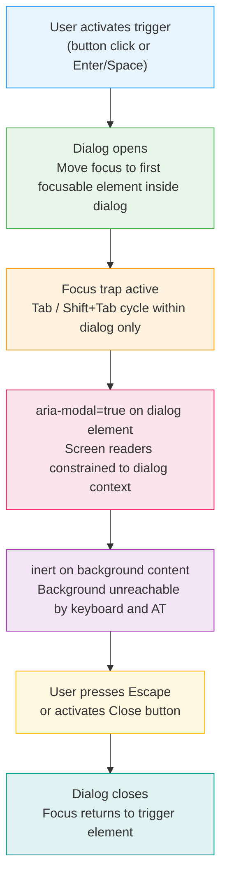

# Accessible Component Patterns

:::info
The WAI-ARIA Authoring Practices Guide (APG) defines how interactive widgets must behave with keyboards and assistive technologies. Browsers do not implement these behaviors automatically — every dropdown, tab panel, modal, and accordion in your application requires deliberate keyboard interaction design. Headless component libraries exist precisely to implement this behavior layer correctly so product teams own the visual design without rebuilding the accessibility foundation from scratch.
:::

## Context

### The accessibility gap in custom widgets

Native HTML elements — `<button>`, `<input>`, `<select>`, `<details>` — ship with built-in keyboard behavior and accessibility semantics implemented by the browser. When you press Space on a `<button>`, the browser fires a click event. When you open a native `<select>`, arrow keys navigate options. This behavior exists without a single line of JavaScript.

The moment you build a custom widget — a styled dropdown that avoids native `<select>`, a tab interface, a modal dialog — you step outside the browser's default behavior. The browser does not know what a "tab" is. It does not know that arrow keys should move between tab items, that Escape should close the modal, or that focus should be trapped inside a dialog while it is open. You must implement all of this yourself.

This is not optional. WCAG 2.1 Success Criterion 2.1.1 (Keyboard) requires that all functionality be operable with a keyboard. Criterion 4.1.2 (Name, Role, Value) requires that the name, role, and state of every UI component be programmatically determinable. A custom dropdown that is visually identical to its native equivalent but responds to no keyboard input fails both criteria.

### The WAI-ARIA Authoring Practices Guide

The **WAI-ARIA Authoring Practices Guide (APG)** — published by the W3C and available at `https://www.w3.org/WAI/ARIA/apg/` — is the authoritative source for how interactive widgets should behave with keyboards and ARIA. The APG defines:

- Which ARIA roles a widget should use (`tablist`, `tab`, `tabpanel`, `dialog`, `menu`, `menuitem`, etc.)
- Which ARIA attributes are required (`aria-selected`, `aria-expanded`, `aria-modal`, `aria-haspopup`, etc.)
- Which keyboard interactions are expected (arrow keys for navigation, Escape for dismissal, Enter/Space for activation, Home/End for boundary navigation)

The APG patterns are not stylistic suggestions. They represent the result of careful analysis of how screen readers and assistive technologies process ARIA markup, and they define user expectations for how interactive widgets behave. Deviation from APG patterns means screen reader users encounter unexpected behavior — or no behavior at all.

Every interactive widget covered in this article corresponds to an APG pattern. When in doubt about the correct behavior for any custom widget, the APG is the first and authoritative reference.

### Why headless component libraries exist

Building an accessible custom widget from scratch requires implementing:

1. Correct ARIA role assignments
2. All required ARIA attribute states and their synchronization with visual state
3. Keyboard event handlers for every expected key combination
4. Focus management (moving focus on open, trapping focus in modals, restoring focus on close)
5. Edge cases: what happens when a menu has no items, when a tab panel is dynamically added, when Escape is pressed inside a nested modal

This is a substantial engineering investment that teams repeat for every widget in every product. And it is easy to get wrong — missing a single keyboard handler or failing to restore focus on close creates an accessibility regression.

**Headless component libraries** encapsulate the behavior and accessibility layer without imposing visual design:

- **Headless UI** (by Tailwind CSS team) — provides accessible React and Vue components for modals, dropdowns, tabs, comboboxes, and transitions. Components are unstyled; you apply all styling via className or CSS.
- **Radix UI** — React-only, primitive-level components (Dialog, DropdownMenu, Tabs, Accordion, Toast, etc.) with comprehensive ARIA implementation. Designed for composition; each primitive exports subcomponents you assemble.
- **React Aria** (by Adobe) — A library of hooks rather than components. Each hook handles one accessibility concern (focus, keyboard navigation, ARIA attributes). The most flexible option; requires the most assembly but imposes no DOM structure.
- **Ark UI** — Headless components for React, Vue, and Solid, built on top of Zag.js (a state machine library). Provides more controlled state management than Headless UI, closer in scope to Radix UI.

The core value proposition: the library team absorbs the ARIA specification research, the cross-browser and cross-screen-reader testing, and the edge case handling. Your team absorbs the visual design work. The contract is clear: they own correctness, you own appearance.

---

## Best Practices

**SHOULD follow WAI-ARIA APG patterns for all interactive widget types.** The APG defines the required ARIA roles, attributes, and key-by-key keyboard interactions for every widget — tabs, dialogs, menus, accordions, comboboxes, trees, and more. These are not stylistic suggestions; they represent the expected behavior that screen reader users have formed mental models around. Deviation from APG patterns means AT users encounter unexpected or absent behavior. When in doubt about the correct keyboard interaction for any custom widget, the APG pattern page is the authoritative first reference.

**SHOULD prefer headless component libraries (Radix UI, React Aria, Headless UI) over building custom accessible components from scratch.** The accessibility implementation for an interactive widget — correct ARIA role assignments, attribute synchronization, full keyboard event handling, focus management, and edge cases — is a substantial engineering investment that is easy to get wrong. Headless libraries centralize that investment: their teams absorb the specification research, cross-SR+browser testing, and maintenance as ARIA evolves. Your team owns visual design; they own correctness. Build a custom accessible widget from scratch only when no suitable library primitive exists.

---

## Design Thinking

### Why accessible patterns need specific keyboard interactions

When a user encounters a tab interface on a web page, they bring an expectation formed by APG conventions: arrow keys move between tabs, Tab moves to the tab panel content, Enter or Space activates a focused tab. These expectations exist because the APG defines them and assistive technologies communicate them.

Browsers do not implement these expectations automatically. If you build a tab interface from `<div>` elements with `role="tab"` and `role="tablist"`, the browser does nothing special when the user presses the arrow keys. The arrow key events fire on the document — and nothing happens, because nothing handles them. You must write the event handlers.

This is the foundational problem. The APG exists because the browser platform was built for documents, not applications. Interactive widgets like tab panels, tree views, date pickers, and data grids require application-mode keyboard behavior that native HTML does not provide. The APG catalogues the expected keyboard behavior for each widget type so that all implementations behave consistently and screen reader users can form reliable mental models.

### Why headless libs exist: behavior without style

The problem headless libraries solve is not "making components look good." It is "implementing the APG correctly and keeping it working as browsers and screen readers evolve."

Consider what Radix UI's Dialog component handles that a naive implementation typically misses:

- Focus moves to the first focusable element inside the dialog on open
- Focus is trapped inside the dialog — Tab and Shift+Tab cycle within the dialog, they do not escape it
- `aria-modal="true"` marks the dialog as a modal context to screen readers
- Background content receives `inert` to prevent AT from navigating outside the dialog
- Scroll on the page body is locked while the dialog is open
- Escape closes the dialog
- Focus returns to the trigger element that opened the dialog when it closes
- The dialog is rendered in a portal at the document body to avoid z-index and overflow:hidden issues

A team building a custom modal from scratch will commonly implement items 1 and 6, sometimes item 5, rarely items 2–4 and 7–8. The items most commonly missed — focus trap, aria-modal, inertness, and focus restoration — are exactly the items that most directly affect screen reader and keyboard users.

Headless libraries exist because the correct implementation of accessibility behavior is a solved problem that should be centralized, not reinvented per application.

### Why modals are the most commonly broken pattern

Modal dialogs are the most commonly broken accessible pattern for a consistent set of reasons:

**Focus trap** is invisible to sighted mouse users, so it is often discovered late. A sighted user clicks to open a modal, interacts with it, and clicks Close. A keyboard user opens the modal, presses Tab, and focus escapes to the page behind the modal — then they cannot close it without reaching the now-inaccessible Close button.

**`aria-modal="true"`** is frequently omitted because the dialog visually appears modal (with an overlay). Screen readers on Windows with NVDA in virtual cursor mode can navigate the full page DOM using the virtual buffer — they are not constrained by the visual overlay. Without `aria-modal="true"`, screen reader users can read and interact with content behind the dialog.

**`inert` on background content** is a newer, more robust solution to the same problem. The `inert` attribute removes elements from the tab order and accessibility tree entirely. Adding `inert` to everything outside the modal makes background content unreachable regardless of screen reader mode. `aria-modal` is a weaker signal that some screen readers do not fully implement; `inert` is implemented at the browser level.

**Scroll lock** is missed because developers test with the mouse, where scroll lock is obvious. A keyboard user who presses Tab past the last modal element and lands back on the first modal element (correct focus trap behavior) may also notice that the page body scrolled — because scroll-associated behavior on the document body was not locked.

**Focus restoration** is frequently implemented as "close the modal" without remembering which element opened it. The user's position in the page is lost. The WAI-ARIA APG is explicit: focus must return to the element that triggered the dialog.

### The WAI-ARIA APG as the authoritative source

When you have a question about the correct ARIA roles, attributes, or keyboard behavior for any interactive widget — not just the six covered in this article — the APG is the authoritative answer. The APG contains pattern pages for: Alert, Alert Dialog, Breadcrumb, Button, Carousel, Checkbox, Combo Box, Dialog, Disclosure, Feed, Grid, Link, Listbox, Menu Button, Meter, Radio Group, Slider, Spinbutton, Switch, Table, Tabs, Toggle Button, Toolbar, Tooltip, Tree View, Tree Grid, and Window Splitter.

Each pattern page specifies: the required ARIA roles, the required ARIA attributes, the keyboard interaction specification (key by key), and example implementations. Treat it as the specification for your widget, not as optional reading.

---

## Visual

Modal accessibility implementation flow — what the developer must handle at each stage of the dialog lifecycle:



---

## Example

### 1. Modal dialog — focus trap, aria-modal, inert background, Escape

The following example shows a minimal but complete accessible modal dialog implementation in vanilla JavaScript and HTML. It handles all seven requirements enumerated in Design Thinking.

```html
<!-- Trigger -->
<button id="open-modal-btn" type="button">Open Settings</button>

<!-- Dialog — hidden until opened -->
<div
  id="settings-dialog"
  role="dialog"
  aria-modal="true"
  aria-labelledby="dialog-title"
  aria-describedby="dialog-desc"
  hidden
  tabindex="-1"
>
  <h2 id="dialog-title">Settings</h2>
  <p id="dialog-desc">Configure your account preferences below.</p>

  <label for="display-name">Display name</label>
  <input id="display-name" type="text" />

  <div class="dialog-actions">
    <button type="button" id="save-btn">Save</button>
    <button type="button" id="cancel-btn">Cancel</button>
  </div>
</div>

<!-- Backdrop (visual only) -->
<div id="modal-backdrop" hidden aria-hidden="true"></div>
```

```javascript
const dialog = document.getElementById('settings-dialog');
const openBtn = document.getElementById('open-modal-btn');
const cancelBtn = document.getElementById('cancel-btn');
const saveBtn = document.getElementById('save-btn');
const backdrop = document.getElementById('modal-backdrop');

// All focusable element selectors
const FOCUSABLE = [
  'a[href]', 'button:not([disabled])', 'input:not([disabled])',
  'select:not([disabled])', 'textarea:not([disabled])',
  '[tabindex]:not([tabindex="-1"])',
].join(', ');

function openModal() {
  // 1. Show dialog and backdrop
  dialog.removeAttribute('hidden');
  backdrop.removeAttribute('hidden');

  // 2. Lock body scroll
  document.body.style.overflow = 'hidden';

  // 3. Make background inert — removes it from keyboard and AT navigation
  document.querySelectorAll('body > *:not(#settings-dialog):not(#modal-backdrop)')
    .forEach(el => el.setAttribute('inert', ''));

  // 4. Move focus into dialog
  const firstFocusable = dialog.querySelector(FOCUSABLE);
  if (firstFocusable) firstFocusable.focus();
  else dialog.focus(); // fallback: dialog itself has tabindex="-1"

  // 5. Trap focus inside dialog
  dialog.addEventListener('keydown', trapFocus);
  document.addEventListener('keydown', handleEscape);
}

function closeModal() {
  // Hide dialog
  dialog.setAttribute('hidden', '');
  backdrop.setAttribute('hidden', '');

  // Restore body scroll
  document.body.style.overflow = '';

  // Remove inert from background
  document.querySelectorAll('[inert]').forEach(el => el.removeAttribute('inert'));

  // Remove event listeners
  dialog.removeEventListener('keydown', trapFocus);
  document.removeEventListener('keydown', handleEscape);

  // Restore focus to the trigger element
  openBtn.focus();
}

function trapFocus(event) {
  if (event.key !== 'Tab') return;

  const focusable = Array.from(dialog.querySelectorAll(FOCUSABLE));
  const first = focusable[0];
  const last = focusable[focusable.length - 1];

  if (event.shiftKey) {
    // Shift+Tab: if on first element, wrap to last
    if (document.activeElement === first) {
      event.preventDefault();
      last.focus();
    }
  } else {
    // Tab: if on last element, wrap to first
    if (document.activeElement === last) {
      event.preventDefault();
      first.focus();
    }
  }
}

function handleEscape(event) {
  if (event.key === 'Escape') closeModal();
}

openBtn.addEventListener('click', openModal);
cancelBtn.addEventListener('click', closeModal);
saveBtn.addEventListener('click', () => { /* save logic */ closeModal(); });
```

---

### 2. Dropdown menu — aria-haspopup, aria-expanded, arrow key navigation

The APG Menu Button pattern: a button triggers a menu, arrow keys navigate menu items, Escape closes and returns focus to the trigger.

```html
<div class="menu-container">
  <button
    id="actions-btn"
    type="button"
    aria-haspopup="menu"
    aria-expanded="false"
    aria-controls="actions-menu"
  >
    Actions
  </button>

  <ul
    id="actions-menu"
    role="menu"
    aria-labelledby="actions-btn"
    hidden
  >
    <li role="menuitem" tabindex="-1">Edit</li>
    <li role="menuitem" tabindex="-1">Duplicate</li>
    <li role="menuitem" tabindex="-1">Delete</li>
  </ul>
</div>
```

```javascript
const trigger = document.getElementById('actions-btn');
const menu = document.getElementById('actions-menu');
const items = () => Array.from(menu.querySelectorAll('[role="menuitem"]'));

function openMenu() {
  menu.removeAttribute('hidden');
  trigger.setAttribute('aria-expanded', 'true');
  // Focus first item
  const first = items()[0];
  if (first) first.focus();
}

function closeMenu(returnFocus = true) {
  menu.setAttribute('hidden', '');
  trigger.setAttribute('aria-expanded', 'false');
  if (returnFocus) trigger.focus();
}

trigger.addEventListener('click', () => {
  const isOpen = trigger.getAttribute('aria-expanded') === 'true';
  isOpen ? closeMenu() : openMenu();
});

// Arrow key navigation within menu
menu.addEventListener('keydown', (event) => {
  const menuItems = items();
  const current = menuItems.indexOf(document.activeElement);

  switch (event.key) {
    case 'ArrowDown':
      event.preventDefault();
      // Move to next item; wrap from last to first
      menuItems[(current + 1) % menuItems.length].focus();
      break;
    case 'ArrowUp':
      event.preventDefault();
      // Move to previous item; wrap from first to last
      menuItems[(current - 1 + menuItems.length) % menuItems.length].focus();
      break;
    case 'Home':
      event.preventDefault();
      menuItems[0].focus();
      break;
    case 'End':
      event.preventDefault();
      menuItems[menuItems.length - 1].focus();
      break;
    case 'Enter':
    case ' ':
      event.preventDefault();
      // Activate the focused menuitem — required by WAI-ARIA APG Menu Button pattern
      if (document.activeElement) document.activeElement.click();
      break;
    case 'Escape':
      closeMenu(true);
      break;
    case 'Tab':
      // Tab closes menu but does not return focus — browser handles next element
      closeMenu(false);
      break;
  }
});

// Close on outside click
document.addEventListener('click', (event) => {
  if (!menu.contains(event.target) && event.target !== trigger) {
    closeMenu(false);
  }
});
```

---

### 3. Tabs — aria-tablist, aria-tab, aria-tabpanel, arrow key switching

The APG Tabs pattern: arrow keys switch tabs within the tablist, Tab moves into the active panel, aria-selected tracks the active tab.

```html
<div class="tabs">
  <!-- Tab list: contains all tab buttons -->
  <div role="tablist" aria-label="Account settings">
    <button
      role="tab"
      id="tab-profile"
      aria-controls="panel-profile"
      aria-selected="true"
      tabindex="0"
    >
      Profile
    </button>
    <button
      role="tab"
      id="tab-security"
      aria-controls="panel-security"
      aria-selected="false"
      tabindex="-1"
    >
      Security
    </button>
    <button
      role="tab"
      id="tab-notifications"
      aria-controls="panel-notifications"
      aria-selected="false"
      tabindex="-1"
    >
      Notifications
    </button>
  </div>

  <!-- Tab panels -->
  <div
    id="panel-profile"
    role="tabpanel"
    aria-labelledby="tab-profile"
    tabindex="0"
  >
    <p>Profile settings content.</p>
  </div>
  <div
    id="panel-security"
    role="tabpanel"
    aria-labelledby="tab-security"
    tabindex="0"
    hidden
  >
    <p>Security settings content.</p>
  </div>
  <div
    id="panel-notifications"
    role="tabpanel"
    aria-labelledby="tab-notifications"
    tabindex="0"
    hidden
  >
    <p>Notification settings content.</p>
  </div>
</div>
```

```javascript
const tablist = document.querySelector('[role="tablist"]');
const tabs = Array.from(tablist.querySelectorAll('[role="tab"]'));

function activateTab(tab) {
  // Deactivate all tabs
  tabs.forEach(t => {
    t.setAttribute('aria-selected', 'false');
    t.setAttribute('tabindex', '-1');
    // Hide the associated panel
    document.getElementById(t.getAttribute('aria-controls'))
      .setAttribute('hidden', '');
  });

  // Activate the selected tab
  tab.setAttribute('aria-selected', 'true');
  tab.setAttribute('tabindex', '0');
  tab.focus();

  // Show the associated panel
  document.getElementById(tab.getAttribute('aria-controls'))
    .removeAttribute('hidden');
}

tablist.addEventListener('keydown', (event) => {
  const current = tabs.indexOf(document.activeElement);
  let next;

  switch (event.key) {
    case 'ArrowRight':
      event.preventDefault();
      // Move to next tab; wrap from last to first
      next = (current + 1) % tabs.length;
      activateTab(tabs[next]);
      break;
    case 'ArrowLeft':
      event.preventDefault();
      // Move to previous tab; wrap from first to last
      next = (current - 1 + tabs.length) % tabs.length;
      activateTab(tabs[next]);
      break;
    case 'Home':
      event.preventDefault();
      activateTab(tabs[0]);
      break;
    case 'End':
      event.preventDefault();
      activateTab(tabs[tabs.length - 1]);
      break;
  }
});

// Click activation
tabs.forEach(tab => {
  tab.addEventListener('click', () => activateTab(tab));
});
```

**Key pattern notes:**

- Only the active tab has `tabindex="0"` — inactive tabs have `tabindex="-1"`. This means Tab moves into the tab panel, not through all tabs.
- Arrow keys move between tabs and activate them (APG "automatic activation" pattern).
- The panel has `tabindex="0"` so it receives focus when the user presses Tab from the tablist.

---

### 4. Accordion — aria-expanded on button, aria-controls on panel

The APG Disclosure pattern (and Accordion): a button controls the expanded state of a content region. `aria-expanded` announces the state; `aria-controls` links the button to its panel.

```html
<div class="accordion">
  <h3>
    <button
      type="button"
      aria-expanded="false"
      aria-controls="section-1-panel"
      id="section-1-header"
    >
      What is your return policy?
    </button>
  </h3>
  <div
    id="section-1-panel"
    role="region"
    aria-labelledby="section-1-header"
    hidden
  >
    <p>You may return items within 30 days of purchase with the original receipt.</p>
  </div>

  <h3>
    <button
      type="button"
      aria-expanded="false"
      aria-controls="section-2-panel"
      id="section-2-header"
    >
      Do you offer international shipping?
    </button>
  </h3>
  <div
    id="section-2-panel"
    role="region"
    aria-labelledby="section-2-header"
    hidden
  >
    <p>Yes. We ship to over 40 countries. Delivery times vary by location.</p>
  </div>
</div>
```

```javascript
document.querySelectorAll('.accordion button[aria-expanded]').forEach(button => {
  button.addEventListener('click', () => {
    const expanded = button.getAttribute('aria-expanded') === 'true';
    const panelId = button.getAttribute('aria-controls');
    const panel = document.getElementById(panelId);

    // Toggle state
    button.setAttribute('aria-expanded', String(!expanded));

    if (expanded) {
      panel.setAttribute('hidden', '');
    } else {
      panel.removeAttribute('hidden');
    }
  });
});
```

**Pattern notes:**

- `aria-expanded` is on the `<button>`, not on the panel. Screen readers announce "What is your return policy? collapsed, button" (or "expanded") based on the button's state.
- `role="region"` on the panel with `aria-labelledby` pointing to the button creates a named landmark for each accordion section — useful when sections are long enough that users may want to navigate to them directly.
- Wrapping the button in `<h3>` preserves heading structure: users navigating by headings can find accordion sections.

---

### 5. Toast / notification — aria-live region, role="status", role="alert"

Live regions announce dynamic content to screen reader users without moving focus. The difference between `role="status"` (polite) and `role="alert"` (assertive) determines how urgently the screen reader interrupts the user.

```html
<!-- Live region container — must be present in the DOM before content is injected -->
<!-- role="status" uses aria-live="polite": announces after current speech finishes -->
<div
  id="toast-region"
  role="status"
  aria-live="polite"
  aria-atomic="true"
  class="sr-only"
>
  <!-- Toast messages are injected and removed here dynamically -->
</div>

<!-- For error or urgent notifications, use role="alert" (aria-live="assertive") -->
<div
  id="alert-region"
  role="alert"
  aria-live="assertive"
  aria-atomic="true"
  class="sr-only"
>
</div>
```

```javascript
const toastRegion = document.getElementById('toast-region');
const alertRegion = document.getElementById('alert-region');

function showToast(message, type = 'status') {
  const region = type === 'alert' ? alertRegion : toastRegion;

  // Clear then set — some screen readers do not re-announce if the text is the same
  region.textContent = '';

  // Brief delay ensures the DOM mutation is detected as a new update
  requestAnimationFrame(() => {
    region.textContent = message;
  });

  // Visual toast UI (separate from the live region)
  const toast = document.createElement('div');
  toast.className = `toast toast--${type}`;
  toast.textContent = message;
  // Add close button for keyboard users
  const closeBtn = document.createElement('button');
  closeBtn.type = 'button';
  closeBtn.textContent = 'Dismiss';
  closeBtn.addEventListener('click', () => toast.remove());
  toast.appendChild(closeBtn);
  document.body.appendChild(toast);

  // Auto-dismiss after 5 seconds
  setTimeout(() => {
    toast.remove();
    region.textContent = '';
  }, 5000);
}

// Usage
showToast('Settings saved successfully.', 'status'); // polite
showToast('Your session has expired. Please log in again.', 'alert'); // assertive
```

**Pattern notes:**

- The live region container must be in the DOM before content is injected. Screen readers register live regions on page load; injecting the container and content simultaneously often fails.
- `aria-atomic="true"` causes the entire region to be re-announced when any part changes, rather than just the changed portion. This is usually the correct behavior for toast messages.
- `aria-live="polite"` (or `role="status"`) waits for the user to finish reading before announcing. Use this for non-urgent confirmations.
- `aria-live="assertive"` (or `role="alert"`) interrupts immediately. Reserve this for genuine errors or time-sensitive information — it is disruptive and annoying when overused.

---

### 6. Data table — scope, caption, aria-sort

Accessible data tables use semantic HTML table elements. The `scope` attribute identifies header cells. `<caption>` names the table. `aria-sort` announces sort state on sortable columns.

```html
<table>
  <!-- caption: the accessible name of the entire table -->
  <caption>Active support tickets — sorted by date, newest first</caption>

  <thead>
    <tr>
      <!-- scope="col" identifies column headers -->
      <th scope="col">Ticket ID</th>

      <!-- aria-sort values: "ascending", "descending", "none", "other" -->
      <!-- The sort button is inside the header cell -->
      <th scope="col" aria-sort="descending">
        <button type="button" class="sort-btn" data-column="date">
          Date opened
          <!-- Visually hidden text for screen reader clarity -->
          <span class="sr-only">(sorted descending)</span>
          <!-- Visual sort icon, hidden from AT -->
          <span aria-hidden="true">▼</span>
        </button>
      </th>

      <th scope="col" aria-sort="none">
        <button type="button" class="sort-btn" data-column="status">
          Status
          <span aria-hidden="true">⇅</span>
        </button>
      </th>

      <th scope="col">Assignee</th>
    </tr>
  </thead>

  <tbody>
    <tr>
      <!-- scope="row" identifies row headers in tables with row-level scope -->
      <th scope="row">#10482</th>
      <td>2026-04-09</td>
      <td>Open</td>
      <td>Alice Chen</td>
    </tr>
    <tr>
      <th scope="row">#10479</th>
      <td>2026-04-08</td>
      <td>In Progress</td>
      <td>Bob Lee</td>
    </tr>
  </tbody>
</table>
```

```javascript
const sortButtons = document.querySelectorAll('.sort-btn');

sortButtons.forEach(button => {
  button.addEventListener('click', () => {
    const th = button.closest('th');
    const currentSort = th.getAttribute('aria-sort');
    const column = button.dataset.column;

    // Determine next sort direction
    const nextSort = currentSort === 'ascending' ? 'descending' : 'ascending';

    // Reset all other sortable columns to 'none'
    sortButtons.forEach(btn => {
      if (btn !== button) {
        btn.closest('th').setAttribute('aria-sort', 'none');
      }
    });

    // Apply sort to this column
    th.setAttribute('aria-sort', nextSort);

    // Perform the actual sort (data logic not shown)
    sortTable(column, nextSort);
  });
});
```

**Pattern notes:**

- `scope="col"` on `<th>` elements in `<thead>` and `scope="row"` on row-level `<th>` elements tell screen readers which data cells a header applies to.
- `<caption>` is the table's accessible name. Without it, screen readers may announce the table as "table" with no further identification.
- `aria-sort` goes on the `<th>` element, not on the button inside it. Screen readers announce the sort state as part of the header cell.
- For complex tables with merged cells (`colspan`, `rowspan`), use `id` and `headers` attributes instead of `scope` to explicitly associate each data cell with its header cells.

---

### 7. Headless library example — Radix UI Dialog

The following example shows how Radix UI's Dialog primitive handles the same modal requirements as Example 1, without manual implementation:

```jsx
// Install: npm install @radix-ui/react-dialog
import * as Dialog from '@radix-ui/react-dialog';

function SettingsModal() {
  return (
    <Dialog.Root>
      {/* Trigger: Radix wires up aria-haspopup and aria-expanded automatically */}
      <Dialog.Trigger asChild>
        <button type="button">Open Settings</button>
      </Dialog.Trigger>

      {/* Portal: renders outside the current DOM tree to avoid z-index issues */}
      <Dialog.Portal>
        {/* Overlay: the visual backdrop */}
        <Dialog.Overlay className="modal-overlay" />

        {/* Content: role="dialog", aria-modal="true", focus trap, Escape handler,
            inert on background, focus restoration — all handled by Radix */}
        <Dialog.Content
          className="modal-content"
          aria-describedby="dialog-description"
        >
          {/* Title: sets aria-labelledby on the dialog automatically */}
          <Dialog.Title>Settings</Dialog.Title>
          <Dialog.Description id="dialog-description">
            Configure your account preferences.
          </Dialog.Description>

          <label htmlFor="display-name">Display name</label>
          <input id="display-name" type="text" />

          {/* Close: renders a button, wires up click to close dialog */}
          <Dialog.Close asChild>
            <button type="button">Cancel</button>
          </Dialog.Close>
          <button type="button">Save</button>
        </Dialog.Content>
      </Dialog.Portal>
    </Dialog.Root>
  );
}
```

What Radix UI handles automatically compared to the vanilla implementation in Example 1:

| Requirement | Vanilla (Example 1) | Radix UI |
|---|---|---|
| Focus moves to dialog on open | Manual | Automatic |
| Focus trap (Tab cycles inside) | Manual event handler | Automatic |
| `aria-modal="true"` | Manual attribute | Automatic |
| Background `inert` | Manual DOM loop | Automatic |
| Escape closes | Manual keydown listener | Automatic |
| Focus returns to trigger | Manual `openBtn.focus()` | Automatic |
| Portal rendering | Not shown | Built-in via Dialog.Portal |

---

## Common Mistakes

### 1. Building a modal with only a visual overlay, no focus management

The `div` has `position: fixed` and covers the page. Keyboard users can Tab past it to content behind it. The Escape key does nothing. Screen readers read the entire page, not just the dialog.

Fix: implement focus trap, `aria-modal="true"`, `inert` on background elements, and Escape-to-close.

### 2. Using role="tab" but leaving all tabs in the tab order

```html
<!-- Wrong: all tabs have tabindex="0" -->
<button role="tab" tabindex="0" aria-selected="true">Profile</button>
<button role="tab" tabindex="0" aria-selected="false">Security</button>
<button role="tab" tabindex="0" aria-selected="false">Notifications</button>
```

```html
<!-- Correct: only active tab in the tab order -->
<button role="tab" tabindex="0" aria-selected="true">Profile</button>
<button role="tab" tabindex="-1" aria-selected="false">Security</button>
<button role="tab" tabindex="-1" aria-selected="false">Notifications</button>
```

The APG tabs pattern uses the "roving tabindex" technique: only the currently selected tab is in the tab order (`tabindex="0"`). Users navigate between tabs with arrow keys, not Tab. Tab moves to the panel content.

### 3. Placing aria-expanded on the container, not the button

```html
<!-- Wrong: aria-expanded on the wrapper div -->
<div class="accordion-item" aria-expanded="false">
  <button>What is your return policy?</button>
  <div>...</div>
</div>

<!-- Correct: aria-expanded on the button that controls the panel -->
<div class="accordion-item">
  <button aria-expanded="false" aria-controls="panel-1">
    What is your return policy?
  </button>
  <div id="panel-1" hidden>...</div>
</div>
```

`aria-expanded` is a button state. It belongs on the interactive element that controls expansion, not on a wrapper container.

### 4. Injecting the live region container at the same time as the message

```javascript
// Wrong: creating and populating the live region simultaneously
function showToast(message) {
  const region = document.createElement('div');
  region.setAttribute('role', 'status');
  region.setAttribute('aria-live', 'polite');
  region.textContent = message; // Screen reader misses this
  document.body.appendChild(region);
}
```

Screen readers register live regions at page load. A container that does not exist when the page loads is not monitored. Always render the live region container in initial HTML (or framework template) before any content is injected into it.

### 5. Using role="alert" for all notifications

`role="alert"` (aria-live="assertive") interrupts the user immediately — mid-sentence, mid-navigation. Using it for routine success toasts ("File saved", "Profile updated") is disruptive. Screen reader users have reported this as one of the most frustrating interaction patterns.

Reserve `role="alert"` for:
- Authentication failures
- System errors that prevent task completion
- Session expiry warnings
- Destructive action confirmations

Use `role="status"` (aria-live="polite") for all other notifications.

### 6. Omitting scope on data table headers

Without `scope`, screen readers may not associate header cells with their data cells, particularly in tables with more than one row of headers or row-level headers. The result is data announced without context — just a sequence of values.

Always add `scope="col"` to column headers and `scope="row"` to row headers. For complex tables with merged cells, use the `headers` attribute on data cells.

---

## Related FEEs

- [FEE-1000: Accessibility Overview](1000.md)
- [FEE-1001: ARIA Roles & Attributes](1001.md)
- [FEE-1002: Keyboard Navigation & Focus Management](1002.md)
- [FEE-501: Component Composition Patterns](../Component%20Architecture%20and%20Design%20Patterns/501.md)

---

## References

1. **W3C — WAI-ARIA Authoring Practices Guide (APG)**
   https://www.w3.org/WAI/ARIA/apg/
   The authoritative specification for ARIA roles, attributes, and keyboard interactions for every interactive widget. The pattern pages for Dialog, Menu Button, Tabs, Accordion, Alert, and Table are the direct basis for the patterns in this article.

2. **W3C APG — Dialog (Modal) Pattern**
   https://www.w3.org/WAI/ARIA/apg/patterns/dialog-modal/
   Detailed keyboard interaction specification, required ARIA attributes, and focus management requirements for modal dialogs. The seven-item modal checklist in this article derives from this pattern page.

3. **W3C APG — Tabs Pattern**
   https://www.w3.org/WAI/ARIA/apg/patterns/tabs/
   Defines the roving tabindex technique for tab navigation, arrow-key activation, and the aria-tablist / aria-tab / aria-tabpanel role structure.

4. **Radix UI — Primitives Documentation**
   https://www.radix-ui.com/primitives
   Documentation for all Radix UI primitive components including Dialog, DropdownMenu, Tabs, Accordion, and Toast. Each component page describes the accessibility features implemented and the ARIA specification it follows.

5. **React Aria — Adobe Spectrum**
   https://react-spectrum.adobe.com/react-aria/
   Adobe's library of accessibility hooks for React. The architecture (hooks rather than components) and the breadth of covered patterns make this the reference for teams that need maximum flexibility in DOM structure while maintaining ARIA correctness.

6. **Headless UI**
   https://headlessui.com/
   Tailwind CSS team's accessible, unstyled component library for React and Vue. Covers Dialog, Menu, Tabs, Combobox, Disclosure, and Popover.

7. **MDN — ARIA — Authoring Practices**
   https://developer.mozilla.org/en-US/docs/Web/Accessibility/ARIA
   MDN's ARIA reference, complementary to the W3C APG, with browser support notes and accessible name computation explanations for each ARIA role.
