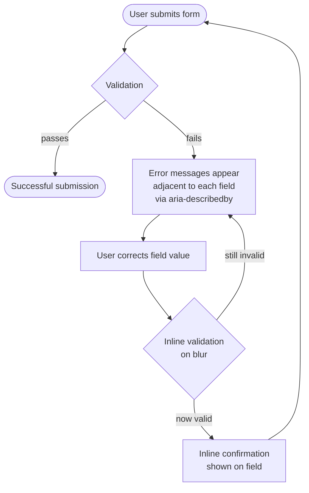

# Cognitive Accessibility

:::info
Cognitive accessibility addresses the needs of users with cognitive, learning, and neurological
disabilities, including dyslexia, ADHD, autism spectrum conditions, memory impairments, and
cognitive disabilities acquired from brain injury or stroke. Cognitive disabilities are the most
common disability category worldwide, yet they are the category most often overlooked in
accessibility reviews, because their impact is less immediately visible than a missing image
alternative or a control that traps keyboard focus. WCAG 2.2 responded with four success criteria
aimed directly at this gap: Consistent Help, Redundant Entry, and two levels of Accessible
Authentication. This article covers what each of those criteria requires, plus the plain-language,
error-recovery, and working-memory patterns that make an interface usable for people who process
information differently.
:::

## Context

WCAG 2.2, published in October 2023, added four success criteria aimed directly at
cognitive-accessibility friction points: SC 3.2.6 Consistent Help, SC 3.3.7 Redundant Entry, SC 3.3.8
Accessible Authentication (Minimum), and SC 3.3.9 Accessible Authentication (Enhanced). WCAG 2.1 had
already begun addressing cognitive needs (e.g. SC 2.2.6 Timeouts, SC 1.3.5 Identify Input Purpose),
but 2.2's four criteria formalized cognitive accessibility as an explicit, testable focus area. The W3C
Cognitive and Learning Disabilities Accessibility Task Force (COGA) had already published extensive
supplemental guidance, including "Making Content Usable for People with Cognitive and Learning
Disabilities," but that guidance sits outside WCAG's testable success criteria and is easy for teams
to treat as optional. The four new criteria formalize what COGA's user research had already
established: authentication, form completion, and navigation are the highest-friction areas for
users with cognitive disabilities. What follows works through what each criterion requires in
implementation, plus the plain-language, error-recovery, and working-memory patterns that support
them without themselves being WCAG requirements.

Cognitive accessibility formalizes good UX practice into explicit, testable criteria. Clear
language, consistent navigation, meaningful error messages, and forgiveness for user mistakes
benefit all users, but for users with cognitive disabilities their absence blocks task completion
rather than just degrading it. A session timeout with no warning is an inconvenience for a
neurotypical user; it destroys completed work for a user with slow processing speed or working
memory difficulties. A vague error message frustrates a power user for a moment; it leaves a user
with dyslexia unable to determine what they typed incorrectly or how to fix it.

## Visual



## Example

```html
<label for="email">Email address</label>
<input
  id="email"
  type="email"
  aria-describedby="email-error"
  aria-invalid="true"
  autocomplete="email"
>
<p id="email-error" role="alert">
  Enter an email address in the format: name@example.com
</p>
```

## Best Practices

**MUST** write all UI text (including error messages, validation feedback, onboarding instructions, confirmation dialogs, and help documentation) in plain language. Error messages must identify what went wrong in plain terms and prescribe a specific correction; a message such as "Request failed: 422 Unprocessable Entity" is not actionable, while "Your email address must be in the format name@example.com" is.

**MUST NOT** disable browser autofill or paste in any authentication, personal information, or form field. `autocomplete="off"` and blocked clipboard events force users to type from memory, creating barriers for users with cognitive disabilities, motor impairments, and anyone using a password manager. Browser autofill and clipboard are accessibility features; disabling them degrades accessibility without providing meaningful protection against any realistic threat model.

**MUST** write error messages that identify the field in error, describe the problem in plain language, and prescribe a correction. "Invalid input" identifies nothing. "Phone number must be 10 digits, for example: 0912-345-678" tells the user what is wrong, what format is expected, and shows an example. Error messages must appear adjacent to the field, be associated via `aria-describedby`, and persist until the field is corrected. The `aria-invalid="true"` attribute must be applied to the field while the error persists and removed when the field value is valid.

**MUST** preserve form state when users navigate between steps in a multi-step flow or navigate back from a later step to an earlier one. Clearing previously entered values when a user navigates back imposes redundant entry in violation of WCAG 3.3.7, and discards work the user has already completed. Store form values in component state or session storage and pre-populate each step when it is rendered.

**MUST NOT** require cognitive function tests (distorted-text CAPTCHA, arithmetic problems, or image object identification) as the sole authentication method. Provide at least one alternative: audio CAPTCHA, email OTP, magic link, or passkey authentication. Where cognitive CAPTCHA is mandated by policy, implement the alternative prominently alongside it rather than hiding it behind an accessibility link that users must first discover and then follow.

**SHOULD** allow sufficient time for users to complete time-limited forms and warn users before sessions expire with an option to extend. WCAG 2.2.1 (Timing Adjustable) requires that users who need more time can request it before a timeout. For complex forms or authentication flows with session timeouts, display a warning at least 20 seconds before expiry and allow extension without data loss. Implement the warning using a live region (`aria-live="assertive"`) so screen reader users receive the announcement without requiring a visual check.

**SHOULD** use consistent terminology across all UI surfaces. When the same concept is referred to by different words in different parts of the interface, users with cognitive disabilities must perform the additional work of resolving those apparent inconsistencies. Establish a product glossary and enforce consistent terminology across error messages, labels, help text, and navigation items through editorial review and, where possible, automated checking.

## Cognitive Accessibility Patterns

### Plain language principles

Effective plain language for UI text follows a consistent set of structural rules: short sentences,
active voice, one idea per paragraph, and consistent terminology. The last point is often
underestimated. When a UI calls the same object a "project" in the navigation, a "workspace" in the
settings panel, and a "space" in the error message, users, especially those with cognitive
disabilities, must perform the mental work of inferring that these terms refer to the same thing.
That inference work is a cognitive tax that accumulates across every interaction. Consistent
terminology removes that inference step.

Government digital services have produced practical plain language guides that are directly
applicable to product UI writing. The GOV.UK content design guide recommends front-loading the key
information in every sentence, using the second person ("you"), and avoiding nominalization: turning
verbs into nouns, such as turning "submit the form" into "make a form submission." Nominalization
increases sentence complexity without adding information, and it is common in technical writing
because developers are closer to system internals than to user goals. USWDS (the U.S. Web Design
System) points teams to the same federal plain-language rules for product content, adapted for UI
copy rather than public-facing web pages.

WCAG 3.1.5 (Reading Level) sets the underlying benchmark: text more advanced than the
lower-secondary-education level needs a plain-language alternative. In Flesch-Kincaid terms that
benchmark lands around US Grade 7-9, so Grade 8 is a reasonable target for task-critical UI text
such as error messages, onboarding instructions, empty states, and confirmation dialogs. It is an
upper bound for that content, not a floor: GOV.UK's own writing guidance aims lower, at a reading
age of about 9, for public-facing copy, and technical documentation for developer-facing tools
reasonably operates at a higher register. Most modern readability scoring is available as linting
plugins for popular content management systems and text editors, and can be integrated into
editorial review workflows so that readability regressions are caught before publishing rather than
after user testing.

Consistency extends beyond word choice to structural patterns within the interface itself. If your
application uses a specific visual and textual pattern for confirmation dialogs (cancel on the left,
confirm on the right, the destructive action in red with a specific warning sentence structure),
that pattern must be consistent across every confirmation dialog in the application. Users who learn
a pattern once can rely on it; users who encounter a pattern that shifts between contexts must
re-evaluate the dialog every time they see it. This re-evaluation increases errors when the position
of the destructive action button varies.

Plain language also means that help text, tooltips, and inline instructions should be written at the
moment of need: they should appear when the user is about to complete the relevant action, rather
than live in a help center article that requires leaving the current flow. When guidance must live
outside the form, it should be accessible from the form itself via a clearly labeled, predictably
placed help mechanism that does not disrupt the user's task focus.

Sentence structure matters as much as word choice. Active voice sentences have a clear subject
performing a clear action on a clear object. "Your session expired" is active and assigns the event
to a subject. "The session has been expired" is passive: it hides who or what caused the event and
uses more words to say less. For error messages, active voice with a named subject makes correction
more intuitive: "Your email address is missing the '@' symbol" tells the user exactly what the
system found wrong, while "Invalid email address" leaves the user to diagnose the problem
themselves.

Readability audits should be part of the standard review process for any UI copy that users
encounter during task completion. This includes error messages, validation feedback, onboarding
instructions, empty state text, confirmation dialogs, and help documentation. A readability audit
does not require specialist tools. A plain language checklist applied by any team member who was not
involved in writing the copy provides useful signal. The checklist should include: sentence length
(aim for 25 words or fewer per sentence), passive voice instances, jargon or unexplained
abbreviations, and negative constructions ("you cannot" rather than "you are not able to").

### Consistent help and navigation (WCAG 3.2.6)

WCAG 3.2.6 (Consistent Help) requires that help mechanisms (contact links, live chat, search, and
self-help resources) appear in the same relative location on every page where they are present. This
criterion exists because users with cognitive disabilities frequently need to access help during a
task and may not remember where they found it previously or where it is on the current page. An
interface where help appears in the top navigation bar on some pages and the footer on others forces
users to re-scan the entire page to locate it on each visit, which is a significant burden for users
with attentional difficulties.

Navigation menus must maintain consistent order and labeling across all pages. Users with memory
impairments build spatial memory for frequently used interfaces: the account settings are always
third in the navigation, the sign-out option is always at the bottom of the account dropdown. These
spatial memories allow users to navigate without re-reading the menu on every visit. When navigation
order changes, even slightly (for example when a contextual "upgrade" item is inserted at the top of
the menu for some users, displacing all other items), those spatial memories become invalid and the
user has to re-learn the interface on every affected visit.

Navigation labels must also be consistent. If the primary navigation calls a section "Reports" on
the navigation link but the page title reads "Analytics Dashboard," users must perform the inference
that these refer to the same section. This kind of inconsistency is easy to introduce when different
teams own the navigation and the page content, and it accumulates over time as features are added. A
navigation audit should verify that every navigation label matches the H1 title of the page it links
to.

Consistent help also applies to the language used to describe help-seeking actions. If the primary
support action is labeled "Contact us" on the marketing site and "Get help" inside the application,
users who navigate from one to the other must resolve the apparent inconsistency, even though they
arrive at the same destination. Standardizing the label throughout the product eliminates that
resolution step. The label should also describe the mechanism: "Chat with support" is more
informative than "Get help" for users who are deciding whether to engage.

The practical implementation of consistent help placement involves establishing a design system
component for the help mechanism and specifying its placement in the layout grid. Once this
component is defined, every page template includes it in the specified location by default, and
variation from that location requires an explicit design decision rather than a page-by-page
implementation choice.

Breadcrumb navigation is a particularly valuable consistency tool for applications with deep page
hierarchies. Breadcrumbs externalize the user's location within the site structure, reducing the
working memory demand of tracking "where am I and how did I get here?" They must be consistent in
their structure and placement across all pages at the same depth level in the hierarchy. When a user
navigates from a product list to a product detail page to an edit screen, the breadcrumb should
consistently show the hierarchy: Home > Products > Product Name > Edit. The format, separator
character, and link behavior must not vary between pages.

### Redundant entry prevention (WCAG 3.3.7)

Multi-step forms must not require users to re-enter information they have already provided in an
earlier step. WCAG 3.3.7 (Redundant Entry) codifies this requirement. Re-entry of previously
submitted information imposes cognitive load. The user must recall what they typed, type it again
accurately, and verify it matches, and every re-entry introduces new error risk. For users with
dyslexia or motor impairments, re-entry is also a source of input errors that may not be recognized
as re-entry errors; the user may believe they are entering something different when they are in fact
attempting to reproduce their earlier input.

The technical implementation is straightforward: store form data in component state or session
storage at each step, and pre-populate subsequent steps with previously entered values. When users
navigate back to an earlier step using the back button within the form (not the browser back button,
which introduces its own complexity), preserve the values they entered rather than resetting the
step to its empty state. When users navigate forward from a corrected earlier step, update the
pre-populated values in subsequent steps accordingly. This pattern requires that the form store a
representation of the canonical current values and apply it when any step is rendered, regardless of
whether the user is visiting it for the first time or returning.

Session storage is appropriate for persisting form values across browser-initiated navigation events
(the browser back button) and page refreshes during an active session. Local storage is appropriate
if the form should survive browser restarts. Neither should be used for sensitive credential data
such as passwords or credit card numbers, which must not be persisted. The exception to WCAG 3.3.7
for verification steps (asking the user to type their email address twice to confirm) should be
reserved for situations where the risk of a mistyped email failing silently is high, not applied as
a routine form pattern.

Pre-filling earlier data on confirmation pages is a closely related pattern that benefits all users.
A checkout confirmation page that displays the shipping address, payment method, and order summary
allows users to verify their entries before final submission without requiring them to navigate back
through all preceding steps. This pattern implements the intent of WCAG 3.3.4 (Error Prevention) for
e-commerce contexts, providing a review step before commitment.

The benefit of redundant entry prevention extends beyond multi-step forms to any pattern where a
user must provide information that the system already has. If a logged-in user's name and email
address are stored in their profile, a support contact form should pre-populate those fields from
the stored profile data rather than asking the user to enter them again. If a user has already
selected a shipping address for a previous order and is placing a new order, the previous address
should be offered as a pre-filled default. For users with cognitive disabilities, pre-filling known
information is often the difference between completing and abandoning the task.

### Accessible authentication (WCAG 3.3.8, 3.3.9)

WCAG 3.3.8 Accessible Authentication (Minimum) requires that the authentication process not rely on
a cognitive function test unless an alternative method is available or a help mechanism is present.
Cognitive function tests include: transcribing distorted text (image-based CAPTCHA), solving
mathematical problems, identifying specific objects in images such as "select all images containing
traffic lights," and memorizing multi-step sequences or temporary codes that expire before users
with slower processing speeds can enter them. These tests are solvable by users without cognitive
disabilities but create high-friction or impassable barriers for users with dyslexia, memory
impairments, or attentional difficulties.

WCAG 3.3.9 Accessible Authentication (Enhanced) tightens 3.3.8 by removing both exceptions that
Minimum allows: object recognition CAPTCHA (such as "select all images with a bicycle") and
recognition of content the user previously supplied (such as "which of these is your profile
photo"). Passkey, email OTP, and magic-link authentication satisfy both 3.3.8 and 3.3.9, because none
of them require a cognitive function test at all. Only object-recognition or personal-content CAPTCHA
can pass 3.3.8 while still failing 3.3.9, so building to 3.3.9 from the start avoids having to
re-solve the same authentication flow later.

Password fields must allow copy-paste. Blocking it does not improve security, and it breaks password
managers. Password managers are the most secure credential management practice available to users
and are recommended by every major security standards body. They depend on the ability to paste
credentials into authentication fields. Blocking paste forces users to type credentials manually,
which increases error rates for all users and creates access barriers for users with memory or motor
impairments. Browsers implement paste as a clipboard event; blocking it requires deliberate
interception of that event. Any code that intercepts `paste` events on authentication fields,
removes the `autocomplete` attribute, or sets `autocomplete="off"` on those fields should be removed.

The correct `autocomplete` attribute values for authentication fields are: `username` for username
or email fields, `current-password` for the current password on login forms, `new-password` for new
password fields on registration or password-change forms, and `one-time-code` for OTP input fields.
These values allow password managers and browser credential managers to identify and fill the fields
correctly, and they allow operating-system credential managers such as iCloud Keychain to offer
passkey-based authentication where supported.

If CAPTCHA is required by a security policy, an audio alternative is the minimum accommodation
required for users who cannot interpret image-based CAPTCHA, including users with dyslexia, visual
impairments, or cognitive difficulties with pattern recognition. The preferred solution is a
non-cognitive alternative: an email OTP or a magic link sent to a previously verified email address.
Passkey authentication (WebAuthn) is the strongest available alternative from both security and
cognitive accessibility perspectives, as it requires no memorized credential at all.

OTP expiry times present a specific cognitive accessibility challenge, and the two common OTP
delivery mechanisms behave differently. Authenticator-app codes (TOTP) rotate on a fixed clock; NIST
SP 800-63B requires the underlying nonce to change at least once every two minutes, and most
implementations rotate every 30 seconds. That rotation window can be too short for a user who has to
switch to a separate authenticator app, read the digits, and switch back before the code changes.
Delivered codes (email or SMS) do not rotate on a clock: NIST SP 800-63B instead caps the whole
authentication attempt at 10 minutes ("the authentication SHALL be considered invalid unless
completed within 10 minutes"), which is a ceiling on how long the system may wait, not a floor on
how long the code should stay usable. An implementation that expires a delivered code well inside
that 10-minute ceiling, for a user who has to switch to a mail app, locate the message, and copy the
code back, is imposing a time pressure that functions as a de facto cognitive function test. SMS OTP
carries an additional caveat: NIST SP 800-63B now classifies it as a restricted authenticator because
of SIM-swap and interception risk, so email OTP, a magic link, or passkey authentication should be
preferred over SMS wherever cognitive accessibility is a driving requirement.

### Error prevention and recovery

WCAG 3.3.4 (Error Prevention) requires that for pages where users submit legal commitments or
financial transactions, submissions are reversible, user input is checked for errors with an
opportunity to correct them, or a confirmation mechanism is provided before final submission. This
criterion extends naturally to any destructive action in a web application (deleting an account,
permanently removing a file, canceling a subscription, revoking access) where the consequence of an
unintended action is significant and may not be easily reversible by user action alone.

Inline validation is the preferred pattern for form error feedback, and the timing of validation
matters as much as its content. Validating on `blur` (when the user leaves a field) rather than on
`keyup` (as the user types) avoids presenting error messages while the user is still in the process
of completing their entry. Presenting a "this email is invalid" error after the user has typed only
"name@" is not helpful: the user has not finished typing. Validating on blur waits for the user to
signal completion of the field, then immediately provides feedback. This feedback must appear
adjacent to the field it describes, not in a banner at the top of the page that the user must scroll
to and then scroll back from.

Error messages must be associated with their fields via `aria-describedby` so that screen reader
users receive the error text when they focus the field. The `aria-invalid="true"` attribute must be
applied to the field when it is in an error state, which signals to screen readers that the field
contains invalid input and causes many screen readers to announce the associated description
automatically. Both attributes must be removed or updated when the field's value is corrected and
validation passes.

When an error state is cleared because the user has corrected the field value, the correction should
be confirmed with a visible signal: a checkmark icon with a visually hidden accessible label such as
"Email address valid," or a change in the field's border color paired with a visible text indicator.
This confirmation is especially important for users with anxiety or OCD who may second-guess their
own input.

For destructive operations, a confirmation dialog is the standard error prevention mechanism. The
dialog should describe the action and its consequences in concrete terms, for example "Delete this
project? All 47 files and their version history will be permanently removed and cannot be
recovered." A generic "Are you sure?" does not give the user enough information to decide. The
cancel option should be the default-focused element so that users who activate the dialog
accidentally can close it without additional navigation. The confirm option should require an
affirmative action (clicking, not just pressing Enter) so that keyboard users who activate the
dialog by pressing Enter on a form submit button do not immediately confirm the destructive action.

Input masks are visual patterns that guide the user through formatting as they type. They can reduce
validation errors for fields with strict format requirements such as phone numbers, credit card
numbers, and dates. An input mask for a phone number field that automatically inserts dashes
("0912-345-678") as the user types reduces the cognitive demand of remembering the format while also
typing the digits. Input masks must not restrict paste operations, since pasting a number without
formatting and having it automatically formatted is more accessible than requiring the user to type
in a specific formatted pattern.

### Working memory and task interruptions

Working memory is the cognitive system that temporarily holds and manipulates information. It is the
most common point of failure for users with cognitive disabilities during complex web tasks. A user
completing a multi-field registration form who receives a phone call, closes their laptop, and
returns twenty minutes later has lost their working memory context entirely. A user with ADHD who is
distracted mid-task by a browser notification faces the same cognitive reset. When they return, they
must re-read the form to determine where they left off, which fields they completed, and what
information they had intended to enter.

Designing for working memory limitations means minimizing the information that must be held in
memory during any interaction. Single-column form layouts ensure that users process fields in a
clear linear sequence rather than deciding between multiple possible paths. Progress indicators on
multi-step forms show the user where they are, how many steps remain, and which steps are complete.
This externalizes information that would otherwise need to be held in working memory. Step labels
should describe what each step contains ("Your address," "Payment details," "Review and confirm")
rather than using generic numbering ("Step 1 of 3") so that users can locate themselves in the
process without remembering what each step number means.

Time limits on forms and interactive sessions impose a deadline that users must hold in working
memory throughout the task. Even when a countdown timer is displayed, the cognitive demand of
monitoring remaining time while also completing form fields is significant. The preferred solution
is to remove time limits for form completion entirely and limit session timeouts to inactive periods
rather than total elapsed time. When time limits are necessary for security reasons, the timeout
clock should reset on activity rather than running continuously from session start, and the warning
and extension mechanism must be reachable by keyboard and announced to screen readers.

Autosave is the most reliable mitigation for task interruption in complex forms. An autosave
mechanism that stores the user's current form state every few seconds eliminates the risk of losing
all progress if the session expires, the browser crashes, or the user navigates away accidentally.
Autosave state should be restored automatically when the user returns to the form. This should not be
an opt-in restoration dialog that the user must notice and respond to; it should be the default
behavior, with a clear indication that a previous session's data has been restored. Users should also
be given the option to discard the restored state and start fresh.

### Cognitive load in error states

An error state is the highest cognitive load moment in any form interaction. The user must process
that something went wrong, identify which field or fields are in error, determine what is wrong with
each field's value, recall or look up the correct value, and correct and verify the field before
resubmitting. Each of these is a distinct cognitive step, and all of them occur while the user's
underlying goal, completing the form, feels blocked.

Reducing cognitive load in error states requires minimizing the number of steps between error
identification and successful correction. When a form has multiple errors, address them one at a
time rather than overwhelming the user with every error at once. Focus management plays a role:
after a failed submission, move focus to the first field in error so the user begins error
correction at the first problem rather than re-reading the entire form. Provide the most specific
possible description of the error, including an example of correct input where format is relevant.
If the user's input is close to correct (for example, an email address missing the domain portion),
acknowledge what was entered and clarify what is still needed, rather than restating only the
required format in generic terms.

Color must not be the sole indicator of error state. Users with color vision deficiencies, and users
who have high contrast mode enabled, may not perceive a red border as distinct from a default
border. Every error state must have a non-color indicator: a visible icon, the text "Error:"
prepended to the field label or error message, or both. The `aria-invalid="true"` attribute provides
the programmatic indicator for screen reader users, but visible text and icons are required for all
sighted users regardless of color perception.

## Common Mistakes

- Setting `autocomplete="off"` on login or registration form fields, believing this improves security. It blocks password managers and browser autofill, creating access barriers with no meaningful security benefit.
- Using placeholder text as a substitute for a visible label. Placeholder text disappears on input, typically has insufficient contrast, and is handled inconsistently by assistive technologies. Every field requires a persistent, visible label.
- Displaying all validation errors in a summary at the top of the form rather than adjacent to the fields they describe. Users with cognitive disabilities must hold the error list in working memory while scrolling to find the relevant field.
- Clearing form values when a user navigates back to a previous step. This forces redundant re-entry in violation of WCAG 3.3.7 and discards completed work.
- Writing error messages that describe the problem without prescribing a correction. "Invalid email" is incomplete. "Enter an email address in the format: name@example.com" is complete.
- Implementing image-based CAPTCHA with no alternative, blocking users with cognitive disabilities from completing authentication.
- Removing an error message from a field before the user has corrected the value. The error state must persist until the field passes validation.
- Changing navigation order or help placement between pages, breaking the spatial memory patterns users with cognitive disabilities rely on to navigate the interface.
- Validating fields on `keyup` rather than `blur`, causing error messages to appear while the user is still composing their input.
- Using different terminology for the same concept in different parts of the interface, requiring users to infer equivalence between terms.
- Using color alone to indicate error state. Users with color vision deficiencies require a non-color indicator such as an icon or the word "Error:" in the message text.
- Expiring delivered OTP codes (email or SMS) well inside NIST's 10-minute completion ceiling, creating a time pressure that functions as a de facto cognitive function test for users with slower processing speed.

## Related Topics

- [Accessibility Overview](/en/Accessibility/1000)
- [ARIA & Semantic HTML](/en/Accessibility/aria-and-semantic-html)
- [Accessible Forms & Inputs](/en/Accessibility/1005)
- [Keyboard Navigation & Focus Management](/en/Accessibility/1002)

## References

- W3C, "Understanding Success Criterion 3.2.6: Consistent Help," WCAG 2.2 (2023). https://www.w3.org/WAI/WCAG22/Understanding/consistent-help
- W3C, "Understanding Success Criterion 3.3.7: Redundant Entry," WCAG 2.2 (2023). https://www.w3.org/WAI/WCAG22/Understanding/redundant-entry
- W3C, "Understanding Success Criterion 3.3.8: Accessible Authentication (Minimum)," WCAG 2.2 (2023). https://www.w3.org/WAI/WCAG22/Understanding/accessible-authentication-minimum
- W3C, "Understanding Success Criterion 3.3.9: Accessible Authentication (Enhanced)," WCAG 2.2 (2023). https://www.w3.org/WAI/WCAG22/Understanding/accessible-authentication-enhanced
- W3C, "Understanding Success Criterion 3.3.4: Error Prevention (Legal, Financial, Data)," WCAG 2.2 (2023). https://www.w3.org/WAI/WCAG22/Understanding/error-prevention-legal-financial-data
- W3C, "Understanding Success Criterion 2.2.1: Timing Adjustable," WCAG 2.2 (2023). https://www.w3.org/WAI/WCAG22/Understanding/timing-adjustable
- W3C, "Understanding Success Criterion 3.1.5: Reading Level," WCAG 2.2 (2023). https://www.w3.org/WAI/WCAG22/Understanding/reading-level
- W3C Cognitive and Learning Disabilities Accessibility Task Force, "Making Content Usable for People with Cognitive and Learning Disabilities," W3C Working Group Note (2021). https://www.w3.org/TR/coga-usable/
- NIST, "Digital Identity Guidelines: Authentication and Authenticator Management, SP 800-63B," National Institute of Standards and Technology (2025). https://pages.nist.gov/800-63-4/sp800-63b.html
- Government Digital Service, "Writing to GOV.UK Standards," GOV.UK (n.d.). https://guidance.publishing.service.gov.uk/writing-to-gov-uk-standards/
- U.S. Web Design System, "Design Principles," USWDS (n.d.). https://designsystem.digital.gov/design-principles/
- WebAIM, "Cognitive Disabilities," WebAIM (2020). https://webaim.org/articles/cognitive/
- Passkeys.dev, "Passkeys Developer Resources," W3C WebAuthn Community Adoption Group and FIDO Alliance (n.d.). https://passkeys.dev/
