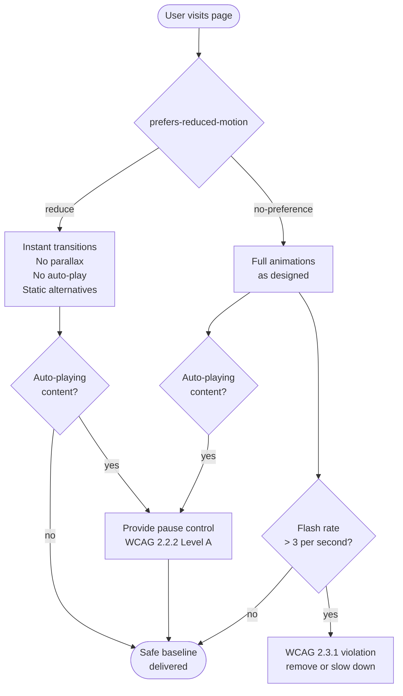

# Motion & Animation Accessibility

Motion and animation are powerful UI tools for communicating state, providing feedback, and guiding
attention. They also present accessibility risks. For users with vestibular disorders (a group that
includes millions of people worldwide), animations involving parallax, scaling, rotation, or
large-area movement can trigger nausea, dizziness, and migraines. The vestibular system, which
controls balance and spatial orientation, can be disrupted by visual motion that conflicts with the
body's other sensory signals. A hero section that zooms as the user scrolls, a parallax background
moving at a different rate than the foreground, or a card that expands outward on hover can all
produce incapacitating responses in users who have no visible disability and who would otherwise be
capable of using the interface without difficulty.

The `prefers-reduced-motion` CSS media query allows users to signal that they prefer less motion. On
macOS, this corresponds to "Reduce Motion" in Accessibility settings; on Windows, it corresponds to
"Turn off animations" in Ease of Access settings; on iOS and Android, equivalent accessibility
settings feed into the same media query when accessed via the browser. When the media query reports
`reduce`, the web application should eliminate or substantially reduce animations that could cause
harm or distraction. This is not a niche accommodation. Surveys of users with vestibular disorders
consistently find that motion on websites is one of the most common triggers of their symptoms, and
that many users have developed habits of keeping Reduce Motion enabled at all times to avoid
unpredictable content.

Reduced motion means reducing or replacing animations that could cause harm or distraction with
instant transitions or simpler alternatives, rather than removing animation entirely.
State-change animations that communicate meaning (a spinner indicating loading, a color change
indicating success, a subtle fade-in confirming that new content has loaded) can be preserved under
reduced motion because they convey information without triggering vestibular response. Large-scale
parallax movements, bouncing or spring-physics effects, rotation transitions, and auto-playing
animations that cover substantial screen area are the categories most associated with vestibular
triggers, and these should be eliminated or replaced with static equivalents when the media query
reports `reduce`.

For users with photosensitive epilepsy, flashing content presents a separate and more acute risk.
WCAG 2.3.1 (Three Flashes or Below Threshold) establishes that content must not flash more than
three times per second in a large area. This criterion is Level A, the baseline that all content
must meet, because violating it can trigger generalized tonic-clonic seizures in users with
photosensitive epilepsy. This is not a theoretical risk: documented cases exist of web content
causing seizures, and the consequences can be severe and immediate. For users with attention
disorders, persistent or looping animations in the periphery of their visual field can prevent
concentration on the primary task.

## Design Thinking

### Vestibular disorders and parallax

The vestibular system controls balance and spatial orientation by integrating signals from the inner
ear, the eyes, and proprioceptive receptors throughout the body. When visual motion on a screen
contradicts the body's other sensory signals (which remain still because the user is not physically
moving), the resulting conflict can produce a response similar to motion sickness. For users with
vestibular disorders, this response is significantly amplified compared to the typical population,
and can occur even with modest amounts of screen motion. Common UI patterns that trigger vestibular
response include: parallax scrolling effects in which different page layers move at different rates;
zoom animations that scale page elements in response to scroll position; sticky elements that move
or transform as the page scrolls; and large hero images or sections that animate in on page load
using scale or translate transforms.

Designers who have not experienced vestibular sensitivity underestimate how debilitating these
effects can be. The typical vestibular response is not merely aesthetic discomfort. It can produce
nausea that persists for hours after exposure to triggering content, dizziness that prevents further
computer use on the same day, and migraines that begin minutes after the triggering interaction.
Users who have had these experiences often learn to avoid websites that use parallax or large-scale
animations, but discovering that a site is a trigger requires exposure to the triggering content,
which means they cannot safely preview or dismiss before the effect begins. The minimum baseline for
every engineering team is to test their product with Reduce Motion enabled and verify that no
large-scale movement or parallax animation is present in the reduced-motion state.

Understanding why specific patterns trigger vestibular response helps engineers make better
substitutions. The trigger is the perception of objects moving through space, not visual change per
se: a color change, a fade, or an opacity transition rarely causes vestibular response. Animations
that suggest motion in three-dimensional space (zooms, perspective transforms, rotation) are more
likely to be triggers than animations that suggest two-dimensional change (color, opacity, blur). When replacing a triggering animation with a reduced-motion alternative, the goal
is to preserve the communicative intent of the animation, such as "this element is appearing" or
"this element is being removed," while substituting a perceptually flat change (a fade) for a
spatially suggestive one (a slide or zoom).

### prefers-reduced-motion: reduce vs. no-preference

The `prefers-reduced-motion` media query has two states: `no-preference` and `reduce`. The
`no-preference` state is the default. It is returned when the user has not adjusted their system
accessibility settings, and it does not indicate that the user actively wants motion. The `reduce`
state is returned when the user has explicitly enabled Reduce Motion in their system settings,
indicating a preference for less motion.

A common implementation pattern writes the full animation as the default CSS rule and adds a
`prefers-reduced-motion: reduce` override that disables it. This approach works, but it creates a
failure mode: if the media query is not supported, or if a CSS specificity issue causes the override
to be ignored, users who have enabled Reduce Motion receive the animated version. The preferred
pattern inverts this: write the reduced-motion state as the default CSS, and wrap the animated
version in a `@media (prefers-reduced-motion: no-preference)` block. In this pattern, the safe
baseline is the default that every user receives, and the animated version is an opt-in that applies
only to users who have not expressed a preference for reduced motion. This is more conservative and
safer: a specificity issue or an unsupported media query causes users to receive the static version
rather than the animated one, which is the less harmful failure mode.

The choice of which approach to use also depends on how animations are authored. For CSS animations
controlled entirely in stylesheets, the inverted pattern is easiest to implement. For animations
driven by JavaScript animation libraries such as Framer Motion, the equivalent hook
(`useReducedMotion`) reads the media query programmatically and returns a boolean. Components can
use this boolean to skip the animated version of transitions entirely rather than applying a
duration override. For complex animation sequences, skipping is cleaner and more reliable than
attempting to override durations applied deep in a third-party library.

### WCAG 2.3.1 Three Flashes

WCAG 2.3.1 (Three Flashes or Below Threshold) establishes the photosensitive epilepsy seizure
threshold for web content. The criterion is violated when content flashes three or more times per
second in an area that covers more than 25% of the combined screen or viewport area, unless the
flash is below the luminance change threshold defined by the criterion's technical specification.
The criterion is Level A, the foundational baseline of accessibility, because violating it can
cause generalized tonic-clonic seizures in users with photosensitive epilepsy, with no warning and
sometimes severe consequences.

Web engineers encounter this criterion most often in three specific contexts. The first is CSS
animations that toggle opacity, visibility, or background color rapidly. For example, an animation
that cycles between `opacity: 0` and `opacity: 1` at a rate faster than three cycles per second.
The second is JavaScript-driven DOM changes that cause large areas of the screen to alternate
between high-contrast states, such as notification banners that flash to attract attention. The
third is embedded video content, including autoplaying promotional videos, that was not checked for
flash compliance before being published. Third-party content is not exempt: the publisher of the
page is responsible for the accessibility compliance of all content on the page, including embeds.

Automated testing cannot fully detect WCAG 2.3.1 violations, because most violations depend on the
rate and area of change during animation playback rather than static page structure. Screen
recordings of animated interactions can be analyzed with PEAT or the Harding Analyser. For
engineering teams without access to these tools, the practical heuristic is: never create CSS
animations or JavaScript transitions that alternate between strongly contrasting visual states
faster than once every 333 milliseconds (three times per second), and always ensure that such
alternating animations are constrained to small areas of the viewport.

### Auto-playing animations and WCAG 2.2.2

WCAG 2.2.2 (Pause, Stop, Hide) requires that auto-playing content that starts automatically and
lasts more than five seconds must be pausable, stoppable, or hideable by the user. This includes
carousels, hero animations, background videos, and looping illustrations. The pause or stop control
must be keyboard-accessible, and it must be visible without requiring the user to hover or focus
into the animated region to discover it. A looping background video in a hero section with no visible pause
button violates this criterion at Level A. An auto-advancing carousel that cycles through content
every four seconds with no way to stop it violates this criterion.

The intent of WCAG 2.2.2 is to address users with attention disorders, for whom persistent motion
in any part of the visual field is a significant distraction from the task they are trying to
complete. A user with ADHD attempting to read the body text of a page while a looping animation
plays in the header may find it functionally impossible to sustain attention on the text. The
pause control resolves this by giving the user agency to stop the motion so they can focus. The
control must be present from the moment the animation begins, not hidden behind hover states or
accessible only through a settings panel that the user must first discover.

Implementing a pause control for background videos requires a visible button with a clear label,
such as "Pause background video" or an icon with accessible name, that toggles the video's `paused`
state and updates its own label to reflect the current state ("Play background video" when paused).
The button must be reachable by keyboard in the natural tab order of the page, appearing before the
video in the DOM if the video is near the top of the page. For carousels, the pause control must
stop automatic advancement; individual navigation controls for moving between slides must remain
functional when automatic advancement is paused. The user's pause state should be respected for the
duration of their visit; restarting the animation after a user has paused it is a usability failure.

### JavaScript-driven animations and useReducedMotion

Many animation-heavy applications drive animations through JavaScript rather than CSS, using
libraries such as Framer Motion, GSAP, React Spring, or Anime.js. In these cases, the
`@media (prefers-reduced-motion)` CSS query may not apply, because the animation is constructed
programmatically and applied as inline styles or through a library's internal rendering pipeline. To
respect the user's reduced-motion preference in JavaScript-driven animations, the preference must
be read programmatically.

In React applications using Framer Motion, the `useReducedMotion` hook returns a boolean that is
`true` when the user has enabled Reduce Motion. Components can use this boolean to substitute a
reduced-motion animation variant (typically a simple fade or no animation at all) in place of the
full motion variant. The hook reads from the same underlying media query as the CSS feature, so it
responds to changes in system settings without a page reload. For applications not using Framer
Motion, the same result can be achieved with `window.matchMedia('(prefers-reduced-motion: reduce)')`
and a `change` event listener that updates component state when the media query state changes.

For animation libraries that apply animations to DOM nodes directly rather than through React state,
the media query result should be checked before initiating any animation sequence, and animation
durations should be set to near-zero rather than their default values when `reduce` is active. GSAP
provides a `gsap.globalTimeline.timeScale()` method that can be used to scale all animation
durations globally; setting this to an extreme value (0.001) when reduced motion is preferred
effectively eliminates all GSAP animations without modifying each animation's definition
individually. Whichever approach is used, the implementation should be applied globally and
consistently. A per-component implementation that requires each component author to opt in to
reduced-motion handling creates the risk that new components will omit it.

## Best Practices

**MUST** wrap all CSS animations and transitions that involve large-area movement, parallax, or
rotation in a `@media (prefers-reduced-motion: no-preference)` block, with a static or instant
fallback as the default rule. Writing the animated state as an opt-in rather than the fallback as
an override ensures that users who have not changed their system preference receive the safe
baseline, and removes the risk of a CSS specificity issue causing the media query override to be
silently dropped.

**MUST NOT** create CSS animations or JavaScript transitions that alternate between strongly
contrasting visual states more than three times per second in a region covering more than 25% of
the viewport. Content that violates WCAG 2.3.1 can trigger photosensitive epilepsy seizures.
Screen recordings of animated content should be analyzed with PEAT or the Harding Flash and
Pattern Analyser before publication whenever the content includes rapid alternating visual states.

**MUST** provide keyboard-accessible play/pause controls for all auto-playing animations or videos
that last more than five seconds. WCAG 2.2.2 is a Level A requirement. Carousels that advance
automatically, hero sections with looping video or animation, and any auto-playing content that
persists on the page requires a pause control that is visible in all states, reachable by keyboard
in the natural tab order, and labeled with an accessible name that reflects the current play/pause
state of the controlled content.

**SHOULD** use `transition-duration: 0.01ms; animation-duration: 0.01ms` rather than removing the
animation property entirely as the reduced-motion fallback for CSS transitions. Setting duration to
near-zero preserves the transition mechanism (which JavaScript may depend on via `transitionend`
and `animationend` events) while making the visual change effectively instantaneous. Removing the
property entirely with `animation: none` breaks JavaScript that listens for `animationend` to
trigger post-animation logic, and can produce silent regressions that are difficult to diagnose.

**SHOULD** implement a global reduced-motion hook or utility for JavaScript-driven animations, and
apply it at the application root rather than requiring each component to independently read the
media query. A global implementation ensures consistent behavior across the application, prevents
new components from accidentally omitting reduced-motion handling, and provides a single point of
update if the implementation strategy needs to change. The hook should also listen for media query
changes so that users who toggle Reduce Motion while the application is running receive an immediate
response without reloading the page.

## Visual



## Example

```css
/* Default: no motion — safe for all users, including
   those who have not changed system settings */
.hero {
  opacity: 1;
  transform: none;
}

/* Opt-in to motion only when user has no preference */
@media (prefers-reduced-motion: no-preference) {
  .hero {
    animation: slideIn 600ms ease-out;
  }

  .card {
    transition: transform 300ms ease, box-shadow 300ms ease;
  }

  .card:hover {
    transform: translateY(-4px);
  }
}

/* Alternative: global reduced-motion override.
   Use 0.01ms rather than 0 to preserve transitionend events. */
@media (prefers-reduced-motion: reduce) {
  *,
  *::before,
  *::after {
    animation-duration: 0.01ms !important;
    animation-iteration-count: 1 !important;
    transition-duration: 0.01ms !important;
    scroll-behavior: auto !important;
  }
}
```

## Common Mistakes

- Writing the animated state as the default and the reduced-motion state as an override. A
  specificity issue or unsupported media query causes the override to fail silently, delivering
  the animated version to users who have enabled Reduce Motion.
- Setting `animation: none` or `transition: none` in the reduced-motion fallback. This removes the
  animation mechanism entirely, breaking JavaScript that listens for `animationend` or
  `transitionend` events to trigger post-animation logic.
- Testing reduced-motion compliance only with Reduce Motion enabled and checking visually that
  animations are gone. This misses cases where JavaScript-driven animations ignore the CSS media
  query entirely and must be handled with `useReducedMotion` or `window.matchMedia`.
- Implementing reduced-motion handling per-component rather than globally. This creates the risk
  that new components omit it, requiring ongoing audit effort to detect gaps.
- Publishing auto-playing carousel or hero video content with no pause control, or with a pause
  control visible only on hover. A keyboard user who cannot trigger hover interactions cannot reach
  the pause control and cannot stop the animation.
- Assuming that parallax or zoom animations are safe because they are slow or subtle. Vestibular
  sensitivity varies widely across users; a slow parallax effect that appears harmless on a typical
  display can still trigger vestibular response in sensitive users.
- Using a rapid CSS opacity toggle to create an attention-drawing flash effect. Rapid opacity
  alternation between 0 and 1 on a large element can violate WCAG 2.3.1 even if the intent is
  decorative rather than alarming.
- Checking WCAG 2.3.1 compliance through visual inspection alone. The three-flashes-per-second
  threshold cannot be reliably detected by eye; tooling such as PEAT is required.
- Restarting auto-playing animations after the user has paused them. Once a user pauses motion,
  the paused state must be respected for the duration of their session.

## Related FEEs

- [FEE-1000 — Accessibility Overview](./1000.md)
- [FEE-710 — GPU-Accelerated Animations & `will-change`](../Rendering%20and%20Performance/710.md)
- [FEE-412 — `requestAnimationFrame` & Animation Timing](../JavaScript%20Core%20and%20Runtime/412.md)
- [FEE-1010 — Accessibility & Internationalization Intersection](./1010.md)

## References

- [MDN: prefers-reduced-motion](https://developer.mozilla.org/en-US/docs/Web/CSS/@media/prefers-reduced-motion)
- [web.dev: prefers-reduced-motion](https://web.dev/articles/prefers-reduced-motion)
- [WCAG 2.3.1: Three Flashes or Below Threshold](https://www.w3.org/WAI/WCAG22/Understanding/three-flashes-or-below-threshold)
- [WCAG 2.2.2: Pause, Stop, Hide](https://www.w3.org/WAI/WCAG22/Understanding/pause-stop-hide)
