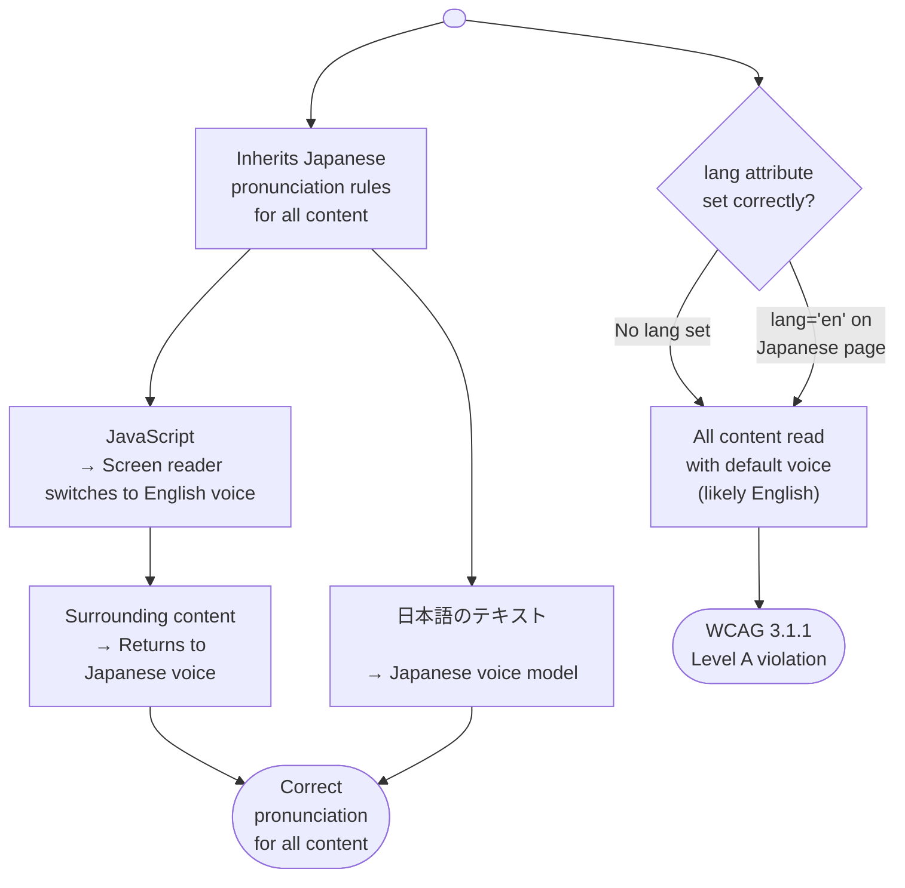

# Accessibility & Internationalization Intersection

Accessibility and internationalization (i18n) intersect in several critical ways. Screen readers
must know the language of the content to pronounce it correctly — a German word read by an
English-language voice model produces unintelligible output. RTL (right-to-left) languages require
not just text direction reversal but also keyboard navigation reversal and focus management
adjustments. Locale-sensitive formatting of numbers, dates, and currencies in ARIA labels must be
internationalized as carefully as visible text.

The `lang` attribute on the `<html>` element and on individual elements with content in a different
language is the primary mechanism for accessibility-correct internationalization. Screen readers use
this attribute to select the appropriate voice and pronunciation rules. An application that serves
multiple languages must set the `lang` attribute to the correct BCP 47 language tag for each page
or, for multilingual pages, on each section where the language changes from the page's primary
language.

The intersection is often overlooked because accessibility and i18n teams work independently.
Accessibility audits focus on English content; i18n teams focus on translation completeness. The
result is applications that pass accessibility audits in English but have untested and often broken
accessibility in other languages. A robust approach requires treating language tagging, ARIA
translation, and directionality management as first-class concerns alongside translation workflows,
not as afterthoughts discovered during a late-stage audit.

## Principle

Engineers MUST set the `lang` attribute on the `<html>` element to the correct BCP 47 language tag
for the page's primary language, and MUST set the `lang` attribute on inline elements when their
language differs from the page's primary language. Screen readers use the `lang` attribute to select
pronunciation rules; without it, a French-language page is read with English pronunciation, producing
unintelligible output for French words. The `lang` attribute is a WCAG 3.1.1 Level A requirement,
which means it is part of the foundational baseline that all web content must meet regardless of
the application's audience or market.

Engineers MUST internationalize all ARIA labels, `aria-label`, `aria-describedby` content, and
`title` attributes using the same translation infrastructure as visible text. ARIA attributes that
contain untranslated strings will be read in the wrong language by screen readers even when all
visible text is correctly translated. A "close dialog" button with a hardcoded `aria-label="Close"`
on a Japanese-language page reads the English word "Close" to Japanese screen reader users,
producing an experience that signals to the user that the application was not built with them in
mind.

## Design Thinking

### BCP 47 language tags

BCP 47 is the Internet standard for language tags used in the `lang` attribute. The format is
`language[-script][-region]`. Simple examples include `en` (English), `fr` (French), and `ja`
(Japanese). More qualified examples include `en-US` (English as used in the United States),
`zh-Hant-TW` (Chinese written in Traditional script as used in Taiwan), and `ar-SA` (Arabic as
used in Saudi Arabia). BCP 47 tags are case-insensitive by convention but the established form
uses lowercase language subtags and uppercase region subtags, which is what browsers and screen
readers expect.

In SSR (server-side rendering) contexts, the `lang` attribute on the `<html>` element can be set
server-side from the request locale, typically derived from the Accept-Language header or from the
URL path segment that identifies the locale (e.g., `/ja/`, `/zh-TW/`). This is the most reliable
implementation because the attribute is present in the initial HTML response and screen readers
can read it without waiting for JavaScript to execute.

In SPA (single-page application) contexts, the `lang` attribute must be updated dynamically when
the locale changes, which requires a document-level effect in the application's framework. The
attribute is not updated automatically by the browser when client-side navigation changes the
displayed locale; it requires an explicit assignment to `document.documentElement.lang`. A locale
change that updates the i18n provider but does not update the `lang` attribute produces a page
where the visible text is in the new language but the screen reader's voice model is still set to
the previous language, producing incorrect pronunciation for all content. Engineers working in SPA
frameworks must locate the effect that handles locale initialization and ensure that
`document.documentElement.lang` is assigned in the same effect, not only on initial load but also
on subsequent locale changes triggered by user action.

Choosing the correct BCP 47 tag requires care in several cases. For Chinese content, `zh` alone is
ambiguous — `zh-Hans` (Simplified) and `zh-Hant` (Traditional) select different character sets and
different pronunciation rules. For Arabic and Hebrew, specifying the region subtag matters because
dialectal differences in pronunciation are significant. When in doubt, consult the IANA Language
Subtag Registry, which is the authoritative source for valid BCP 47 subtags.

### RTL layout and keyboard navigation

RTL (right-to-left) languages — Arabic, Hebrew, Persian, Urdu, and others — require more than
setting `dir="rtl"` on the `<html>` element. The `dir` attribute reverses text rendering direction
and changes the visual reading flow from right to left. But it also affects keyboard navigation,
which should follow reading order. In an RTL layout, a user pressing the right arrow key in a menu
typically expects to move to the previous item (in LTR, right arrow moves forward), because right
is the beginning of the line in RTL reading order.

CSS logical properties automate layout adaptation to directionality. Using `margin-inline-start`
instead of `margin-left` means the property resolves to the correct side of the element regardless
of the writing direction. Similarly, `padding-inline-end` adapts to RTL without any media query or
direction check. The shift to logical properties is not merely cosmetic — it prevents entire classes
of RTL layout bugs that result from hardcoded left/right offsets being applied in a layout where
the reading direction has been reversed.

Focus order in RTL contexts may require explicit management in complex custom components. The browser
and screen reader typically follow DOM order for focus traversal, but complex grid-based layouts or
custom toolbars may have DOM order that reflects the LTR visual design rather than the RTL visual
order. In these cases, `tabindex` adjustments or DOM reordering may be necessary. Testing RTL
keyboard navigation is a separate activity from LTR testing — the same component can pass LTR
keyboard navigation tests and fail RTL keyboard navigation tests because the expected traversal
order is reversed. Engineering teams that serve RTL markets should maintain a separate RTL keyboard
navigation test suite or include RTL-specific cases in their existing keyboard navigation tests.

RTL support also intersects with icon directionality. Icons that represent direction or progress —
arrows, progress indicators, playback controls, navigation chevrons — should be mirrored in RTL
layouts because their implied direction is meaningful relative to the reading direction. Icons that
represent objects without directional meaning — a star, a checkmark, a camera — should not be
mirrored. This distinction is not handled automatically by `dir="rtl"` and requires explicit
mirroring logic, typically via CSS `transform: scaleX(-1)` on the appropriate icons or by using
directional icon variants in the design system.

### Screen reader language switching

A screen reader with multiple language packs installed can switch voice models automatically when
it encounters a `lang` attribute change in the document. When a user is reading a Japanese page
and the screen reader encounters `<span lang="en">API</span>`, it switches to the English voice
model for the word "API" and then returns to the Japanese voice model for the surrounding content.
This automatic switching depends entirely on the `lang` attribute being present on the element
with the different-language content and on the user having the corresponding language pack
installed.

For technical documentation, multilingual pages, and internationalized applications, this mechanism
has significant implications. A Japanese-language article that includes English technical terms —
JavaScript method names, API identifiers, programming keywords — will have those terms read with
Japanese phonetic mapping if they are not tagged with `lang="en"`. The resulting pronunciation may
be understandable in some cases (Japanese technical vocabulary has extensive phonetic borrowing from
English) but unintelligible in others. Tagging code identifiers and technical terms with their
source language improves screen reader output for users reading technical content.

The practical challenge is that marking every English technical term on a Japanese page with
`lang="en"` is not feasible manually at scale. The most pragmatic approach is to use `lang="en"` on
code blocks, code inline spans, and on sections where English terms are dense, and to accept that
individual loanwords integrated into Japanese text will not be individually tagged. The priority is
to ensure that entire sections of a page are not read with the wrong language model — a paragraph of
Japanese prose being read with an English voice is a significantly worse outcome than a single
English term being read with phonetic approximation.

### Locale-sensitive ARIA labels

ARIA labels that contain formatted values — prices, dates, counts, measurements — must use
locale-appropriate formatting, not just translation. An `aria-label` that embeds "Price: $1,234.56"
for English users must be "価格：¥1,234" for Japanese users, using not only the translated label
text but also the locale-appropriate currency symbol, number format, and punctuation conventions.
Using `Intl.NumberFormat` and `Intl.DateTimeFormat` to format values in ARIA labels — not just in
visible text — ensures consistency between what sighted users read and what screen reader users
hear.

The risk of locale-insensitive ARIA labels is subtle: visible text is typically passed through the
i18n framework and formatted correctly, but ARIA labels are often constructed in JavaScript as
string concatenations that use the formatting logic from the default locale. A component that
renders a formatted price in visible text using the i18n library may construct its `aria-label` by
concatenating the translated string with the price formatted using `toLocaleString()` without a
locale argument, which defaults to the environment locale rather than the user's selected locale.
The result is correct visible text and incorrect screen reader output for non-default locales.

Date formatting in ARIA labels has the highest potential for confusion because date formats vary
widely across locales. A date displayed as "01/02/03" is January 2, 2003 in the United States,
February 1, 2003 in the United Kingdom, and March 2, 2001 in Japan (year-first conventions). When
this ambiguous format appears in an `aria-label`, screen reader users receive no more context than
sighted users. Using `Intl.DateTimeFormat` with explicit options produces an unambiguous formatted
date appropriate for the user's locale — for example, "January 2, 2003" for `en-US` or
"2003年1月2日" for `ja-JP` — which removes the ambiguity entirely.

### Testing i18n + a11y together

English accessibility testing does not reveal pronunciation problems in French, Japanese, or Arabic.
An axe-core scan of an English page detects missing `lang` attributes, missing ARIA labels, and
contrast failures, but it cannot verify that a French page's `lang` attribute is set to `fr` rather
than `en`, that ARIA labels are translated into French, or that RTL keyboard navigation in an Arabic
page follows the correct reading order. These failures are invisible to English-language automated
testing.

Testing each supported locale with a screen reader set to that locale's language is the only way to
verify language tagging and ARIA translation correctness. On macOS, VoiceOver allows the selected
voice to be changed to any installed language; setting VoiceOver to a Japanese voice and navigating
the Japanese version of the application reveals `lang` attribute omissions immediately — the English
voice continues reading Japanese text despite the locale change. On Windows, NVDA supports multiple
language packs and can be configured to use each locale's voice for testing.

Automated tools can partially assist with i18n-a11y testing. Axe-core detects missing `lang`
attributes on the `<html>` element (WCAG 3.1.1) and on elements with lang-attribute syntax errors.
It does not detect cases where the `lang` attribute is present but set to the wrong language. Custom
lint rules or test assertions can check that `document.documentElement.lang` matches the current
locale at runtime. End-to-end tests can assert that ARIA labels contain translated strings rather
than English fallback strings for each locale. A combination of these automated checks reduces the
manual testing burden without eliminating the need for screen reader verification at each locale.

## Best Practices

**MUST** set `<html lang="...">` to the correct BCP 47 language tag and update it dynamically in
single-page applications when the user changes the application language. In an SPA, the `lang`
attribute must be updated when the language changes — setting it once at build time is insufficient
for applications that support in-session locale switching. A React application should update
`document.documentElement.lang` whenever the locale changes, in the same effect that updates the
i18n provider, so that the `lang` attribute always reflects the currently displayed language.

**MUST** include all ARIA labels, `aria-label` strings, and accessible name calculations in the i18n
translation catalog. Treating ARIA attributes as implementation details rather than user-facing text
produces untranslated screen reader announcements. Every string that a screen reader will speak —
visible or not — must be in the translation catalog and subject to the same translation workflow as
visible text. Code review and translation tooling should be configured to flag ARIA attributes that
contain hardcoded strings as the same class of defect as hardcoded visible text strings.

**MUST NOT** use `dir="ltr"` or `dir="rtl"` as a hardcoded attribute on `<html>` in templates that
serve multiple locales. Hardcoding the direction prevents the application from correctly displaying
RTL locales without code changes. Direction should be derived from the current locale at runtime and
applied dynamically to the `<html>` element alongside the `lang` attribute, so that switching to an
Arabic or Hebrew locale correctly reverses text direction and triggering RTL keyboard navigation
behavior in the browser.

**SHOULD** test each supported locale with a screen reader set to that locale's language. English
accessibility testing does not reveal pronunciation problems, `lang` attribute omissions, or RTL
navigation issues in non-English locales. Testing with VoiceOver (macOS/iOS) or NVDA (Windows) set
to each supported locale's voice is the only way to verify that the language tagging and ARIA
translation are correct. Where manual testing with every locale is not feasible, priority should be
given to RTL locales and to locales with the largest user base, as these carry the highest risk of
undetected failures.

**SHOULD** use `Intl.NumberFormat` and `Intl.DateTimeFormat` with explicit locale arguments when
constructing ARIA labels that contain formatted numbers, dates, or currency values. Passing the
current locale to these constructors ensures that the formatted value in the ARIA label matches
the visible text and uses locale-appropriate conventions, rather than defaulting to the environment
locale which may differ from the user's selected application locale.

## Visual



## Example

```jsx
function I18nProvider({ locale, children }) {
  React.useEffect(() => {
    // Update the lang attribute whenever the locale changes.
    // This ensures the screen reader switches voice models correctly.
    document.documentElement.lang = locale; // e.g., 'zh-Hant-TW'
    // Update directionality for RTL locales.
    const rtlLocales = ['ar', 'ar-SA', 'he', 'fa', 'ur'];
    const isRTL = rtlLocales.some(rtl => locale.startsWith(rtl));
    document.documentElement.dir = isRTL ? 'rtl' : 'ltr';
  }, [locale]);

  return <IntlProvider locale={locale}>{children}</IntlProvider>;
}

// Translated ARIA label via react-intl.
// The translation catalog entry for 'dialog.close' is translated
// into every supported locale — it is not hardcoded in English.
function CloseButton({ onClose }) {
  const intl = useIntl();
  return (
    <button
      aria-label={intl.formatMessage({ id: 'dialog.close' })}
      onClick={onClose}
    >
      <CloseIcon aria-hidden="true" />
    </button>
  );
}

// Locale-sensitive ARIA label for a formatted price.
// Intl.NumberFormat uses the current locale, not the environment default.
function PriceLabel({ amount, locale }) {
  const formatted = new Intl.NumberFormat(locale, {
    style: 'currency',
    currency: locale.startsWith('ja') ? 'JPY' : 'USD',
  }).format(amount);
  return <span aria-label={formatted}>{formatted}</span>;
}
```

## Common Mistakes

- Setting the `lang` attribute once in the HTML template and never updating it in SPAs. When the
  user switches language client-side, the `lang` attribute remains set to the initial locale, causing
  the screen reader to use the wrong voice model for all content in the new language.
- Omitting ARIA label strings from the translation catalog. Strings passed to `aria-label`,
  `aria-describedby`, and `title` are not automatically included by i18n extraction tools that scan
  JSX for user-facing text; they require explicit inclusion or extraction rules.
- Hardcoding `dir="ltr"` on the `<html>` element in HTML templates, preventing RTL locales from
  displaying correctly without code changes.
- Testing accessibility only with English content and English screen reader voice settings. This
  misses `lang` attribute omissions and untranslated ARIA labels that are only detectable when using
  a screen reader configured for the target locale.
- Using `toLocaleString()` without an explicit locale argument when constructing ARIA label strings.
  The environment locale and the user's selected application locale may differ, producing ARIA labels
  formatted for the wrong locale.
- Forgetting to apply `lang` attributes to inline code snippets and technical terms that are in a
  different language from the surrounding prose. Screen readers attempt to pronounce these using the
  page's primary voice model, which can produce unintelligible output for identifiers and keywords.
- Assuming that RTL support is complete after applying `dir="rtl"` and fixing visual layout. RTL
  also affects keyboard navigation order, icon directionality, and focus management in complex
  interactive components, all of which require separate testing.

## Related FEEs

- [FEE-1000 — Accessibility Overview](./1000.md)
- [FEE-1001 — ARIA & Semantic HTML](./1001.md)
- [FEE-1004 — Screen Readers & Assistive Technology](./1004.md)
- [FEE-1008 — Cognitive Accessibility](./1008.md)

## References

- [WCAG 3.1.1: Language of Page](https://www.w3.org/WAI/WCAG22/Understanding/language-of-page)
- [MDN: lang attribute](https://developer.mozilla.org/en-US/docs/Web/HTML/Global_attributes/lang)
- [W3C: BCP 47 Language Tags](https://www.rfc-editor.org/rfc/bcp/bcp47.txt)
- [W3C: Internationalization and Accessibility](https://www.w3.org/WAI/fundamentals/accessibility-intro/)
