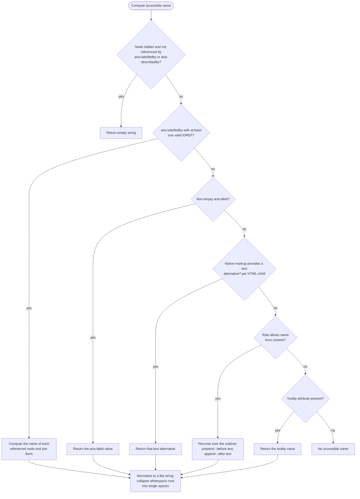

# [FEE-1011] Accessible Name Computation — How the AccName Algorithm Resolves Labels

:::info
When a screen reader announces a control, the string it speaks is produced by the accessible name computation defined in the W3C Accessible Name and Description Computation specification. The algorithm checks candidate sources in a fixed order: aria-labelledby, then aria-label, then host-language attributes, then name from content, then the tooltip attribute, and the first non-empty result wins. Chrome DevTools exposes this computation directly: its accessibility pane lists every candidate source in precedence order and marks which one won. Misreading that precedence order produces real labeling bugs, such as an aria-label that hides a button's visible text from assistive technology users.
:::

## Context

Accessible Name and Description Computation 1.2 is a W3C Working Draft on the Recommendation track, last published 05 August 2026, and it updates the AccName 1.1 Recommendation. The core algorithm is stable across versions: an ordered sequence of steps where the first non-empty result wins. The specification delegates host-language specifics to HTML Accessibility API Mappings (HTML-AAM), which adapts the AccName algorithm for HTML elements such as `label`, `alt`, `placeholder`, and `title`. Practitioner guidance from the W3C ARIA Authoring Practices Guide and vendor accessibility blogs converges on preferring visible text and native HTML techniques over ARIA naming attributes. The Accessibility articles in this corpus reference labels throughout; this article walks the computation that decides which label actually gets announced.

## Visual

The flowchart below traces the computation steps for a single element. Each step either returns a result, delegates to a deeper traversal, or falls through to the next source.



## Example

Consider a save button that carries three competing name sources plus an icon-font glyph:

```html
<style>
  .icon-save::before {
    font-family: "IconFont";
    content: "\f0c7";
  }
</style>

<button class="icon-save" title="Save the current draft" aria-label="Save">
  Save document
</button>
```

There is no `aria-labelledby`, so the algorithm reaches the aria-label step and returns its value. The computed name is `Save`. Open the element in Chrome DevTools and select the accessibility pane: it lists the candidate sources in computation-priority order and shows `aria-label` as the winning source, with the losing candidates below it. Because `aria-label` won on a button, a role that supports naming from child content, the visible text `Save document` and the icon glyph are hidden from assistive technology users.

Delete the `aria-label` attribute and the computation falls through to name from content. That step is recursive over the subtree, and the specification requires user agents to prepend `::before` textual content and append `::after` textual content. The computed name becomes the private-use glyph `\f0c7` followed by `Save document`. The indentation and newline inside the button do not survive: the result is normalized into a flat string in which carriage returns, newlines, tabs, and form feeds become single spaces and multiple spaces collapse into one.

Delete the class and the visible text as well, leaving only `<button title="Save the current draft"></button>`. Every earlier source is now empty, so the tooltip step returns the `title` value. Practitioner guidance treats this outcome as a fallback rather than a technique to design for.

The referenced-name path behaves differently around hidden content:

```html
<span id="discard-hint" style="display: none">Discard unsaved changes</span>
<button aria-labelledby="discard-hint">X</button>
```

A hidden node normally contributes an empty string to the computation. The exception applies here: the `span` is referenced by `aria-labelledby`, so its content participates anyway, and the button announces as `Discard unsaved changes`. The visible `X` loses because `aria-labelledby` sits ahead of name from content in the step order.

## Best Practices

- You MUST NOT use `aria-label` or `aria-labelledby` on elements whose role prohibits naming. WAI-ARIA 1.2 lists 11 name-prohibited roles: caption, code, deletion, emphasis, generic, insertion, paragraph, presentation, strong, subscript, and superscript. HTML-AAM defines the implicit role of ten common HTML elements as one of these: `<caption>` maps to caption, `<code>` to code, `<del>` to deletion, `<em>` to emphasis, `<ins>` to insertion, `<p>` to paragraph, `<span>` to generic, `<strong>` to strong, `<sub>` to subscript, and `<sup>` to superscript. Writing any of these elements without an explicit `role` therefore lands on a role where naming is prohibited. The specification defines these roles as having no name. The WAI-ARIA 1.3 Working Draft expands the list to 17 roles, adding definition, mark, suggestion, term, time, and tooltip.
- You MUST test with assistive technologies whenever `aria-label` is applied to a role that supports naming from child content, because the attribute value replaces the descendant content for assistive technology users and is never rendered visually.
- You SHOULD name controls with their visible text, meaning the text actually rendered inside the control (the `Save document` on this article's example button). The ARIA Authoring Practices Guide states that this simplifies maintenance, prevents bugs, and reduces language translation requirements.
- You SHOULD prefer native HTML naming techniques such as `label` and `alt` over ARIA attributes; improperly used ARIA can override correct HTML semantics, and ARIA-heavy pages show higher error rates.
- You SHOULD NOT rely on the `title` attribute as a primary naming method; it contributes only when no stronger source is present, and the APG's cardinal rules include avoiding browser fallback.
- You SHOULD verify computed names in the Chrome DevTools accessibility pane, which lists candidate sources in computation-priority order and shows which source won.
- You SHOULD compose brief, useful names, following the APG's cardinal rules.
- You MAY reference a hidden element from `aria-labelledby`. The computation normally skips hidden nodes (`display: none`, `visibility: hidden`, or the HTML `hidden` attribute) and treats them as empty strings, but a hidden node referenced by `aria-labelledby` or `aria-describedby` still contributes its text. The APG demonstrates this with `<span id="night-mode-label" hidden>Night mode</span>` labeling a switch: the switch still computes the name `Night mode`.

## Failure Modes

Each of the following bugs maps to a specific step of the computation, and each is observable in the DevTools accessibility pane, which shows the candidate sources and the winner.

**aria-label silences the visible text.** The aria-label step precedes name from content, so an `aria-label` on a button, link, or other role that names from content replaces everything inside the element for assistive technology users. A button that visually reads `Save document` but carries `aria-label="Submit"` announces as `Submit`. The APG warns that testing with assistive technologies is particularly important here because the `aria-label` value is never rendered visually.

**A display:none label still speaks.** Hidden nodes return an empty string during normal traversal, but nodes referenced by `aria-labelledby` or `aria-describedby` are an exception: a `display: none` target still contributes its text. A note in the specification frames this as an intentional author override: explicitly referencing a hidden node signals that the author wants it in the computation. The bug scenario: a refactor hides a label `span` but leaves the button's `aria-labelledby` pointing at it, so the screen reader keeps announcing the stale label text and the button's visible text stays overridden.

**Icon-font glyphs pollute the name.** User agents prepend `::before` textual content and append `::after` textual content during name from content. In this article's example, `.icon-save::before` injects a glyph through `content: "\f0c7"`; once the `aria-label` is removed, the button's computed name is `\f0c7` followed by `Save document`. The name now opens with a character that corresponds to nothing in the visible label text, and every element decorated with the same icon class picks up the same character in its name.

**A name on a prohibited role disappears.** For roles whose name is prohibited, the element has no name, and the specification forbids authors from using `aria-label` or `aria-labelledby` on them. For example, in `<p aria-label="Disclaimer">For reference only</p>`, paragraph is a name-prohibited role, so the `aria-label` never becomes the paragraph's name and screen readers do not announce `Disclaimer`. See the first Best Practices entry for the full list of prohibited roles.

## Related Topics

- [ARIA & Semantic HTML](/en/Accessibility/1001) — the semantic foundation the naming algorithm reads from.
- [Screen Readers & Assistive Technology](/en/Accessibility/1004) — how the computed name is ultimately presented to users.
- [Accessible Forms & Inputs](/en/Accessibility/1005) — label association patterns whose results this algorithm resolves.
- [Testing Accessibility: axe, Lighthouse & Screen Readers](/en/Accessibility/1006) — tooling that flags the labeling bugs described here.

## References

- [Accessible Name and Description Computation 1.2 — W3C Working Draft (2026)](https://www.w3.org/TR/accname-1.2/)
- [HTML Accessibility API Mappings 1.0 — W3C (2026)](https://www.w3.org/TR/html-aam-1.0/)
- [Accessible Rich Internet Applications (WAI-ARIA) 1.2 — W3C](https://www.w3.org/TR/wai-aria-1.2/)
- [Accessible Rich Internet Applications (WAI-ARIA) 1.3 — W3C Working Draft (2026)](https://www.w3.org/TR/wai-aria-1.3/)
- [Providing Accessible Names and Descriptions — W3C WAI, ARIA Authoring Practices Guide (2026)](https://www.w3.org/WAI/ARIA/apg/practices/names-and-descriptions/)
- [Accessible name — MDN Web Docs Glossary, Mozilla (2026)](https://developer.mozilla.org/en-US/docs/Glossary/Accessible_name)
- [The order of accessible name computation steps — Stefan Judis (2024, updated 2025)](https://www.stefanjudis.com/today-i-learned/the-order-of-accessible-name-computation-steps/)
- [ARIA Labels and Accessible Names: A Developer's Guide — Level Access (2026)](https://www.levelaccess.com/blog/aria-labels-and-accessible-names-a-developers-guide/)
