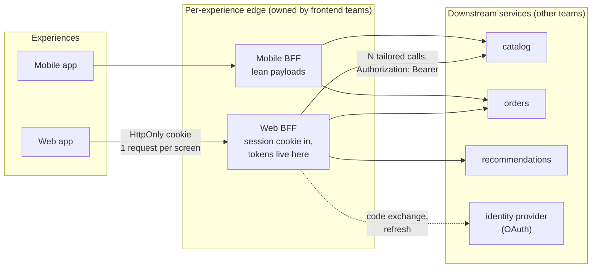

# [FEE-1905] Backend-for-Frontend (BFF) & the API Boundary

:::info
A Backend-for-Frontend is a small server-side component paired with exactly one user experience, owned by the team that builds that experience. It exists because general-purpose APIs serve every client equally badly: the web app needs three aggregated calls collapsed into one, the mobile app needs a lean payload, and both wait on a backend team's roadmap to get either. The BFF moves that translation layer inside the frontend team's fence, where it can change as fast as the UI does. The pattern has since acquired a second job that is now often the deciding reason to adopt it: the IETF's OAuth guidance for browser-based apps ranks BFF as the most secure architecture, because tokens live only on the server and the browser holds nothing a script injection can steal. One pattern, two payoffs: an API shaped like your screens, and an API boundary that doubles as your token boundary.
:::

## Context

The pattern grew out of SoundCloud's escape from a monolithic public API around 2015: when the team building a new client owned its own API layer, it "could move much quicker as it required no coordination between parts", and Phil Calçado and Sam Newman wrote the result up as Backends For Frontends. The organizational insight is Conway's law used deliberately: instead of one general API team as a bottleneck for every client's needs, each experience gets a single-purpose edge service that aggregates downstream services and shapes responses for that one UI. A decade later most frontend teams run a BFF without calling it one, because meta-framework server routes (API routes, server actions, loaders) are per-experience server code owned by the UI team, which is the pattern's whole definition. What did change is the security half: the OAuth 2.0 for Browser-Based Apps draft (an IETF Best Current Practice in progress) codified BFF, token-mediating backend, and browser-only OAuth as the three architectures "in decreasing order of security", making "where do tokens live" the sharpest fork in modern frontend API design. This article covers both halves and the boundary discipline that keeps a BFF from becoming a second monolith.

## Visual



## Example

The aggregation half: one screen, one endpoint. The BFF fans out to downstream services, drops everything the screen does not render, and returns a payload shaped like the UI. The example uses Hono, but any server framework with route handlers reads the same:

```ts
// bff/routes/home.ts -- one endpoint per screen, shaped for that screen
import { Hono } from "hono";

export const home = new Hono().get("/api/home", async (c) => {
  const user = c.get("session").userId;
  const [orders, recs] = await Promise.all([
    ordersService.recent(user, { limit: 3 }),
    recommendationService.forUser(user, { limit: 6 }),
  ]);
  return c.json({
    greetingName: orders.customer.firstName,
    openOrders: orders.items.map((o) => ({
      id: o.order_id,                 // downstream shape stops here
      status: STATUS_LABEL[o.state],
      eta: o.estimated_delivery,
    })),
    recommendations: recs.map((r) => ({ id: r.id, title: r.title, image: r.hero_url })),
  });
});
```

The token-handler half: the browser gets an `HttpOnly` session cookie and nothing else; the BFF is a confidential OAuth client that keeps access and refresh tokens server-side and injects them into proxied calls. Malicious page script can *use* the session while it runs, but there is no token to exfiltrate:

```ts
// bff/routes/auth.ts -- the BFF is the OAuth client; the browser never sees tokens
export const auth = new Hono()
  .get("/auth/callback", async (c) => {
    const tokens = await oauth.exchangeCode(c.req.query("code"), { pkce: true });
    const sid = await sessionStore.create(tokens);          // tokens live server-side
    setCookie(c, "sid", sid, {
      httpOnly: true, secure: true, sameSite: "Lax", path: "/",
    });
    return c.redirect("/");
  })
  .all("/api/proxy/*", async (c) => {
    const tokens = await sessionStore.get(getCookie(c, "sid"));
    return fetch(downstreamUrl(c.req), {
      method: c.req.method,
      headers: { Authorization: `Bearer ${await freshAccessToken(tokens)}` },
      body: c.req.raw.body,
    });
  });
```

The client-side consequence is mostly deletion. No token storage, no refresh choreography, no `Authorization` header plumbing; requests are plain same-origin fetches with `credentials` on, plus a CSRF token because cookies come along for the ride on cross-site requests too:

```ts
// web/src/api/client.ts
export async function api<T>(path: string, init?: RequestInit): Promise<T> {
  const res = await fetch(`/api${path}`, {
    ...init,
    credentials: "same-origin",
    headers: { ...init?.headers, "X-CSRF-Token": readCsrfToken() },
  });
  if (res.status === 401) redirectToLogin();
  return res.json();
}
```

## Best Practices

- **MUST** pair one BFF with one experience and resist generalizing it; the moment two clients share a BFF, every change negotiates with two screens, and the general-purpose API problem has been rebuilt one layer closer.
- **MUST** put the BFF under the frontend team's ownership: same repo or same review path as the UI. A BFF owned by a platform team is an API gateway with a misleading name.
- **MUST** keep OAuth tokens out of the browser for applications that handle sensitive or personal data, per the IETF browser-based apps guidance: `HttpOnly` + `Secure` + `SameSite` session cookie to the client, tokens confined to the BFF.
- **MUST** still defend against CSRF (cross-site request forgery) once cookies carry the session: `SameSite=Lax` plus an explicit token or origin check on mutations, because a cookie-authenticated endpoint is exactly what CSRF targets.
- **MUST** keep domain rules out of the BFF: it aggregates, reshapes, and authorizes transport, while pricing/permissions/workflow logic belongs downstream or in the client's domain core. A BFF that computes business outcomes is a second monolith with a nicer name.
- **SHOULD** collapse chatty call sequences server-side; the BFF sits on datacenter latency, the browser on last-mile latency, and moving a three-call waterfall across that line is routinely the single largest perceived-performance win of adoption.
- **SHOULD** recognize the BFF you already have: meta-framework route handlers, server actions, and loaders are per-experience server code owned by the UI team, so apply the same boundary discipline there instead of adding a second edge layer.
- **SHOULD** let the BFF host the anti-corruption mapping when one exists (see [Frontend DDD](/en/Application Architecture and Scaling Patterns/frontend-ddd)): translating upstream DTOs server-side keeps the wire format and the browser bundle out of each other's business.
- **MAY** implement the BFF's query surface as GraphQL when screens vary wildly in data shape; the pattern is orthogonal to the protocol.
- **MAY** skip the pattern entirely for a web-only app whose API is already UI-shaped and whose auth is cookie-based, which is Newman's own boundary for it: without aggregation or token duties, a BFF is a hop that adds latency and an on-call rotation.

## Design Thinking

**BFF versus API gateway is ownership, not topology.** Both sit between clients and services; the difference is who changes them and why. A gateway is shared infrastructure that grows generic features (rate limiting, routing) and resists per-screen churn; a BFF is application code that exists to churn with its screen. Newman's framing survives because it names the failure of the middle path: a "shared BFF" accumulates every client's needs, and coordination cost, until it is a general-purpose API again.

**Duplication across BFFs is the price, autonomy is the product.** Two BFFs will both write pagination glue and both call the orders service. The pattern's bet is that this duplication is cheaper than the coordination it replaces, and the bet holds while the duplicated code is translation. When the same *business rule* appears in two BFFs, that is not acceptable duplication but a signal the rule belongs downstream.

**The security reframing changed the adoption math.** For years BFF was a developer-experience pattern you adopted when aggregation pain justified an extra deployable. The OAuth browser-based-apps work inverted the default for sensitive applications: browser-held tokens are now the architecture you must argue *for*, XSS blast radius is the argument you must answer, and the BFF is the reference answer. Teams that need neither aggregation nor tailoring still adopt it purely as the token boundary.

**The cost is a service, and frontend teams should price it honestly.** A BFF is a deployable with uptime, secrets, scaling, and an on-call story, owned by a team whose expertise is UI. Meta-framework hosting absorbs some of that operational weight, which is a real reason the pattern spread with those frameworks rather than before them.

## Deep Dive

**The IETF architecture ladder.** The browser-based apps draft orders three architectures by decreasing security. *BFF*: the backend is a confidential OAuth client, all resource requests proxy through it, tokens never reach the browser; script injection can ride the session but cannot steal credentials. *Token-mediating backend*: the backend obtains tokens but hands the access token to the browser for direct resource calls, trading proxy hops for a stealable (if short-lived) token. *Browser-only public client*: the SPA does the whole dance itself, and every token sits one XSS away from exfiltration. The draft strongly recommends the first for business and personal-data applications, and it pairs with RFC 9700 (OAuth security BCP) for the surrounding hardening.

**Cookie mechanics at the boundary.** The session cookie carries `HttpOnly` (script cannot read it), `Secure` (TLS only), and `SameSite=Lax` or `Strict` (limits cross-site sending). `Lax` still permits top-level navigation GETs, so state-changing routes need a CSRF token, an `Origin`/`Sec-Fetch-Site` check, or both. Same-origin deployment of BFF and app (one domain, path-routed) sidesteps CORS entirely and is the least error-prone shape; a cross-subdomain BFF reintroduces CORS-with-credentials and cookie-scoping decisions that must then be made deliberately.

**Streaming and long-lived connections.** Proxying SSE or WebSocket upgrades through the BFF keeps the token boundary intact but makes the BFF a connection-holding tier, which changes its scaling profile from stateless request handler to something with per-user memory. The common compromises: terminate streams at the BFF and re-expose them as same-origin SSE, or mint short-lived, narrowly-scoped tokens for a direct socket connection, accepting a bounded step down the security ladder for that one channel.

**Failure shaping is part of the contract.** Downstream partial failures surface at the BFF, which must decide per screen what degradation means: omit the recommendations block, substitute cached orders, or fail the screen. Encoding those choices server-side keeps them consistent across clients of the same experience and out of component trees, and it is a large share of what "shaped like the UI" means in practice.

## Architecture Selection Ladder

Where should the API boundary and the tokens live? In decreasing order of security, with the trade each step buys:

| Architecture | Tokens live | Browser holds | Choose when |
|---|---|---|---|
| BFF (proxying) | Server only | `HttpOnly` session cookie | Sensitive/business apps; aggregation also wanted; IETF's strong recommendation |
| Token-mediating backend | Obtained server-side, access token handed to browser | Short-lived access token | Direct-to-resource calls required (media CDNs, third-party APIs) but a backend exists |
| Browser-only OAuth client | Browser | Access + refresh tokens | No backend at all is available; accept the XSS exposure knowingly |
| No BFF, cookie API | Server session, no OAuth in browser | Session cookie | Web-only app, UI-shaped first-party API: the pattern's own "do not bother" case |

Two forcing questions collapse most debates: "if an attacker runs script on our page, what do they walk away with?" and "who has to approve a payload change for this screen?" The first ranks the rows; the second decides whether the edge belongs to the frontend team at all.

## Related Topics

- [Domain-Driven Design for the Frontend](/en/Application Architecture and Scaling Patterns/frontend-ddd)
- [Server-Driven UI](/en/Application Architecture and Scaling Patterns/server-driven-ui)
- [Authentication & Token Storage](/en/Security/1202)
- [CORS & CSRF](/en/Security/1204)
- [SSR & Server Component Security](/en/Security/1207)

## References

- Sam Newman, "Pattern: Backends For Frontends," samnewman.io (2015). https://samnewman.io/patterns/architectural/bff/
- Phil Calçado, "The Back-end for Front-end Pattern (BFF)," philcalcado.com (2015). https://philcalcado.com/2015/09/18/the_back_end_for_front_end_pattern_bff.html
- IETF OAuth Working Group, "OAuth 2.0 for Browser-Based Applications," Internet-Draft draft-ietf-oauth-browser-based-apps-26 (2025). https://www.ietf.org/archive/id/draft-ietf-oauth-browser-based-apps-26.html
