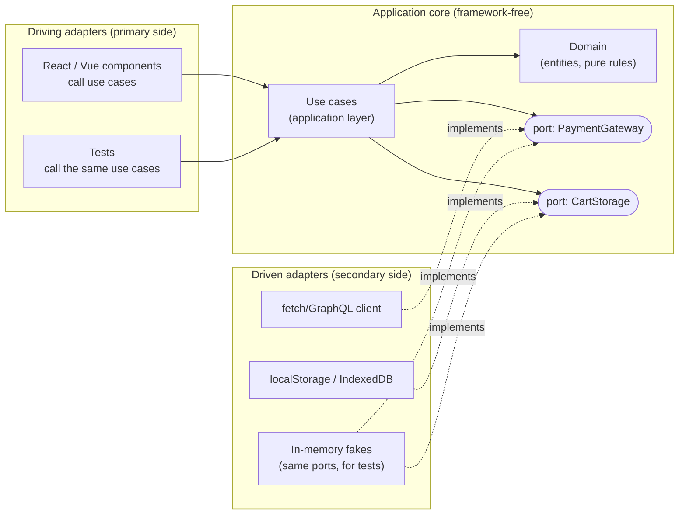

# [FEE-1903] Clean & Hexagonal Architecture in the Frontend

:::info
Clean Architecture and Hexagonal Architecture (Ports & Adapters) are two formulations of one rule: source-code dependencies point inward, toward the business logic, and never outward toward frameworks, network clients, or storage. The domain core knows nothing about React, fetch, or localStorage; it talks to the outside world through *ports* (interfaces it owns), and the outside world plugs in through *adapters* that implement them. On the frontend this buys three things: business logic that survives framework churn, tests that run without a DOM or a network, and a codebase where "where does this rule live?" has one answer. The price is indirection, and the pattern only pays where real domain logic exists; a thin CRUD screen wrapped in four layers is ceremony, not architecture.
:::

## Context

Hexagonal Architecture was named by Alistair Cockburn in 2005 to solve an application-design problem: business logic that leaks into UI and database code until neither can change independently, and nothing can be tested in isolation. Robert C. Martin's Clean Architecture (2012) unified it with several sibling patterns (Onion Architecture among them) into concentric circles governed by a single Dependency Rule. Frontends inherited the same disease with different symptoms. Components accumulate pricing rules, validation, and workflow logic; the day the framework changes shape (class components to hooks, hooks to server components) or the API layer migrates (REST to GraphQL), the business logic migrates with it, by hand, because it was never separated. The pattern arrived late to the frontend because early frontends had little domain logic worth protecting. Offline-capable apps, editors, carts, and dashboards changed that. This article shows the frontend translation: what goes in the core, what a port looks like in TypeScript, and where the pattern stops paying. Its siblings are [Feature-Sliced Design](/feature-sliced-design), which organizes code by domain slice, and [Domain-Driven Design](/frontend-ddd), which decides what the domain even is.

## Visual



## Example

The core is plain TypeScript. The domain layer holds entities and pure rules; the application layer holds use cases and *defines the ports it needs*. Note the direction: the interface lives with its consumer, not with its implementation. That ownership choice is what makes the dependency arrow point inward.

```ts
// core/domain/cart.ts -- intra-core imports are fine; the rule bars the outside
import { add, ZERO, type Money } from "./money";

export interface Cart { items: CartItem[]; coupon?: Coupon; }

export function cartTotal(cart: Cart): Money {
  const subtotal = cart.items.reduce((sum, i) => add(sum, price(i)), ZERO);
  return cart.coupon ? applyCoupon(subtotal, cart.coupon) : subtotal;
}

// core/application/ports.ts -- the core declares what it needs from the world
export interface PaymentGateway {
  pay(amount: Money): Promise<PaymentResult>;
}
export interface CartStorage {
  load(): Promise<Cart>;
  save(cart: Cart): Promise<void>;
}

// core/application/checkout.ts -- a use case orchestrates domain + ports
export function makeCheckout(deps: { payment: PaymentGateway; storage: CartStorage }) {
  return async function checkout(): Promise<PaymentResult> {
    const cart = await deps.storage.load();
    const result = await deps.payment.pay(cartTotal(cart));
    if (result.ok) await deps.storage.save({ items: [] });
    return result;
  };
}
```

Adapters live outside and implement the ports. The API client maps transport-shaped data to domain-shaped data at the boundary, so wire-format changes stop here:

```ts
// adapters/paymentApi.ts -- driven adapter: implements a core port
import type { PaymentGateway } from "../core/application/ports";

export const httpPayment: PaymentGateway = {
  async pay(amount) {
    const res = await fetch("/api/pay", {
      method: "POST",
      headers: { "Content-Type": "application/json" },
      body: JSON.stringify({ cents: amount.cents, currency: amount.currency }),
    });
    // failures are translated here too, never re-thrown as transport errors
    if (res.status === 402) return { ok: false, reason: "insufficient-funds" };
    if (!res.ok) return { ok: false, reason: "gateway-error" };
    const dto = await res.json();          // transport shape
    return { ok: dto.status === "OK", transactionId: dto.tx_id }; // domain shape
  },
};
```

The UI is a *driving* adapter: it calls use cases and renders their results, and the wiring happens once at the composition root (the one place allowed to know every concrete adapter):

```tsx
// app/compositionRoot.ts
export const checkout = makeCheckout({ payment: httpPayment, storage: localCartStorage });

// ui/CheckoutButton.tsx -- framework code stays thin
function CheckoutButton() {
  const [state, setState] = useState<"idle" | "paying" | "done" | "failed">("idle");
  return (
    <button onClick={async () => {
      setState("paying");
      const result = await checkout();
      setState(result.ok ? "done" : "failed");
    }}>
      {state === "paying" ? "Processing..." : "Pay"}
    </button>
  );
}
```

The payoff shows up in tests: the same use case runs against in-memory fakes, with no DOM or network involved:

```ts
test("checkout empties the cart on success", async () => {
  const storage = inMemoryStorage(cartWith(twoItems));
  const checkout = makeCheckout({ payment: alwaysApproves, storage });
  await checkout();
  expect((await storage.load()).items).toHaveLength(0);
});
```

## Best Practices

- **MUST** keep the core free of framework and platform imports: no React, no `fetch`, no `window`, no router. If a file in `core/` imports from `node_modules` beyond the language level, the boundary is already gone.
- **MUST** let the inner layer own its port interfaces (define `PaymentGateway` next to the use case that needs it, not next to the HTTP client that implements it). Interfaces owned by the adapter invert nothing.
- **MUST** pass plain data across boundaries: domain types in, domain types out. Transport DTOs (data transfer objects, the wire-format shapes) stop at the adapter, and framework objects (events, refs, request objects) never enter the core.
- **MUST** enforce the dependency direction with tooling (`eslint-plugin-boundaries`, `dependency-cruiser`, or FSD's Steiger where the layers align); an unenforced architecture erodes with every sprint.
- **SHOULD** start with domain extraction only: pull the pure rules out of components first, add ports and use cases when the second consumer or the first serious test appears. This is the incremental path the pattern's own literature recommends.
- **SHOULD** treat the state manager as an adapter, not as the core: a store holds and distributes state; the rules that compute state transitions belong in the domain, imported by the store.
- **SHOULD** keep exactly one composition root per app (or per micro-frontend) where concrete adapters are chosen; scattered `new`/imports of adapters throughout the tree recreate the coupling the ports removed.
- **MAY** skip the full layering for thin CRUD surfaces where the "domain" is a form and a POST; a pattern whose core would be empty is overhead by definition.
- **MAY** vary the adapter per environment: an in-memory `CartStorage` for tests, an IndexedDB one offline, an HTTP one online, all behind one port. Interchangeability is the pattern's original stated intent.

## Design Thinking

**The rule is one sentence; the discipline is the hard part.** "Dependencies point inward" costs nothing to state and a code review culture to keep. Every shortcut has a plausible excuse: importing the API client "just once" into a use case, letting a component compute a price "because it is only used here". The reason to enforce mechanically is that each individual violation is defensible and the sum is the big ball of mud the pattern exists to prevent.

**Frontends are adapter-heavy by nature, and that changes the economics.** A backend service is often mostly domain wrapped in a thin shell of plumbing; a typical frontend inverts that ratio, because rendering, routing, and data fetching are the job. The pattern's value therefore concentrates in the minority of code that is genuinely domain: pricing, permissions, document models, offline merge rules. Extracting that minority into a pure core is cheap and pays immediately in tests; wrapping the majority (plain fetch-and-render screens) in four layers is where teams sour on the pattern. Size the architecture to the domain, not to the app.

**Framework churn is the frontend's specific version of "the database is a detail".** Backend clean architecture treats the database as swappable; few teams ever swap it. Frontend frameworks, by contrast, actually do churn, and even within one framework the idioms churn (class components, hooks, server components). A core with no framework imports is the only code that crosses those migrations untouched.

**Against FSD, the two patterns compose rather than compete.** FSD slices the codebase vertically by domain (entities, features, widgets); Clean/Hexagonal layers it horizontally by technical role (domain, application, adapters). FSD's `api` and `ui` segments inside a slice are adapter positions; its `model` segment is the core position. Teams already on FSD get most of the dependency rule from the layer hierarchy and can apply ports selectively inside slices that carry real logic.

## Deep Dive

**Dependency inversion in TypeScript specifically.** The language makes the pattern cheap: `interface` plus structural typing (types match by shape, not by declared name) means adapters implement ports without importing a base class, and `import type` guarantees a type-only dependency that vanishes at runtime. The factory-function style (`makeCheckout(deps)`) is the frontend-idiomatic composition mechanism; class-based dependency-injection (DI) containers add little in a codebase without decorators and runtime reflection, and a hand-wired composition root keeps the object graph visible and tree-shakeable.

**How components obtain use cases.** The sample's module-level import from the composition root is the simplest delivery mechanism and fine for application code; its cost is that component tests must mock modules. The alternative is passing wired use cases down through props or a context provider, which turns component tests back into plain dependency injection; the cited frontend literature builds exactly this hook-based delivery. Choose per component: leaves that render results need neither, containers that trigger use cases benefit from injection.

**Primary and secondary ports are not symmetric.** Cockburn's distinction: primary (driving) actors call the application (UI, tests, a CLI); secondary (driven) actors are called by it (storage, payment, notifications). On the frontend the asymmetry is sharper than on the backend, because the dominant driving adapter (the component tree) is also the largest body of code. The practical consequence: driving-side "ports" are usually just the use-case function signatures themselves, while driven-side ports are explicit interfaces. Spending interface ceremony on the driven side only is the right default.

**Where the boundary sits relative to server state.** Query caches (TanStack Query and its siblings) blur the line: they are infrastructure, but their cache keys and invalidation rules encode application logic. The clean answer is to keep the query layer in the adapter ring and have it delegate to core functions for anything that is a rule (what to refetch after checkout, how to merge optimistic updates) while owning everything that is mechanics (retry, dedupe, staleness). The same placement logic applies to routers and form libraries.

**Crossing the boundary with errors.** Adapters translate failures the same way they translate data: a `fetch` rejection or a 402 status becomes a domain-meaningful result (`{ ok: false, reason: "insufficient-funds" }`), not an exception type from the HTTP library. Letting transport exceptions cross into use cases quietly re-couples the core to the wire format, and it is the most common leak in otherwise-clean frontends.

## Layer Mapping Reference

The three vocabularies describe overlapping territory; this is one workable mapping for a frontend codebase (the FSD docs describe segments more narrowly, so treat the middle column as community practice rather than spec).

| Clean Architecture | Hexagonal | FSD position | Typical frontend artifacts |
|---|---|---|---|
| Entities | Inside the hexagon | `entities/*/model` | Domain types, pure calculation/validation functions |
| Use cases | Inside the hexagon | `features/*/model` | `makeCheckout`, workflow orchestration, port declarations |
| Interface adapters | Adapters | `*/api`, stores | API clients, DTO mappers, state-manager bindings |
| Frameworks & drivers | External actors | `app/`, `*/ui` | Component tree, router, build tooling, browser APIs |
| (composition) | (wiring, outside the hexagon) | `app/providers` | Composition root wiring ports to adapters |

Two boundary rules carry most of the value if you adopt nothing else: core files import no framework, and DTOs stop at the adapter.

## Related Topics

- [Feature-Sliced Design & Folder-Level Architecture](/feature-sliced-design)
- [Domain-Driven Design for the Frontend](/frontend-ddd)
- [Testing Component Contracts](/513)
- [State Management Overview](/600)

## References

- Alistair Cockburn, "Hexagonal architecture (Ports & Adapters)," alistair.cockburn.us (2005, maintained). https://alistair.cockburn.us/hexagonal-architecture/
- Robert C. Martin, "The Clean Architecture," The Clean Code Blog (2012). https://blog.cleancoder.com/uncle-bob/2012/08/13/the-clean-architecture.html
- Alex Bespoyasov, "Clean Architecture on Frontend," bespoyasov.me (2021). https://bespoyasov.me/blog/clean-architecture-on-frontend/
- Feature-Sliced Design team, "Layers," feature-sliced.design (maintained). https://feature-sliced.design/docs/reference/layers
