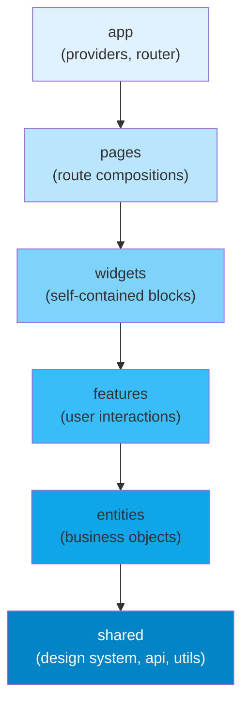

# [FEE-1902] Feature-Sliced Design & Folder-Level Architecture

:::info
Feature-Sliced Design (FSD) is a fixed vocabulary of up to six layers with a strict unidirectional dependency rule: `app → pages → widgets → features → entities → shared`. Higher layers may import from lower layers; the reverse is unconditionally forbidden. Not every project needs every layer: most start with `app`, `shared`, and `pages`, and add `entities`, `features`, and `widgets` as the domain grows. Teams MUST enforce whichever layers they adopt with an architectural linter such as Steiger (FSD's own zero-config tool) or `eslint-plugin-boundaries`. Informal convention without tooling enforcement erodes within weeks. FSD's layer overhead tends to exceed its benefit on small applications with a handful of routes and one or two developers; adopt it once cross-domain coupling or unclear ownership starts causing friction.
:::

## Context

As frontend applications grow beyond a few dozen components, the question of how to organize code becomes genuinely consequential. A flat `components/` folder collapses under the weight of hundreds of files. A `features/` folder without clear rules on what constitutes a feature and what constitutes a shared utility produces a tangle of cross-imports that no automated tool can untangle. Teams routinely spend hours in code review debating where a new file should live, only to watch the decision reversed six months later during a refactor that no one had the bandwidth to finish. The folder structure of a frontend application is an architectural decision, not a cosmetic one: it shapes how quickly new engineers can orient themselves and how confidently experienced engineers can change existing code without breaking something they didn't know was connected.

Feature-Sliced Design is a methodology: a fixed set of file-organization conventions and a dependency rule, with no package to install. It grew out of the Russian-speaking frontend community in the late 2010s (the specification's documentation carries a 2018 copyright) and has since built an international following. The current specification reached its first stable release, v2.0, in October 2024, with a v2.1 revision that same November. FSD is stack-agnostic: the specification imposes no restriction on which UI framework or state manager a project uses, and teams apply it across UI frameworks and stacks. The examples in this article use React and a Zustand-style store because they are concrete; the layer rules themselves are identical in any framework. FSD's central insight is that frontend code naturally forms a dependency hierarchy: application bootstrapping depends on page compositions, page compositions depend on self-contained UI blocks, UI blocks depend on user interaction logic, user interaction logic depends on business objects, and business objects depend on domain-agnostic utilities. FSD names these levels *layers* and enforces the dependency direction between them mechanically, through tooling that fails the build on a violation.

The value of that rule is testability and replaceability. When `features/add-to-cart` is forbidden from importing anything in `features/checkout`, the add-to-cart feature is testable in isolation, without a running checkout module. When `entities/product` is forbidden from importing anything in `features/`, the Product entity's data shapes and display components can be extracted to a shared library or replaced without auditing every feature that touches it. Each layer boundary exists to prevent one specific kind of coupling; the sections below name which.

## Visual



The diagram shows FSD's full six-layer vocabulary and the maximum permitted dependency direction between them; a project typically populates only the layers it needs. Each arrow represents the only permitted direction of import. There are no reverse arrows, no skip-layer arrows (a `pages` component importing directly from `shared` is permitted: the arrows show the maximum allowed distance, not the only permitted connections), and no imports between sibling elements at the same layer. The gradient from light to dark blue tracks stability: `app` is the most volatile, since it changes every time a new route is added, while `shared` is the most stable, since changes to it affect everything above.

## Example

### E-commerce application folder structure

The following tree shows a complete FSD-structured e-commerce application. Notice that each layer contains named slices, and each slice contains a small set of well-named internal folders (`ui/`, `model/`, `lib/`).

```
src/
├── app/
│   ├── providers.tsx          # React Query, Router, Theme providers
│   └── router.tsx             # createBrowserRouter config
│
├── pages/
│   ├── catalog/
│   │   └── index.tsx          # imports widgets/product-grid, features/filter-products
│   └── checkout/
│       └── index.tsx          # imports widgets/cart-summary, features/submit-order
│
├── widgets/
│   ├── product-grid/
│   │   └── index.tsx          # imports features/add-to-cart, entities/product
│   └── cart-summary/
│       └── index.tsx          # imports entities/cart-item, features/remove-from-cart
│
├── features/
│   ├── add-to-cart/
│   │   ├── ui/AddToCartButton.tsx
│   │   └── model/addToCart.ts  # store action / mutation
│   └── filter-products/
│       ├── ui/FilterPanel.tsx
│       └── model/filterStore.ts
│
├── entities/
│   ├── product/
│   │   ├── ui/ProductCard.tsx  # display only, no side effects
│   │   └── model/types.ts      # Product interface
│   └── cart-item/
│       └── model/types.ts
│
└── shared/
    ├── ui/                     # Button, Input, Modal: domain-agnostic
    ├── api/                    # axios instance, query client config
    └── lib/                    # formatCurrency, debounce, cn()
```

### Import violation and correct refactor

The most common violation beginners introduce is a lower-layer module that needs to navigate somewhere after completing an action, so it reaches up to a `pages` module to get the route path.

```ts
// VIOLATION — features/add-to-cart importing from pages (higher layer)
// features/add-to-cart/model/addToCart.ts
import { checkoutRoute } from '../../pages/checkout'; // WRONG: lower layer importing from higher

async function addToCartAndRedirect(productId: string) {
  await cartApi.add(productId);
  router.navigate(checkoutRoute.path); // using a path defined in pages
}
```

The correct approach is to keep the feature's responsibility narrow (add to cart, emit an event or update state) and let the page or widget handle navigation, or to move the shared route constant to `shared/lib/routes.ts` where both the feature and the page can import it without either depending on the other.

```ts
// CORRECT REFACTOR — extract shared contract to entities or shared

// shared/lib/routes.ts — route constants belong in shared, not pages
export const ROUTES = {
  checkout: '/checkout',
  catalog:  '/catalog',
} as const;

// entities/cart-item/model/types.ts — entity type, importable by any layer
export interface CartItem { id: string; productId: string; quantity: number; }

// features/add-to-cart/model/addToCart.ts
import type { CartItem } from '@entities/cart-item/model/types'; // OK: lower layer
import { ROUTES } from '@shared/lib/routes';                      // OK: shared layer

export async function addToCart(item: CartItem) {
  await cartApi.add(item);
  // emit an event or update store — let the page decide whether to navigate
  cartStore.add(item);
}
```

```ts
// pages/catalog/index.tsx — the page handles navigation after the feature action
import { addToCart } from '@features/add-to-cart';
import { ROUTES } from '@shared/lib/routes';

function CatalogPage() {
  async function handleAddToCart(item: CartItem) {
    await addToCart(item);
    router.navigate(ROUTES.checkout); // navigation is a page concern, not a feature concern
  }
  // ...
}
```

This refactor keeps the feature slice free of navigation logic and lets the page decide what happens next.

### ESLint configuration

The `eslint-plugin-boundaries` configuration below implements the FSD dependency rule. Every import that violates the layer order produces an ESLint error, blocking the pull request in CI when `--max-warnings 0` is set. Two rows need a small adjustment that is easy to miss: `app` and `shared` have no slices of their own, only segments (the `ui/`, `model/`, `lib/` folders), so each `allow` list must include its own type to permit segments referencing each other, for example `shared/lib` importing `shared/ui`.

```js
// .eslintrc.js — enforce layer boundaries automatically
module.exports = {
  plugins: ['boundaries'],
  extends: ['plugin:boundaries/recommended'],
  settings: {
    'boundaries/elements': [
      { type: 'app',      pattern: 'src/app/*' },
      { type: 'pages',    pattern: 'src/pages/*' },
      { type: 'widgets',  pattern: 'src/widgets/*' },
      { type: 'features', pattern: 'src/features/*' },
      { type: 'entities', pattern: 'src/entities/*' },
      { type: 'shared',   pattern: 'src/shared/*' },
    ],
  },
  rules: {
    'boundaries/element-types': ['error', {
      default: 'disallow',
      rules: [
        { from: 'app',      allow: ['app', 'pages', 'widgets', 'features', 'entities', 'shared'] },
        { from: 'pages',    allow: ['widgets', 'features', 'entities', 'shared'] },
        { from: 'widgets',  allow: ['features', 'entities', 'shared'] },
        { from: 'features', allow: ['entities', 'shared'] },
        { from: 'entities', allow: ['shared'] },
        { from: 'shared',   allow: ['shared'] },
      ],
    }],
  },
};
```

The `default: 'disallow'` setting means that any import not explicitly allowed by the `rules` array is an error. This is the correct default. It forces intentional decisions about which cross-layer imports are permitted, rather than silently allowing all imports and only flagging known violations. For projects using TypeScript path aliases, add the `import/no-internal-modules` rule as well to prevent imports that reach into a slice's internal modules rather than using its public barrel:

```js
// Enforce barrel-only imports within each layer slice
// (using eslint-plugin-import, a separate plugin from eslint-plugin-boundaries)
'import/no-internal-modules': ['error', {
  // Allow: src/features/add-to-cart (the slice barrel)
  // Disallow: src/features/add-to-cart/ui/Button (private sub-path)
  allow: [
    'src/*/index',
    'src/*/*/index',
  ],
}],
```

### TypeScript path alias configuration

Configure path aliases in `tsconfig.json` to keep import paths readable and to align with the `boundaries/element-types` patterns:

```json
{
  "compilerOptions": {
    "baseUrl": ".",
    "paths": {
      "@app/*":      ["src/app/*"],
      "@pages/*":    ["src/pages/*"],
      "@widgets/*":  ["src/widgets/*"],
      "@features/*": ["src/features/*"],
      "@entities/*": ["src/entities/*"],
      "@shared/*":   ["src/shared/*"]
    }
  }
}
```

With Vite, add the corresponding `resolve.alias` configuration:

```ts
// vite.config.ts
import { defineConfig } from 'vite';
import path from 'path';

export default defineConfig({
  resolve: {
    alias: {
      '@app':      path.resolve(__dirname, 'src/app'),
      '@pages':    path.resolve(__dirname, 'src/pages'),
      '@widgets':  path.resolve(__dirname, 'src/widgets'),
      '@features': path.resolve(__dirname, 'src/features'),
      '@entities': path.resolve(__dirname, 'src/entities'),
      '@shared':   path.resolve(__dirname, 'src/shared'),
    },
  },
});
```

## Best Practices

**Enforce the layer rule in CI from day one.** The cost of adding an architectural linter to a greenfield project is measured in minutes. The cost of retrofitting one onto a codebase where layer violations have already accumulated is a refactoring project measured in days or weeks. Two tools cover this. Steiger, the FSD team's own zero-config linter, ships FSD-specific rules out of the box (`fsd/forbidden-imports`, `fsd/public-api`, `fsd/insignificant-slice`) and needs no configuration to start. `eslint-plugin-boundaries`, paired with the official `@feature-sliced/eslint-config` preset, is the generic alternative for teams already invested in ESLint boundary tooling. Install one of them at project inception and run it with zero tolerance for warnings in CI. Teams that defer this configuration invariably accumulate violations in the first sprint that are "too expensive to fix right now" and never get fixed.

**Name slices after domain concepts.** A `features/add-to-cart/` slice is clearly named: it describes a user action in the product domain. A `features/button-handler/` slice describes a technical role instead, which tells a reader nothing about what the application does. FSD's slice names should read as a glossary of the application's domain: `entities/product`, `entities/cart-item`, `features/apply-discount-code`, `widgets/checkout-summary`. When a new engineer reads the `src/` directory, they should be able to reconstruct the product's main user flows from the slice names alone.

**Keep the public API of each slice explicit.** Each slice SHOULD expose its public interface through an `index.ts` barrel file that explicitly re-exports only what other slices need. A helper used only within the slice, or an intermediate component not meant for external composition, should stay out of the barrel. This keeps the slice's intended public surface clear and prevents gradual coupling through deep internal imports. The barrel file is the slice's contract; changes to it are breaking changes for every consumer.

**Do not let widgets accumulate business logic.** The widget layer is a composition layer. A widget's job is to import feature and entity components, arrange them in a layout, manage local UI state (open/closed, selected tab, scroll position), and initiate data fetching. When a widget starts accumulating domain-specific validation logic, mutation side effects, or business rules, those concerns should move to a feature slice that the widget then composes. A widget that is hard to test in isolation, because it contains business logic rather than composition, is a signal that the logic needs to move down to `features`.

**Treat `shared/ui` as a design system with a curated public surface.** The `shared/ui` folder should contain only components that are genuinely domain-agnostic: primitives (Button, Input, Checkbox), layout utilities (Stack, Grid), feedback components (Toast, Modal, Spinner), and typography elements. When a component that belongs in `shared/ui` starts receiving props that reference domain concepts, a `product` prop, an `orderId` prop, a `cartItemCount` prop, it has outgrown the `shared` layer and should move to `entities` or `widgets`. Keeping `shared/ui` pure is what makes it possible to extract the design system to a standalone package later without pulling in business domain code.

**Migrate one bounded domain at a time.** For teams adopting FSD on an existing codebase, a big-bang migration that moves every file in a single pull request is high-risk and low-reward. Instead, identify one bounded domain (the product catalog, the checkout flow) and apply FSD structure to it while leaving the rest of the codebase unchanged. Configure the architectural linter with the migrated domain enforced strictly and the unmigrated portions marked as a temporary legacy exception. As new features land in unmigrated areas, build them with FSD structure and extend the lint configuration to cover the new additions. The migration converges organically instead of requiring a dedicated refactoring sprint.

**MUST place code in the correct layer; you need not populate all six.** FSD's six layers are a fixed vocabulary and a fixed dependency order, not a checklist every project has to fill in. The official specification is explicit that most projects need only some of them: typically `app`, `shared`, and `pages` from the start, with `entities`, `features`, and `widgets` added as the domain grows and coupling starts to hurt. Within whatever layers a project does use, a module MUST NOT import from a layer above it, and a slice MUST NOT import from a peer slice in the same layer. The exception is `app` and `shared`: neither is sliced, each is a single element made of segments rather than multiple domain slices, so their segments may reference each other freely.

**SHOULD NOT apply FSD to small applications.** FSD's layer overhead tends to exceed its benefit on applications with a handful of routes and one or two developers. A well-structured `src/components/`, `src/hooks/`, `src/utils/`, and `src/pages/` organization is sufficient at that scale. Adopt FSD once ownership boundaries blur or cross-domain coupling starts causing friction.

**MUST keep `shared` domain-agnostic.** The `shared` layer MUST NOT contain references to business domains: no `useProductStore`, no `CartItem` type, no domain-specific formatters. Every consumer of `shared` couples to its contents, so a domain concept placed in `shared` becomes a transitive dependency of every other layer.

**Use path aliases to make import paths readable.** FSD produces import paths like `../../entities/product/model/types` when navigating between layers. These relative paths are verbose and fragile: moving a file one directory level requires updating every import that referenced it. Configure TypeScript's `paths` (and the corresponding Vite or Webpack alias) to allow absolute imports: `@entities/product`, `@features/add-to-cart`, `@shared/ui`. This makes layer membership visible at a glance in any import statement and removes the need to count `../` segments. The alias convention also makes `eslint-plugin-boundaries` and Steiger patterns simpler to configure, since absolute imports with consistent prefixes are easy to match with glob patterns.

## Design Thinking

Each of FSD's six layers corresponds to a specific kind of responsibility that frontend code must address, and each boundary corresponds to a specific kind of coupling that the dependency rule prevents.

The `shared` layer is the foundation. It contains everything that is stable and reusable: the component library (Button, Input, Modal), the shared API client instance (Axios, in the examples above), and utility functions like `formatCurrency`, `debounce`, and `cn()`. The defining characteristic of `shared` code is that it has no opinion about the business domain. A Button component does not know whether it submits an order or filters a product catalog. An API client does not know what endpoints exist. This layer should be the most stable in the codebase; changes to `shared` have the widest blast radius, since every other layer potentially depends on it.

The `entities` layer contains business objects: the data shapes, display components, and store schemas that represent domain concepts like Product, User, Order, and CartItem. An entity is a description of something the business cares about, expressed as a TypeScript interface, a display component that renders that shape, and optionally a Zustand slice or React Query key factory for managing that entity's server state. Critically, entities do not contain side effects triggered by user interaction. A `ProductCard` entity component displays a product, but the add-to-cart button's click handler belongs to a `feature`, not to the entity.

The `features` layer contains user interactions with side effects: the logic that happens when a user does something. Add to cart, submit a payment, filter a product list, log in, submit a review. A feature slice typically contains a UI component (the trigger or form), a model (the mutation, the store action, the thunk), and sometimes a type file. Features import from `entities` (to render the entity's display components or read entity types) and from `shared` (for UI primitives and the API client), but never from other features or from higher layers. This constraint means features are independently testable: a test for `features/add-to-cart` does not need a running `features/checkout` module.

The `widgets` layer composes features and entities into self-contained UI blocks: `ProductGrid`, `CartSidebar`, `CheckoutSummary`, `UserProfileHeader`. A widget is the unit that a designer would recognize as a discrete section of a page layout. Widgets manage their own local state and data fetching; they are the largest unit of UI reuse above the entity level. The widget boundary answers a recurring question: how do you reuse a complex, stateful UI block across multiple pages? Promote it to a widget.

The `pages` layer contains route-level compositions. A page component imports widgets and features, assembles them into a full page layout, and provides the route-specific configuration (page title, metadata, scroll restoration). Pages are thin; their job is composition, not logic. If a page component accumulates significant business logic, that logic should be extracted to a feature or widget. Pages are the layer where the application's information architecture meets its component hierarchy; they should read as a clear table of contents for the application.

The `app` layer is the entry point to the application. It contains providers (React Query's `QueryClientProvider`, the router, theme providers, error boundary wrappers), the router configuration itself, and global CSS. The `app` layer is the only layer that may import from all other layers. It is the composition root.

**Decision table:**

| Scenario | FSD | Flat Feature Folders |
|---|---|---|
| Large team (5+), unclear ownership boundaries | Yes | No |
| Multiple product domains in one app | Yes | No |
| Small app (a handful of routes, 1-2 devs) | No | Yes |
| Library (not a product application) | No | Domain-driven grouping |
| Team already comfortable with domain folders | Optional | If applied consistently |

The design thinking question that teams most frequently get wrong is where to put cross-cutting concerns. Authentication state is a common example: it is needed by many features and widgets, but it is not a feature itself. The answer is `entities/session` or `entities/user`: the authenticated user is a business object, and the session state is that entity's store. Feature slices that need to check authentication import from `entities/session`, not from `features/login`. The `features/login` slice handles the interaction (the form, the mutation, the redirect); the resulting session state lives in the entity layer where any feature can read it without importing from another feature.

Another common design question is how to handle intra-page state that is too specific to belong to an entity but is shared between a widget and a feature on the same page. The answer is usually one of three things: lift the state to the widget that composes both (widgets may hold local state); extract a small shared model to `entities`; or accept that this is a case where the FSD model is adding friction without adding clarity, which is a signal that the application may have outgrown a clean FSD structure and needs a more context-specific architectural decision. FSD is a starting framework, not a constraint that prevents pragmatic judgment.

## Common Mistakes

**Inconsistent slice public API discipline.** FSD's value depends on slices being black boxes with explicit public surfaces. When engineers import directly from internal slice modules (`import { productQueryKey } from '@features/add-to-cart/model/queryKeys'` instead of the barrel), they create invisible dependencies on implementation details. The next engineer to refactor the feature's internal module structure will break imports across the codebase without any visible contract violation. Enforce the `import/no-internal-modules` rule in ESLint and treat the barrel file as the slice's only public interface.

**Moving too many concerns into the widget layer.** A `ProductGrid` widget that contains pagination logic, sort-order mutation, analytics tracking, and empty-state copy has become a page in miniature; composition is its only job. When a widget grows beyond layout composition and local UI state management, extract the excess to dedicated feature slices (pagination as `features/paginate-products`, sort order as `features/sort-products`) and reduce the widget back to a layout compositor.

## Related Topics

- [Clean & Hexagonal Architecture in the Frontend](/clean-hexagonal-frontend): FSD slices carry the layer hierarchy; ports and adapters apply selectively inside slices that hold real logic.
- [Domain-Driven Design for the Frontend](/frontend-ddd): bounded contexts are what slice families implement; the ubiquitous language names the slices.
- [Component Composition Patterns](/501): FSD organizes composed units by layer; understanding composition patterns clarifies why widgets are separate from features and how they compose entities.
- [Micro-Frontend Architecture](/micro-frontend-architecture): FSD per micro-frontend is a common pairing at scale; each MFE owns its own layer hierarchy and exposes a versioned public API to the shell.
- [Monorepos & Workspaces](/805): path aliases enforce the import convention; monorepo workspace packages can map cleanly to FSD layers or cross-layer shared packages.
- [Component Testing with Testing Library](/1102): layer boundaries map directly to test isolation boundaries; a feature slice with no upward imports can be tested in isolation from pages and widgets.

## References

- [Feature-Sliced Design Official Documentation](https://feature-sliced.design/) — the canonical specification of FSD; covers the layer model, the segment conventions (`ui/`, `model/`, `lib/`, `api/`, `config/`), migration guides, and the rationale for each layer boundary; the most authoritative source for layer definitions, the unidirectional dependency rule, and which layers a given project actually needs
- [Steiger — Feature-Sliced Design Linter](https://github.com/feature-sliced/steiger) — the FSD team's own zero-config architecture linter; ships FSD-specific rules (`fsd/forbidden-imports`, `fsd/public-api`, `fsd/insignificant-slice`) out of the box and is the tool most FSD projects reach for before adding a generic ESLint boundary plugin
- [`eslint-plugin-boundaries` Documentation](https://github.com/javierbrea/eslint-plugin-boundaries) — a generic ESLint plugin for enforcing architectural boundaries, usable to encode FSD's layer rules for teams already invested in ESLint-based tooling; documents the `boundaries/element-types` rule, the `default: 'disallow'` mode, and the glob pattern syntax for matching slice paths
- [`@feature-sliced/eslint-config`](https://github.com/feature-sliced/eslint-config) — the FSD organization's own ESLint config package (beta); bundles isolation, public-API, layer-scope, and naming rules into a single preset
- [Alex Kondov — Tao of React (Folder Structure Chapter)](https://alexkondov.com/tao-of-react/) — a widely cited article-length treatment of React project structure that covers the trade-offs between flat, feature-grouped, and FSD-style organizations; grounded in real project experience and explains the costs of each approach at different scales
- [Khalil Stemmler — Solid Book (Layered Architecture)](https://solidbook.io/) — the DDD and clean architecture concepts that underlie FSD's layer model; explains why unidirectional dependencies are the correct solution to the coupling problem that FSD solves at the folder level
- [FSD GitHub Discussions and Examples](https://github.com/feature-sliced/documentation/discussions) — the FSD community's open discussion forum; contains real-world questions about edge cases (where does authentication state live, how to handle cross-feature state), example repositories, and the core team's clarifications on ambiguous cases
- [FSD Migration Guide: v1 to v2](https://feature-sliced.design/docs/guides/migration/from-v1) — documents the v1-to-v2 transition and the layer model, including the optional `processes` layer that v2 introduced; FSD v2.0 deprecated `processes` in favor of moving its contents into `features` and (where page access is needed) `app`, relevant for teams encountering older FSD tutorials that still treat `processes` as current
