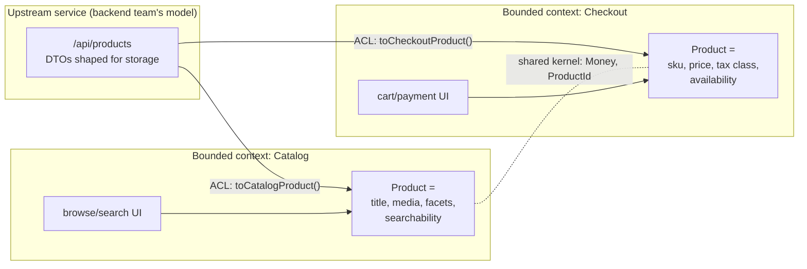

# [FEE-1904] Domain-Driven Design for the Frontend

:::info
Domain-Driven Design (DDD) splits into two halves, and the frontend inherits mostly one of them. The *tactical* patterns (aggregates, repositories, domain events) were designed for server-side persistence and rarely earn their keep in a browser. The *strategic* patterns transfer almost untouched: a **ubiquitous language** (the business vocabulary, spoken by domain experts and encoded in type names), **bounded contexts** (explicit boundaries inside which one model of "Product" or "Customer" holds, and outside which a different one legally exists), and the **anti-corruption layer** (ACL, a translation layer that keeps someone else's model from leaking into yours). On the frontend these decide how slices, workspace packages, and micro-frontends get carved, and they name the failure mode of every shared `types/` folder: one global model stretched across contexts that never agreed on what the words mean.
:::

## Context

DDD comes from Eric Evans's 2003 book and grew up on the backend, where its examples and tooling still live. Frontends met it late and from two directions. First, applications became domain-heavy: carts with pricing rules, editors with document models, dashboards with permission logic, all of it living client-side long enough to need a real model. Second, organizations scaled their frontends the way they had scaled their services, and discovered the same wall Fowler describes: total unification of a large system's domain model is not feasible or cost-effective. The word "meter" meant three things across one utility's divisions; "Customer" means different things to checkout and to support, and a frontend type system that pretends otherwise turns every sprint into a negotiation. Most DDD literature stops at the API boundary. This article carries the strategic patterns across it: what a bounded context looks like in a frontend codebase, how the ubiquitous language shows up in TypeScript, and where the anti-corruption layer sits when the upstream model belongs to a backend team you do not control. Siblings: [Feature-Sliced Design](/en/Application Architecture and Scaling Patterns/feature-sliced-design) gives contexts a folder shape, [Clean & Hexagonal Architecture](/en/Application Architecture and Scaling Patterns/clean-hexagonal-frontend) keeps their cores pure, and [Micro-Frontends](/en/Application Architecture and Scaling Patterns/micro-frontend-architecture) is what contexts become when they also want separate deployments.

## Visual



One upstream endpoint, two context-local models, one deliberately tiny shared kernel. The two "Product" types agree on identity and money and on nothing else, and that disagreement is the design.

## Example

The ubiquitous language shows up as type names lifted from how the business actually talks. Checkout people say "line item", "tax class", "backorder"; the types say the same, and a term the domain expert would not recognize does not belong in the model:

```ts
// checkout/model/product.ts -- the Checkout context's own model
export interface CheckoutProduct {
  sku: Sku;
  unitPrice: Money;
  taxClass: "standard" | "reduced" | "exempt";
  availability: "in-stock" | "backorder" | "discontinued";
}

// catalog/model/product.ts -- same word, different context, different model
export interface CatalogProduct {
  id: ProductId;
  title: string;
  media: MediaAsset[];
  facets: Record<FacetName, FacetValue[]>;
}
```

The anti-corruption layer is a mapping function at the context's edge. The upstream DTO is shaped by the backend's storage and its own history; the ACL translates it into this context's language and absorbs upstream changes at one point:

```ts
// checkout/api/acl.ts -- upstream shape enters, context shape leaves
import type { CheckoutProduct } from "../model/product";

interface ProductDto {              // the backend team's model, not ours
  product_id: string;
  price_cents: number;
  tax_category_code: number;
  stock_state: 0 | 1 | 2;
}

export function toCheckoutProduct(dto: ProductDto): CheckoutProduct {
  return {
    sku: asSku(dto.product_id),
    unitPrice: money(dto.price_cents, "EUR"),
    taxClass: TAX_BY_CODE[dto.tax_category_code] ?? "standard",
    availability: (["in-stock", "backorder", "discontinued"] as const)[dto.stock_state],
  };
}
```

Context boundaries become file-system boundaries. In a monorepo each context is a workspace package with an enforced public API; in an FSD codebase each context is a slice family. Either way, the rule a linter can check is the same: one context never imports another context's internals, only its published surface:

```
packages/
  checkout/        # bounded context
    src/model/     # CheckoutProduct, pricing rules
    src/api/       # ACL to the products service
    src/ui/
    index.ts       # published language: what other contexts may see
  catalog/         # bounded context, its own Product
  shared-kernel/   # Money, ProductId, Sku -- small on purpose
```

The value-object end of tactical DDD does cross over. Types like `Money` prevent the classic bug family where a number is a number:

```ts
// shared-kernel/money.ts -- a value object: equality by value, no identity
export interface Money { readonly cents: number; readonly currency: Currency; }
export function add(a: Money, b: Money): Money {
  if (a.currency !== b.currency) throw new CurrencyMismatch(a.currency, b.currency);
  return { cents: a.cents + b.cents, currency: a.currency };
}
```

## Best Practices

- **MUST** name model types and functions in the business's own vocabulary, and keep one glossary per context. When the domain expert says "backorder" and the type says `stockState2`, the model has already drifted.
- **MUST** let each bounded context own its model. Two contexts may both have a `Product`; unifying them into one shared type couples every consumer to every field and recreates the canonical-model trap that bounded contexts exist to avoid.
- **MUST** translate at the boundary with an ACL whenever the upstream model is not yours: API DTOs stop at the mapping function, and upstream renames become a one-file change instead of a codebase-wide one.
- **MUST** enforce context boundaries mechanically (workspace package visibility, `eslint-plugin-boundaries`, dependency-cruiser rules); a context whose internals are importable is a folder, not a boundary.
- **SHOULD** keep the shared kernel deliberately small and stable: identifiers, `Money`, dates. Every type added to it is a type two teams must now agree to change together.
- **SHOULD** align context boundaries with team and language boundaries rather than with technical layers; contexts follow where the vocabulary changes, which usually follows where the teams are.
- **SHOULD** use value objects for quantities that carry rules (money, durations, percentages); this is the one tactical pattern with a high frontend payoff.
- **MAY** skip aggregates, repositories, and domain events in the browser; server state libraries and stores already play those roles, and importing the full tactical vocabulary adds ceremony without new guarantees.
- **MAY** promote a bounded context to a micro-frontend when it also needs independent deployment; the context map is the natural input to that split.

## Design Thinking

**The enemy is the innocent shared types folder.** Nearly every frontend monorepo grows a `types/` or `models/` package where a single `Product` interface accumulates thirty optional fields, because checkout, catalog, search, and admin each pushed their needs into the one shared shape. Every field is nullable somewhere, no one can delete anything, and a change for one team breaks another. Bounded contexts are the named alternative: several small models that are each internally consistent, plus explicit translation where they meet. The counterintuitive move is accepting duplication of the *word* to avoid coupling of the *model*.

**Strategic transfers, tactical mostly does not.** Aggregates and repositories answer persistence questions (transactional consistency, identity across a database round-trip) that the browser has outsourced to the server and to query caches. The frontend's hard problems are the strategic ones: whose word wins, where models may differ, who translates. Teams that judge "DDD on the frontend" by trying to build aggregates in React conclude it is ceremony; teams that start from context mapping usually keep it.

**Conway's law runs through the middle of this.** Fowler notes that context boundaries in practice follow human culture: the model changes where the language changes, and the language changes where the teams change. Frontend architecture that fights this (one shared model across teams that do not share a vocabulary) loses slowly; architecture that encodes it (context per team, ACL between) turns an organizational fact into a technical boundary that a linter can hold.

## Deep Dive

**Context relationships, translated to frontend reality.** DDD names the ways two contexts can relate, and the frontend's most common position is *downstream of a backend team*. Being a **conformist** (adopting the upstream model as your own) is cheap while the API is stable and yours to mirror; the moment the upstream model turns awkward for the UI (storage-shaped nesting, enum codes, nullable sprawl), the **anti-corruption layer** buys a context-local model for the cost of one mapping file. **Customer/supplier** describes the healthier org where the frontend's needs feed the API's roadmap, and a **published language** is what a versioned, documented API schema (OpenAPI, GraphQL SDL) provides: a stable, shared representation neither side owns unilaterally.

**TypeScript as the language-enforcement medium.** Structural typing undermines context separation by default: any object with the right fields *is* a `Sku`. Branded types restore nominal-style boundaries (`type Sku = string & { readonly __brand: "Sku" }`), making an ACL not just conventional but type-checked; a raw `product_id` string does not compile where a `Sku` is required. Combined with package-level `exports` maps that hide internals, the compiler and the package manager jointly enforce what DDD calls the context boundary.

**Where the frontend's contexts actually surface.** Three recurring homes: FSD slices (a context spans an `entities` slice plus its `features`), monorepo workspace packages (a context per package, with `index.ts` as the published surface), and micro-frontends (a context per deployable, where the ACL also becomes the runtime contract between remotes). The pattern is the same at each scale; only the enforcement mechanism hardens, from lint rule, to package visibility, to deployment boundary.

## Context Mapping the Frontend

The DDD relationship patterns, read as a decision table for a frontend team meeting an upstream model:

| Situation | DDD name | Frontend move |
|---|---|---|
| API is stable, UI-shaped, and mirrors your vocabulary | Conformist | Use DTOs directly; an ACL would translate nothing |
| API is storage-shaped, legacy, or churning | Anti-corruption layer | Map DTO to context model at the boundary; keep the DTO type private to the ACL file |
| Backend team ships to your requirements | Customer/supplier | Negotiate the schema; still map at the edge for insulation |
| Two frontend contexts must share identity/quantity types | Shared kernel | Tiny co-owned package (`Money`, ids); resist growth |
| Two contexts need each other's data at runtime | Published language | Typed public API per context (package `index.ts`, or MFE contract) |
| A context needs independent deploys and ownership | Context per micro-frontend | Promote the boundary to a build/deploy boundary (see FEE-1901) |

The table's diagonal reading: the more the upstream model diverges from your context's language, and the less you control it, the more translation machinery the boundary deserves.

## Related Topics

- [Feature-Sliced Design & Folder-Level Architecture](/en/Application Architecture and Scaling Patterns/feature-sliced-design)
- [Clean & Hexagonal Architecture in the Frontend](/en/Application Architecture and Scaling Patterns/clean-hexagonal-frontend)
- [Micro-Frontend Architecture](/en/Application Architecture and Scaling Patterns/micro-frontend-architecture)
- [Monorepos & Workspaces](/en/Build Tooling and Module Systems/805)
- [Conditional Types and infer](/en/TypeScript/conditional-types-and-infer)

## References

- Martin Fowler, "BoundedContext," martinfowler.com bliki (2014). https://martinfowler.com/bliki/BoundedContext.html
- Martin Fowler, "UbiquitousLanguage," martinfowler.com bliki (2006). https://martinfowler.com/bliki/UbiquitousLanguage.html
- AWS, "Anti-corruption layer pattern," AWS Prescriptive Guidance: Cloud Design Patterns (maintained). https://docs.aws.amazon.com/prescriptive-guidance/latest/cloud-design-patterns/acl.html
