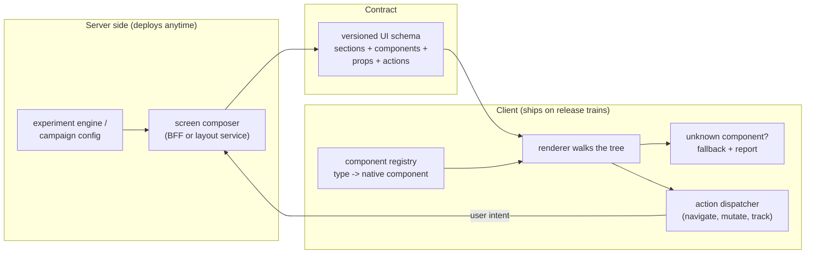

# [FEE-1906] Server-Driven UI

:::info
Server-Driven UI (SDUI) is an architecture where the backend defines the user interface through its API responses: instead of returning data for the client to arrange, the server returns a description of the screen (sections, components, properties, actions), and the client renders it through a registry of native components it already ships. The payoff is release decoupling: UI changes, experiments, and campaign surfaces go live at server-deploy speed, without app-store review or a client release, and iOS, Android, and web render the same answer. The costs are just as structural: the client becomes an interpreter, the JSON schema becomes a versioned public contract across every client version still alive, and offline behavior must be designed rather than inherited. SDUI earns its keep on surfaces that change weekly; applied to stable, deeply interactive screens, it is an expensive way to rebuild HTML.
:::

## Context

The forcing function was mobile: release trains, app-store review, and a long tail of users on old versions mean a client-side UI decision is frozen for weeks, which is unbearable for feed ranking, promotions, onboarding flows, and experiments. The pattern's best-documented industrial form is Airbnb's Ghost Platform, which models screens as server-composed lists of *sections*, delivers them over GraphQL, and renders them through a shared component registry on every platform; Doist reached the same shape from another direction by adopting a standardized card schema (Adaptive Cards) and building SwiftUI/Jetpack Compose renderers for it. Teams at this scale report the same benefit in different words: experiments launch when the server says so, not when the release train departs. The web's relationship to the pattern is circular, because HTML *was* server-driven UI before SPAs moved layout decisions into client code; SDUI selectively moves them back, and React Server Components sit adjacent as a framework-native cousin that serializes *rendered output* rather than an abstract schema. This article covers the schema, the registry, the versioning discipline that makes or breaks the pattern, and the boundary where it stops paying. It pairs with [Backend-for-Frontend](/en/Application Architecture and Scaling Patterns/backend-for-frontend), because the per-experience server a BFF provides is where SDUI payloads are naturally composed.

## Visual



## Example

The wire format is a tree of typed components with data, not markup and not code. Actions are data too, resolved by the client's dispatcher:

```json
{
  "schemaVersion": "2.3",
  "screen": "home",
  "sections": [
    {
      "type": "hero-banner",
      "props": { "title": "Winter deals", "imageUrl": "https://cdn.example.com/w.jpg" },
      "action": { "kind": "navigate", "to": "campaign", "params": { "id": "winter-24" } }
    },
    {
      "type": "product-carousel",
      "props": { "title": "Picked for you", "items": [ { "id": "p1", "title": "Lamp", "price": { "cents": 2900, "currency": "EUR" } } ] }
    },
    { "type": "vote-banner", "props": { "question": "New layout?" } }
  ]
}
```

The client owns a registry that maps schema types to real components, and a renderer that walks the tree. The two non-negotiables live here: payloads are validated at the boundary, and unknown types degrade instead of crashing, because the server will always be newer than some installed client:

```tsx
// sdui/registry.tsx -- the client's half of the contract
const registry = {
  "hero-banner": HeroBanner,
  "product-carousel": ProductCarousel,
  "vote-banner": VoteBanner,
} satisfies Record<string, SduiComponent>;

export function RenderSection({ section }: { section: Section }) {
  const Component = registry[section.type as keyof typeof registry];
  if (!Component) {
    reportUnknownComponent(section.type);   // observability, not silence
    return null;                            // graceful skip, screen still renders
  }
  const parsed = sectionSchemas[section.type].safeParse(section.props);
  if (!parsed.success) { reportBadPayload(section.type, parsed.error); return null; }
  return <Component {...parsed.data} onAction={dispatch} />;
}

// sdui/actions.ts -- actions are data; the dispatcher is the only executor
export function dispatch(action: Action) {
  switch (action.kind) {
    case "navigate": return router.push(routeFor(action.to, action.params));
    case "mutate":   return api(action.endpoint, { method: "POST", body: action.body });
    case "track":    return analytics.emit(action.event, action.payload);
  }
}
```

The server side composes screens from configuration and experiment assignments; with a BFF in place, it is one more route:

```ts
// bff/routes/home-screen.ts -- the screen is computed, per user, at request time
app.get("/api/screen/home", async (c) => {
  const user = c.get("session").userId;
  const variant = await experiments.assignment(user, "home-layout");
  return c.json({
    schemaVersion: SCHEMA_VERSION,
    screen: "home",
    sections: [
      ...(await campaigns.activeBanners(user)),
      variant === "carousel-first" ? recsCarousel(user) : ordersSummary(user),
    ],
  });
});
```

## Best Practices

- **MUST** treat the schema as a versioned public API with the widest client matrix you support: additive changes only within a major version, explicit `schemaVersion` in every payload, and a deprecation window measured in client-adoption time, not server sprints.
- **MUST** render unknown component types as a logged no-op (or a designed fallback), never as a crash; a server newer than the installed client is the pattern's steady state.
- **MUST** validate payloads at the boundary with runtime schemas; the server is a trusted party but not an infallible one, and a malformed section should cost one block, not the screen.
- **MUST** keep actions declarative (`{ kind, params }` dispatched against a fixed vocabulary), never executable; the moment expressions or scripting creep into the payload, the client is an unsandboxed eval engine with an app-store problem.
- **SHOULD** scope SDUI to high-churn surfaces (feeds, campaigns, onboarding, settings-like lists) and keep deeply interactive screens fully client-owned; hybrid per-screen adoption is the industrially proven shape.
- **SHOULD** cache the last good payload and design the offline/startup state deliberately; an SDUI screen with no cache and no network is blank by default, which a data-driven screen with local state never is.
- **SHOULD** keep interaction latency local: the server decides structure, the client owns text input, toggles, and optimistic states between fetches; round-tripping every keystroke is the caricature that gives the pattern a bad name.
- **SHOULD** reference design tokens rather than raw styles in props (`"tone": "critical"`, not `"color": "#d32f2f"`), keeping the visual contract in the client's design system where it is themeable and accessible.
- **MAY** adopt an existing schema standard (Adaptive Cards) instead of inventing one, when the surface fits card-shaped content; the renderer investment is the same, the design cost is not.
- **MAY** prefer React Server Components when the product is web-only and single-codebase; RSC delivers server-decided UI as rendered output with zero client bundle for the server parts, without maintaining a cross-platform schema.

## Design Thinking

**The product is release decoupling, and it should be priced as such.** Every documented adopter converges on the same sentence: experiments and campaign changes ship when the server deploys. If your product is web-only, you already deploy the UI continuously, and the pattern's headline benefit mostly evaporates; that is why SDUI is native-first in practice and why the web's version of the question is usually "RSC or a rebuild of HTML?". What survives on the web is the multi-platform case: one composed answer rendered by web, iOS, and Android registries.

**SDUI moves a decision, not work.** Someone still decides what the screen contains; the pattern moves that decision from five client codebases to one server, and with it the ownership question. The server team now ships user-visible UI, so screen quality, empty states, and accessibility acceptance move into server review, and the client team's contract shifts to the registry: a menu of components with hard quality guarantees. Teams that adopt the wire format without renegotiating this ownership boundary get the pattern's costs with a diluted version of its benefit.

**The schema is a language, and languages grow.** Every SDUI schema starts declarative and small, then someone needs a conditional, then a repeat-over-items, then a computed visibility rule, and the schema is quietly becoming a worse JavaScript. The discipline that holds is a closed component vocabulary plus server-side computation: if a screen needs logic, the server runs it and sends the result, and the payload stays a description of *what is*, never *how to decide*.

**Against RSC, the difference is what crosses the wire.** Server Components serialize the rendered output of components that live in the same codebase and deploy as one unit; the client never interprets an abstract schema, and there is no version matrix because server and client ship together. SDUI serializes an abstract UI for many clients, many platforms, and many concurrently-live versions. Same slogan ("the server decides the UI"), different problem: RSC optimizes one web app's bundle and data flow; SDUI coordinates a fleet.

## Deep Dive

**Schema design.** The stable cores across public implementations: a flat-ish list of typed sections rather than a deep DOM-like tree (Airbnb's screens compose sections; sections stay independent), a closed union of component types per schema version, props restricted to data and token references, and children/slots only where composition is genuinely needed. Identifiers matter more than they look: stable section IDs enable diffing, partial updates, and analytics joins across variants.

**Version negotiation.** The robust pattern is capability negotiation rather than pure versioning: the client declares what it can render (registry version or explicit component list), the server composes within that envelope and substitutes fallbacks for anything newer. This turns "old client meets new server" from an error class into a layout decision, and it is what lets the deprecation window be about analytics (how many sessions still lack `vote-banner`?) instead of guesswork.

**Observability is a first-class feature.** A screen that came from JSON cannot be debugged by reading components. Adopters that stay happy build the tooling early: payload capture and replay against local registries, unknown-component and validation-failure telemetry per schema version, and goldens/snapshot tests that render the registry against fixture payloads on every client build. Skipping these does not remove the cost; it moves it into production incidents.

**Performance shape.** SDUI trades a render-blocking data fetch for a render-blocking *screen* fetch, so the same disciplines apply as for any critical request: cache the shell, stream or paginate sections for long feeds, and let the client render cached structure immediately while revalidating. Payloads stay small when props carry references (image URLs, token names, item IDs the client can hydrate from its own caches) rather than inlined blobs.

## Failure Modes

The recurring ways SDUI deployments go wrong, and the guardrail for each:

| Failure mode | What it looks like | Guardrail |
|---|---|---|
| Schema sprawl | Conditionals, loops, expressions creep into the payload | Closed component vocabulary; all logic runs server-side |
| Version matrix explosion | Every screen change breaks some installed client | Additive-only changes, capability negotiation, unknown-type fallbacks |
| Blank offline | No network, no cache, empty screen at launch | Persist last good payload; design the no-data state per screen |
| Interpreter opacity | "Which deploy changed this screen?" has no answer in the client repo | Payload capture/replay tooling; schema-version telemetry |
| Ownership vacuum | Server ships UI, nobody owns its accessibility or empty states | Move screen acceptance into the composing team's definition of done |
| Wrong surface | A stable, gesture-heavy editor rebuilt as JSON | Hybrid adoption: SDUI for churny surfaces, client-owned code for the rest |

The first two rows are the existential ones: a schema that became a language and a version matrix that became unmanageable are the two ways the pattern collapses under its own contract.

## Related Topics

- [Backend-for-Frontend (BFF) & the API Boundary](/en/Application Architecture and Scaling Patterns/backend-for-frontend)
- [Micro-Frontend Architecture](/en/Application Architecture and Scaling Patterns/micro-frontend-architecture)
- [RSC State Boundary](/en/State Management/rsc-state-boundary)
- [Design Tokens](/en/Design Systems and UI Libraries/901)

## References

- Ryan Brooks, "A Deep Dive into Airbnb's Server-Driven UI System," The Airbnb Tech Blog, Medium (2021). https://medium.com/airbnb-engineering/a-deep-dive-into-airbnbs-server-driven-ui-system-842244c5f5
- Doist Engineering, "Server-Driven UI from a Mobile Perspective," doist.dev (2023). https://www.doist.dev/server-driven-ui-from-a-mobile-perspective/
- React team, "Server Components," react.dev (maintained). https://react.dev/reference/rsc/server-components
- Mobile Native Foundation, "Server-driven UI (or Backend driven UI) strategies," GitHub Discussions #47 (2021, ongoing). https://github.com/MobileNativeFoundation/discussions/discussions/47
