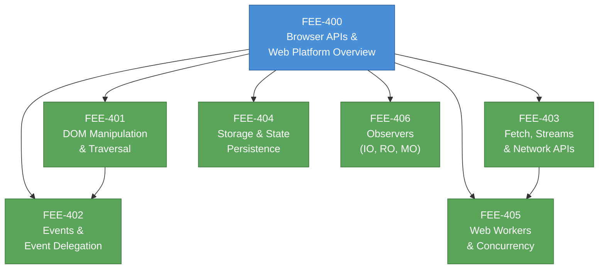

# [FEE-400] Browser APIs & Web Platform Overview

:::info
This category covers the browser as an application runtime -- the global objects it exposes, the Web APIs layered on top of ECMAScript, and the extensible web philosophy that shapes how the platform evolves. Articles 401 through 406 explore specific API families in depth.
:::

## Context

A web browser is far more than an HTML renderer. It is a full application runtime that provides JavaScript code with access to the network, persistent storage, hardware sensors, concurrency primitives, and the document itself. These capabilities are delivered through **Web APIs** -- interfaces specified by standards bodies (WHATWG, W3C, Khronos) and implemented by browser engines.

### The browser runtime model

When a browser loads a page, it constructs several interconnected global objects:

- **`window`** -- The top-level global object in a browsing context. Every global variable and function lives as a property of `window`. It also hosts timers (`setTimeout`, `requestAnimationFrame`), navigation (`location`, `history`), and frame relationships (`parent`, `top`).
- **`document`** -- The entry point to the DOM tree. It represents the parsed HTML and exposes methods for querying, creating, and mutating elements (`querySelector`, `createElement`, `createTreeWalker`).
- **`navigator`** -- Represents the user agent's identity and capabilities. It provides access to device APIs such as geolocation (`navigator.geolocation`), service workers (`navigator.serviceWorker`), clipboard (`navigator.clipboard`), and network status (`navigator.onLine`).

These objects are not part of the ECMAScript language specification. They are defined in the HTML Living Standard and related Web API specifications. Understanding this distinction is fundamental.

### Web APIs vs ECMAScript

ECMAScript (the language standard behind JavaScript) defines the core language: syntax, types, control flow, `Promise`, `Map`, `Proxy`, and so on. It says nothing about the DOM, HTTP requests, or local storage.

Web APIs are the bridge between the language and the browser environment. They are specified separately and exposed as properties on global objects:

| Layer | Specified by | Examples |
|-------|-------------|----------|
| **ECMAScript** | TC39 / ECMA-262 | `Promise`, `Array.prototype.map`, `class`, `async/await` |
| **Web APIs** | WHATWG, W3C, Khronos | `fetch`, `IntersectionObserver`, `localStorage`, `WebGL` |
| **Browser-specific** | Individual vendors | DevTools protocol, proprietary extensions |

A common source of confusion: `setTimeout` feels like "JavaScript," but it is a Web API defined in the HTML spec, not in ECMA-262. The same is true for `console`, `fetch`, `URL`, and many other everyday tools.

### The extensible web

In 2013, a group of browser vendors and web developers published the **Extensible Web Manifesto**. Its core argument: standards bodies should prioritize low-level, composable primitives rather than high-level, opinionated features. When the platform exposes powerful building blocks, developers and library authors can experiment, iterate, and validate solutions in userland before they become formal standards.

This philosophy has shaped the modern platform:

- **Service Workers** expose low-level control over network requests, enabling developers to build offline experiences, custom caching strategies, and push notifications without the browser needing to prescribe a single "offline mode."
- **Custom Elements** and the **Shadow DOM** provide primitives for encapsulated, reusable components rather than dictating a component model.
- **CSS Houdini** exposes the rendering pipeline (layout, paint, animation) so developers can extend CSS with JavaScript.
- **Streams API** exposes incremental data processing rather than forcing all-or-nothing buffering.

The extensible web philosophy means the API surface keeps growing. New capabilities tend to be low-level and composable. This makes a structured mental model of the API landscape essential for frontend engineers.

### Why a category roadmap matters

The browser exposes hundreds of APIs. Without a mental map, engineers either ignore capabilities they need or reach for libraries that duplicate what the platform already provides. The articles in this category (FEE-401 through FEE-406) organize the most important API families into a coherent learning path:

| FEE | Topic | What it covers |
|-----|-------|---------------|
| 401 | DOM Manipulation & Traversal | querySelector, createElement, TreeWalker, DOM diffing strategies |
| 402 | Events & Event Delegation | Event propagation, delegation patterns, custom events, AbortController |
| 403 | Fetch, Streams & Network APIs | fetch, Request/Response, ReadableStream, Server-Sent Events, WebSocket |
| 404 | Storage & State Persistence | localStorage, sessionStorage, IndexedDB, Cache API, cookies |
| 405 | Web Workers & Concurrency | Dedicated/shared workers, MessageChannel, Transferable, scheduling APIs |
| 406 | Observers | IntersectionObserver, ResizeObserver, MutationObserver, PerformanceObserver |

## Design Thinking

### Why browsers expose APIs via global objects

Browsers expose capabilities through properties on `window`, `document`, and `navigator` rather than through an import/module system. This is a deliberate design choice rooted in the web's history and constraints:

1. **Backward compatibility.** The web cannot break existing pages. Global objects were established before ES modules existed (2015). Changing the access pattern would break billions of pages.

2. **Feature detection.** Global properties enable simple capability checks: `if ('serviceWorker' in navigator)`. This pattern -- checking for the existence of a property on a well-known object -- is the foundation of progressive enhancement on the web.

3. **Security boundaries.** The browser controls what each global object exposes based on context. A cross-origin iframe gets a restricted `window`; an opaque `Response` hides its body. Global objects serve as capability boundaries, not just namespaces.

4. **Discoverability.** A developer can type `navigator.` in DevTools and see every device API available. This immediate discoverability, while noisy, lowers the barrier to exploring the platform.

### The extensible web manifesto in practice

The manifesto's core insight is that the standards process is slow, but the web must evolve fast. By exposing low-level primitives:

- **Developers lead experimentation.** Libraries like Workbox (built on Service Workers) and Lit (built on Custom Elements) validate patterns before they become platform features.
- **Polyfills become possible.** When a new API is defined in terms of existing primitives, developers can polyfill it in older browsers. When a feature is "magic" (no explanation in terms of lower-level constructs), polyfilling is impossible.
- **The platform stays lean.** Instead of shipping one opinionated solution for offline, the browser ships Service Workers and Cache API. Developers compose these primitives into solutions that fit their specific needs.

This philosophy is why modern browser APIs feel like a toolkit rather than a framework. Understanding it helps you evaluate new APIs: prefer those that compose with existing primitives over those that introduce new magic.

## Visual

**Reading order:** Start with DOM manipulation (401) and events (402) -- these are the foundation of all browser interaction. Network APIs (403) and storage (404) can be explored in parallel. Web Workers (405) builds on network and streaming concepts. Observers (406) can be studied independently but benefit from DOM knowledge.

## Related FEEs

| FEE | Relationship |
|-----|-------------|
| [FEE-100 HTML & Semantic Markup](../HTML%20and%20Semantic%20Markup/100.md) | HTML defines the document that browser APIs manipulate. The DOM API (FEE-401) operates on the tree that HTML creates. |
| [FEE-300 JavaScript Core & Runtime](../JavaScript%20Core%20and%20Runtime/300.md) | ECMAScript provides the language; browser APIs provide the capabilities. Understanding the event loop (FEE-301) is essential for reasoning about async Web APIs. |
| [FEE-500 Component Architecture](../Component%20Architecture%20and%20Design%20Patterns/500.md) | Component frameworks abstract over browser APIs. Understanding the underlying platform helps you debug framework behavior and choose when to use native APIs directly. |

## References

- [WHATWG HTML Living Standard](https://html.spec.whatwg.org/) -- The authoritative specification for the HTML language and browser runtime APIs including Window, Document, Navigator, and the event loop
- [MDN: Web APIs](https://developer.mozilla.org/en-US/docs/Web/API) -- Comprehensive reference for all Web APIs available in browsers, organized by category
- [MDN: Introduction to Web APIs](https://developer.mozilla.org/en-US/docs/Learn_web_development/Extensions/Client-side_APIs/Introduction) -- Beginner-friendly guide explaining what Web APIs are and how they relate to JavaScript
- [The Extensible Web Manifesto](https://extensiblewebmanifesto.org/) -- The 2013 manifesto advocating for low-level, composable web platform primitives over high-level opinionated features
- [ECMA-262 Specification](https://tc39.es/ecma262/) -- The ECMAScript language specification, defining the core language that Web APIs build upon
- [Browser environment, specs (javascript.info)](https://javascript.info/browser-environment) -- Clear visual explanation of the relationship between window, DOM, BOM, and JavaScript
