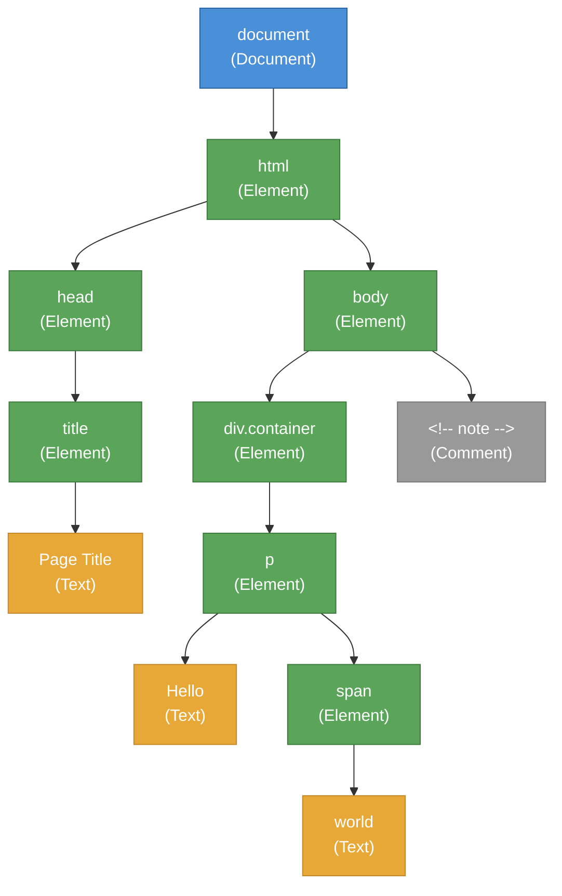

# [FEE-401] DOM Manipulation & Traversal

:::info
The Document Object Model (DOM) is the browser's in-memory representation of an HTML document. Every element, text node, and comment becomes an object in a tree that JavaScript can query, traverse, and mutate. Understanding DOM operations at a foundational level is essential for debugging framework behavior, optimizing rendering performance, and knowing when native APIs are sufficient without a library.
:::

## Context

When the browser parses an HTML document, it constructs a tree of **nodes**. This tree -- the DOM -- is the single source of truth for what the user sees. CSS reads from it to compute styles; the layout engine reads from it to compute geometry; the painting engine reads from it to produce pixels. Every framework, from jQuery to React to Svelte, ultimately issues DOM API calls to update this tree.

### The DOM is a tree

HTML is a nested markup language. The DOM mirrors that nesting as a tree data structure. Every node in the tree implements the `Node` interface, and the most common node types are:

| Node type | `nodeType` constant | Description |
|-----------|-------------------|-------------|
| **Element** | `Node.ELEMENT_NODE` (1) | An HTML or SVG element (`<div>`, `<span>`, `<svg>`) |
| **Text** | `Node.TEXT_NODE` (3) | The text content between or inside elements |
| **Comment** | `Node.COMMENT_NODE` (8) | An HTML comment (`<!-- ... -->`) |
| **Document** | `Node.DOCUMENT_NODE` (9) | The root `document` object |
| **DocumentFragment** | `Node.DOCUMENT_FRAGMENT_NODE` (11) | A lightweight container that holds nodes without being part of the live tree |

Elements are the nodes developers interact with most, but text nodes matter too. A common surprise: whitespace between tags creates text nodes. The string `<ul>\n  <li>A</li>\n</ul>` produces text nodes for the newlines and spaces around the `<li>`.

### Properties vs. attributes

DOM elements have both **attributes** (the serialized key-value pairs in HTML markup) and **properties** (the JavaScript object properties on the DOM node). They are related but distinct:

- `element.getAttribute('value')` reads the HTML attribute -- the *initial* value in markup.
- `element.value` reads the JavaScript property -- the *current* value, which may have been changed by user input or script.
- `element.setAttribute('value', 'new')` updates the attribute and, for most built-in attributes, synchronizes the property.
- Some attributes and properties share names but have different types. The `checked` attribute is a string (present or absent); the `checked` property is a boolean.

**Principle:** SHOULD use properties for reading current state and attributes for serialization or initial configuration.

### innerHTML vs. textContent

Two common ways to set content on an element behave very differently:

- **`textContent`** sets or gets the text content of a node and all its descendants. It does not parse HTML. Setting `element.textContent = userInput` is safe from injection.
- **`innerHTML`** parses the assigned string as HTML and replaces the element's children with the resulting nodes. Setting `element.innerHTML = userInput` is an **XSS vector** if `userInput` contains unsanitized markup.

**Principle:** SHOULD use `textContent` when inserting plain text. MUST NOT use `innerHTML` with unsanitized user input.

## Principle

### SHOULD batch DOM reads and writes

The browser performs layout lazily -- it waits until it needs geometry information before recalculating positions and sizes. When JavaScript interleaves DOM reads (e.g., `offsetWidth`) with DOM writes (e.g., `style.width = ...`), it forces the browser to perform **synchronous layout** on every read. This pattern, called **layout thrashing**, can degrade frame rates from 60 fps to single digits.

**Principle:** SHOULD separate DOM reads from DOM writes. Perform all reads first, then all writes.

### SHOULD use DocumentFragment for batch insertions

Appending elements to the live DOM one at a time triggers layout recalculations for each insertion. A `DocumentFragment` is a lightweight container that holds nodes without being part of the document tree. When you append the fragment to the DOM, all its children are moved in a single operation.

**Principle:** SHOULD use `DocumentFragment` (or the modern `append()` with multiple arguments) when inserting multiple elements.

## Design Thinking

### Why the DOM is a tree API

HTML is a tree-structured language: elements nest inside other elements, forming parent-child relationships. The DOM mirrors this structure precisely because it must represent every valid HTML document. A tree is the natural data structure for:

1. **Hierarchical containment.** A `<div>` contains its children; a `<table>` contains `<tr>` elements that contain `<td>` elements. The tree encodes these relationships directly.
2. **Efficient CSS matching.** Selectors like `div > p` or `.sidebar .link` traverse parent-child and ancestor-descendant relationships. A tree enables these lookups.
3. **Event propagation.** Events bubble from the target element up through ancestors to the document. The tree defines this path unambiguously.

### Framework abstraction strategies

Frameworks exist because direct DOM manipulation does not scale to complex UIs. Each framework takes a different approach to the fundamental problem: given a state change, determine the minimal set of DOM operations needed.

**React: Virtual DOM and reconciliation.** React maintains an in-memory tree of lightweight JavaScript objects (the virtual DOM). On every state change, React re-renders the component tree into a new virtual DOM, diffs it against the previous one, and produces a minimal list of real DOM mutations. The cost is the diff itself -- O(n) in tree size -- but React amortizes this with heuristics (same-type elements stay in place, keys identify list items).

**Vue: Reactive proxy with compiler-optimized patches.** Vue 3 uses JavaScript `Proxy` objects to track which data each template expression depends on. When data changes, Vue knows exactly which expressions are affected. The Vue compiler further optimizes by marking static subtrees that never change, skipping them during updates entirely.

**Svelte: Compile-time DOM instructions.** Svelte shifts work from runtime to build time. The compiler analyzes each component's template and generates imperative JavaScript that creates and updates specific DOM nodes directly. There is no virtual DOM, no diffing algorithm. When a reactive variable changes, the generated code updates only the bound DOM nodes.

**Solid: Fine-grained signals.** SolidJS uses signals (reactive primitives) that track exactly which DOM nodes depend on which pieces of state. When a signal changes, only those specific DOM text nodes or attributes update. Components run once (to set up the reactive graph) and never re-execute.

**Lit: Tagged template literals.** Lit uses JavaScript tagged template literals to create efficient templates. The static parts of the template are parsed once; only the dynamic expressions are evaluated on updates. Lit compiles these to direct DOM mutations at the expression boundaries.

### The cost of DOM operations

DOM operations are not inherently slow -- creating a `<div>` and appending it to the tree is fast in isolation. The cost comes from **layout recalculation**. The browser engine must determine the position and size of every affected element after a mutation. This cost multiplies when:

- **Layout thrashing** occurs: interleaved reads and writes force synchronous layout on every read.
- **Forced synchronous layout** triggers when JavaScript reads geometry properties (`offsetTop`, `getBoundingClientRect()`, `scrollHeight`) after pending style changes.
- **Large DOM trees** increase the cost of each layout pass because more elements must be recalculated.

The solution is to batch writes and defer them to the appropriate moment using `requestAnimationFrame`, which schedules code to run just before the browser's next paint.

## Visual



**Legend:** Blue = Document node. Green = Element nodes. Orange = Text nodes. Gray = Comment node. The tree represents the parsed DOM of a simple HTML page. Every node is an object that JavaScript can query and mutate.


**DOM operation lifecycle:** Query the tree to find nodes, create new nodes, mutate the tree by inserting or removing them, and observe changes reactively with MutationObserver.

## Example

### 1. Querying and manipulating elements

```js
// querySelector returns the first match (or null)
const header = document.querySelector('h1.title');

// querySelectorAll returns a static NodeList
const items = document.querySelectorAll('.list-item');

// closest walks up the tree to find an ancestor matching the selector
const form = header.closest('form');

// matches tests whether the element itself matches a selector
if (header.matches('.title')) {
  console.log('Element matches .title');
}

// Modern manipulation methods (no need for parentNode.insertBefore)
const newEl = document.createElement('p');
newEl.textContent = 'Inserted paragraph';

header.after(newEl);       // Insert after header
header.before(newEl);      // Insert before header
header.append(newEl);      // Append as last child of header
header.prepend(newEl);     // Prepend as first child of header
header.replaceWith(newEl); // Replace header entirely
newEl.remove();            // Remove from the DOM
```

### 2. DocumentFragment for batch insertion

```js
// BAD: Appending in a loop triggers layout on each iteration
function addItemsSlow(container, count) {
  for (let i = 0; i < count; i++) {
    const li = document.createElement('li');
    li.textContent = `Item ${i}`;
    container.appendChild(li); // Triggers layout each time
  }
}

// GOOD: Build nodes in a fragment, insert once
function addItemsFast(container, count) {
  const fragment = document.createDocumentFragment();
  for (let i = 0; i < count; i++) {
    const li = document.createElement('li');
    li.textContent = `Item ${i}`;
    fragment.appendChild(li); // No layout cost -- fragment is off-DOM
  }
  container.appendChild(fragment); // Single DOM insertion
}

// ALSO GOOD: Modern append() accepts multiple nodes
function addItemsModern(container, count) {
  const items = Array.from({ length: count }, (_, i) => {
    const li = document.createElement('li');
    li.textContent = `Item ${i}`;
    return li;
  });
  container.append(...items); // Single operation
}
```

### 3. Fixing layout thrashing with requestAnimationFrame

```js
// BAD: Layout thrashing -- reads and writes interleaved
function resizeAll(elements) {
  for (const el of elements) {
    const width = el.offsetWidth;         // READ  -> forces layout
    el.style.width = (width * 1.1) + 'px'; // WRITE -> invalidates layout
    // Next iteration's read forces layout again
  }
}

// GOOD: Batch reads first, then batch writes
function resizeAllBatched(elements) {
  // Phase 1: Read all values
  const widths = elements.map(el => el.offsetWidth);

  // Phase 2: Write all values
  elements.forEach((el, i) => {
    el.style.width = (widths[i] * 1.1) + 'px';
  });
}

// GOOD: Defer writes to next animation frame
function resizeAllRAF(elements) {
  const widths = elements.map(el => el.offsetWidth); // Batch reads now

  requestAnimationFrame(() => {
    elements.forEach((el, i) => {
      el.style.width = (widths[i] * 1.1) + 'px';   // Batch writes in rAF
    });
  });
}
```

### 4. MutationObserver for reactive DOM watching

```js
// Watch for added/removed children and attribute changes
const observer = new MutationObserver((mutations) => {
  for (const mutation of mutations) {
    if (mutation.type === 'childList') {
      for (const node of mutation.addedNodes) {
        if (node.nodeType === Node.ELEMENT_NODE) {
          console.log('Element added:', node.tagName);
        }
      }
    }
    if (mutation.type === 'attributes') {
      console.log(`Attribute "${mutation.attributeName}" changed on`, mutation.target);
    }
  }
});

const target = document.querySelector('#app');
observer.observe(target, {
  childList: true,
  attributes: true,
  subtree: true,            // Observe all descendants
  attributeFilter: ['class', 'data-state'], // Only these attributes
});

// Clean up when done
// observer.disconnect();
```

## Common Mistakes

### 1. Using innerHTML with user input (XSS)

Setting `innerHTML` to unsanitized user input allows script injection:

```js
// DANGEROUS: User can inject  or <script>
container.innerHTML = userComment;

// SAFE: textContent escapes HTML
container.textContent = userComment;

// SAFE: Create elements programmatically
const p = document.createElement('p');
p.textContent = userComment;
container.append(p);
```

### 2. Layout thrashing in loops

Reading geometry properties and writing styles in the same loop forces synchronous layout on every iteration. See Example 3 for the fix: separate reads from writes, or defer writes with `requestAnimationFrame`.

### 3. Running querySelector inside loops

`querySelector` searches the DOM tree on every call. Calling it inside a loop when the result does not change is wasteful:

```js
// BAD: Queries the DOM on every iteration
for (const item of data) {
  const container = document.querySelector('#list'); // Same result every time
  const li = document.createElement('li');
  li.textContent = item;
  container.append(li);
}

// GOOD: Query once, reuse the reference
const container = document.querySelector('#list');
for (const item of data) {
  const li = document.createElement('li');
  li.textContent = item;
  container.append(li);
}
```

### 4. Not using closest() for event delegation

When handling events on a parent element, developers often walk up the tree manually. The `closest()` method does this correctly and concisely:

```js
// FRAGILE: Only checks the direct target
list.addEventListener('click', (e) => {
  if (e.target.tagName === 'LI') { /* ... */ }
  // Fails if the user clicks a <span> inside the <li>
});

// ROBUST: closest() walks up to find the matching ancestor
list.addEventListener('click', (e) => {
  const item = e.target.closest('li');
  if (item && list.contains(item)) {
    // Correctly handles clicks on any descendant of <li>
  }
});
```

### 5. Forgetting that DOM operations are synchronous and block rendering

DOM mutations are synchronous -- they complete before the next line of JavaScript executes. However, the browser does not **paint** until JavaScript yields control. A long-running loop that appends thousands of elements will block the main thread and freeze the UI until it finishes. Use `requestAnimationFrame` or chunked processing for large batch operations.

## Related FEEs

| FEE | Relationship |
|-----|-------------|
| [FEE-400 Browser APIs & Web Platform Overview](./400.md) | Parent category. Establishes the runtime model (window, document, navigator) that DOM APIs operate within. |
| [FEE-402 Events & Event Delegation](./402.md) | Events propagate through the DOM tree. Event delegation relies on DOM traversal methods like `closest()`. |
| [FEE-301 Event Loop & Async Execution](../JavaScript%20Core%20and%20Runtime/301.md) | DOM mutations are synchronous but rendering is async. Understanding the event loop explains when `requestAnimationFrame` callbacks execute. |
| [FEE-306 Memory Management & Garbage Collection](../JavaScript%20Core%20and%20Runtime/306.md) | Detached DOM nodes that are still referenced in JavaScript cause memory leaks. Understanding GC roots helps prevent them. |

## References

- [WHATWG DOM Living Standard](https://dom.spec.whatwg.org/) -- The authoritative specification for the DOM tree, Node interface, and mutation algorithms
- [MDN: Document Object Model (DOM)](https://developer.mozilla.org/en-US/docs/Web/API/Document_Object_Model) -- Comprehensive reference for all DOM APIs with examples and browser compatibility data
- [MDN: DocumentFragment](https://developer.mozilla.org/en-US/docs/Web/API/DocumentFragment) -- Guide to the lightweight document container for batch DOM operations
- [MDN: MutationObserver](https://developer.mozilla.org/en-US/docs/Web/API/MutationObserver) -- Reference for the MutationObserver API that replaced deprecated Mutation Events
- [Avoid large, complex layouts and layout thrashing (web.dev)](https://web.dev/articles/avoid-large-complex-layouts-and-layout-thrashing) -- Google's guide to identifying and fixing layout thrashing with performance tooling
- [What forces layout/reflow (Paul Irish)](https://gist.github.com/paulirish/5d52fb081b3570c81e3a) -- Comprehensive list of DOM properties and methods that force synchronous layout
- [DOM tree (javascript.info)](https://javascript.info/dom-nodes) -- Visual, beginner-friendly explanation of the DOM tree, node types, and traversal
