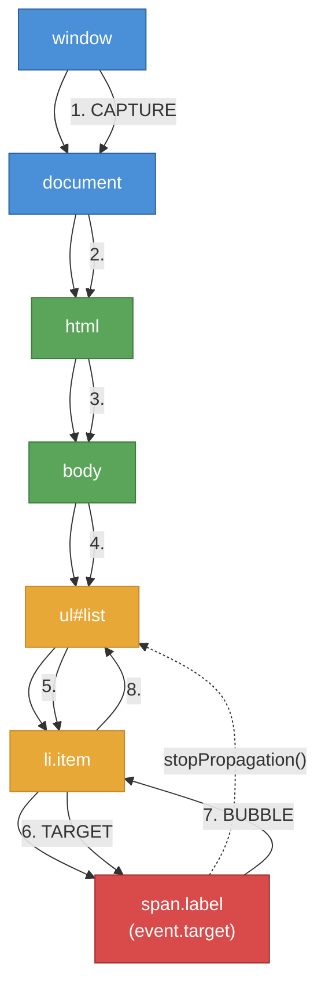

# [FEE-402] Events & Event Delegation

:::info
Events are the browser's mechanism for signaling that something has happened -- a user clicked, a key was pressed, a network response arrived, or a custom action completed. The DOM event system defines how these signals propagate through the document tree, how listeners register and unregister, and how default behaviors can be intercepted. Mastering the event model is essential for building responsive interfaces, managing cleanup, and understanding how frameworks abstract native events.
:::

## Context

The browser is an event-driven environment. Rather than polling for changes, code registers **event listeners** on targets (elements, `document`, `window`) and the browser invokes them when the corresponding event occurs. This model underpins every user interaction: clicks, keypresses, scrolling, focus changes, form input, drag-and-drop, clipboard operations, and pointer movements.

### Event flow: capture, target, bubble

When an event fires on a DOM element, it does not simply arrive at that element. The WHATWG DOM Standard defines a three-phase propagation model:

1. **Capture phase.** The event travels from `window` down through each ancestor to the target's parent. Listeners registered with `capture: true` fire during this phase.
2. **Target phase.** The event arrives at the element where it originated. Both capture and bubble listeners on the target fire in registration order.
3. **Bubble phase.** The event travels back up from the target's parent to `window`. Listeners registered without the capture flag (the default) fire during this phase.

Not all events bubble. Events like `focus`, `blur`, `load`, and `scroll` do not bubble by default. Their bubbling counterparts -- `focusin`, `focusout` -- exist specifically for delegation use cases.

### addEventListener options

The `addEventListener` method accepts an options object with four keys:

| Option | Type | Default | Purpose |
|--------|------|---------|---------|
| `capture` | boolean | `false` | Register the listener for the capture phase instead of the bubble phase |
| `once` | boolean | `false` | Automatically remove the listener after its first invocation |
| `passive` | boolean | varies | Promise not to call `preventDefault()`, enabling the browser to optimize scrolling |
| `signal` | AbortSignal | -- | Remove the listener when the associated AbortController is aborted |

The `passive` default is `true` for `touchstart`, `touchmove`, `wheel`, and `mousewheel` events on `document`-level targets in most browsers. This allows the compositor thread to scroll immediately without waiting for JavaScript.

### Event types overview

The platform provides dozens of event types grouped by input modality:

| Category | Key Events | Notes |
|----------|-----------|-------|
| **Mouse** | `click`, `dblclick`, `mousedown`, `mouseup`, `mousemove`, `mouseenter`, `mouseleave` | `mouseenter`/`mouseleave` do not bubble |
| **Pointer** | `pointerdown`, `pointerup`, `pointermove`, `pointerenter`, `pointerleave`, `pointercancel` | Unified input model for mouse, touch, and pen |
| **Touch** | `touchstart`, `touchmove`, `touchend`, `touchcancel` | Mobile-specific; pointer events are the modern replacement |
| **Keyboard** | `keydown`, `keyup` | `keypress` is deprecated; use `keydown` |
| **Focus** | `focus`, `blur`, `focusin`, `focusout` | `focusin`/`focusout` bubble; `focus`/`blur` do not |
| **Input** | `input`, `change`, `beforeinput` | `input` fires on every keystroke; `change` fires on commit |
| **Composition** | `compositionstart`, `compositionupdate`, `compositionend` | IME input for CJK and other complex scripts |
| **Clipboard** | `copy`, `cut`, `paste` | Access clipboard data via `event.clipboardData` |
| **Drag** | `dragstart`, `drag`, `dragenter`, `dragleave`, `dragover`, `drop`, `dragend` | Requires `preventDefault()` on `dragover` to allow drop |

## Principle

### SHOULD use AbortController for event listener cleanup

Manually tracking listener references for `removeEventListener` is error-prone. A single `AbortController` can clean up multiple listeners at once by aborting its signal:

```js
const controller = new AbortController();

element.addEventListener('click', handleClick, { signal: controller.signal });
element.addEventListener('keydown', handleKey, { signal: controller.signal });
window.addEventListener('resize', handleResize, { signal: controller.signal });

// Clean up all three listeners at once
controller.abort();
```

**Principle:** SHOULD use `AbortController` with the `signal` option to manage event listener lifecycles, especially in components with multiple listeners.

### SHOULD use passive: true for scroll and touch listeners

When a `touchstart` or `wheel` listener is not passive, the browser must wait for JavaScript to finish before it knows whether `preventDefault()` will be called. This blocks scrolling and introduces visible jank.

**Principle:** SHOULD mark scroll and touch event listeners as `passive: true` unless `preventDefault()` is genuinely required.

### SHOULD prefer event delegation for dynamic content

Rather than attaching individual listeners to each child element, attach a single listener to a stable ancestor and inspect `event.target` (using `closest()`) to determine which child was acted upon. This reduces memory usage, simplifies cleanup, and automatically handles dynamically added elements.

**Principle:** SHOULD use event delegation on a stable ancestor element for lists, tables, and other repeated structures.

## Design Thinking

### Why events bubble

The DOM event model is **document-centric**. HTML was designed for documents, not applications, and the original event model reflected this: an ancestor should be able to observe what happens within its subtree. Bubbling encodes the intuition that clicking a word inside a paragraph is also clicking the paragraph, the section, and the page.

This design has a powerful consequence: **delegation**. A single listener on a container can handle events from any number of descendants, including elements that do not yet exist in the DOM. Without bubbling, every dynamically created element would need its own listener.

### Framework event systems

Frameworks build their own event layers on top of the native DOM event system, each with different tradeoffs:

**React: Synthetic events with root-level delegation.** React wraps native events in `SyntheticEvent` objects that normalize cross-browser differences. Since React 17, all event listeners are attached to the root container element (not `document`), which improves compatibility when multiple React roots coexist. React pools synthetic events for performance (though this was removed in React 17+). Calling `e.stopPropagation()` in React stops propagation within the React tree but does not prevent native event propagation.

**Vue: `v-on` directive with modifiers.** Vue provides declarative event binding via `v-on` (or `@`) with built-in modifiers: `.stop` (stopPropagation), `.prevent` (preventDefault), `.capture`, `.self`, `.once`, `.passive`. These map directly to native addEventListener options and event methods, reducing boilerplate while keeping the mental model close to the platform.

**Web Components: Event retargeting across Shadow DOM.** When an event originates inside a Shadow DOM and crosses the shadow boundary, the browser **retargets** it -- `event.target` is changed to the host element from the perspective of outside listeners. Events with `composed: true` (like `click`, `keydown`, `input`) cross shadow boundaries; events with `composed: false` (like `focus`, `blur`) do not. Custom events must explicitly set `composed: true` and `bubbles: true` to escape a shadow root.

**Svelte: `on:` directive (Svelte 4) / `onclick` props (Svelte 5).** Svelte 4 uses `on:click` with modifiers (`|preventDefault|stopPropagation`). Svelte 5 moved to a props-based model where event handlers are passed as `onclick` properties. Both compile to direct `addEventListener` calls with no runtime delegation layer.

### AbortController as modern cleanup

Before `AbortController`, removing event listeners required keeping a reference to the exact same function passed to `addEventListener`. Anonymous functions and bound methods made this fragile. `AbortController` solves this by inverting the relationship: instead of tracking each listener, you track a single controller and abort it when the component unmounts, the dialog closes, or the feature is torn down. This pattern mirrors `AbortController`'s original purpose for fetch cancellation, creating a unified cancellation primitive across the platform.

## Visual



**Event flow:** The event travels down from `window` through ancestors during the capture phase (steps 1-5), reaches the target (step 6), then bubbles back up (steps 7-8). If `stopPropagation()` is called on the `<ul>`, the event will not continue to `<body>`, `<html>`, `document`, or `window` during the bubble phase.

## Example

### 1. Event delegation on a list

```js
const list = document.querySelector('#task-list');

list.addEventListener('click', (event) => {
  // Use closest() to find the relevant ancestor, not just event.target
  const item = event.target.closest('li[data-task-id]');
  if (!item || !list.contains(item)) return;

  const taskId = item.dataset.taskId;

  // Handle different interactive elements within the item
  if (event.target.closest('.delete-btn')) {
    deleteTask(taskId);
  } else if (event.target.closest('.toggle-btn')) {
    toggleTask(taskId);
  } else {
    selectTask(taskId);
  }
});

// Dynamically added items are handled automatically -- no new listeners needed
const newItem = document.createElement('li');
newItem.dataset.taskId = '42';
newItem.innerHTML = '<span class="label">New task</span> <button class="delete-btn">X</button>';
list.append(newItem);
```

### 2. AbortController for listener cleanup

```js
function createDraggable(element) {
  const controller = new AbortController();
  const opts = { signal: controller.signal };

  let startX, startY;

  element.addEventListener('pointerdown', (e) => {
    startX = e.clientX;
    startY = e.clientY;
    element.setPointerCapture(e.pointerId);
  }, opts);

  element.addEventListener('pointermove', (e) => {
    if (!element.hasPointerCapture(e.pointerId)) return;
    const dx = e.clientX - startX;
    const dy = e.clientY - startY;
    element.style.transform = `translate(${dx}px, ${dy}px)`;
  }, opts);

  element.addEventListener('pointerup', (e) => {
    element.releasePointerCapture(e.pointerId);
  }, opts);

  // Return a teardown function -- one call cleans up all listeners
  return () => controller.abort();
}

const teardown = createDraggable(document.querySelector('#box'));

// Later, when the component is removed:
teardown();
```

### 3. Custom event dispatch

```js
// Define a custom event with detail payload
class ShoppingCart extends HTMLElement {
  addItem(item) {
    this.items.push(item);

    // Dispatch a custom event that bubbles and crosses shadow boundaries
    this.dispatchEvent(new CustomEvent('cart:updated', {
      bubbles: true,
      composed: true,     // Crosses Shadow DOM boundary
      detail: {
        item,
        total: this.items.length,
      },
    }));
  }
}

// Any ancestor can listen for the custom event
document.addEventListener('cart:updated', (event) => {
  console.log('Cart updated:', event.detail.total, 'items');
  // event.target is the <shopping-cart> element (or the host, if retargeted)
});
```

## Common Mistakes

### 1. Not removing event listeners (memory leak)

Listeners on elements that are removed from the DOM but still referenced will prevent garbage collection. This is especially common in SPAs where components mount and unmount frequently:

```js
// BAD: Listener on window is never removed
function initComponent(el) {
  window.addEventListener('resize', () => {
    el.style.width = window.innerWidth + 'px';
  });
  // When el is removed, the listener -- and its closure over el -- persists
}

// GOOD: Use AbortController tied to component lifecycle
function initComponent(el) {
  const controller = new AbortController();
  window.addEventListener('resize', () => {
    el.style.width = window.innerWidth + 'px';
  }, { signal: controller.signal });

  return () => controller.abort(); // Call on unmount
}
```

### 2. Missing passive flag on scroll/touch listeners

Non-passive listeners on `wheel` and `touchmove` block the compositor thread, causing scroll jank:

```js
// BAD: Blocks scrolling while handler executes
element.addEventListener('wheel', (e) => {
  trackScroll(e.deltaY);
}, { passive: false });

// GOOD: Passive listener allows smooth scrolling
element.addEventListener('wheel', (e) => {
  trackScroll(e.deltaY);
  // Cannot call e.preventDefault() here -- passive promise
}, { passive: true });
```

### 3. stopPropagation breaking ancestor listeners

`stopPropagation()` silently prevents all ancestor listeners from seeing the event. This can break analytics, global keyboard shortcuts, focus management, and framework event systems:

```js
// DANGEROUS: Stops the event from reaching any ancestor
button.addEventListener('click', (e) => {
  e.stopPropagation(); // Analytics listeners on document will never fire
  doSomething();
});

// BETTER: Handle the event without stopping propagation
button.addEventListener('click', (e) => {
  doSomething();
  // Let the event continue to ancestors
});

// If you must prevent a specific behavior, use preventDefault() instead
link.addEventListener('click', (e) => {
  e.preventDefault(); // Prevents navigation, but event still propagates
  handleInternalNavigation();
});
```

### 4. Fragile delegation without closest()

Checking only `event.target` fails when the clicked element is a nested child of the intended target:

```js
// FRAGILE: Fails if user clicks <span> or  inside the <li>
list.addEventListener('click', (e) => {
  if (e.target.tagName === 'LI') {
    handleItem(e.target);
  }
});

// ROBUST: closest() walks up the tree to find the matching ancestor
list.addEventListener('click', (e) => {
  const item = e.target.closest('li');
  if (item && list.contains(item)) {
    handleItem(item);
  }
});
```

### 5. Web Component event retargeting across Shadow DOM

Events that cross a shadow boundary are retargeted -- `event.target` becomes the host element, not the original element inside the shadow tree. Custom events must opt in to this with `composed: true`:

```js
// BROKEN: Custom event stays inside shadow DOM
this.shadowRoot.querySelector('button').dispatchEvent(
  new CustomEvent('action', { bubbles: true })
  // composed defaults to false -- event stops at the shadow boundary
);

// WORKING: Set composed: true to cross the shadow boundary
this.shadowRoot.querySelector('button').dispatchEvent(
  new CustomEvent('action', {
    bubbles: true,
    composed: true,
    detail: { type: 'save' },
  })
);
```

## Related FEEs

| FEE | Relationship |
|-----|-------------|
| [FEE-400 Browser APIs & Web Platform Overview](./400.md) | Parent category. Establishes the runtime model and global objects that the event system operates within. |
| [FEE-401 DOM Manipulation & Traversal](./401.md) | DOM traversal methods like `closest()` and `contains()` are essential for event delegation. DOM mutations trigger MutationObserver but not standard events. |
| [FEE-301 Event Loop & Async Execution](../JavaScript%20Core%20and%20Runtime/301.md) | Event listeners are tasks queued by the event loop. Understanding microtasks vs. macrotasks explains when listeners fire relative to promises and rendering. |
| [FEE-306 Memory Management & Garbage Collection](../JavaScript%20Core%20and%20Runtime/306.md) | Unreleased event listeners create GC roots that prevent elements and their closures from being collected. |

## References

- [WHATWG DOM Living Standard -- Dispatching Events](https://dom.spec.whatwg.org/#dispatching-events) -- The authoritative specification for event flow, capture/bubble phases, and the dispatch algorithm
- [MDN: EventTarget.addEventListener()](https://developer.mozilla.org/en-US/docs/Web/API/EventTarget/addEventListener) -- Complete reference for addEventListener options including passive, once, capture, and signal
- [MDN: Event bubbling](https://developer.mozilla.org/en-US/docs/Learn_web_development/Core/Scripting/Event_bubbling) -- Visual guide to event propagation with interactive examples
- [MDN: Event reference](https://developer.mozilla.org/en-US/docs/Web/Events) -- Complete listing of all DOM events grouped by category
- [W3C Pointer Events specification](https://www.w3.org/TR/pointerevents3/) -- The unified input model for mouse, touch, and pen
- [React SyntheticEvent documentation](https://react.dev/reference/react-dom/components/common#react-event-object) -- How React wraps native events and delegates to the root container
- [MDN: Creating and triggering events](https://developer.mozilla.org/en-US/docs/Web/Events/Creating_and_triggering_events) -- Guide to CustomEvent, dispatchEvent, and the detail property
