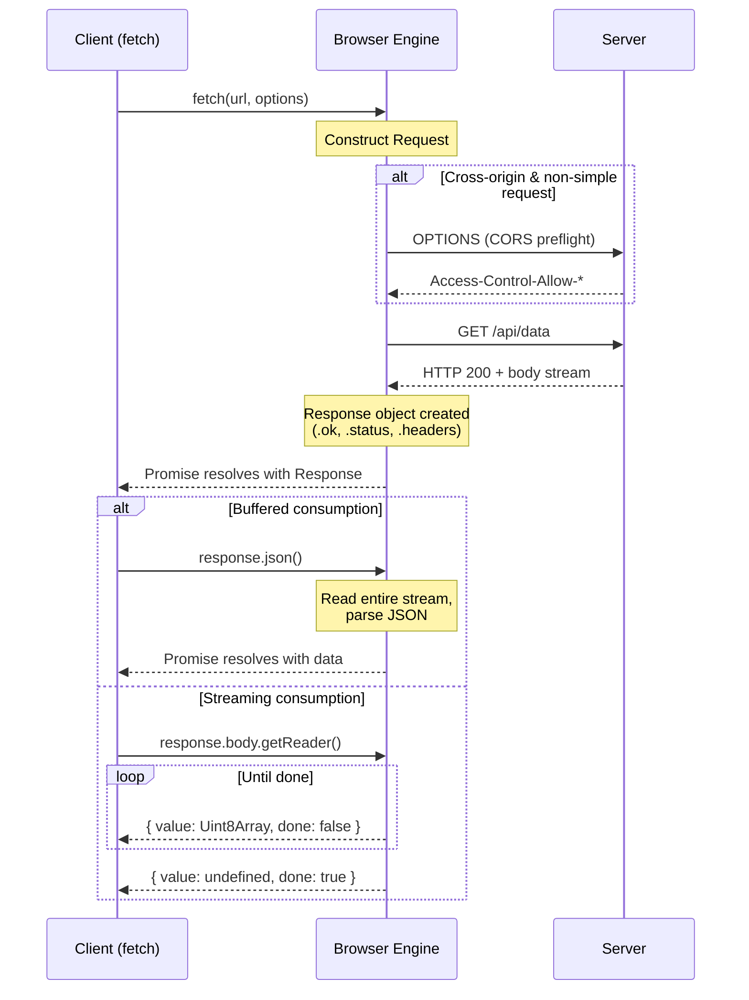

# [FEE-403] Fetch, Streams & Network APIs

:::info
The browser provides a layered networking stack: `fetch()` for request/response exchanges, the Streams API for incremental data processing, `EventSource` for server-pushed updates, `WebSocket` for full-duplex channels, and `sendBeacon` for fire-and-forget telemetry. Understanding these primitives -- and the error semantics that distinguish them from older APIs -- is the foundation of every data-fetching layer in modern frameworks.
:::

## Context

Network communication in the browser has evolved through three generations. First came `XMLHttpRequest` (XHR), a callback-based API that conflated configuration, execution, and response handling into a single mutable object. Then the Fetch API arrived, built on Promises and immutable Request/Response objects that align naturally with Service Workers and streaming. Most recently, the Streams API brought backpressure-aware incremental processing, enabling use cases like progressive rendering and real-time transcoding that were impossible with buffered responses.

Today, every major framework wraps one or more of these primitives. React Server Components call `fetch()` on the server; TanStack Query and SWR manage client-side cache and revalidation around fetch; Remix loaders and SvelteKit `load` functions abstract network calls behind convention. But when the abstraction leaks -- a CORS preflight fails, a streaming response stalls, or an unmounted component triggers a state update -- you need to understand the underlying APIs.

### The Fetch API surface

The Fetch API revolves around two objects:

| Object | Role |
|--------|------|
| **Request** | Encapsulates URL, method, headers, body, mode, credentials, redirect policy, and abort signal |
| **Response** | Encapsulates status, headers, and a body stream. Immutable once constructed. |

Both bodies are **ReadableStreams** -- they can only be consumed once. Calling `response.json()` locks and drains the stream; a second call throws. Use `response.clone()` before reading if you need the body twice (e.g., caching in a Service Worker while returning to the page).

Key fetch options:

| Option | Values | Default | Notes |
|--------|--------|---------|-------|
| `method` | Any HTTP method | `GET` | `no-cors` mode restricts to GET, HEAD, POST |
| `mode` | `cors`, `same-origin`, `no-cors` | `cors` | `no-cors` yields an opaque response (body/headers inaccessible) |
| `credentials` | `omit`, `same-origin`, `include` | `same-origin` | `include` with cross-origin requires explicit server headers |
| `redirect` | `follow`, `error`, `manual` | `follow` | `manual` returns an opaque-redirect response |
| `signal` | `AbortSignal` | -- | Cancel the request or set a timeout |
| `keepalive` | boolean | `false` | Allow the request to outlive the page (like `sendBeacon`) |

### Response consumption methods

| Method | Returns | Use case |
|--------|---------|----------|
| `.json()` | `Promise<any>` | JSON APIs |
| `.text()` | `Promise<string>` | Plain text, HTML, CSV |
| `.blob()` | `Promise<Blob>` | Images, files for download |
| `.arrayBuffer()` | `Promise<ArrayBuffer>` | Binary protocols, WASM modules |
| `.formData()` | `Promise<FormData>` | Multipart form responses |
| `.body` | `ReadableStream` | Streaming: progress tracking, incremental parsing |

### Real-time and one-way APIs

| API | Direction | Protocol | Use case |
|-----|-----------|----------|----------|
| **EventSource** (SSE) | Server to client | HTTP | Live feeds, notifications, LLM token streaming |
| **WebSocket** | Bidirectional | WS/WSS | Chat, multiplayer, collaborative editing |
| **sendBeacon** | Client to server (fire-and-forget) | HTTP POST | Analytics, telemetry on page unload |

## Scenario

You are implementing a chat interface that streams AI-generated responses token by token. A standard `fetch` call waits for the full response before returning it, producing a jarring "all-at-once" appearance. The Streams API exposes the response body as a `ReadableStream`, letting you read chunks as they arrive and update the UI incrementally — matching the progressive rendering pattern that users expect from modern chat interfaces.

## Design Thinking

### Why fetch replaced XHR

XHR was designed in 2006 for a world without Promises, Service Workers, or streaming. Its mutable, stateful design (open, set headers, set body, send, listen for events) couples configuration with execution. The Fetch API separates these concerns:

- **Request and Response are immutable value objects.** They can be constructed, inspected, cloned, and passed between contexts (page to Service Worker to cache).
- **Promise-based.** Composable with `async/await`, `Promise.all`, and `Promise.race`.
- **Streaming by default.** `response.body` is a `ReadableStream`, enabling incremental processing before the entire response arrives.
- **Service Worker native.** The `FetchEvent` in Service Workers hands you a `Request` and expects a `Response` -- the same objects the page uses.

### Framework data-fetching layers

Modern frameworks do not expose raw `fetch()` to application code. Instead, they wrap it in caching, deduplication, and lifecycle management:

**SWR / TanStack Query (stale-while-revalidate).** Return cached data instantly, then revalidate in the background. Configurable via `staleTime` (how long before data is considered stale) and `gcTime` (how long unused cache entries survive). TanStack Query adds DevTools, optimistic mutations, infinite queries, and framework-agnostic adapters.

**Nuxt `useFetch` / `useAsyncData`.** Isomorphic: runs on the server during SSR, deduplicates across components, serializes results to the client payload so the browser does not re-fetch.

**React Server Components.** `fetch()` runs on the server with automatic request deduplication and static caching. No client JS is shipped for server-only data. Combined with TanStack Query on the client, this creates a hybrid: RSC for initial load, TanStack Query for interactive mutations and real-time updates.

**Remix loaders / SvelteKit `load`.** Route-level data functions that run before render. The framework manages caching, revalidation, and error boundaries, keeping fetch logic out of components.

### Streaming: beyond buffered responses

The Streams API enables processing data as it arrives rather than waiting for the full payload:

- **ReadableStream** wraps a data source (network, file, sensor). Read chunks via `getReader()` or consume with `for await...of`.
- **WritableStream** wraps a data sink. Write chunks via `getWriter()`.
- **TransformStream** connects a writable input to a readable output, transforming chunks in flight. Built-in transforms include `TextDecoderStream`, `TextEncoderStream`, `CompressionStream`, and `DecompressionStream`.
- **Piping** (`pipeTo`, `pipeThrough`) chains streams with automatic backpressure -- if the consumer is slow, the producer pauses.

React's `renderToPipeableStream` uses this model to stream HTML to the client, sending the shell immediately and filling in Suspense boundaries as data resolves.

## Best Practices

**Always check `response.ok` before consuming the body.** `fetch()` only rejects on network-level failures; HTTP 4xx and 5xx responses resolve normally with `response.ok === false`. You MUST test `response.ok` (or `response.status`) after every fetch call and throw a meaningful error rather than passing an error page body to `.json()`, which produces a confusing `SyntaxError`.

**Use `AbortController` for every cancellable request.** You SHOULD pass an `AbortSignal` to every `fetch()` call that may become irrelevant -- component unmounts, route changes, and superseded searches all require cancellation. Use `AbortSignal.timeout(ms)` for declarative timeouts; use a manual `AbortController` when you need to cancel programmatically. Always swallow `AbortError` so cancelled requests do not surface as unhandled errors.

**Stream large responses instead of buffering them.** You SHOULD use `response.body` as a `ReadableStream` (via `getReader()` or `pipeThrough()`) for large payloads rather than calling `.json()` or `.arrayBuffer()`. Buffered consumption parses the entire payload synchronously on the main thread; streaming processes chunks incrementally, keeping the UI responsive and memory usage flat.

**Set `credentials` and `mode` explicitly for cross-origin requests.** You SHOULD declare `mode` (`cors`, `same-origin`, or `no-cors`) and `credentials` (`omit`, `same-origin`, or `include`) rather than relying on defaults. AVOID combining `credentials: 'include'` with a server that responds `Access-Control-Allow-Origin: *` -- the browser will block the request. Explicit options make CORS behaviour auditable and prevent silent failures caused by unexpected opaque responses.

## Visual



**Fetch lifecycle:** The client constructs a Request. For cross-origin non-simple requests, the browser sends a CORS preflight OPTIONS request. The server responds with the actual data as a stream. The client can consume the response either buffered (`.json()`, `.text()`) or incrementally via `ReadableStream`.

## Example

### 1. Fetch with error handling and abort

```js
async function fetchUser(userId, signal) {
  const response = await fetch(`/api/users/${userId}`, {
    headers: { 'Accept': 'application/json' },
    signal, // AbortSignal for cancellation
  });

  if (!response.ok) {
    // Distinguish client errors from server errors
    const body = await response.text().catch(() => '');
    throw new Error(
      `Failed to fetch user ${userId}: ${response.status} ${body}`
    );
  }

  return response.json();
}

// Usage in a React component (with cleanup)
function useUser(userId) {
  const [user, setUser] = useState(null);

  useEffect(() => {
    const controller = new AbortController();

    fetchUser(userId, controller.signal)
      .then(setUser)
      .catch((err) => {
        if (err.name !== 'AbortError') {
          console.error(err);
        }
      });

    return () => controller.abort(); // Cancel on unmount or userId change
  }, [userId]);

  return user;
}
```

### 2. Streaming response with ReadableStream

```js
async function streamLargeJSON(url, onItem) {
  const response = await fetch(url);
  if (!response.ok) throw new Error(`HTTP ${response.status}`);

  const reader = response.body
    .pipeThrough(new TextDecoderStream())
    .getReader();

  let buffer = '';

  while (true) {
    const { value, done } = await reader.read();
    if (done) break;

    buffer += value;

    // Process newline-delimited JSON (NDJSON) incrementally
    let newlineIndex;
    while ((newlineIndex = buffer.indexOf('\n')) !== -1) {
      const line = buffer.slice(0, newlineIndex).trim();
      buffer = buffer.slice(newlineIndex + 1);

      if (line) {
        onItem(JSON.parse(line)); // Process each record as it arrives
      }
    }
  }
}

// Usage: process 100K records without buffering them all in memory
await streamLargeJSON('/api/export/orders', (order) => {
  appendToTable(order);
});
```

### 3. Server-Sent Events for live updates

```js
function subscribeToPrices(symbols, onUpdate) {
  const params = new URLSearchParams({ symbols: symbols.join(',') });
  const source = new EventSource(`/api/prices/stream?${params}`);

  source.addEventListener('price', (event) => {
    const data = JSON.parse(event.data);
    onUpdate(data); // { symbol: 'AAPL', price: 198.52, ts: 1712678400 }
  });

  source.addEventListener('error', () => {
    // EventSource auto-reconnects; log for observability
    if (source.readyState === EventSource.CONNECTING) {
      console.warn('SSE reconnecting...');
    }
  });

  // Return cleanup function
  return () => source.close();
}

// Usage
const unsubscribe = subscribeToPrices(['AAPL', 'GOOG'], (update) => {
  renderPrice(update.symbol, update.price);
});

// On component unmount
unsubscribe();
```

## Common Mistakes

### 1. Missing CORS headers on the server

A missing `Access-Control-Allow-Origin` header causes fetch to reject with a `TypeError`. The error message is intentionally vague for security. Common omissions:

- Forgetting to handle the `OPTIONS` preflight method
- Setting `Access-Control-Allow-Origin: *` with `credentials: 'include'` (must specify the exact origin)
- Not exposing custom headers via `Access-Control-Expose-Headers`

### 2. Using WebSocket when SSE suffices

WebSocket requires a persistent bidirectional connection, a separate protocol upgrade, and custom reconnection logic. If data only flows server-to-client (dashboards, notifications, LLM streaming), `EventSource` is simpler: it auto-reconnects, tracks `lastEventId` for resume, and works over standard HTTP. Reserve WebSocket for cases that genuinely require client-to-server messaging (chat, collaborative editing, gaming).

### 3. Not consuming the response body before making the next request

`fetch()` returns a `Response` object before the body has been read. If the body is ignored — for example, calling `fetch()` in a loop without awaiting `response.json()` or `response.text()` — the browser holds the connection open until the body times out or is garbage collected. Always consume or explicitly cancel the body: `await response.arrayBuffer()` to read it, or `response.body.cancel()` to release the connection. This is especially important in service workers where unclosed streams can prevent the page from loading.

## Related FEEs

| FEE | Relationship |
|-----|-------------|
| [FEE-400 Browser APIs & Web Platform Overview](./400.md) | Parent category. Establishes the global objects (`window`, `navigator`) and runtime model that network APIs operate within. |
| [FEE-301 Event Loop & Async Execution](../JavaScript%20Core%20and%20Runtime/301.md) | Fetch Promises, stream reads, and SSE callbacks are all scheduled through the event loop. Understanding microtask timing explains why `.then()` chains execute before the next render. |
| [FEE-308 Error Handling & Debugging](../JavaScript%20Core%20and%20Runtime/308.md) | Network errors require structured handling: distinguishing AbortError from TypeError from HTTP status errors. Error boundaries in frameworks catch render-time failures from bad data. |
| [FEE-405 Web Workers & Concurrency](./405.md) | Workers have their own `fetch()` and can process streamed data off the main thread, preventing UI jank during large transfers. |

## References

- [WHATWG Fetch Standard](https://fetch.spec.whatwg.org/) -- The authoritative specification for fetch(), Request, Response, Headers, and CORS
- [WHATWG Streams Standard](https://streams.spec.whatwg.org/) -- The specification for ReadableStream, WritableStream, TransformStream, and piping
- [MDN: Using the Fetch API](https://developer.mozilla.org/en-US/docs/Web/API/Fetch_API/Using_Fetch) -- Comprehensive guide with examples for all fetch options
- [MDN: ReadableStream](https://developer.mozilla.org/en-US/docs/Web/API/ReadableStream) -- API reference for readable streams including BYOB readers
- [MDN: EventSource](https://developer.mozilla.org/en-US/docs/Web/API/EventSource) -- Server-Sent Events API reference with reconnection behavior
- [MDN: WebSocket](https://developer.mozilla.org/en-US/docs/Web/API/WebSocket) -- Full-duplex communication API reference
- [MDN: Navigator.sendBeacon()](https://developer.mozilla.org/en-US/docs/Web/API/Navigator/sendBeacon) -- Fire-and-forget beacon API for analytics and telemetry
- [web.dev: Streams -- The Definitive Guide](https://web.dev/articles/streams) -- Practical guide to ReadableStream, WritableStream, and TransformStream with visual explanations
- [TanStack Query Documentation](https://tanstack.com/query/latest/docs/framework/react/overview) -- Framework-agnostic data fetching with stale-while-revalidate caching
- [MDN: AbortController](https://developer.mozilla.org/en-US/docs/Web/API/AbortController) -- Cancellable fetch and stream reads via AbortSignal
- [MDN: Request.clone()](https://developer.mozilla.org/en-US/docs/Web/API/Request/clone) -- Cloning requests and responses to read the body more than once
- [HTTP Semantics (RFC 9110)](https://www.rfc-editor.org/info/rfc9110/) -- Authoritative reference for HTTP methods, headers, and status codes
- [MDN: Response.body](https://developer.mozilla.org/en-US/docs/Web/API/Response/body) -- ReadableStream property on Response for incremental consumption
