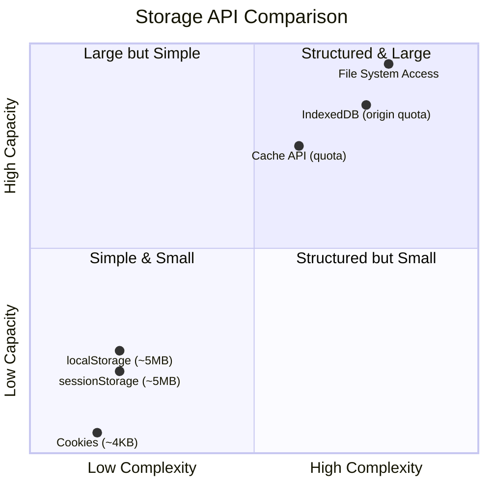

# [FEE-404] Storage & State Persistence

:::info
The browser provides multiple storage APIs, each optimized for a different use case: cookies travel with every HTTP request, Web Storage offers simple key-value persistence, IndexedDB handles structured and large-scale data, the Cache API stores HTTP request/response pairs for offline use, and the File System Access API grants direct file read/write. Choosing the right API is essential for building applications that persist state reliably. Understanding each API's security boundaries is equally essential, since the wrong choice can leak sensitive data to an attacker.
:::

## Context

A user fills out a multi-step form and accidentally closes the browser tab on step three. When they return, the form is empty. The data needs to survive a tab close but not a logout: `localStorage` persists across sessions, `sessionStorage` is cleared when a tab closes, and IndexedDB handles structured data too large for a key-value store. The right storage API depends on the data's lifetime, size, and structure, and on whether the data must be accessible across tabs.

Client-side storage has evolved from a single mechanism (cookies, introduced in 1994) to a rich ecosystem of purpose-built APIs. Each generation addressed limitations of the previous one:

**Cookies** were designed for server roundtrip state: session identifiers, CSRF tokens, consent flags. They are automatically attached to every HTTP request matching their domain and path, which makes them uniquely suited for authentication but poorly suited for general-purpose storage. The ~4 KB per-cookie limit and synchronous `document.cookie` string API reinforce this narrow scope.

**Web Storage** (`localStorage` and `sessionStorage`) arrived with HTML5, providing synchronous key-value string storage. `localStorage` persists across browser sessions; `sessionStorage` is scoped to a single tab and cleared when the tab closes. The ~5 MB per-origin limit and string-only values make it suitable for preferences and small UI state, but not structured data or large datasets.

**IndexedDB** is a transactional, asynchronous object store that supports indexes, cursors, and structured cloning (storing objects, arrays, Blobs, and ArrayBuffers directly). Its capacity is bounded by the shared origin storage quota described below, typically tens of gigabytes on a modern device rather than a small fixed ceiling, and it is the recommended API for any structured or large-scale client-side storage.

**Cache API** stores Request/Response pairs, primarily for Service Worker offline strategies. Unlike the other APIs, it operates on HTTP semantics: you cache a fetch response and retrieve it by matching the request.

**File System Access API** (formerly Native File System) provides direct read/write access to files on the user's device via file and directory picker dialogs (`showOpenFilePicker`, `showSaveFilePicker`, `showDirectoryPicker`). It is the only client-side API that can write back to the same file the user opened. These picker methods are Chromium-only; Firefox and Safari do not implement them. The Origin Private File System (OPFS), reached via `navigator.storage.getDirectory()`, is the cross-browser subset of this API: it gives a page a private, sandboxed file system with no picker dialogs, and all three engines support it.

### Storage quotas

All origin-scoped storage (IndexedDB, Cache API, and to a lesser extent localStorage) shares a quota pool. The `navigator.storage.estimate()` method returns the total quota and current usage:

```js
const { quota, usage } = await navigator.storage.estimate();
console.log(`Using ${(usage / 1024 / 1024).toFixed(1)} MB of ${(quota / 1024 / 1024).toFixed(0)} MB`);
```

Quota policy differs by browser. In Chromium-based browsers, an origin can use up to 60% of total disk size in both persistent and best-effort modes. Firefox's best-effort mode, the default and subject to eviction, caps each *group* at the smaller of 10% of total disk size or 10 GiB; a group is a site, the registrable domain (eTLD+1) plus its subdomains, so multiple origins on the same site share one 10 GiB ceiling. Firefox's persistent mode, granted through `navigator.storage.persist()`, is not subject to the group limit and instead allows a single origin up to 50% of total disk size, capped at 8 TiB. Safari 17 and later (iOS 17, iPadOS 17, and macOS Sonoma, released September 2023) allows an origin up to ~60% of total disk space, with an overall cap of 80% of disk space across all origins on the device. Earlier Safari versions capped an origin at an initial 1 GiB and prompted the user for permission to grow beyond it; that prompt was removed in the Safari 17 change. Exceeding the quota throws a `QuotaExceededError` in IndexedDB and Cache API, or a generic `DOMException` in localStorage.

To request that the browser not evict your data under storage pressure, call `navigator.storage.persist()`:

```js
const persisted = await navigator.storage.persist();
// true = browser will not evict; false = best-effort (may be evicted)
```

### Storage Buckets API

`navigator.storage.persist()` is an all-or-nothing, origin-wide request: either the whole origin is protected from eviction or none of it is. The Storage Buckets API, shipped in Chrome and Edge 122 (early 2024), solves the finer-grained version of the same problem. It lets an origin split its storage into named buckets, each with its own eviction priority and durability setting:

```js
const criticalBucket = await navigator.storageBuckets.open('critical-data', {
  persisted: true,
  durability: 'strict',
});

const cacheBucket = await navigator.storageBuckets.open('disposable-cache', {
  persisted: false,
});
```

Under storage pressure, the browser evicts low-priority buckets like `disposable-cache` before touching data in a `persisted: true` bucket. Applied to the form-draft scenario above, an application can keep offline asset caches evictable while guaranteeing the user's in-progress draft survives storage pressure. Support is currently limited to Chrome and Edge; Firefox and Safari have not implemented the API.

## Visual



**Reading the chart:** The x-axis represents API complexity (learning curve, setup required). The y-axis represents storage capacity. Cookies and Web Storage cluster in the low-complexity, low-capacity corner. IndexedDB and Cache API occupy the high-capacity, higher-complexity region, both bounded by the shared origin quota rather than a fixed ceiling. File System Access has the highest capacity (device disk) and highest complexity (permission prompts, async handles).

## Example

### 1. localStorage with cross-tab storage event

The `storage` event fires in other tabs when localStorage changes, enabling simple cross-tab synchronization:

```js
// Tab A: Update theme
function setTheme(theme) {
  document.documentElement.setAttribute('data-theme', theme);
  localStorage.setItem('theme', theme);
}

// Tab B: Listen for changes from other tabs
window.addEventListener('storage', (event) => {
  if (event.key === 'theme' && event.newValue) {
    document.documentElement.setAttribute('data-theme', event.newValue);
  }
});

// Initialize from stored value
const savedTheme = localStorage.getItem('theme') || 'light';
setTheme(savedTheme);
```

Note: The `storage` event only fires in **other** tabs/windows of the same origin. It does not fire in the tab that made the change.

### 2. IndexedDB CRUD operations

```js
// Open (or create) a database
function openDB(name, version, onUpgrade) {
  return new Promise((resolve, reject) => {
    const request = indexedDB.open(name, version);
    request.onupgradeneeded = (e) => onUpgrade(e.target.result);
    request.onsuccess = (e) => resolve(e.target.result);
    request.onerror = (e) => reject(e.target.error);
  });
}

// Initialize database with an object store and index
const db = await openDB('app-db', 1, (db) => {
  const store = db.createObjectStore('contacts', { keyPath: 'id', autoIncrement: true });
  store.createIndex('by_email', 'email', { unique: true });
});

// CREATE
function addContact(db, contact) {
  return new Promise((resolve, reject) => {
    const tx = db.transaction('contacts', 'readwrite');
    const store = tx.objectStore('contacts');
    const request = store.add(contact);
    request.onsuccess = () => resolve(request.result); // Returns the generated key
    request.onerror = () => reject(request.error);
  });
}

// READ by index
function getContactByEmail(db, email) {
  return new Promise((resolve, reject) => {
    const tx = db.transaction('contacts', 'readonly');
    const index = tx.objectStore('contacts').index('by_email');
    const request = index.get(email);
    request.onsuccess = () => resolve(request.result);
    request.onerror = () => reject(request.error);
  });
}

// UPDATE
function updateContact(db, contact) {
  return new Promise((resolve, reject) => {
    const tx = db.transaction('contacts', 'readwrite');
    const request = tx.objectStore('contacts').put(contact); // put = upsert
    request.onsuccess = () => resolve();
    request.onerror = () => reject(request.error);
  });
}

// DELETE
function deleteContact(db, id) {
  return new Promise((resolve, reject) => {
    const tx = db.transaction('contacts', 'readwrite');
    const request = tx.objectStore('contacts').delete(id);
    request.onsuccess = () => resolve();
    request.onerror = () => reject(request.error);
  });
}

// Usage
const id = await addContact(db, { name: 'Alice', email: 'alice@example.com' });
const alice = await getContactByEmail(db, 'alice@example.com');
await updateContact(db, { ...alice, name: 'Alice Wu' });
await deleteContact(db, id);
```

The example above hand-wraps IndexedDB's callback API in Promises to show the underlying mechanic. Production code typically reaches for a wrapper instead: [idb](https://github.com/jakearchibald/idb) provides the same thin Promise wrapper shown here, and [Dexie.js](https://dexie.org/) adds a higher-level query layer on top. web.dev's own storage guide recommends using a wrapper rather than the raw API.

### 3. Cache API for offline support

```js
const CACHE_NAME = 'app-shell-v1';
const PRECACHE_URLS = ['/', '/index.html', '/styles.css', '/app.js', '/logo.svg'];

// Service Worker: precache on install
self.addEventListener('install', (event) => {
  event.waitUntil(
    caches.open(CACHE_NAME).then((cache) => cache.addAll(PRECACHE_URLS))
  );
});

// Service Worker: serve from cache, fall back to network
self.addEventListener('fetch', (event) => {
  event.respondWith(
    caches.match(event.request).then((cached) => {
      if (cached) return cached;

      return fetch(event.request).then((response) => {
        // Clone because the response body can only be consumed once
        const clone = response.clone();
        caches.open(CACHE_NAME).then((cache) => cache.put(event.request, clone));
        return response;
      });
    })
  );
});

// Service Worker: clean old caches on activate
self.addEventListener('activate', (event) => {
  event.waitUntil(
    caches.keys().then((names) =>
      Promise.all(
        names
          .filter((name) => name !== CACHE_NAME)
          .map((name) => caches.delete(name))
      )
    )
  );
});
```

## Best Practices

**Use `localStorage` for simple key-value persistence; use IndexedDB for structured or binary data.** `localStorage` is appropriate for small string values such as user preferences, feature flags, and UI state (e.g., sidebar collapsed). AVOID storing objects, arrays, Blobs, or large JSON in localStorage: the required `JSON.stringify`/`JSON.parse` round-trip is synchronous and blocks the main thread. SHOULD use IndexedDB for any structured, relational, or binary data; it stores objects natively via structured cloning and is fully asynchronous.

**Always handle `QuotaExceededError`.** Both `localStorage` and IndexedDB throw when the origin's storage quota is exceeded. MUST wrap storage writes in try/catch (localStorage) or check for transaction errors (IndexedDB). Silently ignoring quota errors causes data loss and application crashes. A graceful fallback is always preferable to an unhandled exception: evict stale entries or notify the user.

**NEVER store sensitive data in `localStorage` or `sessionStorage`.** Any JavaScript executing on the same origin can read all Web Storage values, including injected XSS payloads. Authentication tokens, API keys, and session secrets MUST be stored in `HttpOnly` cookies, which are inaccessible to JavaScript entirely.

**Use `sessionStorage` for state that SHOULD be discarded when the tab closes.** Temporary wizard state and per-tab UI context are good fits for `sessionStorage`: it is automatically cleared when the tab closes, removing the need for explicit cleanup and preventing stale state from leaking across sessions. A draft that must survive a tab close, like the multi-step form from the Context above, needs `localStorage` or IndexedDB instead.

## Design Thinking

### Why multiple storage APIs exist

Each API targets a distinct access pattern:

| API | Designed for | Sent to server? | Async? | Capacity |
|-----|-------------|-----------------|--------|----------|
| Cookies | Server roundtrip state (auth, CSRF) | Yes, every matching request | No (`document.cookie` is sync) | ~4 KB per cookie |
| localStorage | Simple persistent KV (preferences) | No | No (blocks main thread) | ~5 MB per origin |
| sessionStorage | Tab-scoped temporary KV | No | No (blocks main thread) | ~5 MB per origin |
| IndexedDB | Structured data, large datasets, offline | No | Yes (transaction-based) | Origin quota (often tens of GB) |
| Cache API | HTTP request/response caching (SW) | No | Yes (Promise-based) | Shares origin quota |
| File System Access | User file read/write (picker: Chromium only; OPFS: all engines) | No | Yes (Promise-based) | Device disk |

No single API covers all needs. Cookies exist because the server needs state on every request. localStorage exists because IndexedDB is overkill for a theme preference. The Cache API exists because IndexedDB cannot natively store and match HTTP Request/Response pairs.

### Framework persistence patterns

Modern frameworks provide abstractions over these raw APIs:

**React + localStorage / useEffect.** A common pattern persists state to localStorage inside a `useEffect` and reads it during initialization:

```js
function usePersistedState(key, defaultValue) {
  const [value, setValue] = useState(() => {
    const stored = localStorage.getItem(key);
    return stored !== null ? JSON.parse(stored) : defaultValue;
  });

  useEffect(() => {
    localStorage.setItem(key, JSON.stringify(value));
  }, [key, value]);

  return [value, setValue];
}
```

**Vue + pinia-plugin-persistedstate.** Pinia stores can be persisted declaratively:

```js
defineStore('settings', {
  state: () => ({ theme: 'light', locale: 'en' }),
  persist: true, // Defaults to localStorage with store ID as key
});
```

**Zustand persist middleware.** Zustand supports pluggable storage backends:

```js
import { create } from 'zustand';
import { persist } from 'zustand/middleware';

const useStore = create(
  persist(
    (set) => ({ count: 0, inc: () => set((s) => ({ count: s.count + 1 })) }),
    { name: 'counter-storage' }, // localStorage key
  ),
);
```

**SvelteKit cookies.** Server-side cookie management integrated with load functions:

```js
// +page.server.js
export function load({ cookies }) {
  const theme = cookies.get('theme') || 'light';
  return { theme };
}

export const actions = {
  setTheme({ cookies, request }) {
    const data = await request.formData();
    cookies.set('theme', data.get('theme'), { path: '/', httpOnly: true });
  },
};
```

**Remix cookie/session.** Built-in session storage backed by cookies or external stores:

```js
import { createCookieSessionStorage } from '@remix-run/node';

const { getSession, commitSession } = createCookieSessionStorage({
  cookie: { name: '__session', httpOnly: true, secure: true, sameSite: 'lax' },
});
```

### Security considerations

**localStorage and XSS.** Any script injected via XSS can call `localStorage.getItem()` and exfiltrate every stored value. XSS-driven token theft from localStorage is the dominant attack vector in SPA authentication. HttpOnly cookies are immune to this because JavaScript cannot access them.

**Cookies and CSRF.** Without the `SameSite` attribute, cookies are sent with cross-origin requests, enabling CSRF attacks. Modern browsers default to `SameSite=Lax`, but explicitly setting it is essential for defense in depth:

| SameSite value | Behavior |
|---------------|----------|
| `Strict` | Cookie never sent on cross-site requests |
| `Lax` | Sent on top-level navigations (links) but not on subresource requests (images, frames, POST) |
| `None` | Sent on all cross-site requests (requires `Secure` flag) |

**Secure flag.** Cookies with `Secure` are only sent over HTTPS, preventing interception on insecure networks.

## Common Mistakes

### 1. Synchronous localStorage in hot paths

`localStorage.getItem()` and `localStorage.setItem()` are synchronous and block the main thread. Calling them in render loops, scroll handlers, or animation frames causes jank:

```js
// BAD: Blocks rendering on every scroll event
window.addEventListener('scroll', () => {
  localStorage.setItem('scrollY', window.scrollY);
});

// GOOD: Debounce and write asynchronously
let timer;
window.addEventListener('scroll', () => {
  clearTimeout(timer);
  timer = setTimeout(() => {
    localStorage.setItem('scrollY', window.scrollY);
  }, 300);
});
```

### 2. Cookies without SameSite attribute (CSRF risk)

Omitting `SameSite` allows cookies to be sent with cross-origin requests, enabling CSRF attacks. Always set `SameSite` explicitly:

```
Set-Cookie: session=abc123; SameSite=Lax; Secure; HttpOnly
```

## Related Topics

- [FEE-400 Browser APIs & Web Platform Overview](/en/Browser%20APIs%20and%20Web%20Platform/400): parent category that establishes the global objects and runtime model storage APIs operate within.
- [FEE-403 Fetch, Streams & Network APIs](/en/Browser%20APIs%20and%20Web%20Platform/403): the Cache API stores Request/Response objects from fetch; fetch semantics are prerequisite to effective cache strategies.
- [FEE-405 Web Workers & Concurrency](/en/Browser%20APIs%20and%20Web%20Platform/405): IndexedDB is accessible from Web Workers and Service Workers, enabling off-main-thread data processing.
- [FEE-1200 Security](/en/Security/1200): XSS and CSRF mitigation directly shapes storage API choices; HttpOnly cookies, SameSite, and Secure flags are security fundamentals.

## References

- MDN, "Web Storage API," MDN Web Docs. https://developer.mozilla.org/en-US/docs/Web/API/Web_Storage_API
- MDN, "IndexedDB API," MDN Web Docs. https://developer.mozilla.org/en-US/docs/Web/API/IndexedDB_API
- MDN, "Using IndexedDB," MDN Web Docs. https://developer.mozilla.org/en-US/docs/Web/API/IndexedDB_API/Using_IndexedDB
- MDN, "Cache," MDN Web Docs. https://developer.mozilla.org/en-US/docs/Web/API/Cache
- MDN, "Storage quotas and eviction criteria," MDN Web Docs. https://developer.mozilla.org/en-US/docs/Web/API/Storage_API/Storage_quotas_and_eviction_criteria
- MDN, "Window: storage event," MDN Web Docs. https://developer.mozilla.org/en-US/docs/Web/API/Window/storage_event
- WHATWG, "Storage Standard," WHATWG. https://storage.spec.whatwg.org/
- WHATWG, "HTML Standard: Web storage," WHATWG. https://html.spec.whatwg.org/multipage/webstorage.html
- Google, "Storage for the web," web.dev (2024). https://web.dev/articles/storage-for-the-web
- Google, "Indexed DB best practices," web.dev (2023). https://web.dev/indexeddb-best-practices/
- WebKit, "Updates to Storage Policy," WebKit Blog (2023). https://webkit.org/blog/14403/updates-to-storage-policy/
- RxDB, "IndexedDB Max Storage Size Limit," RxDB Articles. https://rxdb.info/articles/indexeddb-max-storage-limit.html
- Chrome for Developers, "Not all storage is created equal: introducing Storage Buckets," Chrome for Developers Blog (2024). https://developer.chrome.com/docs/web-platform/storage-buckets
- WICG, "Storage Buckets API Explainer," WICG storage-buckets (2024). https://github.com/WICG/storage-buckets/blob/main/explainer.md
- Jake Archibald, "idb: IndexedDB, but with promises," GitHub. https://github.com/jakearchibald/idb
- Dexie.js, "Dexie.js documentation," Dexie.js. https://dexie.org/
