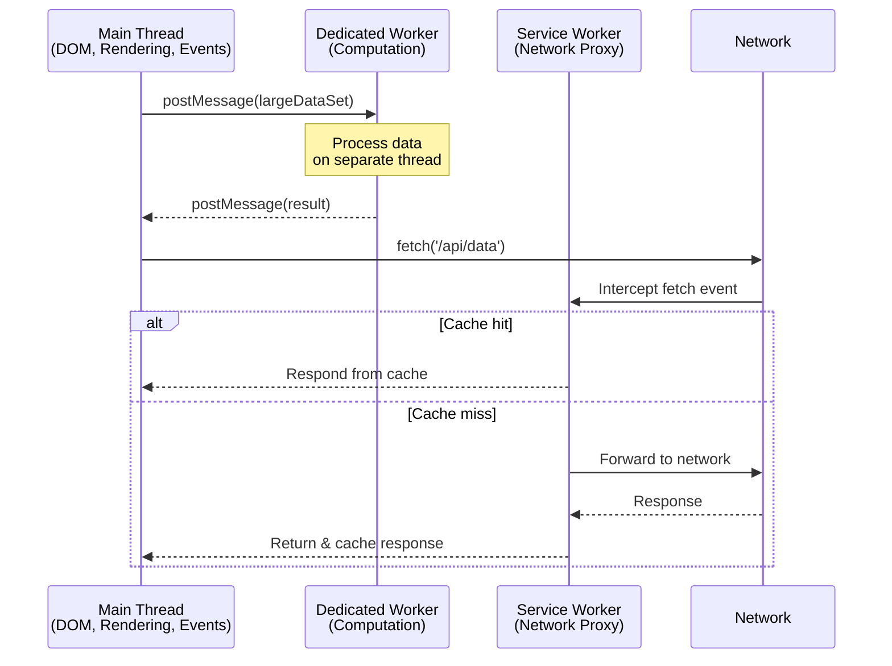

# [FEE-405] Web Workers & Concurrency

:::info
JavaScript is single-threaded: the main thread handles DOM rendering, user input, and script execution in a single run loop. Any long-running computation blocks painting and event handling, producing visible jank. Web Workers provide true OS-level threads that run JavaScript in parallel without access to the DOM, communicating with the main thread via message passing. Service Workers extend this model to act as network proxies, enabling offline caching and push notifications. Worklets offer lightweight, render-pipeline-integrated threads for custom painting, audio processing, and animation. Understanding when and how to move work off the main thread is essential for responsive, high-performance web applications.
:::

## Context

The browser's main thread is responsible for three interleaved tasks: executing JavaScript, computing layout and styles, and painting pixels to the screen. These tasks share a single call stack. When a script runs for 50 ms or more, the browser cannot repaint or respond to user input during that time -- this is a "long task" that degrades perceived performance.

Web Workers were introduced in the HTML5 era to address this constraint. A Worker runs in a separate OS thread with its own global scope (`DedicatedWorkerGlobalScope` or `SharedWorkerGlobalScope`), its own event loop, and no access to `window`, `document`, or any DOM API. Communication happens exclusively through the structured clone algorithm (deep copy of data) or transferable objects (zero-copy ownership transfer).

The platform provides four distinct worker-like primitives, each designed for a different problem:

| Type | Global Scope | Lifetime | Use Case |
|------|-------------|----------|----------|
| Dedicated Worker | `DedicatedWorkerGlobalScope` | Tied to creating page | Heavy computation, data processing |
| Shared Worker | `SharedWorkerGlobalScope` | Tied to origin (survives across tabs) | Shared state across tabs (same origin) |
| Service Worker | `ServiceWorkerGlobalScope` | Event-driven, independent of pages | Network proxy, offline caching, push |
| Worklet | `WorkletGlobalScope` subclass | Tied to rendering pipeline | CSS Paint, Audio, Animation |

### Structured cloning and transferable objects

When you call `postMessage(data)`, the browser serializes `data` using the structured clone algorithm. This supports most built-in types (objects, arrays, Maps, Sets, Dates, RegExps, Blobs, ArrayBuffers, ImageBitmaps) but not functions, DOM nodes, or Error objects (in some browsers). Cloning large data is expensive -- a 100 MB ArrayBuffer takes measurable time to copy.

Transferable objects avoid this cost entirely. When you transfer an ArrayBuffer, ownership moves from the sender to the receiver in O(1) time. The sender's reference becomes zero-length (neutered):

```js
const buffer = new ArrayBuffer(1024 * 1024 * 100); // 100 MB
worker.postMessage(buffer, [buffer]); // Transfer, not clone
console.log(buffer.byteLength); // 0 -- ownership transferred
```

Transferable types include `ArrayBuffer`, `MessagePort`, `ReadableStream`, `WritableStream`, `TransformStream`, `ImageBitmap`, and `OffscreenCanvas`.

## Scenario

A spreadsheet application processes formula dependencies across thousands of cells on every keystroke. The calculation runs synchronously on the main thread, blocking input for 200ms and making the application feel unresponsive. Web Workers run JavaScript in a background thread with no access to the DOM, communicating with the main thread via message passing. Moving the calculation to a Worker lets the main thread remain responsive to user input while the background thread computes.

## Design Thinking

### Why workers exist: the main thread bottleneck

The browser's rendering pipeline operates on a fixed budget. At 60 fps, each frame has ~16.6 ms. Within that budget, the main thread must process input events, run JavaScript (including framework reconciliation), compute styles, perform layout, paint, and composite. Any JavaScript that takes longer than this budget causes dropped frames.

Consider what happens during a typical React render cycle: the framework diffs a virtual DOM tree, computes which real DOM nodes need updating, and applies those mutations. If the application also needs to parse a large JSON response, sort a table with 10,000 rows, or run a cryptographic hash, all of this competes for the same 16.6 ms budget.

Workers solve this by providing genuinely parallel execution. Unlike `setTimeout` or `requestIdleCallback` (which merely schedule work later on the same thread), a Worker runs on a separate thread and can fully utilize another CPU core.

### Framework and tooling patterns for off-main-thread work

**Partytown** relocates third-party scripts (analytics, ads, tag managers) into a Web Worker. Third-party scripts are a major source of main thread contention -- Google Tag Manager, Facebook Pixel, and similar scripts frequently trigger long tasks. Partytown intercepts DOM API calls from within the worker and proxies them to the main thread, allowing these scripts to run without blocking user interaction. It is still in beta and requires careful testing, but demonstrates the pattern of isolating untrusted or non-critical code.

**Comlink** (by Google Chrome Labs, ~1.1 kB) wraps `postMessage` with ES6 Proxies to provide an RPC-like interface. Instead of manually serializing messages and matching request/response IDs, you expose an object from the worker and call its methods from the main thread as if they were local async functions. This dramatically reduces the boilerplate of worker communication.

**Vite and webpack worker bundling.** Both bundlers support `new Worker(new URL('./worker.js', import.meta.url))` syntax, enabling workers to participate in the module graph with proper code splitting, tree shaking, and HMR. Vite also supports `?worker` import suffix for inline worker bundling.

**Worker-based SSR.** Cloudflare Workers and similar edge runtimes run JavaScript in V8 isolates (conceptually similar to workers) to perform server-side rendering close to the user. This pattern treats the "worker" concept as an architectural primitive beyond the browser.

**React concurrent features.** While not using Web Workers directly, React's concurrent mode (`startTransition`, `useDeferredValue`) addresses the same fundamental problem -- keeping the main thread responsive during expensive renders -- by breaking rendering into interruptible units. The mental model is similar: separate urgent work (user input) from non-urgent work (re-rendering a list).

### Service Workers as PWA foundation

Service Workers are unique among worker types because they act as a programmable network proxy sitting between the browser and the network. Every fetch request from a controlled page passes through the Service Worker's `fetch` event handler, where it can be served from cache, modified, or forwarded to the network.

The lifecycle is deliberately designed for reliability:

1. **Registration** -- The page calls `navigator.serviceWorker.register('/sw.js')`. The browser downloads and parses the script.
2. **Install** -- The `install` event fires. This is where you precache static assets. The worker is "installed" but not yet active.
3. **Waiting** -- If an older Service Worker is still controlling pages, the new one waits. This prevents two versions from running simultaneously.
4. **Activate** -- When no pages use the old worker, the new one activates. The `activate` event is where you clean up old caches.
5. **Fetch/Push/Sync** -- The active worker intercepts network requests and handles push notifications and background sync events.

This lifecycle means updates are safe by default -- users never get a half-old, half-new set of assets. The tradeoff is complexity: developers must manage cache versioning and understand the waiting state.

## Best Practices

**Offload CPU-intensive work to a Worker — never block the main thread.** Any computation that consistently takes longer than a few milliseconds SHOULD be moved to a Dedicated Worker. The main thread MUST remain available for rendering and input handling; tasks like sorting large datasets, parsing heavy JSON, running cryptographic operations, or image processing are candidates for offloading. Use `setTimeout` or `requestIdleCallback` only for work that is genuinely cheap and interruptible.

**Use `SharedArrayBuffer` and `Atomics` only when shared memory is genuinely required.** Shared memory avoids copying but introduces synchronization complexity and requires cross-origin isolation headers (`Cross-Origin-Opener-Policy: same-origin` and `Cross-Origin-Embedder-Policy: require-corp`). AVOID reaching for `SharedArrayBuffer` when transferable `ArrayBuffer` objects can accomplish the same goal — transferring ownership is O(1) and requires no locking. Reserve `SharedArrayBuffer` for cases where two threads must read and write the same memory concurrently, such as WebAssembly multi-threading.

**Terminate workers when they are no longer needed.** Each worker consumes an OS thread and associated memory. Workers MUST be terminated via `worker.terminate()` once their task is complete, especially in single-page applications that create workers on route changes. For recurring tasks, reuse a single long-lived worker instance rather than creating and discarding workers per operation.

**Use a message abstraction such as Comlink instead of raw `postMessage`.** Raw `postMessage` requires manually serializing commands, matching request/response IDs, and handling errors in both directions. Libraries like Comlink wrap this in an RPC-style interface using ES6 Proxies, letting you call worker methods as async functions. This SHOULD be the default for any non-trivial worker communication, reserving raw `postMessage` only where bundle size or dependency constraints make a library impractical.

## Visual



**Reading the diagram:** The main thread offloads heavy computation to a Dedicated Worker via `postMessage`, keeping the UI responsive. Separately, all network requests pass through the Service Worker, which can serve cached responses instantly or fetch from the network and cache the result. These are two independent concurrency patterns: computational parallelism (Workers) and network interception (Service Workers).

## Example

### 1. Dedicated Worker for heavy computation

**worker.js:**

```js
// worker.js -- runs in a separate thread
self.addEventListener('message', (event) => {
  const { numbers } = event.data;

  // Simulate expensive computation: find all primes in range
  const primes = numbers.filter((n) => {
    if (n < 2) return false;
    for (let i = 2, sqrt = Math.sqrt(n); i <= sqrt; i++) {
      if (n % i === 0) return false;
    }
    return true;
  });

  self.postMessage({ primes });
});
```

**main.js:**

```js
// main.js -- runs on the main thread
const worker = new Worker(new URL('./worker.js', import.meta.url));

// Send data to worker
const numbers = Array.from({ length: 1_000_000 }, (_, i) => i);
worker.postMessage({ numbers });

// Receive results without blocking the main thread
worker.addEventListener('message', (event) => {
  console.log(`Found ${event.data.primes.length} primes`);
});

// Clean up when done
worker.addEventListener('error', (event) => {
  console.error('Worker error:', event.message);
  worker.terminate();
});
```

### 2. Comlink for ergonomic worker RPC

**math-worker.js:**

```js
// math-worker.js
import { expose } from 'comlink';

const mathService = {
  fibonacci(n) {
    if (n <= 1) return n;
    let a = 0, b = 1;
    for (let i = 2; i <= n; i++) {
      [a, b] = [b, a + b];
    }
    return b;
  },

  // Comlink supports async methods transparently
  async processCSV(csvText) {
    const rows = csvText.split('\n').map((row) => row.split(','));
    // Expensive aggregation on worker thread
    return rows.reduce((sum, row) => sum + Number(row[1] || 0), 0);
  },
};

expose(mathService);
```

**main.js:**

```js
// main.js
import { wrap } from 'comlink';

const mathWorker = wrap(
  new Worker(new URL('./math-worker.js', import.meta.url))
);

// Call worker methods as if they were local async functions
const fib50 = await mathWorker.fibonacci(50);
console.log(`Fibonacci(50) = ${fib50}`);

const total = await mathWorker.processCSV(largeCsvString);
console.log(`CSV total: ${total}`);
```

### 3. Service Worker basic offline caching

**Registering the Service Worker (main.js):**

```js
if ('serviceWorker' in navigator) {
  navigator.serviceWorker
    .register('/sw.js')
    .then((reg) => console.log('SW registered, scope:', reg.scope))
    .catch((err) => console.error('SW registration failed:', err));
}
```

**sw.js (stale-while-revalidate strategy):**

```js
const CACHE_NAME = 'app-v1';
const PRECACHE_URLS = [
  '/',
  '/index.html',
  '/styles.css',
  '/app.js',
  '/offline.html',
];

// Install: precache app shell
self.addEventListener('install', (event) => {
  event.waitUntil(
    caches.open(CACHE_NAME).then((cache) => cache.addAll(PRECACHE_URLS))
  );
  self.skipWaiting(); // Activate immediately (use with caution)
});

// Activate: clean up old caches
self.addEventListener('activate', (event) => {
  event.waitUntil(
    caches.keys().then((names) =>
      Promise.all(
        names
          .filter((name) => name !== CACHE_NAME)
          .map((name) => caches.delete(name))
      )
    )
  );
  self.clients.claim(); // Take control of open pages
});

// Fetch: stale-while-revalidate
self.addEventListener('fetch', (event) => {
  event.respondWith(
    caches.open(CACHE_NAME).then(async (cache) => {
      const cached = await cache.match(event.request);

      // Start network fetch regardless (to update cache)
      const networkPromise = fetch(event.request)
        .then((response) => {
          // Only cache successful, same-origin responses
          if (response.ok && response.type === 'basic') {
            cache.put(event.request, response.clone());
          }
          return response;
        })
        .catch(() => {
          // Network failed, return offline page for navigation requests
          if (event.request.mode === 'navigate') {
            return cache.match('/offline.html');
          }
          return undefined;
        });

      // Return cached immediately, update in background
      return cached || networkPromise;
    })
  );
});
```

## Common Mistakes

### 1. Service Worker caching stale content without a versioning strategy

Without cache versioning, users may be served outdated assets indefinitely. Always include a version identifier in cache names and clean up old caches during activation:

```js
// BAD: Single unversioned cache -- no way to invalidate
const CACHE = 'my-cache';

// GOOD: Versioned cache with cleanup
const CACHE = 'my-cache-v3';

self.addEventListener('activate', (event) => {
  event.waitUntil(
    caches.keys().then((names) =>
      Promise.all(
        names
          .filter((name) => name !== CACHE)
          .map((name) => caches.delete(name))
      )
    )
  );
});
```

### 2. Using SharedArrayBuffer without cross-origin isolation headers

`SharedArrayBuffer` requires the page to be cross-origin isolated. Without the correct HTTP headers, the constructor throws a `TypeError` in modern browsers. This was mandated after the Spectre vulnerability disclosure to prevent cross-origin data leakage via timing attacks:

```
# Required HTTP response headers for the main document
Cross-Origin-Opener-Policy: same-origin
Cross-Origin-Embedder-Policy: require-corp
```

```js
// Check before using SharedArrayBuffer
if (self.crossOriginIsolated) {
  const sab = new SharedArrayBuffer(1024);
  const view = new Int32Array(sab);
  // Use Atomics for thread-safe access
  Atomics.store(view, 0, 42);
  Atomics.notify(view, 0);
} else {
  console.warn('SharedArrayBuffer unavailable: page is not cross-origin isolated');
}
```

Note: These headers can break third-party embeds (iframes, images, scripts) that do not include `Cross-Origin-Resource-Policy` headers. Migrating to cross-origin isolation requires auditing all embedded resources.

## Related FEEs

| FEE | Relationship |
|-----|-------------|
| [FEE-400 Browser APIs & Web Platform Overview](./400.md) | Parent category. Establishes the event loop, task queues, and runtime model that workers extend with separate threads. |
| [FEE-301 Async Patterns & Promises](../JavaScript%20Core/301.md) | Workers communicate via asynchronous messages. Promise-based wrappers (and libraries like Comlink) build on async patterns covered in FEE-301. |
| [FEE-306 Memory Management & GC](../JavaScript%20Core/306.md) | Transferable objects, SharedArrayBuffer, and worker lifecycle directly impact memory management strategies. |
| [FEE-1300 Performance](../Performance/1300.md) | Moving computation off the main thread is a core performance optimization. Long task detection and worker offloading are complementary techniques. |

## References

- [WHATWG HTML: Web Workers](https://html.spec.whatwg.org/multipage/workers.html) -- Normative specification for Dedicated and Shared Workers
- [MDN: Web Workers API](https://developer.mozilla.org/en-US/docs/Web/API/Web_Workers_API) -- API reference and conceptual overview
- [MDN: Using Web Workers](https://developer.mozilla.org/en-US/docs/Web/API/Web_Workers_API/Using_web_workers) -- Practical guide to creating and communicating with workers
- [MDN: Service Worker API](https://developer.mozilla.org/en-US/docs/Web/API/Service_Worker_API) -- API reference for Service Workers
- [web.dev: The Service Worker Lifecycle](https://web.dev/articles/service-worker-lifecycle) -- Detailed walkthrough of install, activate, and fetch stages
- [web.dev: Service Workers](https://web.dev/learn/pwa/service-workers) -- Service Workers as part of PWA fundamentals
- [MDN: SharedArrayBuffer](https://developer.mozilla.org/en-US/docs/Web/JavaScript/Reference/Global_Objects/SharedArrayBuffer) -- Shared memory and Atomics API reference
- [web.dev: Making your website cross-origin isolated](https://web.dev/articles/coop-coep) -- COOP/COEP headers required for SharedArrayBuffer
- [MDN: Worklet](https://developer.mozilla.org/en-US/docs/Web/API/Worklet) -- Overview of CSS Paint, Audio, and Animation Worklets
- [Comlink (GitHub)](https://github.com/GoogleChromeLabs/comlink) -- RPC-like library that simplifies Worker communication
- [Partytown (GitHub)](https://github.com/QwikDev/partytown) -- Offload third-party scripts to Web Workers
