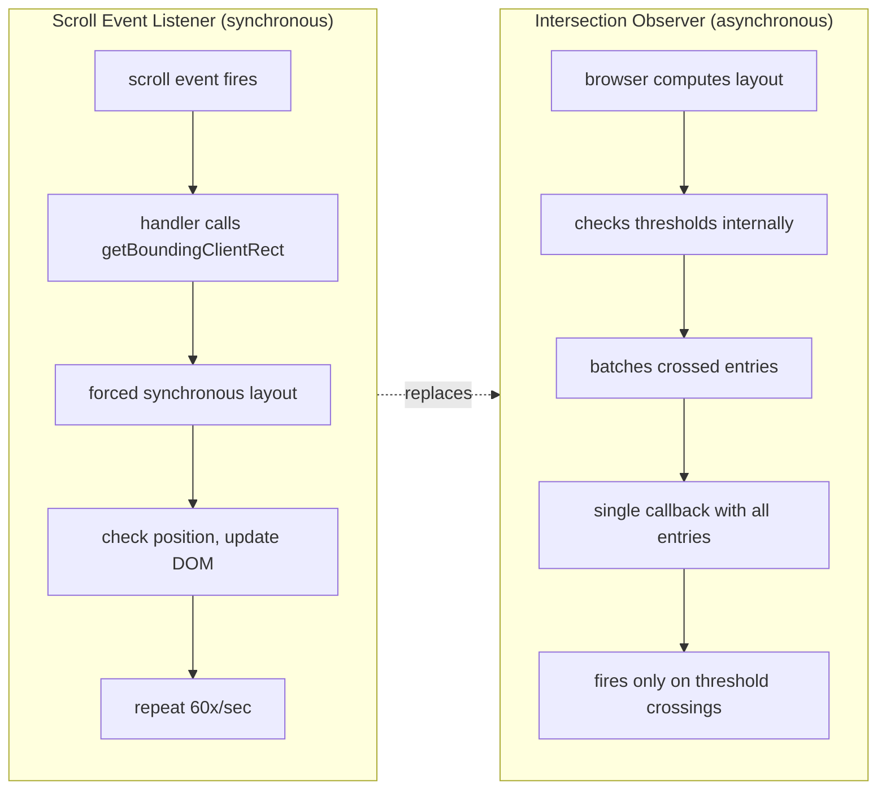

# [FEE-406] Intersection Observer, Resize Observer & Mutation Observer

:::info
The browser platform provides three Observer APIs that replace imperative, synchronous event listeners with declarative, asynchronous callbacks for monitoring DOM changes. Intersection Observer detects when elements enter or leave the viewport (or a scrollable ancestor), enabling lazy loading, infinite scroll, and animation triggers without scroll listeners. Resize Observer reports element size changes independent of the viewport, enabling truly responsive components and container-aware layouts. Mutation Observer watches DOM tree mutations -- child additions, attribute changes, text edits -- enabling safe monitoring of third-party code and dynamic content. All three share a common pattern: construct an observer, call `observe()` on target elements, react in a batched callback, and `disconnect()` when done. Understanding these APIs is essential for building performant, jank-free web applications.
:::

## Context

Before the Observer APIs existed, developers relied on event listeners attached to `scroll`, `resize`, and DOM Mutation Events to detect changes. Each approach had serious performance problems:

**Scroll listeners** fire synchronously on every scroll event -- potentially 60+ times per second during a single scroll gesture. Each handler invocation typically calls `getBoundingClientRect()` or `offsetTop`, forcing the browser to perform synchronous layout recalculation (layout thrashing). A page with 50 lazy-loaded images each checking their position on every scroll event creates hundreds of forced layouts per second.

**Resize listeners** on `window` have the same problem: they fire synchronously and frequently during drag-resize or orientation changes. Worse, there was no way to observe individual element size changes at all -- `window.onresize` only fires when the browser viewport changes, not when a flex container redistributes space or a sidebar collapses.

**DOM Mutation Events** (`DOMNodeInserted`, `DOMSubtreeModified`, `DOMAttrModified`) were deprecated in DOM Level 3 because they fire synchronously in the middle of DOM operations, causing severe performance degradation and preventing browser optimization of batch DOM mutations. They also bubble, meaning a single mutation deep in the tree could trigger handlers on every ancestor.

The Observer APIs solve these problems with a shared architectural approach:

| Property | Event Listeners | Observers |
|----------|----------------|-----------|
| Timing | Synchronous, fires every occurrence | Asynchronous, batched before repaint |
| Frequency | Every scroll/resize frame (~60/s) | Only on threshold crossings or actual changes |
| Layout | Often forces synchronous layout | Browser computes intersection/size internally |
| Lifecycle | Manual add/remove on elements | `observe()` / `unobserve()` / `disconnect()` |
| Scope | Global events (`window.onscroll`) | Per-element observation |

All three observers deliver their notifications as batched arrays of entry objects, processed in a single callback invocation before the next paint. This design eliminates forced layouts, reduces callback frequency, and gives the browser freedom to optimize delivery timing.

## Scenario

You are building an analytics feature that records how far users scroll and which sections they read. Polling `scrollTop` on a scroll event fires hundreds of times per second and forces layout recalculation each call. `IntersectionObserver` fires a callback only when a tracked element enters or exits the viewport, at a fraction of the cost. Replacing the scroll-event polling with IntersectionObserver means the analytics feature records section visibility accurately without degrading page performance under heavy scroll activity.

## Design Thinking

### From imperative listeners to declarative observers

The evolution follows a clear pattern: **imperative polling** to **declarative observation** to **framework abstraction**.

**Phase 1 -- Imperative listeners.** Developers attach `scroll` or `resize` handlers, manually query element geometry (`getBoundingClientRect()`), compare against viewport bounds, and trigger side effects. This requires throttle/debounce wrappers, manual bookkeeping of observed elements, and careful cleanup. The code is brittle -- changing a scroll container or adding an element means updating the listener logic.

**Phase 2 -- Declarative observers.** The Observer APIs invert control. Instead of asking "where is this element?" on every frame, you tell the browser "notify me when this element crosses these thresholds." The browser owns the geometry computation, batches notifications, and delivers them asynchronously. This eliminates layout thrashing and dramatically simplifies the code.

**Phase 3 -- Framework hooks.** Libraries wrap observers in reactive primitives:

- **React**: `react-intersection-observer` provides `useInView()` returning `{ ref, inView, entry }`. The hook manages observer lifecycle (create on mount, disconnect on unmount) automatically. `usehooks-ts` provides `useIntersectionObserver` with similar ergonomics.
- **Vue**: VueUse offers `useIntersectionObserver()` and `useResizeObserver()` composables that integrate with Vue's reactivity system and handle cleanup via `onUnmounted`.
- **Framework image components**: Next.js `Image` and Nuxt `NuxtImg` use Intersection Observer internally for lazy loading. They handle placeholder display, progressive loading, and observer cleanup transparently.
- **Virtual scrolling**: Libraries like TanStack Virtual use Resize Observer to measure row heights and Intersection Observer to determine which rows are visible, rendering only the visible subset of a large list.

This progression -- from manual scroll listeners to browser-native observers to declarative hooks -- mirrors the broader frontend evolution toward letting the platform handle low-level concerns while application code expresses intent.

### Why observers are async and batched

Observers are deliberately asynchronous for a structural reason: synchronous notification during layout or scroll would force the browser to interrupt its rendering pipeline, deliver the callback (which might mutate the DOM), then restart layout from scratch. This is exactly what made Mutation Events unusable.

Instead, observer callbacks are scheduled as microtask-like deliveries between layout computation and the next paint. The browser:

1. Performs layout and computes element geometry.
2. Checks all registered observers against their thresholds.
3. Collects entries for all elements that crossed a threshold since the last check.
4. Delivers all entries in a single callback invocation.
5. Proceeds to paint.

This means an Intersection Observer monitoring 100 elements produces at most one callback invocation per frame, regardless of how many elements changed. The callback receives an array of `IntersectionObserverEntry` objects, one per changed element.

### Choosing the right observer

| Need | Observer | Why |
|------|----------|-----|
| Element enters/leaves viewport | Intersection Observer | Threshold-based visibility detection |
| Element size changes (not viewport) | Resize Observer | Per-element size tracking, independent of window resize |
| DOM structure or attribute changes | Mutation Observer | Watches childList, attributes, characterData |
| Window viewport size change | `window.onresize` or `visualViewport` | IO/RO track elements, not the viewport itself |

## Best Practices

**Always disconnect observers when the component or widget is torn down.** Observers hold strong references to their callback closures and all observed elements. In single-page applications, failing to call `disconnect()` on route change means the observer, its closure, and every captured variable survive indefinitely. MUST call `observer.disconnect()` in React `useEffect` cleanup, Vue `onUnmounted`, or an equivalent destructor.

**Use an array of thresholds with `IntersectionObserver` when you need granular visibility tracking.** The default `threshold: 0` fires only when the element boundary is first crossed and does not re-fire as the element becomes more visible. SHOULD specify `threshold: [0, 0.25, 0.5, 0.75, 1.0]` (or a custom set) for progress indicators, ad-impression measurement, or animation sequencing that depends on how much of the element is visible.

**Prefer `ResizeObserver` over `window.resize` for element-level size tracking.** `window.onresize` fires only when the browser viewport changes — it does not detect a flex container redistributing space, a sidebar toggling, or a parent element resizing due to dynamic content. SHOULD use `ResizeObserver` any time the component must respond to its own container size rather than the global viewport.

**AVOID attaching `MutationObserver` with `{ subtree: true, attributes: true }` to a large or high-churn subtree without filtering.** Observing `document.body` with those options in a complex application can generate thousands of `MutationRecord` objects per frame, overwhelming the callback and defeating the performance advantage over legacy Mutation Events. SHOULD scope observation to the smallest possible root element and use `attributeFilter` to limit attribute observation to only the specific names your code cares about.

## Visual



**Reading the diagram:** The left path shows how scroll-based visibility detection works: every scroll event fires a synchronous handler that forces layout recalculation. The right path shows how Intersection Observer achieves the same result: the browser checks thresholds during its own layout pass and delivers batched notifications asynchronously. The Observer path eliminates forced layouts and reduces callback frequency from ~60/s to only threshold-crossing moments.

## Example

### 1. Intersection Observer -- lazy loading images

```js
// Lazy load images when they enter the viewport
// Uses rootMargin to start loading 200px before visible
const lazyObserver = new IntersectionObserver(
  (entries) => {
    for (const entry of entries) {
      if (entry.isIntersecting) {
        const img = entry.target;
        img.src = img.dataset.src;
        img.removeAttribute('data-src');
        // Stop observing once loaded -- one-time operation
        lazyObserver.unobserve(img);
      }
    }
  },
  {
    rootMargin: '200px 0px', // Start loading 200px before viewport
    threshold: 0,            // Trigger as soon as any pixel enters
  }
);

// Observe all images with data-src attribute
document.querySelectorAll('img[data-src]').forEach((img) => {
  lazyObserver.observe(img);
});

// Note: for simple cases, native loading="lazy" is preferred.
// IO is valuable when you need custom behavior: transitions,
// analytics tracking, or pre-loading adjacent images.
```

### 2. Resize Observer -- responsive component

```js
// A chart component that redraws when its container resizes.
// This works regardless of WHY the container resized --
// viewport change, sidebar toggle, or flex redistribution.
class ResponsiveChart {
  constructor(container) {
    this.container = container;
    this.canvas = container.querySelector('canvas');
    this.resizeObserver = new ResizeObserver((entries) => {
      // entries is always an array; we observe one element
      const entry = entries[0];
      const { inlineSize: width, blockSize: height } =
        entry.contentBoxSize[0];

      // Only redraw if size actually changed meaningfully
      if (
        Math.abs(width - this.lastWidth) > 1 ||
        Math.abs(height - this.lastHeight) > 1
      ) {
        this.canvas.width = width * devicePixelRatio;
        this.canvas.height = height * devicePixelRatio;
        this.lastWidth = width;
        this.lastHeight = height;
        this.draw();
      }
    });

    this.lastWidth = 0;
    this.lastHeight = 0;
    this.resizeObserver.observe(container);
  }

  draw() {
    const ctx = this.canvas.getContext('2d');
    // ... chart drawing logic
  }

  destroy() {
    this.resizeObserver.disconnect();
  }
}
```

### 3. Mutation Observer -- monitoring third-party DOM changes

```js
// Watch for DOM changes injected by third-party scripts
// (ads, chat widgets, analytics) and enforce constraints
const thirdPartyContainer = document.getElementById('ad-slot');

const mutationObserver = new MutationObserver((mutations) => {
  for (const mutation of mutations) {
    if (mutation.type === 'childList') {
      // Check for unwanted elements injected by third-party code
      for (const node of mutation.addedNodes) {
        if (node.nodeType === Node.ELEMENT_NODE) {
          // Remove injected iframes that escape the container
          if (
            node.tagName === 'IFRAME' &&
            node.style.position === 'fixed'
          ) {
            node.remove();
            console.warn('Blocked breakout iframe from ad slot');
          }
        }
      }
    }

    if (mutation.type === 'attributes') {
      // Prevent third-party code from modifying critical attributes
      if (mutation.attributeName === 'style') {
        const el = mutation.target;
        // Enforce max height on ad container
        if (parseInt(el.style.height) > 300) {
          el.style.height = '300px';
        }
      }
    }
  }
});

mutationObserver.observe(thirdPartyContainer, {
  childList: true,
  attributes: true,
  subtree: true,
  attributeFilter: ['style', 'class'],
});

// Disconnect when the container is removed from the page
// (e.g., route change in SPA)
function cleanup() {
  mutationObserver.disconnect();
}
```

## Common Mistakes

### 1. Using scroll listeners when Intersection Observer exists

Scroll listeners force synchronous layout on every frame. If you are checking whether an element is visible, use Intersection Observer instead:

```js
// WRONG: Forces layout recalculation ~60 times per second
window.addEventListener('scroll', () => {
  const rect = element.getBoundingClientRect();
  if (rect.top < window.innerHeight && rect.bottom > 0) {
    loadContent();
  }
});

// CORRECT: Async, batched, no forced layout
const observer = new IntersectionObserver(([entry]) => {
  if (entry.isIntersecting) {
    loadContent();
    observer.unobserve(entry.target);
  }
});
observer.observe(element);
```

### 2. Intersection Observer threshold=0 missing elements already in viewport on mount

When an observer is created with `threshold: 0` (the default), it fires when an element **crosses** the threshold boundary. Elements that are already fully within the viewport when observation begins do receive an initial entry -- but if you delay observation (e.g., after an async operation), you may miss the initial intersection. Additionally, `threshold: 0` means the callback fires when any single pixel intersects; it does not fire again as the element becomes more visible:

```js
// PROBLEM: Only notified at 0% crossing, not when element
// is partially or fully visible
const observer = new IntersectionObserver(callback, {
  threshold: 0, // Fires once at boundary crossing
});

// BETTER: Use multiple thresholds to track visibility progression
const observer = new IntersectionObserver(callback, {
  threshold: [0, 0.25, 0.5, 0.75, 1.0],
});

// Or for one-shot detection, ensure observation starts synchronously
// during component mount, before the first paint
```

### 3. Resize Observer loop error from modifying observed elements in callback

If a Resize Observer callback changes the size of the element it is observing, it triggers another observation, creating an infinite loop. The browser breaks the loop by delivering an error event (`ResizeObserver loop completed with undelivered notifications`) and skipping the re-triggered entries:

```js
// WRONG: Causes ResizeObserver loop error
const ro = new ResizeObserver((entries) => {
  for (const entry of entries) {
    // This changes the element's size, triggering another callback
    entry.target.style.width =
      entry.contentBoxSize[0].inlineSize + 10 + 'px';
  }
});

// CORRECT: Track expected size to break the cycle
const expectedSizes = new WeakMap();
const ro = new ResizeObserver((entries) => {
  for (const entry of entries) {
    const currentWidth = entry.contentBoxSize[0].inlineSize;
    if (currentWidth === expectedSizes.get(entry.target)) {
      continue; // Already at expected size, skip
    }
    const newWidth = currentWidth + 10;
    entry.target.style.width = newWidth + 'px';
    expectedSizes.set(entry.target, newWidth);
  }
});
```

## Related FEEs

| FEE | Relationship |
|-----|-------------|
| [FEE-400 Browser APIs & Web Platform Overview](./400.md) | Parent category. Observers build on the event loop and rendering pipeline described in FEE-400. |
| [FEE-401 DOM Manipulation & Traversal](./401.md) | Mutation Observer monitors DOM changes made by the techniques in FEE-401. Intersection and Resize Observers query element geometry managed by the DOM. |
| [FEE-301 Async Patterns & Promises](../JavaScript%20Core%20and%20Runtime/301.md) | Observer callbacks are asynchronous. Framework hooks wrap observers in Promise-like or reactive patterns covered in FEE-301. |
| [FEE-306 Memory Management & GC](../JavaScript%20Core%20and%20Runtime/306.md) | Failing to disconnect observers creates memory leaks. Observer lifecycle management directly relates to GC and closure retention discussed in FEE-306. |

## References

- [W3C Intersection Observer Specification](https://www.w3.org/TR/intersection-observer/) -- Normative specification defining thresholds, rootMargin, and async delivery semantics
- [W3C Resize Observer Specification](https://www.w3.org/TR/resize-observer-1/) -- Normative specification defining observation model and box options
- [WHATWG DOM: MutationObserver](https://dom.spec.whatwg.org/#interface-mutationobserver) -- Normative specification for MutationObserver interface and MutationRecord
- [MDN: Intersection Observer API](https://developer.mozilla.org/en-US/docs/Web/API/Intersection_Observer_API) -- Comprehensive API reference with examples
- [MDN: ResizeObserver](https://developer.mozilla.org/en-US/docs/Web/API/ResizeObserver) -- API reference covering borderBoxSize, contentBoxSize, and loop errors
- [MDN: MutationObserver](https://developer.mozilla.org/en-US/docs/Web/API/MutationObserver) -- API reference with observe options and MutationRecord details
- [web.dev: Lazy Loading Images and Video](https://web.dev/articles/browser-level-image-lazy-loading) -- Best practices for image lazy loading with native and IO approaches
- [VueUse: useIntersectionObserver](https://vueuse.org/core/useintersectionobserver/) -- Vue composable wrapping Intersection Observer
- [react-intersection-observer (GitHub)](https://github.com/thebuilder/react-intersection-observer) -- React hooks for Intersection Observer with `useInView`
