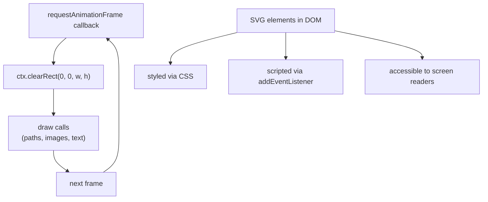

# [FEE-407] Canvas 2D & SVG

:::info
The browser provides two fundamentally different approaches to graphics rendering: the Canvas 2D API and Scalable Vector Graphics (SVG). Canvas is an imperative, pixel-based drawing surface — you issue JavaScript drawing commands and the browser composites them into a bitmap. SVG is a declarative, DOM-integrated vector format — shapes are XML elements that the browser renders, styles, and exposes to assistive technologies. Neither is universally superior. They solve different problems, and choosing the right tool requires understanding the trade-offs between rendering model, accessibility, performance characteristics, and developer ergonomics.
:::

## Introduction

The `<canvas>` element exposes a raw pixel buffer that JavaScript controls entirely through a context object. Once you obtain a `CanvasRenderingContext2D` via `canvas.getContext('2d')`, you have access to an API covering paths, rectangles, arcs, text, images, gradients, and pixel-level `ImageData` manipulation. The browser renders whatever you draw, retains nothing about it in the DOM, and provides no built-in hit-testing or accessibility tree integration. This simplicity is both a strength and a limitation: Canvas can sustain 60 fps animation loops without DOM overhead, but it cannot express semantics, respond to CSS changes, or be queried by screen readers without extra manual work.

SVG lives in the DOM. A circle drawn as `<circle cx="100" cy="100" r="40" />` is a real DOM node with a computed style, a bounding box, event listeners, ARIA attributes, and full CSS inheritance. Designers can style it with a stylesheet. Developers can manipulate it with `querySelector`. Screen readers announce it through the accessibility tree. Browsers scale SVG to any resolution without loss because the renderer recalculates paths at the target DPI on every repaint — there is no rasterization step until the final composite. This makes SVG ideal for icons, illustrations, and data visualizations where fidelity and accessibility matter more than throughput.

Understanding when to reach for each technology — and how to use each correctly — is a core frontend engineering competency. The most common error is treating Canvas as a default graphics tool when SVG would have been half the code with better accessibility. The second most common error is using Canvas on high-DPI screens without correcting for `devicePixelRatio`, producing blurry output that undermines the effort invested in pixel-perfect design. This article covers both technologies from first principles, including the `OffscreenCanvas` API for moving rendering off the main thread entirely.

## Principle

The Canvas API provides an imperative, pixel-based drawing surface driven entirely by JavaScript — the DOM has no knowledge of what is drawn inside it. SVG provides a declarative, DOM-integrated vector format where every shape is an accessible, styleable, scriptable element. Teams MUST scale the canvas element by `window.devicePixelRatio` and apply an inverse CSS size — omitting this produces blurry output on high-DPI displays. Teams SHOULD use SVG for icons, charts, and interactive diagrams where accessibility and scalability matter; teams SHOULD use Canvas for real-time animation, image processing, and pixel-level manipulation where DOM overhead would degrade performance.

The distinction between the two rendering models has architectural consequences. Canvas treats every frame as a blank slate: you clear, redraw, and repeat. The browser never caches what you drew; it knows only the current pixel values of the buffer. SVG treats every frame as a retained scene graph: the browser owns the element tree, re-renders affected regions on attribute or style changes, and automatically invalidates only the dirty area. Retained-mode rendering is cheaper for sparse updates; immediate-mode rendering is cheaper for full-scene redraws. Teams MUST understand which update pattern their use case demands before committing to a rendering technology.

## Design Thinking

### Immediate mode versus retained mode

Canvas uses an **immediate-mode** rendering model: your code is the scene graph. You issue a sequence of drawing commands — `beginPath()`, `arc()`, `fill()`, `drawImage()` — and the browser executes them in order, writing pixels into the backing buffer. When the frame is done, the browser composites the buffer onto the screen. On the next frame you start over, clearing the buffer and redrawing everything from scratch. There is no undo, no "change the circle's color" — to update something you repaint the affected region or the entire canvas.

SVG uses a **retained-mode** model: the browser owns the scene graph as a live DOM tree. When you change `circle.setAttribute('fill', '#ef4444')`, the browser marks that element's render region dirty and schedules a repaint of only that region. You never touch pixels directly. This is ergonomically simpler for sparse, interactive scenes — hover states, click feedback, tooltip positions — but it scales poorly when every element animates every frame, because all those DOM attribute changes, style recalculations, and paint invalidations add up faster than a single clearRect + redraw cycle.

### Choosing the right tool

The decision is not about which technology is "better" but about which rendering model fits the update pattern of the use case:

| Use case | Canvas 2D | SVG |
|---|---|---|
| Real-time animation (60 fps game loop) | Yes | No |
| Pixel manipulation (filters, image editing) | Yes | No |
| Scalable icons and illustrations | No | Yes |
| Interactive diagram (nodes, edges, hover) | Either | Prefer SVG |
| Accessible chart with screen reader labels | No | Yes |
| Off-main-thread rendering (Web Worker) | Yes (OffscreenCanvas) | No |

For interactive diagrams, either technology can work. Libraries like D3.js produce SVG, which gives you CSS transitions and DOM events for free. Libraries like Pixi.js use Canvas (or WebGL), which scales to thousands of animated nodes. The deciding factor is usually how many simultaneously-animating elements the diagram will contain: below a few hundred, SVG's convenience wins; above a few hundred with per-frame motion, Canvas throughput wins.

### The devicePixelRatio problem

Every Canvas project on a modern display must handle high-DPI (Retina, HiDPI) screens. A CSS pixel is an abstraction. On a MacBook Pro with a 2x Retina display, one CSS pixel corresponds to 4 physical pixels (2 × 2). If you set `canvas.width = 400` and `canvas.height = 300` in CSS but also set `canvas.width = 400` in the canvas element's intrinsic size, the browser stretches the 400-pixel buffer to fill the 800-physical-pixel area, blurring every line and text.

The correct approach is to query `window.devicePixelRatio` (typically 2 on Retina, 3 on high-end mobile), set the canvas intrinsic size to `CSS size × dpr`, and then call `ctx.scale(dpr, dpr)` so that all drawing coordinates continue to use CSS pixel units. The CSS `width` and `height` keep the canvas at its intended visual size. This must be repeated whenever the canvas is resized — including window resize events — because users can drag windows between displays with different pixel densities.

### OffscreenCanvas and Web Workers

The main thread is shared between JavaScript execution, style calculation, layout, paint, and compositing. A Canvas animation loop that takes longer than 16 ms per frame (for 60 fps) will cause jank, because it delays all other main-thread work. `OffscreenCanvas` transfers control of the canvas pixel buffer to a Web Worker, where rendering runs on a separate thread. The main thread is free to handle user input and run application logic without competing with draw calls.

`transferControlToOffscreen()` returns an `OffscreenCanvas` object that can be posted to a worker via `postMessage` with a transfer list. Inside the worker, the `OffscreenCanvas` exposes the same `getContext('2d')` API as a regular canvas, so existing drawing code requires minimal changes. This is a significant architectural option for compute-heavy visualizations and games. Teams SHOULD consider OffscreenCanvas whenever the Canvas animation loop is measured as a main-thread bottleneck.

## Best Practices

**Always correct for devicePixelRatio on canvas setup.** Obtain `window.devicePixelRatio ?? 1`, multiply the canvas intrinsic width and height by this factor, keep the CSS size unchanged, and call `ctx.scale(dpr, dpr)`. Attach a `ResizeObserver` (or at minimum a `resize` window listener) that re-runs this setup when the canvas's CSS size changes. Failing to do this produces blurry output on every Retina and HiDPI display — the majority of modern laptops, phones, and high-end monitors.

**Clear the canvas before each frame in animation loops.** Call `ctx.clearRect(0, 0, width, height)` as the first operation of every frame callback. Drawing on top of the previous frame's pixels without clearing them causes "ghosting" — the motion trails of previous positions remain visible, creating smearing artifacts. `clearRect` is inexpensive: it fills a rectangular region with transparent black without triggering any path-rasterization work.

**Cancel animation loops on component unmount.** `requestAnimationFrame` returns a numeric ID. Store it in a variable accessible to the cleanup path. When the component unmounts (React's `useEffect` cleanup, Vue's `onUnmounted`, or a manual teardown function), call `cancelAnimationFrame(id)`. An uncancelled loop continues executing indefinitely, holding a reference to the canvas context, the component's closure variables, and any associated state. This causes memory leaks and wastes CPU cycles on invisible rendering.

**Use SVG for static and semi-static graphics that need accessibility.** If a chart does not animate every frame — a bar chart, a pie chart, a node-link diagram with occasional hover states — SVG is almost always the better choice. Every `<rect>`, `<path>`, and `<text>` element can carry `aria-label`, `role`, and `tabindex` attributes. Screen readers enumerate them. Keyboard users can navigate them. CSS transitions animate them without JavaScript. Producing an equivalent accessible Canvas graphic requires manually maintaining a hit map, a focus ring, and ARIA live regions — significant additional code that SVG provides for free.

**Use `ImageData` for pixel-level operations, not CSS filters.** When you need to apply image processing effects (grayscale, sepia, threshold, blur) to a specific region of canvas content, `ctx.getImageData()` gives you a flat `Uint8ClampedArray` of RGBA values that you can manipulate in a loop. After processing, `ctx.putImageData()` writes the modified pixels back. This approach is synchronous and blocks the main thread for large images — consider moving pixel processing into a Web Worker using `OffscreenCanvas` or an `ImageBitmap` transferred via `postMessage`.

**Keep SVG viewBox and coordinate systems explicit.** Always define a `viewBox` attribute on SVG elements: `viewBox="0 0 200 200"` establishes the internal coordinate system independently of the rendered size. This makes SVG files portable — a designer can author in 200×200 units and the SVG renders correctly at any CSS size. Without a `viewBox`, SVG uses intrinsic pixel dimensions, which prevents fluid scaling.

**Prefer `<use>` and `<symbol>` for reusable SVG shapes.** Define shape templates inside a `<defs>` block as `<symbol>` elements with `id` attributes. Reference them via `<use href="#symbol-id" />`. This reduces DOM node count for repeated elements (icons in a list, repeated chart markers) and allows a single attribute change on the symbol to propagate to all instances.

**Batch canvas draw calls to minimize state changes.** Every change to `ctx.fillStyle`, `ctx.strokeStyle`, `ctx.font`, or `ctx.globalAlpha` has a cost. If you are drawing hundreds of shapes of the same color, group all shapes of one color together and issue a single `ctx.fillStyle = color` before the batch, rather than toggling it per shape. Similarly, construct a single `Path2D` object that aggregates many subpaths and call `ctx.fill(path)` once, rather than calling `beginPath()` / `fill()` in a tight loop. Path2D objects can also be cached and reused across frames when the geometry does not change.

**Avoid reading pixel data on the hot path.** `getImageData` and `toDataURL` both force the browser to flush the GPU pipeline and read back pixel data from the GPU to the CPU, which can take several milliseconds. Calling either inside a `requestAnimationFrame` loop will drop frames. Reserve `getImageData` for one-shot operations (export, filter application, hit detection on complex paths) triggered by user events, not for per-frame queries. If you need to test whether the mouse cursor is over a drawn shape, maintain a parallel CPU-side representation of your shapes and perform the hit test in JavaScript geometry code rather than reading pixels.

## Mermaid Diagram



The left loop illustrates the Canvas immediate-mode rendering cycle: every frame starts with a clear, followed by all draw calls, then yielding back to the browser which schedules the next frame. The right subgraph shows SVG's retained-mode architecture: elements persist in the DOM, receive style from CSS, respond to JavaScript events, and are automatically represented in the accessibility tree — with no per-frame redraw loop required unless you animate attributes explicitly via JavaScript or CSS.

The two subgraphs are deliberately disconnected: there is no arrow between the Canvas loop and the SVG section. This mirrors their relationship in practice — Canvas and SVG are independent rendering systems within the same HTML document. You can embed an SVG element next to a canvas element, combine Canvas-rendered textures with SVG overlays (using absolutely-positioned layers), or replace one with the other as requirements evolve, because they share the same CSS layout model and JavaScript event system but have entirely separate rendering pipelines.

## Example

### Overview

The following examples build up from initial canvas setup, through animation, pixel processing, off-thread rendering, and SVG interaction. Each snippet is self-contained enough to copy into a project, but they share the same `canvas` and `ctx` variables from the setup step. Read them in order on first pass.

### HTML: canvas element with CSS sizing

```html
<!-- index.html: canvas with devicePixelRatio correction -->
<canvas id="c"></canvas>
<style>
  #c { width: 400px; height: 300px; }
</style>
```

The `<canvas>` element has no intrinsic size set in HTML — that is intentional. The CSS fixes the visual size at 400×300 px. The TypeScript code below sets the actual pixel buffer size dynamically, accounting for the device pixel ratio.

### TypeScript: high-DPI canvas setup

```ts
// canvas-setup.ts — correct high-DPI scaling
const canvas = document.getElementById('c') as HTMLCanvasElement;
const ctx = canvas.getContext('2d')!;

function resizeCanvas() {
  const dpr = window.devicePixelRatio ?? 1;
  const rect = canvas.getBoundingClientRect();
  // Physical pixels — must match CSS size × dpr
  canvas.width = rect.width * dpr;
  canvas.height = rect.height * dpr;
  // Scale all drawing operations to match CSS size
  ctx.scale(dpr, dpr);
}
resizeCanvas();
window.addEventListener('resize', resizeCanvas);
```

`getBoundingClientRect()` returns the CSS layout size of the canvas — what the browser has allocated after applying the stylesheet. Multiplying by `devicePixelRatio` gives the number of physical pixels that area occupies. Setting `canvas.width` and `canvas.height` to these values creates a buffer with exactly the right resolution. Importantly, reassigning `canvas.width` or `canvas.height` automatically resets the entire canvas context state — including the transform matrix — to its default values. This is why calling `ctx.scale(dpr, dpr)` after each resize is both necessary and safe: the reset guarantees a clean baseline, so the scale factor never accumulates across multiple resize events. The subsequent `ctx.scale(dpr, dpr)` maps all drawing coordinates from CSS pixels back to physical pixels, so code that draws at `(100, 75)` still hits the visually correct position.

### TypeScript: animation loop with requestAnimationFrame

```ts
// animation-loop.ts — bouncing circle with requestAnimationFrame
interface Circle {
  x: number;
  y: number;
  vx: number;
  vy: number;
  radius: number;
}

const circle: Circle = { x: 200, y: 150, vx: 3, vy: 2, radius: 20 };
let rafId: number;

function draw(timestamp: number) {
  const { width, height } = canvas.getBoundingClientRect();

  ctx.clearRect(0, 0, width, height);

  // Update position
  circle.x += circle.vx;
  circle.y += circle.vy;

  // Bounce off walls
  if (circle.x + circle.radius > width || circle.x - circle.radius < 0) circle.vx *= -1;
  if (circle.y + circle.radius > height || circle.y - circle.radius < 0) circle.vy *= -1;

  // Draw circle
  ctx.beginPath();
  ctx.arc(circle.x, circle.y, circle.radius, 0, Math.PI * 2);
  ctx.fillStyle = '#3b82f6';
  ctx.fill();

  rafId = requestAnimationFrame(draw);
}

rafId = requestAnimationFrame(draw);

// Cleanup — call this on component unmount
function stopAnimation() {
  cancelAnimationFrame(rafId);
}
```

`requestAnimationFrame` schedules `draw` to run before the browser's next repaint, synchronized to the display refresh rate (typically 60 fps, up to 120 fps on ProMotion displays). The `timestamp` parameter is a `DOMHighResTimeStamp` that can be used to calculate delta time for frame-rate-independent movement — this example uses a fixed velocity for simplicity. `stopAnimation` must be called when the canvas leaves the screen; without it, the `draw` callback continues running even when nothing is visible.

### TypeScript: pixel-level grayscale filter

```ts
// pixel-filter.ts — grayscale filter using ImageData
function applyGrayscale(canvas: HTMLCanvasElement, ctx: CanvasRenderingContext2D) {
  const imageData = ctx.getImageData(0, 0, canvas.width, canvas.height);
  const data = imageData.data; // Uint8ClampedArray: [R,G,B,A, R,G,B,A, ...]

  for (let i = 0; i < data.length; i += 4) {
    const avg = (data[i] + data[i + 1] + data[i + 2]) / 3;
    data[i] = avg;     // R
    data[i + 1] = avg; // G
    data[i + 2] = avg; // B
    // data[i + 3] = alpha — unchanged
  }

  ctx.putImageData(imageData, 0, 0);
}
```

`getImageData` returns an `ImageData` object whose `.data` property is a `Uint8ClampedArray` — a typed array of 8-bit unsigned integers clamped to [0, 255]. Each pixel occupies four consecutive elements: R, G, B, A. The loop processes one pixel per iteration, computing the arithmetic mean of the three color channels and assigning it back to all three, which desaturates the pixel to a neutral gray. `putImageData` writes the modified buffer back to the canvas. Note that `getImageData` reads physical pixels (the full `canvas.width × canvas.height` buffer), not CSS pixels.

The formula `(R + G + B) / 3` is a simplified average used here for clarity. For perceptually accurate grayscale, use a luminance-weighted formula such as `0.299*R + 0.587*G + 0.114*B` (ITU-R BT.601), which matches how the human eye weighs the contribution of each color channel.

### TypeScript: transferring canvas to a Web Worker

```ts
// offscreen-canvas.ts — transfer canvas to Web Worker
const offscreen = canvas.transferControlToOffscreen();
const worker = new Worker('./render-worker.ts', { type: 'module' });
worker.postMessage({ canvas: offscreen }, [offscreen]);
```

`transferControlToOffscreen()` detaches the canvas from the main thread. After the call, any attempt to call `canvas.getContext('2d')` on the original element throws an exception — control has been transferred. The `offscreen` object is posted to the worker as a transferable (the second argument to `postMessage`), meaning it is moved rather than copied. There is no serialization overhead.

```ts
// render-worker.ts — runs in Web Worker, no main thread impact
self.onmessage = (e: MessageEvent<{ canvas: OffscreenCanvas }>) => {
  const ctx = e.data.canvas.getContext('2d')!;
  // Draw inside worker — identical Canvas 2D API
  ctx.fillStyle = '#ef4444';
  ctx.fillRect(10, 10, 100, 100);
};
```

Inside the worker, `OffscreenCanvas.getContext('2d')` returns a `OffscreenCanvasRenderingContext2D` that implements the full Canvas 2D API. Existing drawing code can be moved to the worker with minimal changes. The browser composites the worker's output to the screen automatically. Because the worker runs on a separate OS thread, long draw operations do not block user input on the main thread.

### SVG: interactive element with JavaScript event handling

```svg
<!-- interactive-svg.svg — SVG with hover and script -->
<svg width="200" height="200" xmlns="http://www.w3.org/2000/svg"
     aria-label="Interactive circle">
  <circle id="dot" cx="100" cy="100" r="40" fill="#3b82f6"
          role="button" tabindex="0" aria-label="Toggle circle color" />
</svg>
```

```ts
// svg-interaction.ts
const dot = document.getElementById('dot') as SVGCircleElement;
dot.addEventListener('mouseenter', () => dot.setAttribute('fill', '#ef4444'));
dot.addEventListener('mouseleave', () => dot.setAttribute('fill', '#3b82f6'));
dot.addEventListener('keydown', (e: KeyboardEvent) => {
  if (e.key === 'Enter' || e.key === ' ') {
    const current = dot.getAttribute('fill');
    dot.setAttribute('fill', current === '#ef4444' ? '#3b82f6' : '#ef4444');
  }
});
```

The SVG element is a standard DOM node. `getElementById` finds it, `addEventListener` attaches event handlers, and `setAttribute` updates its presentation attribute — the browser schedules a repaint of only the affected region.

Note the accessibility pattern used here: `role="img"` is intentionally omitted from the `<svg>` container. Placing `role="img"` on the container hides all child elements from the accessibility tree, which would make the interactive circle invisible to assistive technologies. Instead, `role="button"` and `tabindex="0"` are placed on the `<circle>` element itself, making it a focusable, operable interactive control. The keyboard handler responds to `Enter` and `Space` to match the expected behavior of a button. This approach correctly exposes the interactive element to the accessibility tree while keeping the SVG container as a neutral landmark.

## Browser Support and Compatibility

Canvas 2D has universal browser support and has been stable since Internet Explorer 9. The `OffscreenCanvas` API reached baseline availability across Chrome, Firefox, and Safari in 2023 (Safari 16.4). Before that, `transferControlToOffscreen()` was Chrome-only. Teams targeting older Safari versions MUST feature-detect before using OffscreenCanvas:

```ts
if ('OffscreenCanvas' in globalThis) {
  const offscreen = canvas.transferControlToOffscreen();
  // ... start worker
} else {
  // Fall back to main-thread rendering
  startMainThreadLoop(canvas);
}
```

SVG has full cross-browser support. The `<use>` element with external `href` references (linking to a separate `.svg` file rather than an inline `id`) requires CORS-aware server configuration for cross-origin SVG sprites. Inline SVG (embedded directly in the HTML document) avoids this constraint entirely and is the recommended pattern for icon systems.

The `Path2D` API — used for caching and reusing complex paths — is universally supported in all modern browsers. `Path2D` constructors accept SVG path strings (`new Path2D('M 10 10 L 100 100')`), providing a convenient bridge between SVG path notation and Canvas drawing code.

## Common Mistakes

**Skipping `devicePixelRatio` scaling.** This is the most widespread Canvas error. On a 2x Retina display, a canvas drawn without DPR correction renders at half the physical resolution and is stretched to fill the CSS size — every edge is blurry. The fix is always to set `canvas.width = cssWidth * dpr`, `canvas.height = cssHeight * dpr`, and `ctx.scale(dpr, dpr)`. Never omit this on new canvas implementations.

**Not calling `clearRect` before each frame.** The canvas buffer persists between frames. Without clearing, each new draw adds on top of the previous frame's pixels. A moving circle leaves a solid smear across the canvas. Always clear the region being redrawn — use `ctx.clearRect(0, 0, width, height)` for full-canvas animations, or a tighter rect for partial updates.

**Using Canvas for static content that SVG handles better.** A bar chart that updates once on data load, an icon that never changes, a diagram with five interactive nodes — all of these are better served by SVG. SVG requires no manual accessibility work, scales perfectly to any display density, and can be styled with CSS. Choosing Canvas for static or semi-static graphics adds complexity (hit testing, accessibility, DPR handling) without any throughput benefit.

**Forgetting `cancelAnimationFrame` on component unmount.** The `requestAnimationFrame` loop runs indefinitely unless explicitly cancelled. In a single-page application, a component may be mounted and unmounted many times. Each unmount without cancellation leaves an orphaned draw loop holding closure references to the component's state and the canvas context — preventing garbage collection. Always pair `requestAnimationFrame` start with a `cancelAnimationFrame` in the teardown path.

**Mixing CSS transforms with canvas coordinate systems.** Applying `transform: scale(2)` to a canvas element via CSS scales the visual output but does not change `canvas.width`, `canvas.height`, or the internal coordinate space. This produces blurring and coordinate mismatch when you try to map mouse event positions to canvas coordinates using `getBoundingClientRect()`. The correct approach is to keep CSS transforms off the canvas element and instead handle all scaling through the canvas width/height and `ctx.scale()`. If you need to animate the position of the canvas in the layout, wrap it in a container div and apply transforms to the wrapper.

**Creating a new canvas context every render.** `getContext('2d')` is not free. It allocates GPU resources on the first call. Calling it repeatedly in a render function (inside a `requestAnimationFrame` callback, inside a React render function) is wasteful. Store the context in a ref or module-level variable on mount and reuse it throughout the component's lifetime.

## Related FEEs

- [FEE-405: Web Workers & Concurrency](./405.md) — OffscreenCanvas transfers the canvas context to a worker thread
- [FEE-406: Intersection Observer, Resize Observer & Mutation Observer](./406.md) — ResizeObserver for responsive canvas resizing
- [FEE-704: Core Web Vitals & Performance Metrics](../Rendering%20and%20Performance/704.md) — canvas animation and INP

## References

- MDN Canvas API: https://developer.mozilla.org/en-US/docs/Web/API/Canvas_API
- MDN SVG Tutorial: https://developer.mozilla.org/en-US/docs/Web/SVG/Tutorial
- MDN OffscreenCanvas: https://developer.mozilla.org/en-US/docs/Web/API/OffscreenCanvas
- web.dev Canvas performance: https://web.dev/articles/canvas-performance
- HTML Canvas Deep Dive (joshondesign.com): https://joshondesign.com/p/books/canvasdeepdive/title.html
- MDN ImageData: https://developer.mozilla.org/en-US/docs/Web/API/ImageData
- MDN requestAnimationFrame: https://developer.mozilla.org/en-US/docs/Web/API/Window/requestAnimationFrame
