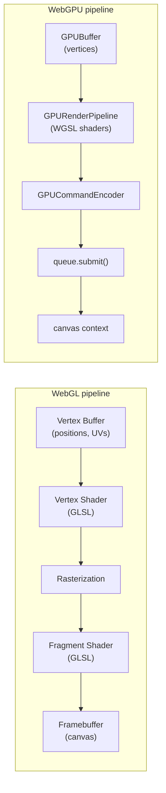

# [FEE-408] WebGL & WebGPU

:::info
WebGL and WebGPU expose the browser's GPU pipeline to JavaScript, enabling hardware-accelerated rendering through programmable shaders. WebGL (based on OpenGL ES) is universally supported; WebGPU (based on Vulkan/Metal/D3D12) is the modern replacement with better performance guarantees and GPU compute support. For most 3D and visual applications, a library like Three.js or Babylon.js should be preferred over these raw APIs.
:::

## Context

The browser's GPU pipeline has evolved through two distinct generations. WebGL, introduced in 2011 and standardised as WebGL 1.0, exposed OpenGL ES 2.0 semantics to JavaScript, giving web applications access to hardware-accelerated 2D and 3D rendering for the first time. WebGL 2 followed in 2017, raising the baseline to OpenGL ES 3.0 and adding features like multiple render targets, transform feedback (capturing a vertex shader's output back into a buffer instead of sending it straight to rasterization), uniform buffer objects, and instanced drawing. WebGL 2 has had universal support across Chrome, Firefox, Safari, and Edge since 2022, making it the safe cross-browser baseline for GPU-accelerated work today.

WebGPU is the modern successor to WebGL. Rather than wrapping an OpenGL ES layer, WebGPU is modelled directly on the lower-level, explicit APIs that power native graphics: Vulkan on Linux and Android, Metal on Apple platforms, and Direct3D 12 on Windows. This gives WebGPU lower CPU overhead, more predictable performance, and first-class support for GPU compute workloads that go beyond rendering. Chrome and Edge shipped WebGPU in Chrome 113 (May 2023). Safari followed in Safari 26 (September 2025), default-on in macOS Tahoe 26, iOS 26, iPadOS 26, and visionOS 26; earlier Safari versions, including 18, never shipped it by default. Firefox has shipped WebGPU default-on since version 141 on Windows (July 2025), version 145 on macOS Tahoe (Apple Silicon), and version 147 broadening macOS coverage to all Apple-Silicon macOS versions, with Linux and Android support still pending as of mid-2026. Taken together, WebGPU is now available in all three major browser engines (Blink, Gecko, WebKit), but it has not reached Baseline — the Web Platform Status dashboard lists it as Limited availability, because Firefox on Linux and Android and Safari before 26 still lack it. A WebGL 2 fallback therefore remains necessary.

Choosing between these APIs, or choosing a library that abstracts them, is the central decision covered by this article. Raw WebGL and WebGPU are powerful but verbose: the roughly 70-line WebGL 2 triangle example below collapses to a handful of calls in Three.js. The right time to reach for the native APIs is when a use case genuinely needs fine-grained GPU pipeline control: custom shaders, GPU compute kernels, tight vertex-layout control, or integration with a rendering pipeline that no library supports. For the vast majority of 3D scene rendering, data visualization, and game development, a library abstraction is the correct starting point.

## Visual



The WebGL pipeline is stateful and imperative: each draw call reads from the currently bound buffer, program, VAO, and framebuffer. The WebGPU pipeline is explicit and object-based: all state is frozen into a `GPURenderPipeline`, commands are recorded into a `GPUCommandEncoder`, and submitted as a batch to the device queue. This design reduces implicit driver state and makes multi-threaded command recording tractable.

## Example

The snippets below demonstrate a minimal colored triangle first in WebGL 2, then in WebGPU, a small compute example, and finally a feature-detect helper that selects the best available context tier.

### WebGL 2 Triangle

```ts
// webgl-triangle.ts — minimal colored triangle in WebGL 2
const canvas = document.getElementById('gl-canvas') as HTMLCanvasElement;
const gl = canvas.getContext('webgl2');
if (!gl) throw new Error('WebGL 2 not supported');

// Vertex shader: receives position attribute, outputs clip-space position
const vertexSource = `#version 300 es
in vec2 a_position;
void main() {
  gl_Position = vec4(a_position, 0.0, 1.0);
}`;

// Fragment shader: outputs a constant blue color
const fragmentSource = `#version 300 es
precision mediump float;
out vec4 outColor;
void main() {
  outColor = vec4(0.23, 0.51, 0.97, 1.0);
}`;

function createShader(gl: WebGL2RenderingContext, type: number, source: string): WebGLShader {
  const shader = gl.createShader(type)!;
  gl.shaderSource(shader, source);
  gl.compileShader(shader);
  if (!gl.getShaderParameter(shader, gl.COMPILE_STATUS)) {
    throw new Error(gl.getShaderInfoLog(shader) ?? 'Shader compile error');
  }
  return shader;
}

function createProgram(gl: WebGL2RenderingContext, vs: WebGLShader, fs: WebGLShader): WebGLProgram {
  const program = gl.createProgram()!;
  gl.attachShader(program, vs);
  gl.attachShader(program, fs);
  gl.linkProgram(program);
  if (!gl.getProgramParameter(program, gl.LINK_STATUS)) {
    throw new Error(gl.getProgramInfoLog(program) ?? 'Program link error');
  }
  return program;
}

const vs = createShader(gl, gl.VERTEX_SHADER, vertexSource);
const fs = createShader(gl, gl.FRAGMENT_SHADER, fragmentSource);
const program = createProgram(gl, vs, fs);

// Triangle vertices in clip space (-1 to 1)
const vertices = new Float32Array([
   0.0,  0.5,  // top
  -0.5, -0.5,  // bottom-left
   0.5, -0.5,  // bottom-right
]);

const vao = gl.createVertexArray()!;
gl.bindVertexArray(vao);

const buffer = gl.createBuffer()!;
gl.bindBuffer(gl.ARRAY_BUFFER, buffer);
gl.bufferData(gl.ARRAY_BUFFER, vertices, gl.STATIC_DRAW);

const positionLoc = gl.getAttribLocation(program, 'a_position');
gl.enableVertexAttribArray(positionLoc);
gl.vertexAttribPointer(positionLoc, 2, gl.FLOAT, false, 0, 0);

// Draw
gl.viewport(0, 0, canvas.width, canvas.height);
gl.clearColor(0, 0, 0, 1);
gl.clear(gl.COLOR_BUFFER_BIT);
gl.useProgram(program);
gl.bindVertexArray(vao);
gl.drawArrays(gl.TRIANGLES, 0, 3);
```

The vertex shader receives a `vec2` position attribute and passes it through to clip space by appending `z=0` and `w=1`. The fragment shader discards the position and outputs a hard-coded RGBA blue. Note the order of the calls: `gl.bindVertexArray(vao)` runs before the buffer is uploaded. That ordering is what records the subsequent `gl.enableVertexAttribArray` and `gl.vertexAttribPointer` calls into the VAO. That recorded attribute state is the whole point of using a VAO: binding it again before drawing restores all of that state in a single call, so the draw call only needs to bind the VAO and program.

### WebGPU Triangle

```ts
// webgpu-triangle.ts — equivalent triangle in WebGPU
async function initWebGPU(canvas: HTMLCanvasElement) {
  if (!navigator.gpu) throw new Error('WebGPU not supported');

  const adapter = await navigator.gpu.requestAdapter();
  if (!adapter) throw new Error('No GPU adapter found');
  const device = await adapter.requestDevice();

  const context = canvas.getContext('webgpu')!;
  const format = navigator.gpu.getPreferredCanvasFormat();
  context.configure({ device, format });

  // WGSL shader: vertex positions hardcoded, fragment outputs blue
  const shaderModule = device.createShaderModule({
    code: `
      @vertex
      fn vs_main(@builtin(vertex_index) idx: u32) -> @builtin(position) vec4f {
        var pos = array<vec2f, 3>(
          vec2f( 0.0,  0.5),
          vec2f(-0.5, -0.5),
          vec2f( 0.5, -0.5),
        );
        return vec4f(pos[idx], 0.0, 1.0);
      }

      @fragment
      fn fs_main() -> @location(0) vec4f {
        return vec4f(0.23, 0.51, 0.97, 1.0);
      }
    `,
  });

  const pipeline = device.createRenderPipeline({
    layout: 'auto',
    vertex: { module: shaderModule, entryPoint: 'vs_main' },
    fragment: {
      module: shaderModule,
      entryPoint: 'fs_main',
      targets: [{ format }],
    },
    primitive: { topology: 'triangle-list' },
  });

  const encoder = device.createCommandEncoder();
  const pass = encoder.beginRenderPass({
    colorAttachments: [{
      view: context.getCurrentTexture().createView(),
      clearValue: { r: 0, g: 0, b: 0, a: 1 },
      loadOp: 'clear',
      storeOp: 'store',
    }],
  });
  pass.setPipeline(pipeline);
  pass.draw(3);
  pass.end();
  device.queue.submit([encoder.finish()]);
}
```

Notice the structural difference from WebGL: the WGSL shader hardcodes its vertex positions as a compile-time array indexed by the built-in `vertex_index`. This eliminates the need for a vertex buffer for a simple triangle, though a production pipeline would use a `GPUBuffer` with a vertex layout descriptor. The entire render pass (clear, pipeline bind, draw) is recorded into a `GPUCommandEncoder` and submitted as a single batch, which is more efficient than the stateful WebGL draw model.

### WebGPU Compute: Doubling an Array

Rendering is only half of what WebGPU offers. A `GPUComputePipeline` runs a WGSL `@compute` shader over a storage buffer with no rasterizer or framebuffer involved at all, which is what makes WebGPU useful for numeric work like ML inference or physics simulation. The example below doubles every element of a `Float32Array` on the GPU and reads the result back:

```ts
// webgpu-compute.ts — double every element of a Float32Array on the GPU
async function doubleOnGPU(input: Float32Array): Promise<Float32Array> {
  if (!navigator.gpu) throw new Error('WebGPU not supported');
  const adapter = await navigator.gpu.requestAdapter();
  if (!adapter) throw new Error('No GPU adapter found');
  const device = await adapter.requestDevice();

  const shaderModule = device.createShaderModule({
    code: `
      @group(0) @binding(0) var<storage, read_write> data: array<f32>;

      @compute @workgroup_size(64)
      fn main(@builtin(global_invocation_id) id: vec3u) {
        if (id.x >= arrayLength(&data)) { return; }
        data[id.x] = data[id.x] * 2.0;
      }
    `,
  });

  const pipeline = device.createComputePipeline({
    layout: 'auto',
    compute: { module: shaderModule, entryPoint: 'main' },
  });

  const storageBuffer = device.createBuffer({
    size: input.byteLength,
    usage: GPUBufferUsage.STORAGE | GPUBufferUsage.COPY_SRC | GPUBufferUsage.COPY_DST,
  });
  device.queue.writeBuffer(storageBuffer, 0, input);

  const readbackBuffer = device.createBuffer({
    size: input.byteLength,
    usage: GPUBufferUsage.MAP_READ | GPUBufferUsage.COPY_DST,
  });

  const bindGroup = device.createBindGroup({
    layout: pipeline.getBindGroupLayout(0),
    entries: [{ binding: 0, resource: { buffer: storageBuffer } }],
  });

  const encoder = device.createCommandEncoder();
  const pass = encoder.beginComputePass();
  pass.setPipeline(pipeline);
  pass.setBindGroup(0, bindGroup);
  pass.dispatchWorkgroups(Math.ceil(input.length / 64));
  pass.end();
  encoder.copyBufferToBuffer(storageBuffer, 0, readbackBuffer, 0, input.byteLength);
  device.queue.submit([encoder.finish()]);

  await readbackBuffer.mapAsync(GPUMapMode.READ);
  const result = new Float32Array(readbackBuffer.getMappedRange().slice(0));
  readbackBuffer.unmap();
  return result;
}
```

The bind group connects the storage buffer to `@binding(0)` in `@group(0)`, the same slot the WGSL shader declares it at. `dispatchWorkgroups()` launches enough workgroups to cover the input at 64 threads per workgroup; the `if (id.x >= arrayLength(&data))` guard in the shader discards the extra threads when the array length is not a multiple of 64. A buffer created with `STORAGE` usage cannot be mapped for CPU read directly, so the result is copied into a second, `MAP_READ`-capable buffer before `mapAsync()` can read it back. This storage-buffer-plus-mapped-readback shape is the same one used by the WebGPU backends in transformers.js, ONNX Runtime Web, and WebLLM to run model inference in the browser: those libraries are the concrete 2024-2026 payoff for GPU compute, not hand-rolled kernels like the one above.

### Feature Detection and Graceful Degradation

```ts
// feature-detect.ts — graceful degradation: WebGPU → WebGL 2 → Canvas 2D
async function getRenderer(canvas: HTMLCanvasElement) {
  if (navigator.gpu) {
    const adapter = await navigator.gpu.requestAdapter();
    if (adapter) return 'webgpu';
  }
  const gl = canvas.getContext('webgl2');
  if (gl) return { tier: 'webgl2', gl };
  return { tier: 'canvas2d' };
}
```

This helper returns an object containing both the tier token and the already-created context, so the caller does not need to call `getContext('webgl2')` a second time. The check for `navigator.gpu` guards against the API being absent entirely, which as of mid-2026 still applies to Safari before version 26 and to Firefox on Linux or Android. The additional `requestAdapter()` call guards against `navigator.gpu` being present but no compatible hardware or driver being available. This can occur in virtualized environments or when hardware acceleration is disabled. Falling back through WebGL 2 to Canvas 2D ensures the application always renders something rather than throwing.

## Best Practices

**Feature-detect before use.** Never assume WebGPU availability. Check `navigator.gpu` and call `requestAdapter()`: the adapter can be null even when the property exists. For WebGL 2, call `getContext('webgl2')` and check for null before proceeding. Always have a fallback path.

**Prefer WebGL 2 over WebGL 1.** `getContext('webgl')` requests a WebGL 1 context, which lacks VAOs in core, uniform buffer objects, transform feedback, and many other capabilities that WebGL 2 provides. WebGL 2 has been supported in all major browsers since 2022. There is no reason to target WebGL 1 for new projects unless you are supporting a known legacy environment (some embedded browsers, older smart TV platforms).

**Use Vertex Array Objects (VAOs) in WebGL 2.** VAOs are part of the WebGL 2 core (not an extension). They capture all vertex attribute state (buffer bindings, attribute pointers, enabled arrays) into a single object. Binding the VAO before drawing eliminates redundant attribute setup calls and reduces per-draw-call CPU overhead significantly in scenes with many objects.

**Destroy GPU resources explicitly.** When a `GPUBuffer`, `GPUTexture`, `WebGLProgram`, or `WebGLBuffer` is no longer needed, destroy or delete it immediately. For WebGPU: `buffer.destroy()`, `texture.destroy()`. For WebGL 2: `gl.deleteBuffer(buffer)`, `gl.deleteTexture(texture)`, `gl.deleteProgram(program)`, `gl.deleteShader(shader)`. Leaked GPU handles accumulate in the driver and are invisible to `performance.memory` or Chrome's JavaScript heap snapshot.

**Upload geometry once; update only what changes.** Uploading vertex data with `gl.bufferData()` or `device.queue.writeBuffer()` on every frame is a common bottleneck. Use `gl.STATIC_DRAW` for immutable geometry and `gl.DYNAMIC_DRAW` for geometry that changes each frame. In WebGPU, map-at-creation for static buffers (`mappedAtCreation: true`) avoids a redundant copy. For animated data, use a separate staging buffer or mapped range.

**Compile shaders off the hot path.** WebGL shader compilation (`gl.compileShader`) and program linking (`gl.linkProgram`) are synchronous operations that can stall the main thread for tens of milliseconds on complex shaders or slow GPUs. In WebGL 2, compile all shaders during initialization, not during rendering. WebGPU's `device.createShaderModule()` is asynchronous and returns a compiled module. Check for errors by awaiting `compilationInfo()`, which resolves to a `GPUCompilationInfo`: `const info = await shaderModule.compilationInfo()`. Checking this catches a bad shader instead of letting it silently produce a blank screen.

**Use `requestAnimationFrame` for render loops.** Never drive a render loop with `setTimeout` or `setInterval`. `requestAnimationFrame` synchronizes the render callback with the browser's composite cycle, respects display refresh rate, and pauses automatically when the tab is hidden, saving both CPU and GPU work.

**SHOULD prefer WebGPU over WebGL 2 for new projects where browser support permits.** Always feature-detect with `navigator.gpu` and `requestAdapter()` before using WebGPU; WebGL 2 via `getContext('webgl2')` remains the broadest-compatibility fallback for browsers that do not yet support WebGPU.

**Prefer a library for standard use cases.** Three.js, Babylon.js, PixiJS (2D), and TWGL (lightweight WebGL helper) all solve the resource management, shader compilation, scene graph, and camera math problems that raw WebGL and WebGPU require you to implement yourself. Three.js's WebGPURenderer goes further: it uses a WebGPU backend when available and falls back to WebGL 2 automatically, and paired with TSL (Three.js Shading Language), it lets you author a shader once as a JavaScript node graph and have it compiled to WGSL for WebGPU or GLSL for WebGL 2. For standard 3D scenes, data visualization, particle systems, and most game scenarios, starting with a library and dropping to raw API calls only for the specific custom shader or compute work that the library cannot express is almost always the correct architecture.

### GLSL vs WGSL

The shader language changes between WebGL and WebGPU. WebGL uses GLSL (OpenGL Shading Language), a C-like language whose version is declared in the first line of each shader string. WebGL 1 uses GLSL ES 1.00; WebGL 2 uses GLSL ES 3.00 (the `#version 300 es` directive). GLSL is compiled at runtime by the browser's OpenGL driver, which can produce inconsistent error messages and compilation timing across platforms.

WebGPU uses WGSL (WebGPU Shading Language), a Rust-influenced language specified entirely in the WebGPU spec rather than inheriting from an external standard. WGSL is strongly typed, has explicit address spaces (`storage`, `uniform`, `workgroup`, `private`, `function`), and uses attribute decorators (`@vertex`, `@fragment`, `@compute`, `@builtin`, `@location`) in place of GLSL's special variables like `gl_Position`. The WebGPU spec mandates that WGSL be validated at `createShaderModule()` time according to a deterministic grammar, giving consistent error messages across browsers.

A brief comparison of key concepts between the two languages:

| Concept | GLSL ES 3.00 (WebGL 2) | WGSL (WebGPU) |
|---|---|---|
| Shader entry declaration | `void main()` | `@vertex fn vs_main(...)` |
| Vertex output position | `gl_Position = ...` | `return vec4f(...) // @builtin(position)` |
| Varying (interpolated) values | `out` / `in` qualifiers | `@location(N)` on struct members |
| Uniform data | `uniform` block | `@group(0) @binding(0) var<uniform>` |
| Texture sampling | `texture(sampler, uv)` | `textureSample(t, s, uv)` |
| Compute shader dispatch | Not available in WebGL 2 | `@compute @workgroup_size(N)` |

WGSL's explicit address space model also affects GPU compute: storage buffers for read-write access, uniform buffers for read-only shader constants, and workgroup memory for sharing data within a compute workgroup are all distinct address spaces that must be declared correctly. This explicitness is a source of verbosity for beginners but a significant advantage for tooling, static analysis, and portability.

Three.js's TSL abstracts this split for library users: a shader is authored once as a JavaScript node graph and compiled to WGSL or GLSL depending on which renderer is active, so the distinctions in the table above matter mainly to developers writing raw shaders outside a library.

## Design Thinking

Choosing a GPU API weighs four things: capability, maintainability, bundle size, and browser support. Raw WebGL 2 is a reasonable starting point only when the team has shader expertise and the rendering requirements are unusual enough that a general-purpose library would require deeper workarounds than writing the code from scratch. WebGPU adds GPU compute capability and lower CPU overhead, but at the cost of a larger conceptual surface area (pipelines, bind groups, command encoders, queues). For anything resembling a standard 3D scene, Three.js or Babylon.js will reach more users faster with fewer bugs.

The introduction of OffscreenCanvas changes one dimension of this decision: both WebGL 2 and WebGPU contexts can be transferred to a Web Worker via `canvas.transferControlToOffscreen()`, removing the GPU work from the main thread entirely. This matters for applications where rendering competes with UI interaction. OffscreenCanvas's 2D context shipped in Safari 16.4 (March 2023); transferring a WebGL or WebGL 2 context to a worker landed later, in Safari 17.

Feature detection is still non-negotiable, even with WebGPU's browser support now much broader. `navigator.gpu` is undefined on Safari before version 26, and on Firefox running on Linux or Android, where WebGPU support is still pending. WebGL 2's `getContext('webgl2')` returns null in very old browsers (Internet Explorer, pre-2016 Safari). A robust application layer must detect which context tier is available and degrade gracefully, ideally without loading code for tiers it cannot use.

One underappreciated axis is the render loop architecture. A WebGL 2 application owns its own render loop via `requestAnimationFrame`, calling stateful WebGL commands in sequence each frame. A WebGPU application instead records a `GPUCommandEncoder` per frame, builds a command buffer, and submits it. That model extends more naturally to multi-pass rendering, deferred shading, and eventual multi-threaded command encoding. When designing an application that will grow in rendering complexity, this architectural difference is worth factoring in early.

The following table summarizes the decision framework for common scenarios:

| Scenario | Canvas 2D | WebGL 2 | WebGPU | Library (Three.js etc.) |
|---|---|---|---|---|
| 2D pixel art / image filters | Yes | Possible | Possible | No |
| 3D scene, standard use case | No | Possible | Possible | Yes (recommended) |
| Custom shader effects, full pipeline control | No | Yes | Yes | Possible |
| GPU compute (ML inference, physics sim) | No | Hacky (transform feedback) | Yes | No |
| Must run on Safari < 26 or Firefox on Linux/Android | N/A | Yes | No | Depends on library |
| Minimal bundle, no library dependency | N/A | Yes | Yes | No |

## Common Mistakes

**Choosing raw WebGL for a standard 3D scene.** Three.js or Babylon.js reduces the same work to a fraction of the code with no meaningful performance cost. Unless the project requires a fully custom render pipeline, shader permutation system, or GPU compute workload that no library supports, starting with a library and dropping to raw API calls only for the specific parts that need it is almost always the correct approach. Raw WebGL for a scene that Three.js handles natively is a maintenance liability.

**Not checking `navigator.gpu` before using WebGPU.** Safari before version 26, and Firefox on Linux or Android, do not support WebGPU; the `navigator.gpu` property is undefined there. Calling `navigator.gpu.requestAdapter()` without a guard throws a TypeError. Even in Chrome, `requestAdapter()` can resolve to null on hardware or driver configurations that do not support WebGPU. Always guard both the property access and the adapter result.

**Leaking GPU resources.** `GPUBuffer`, `GPUTexture`, and WebGL's `WebGLProgram` / `WebGLBuffer` objects must be explicitly destroyed or deleted when no longer needed. The JavaScript garbage collector can reclaim the JavaScript wrapper object but does not release the underlying driver handle or GPU memory allocation. In long-running applications or scenes that dynamically create and destroy geometry, leaked GPU resources will accumulate until rendering degrades or the GPU process crashes. Always call `buffer.destroy()` / `texture.destroy()` in WebGPU and `gl.deleteBuffer()` / `gl.deleteProgram()` / `gl.deleteTexture()` in WebGL 2 as part of any cleanup path.

**Using `getContext('webgl')` instead of `getContext('webgl2')`.** WebGL 1 lacks Vertex Array Objects in core, uniform buffer objects, transform feedback, and many texture formats. WebGL 2 has been universally supported in Chrome, Firefox, Safari, and Edge since 2022. Requesting `'webgl'` on a modern browser still returns a WebGL 1 context. It does not automatically upgrade. Always request `'webgl2'` and handle the null fallback explicitly if you need to support very old environments.

**Uploading vertex data every frame.** Calling `gl.bufferData()` or `device.queue.writeBuffer()` on every frame to upload geometry that never changes is a common first-timer mistake. Static geometry should be uploaded once during initialization with `gl.STATIC_DRAW`. For geometry that changes per-frame (particles, deforming meshes), use `gl.DYNAMIC_DRAW` and update only the changed range with `gl.bufferSubData()` or map a `GPUBuffer` range with `getMappedRange()`.

**Ignoring shader compilation errors silently.** WebGL's `gl.compileShader()` and `gl.linkProgram()` do not throw on failure. Instead, they set an error status that must be queried explicitly with `gl.getShaderParameter(shader, gl.COMPILE_STATUS)` and `gl.getProgramParameter(program, gl.LINK_STATUS)`. A shader that fails to compile silently produces a black screen or no output, with no console error unless the application checks. Always check and log `gl.getShaderInfoLog()` and `gl.getProgramInfoLog()` during development.

## Browser Support Summary

As of mid-2026, the support matrix for the three GPU context types is:

| Context | Chrome | Firefox | Safari | Notes |
|---|---|---|---|---|
| `webgl2` | Yes (since Chrome 56) | Yes (since Firefox 51) | Yes (since Safari 15) | Universal, safe default |
| `webgpu` | Yes (since Chrome 113) | Yes (Windows 141+, macOS 145+/147+); Linux/Android pending | Yes (since Safari 26) | Shipped in all major engines but not yet Baseline (Limited availability); gaps are Firefox on Linux/Android and Safari < 26 |
| `webgl` (v1) | Yes | Yes | Yes | Avoid for new projects; use WebGL 2 instead |

The recommendation is to use `getContext('webgl2')` as the baseline for GPU-accelerated work today and layer `navigator.gpu` as a progressive enhancement for applications that benefit from WebGPU's compute capabilities or lower CPU overhead. Library users building on Three.js's WebGPURenderer get most of this fallback logic for free.

## Related Topics

- [FEE-407: Canvas 2D & SVG](./407.md)
- [FEE-405: Web Workers & Concurrency](./405.md)
- [FEE-700: Rendering & Performance Overview](../Rendering%20and%20Performance/700.md)

## References

- MDN Contributors, "WebGL API," MDN Web Docs (2026). https://developer.mozilla.org/en-US/docs/Web/API/WebGL_API
- MDN Contributors, "WebGPU API," MDN Web Docs (2026). https://developer.mozilla.org/en-US/docs/Web/API/WebGPU_API
- MDN Contributors, "WebGL: 2D and 3D graphics for the web," MDN Web Docs (2026). https://developer.mozilla.org/en-US/docs/Web/API/WebGL_API/Tutorial/Getting_started_with_WebGL
- Gregg Tavares, "WebGPU Fundamentals," webgpufundamentals.org (2026). https://webgpufundamentals.org/
- Gregg Tavares, "WebGL2 Fundamentals," webgl2fundamentals.org (2026). https://webgl2fundamentals.org/
- W3C GPU for the Web Community Group, "WebGPU," W3C Working Draft (2026). https://gpuweb.github.io/gpuweb/
- gpuweb, "Implementation Status," GitHub wiki (2026). https://github.com/gpuweb/gpuweb/wiki/Implementation-Status
- web.dev, "WebGPU is now supported in major browsers," web.dev Blog (2025). https://web.dev/blog/webgpu-supported-major-browsers
- Three.js, "WebGPURenderer," Three.js Manual (2026). https://threejs.org/manual/en/webgpurenderer.html
- Three.js, "TSL (Three.js Shading Language)," Three.js Docs (2026). https://threejs.org/docs/pages/TSL.html
