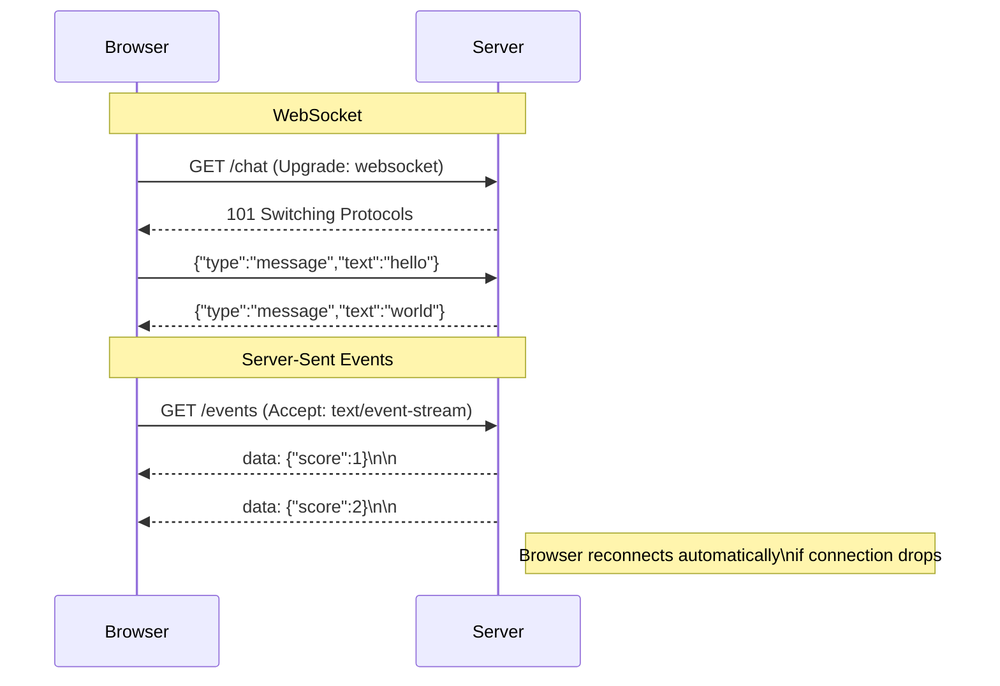

# [FEE-409] WebSockets & Server-Sent Events

:::info
WebSockets and Server-Sent Events (SSE) are the two primary mechanisms for persistent, low-latency communication between browser and server. WebSockets provide full-duplex messaging; SSE provides a simpler, unidirectional server-to-browser stream over standard HTTP. Choosing the right one depends on whether the browser needs to send as well as receive.
:::

## Introduction

Real-time data delivery on the web has historically required polling — the browser asking the server at regular intervals whether anything has changed. This is wasteful: most polls return nothing new, yet each round trip consumes connection overhead, server CPU, and battery. Two purpose-built browser APIs solve this: WebSocket provides a persistent, full-duplex connection over a single TCP socket, and Server-Sent Events (SSE) provides a unidirectional server-to-browser stream over a standard HTTP connection. Both APIs replaced polling for their respective use cases and are universally supported across modern browsers.

WebSocket (IETF RFC 6455, 2011) begins with an HTTP/1.1 upgrade handshake — the browser sends `Upgrade: websocket`, the server responds with `101 Switching Protocols`, and the connection becomes a raw framed binary stream where either side can send messages at any time. SSE is not a protocol upgrade; it is a plain HTTP response with `Content-Type: text/event-stream` that the browser keeps open and parses incrementally via the `EventSource` API.

Choosing between these two technologies is one of the most common real-time architecture decisions a frontend engineer makes. The correct choice depends almost entirely on communication direction: WebSocket is required when the browser must also send frequent messages to the server (chat, collaborative editing, multiplayer games), while SSE is sufficient — and preferable — for pure server-to-browser push (live scoreboards, notification feeds, streaming AI/LLM responses). A third technology, WebTransport, is on the horizon as a lower-latency successor to WebSocket built on HTTP/3 and QUIC, but as of 2026 it remains experimental and is not covered in depth here.

## Scenario

You are building a collaborative whiteboard where multiple users draw simultaneously and each user should see other users' strokes in near real-time. Polling the server every second introduces 500ms average latency and generates unnecessary load. WebSockets establish a persistent bidirectional connection, letting the server push drawing updates to all connected clients immediately when they occur. Server-Sent Events solve the simpler one-directional case — a server that pushes updates to clients — with a lighter protocol.

## Design Thinking

The central question when choosing between WebSocket and SSE is whether the browser needs to send data to the server continuously or at high frequency. If the answer is yes — a chat application where the user types messages, a multiplayer game where the client streams input events, a collaborative document editor where every keystroke must reach peers — WebSocket is appropriate because it gives the browser a send channel with minimal framing overhead. If the answer is no — a live sports ticker, a CI pipeline log viewer, an AI chatbot where the model streams its response token-by-token — SSE is the better choice because the HTTP connection it runs on is simpler to proxy, load-balance, and debug.

The operational simplicity of SSE is frequently underestimated. SSE connections appear as ordinary long-running HTTP requests to every piece of infrastructure between the browser and the server: reverse proxies (nginx, Caddy), CDN edge nodes, and load balancers. No special protocol negotiation or upgrade handling is needed. WebSocket connections, by contrast, require all of these layers to pass through the upgrade handshake without terminating it, and some corporate proxies and older load balancers strip or reject the `Upgrade` header entirely. Teams deploying behind infrastructure they do not fully control SHOULD factor this in.

SSE also benefits from HTTP/2 multiplexing. Under HTTP/1.1, a browser opens a maximum of six parallel connections per origin, and an SSE stream occupies one of those slots permanently. Under HTTP/2, multiple SSE streams share a single TCP connection via multiplexing, so a page that opens several concurrent event streams does not exhaust the connection pool. WebSocket, regardless of HTTP version, always requires its own TCP connection per socket — there is no WebSocket multiplexing.

A nuance worth understanding is that neither WebSocket nor SSE provides a guaranteed delivery mechanism at the protocol level. If the connection drops between the server sending a message and the client receiving it, the message is lost. WebSocket has no built-in acknowledgement or sequence number system. SSE mitigates this for the reconnection case: the `Last-Event-ID` header lets the server know which event the client last successfully received, so the server can replay missed events from a buffer. Applications that require true guaranteed delivery — where every event must be processed exactly once — need to implement application-level acknowledgements over WebSocket, or use a durable message queue (Kafka, RabbitMQ, Redis Streams) as the source of truth and deliver only confirmed events over SSE.

Another commonly overlooked consideration is server-side fan-out. A WebSocket server must maintain a reference to every open socket to broadcast events to connected clients — typically an in-memory set or map, sometimes backed by Redis pub/sub to coordinate across multiple server processes. An SSE server must maintain a list of open response streams for the same reason. Both architectures require careful cleanup when connections close. The difference is implementation complexity: a WebSocket server carries protocol-level state (ping/pong heartbeats, frame parsing, close codes), while an SSE server is just a long-lived HTTP response. In frameworks like Express, Fastify, or Hono, implementing SSE fan-out is often a matter of writing to a `res.write()` call inside a server-side event loop iteration.

The SSE wire format is worth understanding explicitly because it informs both the server implementation and the reconnection behaviour. The HTTP response has `Content-Type: text/event-stream`. Each event consists of one or more field lines followed by a blank line. The `data:` field carries the payload; multiple `data:` lines are concatenated with newlines before delivery. The `event:` field names the event type, which maps to the `addEventListener` event name on `EventSource`. The `id:` field sets the `Last-Event-ID` — the browser stores this and sends it as a `Last-Event-ID` HTTP request header on the next reconnect, letting the server resume the stream from where it left off. The `retry:` field instructs the browser how many milliseconds to wait before reconnecting after a dropped connection. A minimal multi-event stream looks like:

```
data: {"score":1}

id: 42
event: goal
data: {"player":"Messi"}

retry: 3000

```

The following table summarises the decision framework across the most common real-time scenarios:

| Scenario | WebSocket | SSE (`EventSource`) | Long Polling |
|---|---|---|---|
| Bidirectional (chat, multiplayer, collaborative edit) | Yes | No | Possible |
| Server push only (live scores, notifications) | Possible | Yes (simpler) | Possible |
| Streaming AI / LLM responses | Possible | Yes (standard) | No |
| HTTP/2 multiplexing (multiple streams) | No (one connection) | Yes | No |
| Binary data (audio, video, blobs) | Yes | No (text only) | No |
| Works through all proxies / firewalls | Sometimes blocked | Yes (standard HTTP) | Yes |
| Automatic reconnection with state resume | Manual | Built-in (`Last-Event-ID`) | Manual |

## Best Practices

**Implement exponential backoff for WebSocket reconnection from day one.** A WebSocket connection can drop at any point — network interruption, server restart, load balancer timeout, user roaming between networks. The correct response is to reconnect, but reconnecting immediately and repeatedly hammers the server. Exponential backoff — starting at 1 second, doubling on each failure, capped at 30 seconds — distributes reconnection attempts across time. Reset the delay to the initial value on a successful `open` event so a brief interruption does not permanently slow reconnection. See the `ReconnectingWebSocket` class in the Example section for a complete implementation.

**Check `readyState` before calling `send()`.** The WebSocket `readyState` property takes one of four values: `0` (CONNECTING), `1` (OPEN), `2` (CLOSING), `3` (CLOSED). Calling `send()` when `readyState` is not `1` throws an `InvalidStateError`. Always guard send calls with `ws.readyState === WebSocket.OPEN`. Buffer messages that arrive before the connection opens and flush them in the `open` handler if the application requires no-loss delivery.

**Use named events in SSE for a structured protocol.** An `EventSource` connection can carry multiple logical event types on a single HTTP stream by using the `event:` field. This is preferable to encoding a type discriminator inside every `data:` payload, because `addEventListener('goal', handler)` is more explicit than `es.onmessage` with manual type-switching. Named events also let different parts of the UI register independent listeners for the events they care about without a central dispatcher.

**Always close `EventSource` on component unmount.** An `EventSource` connection stays open until `es.close()` is called. If a React component or Vue component creates an `EventSource` in `useEffect` or `onMounted` without cleaning it up, the connection persists even after the component is removed from the DOM — silently consuming a server connection slot and a browser connection. Always return a cleanup function from `useEffect` (or use `onUnmounted` in Vue) that calls `es.close()`.

**Respect the server's `retry:` directive in SSE.** The server can send a `retry: <milliseconds>` field to inform the browser of the preferred reconnection interval. This field sets the browser's internal reconnection delay for `EventSource`. If you are building a server that streams SSE, emit a `retry:` field early in the response (e.g., `retry: 3000\n\n`) so the browser does not hammer the endpoint with its default interval (typically 3 seconds, but browser-implementation-defined).

**Use `withCredentials: true` for SSE on cross-origin endpoints.** By default, `EventSource` sends requests as anonymous cross-origin requests — no cookies, no `Authorization` headers. If the SSE endpoint requires authentication via cookies or HTTP credentials, pass `{ withCredentials: true }` to the `EventSource` constructor. The server must respond with `Access-Control-Allow-Origin: <specific origin>` (not `*`) and `Access-Control-Allow-Credentials: true`. This is identical to the CORS behaviour of `fetch` with `credentials: 'include'`.

**Prefer JSON over binary in SSE; prefer binary framing over raw JSON in WebSocket for high-throughput applications.** SSE carries text only — the `data:` field is a UTF-8 string. Encoding binary as base64 inside a `data:` field is possible but inefficient. For binary payloads (audio chunks, image tiles, raw sensor data), WebSocket with `binaryType = 'arraybuffer'` or `'blob'` is the correct choice. For WebSocket applications that carry many small JSON messages at high frequency, consider MessagePack or Protocol Buffers to reduce message size and parse time.

**Implement server-side heartbeats for long-lived WebSocket connections.** Many load balancers and proxies close idle TCP connections after a configurable timeout (commonly 60–90 seconds). A WebSocket connection that has no traffic during that window will be silently closed. The WebSocket protocol includes `ping` and `pong` control frames for this purpose: the server sends a ping frame, the browser responds with a pong automatically without application code involvement. Implement a server-side heartbeat on an interval shorter than the infrastructure timeout (e.g., every 30 seconds) to keep the connection alive. Do not implement heartbeats at the application message level — the protocol's built-in ping/pong is more efficient and does not pollute the application message stream.

**Set `Content-Type: text/event-stream` and disable response buffering on the server for SSE.** Some server middleware (gzip compression, output buffering in frameworks like Laravel or Rails) will buffer the response body before sending, which defeats the incremental delivery that SSE requires. Always set the response headers `Content-Type: text/event-stream`, `Cache-Control: no-cache`, and `X-Accel-Buffering: no` (the last one signals nginx to disable proxy buffering for this response). In Node.js, ensure the response stream is not piped through a compression middleware, or configure compression to exclude `text/event-stream` content types.

**Handle the SSE `error` event without panic.** The `error` event on `EventSource` fires during reconnection attempts — it does not necessarily mean the connection is permanently broken. The browser will automatically retry at the interval set by `retry:`. The `error` handler should log diagnostic information if needed but must not call `es.close()` unless the application genuinely wants to stop receiving events. Calling `es.close()` in the error handler disables the automatic reconnection that is one of the key advantages of `EventSource`.

**Secure WebSocket connections with `wss://`.** Unencrypted WebSocket (`ws://`) sends all frames in plaintext — including authentication tokens, session cookies sent in the initial handshake, and message payloads. Any network intermediary can read or modify the traffic. Always use `wss://` (WebSocket Secure), which runs the WebSocket protocol over TLS, identical to how `https://` secures HTTP. Most production environments enforce this at the infrastructure level, but the distinction matters in local development: `ws://localhost` is acceptable for development-only tooling, but any connection to a production backend must use `wss://`. Note that browsers block `ws://` connections from pages served over `https://` as mixed content.

**Validate the `Origin` header in WebSocket upgrade requests on the server.** Unlike HTTP requests with cookies, WebSocket connections can be initiated from any origin — the browser does not enforce the same-origin policy for WebSocket. A malicious page at `evil.example.com` can open a WebSocket connection to `wss://yourapi.example.com` if the server accepts all upgrade requests without checking the `Origin` header. The server MUST validate that the `Origin` in the upgrade request is an expected origin (allowlist approach) and reject connections from unexpected origins with a 403 response before the protocol upgrade completes.

## Mermaid Diagram



The diagram highlights the fundamental asymmetry: WebSocket is a two-lane road (arrows in both directions after the handshake), while SSE is a one-lane road with traffic only flowing from server to browser. The SSE stream is still a standard HTTP response — the same connection that delivers HTML and JSON can deliver an event stream, with no protocol state machine to manage on the server side.

One detail not visible in the diagram is the WebSocket handshake mechanism. The initial HTTP request carries the headers `Upgrade: websocket`, `Connection: Upgrade`, `Sec-WebSocket-Key: <base64 nonce>`, and `Sec-WebSocket-Version: 13`. The server computes a SHA-1 hash of the key concatenated with a well-known GUID and returns it as `Sec-WebSocket-Accept`. This exchange prevents accidental WebSocket connections from HTTP clients that do not understand the protocol — it is not a security mechanism (it uses a public GUID and base64) but rather a protocol identification mechanism. After the `101` response, the TCP connection stays open and the WebSocket frame format takes over. Each frame has a 2-to-10 byte header encoding: a FIN bit, opcode (text, binary, ping, pong, close), masking key (required for client-to-server frames), and payload length. Frames from browser to server must be masked; frames from server to browser must not be. This asymmetry is a deliberate security measure to prevent cache poisoning attacks through intermediary proxies.

From the application developer's perspective, these framing details are entirely hidden behind the browser API — `ws.send(data)` and the `message` event handler are the only surfaces exposed. But understanding the underlying structure helps explain the behaviour of tools like Chrome DevTools' Network panel WebSocket inspector, which shows individual frames, their opcodes, payload sizes, and timestamps. The DevTools WebSocket view is an invaluable debugging tool: it reveals whether heartbeat ping/pong frames are flowing correctly, whether a large message is causing a frame queue backup, and whether the server is sending unexpected close codes.

## Example

The three snippets below cover the full practical surface area of both APIs: a `ReconnectingWebSocket` class with exponential backoff, an SSE client that handles named events and relies on `Last-Event-ID` resumption, and a React hook that wraps `ReconnectingWebSocket` for use in components.

All three snippets are written in TypeScript. The `ReconnectingWebSocket` class is framework-agnostic and can be used in any JavaScript environment that has the `WebSocket` global (browsers, Deno, Node.js 21+). The SSE client function returns a cleanup closure rather than exposing the underlying `EventSource`, following the same principle as React's `useEffect` cleanup: the caller does not need to know about `EventSource` internals to correctly close the connection. The `useWebSocket` hook is React-specific but the same pattern (create on mount, destroy on unmount, stable callback ref) applies to Vue's `onMounted`/`onUnmounted` or Svelte's `onMount`/`onDestroy`. Together these three pieces represent the minimum viable real-time infrastructure for a production frontend application. They are intentionally kept simple — no third-party libraries, no framework-specific abstractions beyond the React hook — so the core behaviour is visible and easy to adapt to other frameworks. The `ReconnectingWebSocket` class in particular is designed so that swapping in a Vue composable or a Svelte store is a matter of replacing the `useEffect` lifecycle calls without touching any of the WebSocket or backoff logic.

### WebSocket with Exponential Backoff Reconnection

```ts
// websocket-client.ts — connect, send, receive, exponential backoff reconnect
class ReconnectingWebSocket {
  private ws: WebSocket | null = null;
  private reconnectDelay = 1000; // ms, doubles on each failure
  private readonly maxDelay = 30_000;
  private destroyed = false;

  constructor(
    private readonly url: string,
    private readonly onMessage: (data: string) => void,
  ) {
    this.connect();
  }

  private connect() {
    this.ws = new WebSocket(this.url);

    this.ws.addEventListener('open', () => {
      this.reconnectDelay = 1000; // reset on successful connection
      console.log('WebSocket connected');
    });

    this.ws.addEventListener('message', (event: MessageEvent<string>) => {
      this.onMessage(event.data);
    });

    this.ws.addEventListener('close', () => {
      if (this.destroyed) return;
      console.warn(`WebSocket closed, reconnecting in ${this.reconnectDelay}ms`);
      setTimeout(() => this.connect(), this.reconnectDelay);
      this.reconnectDelay = Math.min(this.reconnectDelay * 2, this.maxDelay);
    });

    this.ws.addEventListener('error', (event) => {
      console.error('WebSocket error', event);
      // 'close' fires after 'error' — reconnect logic is in the close handler
    });
  }

  send(data: string) {
    if (this.ws?.readyState === WebSocket.OPEN) {
      this.ws.send(data);
    }
  }

  destroy() {
    this.destroyed = true;
    this.ws?.close();
  }
}

// Usage
const socket = new ReconnectingWebSocket('wss://api.example.com/ws', (data) => {
  const msg = JSON.parse(data);
  console.log('Received:', msg);
});

socket.send(JSON.stringify({ type: 'subscribe', channel: 'prices' }));

// Cleanup on component unmount
socket.destroy();
```

The `destroyed` flag prevents the close handler from scheduling a reconnect after the caller has explicitly called `destroy()`. The error handler does not attempt its own reconnect because the `close` event always fires after `error` — reconnecting from both would schedule two simultaneous reconnection attempts. The delay is updated after `setTimeout` is called, not before, which means the first reconnect uses the current delay and the doubled value is applied only to the next attempt.

### SSE Client with Named Events and Last-Event-ID Resume

```ts
// sse-client.ts — EventSource with named events and Last-Event-ID resume
function connectSSE(url: string, onScore: (score: number) => void): () => void {
  const es = new EventSource(url, { withCredentials: true });

  // Default event (unnamed)
  es.addEventListener('message', (event: MessageEvent) => {
    const data = JSON.parse(event.data);
    console.log('Event ID:', event.lastEventId);
    onScore(data.score);
  });

  // Named event — server sends `event: goal\ndata: {...}\n\n`
  es.addEventListener('goal', (event: MessageEvent) => {
    const goal = JSON.parse(event.data);
    console.log('Goal scored by:', goal.player);
  });

  es.addEventListener('error', () => {
    // Browser automatically reconnects — this fires during reconnection attempts
    console.warn('SSE connection lost, browser will retry...');
  });

  // Return cleanup function
  return () => es.close();
}
```

The function returns a cleanup closure rather than the `EventSource` instance directly. This keeps the implementation detail of the `EventSource` object internal and gives callers a zero-argument cleanup function that is easy to wire into React's `useEffect` return or Vue's `onUnmounted`. The `withCredentials: true` option allows the browser to include cookies in the SSE request, which is required for session-authenticated endpoints. When the connection drops, the browser automatically sends the last received `id:` value as the `Last-Event-ID` request header on the reconnect request, letting the server skip events the client has already seen.

### React Hook Wrapping ReconnectingWebSocket

```ts
// react-hook.ts — useWebSocket hook wrapping ReconnectingWebSocket
import { useEffect, useRef, useCallback } from 'react';

export function useWebSocket(
  url: string,
  onMessage: (data: string) => void,
) {
  const socketRef = useRef<ReconnectingWebSocket | null>(null);
  const onMessageRef = useRef(onMessage);
  onMessageRef.current = onMessage; // keep ref stable, always call latest handler

  useEffect(() => {
    socketRef.current = new ReconnectingWebSocket(url, (data) => {
      onMessageRef.current(data);
    });
    return () => socketRef.current?.destroy();
  }, [url]);

  const send = useCallback((data: string) => {
    socketRef.current?.send(data);
  }, []);

  return { send };
}
```

Storing `onMessage` in a `useRef` and updating the ref on every render is the standard React pattern for keeping a callback stable across renders without stale closure bugs. The `useEffect` dependency array contains only `url` — if the URL does not change, the WebSocket is not torn down and recreated. The cleanup function returned by `useEffect` calls `destroy()`, which sets the `destroyed` flag and closes the socket, preventing the reconnection timer from firing after the component unmounts.

## Common Mistakes

**Using WebSocket when SSE is sufficient.** WebSocket requires stateful connection management on the server — each open socket is a persistent resource. For pure server-to-browser push, an SSE response is a plain streaming HTTP response that many server frameworks handle with a simple `for await` loop or a writable stream. The added complexity of WebSocket server infrastructure is not justified when the browser never sends data back.

**No reconnection logic for WebSocket.** The WebSocket protocol provides no built-in keep-alive or auto-reconnect. A network blip, server restart, or load balancer idle timeout will close the socket silently. Without reconnect logic, the application shows stale data indefinitely with no user-visible error. Implement exponential backoff from day one — adding it after the fact to a codebase that has `new WebSocket(url)` scattered across components is painful.

**Sending large binary payloads over WebSocket without chunking.** WebSocket frames a message as a single logical unit. A large message — a multi-megabyte image blob, a bulk data export — will be buffered in full by the browser before `onmessage` fires. This saturates the connection and blocks all other messages until the large payload is fully received. For large binary transfers, send a sequence of fixed-size chunks and reassemble on the receiver, or use a separate `fetch` request for the bulk data and reserve the WebSocket for control messages.

**Not closing `EventSource` on component unmount.** An `EventSource` connection persists until `es.close()` is called. In a single-page application, unmounting and remounting a component multiple times without cleanup will open multiple simultaneous SSE connections to the same endpoint, each consuming a server slot. Browsers typically enforce a limit of six simultaneous connections per origin under HTTP/1.1; with enough unclosed SSE connections, the page will exhaust this limit and no new requests will go through.

**Calling `es.close()` inside the `error` handler.** The `error` event fires every time the browser attempts to reconnect after a dropped connection — it is not a terminal event. Calling `es.close()` inside the handler permanently stops reconnection, which is almost never the intended behaviour. The correct pattern is to log the error and let the browser retry. Only call `es.close()` when the application is intentionally done with the stream (component unmount, user action, explicit abort).

**Assuming SSE works with `EventSource` only.** The `EventSource` API handles the SSE wire format automatically, but the same stream can also be consumed with `fetch` and a `ReadableStream` (see FEE-403). This is useful for SSE endpoints that require request headers beyond what the `EventSource` constructor supports (e.g., a custom `Authorization: Bearer` header — `EventSource` supports only cookies via `withCredentials`, not arbitrary headers). The `fetch` approach requires manual parsing of the `text/event-stream` format but gives full control over the request.

**Ignoring WebSocket close codes.** The WebSocket protocol defines a set of close codes in the range 1000–4999. Code `1000` is a normal closure; `1001` is "going away" (page navigation or server shutdown); `1006` is an abnormal closure that the browser sets when the connection was lost without a proper close frame. When reconnecting, the application SHOULD inspect `event.code` in the `close` handler to distinguish expected shutdowns from unexpected drops. For example, a server-initiated `1001` close during a deploy should be treated as a signal to reconnect after a short delay, while a `4001` application-defined "unauthorized" close should not be retried at all — the application should redirect to a login page instead. Blindly reconnecting on every close code regardless of meaning wastes resources and can create reconnection loops that bypass authentication.

**Not adding jitter to WebSocket reconnection backoff in high-concurrency scenarios.** Exponential backoff alone can cause a "thundering herd" problem when many clients disconnect simultaneously — for example, after a server restart. If 1,000 clients all reconnect at exactly the same doubled interval, the server still receives a sudden burst of connections. Adding a small random jitter (e.g., `delay + Math.random() * 1000`) spreads reconnection attempts across a window of time and prevents the burst from cascading. This is especially important for WebSocket servers that handle large numbers of concurrent connections.

## Browser Support

As of early 2026, both APIs are universally available across modern browsers. The following table covers the relevant support boundaries:

| Feature | Chrome | Firefox | Safari | Notes |
|---|---|---|---|---|
| WebSocket | Yes (since Chrome 4) | Yes (since Firefox 4) | Yes (since Safari 5) | Universal — RFC 6455 compliant |
| `EventSource` (SSE) | Yes (since Chrome 6) | Yes (since Firefox 6) | Yes (since Safari 5) | Universal |
| `EventSource` over HTTP/2 | Yes | Yes | Yes | Requires server HTTP/2 support |
| WebSocket over HTTP/2 (RFC 8441) | Partial | Partial | No | Not yet universally supported |
| WebTransport | Yes (Chrome 97+) | Behind flag | No | Experimental; HTTP/3 only |

WebSocket over HTTP/2 (RFC 8441, bootstrapping WebSocket via the HTTP/2 `CONNECT` method) is a newer extension that would allow WebSocket connections to share an HTTP/2 connection. Browser support is incomplete as of 2026 — it is not a feature to target in production. WebTransport on HTTP/3/QUIC is the forward-looking alternative to WebSocket for latency-sensitive applications, but it is only available in Chrome and is not covered here beyond this brief mention.

For server-side considerations: SSE can be implemented in virtually any HTTP framework that supports chunked or streaming responses. WebSocket requires either a framework with native WebSocket support or a library like `ws` (Node.js), `websockets` (Python), or a server that upgrades the connection using the RFC 6455 handshake. In Node.js, the `http` module does not handle WebSocket automatically — the `upgrade` event must be handled explicitly, or a library such as `ws` or `socket.io` must be used.

One practical note on infrastructure: if the application is served behind a CDN or edge network, verify whether the edge layer terminates WebSocket connections or passes them through. Many CDN providers support WebSocket pass-through but may require explicit configuration or a specific plan tier. SSE does not have this problem because it is a normal HTTP response; the CDN will cache-miss and forward the request to the origin without any special configuration, as long as `Cache-Control: no-cache` is present on the response.

## Related FEEs

- [FEE-403: Fetch, Streams & Network APIs](./403.md) — `fetch` with `ReadableStream` as an alternative for one-off streaming responses
- [FEE-604: Server State & Data Synchronization](../State%20Management/604.md) — where WebSocket and SSE data fits in client-side state management

## References

- MDN WebSocket API: https://developer.mozilla.org/en-US/docs/Web/API/WebSocket
- MDN EventSource: https://developer.mozilla.org/en-US/docs/Web/API/EventSource
- HTML Living Standard §9.2 (SSE): https://html.spec.whatwg.org/multipage/server-sent-events.html
- IETF RFC 6455 (WebSocket Protocol): https://datatracker.ietf.org/doc/html/rfc6455
- web.dev "Eventing with Server-Sent Events": https://web.dev/articles/eventsource-basics
- MDN "Writing WebSocket client applications": https://developer.mozilla.org/en-US/docs/Web/API/WebSockets_API/Writing_WebSocket_client_applications
- IETF RFC 8441 (Bootstrapping WebSockets with HTTP/2): https://datatracker.ietf.org/doc/html/rfc8441
- Can I Use — WebSocket: https://caniuse.com/websockets
- Can I Use — EventSource: https://caniuse.com/eventsource
- web.dev "WebTransport explainer": https://developer.chrome.com/docs/capabilities/web-apis/webtransport
- WHATWG Streams Standard: https://streams.spec.whatwg.org/
