# [FEE-410] File API, Clipboard & Drag-and-Drop

:::info
The browser provides multiple mechanisms for reading, writing, and transferring user files: the universal `<input type="file">` element, the modern promise-based File methods, the File System Access API for persistent read/write handles, the Clipboard API for cut/copy/paste, and the HTML Drag-and-Drop API. Understanding which API fits each use case and which browsers support it is essential for building reliable file-handling experiences.
:::

## Introduction

The web platform has always let users select files through `<input type="file">`, but for a long time that element was the only sanctioned entry point. Browsers parsed the `FileList` it produced and exposed `File` objects (thin wrappers around a native file reference), but actually reading the bytes required the callback-heavy `FileReader` API introduced in HTML5. Reading a text file meant constructing a `FileReader`, listening for `loadend`, checking `result`, and handling errors in a separate event. Uploading the bytes further required manually constructing `FormData` or converting through a `DataURL`. The developer experience was tedious relative to the simplicity of the task.

Two significant improvements landed in the 2019–2021 timeframe. First, `File` grew promise-based methods (`.text()`, `.arrayBuffer()`, and `.stream()`), making it a direct subclass of `Blob`. Reading a file became a single `await file.text()` with no event listeners required, and error propagation followed normal promise semantics. Second, the File System Access API (`showOpenFilePicker`, `showSaveFilePicker`, `showDirectoryPicker`) gave browsers the ability to grant a web app persistent read/write access to files and directories on the local file system, enabling offline-first apps, code editors, and photo management tools that previously could only be native. The trade-off is browser support: as of 2025, Safari supports `showOpenFilePicker` on desktop (15.2+) but not `showDirectoryPicker` consistently, and iOS support remains read-only.

Separately, the Clipboard API and HTML Drag-and-Drop API provide two more pathways through which files reach a web app. `navigator.clipboard` offers a fully promise-based interface for reading and writing text, images, and arbitrary data types, replacing the legacy `document.execCommand('copy')` approach that was never officially standardized and whose behavior varied across browsers. Drag-and-drop allows users to drag files from the OS file manager onto a designated drop zone in the page; the mechanism is built into every modern browser and requires only a `dragover` handler that calls `event.preventDefault()` and a `drop` handler that reads `event.dataTransfer.files`. Each pathway carries a different security posture: `<input type="file">` hands your code a one-time `File` snapshot with no write-back capability; the File System Access API grants persistent read/write access but requires explicit OS-level user consent; clipboard and drag-and-drop sit between these extremes. Both require a user gesture, and neither needs an explicit permission dialog for basic operations.

## Context

You are building a document editor where users can drag image files from the desktop into the editor and have them inserted at the cursor position. The drop event fires on the target element, but extracting the file from the drop, reading its binary content, and converting it to a data URL requires three separate browser APIs working in sequence. The File API, DataTransfer, and FileReader together handle the pipeline from user gesture to usable file content.

## Design Thinking

The most consequential decision when working with files in the browser is which entry point to use. `<input type="file">` is the right default: it works in every browser including Safari on iOS, it requires no feature detection, and it produces a `File` object that the rest of the pipeline consumes identically to any other source. The File System Access API adds the ability to write back to the same file the user opened, to open entire directories, and to retain a `FileSystemFileHandle` across sessions (by persisting it in IndexedDB; see FEE-404). The downside is that Safari's implementation is incomplete as of 2025 and iOS support is limited; any product requirement that includes Safari or mobile browsers MUST account for this gap with a graceful fallback.

The promise-based `File` methods `.text()`, `.arrayBuffer()`, and `.stream()` have replaced `FileReader` for all practical purposes in modern code. `FileReader` is event-based: you construct an instance, attach `onloadend` and `onerror` callbacks, call `.readAsText()` or `.readAsArrayBuffer()`, and then read the result from the event. This requires wrapping in a `Promise` to be composable with `async/await` code. The direct methods (`file.text()`, `file.arrayBuffer()`) return `Promise<string>` and `Promise<ArrayBuffer>` natively. They are shorter to write, easier to read, and produce errors through normal rejection rather than a separate event channel. Both are available in Chrome 76+, Firefox 69+, and Safari 14+.

For clipboard operations, the key distinction is between `writeText`/`readText` (text only, broadly supported) and `write`/`read` (arbitrary types including images, supported everywhere except Firefox for `read` as of 2025). Both require either a transient user gesture or an explicit permission grant. In Chrome, `readText` in response to a user gesture is permitted without a prompt; background reads (from timers, network callbacks, etc.) will trigger a permission prompt or be denied outright. The older `document.execCommand('copy')` approach operates synchronously and only works with content currently selected in the DOM: it cannot write programmatically constructed content and is formally deprecated.

For drag-and-drop, the single most common mistake is omitting `event.preventDefault()` on `dragover`. Without that call, the browser handles the drop itself by navigating to the file, and the `drop` event never fires in your handler. The `dataTransfer.dropEffect` property should also be set to `'copy'` to give the user the correct cursor feedback. Files dropped onto a drop zone are exposed as a `FileList` on `event.dataTransfer.files`, producing the same `File` objects as `<input type="file">`, so the same downstream `.text()` / `.arrayBuffer()` / `.stream()` pipeline applies.

A less obvious aspect of all three file-reading pathways is that the resulting `File` object is a snapshot reference, not a live stream. On most operating systems, if the underlying file on disk changes between the moment the user selected it and the moment your code calls `.text()`, you will read the file at the time of the call. The browser does not, however, update the `File` object to reflect subsequent on-disk changes. For use cases where the file needs to be re-read after modifications (a code editor autosave scenario, for example), you must call `handle.getFile()` again to obtain a fresh `File` snapshot. This is one reason the File System Access API's `FileSystemFileHandle` abstraction is important: it preserves the reference to the file identity even as its contents change, whereas the `File` object returned by `<input type="file">` is a one-time snapshot with no mechanism to refresh.

Memory management deserves explicit attention when handling files in the browser. The three most common leaks are: (1) creating `URL.createObjectURL` references and never calling `URL.revokeObjectURL`; (2) retaining large `ArrayBuffer` values as module-level state long after they are no longer needed; and (3) holding `FileSystemFileHandle` references in IndexedDB indefinitely without a cleanup strategy. For short-lived operations such as an upload preview, use a `try/finally` block or a `load` event callback to revoke the object URL promptly. For long-lived handles stored in IndexedDB, consider storing a creation timestamp alongside the handle and purging entries older than a configurable retention window on application startup.

Security is another axis the File System Access API explicitly surfaces. When a web app holds a `FileSystemFileHandle` or `FileSystemDirectoryHandle`, it has the ability to read from and write to the user's file system within the granted scope, a capability that far exceeds what a traditional `<input type="file">` provides. Browsers enforce a permission model: the initial `showOpenFilePicker` call establishes a read permission, and `createWritable()` triggers a separate write permission prompt (or is denied on iOS). Permissions are tied to the origin and are revoked when the user closes all tabs for that origin. Applications SHOULD call `handle.queryPermission({ mode: 'readwrite' })` before attempting to write, and request permission again if it has been revoked, rather than assuming the write permission obtained in a previous session is still active.

### Decision Table

| Scenario | `<input type="file">` | File System Access API | Legacy `FileReader` |
|---|---|---|---|
| One-time file read (upload workflow) | Yes | Possible | Legacy — use `File.text()` instead |
| Save file to disk from the browser | No | Yes (`showSaveFilePicker`) | No |
| Persistent directory handle (code editor, photo app) | No | Yes (`showDirectoryPicker`) | No |
| Full Safari support | Yes | Partial (read-only) | Yes |
| Requires a user gesture | Yes (click) | Yes (programmatic call) | No (already have File object) |
| Works in Web Workers | No | Partial | No |

## Best Practices

**Use `File.text()` and `File.arrayBuffer()` instead of `FileReader`.** Both methods are available in all modern browsers (Chrome 76+, Firefox 69+, Safari 14+) and return native promises. There is no reason to construct a `FileReader` instance in new code. Eliminating the event listener attachment means errors surface through the normal `try/catch` path rather than through a separate `onerror` handler that is easy to forget.

**Always provide a `<input type="file">` fallback when using the File System Access API.** Feature-detect with `'showOpenFilePicker' in window` and fall through to a traditional file input if the API is unavailable. This covers Safari on iOS, Firefox (which does not implement the API as of 2025), and any other environment where the API is absent. The fallback does not require the user to learn a different workflow: both paths produce a `File` object that the rest of the code handles identically.

**Handle `AbortError` from `showOpenFilePicker` explicitly.** When the user opens the file picker and then clicks Cancel, the promise rejects with a `DOMException` whose `name` is `'AbortError'`. This is expected behavior, not a bug. If you let the rejection propagate to a top-level error handler, you will log noise or show an error message to the user when they simply changed their mind. Catch it, check the name, and return gracefully.

**Set `event.dataTransfer.dropEffect` on `dragover`.** Setting `dropEffect = 'copy'` signals to the OS that the drag is a copy operation, showing the appropriate cursor. Without this, the cursor typically shows a move or disallowed icon even when the drop zone is fully functional, confusing users.

**Limit clipboard reads to user-gesture contexts.** `navigator.clipboard.readText()` and `navigator.clipboard.read()` require either a user gesture (click, keydown) or the `clipboard-read` permission to be granted. Reading the clipboard from a `setTimeout`, a `fetch` callback, or any other non-gesture context will either trigger a permission prompt or fail silently depending on the browser. Structure clipboard reads so they execute directly inside event handlers.

**Accept both `<input type="file">` and drag-and-drop in upload workflows.** Users have strong mental models about file operations. Some users will drag; others will click. Offering both requires minimal additional code (both produce a `FileList` or array of `File` objects) and significantly improves perceived usability.

**Validate file type and size before reading.** The `File` object exposes `.type` (MIME type string, may be empty), `.name` (filename with extension), and `.size` (bytes). Check these before calling `.text()` or `.arrayBuffer()` on large or unexpected file types. A 2 GB binary file passed to `.text()` will allocate a multi-gigabyte string in memory; fail fast with a user-visible error instead.

**Revoke object URLs created with `URL.createObjectURL`.** When you create a temporary URL for a `File` or `Blob` using `URL.createObjectURL`, the browser holds a reference to the underlying data until the document is unloaded or you explicitly call `URL.revokeObjectURL`. In long-lived single-page applications that repeatedly create object URLs (for image previews, clipboard images, etc.) without revoking them, memory usage grows without bound. Call `URL.revokeObjectURL(url)` once the URL is no longer needed: after the image element has loaded, or after a download link has been clicked.

**SHOULD prefer `navigator.clipboard.writeText` and `readText` over the deprecated `document.execCommand('copy')`.**  `execCommand` is not standardized, operates synchronously on selected DOM content only, cannot write programmatically constructed content, and is formally deprecated. `navigator.clipboard.writeText(text)` and `readText()` are promise-based, work on arbitrary strings, and compose naturally with `async/await` error handling. The only remaining reason to reach for `execCommand` is supporting browsers older than Chrome 66 / Firefox 63 / Safari 13.1, which account for a negligible share of traffic in 2025+.

**Use `File.stream()` for large files instead of loading everything into memory.** `.text()` and `.arrayBuffer()` load the entire file content into a single JavaScript value. For files above a few megabytes (log files, CSV exports, image archives), use `.stream()` to obtain a `ReadableStream` and process the data in chunks. This is especially important for upload pipelines: passing a `ReadableStream` body to `fetch` allows the browser to stream the upload without buffering the entire file in JS heap memory. See FEE-403 for `ReadableStream` usage patterns.

## Mermaid Diagram

```mermaid
flowchart TD
  subgraph "File input (universal)"
    INP["<input type='file'>"] --> FILE["File object"]
  end
  subgraph "File System Access API"
    PICK["showOpenFilePicker()"] --> FH["FileSystemFileHandle"]
    FH --> FILE2["File object"]
    FH --> WR["createWritable() → write back"]
  end
  subgraph "Drag-and-Drop"
    DROP["drop event"] --> DT["event.dataTransfer.files"]
    DT --> FILE3["File object"]
  end

  FILE --> PROC["File.text() / File.arrayBuffer() / File.stream()"]
  FILE2 --> PROC
  FILE3 --> PROC
  PROC --> APP["Application logic"]
```



## Example

### file-input.ts — modern file reading with `File.text()` and `File.arrayBuffer()`

```ts
// file-input.ts — modern file reading with File.text() and File.arrayBuffer()
const input = document.createElement('input');
input.type = 'file';
input.accept = '.txt,.json,.csv';
input.multiple = true;

input.addEventListener('change', async () => {
  const files = Array.from(input.files ?? []);

  for (const file of files) {
    console.log(`Name: ${file.name}, Size: ${file.size} bytes, Type: ${file.type}`);

    if (file.type.startsWith('text/') || file.name.endsWith('.json')) {
      // Promise-based — no FileReader needed
      const text = await file.text();
      console.log('Text content:', text.slice(0, 200));
    } else {
      // Binary content
      const buffer = await file.arrayBuffer();
      console.log('Binary bytes:', buffer.byteLength);
    }
  }
});

document.body.appendChild(input);
input.click();
```

### file-system-access.ts — persistent file handle with `<input>` fallback

```ts
// file-system-access.ts — persistent file handle with <input> fallback
async function openFile(): Promise<{ content: string; handle: FileSystemFileHandle | null }> {
  // Feature detect — File System Access API
  if ('showOpenFilePicker' in window) {
    try {
      const [handle] = await (window as any).showOpenFilePicker({
        types: [{ description: 'Text files', accept: { 'text/plain': ['.txt', '.md'] } }],
      }) as FileSystemFileHandle[];
      const file = await handle.getFile();
      const content = await file.text();
      return { content, handle };
    } catch (err) {
      if ((err as DOMException).name === 'AbortError') {
        // User cancelled the picker — not an error
        return { content: '', handle: null };
      }
      throw err;
    }
  }

  // Fallback: traditional <input type="file">
  return new Promise((resolve) => {
    const input = document.createElement('input');
    input.type = 'file';
    input.accept = '.txt,.md';
    input.addEventListener('change', async () => {
      const file = input.files?.[0];
      if (!file) return resolve({ content: '', handle: null });
      const content = await file.text();
      resolve({ content, handle: null });
    });
    input.click();
  });
}

async function saveFile(handle: FileSystemFileHandle, content: string) {
  const writable = await handle.createWritable();
  await writable.write(content);
  await writable.close();
}
```

### clipboard.ts — Clipboard API for text and images

```ts
// clipboard.ts — Clipboard API for text and images

// Write text to clipboard
async function copyText(text: string) {
  await navigator.clipboard.writeText(text);
}

// Read text from clipboard (requires clipboard-read permission or user gesture)
async function pasteText(): Promise<string> {
  return navigator.clipboard.readText();
}

// Write an image to clipboard
async function copyImage(imageBlob: Blob) {
  const item = new ClipboardItem({ [imageBlob.type]: imageBlob });
  await navigator.clipboard.write([item]);
}

// Read clipboard contents (images, HTML, etc.)
async function readClipboard() {
  const items = await navigator.clipboard.read();
  for (const item of items) {
    if (item.types.includes('image/png')) {
      const blob = await item.getType('image/png');
      const url = URL.createObjectURL(blob);
      console.log('Clipboard image URL:', url);
      // Revoke the object URL when no longer needed to free memory
      URL.revokeObjectURL(url);
    }
    if (item.types.includes('text/plain')) {
      const blob = await item.getType('text/plain');
      console.log('Clipboard text:', await blob.text());
    }
  }
}
```

### drag-drop.ts — file drop zone

```ts
// drag-drop.ts — file drop zone
const dropZone = document.getElementById('drop-zone')!;

// Must preventDefault on dragover to allow dropping
dropZone.addEventListener('dragover', (event) => {
  event.preventDefault();
  event.dataTransfer!.dropEffect = 'copy';
  dropZone.classList.add('drag-over');
});

dropZone.addEventListener('dragleave', () => {
  dropZone.classList.remove('drag-over');
});

dropZone.addEventListener('drop', async (event) => {
  event.preventDefault();
  dropZone.classList.remove('drag-over');

  const files = Array.from(event.dataTransfer!.files);
  console.log(`Dropped ${files.length} file(s)`);

  for (const file of files) {
    const content = await file.text();
    console.log(`${file.name}:`, content.slice(0, 100));
  }
});
```

## Common Mistakes

**Using `FileReader` instead of `file.text()` / `file.arrayBuffer()`.** `FileReader` is event-based and requires error handling boilerplate; promise-based methods are simpler, shorter, and fully composable with `async/await`. There is no reason to reach for `FileReader` in new code targeting Chrome 76+, Firefox 69+, Safari 14+, or newer.

**Not calling `event.preventDefault()` on `dragover`.** This is the single most common drag-and-drop bug. Without it, the browser intercepts the drop and navigates away to display the file directly. The `drop` event never fires in your handler. Always add a `dragover` listener that calls `event.preventDefault()`.

**Assuming `showOpenFilePicker` works everywhere.** Safari on desktop (15.2+) supports `showOpenFilePicker` but not `showDirectoryPicker` reliably. iOS Safari does not support write operations. Firefox does not implement the API at all as of 2025. Feature-detect and provide a `<input type="file">` fallback for every code path that calls `showOpenFilePicker`.

**Not handling `AbortError` from `showOpenFilePicker`.** When the user dismisses the file picker without selecting a file, the promise rejects with a `DOMException` with `name === 'AbortError'`. This is expected behavior. Allowing it to propagate to a generic error handler produces spurious logs or shows an error modal to the user. Catch and check the error name; return silently if it is an `AbortError`.

**Calling clipboard APIs outside a user gesture.** `navigator.clipboard.readText()` and `navigator.clipboard.read()` must be called from within a user-gesture event handler (or with the `clipboard-read` permission granted). Calling them from `setTimeout`, a `Promise.then()` chain triggered by a network response, or a `MutationObserver` callback will fail or prompt the user unexpectedly.

**Not validating file size before reading.** Passing a large binary file (video, disk image) to `file.text()` will allocate the entire file content as a JavaScript string in memory. Always check `file.size` and reject files that exceed your application's limit before reading their contents.

**Leaking object URLs by never calling `URL.revokeObjectURL`.** Every call to `URL.createObjectURL` retains a reference to the underlying `File` or `Blob` data until the document unloads or you call `URL.revokeObjectURL`. In a single-page application where users repeatedly select or paste images without the page reloading, the retained memory accumulates with each interaction. Revoke the URL after the consuming element (e.g., an ``) has loaded, or after a programmatic download has been triggered.

**Treating `dataTransfer.items` and `dataTransfer.files` as interchangeable.** `dataTransfer.files` is a `FileList` and only contains `File` entries. `dataTransfer.items` is a `DataTransferItemList` that may also contain string data (e.g., text dragged from another tab, a URL dragged from the address bar). For file-only drop zones, `dataTransfer.files` is simpler. For drop zones that accept both files and text or URLs, iterate `dataTransfer.items` and check `item.kind` before calling `item.getAsFile()` or `item.getAsString()`.

## Browser Support Summary

| Feature | Chrome | Firefox | Safari | Safari iOS |
|---|---|---|---|---|
| `<input type="file">` | All | All | All | All |
| `File.text()` / `.arrayBuffer()` | 76+ | 69+ | 14+ | 14+ |
| `File.stream()` | 76+ | 69+ | 14+ | 14+ |
| `showOpenFilePicker` | 86+ | Not supported | 15.2+ | Limited |
| `showSaveFilePicker` | 86+ | Not supported | 15.2+ | Not supported |
| `showDirectoryPicker` | 86+ | Not supported | Partial | Not supported |
| `navigator.clipboard.writeText` | 66+ | 63+ | 13.1+ | 13.4+ |
| `navigator.clipboard.readText` | 66+ | 63+ | 13.1+ | 13.4+ |
| `navigator.clipboard.write` (images) | 76+ | 87+ | 13.1+ | 13.4+ |
| `navigator.clipboard.read` | 76+ | Not supported | 13.1+ | Not supported |
| HTML Drag and Drop (files) | All | All | All | Limited |
| `ClipboardItem` constructor | 76+ | 87+ | 13.1+ | 13.4+ |

Sources: MDN browser compatibility tables; caniuse.com/native-filesystem-api; Can I use Clipboard API.

The table above captures the state as of April 2026. The most important gaps to plan around are:
- Firefox has no File System Access API support at all.
- `navigator.clipboard.read` (for reading images and arbitrary types from the clipboard) is absent
  in Firefox, meaning image paste is impossible without a fallback.
- iOS Safari's drag-and-drop file handling is unreliable in many version ranges: test explicitly on
  real devices, not just simulators.
- `showDirectoryPicker` is missing or behaves inconsistently on Safari even on desktop; do not
  depend on it without a fallback UI that lists individual files.
- Chrome is the only browser with full support for all APIs in this article; use it as the primary
  development and testing baseline, but always verify critical paths in Firefox and Safari.

## Related FEEs

- [FEE-403: Fetch, Streams & Network APIs](./403.md) — uploading `File` objects via `fetch` with `FormData`; `ReadableStream` from `File.stream()`
- [FEE-404: Storage & State Persistence](./404.md) — persisting `FileSystemFileHandle` objects in IndexedDB to restore access across sessions

## References

- MDN File API: https://developer.mozilla.org/en-US/docs/Web/API/File_API
- MDN File System Access API: https://developer.mozilla.org/en-US/docs/Web/API/File_System_API
- web.dev "The File System Access API": https://web.dev/articles/file-system-access
- MDN Clipboard API: https://developer.mozilla.org/en-US/docs/Web/API/Clipboard_API
- MDN HTML Drag and Drop API: https://developer.mozilla.org/en-US/docs/Web/API/HTML_Drag_and_Drop_API
- MDN File: https://developer.mozilla.org/en-US/docs/Web/API/File
- Can I use File System Access API: https://caniuse.com/native-filesystem-api
