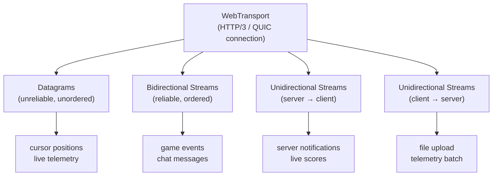

# [FEE-411] WebTransport

:::info
WebTransport is a browser API built on HTTP/3 and QUIC that provides both unreliable datagrams (UDP-like, no delivery guarantee) and reliable ordered streams over a single low-latency connection. It is designed for use cases where WebSocket latency is too high — real-time games, live telemetry, and cursor synchronisation. As of 2026, WebTransport requires a WebSocket fallback for production use.
:::

## Introduction

WebSocket has been the dominant bidirectional communication mechanism on the web since 2011.
Built on TCP, it delivers ordered, reliable message framing over a persistent connection, and its universal browser support and simple event-based API made it the default choice for chat applications, collaborative editors, and live dashboards.
However, TCP's core properties — guaranteed delivery and strict ordering — come with costs that become painful at scale.
When a single TCP packet is lost, the entire connection stalls until the missing segment is retransmitted, a phenomenon known as head-of-line blocking.
For applications that generate high-frequency updates where the most recent value supersedes all prior values — a cursor position, a sensor reading, a game entity's coordinates — a lost packet that blocks fresh data is worse than simply dropping it and moving on.

WebTransport addresses this fundamental limitation by building on QUIC, the transport protocol that also underpins HTTP/3.
QUIC is a UDP-based protocol that implements its own reliability and congestion control per-stream, meaning that a lost packet on one stream does not block progress on another.
WebTransport exposes two distinct primitives:

- **Datagrams** — completely unreliable and unordered (like raw UDP but framed and multiplexed through the HTTP/3 connection).
- **Streams** — reliable and ordered (like WebSocket messages but independent of each other, so that one slow stream cannot block another).

A single WebTransport connection can carry dozens of independent streams and a continuous flow of datagrams simultaneously, eliminating the workaround of opening multiple WebSocket connections to avoid head-of-line blocking.

The API was designed to sit close to the platform — datagrams and streams are exposed as `ReadableStream` and `WritableStream` interfaces, the same primitives used throughout the Streams API and the Fetch API.
This means that patterns learned from `Response.body` or from `TransformStream` pipelines translate directly to WebTransport usage.
The connection lifecycle is promise-based:

- The constructor begins the QUIC handshake and returns immediately.
- `transport.ready` resolves when the connection is fully established and data can flow.
- `transport.closed` resolves (or rejects) when the connection ends, carrying an optional close code and reason.

Browser support as of 2026 is led by Chrome 97+ and Edge 97+, with Firefox support available only behind a flag and Safari in an experimental stage.
This support gap means that any production deployment MUST pair WebTransport with a WebSocket fallback and implement feature detection at startup.
WebTransport connections require HTTPS origins; the security model mirrors CORS with explicit server opt-in.

## Design Thinking

The primary design decision when adopting WebTransport is whether your use case actually benefits from it. The latency advantage of QUIC over TCP only manifests at scale or in lossy network conditions; for a chat application on a reliable broadband connection, the improvement will be imperceptible. The significant cost is fallback complexity: you must implement and maintain two communication paths, keep their message formats compatible, and test both in production. This is a non-trivial investment that is worth making only when the low-latency properties of WebTransport meaningfully improve the user experience. The clearest candidates are real-time multiplayer games (where a 20 ms reduction in round-trip time is the difference between a hit and a miss), collaborative pointer sharing across dozens of concurrent cursors (where stale positions are discarded by design), and high-frequency telemetry pipelines (where dropping one sensor reading is acceptable but accumulating backpressure is not).

The second design decision concerns which WebTransport primitive to use for each message type. Datagrams are suitable for values that are superseded by the next update: cursor positions, entity transforms, sensor samples, presence pings. Streams are appropriate for messages that must arrive and be processed in order: game events, chat messages, authentication handshakes, file payloads. It is both correct and common to use datagrams and streams simultaneously on the same connection — send cursor positions as datagrams while routing chat and game state through bidirectional streams. The QUIC multiplexing layer handles the coexistence transparently. Teams SHOULD avoid forcing all traffic through datagrams to minimise latency; any message where loss would require a compensating request should travel over a stream instead.

A third consideration is backpressure. `WritableStream` writers expose a `ready` promise that resolves when the underlying buffer has capacity. Teams MUST respect this backpressure signal for stream writes to avoid unbounded memory growth. Datagrams, by contrast, do not expose backpressure — they are silently dropped by the QUIC layer if the network cannot keep up, which is by design for real-time data but would be catastrophic for application-level messages. If your datagram writer begins discarding messages at a rate that breaks application logic, that is a signal the data model belongs on a stream.

A fourth consideration is the server infrastructure requirement. WebTransport requires a server that speaks HTTP/3 over QUIC on a UDP port — typically port 443. Many existing backend stacks speak only TCP-based HTTP/1.1 or HTTP/2. Adopting WebTransport therefore requires either migrating the backend to an HTTP/3-capable server (Caddy, NGINX with the ngx_http_v3_module, Cloudflare Workers, or dedicated WebTransport servers like webtransport-go) or introducing a sidecar or gateway that terminates QUIC and forwards to the existing TCP backend. This infrastructure concern is often the largest adoption barrier for teams with established backend architectures, and it reinforces the need for a WebSocket fallback that can continue to use the existing TCP stack while the HTTP/3 layer is provisioned and tested.

**Table 1 — WebSocket vs SSE vs WebTransport**

| Scenario | WebSocket | SSE | WebTransport |
|---|---|---|---|
| Bidirectional | Yes | No | Yes |
| Unreliable (lossy) datagrams | No | No | Yes |
| Multiple independent streams | No (one stream) | No | Yes (concurrent streams) |
| Built on | TCP | HTTP/1.1 or HTTP/2 | HTTP/3 / QUIC |
| Browser support (2026) | Universal | Universal | Chrome/Edge; Safari experimental |
| Fallback complexity | Low | Low | High (requires WebSocket fallback) |
| Best for | Chat, collab edit | Live feeds, LLM streaming | Games, live telemetry, low-latency sync |

**Table 2 — Within WebTransport: datagram vs stream**

| Need | Use |
|---|---|
| Position updates, cursor sync (stale data acceptable) | Datagrams |
| Chat messages, game state events (must arrive) | Bidirectional stream |
| Server → client events (one-way, reliable) | Unidirectional stream (server → client) |
| File upload with progress (one-way, reliable) | Unidirectional stream (client → server) |

## Best Practices

**Always pair WebTransport with a WebSocket fallback.** Feature detection alone is not sufficient — even in Chrome, a WebTransport connection can fail if the server is misconfigured or the network path does not support QUIC. The correct pattern is to probe with a real connection attempt (`await transport.ready`) rather than a capability check (`'WebTransport' in window`) and fall back to WebSocket on any failure. Design the two paths around a shared message model so that switching tiers at runtime does not require changes to the application logic above the transport layer.

**Await `transport.ready` before any I/O.** The `WebTransport` constructor initiates the QUIC handshake but returns immediately. Writing to a datagram writer or opening a stream before `transport.ready` resolves will throw. Centralise connection creation in a factory function that awaits `ready` before returning the transport instance, so that callers cannot accidentally use an unconnected transport.

**Release all stream locks promptly.** Every `getReader()` and `getWriter()` call places a lock on the stream. Failing to call `reader.releaseLock()` or `writer.releaseLock()` (or failing to close the writer) will block any subsequent consumer of that stream and eventually cause the connection to stall. Use `try/finally` blocks to guarantee that locks are released even when errors occur mid-stream.

**Handle `transport.closed` to detect disconnections.** The `closed` promise rejects with an error object that includes a `closeCode` and `reason` when the server terminates the connection unexpectedly. Attach a `.catch()` handler immediately after connection to trigger reconnection logic or surface a user-visible error state. Do not rely on datagram read loops ending to detect disconnection — they complete silently when the connection closes.

**Do not share a single `WritableStreamDefaultWriter` across concurrent senders.** A `WritableStream` has a single writer lock. If multiple coroutines each call `getWriter()` without coordination, the second call will throw. Use a queue or a dedicated serialisation layer when multiple parts of the application need to write to the same stream.

**Match message granularity to QUIC stream semantics.** Each call to `transport.createBidirectionalStream()` opens a new QUIC stream. Opening one stream per chat message is wasteful — prefer multiplexing logical messages over a single long-lived bidirectional stream with an application-level framing protocol (e.g., a length-prefixed or newline-delimited JSON envelope). Conversely, if two message types have independent ordering requirements (e.g., game state and voice control commands), they benefit from separate streams so that a slow handler for one does not delay the other.

**SHOULD choose WebTransport over WebSocket when the use case can tolerate packet loss and minimising round-trip latency is the dominant requirement.** The latency advantage of QUIC over TCP becomes meaningful in real-time games, high-frequency cursor sharing, and live telemetry — scenarios where a stale value superseded by the next update is preferable to a retransmission that delays all subsequent data. For applications where every message must be delivered and ordering matters (chat, collaborative editing, authentication), the head-of-line blocking cost of TCP is acceptable and the fallback complexity of WebTransport is not warranted.

**SHOULD use WebTransport reliable streams rather than datagrams when message delivery and ordering are required.** Datagrams are unreliable by design — they are silently dropped under congestion and arrive out of order. Any application message where loss would require a compensating request (re-fetching state, prompting the server for a resend) belongs on a bidirectional or unidirectional stream. Use datagrams exclusively for data where receiving the most recent value is sufficient and gaps between received values are acceptable to the application.

**Verify server-side QUIC and HTTP/3 support before committing.** WebTransport requires that the server speaks HTTP/3 over QUIC. Many existing load balancers, CDNs, and cloud platforms require explicit configuration to enable HTTP/3. A successful `transport.ready` in local development does not guarantee success in production if the ingress infrastructure strips or blocks QUIC traffic. Test the full path — including any intermediary proxies — as part of WebTransport integration testing.

## Mermaid Diagram



## Example

The following six code blocks cover the complete lifecycle: feature detection with fallback, connection setup, datagram send/receive, bidirectional stream usage, reading server-initiated unidirectional streams, and graceful shutdown.

```ts
// feature-detect.ts — WebTransport with WebSocket fallback
type TransportTier = 'webtransport' | 'websocket';

async function detectTransport(wtUrl: string, _wsUrl: string): Promise<TransportTier> {
  // _wsUrl is used by the caller to construct the WebSocket fallback connection
  if ('WebTransport' in window) {
    try {
      const transport = new WebTransport(wtUrl);
      await transport.ready; // throws if server unreachable or unsupported
      transport.close();     // close the probe connection
      return 'webtransport';
    } catch {
      // WebTransport supported in browser but failed (network, server config)
    }
  }
  return 'websocket';
}

// Usage
const tier = await detectTransport('https://api.example.com/wt', 'wss://api.example.com/ws');
if (tier === 'webtransport') {
  // Use WebTransport path
} else {
  // Use WebSocket path
}
```

`detectTransport` probes with a real connection rather than a static capability check because a capable browser on an incompatible network would otherwise be routed to a path that fails at runtime. The probe transport is closed immediately after `ready` resolves so it does not consume server resources during the detection phase.

```ts
// connect.ts — WebTransport connection and lifecycle
async function createTransport(url: string): Promise<WebTransport> {
  const transport = new WebTransport(url);

  // MUST await ready before sending any data
  await transport.ready;
  console.log('WebTransport connected');

  // Monitor connection close
  transport.closed
    .then(() => console.log('Connection closed gracefully'))
    .catch((err: Error) => console.error('Connection error:', err.message));

  return transport;
}
```

The `closed` handler is attached before the function returns so that any reconnection or error-reporting logic fires even if the connection drops immediately after `ready`. The `.catch()` branch handles the case where the server closes the connection with a non-zero close code or the underlying QUIC connection is abruptly terminated.

```ts
// datagrams.ts — unreliable datagrams (cursor positions, telemetry)
async function sendDatagram(transport: WebTransport, payload: object): Promise<void> {
  const writer = transport.datagrams.writable.getWriter();
  try {
    const data = new TextEncoder().encode(JSON.stringify(payload));
    await writer.write(data);
  } finally {
    writer.releaseLock();
  }
}

async function receiveDatagrams(transport: WebTransport): Promise<void> {
  const reader = transport.datagrams.readable.getReader();
  const decoder = new TextDecoder();

  try {
    while (true) {
      const { value, done } = await reader.read();
      if (done) break;
      // Datagrams may arrive out of order or not at all — always acceptable to discard stale ones
      const msg = JSON.parse(decoder.decode(value));
      console.log('Datagram:', msg);
    }
  } finally {
    reader.releaseLock();
  }
}
```

The datagram readable loop exits when `done` is `true`, which the browser sets when the transport connection is closed. The `finally` block ensures the reader lock is released regardless of whether the loop ended normally or was interrupted by an exception thrown during JSON parsing.

```ts
// bidirectional-stream.ts — reliable ordered messages (game events, chat)
async function useBidirectionalStream(transport: WebTransport): Promise<void> {
  const stream = await transport.createBidirectionalStream();
  const encoder = new TextEncoder();
  const decoder = new TextDecoder();

  // Write to stream
  const writer = stream.writable.getWriter();
  await writer.write(encoder.encode(JSON.stringify({ type: 'subscribe', room: 'game-1' })));
  // Release the lock so other parts of the code can send messages on this stream
  writer.releaseLock();

  // Read from stream until server closes it
  const reader = stream.readable.getReader();
  try {
    while (true) {
      const { value, done } = await reader.read();
      if (done) break;
      console.log('Stream message:', decoder.decode(value));
    }
  } finally {
    reader.releaseLock();
  }

  // Close the writable side after reading is complete
  // (acquire a fresh writer lock now that reading has finished)
  const w = stream.writable.getWriter();
  await w.close();
}
```

`createBidirectionalStream` opens a new QUIC stream and returns a `WebTransportBidirectionalStream` with `.readable` and `.writable` sides. The writer is released after the initial subscription message so that other parts of the code can acquire the writer lock to send subsequent messages. The writable side is closed explicitly in the `finally` block to signal to the server that no more data will be sent on this stream.

```ts
// server-streams.ts — receive unidirectional streams from server
async function readServerStreams(transport: WebTransport): Promise<void> {
  const decoder = new TextDecoder();
  const streamReader = transport.incomingUnidirectionalStreams.getReader();

  try {
    while (true) {
      const { value: stream, done } = await streamReader.read();
      if (done) break;

      // Handle each server stream independently (non-blocking)
      (async () => {
        const reader = stream.getReader();
        try {
          while (true) {
            const { value, done: streamDone } = await reader.read();
            if (streamDone) break;
            console.log('Server stream chunk:', decoder.decode(value));
          }
        } finally {
          reader.releaseLock();
        }
      })().catch((err: Error) => console.error('Stream error:', err));
    }
  } finally {
    streamReader.releaseLock();
  }
}
```

`transport.incomingUnidirectionalStreams` is a `ReadableStream<WebTransportReceiveStream>` that yields one entry per stream the server opens. Each yielded stream is itself a `ReadableStream<Uint8Array>`. The inner IIFE handles each stream concurrently without blocking the outer loop that awaits new streams, ensuring the outer reader is never stalled by a slow inner consumer.

```ts
// close.ts — graceful shutdown
async function closeTransport(transport: WebTransport): Promise<void> {
  // Optionally send a close code and reason
  transport.close({ closeCode: 0, reason: 'Session ended' });

  // Await confirmation that the remote acknowledged the close
  await transport.closed;
  console.log('Transport closed');
}
```

Calling `transport.close()` initiates a graceful QUIC connection close, sending a `CONNECTION_CLOSE` frame to the server. Awaiting `transport.closed` afterwards ensures the application waits for the server acknowledgment before releasing connection-related resources or redirecting the user. For abrupt termination (e.g., tab unload), the browser handles QUIC connection teardown automatically.

## Common Mistakes

**Using datagrams for messages that must be delivered.** Datagrams are unreliable by design — QUIC will drop them under congestion without retransmitting, and the browser will not notify the sender. Any message where loss requires a compensating request (re-fetching state, requesting a resend) signals that the message belongs on a reliable stream, not a datagram channel.

**Not awaiting `transport.ready` before sending.** The `WebTransport` constructor returns immediately after beginning the QUIC handshake. The connection is not usable until `transport.ready` resolves. Calling `getWriter()` and writing to a datagram or opening a stream before this promise resolves will throw a `InvalidStateError`. Centralise connection creation to eliminate this class of bug.

**No WebSocket fallback.** WebTransport is not supported in Firefox stable or Safari as of 2026. Deploying without a fallback silently breaks the application for a significant portion of users. The fallback must be implemented at the transport abstraction layer — not as a visible mode switch in the UI — so that the application layer remains transport-agnostic.

**Not closing streams explicitly.** `WritableStream` and `ReadableStream` handles accumulate if not closed. Failing to call `writer.close()` on a bidirectional stream's writable side leaves the stream half-open, and the server may wait indefinitely for the client's FIN. Failing to call `reader.releaseLock()` prevents the stream from being closed or consumed by any other reader. Always use `try/finally` to release locks and close writers.

**Treating WebTransport as a drop-in replacement for WebSocket.** The WebSocket API is event-based (`onmessage`, `send`), operates on a single full-duplex channel, and has no concept of independent streams or unordered delivery. WebTransport uses `ReadableStream` / `WritableStream` primitives, supports multiple concurrent streams, and adds datagrams as a distinct channel type. Migrating a WebSocket-based system to WebTransport requires redesigning the message model — deciding which existing messages become datagrams, which become streams, and how the application multiplexes logical conversations over the QUIC connection.

## Related FEEs

- [FEE-409: WebSockets & Server-Sent Events](./409.md) — the universal alternatives; WebSocket is the required fallback for WebTransport
- [FEE-403: Fetch, Streams & Network APIs](./403.md) — `ReadableStream` / `WritableStream` are the same interface WebTransport streams use
- [FEE-708: HTTP/1.1, HTTP/2 & HTTP/3 — Protocol Evolution](../Rendering%20and%20Performance/708.md) — HTTP/3 and QUIC are the foundation WebTransport is built on

## References

- [MDN: WebTransport API](https://developer.mozilla.org/en-US/docs/Web/API/WebTransport_API)
- [W3C WebTransport Specification](https://w3c.github.io/webtransport/)
- [RFC 9297 — WebTransport over HTTP/3](https://datatracker.ietf.org/doc/html/rfc9297)
- [Chrome Developers: WebTransport](https://developer.chrome.com/docs/capabilities/web-apis/webtransport)
- [Chrome Status: WebTransport](https://chromestatus.com/feature/4854144902889472)
- [MDN: WebTransport.datagrams](https://developer.mozilla.org/en-US/docs/Web/API/WebTransport/datagrams)
- [MDN: WebTransport.createBidirectionalStream](https://developer.mozilla.org/en-US/docs/Web/API/WebTransport/createBidirectionalStream)
