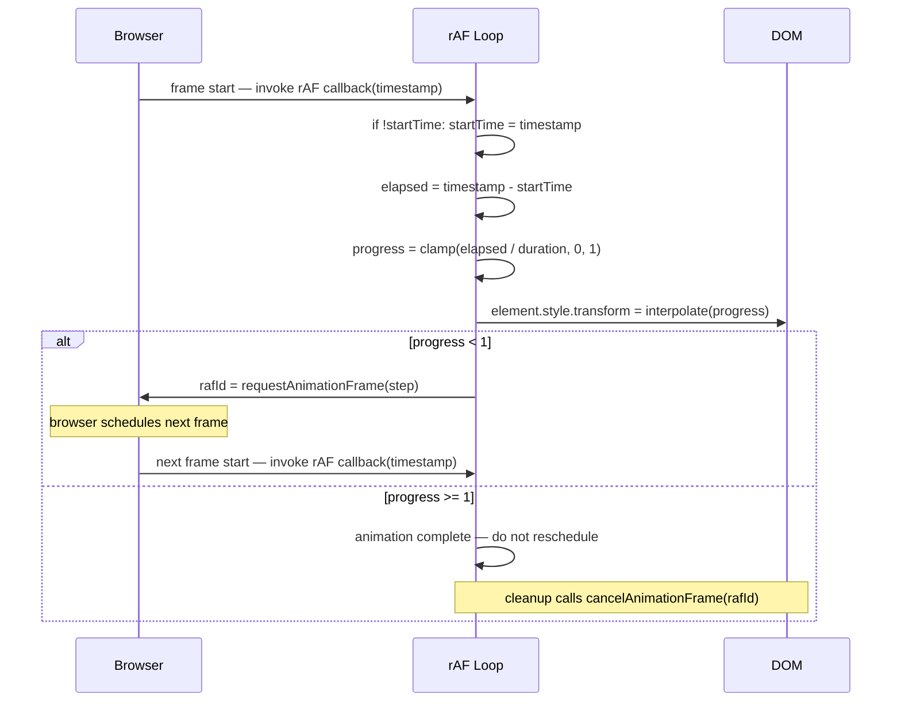

# `requestAnimationFrame` & Animation Timing

:::info
`requestAnimationFrame` is the browser's frame-synchronized scheduling API for
visual animations. It replaces `setInterval`/`setTimeout` for animation loops,
synchronizes JavaScript execution with the display refresh rate, and
automatically pauses when the tab is backgrounded. The callback receives a
`DOMHighResTimeStamp` for time-based, frame-rate-independent progress
computation.
:::

JavaScript animations driven by `setInterval` or `setTimeout` have a
fundamental problem: the timer fires at a fixed interval regardless of when
the browser is ready to paint. If the rendering pipeline is busy, the timer
fires anyway, scheduling a DOM mutation that will not be visible until the next
frame — causing dropped frames and jank. `requestAnimationFrame` (rAF) solves
this by letting the browser call your animation function at the beginning of
each frame, synchronized with the display refresh rate. This synchronization is
not merely a convenience; it is the mechanism that aligns JavaScript execution
with the browser's own rendering schedule, ensuring that every DOM mutation
made inside a rAF callback is eligible to appear in the very next paint.

rAF does not guarantee 60fps; it guarantees that the callback runs before the
next paint. On a 60Hz display, that is every ~16.7ms; on a 120Hz display,
every ~8.3ms; on a throttled background tab, much less frequently. rAF-driven
animations automatically pause when the tab is backgrounded, preventing
invisible animations from consuming CPU. This behavior is enforced by the
browser at the platform level — there is no code you need to write to achieve
it. The same frame budget that constrains animation work also constrains other
main-thread activity, so understanding rAF means understanding the frame budget
and what competes for time within it.

`performance.now()` provides high-resolution timestamps for measuring animation
progress independent of frame rate. The rAF callback receives a
`DOMHighResTimeStamp` argument, allowing animations to advance based on elapsed
time rather than frame count. This makes animations frame-rate independent: an
animation that takes one second completes in one second at both 30fps and
120fps. The timestamp argument is provided by the browser itself and reflects
the same time origin as `performance.now()`, carrying sub-millisecond
resolution and a monotonic guarantee. Teams that rely on this contract can
express animation curves, spring dynamics, and easing functions entirely in
terms of elapsed wall-clock time, decoupling the animation model completely
from the rendering cadence of the device.

## Principle

Engineers MUST drive JavaScript-based visual animations through
`requestAnimationFrame`, not `setInterval` or `setTimeout`. Timer-driven
animations are decoupled from the rendering pipeline. When the render thread is
busy, timer callbacks accumulate and fire back-to-back, producing bursts of DOM
mutations followed by silent frames. The result is jitter perceptible to users.
The only exceptions are cases where animation is better handled by CSS
(transitions and keyframe animations that can run on the compositor thread) or
by the Web Animations API, which itself uses the same frame-synchronization
mechanism as rAF under the hood. Any JavaScript code that reads a DOM value and
writes a DOM value in a loop to produce visual motion MUST use rAF as the
scheduling mechanism.

Engineers SHOULD express animation progress as a function of elapsed time
(`timestamp - startTime`) rather than frame count. Frame-count-based animations
run at different speeds on different devices. Time-based animations advance by
the same real-world milliseconds per frame regardless of display refresh rate.
This principle extends to any stateful animation model: physics simulations
SHOULD integrate over elapsed time, spring animations SHOULD update their
velocity and position based on elapsed seconds, and sequenced animations SHOULD
schedule their transitions by wall-clock delay rather than by counting frames.
The rAF timestamp argument is the canonical source of truth for elapsed time
within an animation loop; derive all temporal state from it rather than from
external clocks or manually tracked counters.

## Design Thinking

### The rAF callback loop

The standard rAF loop begins by calling `requestAnimationFrame` with a named
step function. When the browser is ready to paint the next frame, it invokes
that function and passes a `DOMHighResTimeStamp` as the first argument. Inside
the step function, the animation computes progress as
`(timestamp - startTime) / duration`, clamps the result to the range [0, 1]
to prevent overshooting when a frame is delayed, applies an easing function to
the clamped progress value, maps the eased progress to the animated property,
writes the result to the DOM, and — if progress has not yet reached 1 — calls
`requestAnimationFrame(step)` again to schedule the next iteration.

The return value of every `requestAnimationFrame` call is an integer handle
that identifies the pending callback in the browser's frame scheduling queue.
That handle MUST be stored in a variable accessible to the cleanup code,
because it is the sole argument to `cancelAnimationFrame(id)`. Calling
`cancelAnimationFrame` with the stored handle removes the pending callback
before it fires, cleanly terminating the loop without executing any further
animation logic or DOM updates. If the handle is not stored — for example,
because the call appears inline without an assignment — there is no way to
cancel the pending callback, and the animation loop will continue even after
the animated element has been removed from the document.

The `startTime` variable is typically initialized on the first frame rather
than before the loop begins, because there is an indeterminate delay between
calling `requestAnimationFrame` to start the loop and the browser delivering
the first timestamp. Initializing `startTime` from the first timestamp argument
ensures the animation does not start partway through due to setup latency. The
canonical pattern is `if (!startTime) startTime = timestamp;` as the first line
of the step function, followed immediately by the elapsed time calculation.

### requestIdleCallback

`requestIdleCallback` is the companion API for non-visual background work:
analytics batching, link prefetching, background computations, service worker
cache hydration, and non-urgent state serialization. While rAF fires at the
beginning of each frame to update what the user sees, `requestIdleCallback`
fires during idle periods between frames when the browser has spare time after
all pending rendering work is complete. The callback receives a `deadline`
object exposing a `timeRemaining()` method that returns the number of
milliseconds available before the browser needs to take control again.

Work performed inside an idle callback SHOULD check `deadline.timeRemaining()`
repeatedly and yield if the budget is exhausted, rather than running to
completion regardless of time pressure. A common pattern is to maintain a queue
of pending work items and process one item per `timeRemaining()` check,
yielding back to the browser when the deadline approaches and rescheduling via
another `requestIdleCallback` call for the remaining items. The `timeout`
option allows specifying a maximum wait time in milliseconds, after which the
callback is invoked regardless of whether the browser is idle — this prevents
critical but non-urgent work from being indefinitely deferred during sustained
high-activity periods.

`requestIdleCallback` is not universally available — as of 2026 it lacks
support in Safari — so production code MUST pair it with a `setTimeout`
fallback that schedules the work after a short delay when the API is absent.
The fallback cannot perfectly replicate idle scheduling semantics, but it
prevents the work from being silently skipped on unsupported browsers. A
typical shim checks `'requestIdleCallback' in window` and routes to either the
real API or a `setTimeout(callback, 0)` fallback accordingly.

### PerformanceObserver and paint timing

`PerformanceObserver` allows applications to observe browser-emitted
performance entries without polling. Subscribing with
`entryTypes: ['longtask']` surfaces tasks that block the main thread for more
than 50 ms — the threshold above which user input feels unresponsive and
animation callbacks are at risk of missing their frame deadline. Each
`PerformanceLongTaskTiming` entry includes a `duration` and a `startTime` that
can be correlated with rAF timestamps to identify which frames were dropped due
to long task interference.

The Long Animation Frames API (`entryTypes: ['long-animation-frame']`) extends
this concept to capture frames that took longer than 50 ms to render, providing
more actionable data than long tasks alone because it includes the rendering
work that follows the script execution. A
`PerformanceLongAnimationFrameTiming` entry reports the total frame duration,
the duration of script execution within the frame, the duration of style and
layout work, and the names of the scripts involved. This makes it practical to
identify whether a slow frame was caused by animation logic, a third-party
script, or expensive CSS recalculation.

`performance.measure(name, startMark, endMark)` creates a named
`PerformanceMeasure` entry spanning two user marks, enabling precise
instrumentation of individual animation phases. Pair
`performance.mark('raf:start')` at the top of the step function with
`performance.mark('raf:end')` at the bottom and call
`performance.measure('raf:frame', 'raf:start', 'raf:end')` to capture
per-frame timing. These measurements can be observed by a `PerformanceObserver`
subscribed to `entryTypes: ['measure']`, making it straightforward to stream
animation timing data to an analytics endpoint without blocking the loop.

### Scheduling APIs comparison

The browser provides three distinct scheduling APIs that serve different
purposes in the rendering pipeline. Understanding when to use each prevents
misapplication and the performance problems that follow.

| API | When it fires | Primary purpose | Tab backgrounded |
|---|---|---|---|
| `setInterval` / `setTimeout` | Fixed wall-clock interval | General async tasks | Continues (throttled in some browsers) |
| `requestAnimationFrame` | Before each paint | Visual animation | Pauses automatically |
| `requestIdleCallback` | When browser is idle | Background / non-visual work | May be deferred indefinitely |

Only `requestAnimationFrame` has a direct relationship with the rendering
pipeline. Timer APIs are scheduling tools for general asynchronous work; they
happen to work for animation in many conditions but break down under load.
`requestIdleCallback` is intentionally a low-priority queue that can be
deferred indefinitely when the device is busy, making it unsuitable for any
work that must complete before the user perceives a delay.

### CSS animations vs. JavaScript rAF

CSS animations and CSS transitions run on the compositor thread, a dedicated
rendering thread separate from the main JavaScript thread. Because
compositor-thread animations bypass JavaScript execution and main-thread layout
entirely, they continue to run smoothly even when the main thread is blocked by
a long task. Properties that can be composited without triggering layout or
paint — `opacity` and `transform` — are the canonical examples. Animating
`opacity` and `transform` via CSS keyframes or the Web Animations API on an
element that has a compositing layer produces animations entirely immune to
main-thread jank.

JavaScript rAF is appropriate for animations that require runtime logic:
physics simulations, spring dynamics, gesture-driven animations that read
pointer velocity, sequenced multi-element animations with interdependencies,
and any animation whose parameters depend on state that cannot be expressed in
a CSS keyframe at compile time. The Web Animations API
(`element.animate(keyframes, options)`) offers a middle path — it runs on the
compositor thread but accepts JavaScript objects as keyframes, allowing dynamic
keyframe generation without the jitter risk of a rAF loop. For animations
expressible as a finite set of keyframes, prefer the Web Animations API over a
manual rAF loop; reserve rAF for animations that genuinely require per-frame
JavaScript evaluation that cannot be precomputed.

## Best Practices

**MUST cancel `requestAnimationFrame` callbacks when the animated element is
removed from the DOM or the component is unmounted.** An rAF loop holding a
reference to a removed element prevents the element from being
garbage-collected and continues running JavaScript on every frame, consuming
CPU for work that produces no visible output. Store the return value of
`requestAnimationFrame` in a variable accessible to the cleanup function —
typically a variable in the enclosing scope or a ref in a React component —
and call `cancelAnimationFrame(id)` in component unmount, element removal, or
animation completion handlers. In React, the canonical pattern is to return the
cancellation function from `useEffect`: the effect body starts the loop and
returns `() => cancelAnimationFrame(rafId)`, which React calls when the
component unmounts or the effect dependencies change. In Web Components,
`disconnectedCallback` is the correct lifecycle method for the cancel call.
Failure to cancel is a silent memory and CPU leak that only manifests under
repeated mount/unmount cycles.

**SHOULD avoid reading layout properties (`offsetWidth`,
`getBoundingClientRect`, `scrollTop`) and writing DOM properties in the same
rAF callback.** Reading a layout property after writing forces a synchronous
layout recalculation — a forced reflow or layout thrash. The browser must flush
the pending style and layout work to return a correct measurement, interrupting
the rendering pipeline and consuming time that would otherwise be available for
the current frame. In an animation running at 60fps with a 16.7ms budget, a
forced reflow that takes 5ms consumes nearly a third of the entire frame budget
before the actual animation write has been applied. Batch all reads before all
writes within a single callback: read all required measurements at the top,
compute the new values, then apply all DOM writes at the end. If the read and
write concerns belong to different parts of the codebase, coordinate them
through a shared frame scheduler rather than allowing each consumer to
independently read and write in arbitrary order within the same frame.

**SHOULD use `performance.now()` for measuring durations in animation loops
rather than `Date.now()`.** `performance.now()` provides sub-millisecond
resolution and is monotonically increasing, meaning it never jumps backward or
skips forward due to system clock adjustments made by NTP or manual
configuration. `Date.now()` has millisecond resolution and is subject to clock
skew, making it unsuitable for measuring animation durations where sub-frame
accuracy matters. The timestamp argument passed to the rAF callback is already
a `DOMHighResTimeStamp` with the same characteristics as `performance.now()` —
same time origin, same resolution, same monotonic guarantee — so animation
loops that derive elapsed time solely from the rAF timestamp argument inherit
the high resolution without needing to call `performance.now()` separately.
Use `performance.now()` explicitly only when measuring durations that span
outside the rAF callback itself, such as total animation setup time or
time-to-first-frame latency.

**SHOULD check `deadline.timeRemaining()` inside `requestIdleCallback` and
yield when the budget is exhausted.** Idle callbacks run in spare time between
frames, but that spare time is bounded. A callback that performs a long
synchronous computation without checking the remaining time budget will block
the next frame's rendering work if it overruns the idle window. Maintain a
queue of pending work items, process one item per check, and reschedule the
remaining items via another `requestIdleCallback` call when `timeRemaining()`
returns zero. For environments where `requestIdleCallback` is unavailable —
Safari as of 2026 — fall back to `setTimeout(callback, 0)` to prevent silent
failures, accepting that the fallback does not provide true idle scheduling
semantics.

## Visual



## Example

```js
function animate(element) {
  const duration = 1000; // 1 second
  let startTime = null;
  let rafId;

  function step(timestamp) {
    if (!startTime) startTime = timestamp;
    const elapsed = timestamp - startTime;
    const progress = Math.min(elapsed / duration, 1);
    element.style.transform = `translateX(${progress * 300}px)`;

    if (progress < 1) {
      rafId = requestAnimationFrame(step);
    }
  }

  rafId = requestAnimationFrame(step);

  // Return cleanup function for component unmount
  return () => cancelAnimationFrame(rafId);
}
```

## Common Mistakes

**Using `setInterval` for animations.** `setInterval` fires at a fixed
wall-clock interval with no awareness of the browser rendering pipeline. When
the system is under load, pending interval callbacks queue up and fire in rapid
succession once the main thread becomes available, producing a burst of DOM
mutations with no visual output between them. The browser paints only at its
own cadence, so back-to-back interval callbacks produce multiple DOM mutations
that collapse into a single visual frame, followed by one or more frames with
no DOM change — the hallmark of jank. rAF is the correct primitive because the
browser only invokes the callback when it is about to paint, ensuring a
one-to-one correspondence between JavaScript execution and rendered frames.

**Forgetting to cancel rAF on component unmount.** An rAF loop continues to
run after the element it animates has been removed from the document. The loop
holds a reference to the element through the closure, preventing garbage
collection of both the element and all objects reachable from it. Meanwhile,
the step function continues to execute on every frame, performing style
mutations on a detached element and consuming CPU budget that should be
available to other work. The only observable symptom in most cases is a
degraded frame rate for other animations and reduced battery life. Always pair
every `requestAnimationFrame` call with a corresponding `cancelAnimationFrame`
in the cleanup path, and verify the cleanup runs correctly under repeated
mount/unmount cycles.

**Using frame count instead of elapsed time.** An animation that advances by a
fixed amount per frame runs at double speed on a 120Hz display compared to a
60Hz display, and at half speed when the frame rate drops to 30fps due to
system load. The same animation will complete in 500ms on a high-refresh-rate
device and in 2000ms on a device throttled to 30fps. Expressing progress as
`(timestamp - startTime) / duration` makes the animation run for the same
wall-clock duration regardless of the display refresh rate or instantaneous
frame rate, ensuring consistent user experience across devices.

**Reading `getBoundingClientRect` and then writing `style` in the same
callback.** Any layout-property read that follows a DOM write forces the
browser to flush its pending layout work before returning the measurement — a
synchronous reflow that can consume several milliseconds per occurrence. Inside
an rAF callback that is already time-constrained to the frame budget, a forced
reflow can exhaust the remaining budget before the animation write has been
applied, causing the frame to miss its deadline and the next frame to start
late. Restructure callbacks to perform all reads first, then all writes, and if
possible hoist reads that do not depend on animation state out of the callback
entirely.

## Related FEEs

- [FEE-400 — Browser APIs & Web Platform Overview](./400.md)
- [FEE-710 — GPU-Accelerated Animations & `will-change`](../Rendering%20and%20Performance/710.md)
- [FEE-712 — Critical Rendering Path & Paint Timing](../Rendering%20and%20Performance/712.md)

## References

- MDN: requestAnimationFrame — https://developer.mozilla.org/en-US/docs/Web/API/Window/requestAnimationFrame
- MDN: requestIdleCallback — https://developer.mozilla.org/en-US/docs/Web/API/Window/requestIdleCallback
- web.dev: Rendering performance — https://web.dev/articles/rendering-performance
- MDN: performance.now() — https://developer.mozilla.org/en-US/docs/Web/API/Performance/now
