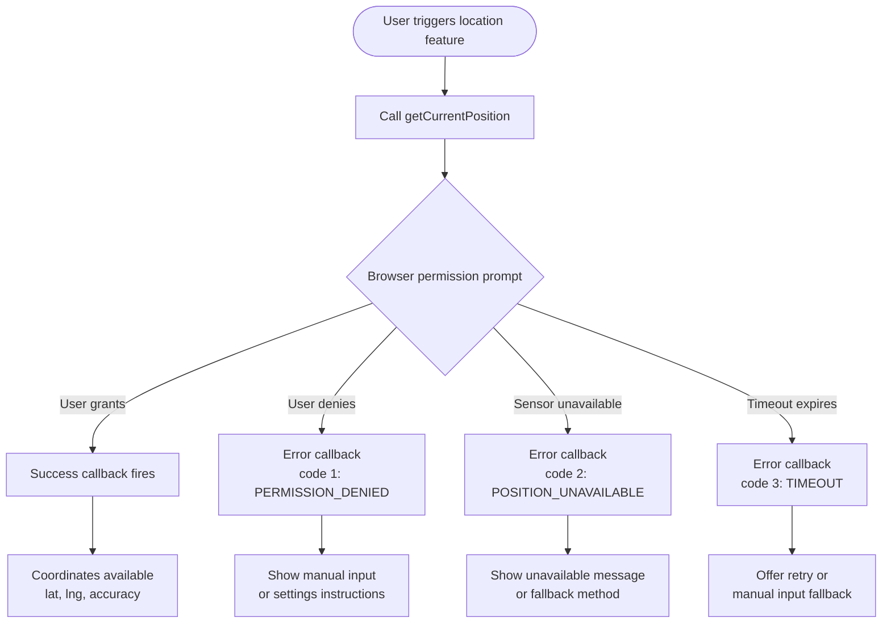

# Geolocation, Device Orientation & Device APIs

The Geolocation API, Device Orientation API, and Device Motion API expose
hardware sensors to web applications. Geolocation provides latitude, longitude,
altitude, heading, and speed from GPS, Wi-Fi triangulation, or cell tower data.
`DeviceOrientationEvent` provides spatial orientation via the accelerometer and
gyroscope. `DeviceMotionEvent` provides raw acceleration and rotation rate data.
Together these APIs form the bridge between the physical environment and the
browser, enabling location-aware services, augmented reality overlays, compass
interfaces, and motion-driven interactions without requiring a native application
wrapper.

All of these APIs require explicit user permission. Browsers will not grant
access to location or motion sensors without a permission prompt, and the
permission must be requested in response to a user gesture on most platforms.
Applications that try to access location silently or on page load without a
clear user-facing reason will be blocked. iOS Safari 13 and later additionally
requires a programmatic call to `DeviceOrientationEvent.requestPermission()`
initiated from a user gesture before motion sensor events fire at all — the
event listeners themselves are insufficient.

The practical challenge is handling the full permission lifecycle — requesting,
receiving, handling denial, and requesting again appropriately — while providing
a useful experience when sensors are unavailable on desktop browsers without GPS
or for users who decline. Progressive enhancement is the guiding principle: the
feature works without the sensor; the sensor makes it better. A location-aware
store finder that falls back to a postcode input field when permission is denied
is more useful than one that simply renders an empty state.

## Design Thinking

### One-time vs. continuous position

`getCurrentPosition` retrieves a single position fix and calls the success
callback once. It is the correct choice for features that need location at a
specific moment: finding nearby places, tagging a form submission with
coordinates, or populating a shipping address field. The browser queries the
available position sources, waits for a fix within the configured timeout, and
delivers the result.

`watchPosition` installs a continuous listener that fires the success callback
each time the device position changes beyond a threshold. It returns a numeric
watch ID that MUST be stored for later cleanup. When continuous tracking is no
longer needed — because the user navigated away from the tracking feature, the
component unmounted, or the session ended — `navigator.geolocation.clearWatch(watchId)`
stops the listener and releases the underlying hardware resources. Leaving
`watchPosition` active when the feature is not visible to the user keeps GPS
hardware polling in the background, which is one of the fastest ways to drain
mobile battery. The rule is straightforward: activate `watchPosition` when the
feature requiring live location becomes visible, and call `clearWatch`
immediately when it is no longer visible.

### PositionOptions

`getCurrentPosition` and `watchPosition` both accept a `PositionOptions` object
as a third argument. The three properties — `enableHighAccuracy`, `timeout`, and
`maximumAge` — control the accuracy, latency, and freshness trade-offs of every
position request.

`enableHighAccuracy: true` requests a GPS fix when possible rather than relying
on Wi-Fi triangulation or cell tower data. GPS provides a horizontal accuracy of
roughly 3–5 metres in open sky versus 20–300 metres for network-based
positioning. The cost is battery consumption and acquisition latency: GPS cold
starts can take 30–60 seconds while the receiver locks onto satellites. Use
`enableHighAccuracy: true` only when precision matters — turn-by-turn navigation,
surveying, sports tracking — and leave it `false` for store finders and weather
features where city-level accuracy is sufficient.

`timeout` defines the maximum milliseconds the browser may spend acquiring a
position before the error callback fires with code `TIMEOUT` (3). Without a
timeout, a GPS cold start on a device with no network fallback can leave the
user staring at a loading indicator for over a minute. A value of 5000–10000
milliseconds gives GPS a reasonable chance to acquire a fix while bounding the
worst-case wait. The `TIMEOUT` error handler should fall back to a less accurate
method or prompt the user to try again.

`maximumAge` specifies the maximum acceptable age in milliseconds of a cached
position. If the device has a position fix no older than `maximumAge`, the
browser delivers it immediately without querying hardware. Setting
`maximumAge: 60000` means a position acquired within the last minute is
considered fresh enough for most non-navigation use cases, avoiding the latency
and battery cost of a new hardware query entirely. Sensible defaults for most
applications are `{ enableHighAccuracy: false, timeout: 8000, maximumAge: 60000 }`.

### DeviceOrientationEvent and DeviceMotionEvent

`DeviceOrientationEvent` fires continuously as the device's spatial orientation
changes. It exposes three Euler angles: `alpha` (rotation around the Z axis,
0–360 degrees, equivalent to compass heading when `absolute` is true), `beta`
(front-to-back tilt, -180 to 180 degrees), and `gamma` (left-to-right tilt,
-90 to 90 degrees). The `absolute` property on the event distinguishes
device-relative orientation from compass-absolute orientation. A `gamma` value
of zero means the device is held flat; a value near 90 means it is held upright.
Use cases include AR overlay alignment, compass UI components that rotate to face
north, and tilt-to-scroll or tilt-to-pan interfaces.

`DeviceMotionEvent` reports raw sensor data rather than computed orientation: the
`acceleration` property gives X, Y, and Z acceleration excluding gravity;
`accelerationIncludingGravity` includes the gravitational vector; and
`rotationRate` provides alpha, beta, and gamma rotation rates in degrees per
second. These values are useful for step counting, shake detection, and inertial
navigation where the raw sensor stream is more informative than the filtered
orientation angles. Both events are rate-limited by the browser; the typical
interval is around 16ms (roughly 60Hz), though this varies by device and browser.

iOS 13 and later requires explicit permission for `DeviceOrientationEvent` and
`DeviceMotionEvent`. The permission request is made via
`DeviceOrientationEvent.requestPermission()`, which returns a Promise that
resolves to `'granted'` or `'denied'`. This call MUST be made in response to a
user gesture — it cannot be invoked programmatically on page load. Android and
desktop browsers grant motion events without a separate permission step, but the
iOS requirement means any cross-platform code MUST check for the method's
existence and call it when present.

### HTTPS requirement

All device sensor APIs require a secure context. The Geolocation API,
`DeviceOrientationEvent`, and `DeviceMotionEvent` are each restricted to pages
served over HTTPS or from `localhost`. Plain HTTP pages cannot access any of
these APIs regardless of user permission state: the browser refuses the API
entirely, and permission prompts are never shown. This restriction is enforced
at the browser level and cannot be bypassed in JavaScript. It must be addressed
in the deployment configuration — all pages using these APIs must be served
over HTTPS. Staging environments that use plain HTTP will see the APIs silently
unavailable, which can mask bugs until production deployment.

### Progressive enhancement pattern

Because location and motion access can be denied by the user, blocked by the browser, or unavailable on the device (most desktops lack GPS hardware), the overarching design pattern for all APIs in this article is progressive enhancement. The baseline experience must be fully functional without sensor data: a store finder shows a search field; a navigation feature shows a manual address entry form; a tilt-based game shows on-screen controls. The sensor-enhanced layer is an improvement over the baseline — faster, more convenient, or more immersive — not a prerequisite for the feature to work at all.

Practically, this means the code path that calls `getCurrentPosition` or registers a `deviceorientation` listener is always preceded by a feature-detection check (`'geolocation' in navigator`, `'DeviceOrientationEvent' in window`) and always accompanied by an error handler that activates the fallback UI. The fallback must cover three distinct failure states: the API being absent on the device, the permission being denied, and the sensor being temporarily unavailable. Each state can render a different but equally functional UI — the important constraint is that no state results in an empty screen or a stuck loading indicator with no recovery path for the user.

Permission state persistence across sessions is another dimension to plan for. When a user grants geolocation permission, the browser remembers that decision for the origin and does not re-prompt on subsequent visits. When a user denies permission, many browsers equally persist that denial. The Permissions API (FEE-415) can be used to query the current permission state synchronously via `navigator.permissions.query({ name: 'geolocation' })` before calling `getCurrentPosition`, allowing the application to route to the fallback UI immediately without waiting for the error callback to fire. Checking permission state proactively is particularly useful in single-page applications where the geolocation feature may be reached by navigating between routes — the application can display the correct UI state without briefly showing a loading spinner before the permission check resolves.

The `onchange` handler on the `PermissionStatus` object returned by `navigator.permissions.query` also allows the application to react dynamically if the user revokes location permission while the feature is active — for example, by opening browser settings from another tab and toggling the permission off. Subscribing to permission state changes allows a `watchPosition` consumer to detect mid-session revocation and gracefully switch to the fallback UI without waiting for the next GPS callback to fail.

### Accuracy and source of position data

The position returned by `getCurrentPosition` may come from GPS satellites, Wi-Fi access point triangulation, cell tower data, or a combination of all three, depending on what signals are available to the device. The `coords.accuracy` property on the `GeolocationCoordinates` object reports the estimated horizontal accuracy in metres; a value of 5 means the true position is within 5 metres of the reported coordinates with 95% confidence. Applications that display the position on a map should use `coords.accuracy` to render an uncertainty circle rather than a single pin, giving users an accurate visual representation of how precise the reported location is. For applications that require sub-10-metre accuracy, `enableHighAccuracy: true` is necessary, but its effect depends on the hardware — a laptop or desktop without a GPS receiver will not improve its accuracy regardless of the setting, and the value of `coords.accuracy` for such devices typically remains in the hundreds of metres.

Similarly, `coords.altitude` and `coords.altitudeAccuracy` may be `null` on devices that do not report altitude — most mobile devices with GNSS receivers report altitude, but network-based positioning sources typically do not. Always null-check altitude before use. The `coords.heading` and `coords.speed` properties are equally optional and may be `null` when the device is stationary or when the position source does not provide velocity data.

## Best Practices

**MUST request Geolocation permission only after explaining to the user why
location data is needed and what it will be used for.** Permission prompts that
appear without context are dismissed at high rates, and in many browsers a single
dismissal permanently blocks further prompts for that origin. A brief explanation
before triggering the permission prompt — displayed inline next to the button
that will trigger the request — gives users the information they need to make an
informed decision and substantially improves acceptance rates. Informed consent
is not a courtesy; on some platforms it is a legal requirement under data
protection regulation.

**SHOULD specify a `timeout` value in `getCurrentPosition` options to prevent
indefinite loading states.** Without a timeout, the browser may wait for GPS
hardware indefinitely — GPS cold starts can take over 30 seconds and occasionally
fail to acquire a fix at all in poor signal conditions. A timeout of 5–10 seconds
with a `TIMEOUT` error handler that falls back to a less accurate method or
presents a manual input form provides a bounded, predictable user experience.
Never leave the `timeout` property unset in production code where location
requests are visible to users.

**MUST call `clearWatch` on the return value of `watchPosition` when continuous
position tracking is no longer needed.** `watchPosition` continues querying
location hardware until explicitly stopped, draining battery on mobile devices
even when the feature requiring live location is no longer visible. Store the
watch ID returned by `watchPosition` in a variable accessible to the cleanup
code, and call `navigator.geolocation.clearWatch(watchId)` on component unmount,
route change, or feature deactivation. In React, the canonical cleanup pattern
is to return the clearWatch call from `useEffect`. Failing to clean up is a
silent resource leak with a direct impact on device battery life that is
difficult to detect in development but measurable in production.

**MUST handle all three `PositionError` codes: `PERMISSION_DENIED` (1), `POSITION_UNAVAILABLE` (2), and `TIMEOUT` (3).** Each error code represents a distinct failure mode requiring a distinct user-facing response: code 1 requires instructions to enable location in browser or OS settings; code 2 requires a fallback input method (such as a postcode field) because the device cannot determine its position regardless of permission state; code 3 requires a retry option or a less accurate fallback, because the fix timed out but may succeed on a subsequent attempt. Applications that omit the error callback, or that pass a single generic handler that does not branch on the error code, leave users with an indefinite loading state and no recovery path. The `err.message` property is not standardized across browsers and must not be used as the primary error text shown to users.

**SHOULD check for `DeviceOrientationEvent.requestPermission` before attaching
orientation event listeners on iOS.** On iOS 13 and later, motion events are
gated behind an explicit permission call that must originate from a user gesture.
Attaching listeners without calling `requestPermission` first produces no errors
and no events on iOS, making the failure invisible without cross-device testing.
Wrap the listener registration in a check: if `typeof
DeviceOrientationEvent.requestPermission === 'function'`, call it and await the
result before adding the event listener. On platforms where the method does not
exist, skip the permission call and attach the listener directly.

## Visual



## Example

```js
function getUserLocation() {
  return new Promise((resolve, reject) => {
    if (!navigator.geolocation) {
      reject(new Error('Geolocation not supported'));
      return;
    }
    navigator.geolocation.getCurrentPosition(
      (pos) => resolve({
        lat: pos.coords.latitude,
        lng: pos.coords.longitude,
      }),
      (err) => {
        const messages = {
          1: 'Permission denied — enable location in browser settings',
          2: 'Position unavailable — no location fix',
          3: 'Timeout — location request took too long',
        };
        reject(new Error(messages[err.code] ?? 'Unknown error'));
      },
      { enableHighAccuracy: false, timeout: 8000, maximumAge: 60000 }
    );
  });
}
```

## Common Mistakes

**Requesting geolocation on page load.** When a permission prompt fires
immediately on page load with no user interaction, users have no context for why
their location is being requested. Dismissal rates are high, and a single
dismissal in many browsers permanently blocks the prompt for that origin, making
it impossible to request location again without the user manually resetting
permissions in browser settings. The correct pattern is to display an
explanation adjacent to the button that will trigger the feature, and call
`getCurrentPosition` only inside that button's event handler. This ensures the
permission prompt appears with clear intent and at a moment the user expects
something to happen.

**Not handling all three `PositionError` codes.** The error callback receives a
`GeolocationPositionError` with a `code` property of 1, 2, or 3. Code 1 means
the user denied the permission; code 2 means the device cannot determine its
position; code 3 means the request timed out. Applications that treat the error
callback as a catch-all with a single generic message — or omit it entirely —
leave users with no actionable information and the UI frozen in a loading state.
Each error code requires a distinct response: code 1 needs instructions to
enable location in settings, code 2 needs a fallback input method, code 3 needs
a retry option. The `err.message` property is not standardized across browsers
and MUST NOT be used as the primary error description shown to users.

**Leaving `watchPosition` active after component unmount.** A `watchPosition`
listener that is never stopped continues polling location hardware indefinitely.
On mobile devices with GPS, this is a meaningful battery drain that affects the
entire device, not just the browser tab. It also means that the success callback
fires into a component that may no longer exist, potentially causing state
updates on unmounted components and triggering warnings in React's strict mode.
Always pair every `watchPosition` call with a `clearWatch` call in the
corresponding cleanup path, and verify cleanup runs correctly under repeated
mount and unmount cycles in development.

**Assuming geolocation works on plain HTTP pages.** The Geolocation API and
motion sensor events are restricted to secure contexts. An application tested
locally over HTTP will find these APIs silently unavailable. If staging is served
over HTTP, geolocation bugs will not surface until the production deployment.
Verify that all environments serving pages that use these APIs are configured for
HTTPS.

**Not accounting for the iOS motion permission requirement.** Registering a
`deviceorientation` or `devicemotion` event listener is sufficient on Android
and desktop browsers, but on iOS 13 and later the events do not fire until
`DeviceOrientationEvent.requestPermission()` has been called and resolved with
`'granted'`. Code that works on Android and fails silently on iOS typically
omits this check. The correct approach is to detect whether
`DeviceOrientationEvent.requestPermission` is a function, and if so, call it
from a user gesture before attaching the event listener. Without this guard,
motion-based features are silently broken for all iOS Safari users.

## Related FEEs

- [FEE-400 — Browser APIs & Web Platform Overview](./400.md)
- [FEE-415 — Permissions API](./415.md)
- [FEE-1202 — Authentication & Token Storage](../Security/1202.md)

## References

- MDN: Geolocation API — https://developer.mozilla.org/en-US/docs/Web/API/Geolocation_API
- MDN: DeviceOrientationEvent — https://developer.mozilla.org/en-US/docs/Web/API/DeviceOrientationEvent
- MDN: DeviceMotionEvent — https://developer.mozilla.org/en-US/docs/Web/API/DeviceMotionEvent
- W3C Geolocation API — https://w3c.github.io/geolocation/
- MDN: Permissions API — https://developer.mozilla.org/en-US/docs/Web/API/Permissions_API
