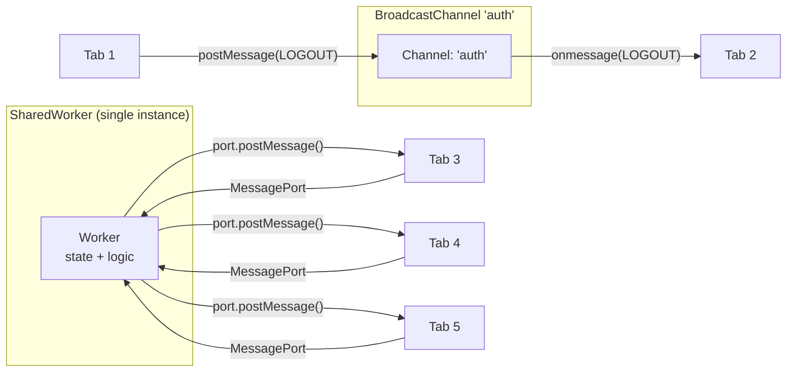

# [FEE-414] Broadcast Channel & SharedWorker

:::info
When a user opens multiple tabs of the same origin, each tab is an independent JavaScript execution context: logging in on one tab does not refresh session state on the others, and a cart update on one tab is invisible to the rest. Two APIs coordinate state across tabs. `BroadcastChannel` is a fire-and-forget message bus for event notification, constructible in two lines with no worker script. `SharedWorker` is a single worker instance shared by every same-origin tab that can hold state and reply individually to each connection, at the cost of a separate script file and explicit port lifecycle management. This article covers when to reach for each, the SharedWorker connection lifecycle most implementations get wrong, and the current mobile support picture for both.
:::

## Context

`BroadcastChannel` is a pub/sub mechanism: any tab with a channel of the same name receives messages posted to that channel by any other tab. It is a fire-and-forget broadcast bus: the sender does not receive its own messages, and there is no request/response pattern. It is appropriate for notifications, for example telling every tab that the user just logged out so each one redirects to the login page.

`SharedWorker` is a Web Worker that persists as a single shared instance across all tabs from the same origin. Each tab connects to the same worker via a `MessagePort`. The worker can maintain state, coordinate requests, and reply individually to each connected tab. It is appropriate for shared caches, WebSocket connection pooling, and scenarios where duplicating work across tabs is expensive.

Both APIs are same-origin and scoped to a single browser profile. They do not work across browser windows opened by different user profiles, between private and regular browsing modes, or across origins. Understanding these boundaries upfront prevents two common architecture mistakes: delegating cross-origin communication to BroadcastChannel, or assuming mobile compatibility without checking it.

A common trigger for choosing between the two is session management: logging out in one tab should log the user out of every other open tab of the same application, with no server-side push mechanism available. `BroadcastChannel` solves this directly. The logout event posted in one tab arrives at every other tab immediately, letting each one clear its session state without a server round-trip. The Example section below builds this scenario out in code, then adds the SharedWorker equivalent for a case that needs shared state rather than a one-off notification.

## Visual



## Example

### BroadcastChannel: cross-tab logout

```js
// Producer — any tab after successful logout
const logoutChannel = new BroadcastChannel('auth');
logoutChannel.postMessage({ type: 'LOGOUT', timestamp: Date.now() });
logoutChannel.close(); // close immediately after sending

// Consumer — all other tabs
const authChannel = new BroadcastChannel('auth');
authChannel.onmessage = (event) => {
  if (event.data.type === 'LOGOUT') {
    // Clear local session state and redirect
    clearSessionState();
    window.location.assign('/login');
  }
};
// Cleanup on page unload
window.addEventListener('pagehide', () => authChannel.close());
```

### SharedWorker: pooled connection with per-tab ports

The worker script owns the shared state (here, a connected-tab count) and replies to each tab through its own `MessagePort`:

```js
// shared-worker.js -- runs once, shared by every same-origin tab
const ports = new Set();

self.onconnect = (event) => {
  const port = event.ports[0];
  ports.add(port);

  port.onmessage = (messageEvent) => {
    if (messageEvent.data.type === 'DISCONNECT') {
      ports.delete(port);
      return;
    }
    if (messageEvent.data.type === 'PING') {
      port.postMessage({ type: 'PONG', connectedTabs: ports.size });
    }
  };

  // Required when message handling is wired with addEventListener instead
  // of assigning onmessage directly; ports start paused otherwise.
  port.start();

  port.postMessage({ type: 'WELCOME', connectedTabs: ports.size });
};
```

```js
// main.js -- any tab that wants to join the shared worker
const worker = new SharedWorker('/shared-worker.js');

worker.port.onmessage = (event) => {
  console.log(`Connected tabs: ${event.data.connectedTabs}`);
};

worker.port.postMessage({ type: 'PING' });

// The worker has no built-in way to detect a closing tab; tell it explicitly.
window.addEventListener('pagehide', () => {
  worker.port.postMessage({ type: 'DISCONNECT' });
});
```

## Best Practices

**SHOULD close `BroadcastChannel` instances when they are no longer needed.**
`channel.close()` removes the channel from the broadcast group and releases its
resources. Components or services that create channels dynamically must close
them on cleanup to prevent garbage-collected components from continuing to receive
messages and leaking handlers. The correct pattern in a component-based UI is to
call `channel.close()` in the component's unmount or destroy lifecycle hook, and
in vanilla JavaScript to call it in a `pagehide` event listener. A channel that
is never closed continues to hold a reference in the browser's channel registry
for the lifetime of the page, and its `onmessage` handler will continue firing on
every subsequent broadcast to that channel name.

**SHOULD use `SharedWorker` to deduplicate expensive shared resources, such as
WebSocket connections, persistent polling, and shared IndexedDB access, rather
than creating one resource per tab.** Multiple tabs each opening a WebSocket to
the same server multiplies server connection load proportionally to the number
of open tabs. A single SharedWorker WebSocket serves all tabs with one connection,
and the Worker fans out updates to each tab's port. This also simplifies
reconnection logic: only the Worker needs to implement reconnection; tabs simply
receive messages. The same pattern applies to polling intervals: one Worker polls
on behalf of all tabs, and tabs subscribe to its results, eliminating redundant
network requests and preventing the thundering-herd problem where all tabs fire
simultaneous requests on the same interval.

**MUST use structured-cloneable values in all `BroadcastChannel.postMessage` and
SharedWorker port messages.** Functions, DOM nodes, and class instances with
prototype methods cannot be transferred across execution contexts. Attempting to
post a non-cloneable value throws a `DataCloneError` synchronously. The Structured
Clone algorithm accepts plain objects, arrays, `Map`, `Set`, `Date`, `RegExp`, and
`ArrayBuffer`, among other built-in types. Transferable objects such as
`ArrayBuffer` and `MessagePort` are a separate, narrower capability: instead of
copying, ownership moves from sender to receiver. When working with class
instances, serialize them to plain objects before posting and reconstruct them on
the receiving side. Design message schemas as plain data envelopes with a `type`
string discriminant and a `payload` field to keep message handling explicit and
serialization boundaries clear.

## Design Thinking

### Choosing the right cross-tab mechanism

The decision between BroadcastChannel and SharedWorker reduces to a single axis: does the cross-tab communication require shared state or only event delivery? BroadcastChannel is a message bus: it delivers a payload to all listening tabs and immediately forgets it. A BroadcastChannel keeps nothing beyond that delivery; there is no way to ask it for the last message it sent. SharedWorker is a computation host: it holds state, responds individually to each connected tab, and persists across individual tab closures as long as at least one tab remains connected.

A practical test: if removing all open tabs and reopening one should restore the previous cross-tab state, SharedWorker (or IndexedDB with BroadcastChannel for notification) is necessary. If losing state between sessions is acceptable because a server response will re-derive it on the next request, BroadcastChannel is sufficient. Another test: if tabs need to query the current state rather than just receive updates, SharedWorker is the correct choice because it can maintain and return a canonical value; BroadcastChannel has no query semantics, only broadcast.

When in doubt about complexity budget, start with BroadcastChannel. It is simpler to debug, requires no worker file, and handles the majority of real-world cross-tab coordination needs. SharedWorker introduces a separate script lifecycle, port management, and debugging across inspector contexts that substantially increases the maintenance surface. Add SharedWorker only when the stateful resource sharing justification is concrete. Most applications that believe they need SharedWorker actually need BroadcastChannel plus a server-backed source of truth.

Mobile support is one more input to this decision, though it is a smaller constraint than it once was; see "Browser support and debugging" below for the current iOS and Android numbers. For the aging tail of browsers that still lack SharedWorker, the common pattern is to put the shared-resource abstraction behind an interface, implement it with SharedWorker where available, and fall back to a per-tab implementation coordinated over BroadcastChannel where it is not. Feature-detecting `'SharedWorker' in window` before construction is mandatory regardless of how small that tail is.

### Leader election and off-the-shelf alternatives

SharedWorker is not the only tool for the "which tab owns the shared WebSocket" problem the Best Practices section above poses. The Web Locks API lets every tab race to acquire a named lock via `navigator.locks.request()`; exactly one tab wins and holds the lock until it releases or closes, with the browser handling the queue. This works even on browsers that lack SharedWorker, since Web Locks carries none of the mobile gaps described below, and it needs no separate worker script for teams that only need leader election rather than a persistent shared computation host. See [FEE-1314](../Progressive%20Web%20Apps%20and%20Offline/web-locks-api.md) for the full API.

Teams that would rather not hand-roll the fallback-plus-leader-election combination can reach for the `broadcast-channel` npm package. It wraps the native BroadcastChannel API with a `localStorage`/IndexedDB fallback for environments that lack it, plus a leader-election helper that uses Web Locks internally where available. That is the native API plus the fallback this article's Common Mistakes section describes assembling by hand, with leader election added on top.

### BroadcastChannel vs. localStorage events

`localStorage` fires a `storage` event in other tabs when values change. This is
the pre-BroadcastChannel approach. The `storage` event has significant
limitations: it delivers only a string value via `event.newValue`, requires the
receiving tab to parse and interpret it, and the emitting tab itself does not
receive the event. BroadcastChannel is more explicit: channels are named and
scoped to a single purpose, and it supports arbitrary serializable values without
string conversion. Critically, BroadcastChannel does not persist state to disk;
it is a transient communication channel. If persisted state is required alongside
cross-tab notification, BroadcastChannel for the notification and IndexedDB or
localStorage for the persisted value is the correct combination.

Another meaningful difference is semantics. A `storage` event carries both the
key that changed and the previous and new values: it is inherently a property
mutation notification. BroadcastChannel carries whatever payload the sender
chooses, which makes it suitable for event-driven designs where the message
represents a domain event (`{ type: 'SESSION_EXPIRED', userId: '...' }`) rather
than a property mutation. This distinction matters when multiple listeners need to
react differently to the same domain event, or when the event payload must carry
context that has no natural home in a localStorage key-value entry. The named
channel also acts as a natural grouping: all auth-related cross-tab events travel
on the `'auth'` channel, keeping the message space organized and debuggable.

### SharedWorker port lifecycle

Each tab gets a `MessagePort` via the `connect` event on the SharedWorker. The
Worker registers an `onconnect` handler, inside which it receives the port and
attaches an `onmessage` handler to it. The port reference is the only means by
which the Worker can reply to that specific tab. Ports close when their owning
tab closes; the Worker itself has no built-in mechanism to detect this: a
disconnecting tab does not fire an explicit disconnect event. The conventional
pattern is for tabs to post a final `DISCONNECT` message before unloading, though
`pagehide` is unreliable in some browsers. The Worker terminates automatically
when all connected ports have closed and no other activity is keeping it alive.

In practice, Workers that maintain a list of connected ports for fan-out messaging
must handle the case where a port becomes dead without sending a `DISCONNECT`
message. The way this manifests is a `postMessage` call on a dead port throwing
an error, or more commonly, the dead port silently accepting the message with no
observable effect. Wrapping per-port `postMessage` calls in a try/catch and
removing ports that throw is a defensive pattern for long-lived Workers that serve
many transient tabs. The Worker should store ports in a `Set`, remove a port on
caught errors, and periodically send a heartbeat message with a response
requirement to proactively detect and evict stale ports.

A tab that reloads reconnects to the same running Worker instance, but under a
brand-new port object; the Worker persists across the reload, while the port does
not. If the Worker keeps per-port state such as an auth token or a subscription
list, that state does not survive the swap automatically, since the new port is a
different object from the old one even though it originates from the same tab.
Treating the first message on a new port as a handshake that carries whatever
context the tab needs restored is what makes reconnection reliable instead of
silently dropping state.

### Service Worker as an alternative

Service Workers can broadcast to all controlled clients via `clients.matchAll()`
and `client.postMessage()`. They persist across tab closures and can initiate
communication unprompted, including waking tabs from push notifications. The
distinction from BroadcastChannel and SharedWorker is architectural: those two
mechanisms are tabs talking to tabs, or tabs sharing a background thread. A
Service Worker is an interceptor and background service that sits between the
browser and the network. Use a Service Worker when offline caching, push
notifications, or background sync are requirements; use BroadcastChannel or
SharedWorker when the need is purely cross-tab coordination within an active
session.

Service Workers introduce a registration and activation lifecycle with states
(`installing`, `waiting`, `active`) that do not apply to BroadcastChannel or
SharedWorker. A newly installed Service Worker does not immediately control
existing tabs: it waits until tabs are reloaded or until `skipWaiting` is called.
This lifecycle complexity is unnecessary overhead when the goal is simply notifying
open tabs about an auth state change. Choosing the right tool means matching the
mechanism to the problem: BroadcastChannel for lightweight event delivery,
SharedWorker for shared stateful resources, and Service Worker for network
interception and background capabilities.

The two are not mutually exclusive. A Service Worker that receives a push
notification or finishes a background sync can broadcast the result to every open
tab over a BroadcastChannel instead of iterating `clients.matchAll()`, which is
useful when the result needs to reach tabs the Service Worker does not currently
control.

### Browser support and debugging

SharedWorker support is broader on mobile than it is often assumed to be. WebKit
shipped it in Safari 16.0 in September 2022, so current iOS Safari, from version
16 through the latest release, supports it; Can I Use puts current global support
at roughly 93%, with the remaining gap concentrated in iOS 15 and older, unpatched
devices. The more consequential mobile caveat sits on Android: Chrome disabled
SharedWorker there for years over concerns that its worker process could be killed
unpredictably by the OS, and only re-enabled it in Chrome 148 (beta, April 2026),
citing a reassessment that the lifecycle risk may be smaller than originally
feared; the re-enablement is an ongoing experiment rather than a settled
conclusion, and the feared process-loss events are still observed rarely.
BroadcastChannel has been supported in iOS Safari since version 15.4.
Applications that must support iOS 15 or pre-148 Android Chrome still need a
fallback: feature-detect `'SharedWorker' in window` and fall back to
BroadcastChannel plus `localStorage` for that shrinking tail, rather than treating
the fallback as the default path for all mobile users. Debugging SharedWorkers in
Chrome is done via the `chrome://inspect/#workers` panel, which lists active
workers and allows attaching DevTools. Because the Worker's lifetime spans
multiple browser windows, debugging shared state is harder than debugging a
single-tab execution context: the Worker may be in an unexpected state due to
messages from a tab that is no longer visible.

Firefox exposes SharedWorkers in its `about:debugging` page under the `Workers`
section. Safari's Web Inspector can attach to shared workers from the Develop
menu. In all browsers, logging inside the Worker requires the DevTools to be
attached to the Worker's own inspector context, not to any of the connected tabs:
console statements in the Worker are not visible in a tab's DevTools console.
This is a common source of confusion during initial debugging: messages appear to
be sent but the Worker seems to do nothing, because the Worker's console output is
invisible until its inspector context is opened explicitly.

## Common Mistakes

**Not closing BroadcastChannel on component unmount.** A channel that is created
inside a component and never closed continues to register as a recipient in the
browser's broadcast group for the lifetime of the page. When a message is
broadcast on that channel, the handler fires even though the component that
registered it has been destroyed. In frameworks with reactive state, this can
trigger state mutations on unmounted components, causing warnings and potential
memory leaks. In Vue and React, the pattern is straightforward: create the
channel in a setup function or `useEffect`, store the reference, and call
`channel.close()` in the returned cleanup function or the `onUnmounted` hook.
Always pair channel creation with a corresponding close call in the component's
cleanup path.

**Trying to post a function or DOM node via BroadcastChannel.** The Structured
Clone algorithm, which serializes message payloads, cannot handle functions, DOM
nodes, class instances with prototype chains that include methods, or any type
outside its supported set. Calling `postMessage` with such a value throws a
`DataCloneError` synchronously, before the message is sent. The error is caught
in a try/catch around `postMessage`, but the message is never delivered. The fix
is to serialize data to plain objects before posting. When a class instance
carries both data and behavior, extract the data properties into a plain object
literal for transport and reconstruct the instance on the receiving end. A
TypeScript interface shared between sender and receiver is a practical way to
enforce the plain-object contract at the type level. A common trigger in Vue
applications is passing a `reactive()` or `ref()`-wrapped object directly to
`postMessage`: the underlying Proxy wrapper is not structured-cloneable in every
browser. Unwrap it with `toRaw()` before posting, or extract the plain fields
manually.

**Expecting BroadcastChannel to work across different origins.** BroadcastChannel
is same-origin only. A channel named `'auth'` on `https://app.example.com` is
completely isolated from a channel named `'auth'` on `https://other.example.com`
or `https://example.com`. There is no mechanism to bridge origins via
BroadcastChannel. Cross-origin communication requires `postMessage` with explicit
origin targeting on a window or iframe reference, which is a separate API with
different security characteristics and explicit trust boundaries. Applications
that operate across subdomains, for example a microfrontend shell on
`shell.example.com` with a child application on `app.example.com`, cannot use
BroadcastChannel for cross-frame communication.

**Not handling the SharedWorker `connect` event properly.** Messages sent from a
tab via a `MessagePort` before the Worker has registered a message handler on
that port are silently discarded. The Worker must register its `onmessage` handler
inside the `connect` event callback, on the specific port received from
`event.ports[0]`. Registering handlers on the global `self` scope inside the
Worker does not intercept port messages. The consequence of missing this is that
tabs appear to connect successfully but their messages never reach the Worker, and
no error is thrown to indicate the problem. The Worker must also call `port.start()`
if it uses `addEventListener` rather than `onmessage` to attach the message
handler: ports begin in a paused state and only deliver queued messages once
`start()` is called or `onmessage` is assigned.

**Assuming SharedWorker is universally available, or universally unavailable, on
mobile.** SharedWorker has shipped in iOS Safari since version 16.0 (2022), so
most current iPhones support it; the real gap is iOS 15 and older, plus any
Android Chrome build older than 148. Feature-detecting `'SharedWorker' in window`
before construction is still not optional: on an unsupported browser the
constructor is undefined, and calling `new SharedWorker(...)` throws a
`ReferenceError` that crashes the calling code, regardless of how small that
browser's share of traffic is. Applications that must support the remaining
unsupported tail fall back to BroadcastChannel for event notification and to
`localStorage` or IndexedDB for shared persistent state. Treat the fallback as
legacy-tail coverage, not as the default path for all mobile users; testing only
against the latest iOS and Android releases hides the real, narrower gap, so
verify against the specific old-OS versions your analytics show.

## Related Topics

- [FEE-400 Browser APIs & Web Platform Overview](./400.md)
- [FEE-405 Web Workers & Concurrency](./405.md)
- [FEE-313 Structured Clone & `structuredClone()`](../JavaScript%20Core%20and%20Runtime/313.md)
- [FEE-1314 Web Locks API for Cross-Tab and SW-to-Tab Coordination](../Progressive%20Web%20Apps%20and%20Offline/web-locks-api.md)

## References

- MDN Contributors, "BroadcastChannel," MDN Web Docs (2025). https://developer.mozilla.org/en-US/docs/Web/API/BroadcastChannel
- MDN Contributors, "SharedWorker," MDN Web Docs (2025). https://developer.mozilla.org/en-US/docs/Web/API/SharedWorker
- Can I Use, "Shared Web Workers," caniuse.com, accessed July 2026. https://caniuse.com/sharedworkers
- Can I Use, "BroadcastChannel," caniuse.com, accessed July 2026. https://caniuse.com/broadcastchannel
- MDN Contributors, "MessagePort," MDN Web Docs (2025). https://developer.mozilla.org/en-US/docs/Web/API/MessagePort
- MDN Contributors, "Structured clone algorithm," MDN Web Docs (2025). https://developer.mozilla.org/en-US/docs/Web/API/Web_Workers_API/Structured_clone_algorithm
- MDN Contributors, "Service Worker API," MDN Web Docs (2025). https://developer.mozilla.org/en-US/docs/Web/API/Service_Worker_API
- MDN Contributors, "Clients: matchAll() method," MDN Web Docs (2025). https://developer.mozilla.org/en-US/docs/Web/API/Clients/matchAll
- web.dev, "Broadcast Channel API," web.dev (2024). https://web.dev/articles/broadcast-channel
- MDN Contributors, "Web Locks API," MDN Web Docs (2025). https://developer.mozilla.org/en-US/docs/Web/API/Web_Locks_API
- MDN Contributors, "Window: pagehide event," MDN Web Docs (2025). https://developer.mozilla.org/en-US/docs/Web/API/Window/pagehide_event
- pubkey, "broadcast-channel," GitHub, accessed July 2026. https://github.com/pubkey/broadcast-channel
- Chrome for Developers, "Chrome 148 beta," Google (2026). https://developer.chrome.com/blog/chrome-148-beta
