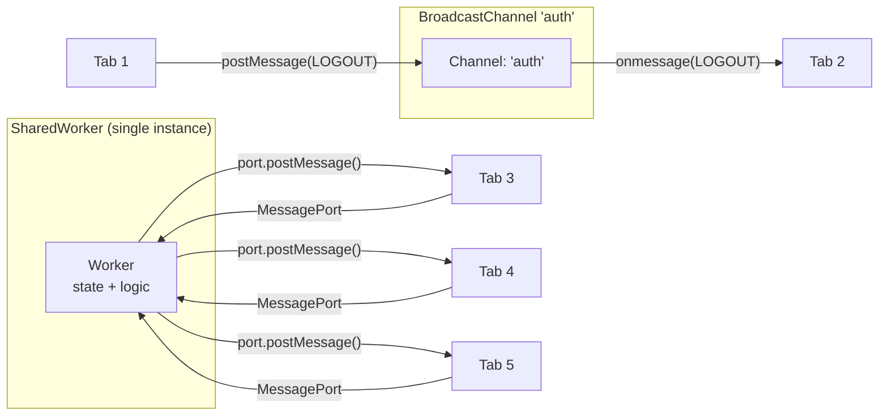

# Broadcast Channel & SharedWorker

When a user has multiple tabs of the same origin open, those tabs are independent
JavaScript execution contexts. A login in one tab does not refresh session state
in other tabs. A shopping cart update is invisible to others. Two mechanisms
coordinate state across tabs: `BroadcastChannel` for simple event broadcasting,
and `SharedWorker` for shared computation and centralized state.

`BroadcastChannel` is a pub/sub mechanism: any tab with a channel of the same
name receives messages posted to that channel by any other tab. It is
one-directional — the sender does not receive its own messages, and there is no
request/response pattern. It is appropriate for notifications: "the user just
logged out — all tabs should redirect to login."

`SharedWorker` is a Web Worker that persists as a single shared instance across
all tabs from the same origin. Each tab connects to the same worker via a
`MessagePort`. The worker can maintain state, coordinate requests, and reply
individually to each connected tab. It is appropriate for shared caches,
WebSocket connection pooling, and scenarios where duplicating work across tabs is
expensive.

Both APIs are same-origin and operate only within a single browser profile. They
do not work across browser windows opened by different user profiles, across
private and regular browsing modes, or across origins. Understanding these
boundaries upfront prevents misapplied architectures where cross-origin
communication is incorrectly delegated to BroadcastChannel or where mobile
compatibility is assumed without verification. Choosing between the two is a
decision about complexity budget: BroadcastChannel is constructible in two lines
and requires no worker script; SharedWorker requires a separate script file, a
proper connect handler, and careful port lifecycle management in exchange for
its ability to hold stateful resources that outlast any individual tab.

## Design Thinking

### Choosing the right cross-tab mechanism

The decision between BroadcastChannel and SharedWorker reduces to a single axis: does the cross-tab communication require shared state or only event delivery? BroadcastChannel is a message bus — it delivers a payload to all listening tabs and immediately forgets it. There is no acknowledgment, no stored state, and no way to query "what was the last message sent." SharedWorker is a computation host — it holds state, responds individually to each connected tab, and persists across individual tab closures as long as at least one tab remains connected.

A practical test: if removing all open tabs and reopening one should restore the previous cross-tab state, SharedWorker (or IndexedDB with BroadcastChannel for notification) is necessary. If losing the state between sessions is acceptable — because it will be re-derived from a server response on the next request — BroadcastChannel is sufficient. Another test: if tabs need to query the current state rather than just receive updates, SharedWorker is the correct choice because it can maintain and return a canonical value; BroadcastChannel has no query semantics, only broadcast.

When in doubt about complexity budget, start with BroadcastChannel. It is simpler to debug, requires no worker file, and handles the majority of real-world cross-tab coordination needs. SharedWorker introduces a separate script lifecycle, port management, and debugging across inspector contexts that substantially increases the maintenance surface. Add SharedWorker only when the stateful resource sharing justification is concrete — most applications that believe they need SharedWorker actually need BroadcastChannel plus a server-backed source of truth.

An additional constraint to factor into the decision is mobile compatibility. As of 2024, SharedWorker is entirely absent in iOS Safari, which means any feature that depends on SharedWorker is silently unavailable for mobile users on Apple devices. BroadcastChannel, by contrast, is supported in iOS Safari 15.4 and later and can serve as a universal baseline. A common pattern for teams that need both mobile support and efficient server resource sharing on desktop is to implement the shared resource abstraction behind an interface, provide a SharedWorker implementation for desktop browsers where it is available, and fall back to a per-tab implementation (with BroadcastChannel for coordination) for mobile browsers where SharedWorker is absent. Feature-detecting `'SharedWorker' in window` before construction is mandatory.

### BroadcastChannel vs. localStorage events

`localStorage` fires a `storage` event in other tabs when values change. This is
the pre-BroadcastChannel approach. The `storage` event has significant
limitations: it delivers only a string value via `event.newValue`, requires the
receiving tab to parse and interpret it, and the emitting tab itself does not
receive the event. BroadcastChannel is more explicit — channels are named and
scoped to a single purpose — and supports arbitrary serializable values without
string conversion. Critically, BroadcastChannel does not persist state to disk;
it is a transient communication channel. If persisted state is required alongside
cross-tab notification, BroadcastChannel for the notification and IndexedDB or
localStorage for the persisted value is the correct combination.

Another meaningful difference is semantics. A `storage` event carries both the
key that changed and the previous and new values — it is inherently a property
mutation notification. BroadcastChannel carries whatever payload the sender
chooses, which makes it suitable for event-driven designs where the message
represents a domain event (`{ type: 'SESSION_EXPIRED', userId: '...' }`) rather
than a property mutation. This distinction matters when multiple listeners need to
react differently to the same domain event, or when the event payload must carry
context that has no natural home in a localStorage key-value entry. The named
channel also acts as a natural grouping: all auth-related cross-tab events travel
on the `'auth'` channel, keeping the message space organized and debuggable.

### SharedWorker port lifecycle

Each tab gets a `MessagePort` via the `connect` event on the SharedWorker. The
Worker registers an `onconnect` handler, inside which it receives the port and
attaches a `onmessage` handler to it. The port reference is the only means by
which the Worker can reply to that specific tab. Ports close when their owning
tab closes; the Worker itself has no built-in mechanism to detect this — a
disconnecting tab does not fire an explicit disconnect event. The conventional
pattern is for tabs to post a final `DISCONNECT` message before unloading, though
`pagehide` is unreliable in some browsers. The Worker terminates automatically
when all connected ports have closed and no other activity is keeping it alive.

In practice, Workers that maintain a list of connected ports for fan-out messaging
must handle the case where a port becomes dead without sending a `DISCONNECT`
message. The way this manifests is a `postMessage` call on a dead port throwing
an error, or more commonly, the dead port silently accepting the message with no
observable effect. Wrapping per-port `postMessage` calls in a try/catch and
removing ports that throw is a defensive pattern for long-lived Workers that serve
many transient tabs. The Worker should store ports in a `Set`, remove a port on
caught errors, and periodically send a heartbeat message with a response
requirement to proactively detect and evict stale ports.

### Service Worker as an alternative

Service Workers can broadcast to all controlled clients via `clients.matchAll()`
and `client.postMessage()`. They persist across tab closures and can initiate
communication unprompted, including waking tabs from push notifications. The
distinction from BroadcastChannel and SharedWorker is architectural: those two
mechanisms are tabs talking to tabs, or tabs sharing a background thread. A
Service Worker is an interceptor and background service that sits between the
browser and the network. Use a Service Worker when offline caching, push
notifications, or background sync are requirements; use BroadcastChannel or
SharedWorker when the need is purely cross-tab coordination within an active
session.

Service Workers introduce a registration and activation lifecycle with states
(`installing`, `waiting`, `active`) that do not apply to BroadcastChannel or
SharedWorker. A newly installed Service Worker does not immediately control
existing tabs — it waits until tabs are reloaded or `skipWaiting` is called.
This lifecycle complexity is unnecessary overhead when the goal is simply notifying
open tabs about an auth state change. Choosing the right tool means matching the
mechanism to the problem: BroadcastChannel for lightweight event delivery,
SharedWorker for shared stateful resources, and Service Worker for network
interception and background capabilities.

### Browser support and debugging

SharedWorker is supported in all major desktop browsers but has limited iOS
Safari support as of 2024 — it is absent in iOS Safari entirely, making it
unsuitable as the sole cross-tab mechanism for applications with mobile users.
BroadcastChannel has broad support including iOS Safari 15.4 and later. When
targeting mobile, prefer BroadcastChannel for event notification and fall back to
`localStorage` events for older iOS. Debugging SharedWorkers in Chrome is done
via the `chrome://inspect/#workers` panel, which lists active workers and allows
attaching DevTools. Because the Worker's lifetime spans multiple browser windows,
debugging shared state is harder than debugging a single-tab execution context —
the Worker may be in an unexpected state due to messages from a tab that is no
longer visible.

Firefox exposes SharedWorkers in its `about:debugging` page under the `Workers`
section. Safari's Web Inspector can attach to shared workers from the Develop
menu. In all browsers, logging inside the Worker requires the DevTools to be
attached to the Worker's own inspector context, not to any of the connected tabs —
console statements in the Worker are not visible in a tab's DevTools console.
This is a common source of confusion during initial debugging: messages appear to
be sent but the Worker seems to do nothing, because the Worker's console output is
invisible until its inspector context is opened explicitly.

## Best Practices

**SHOULD close `BroadcastChannel` instances when they are no longer needed.**
`channel.close()` removes the channel from the broadcast group and releases its
resources. Components or services that create channels dynamically must close
them on cleanup to prevent garbage-collected components from continuing to receive
messages and leaking handlers. The correct pattern in a component-based UI is to
call `channel.close()` in the component's unmount or destroy lifecycle hook, and
in vanilla JavaScript to call it in a `pagehide` event listener. A channel that
is never closed continues to hold a reference in the browser's channel registry
for the lifetime of the page, and its `onmessage` handler will continue firing on
every subsequent broadcast to that channel name.

**SHOULD use `SharedWorker` to deduplicate expensive shared resources — WebSocket
connections, persistent polling, shared IndexedDB access — rather than creating
one resource per tab.** Multiple tabs each opening a WebSocket to the same server
multiplies server connection load proportionally to the number of open tabs. A
single SharedWorker WebSocket serves all tabs with one connection, and the Worker
fans out updates to each tab's port. This also simplifies reconnection logic:
only the Worker needs to implement reconnection; tabs simply receive messages. The
same pattern applies to polling intervals: one Worker polls on behalf of all
tabs, and tabs subscribe to its results, eliminating redundant network requests
and preventing the thundering-herd problem where all tabs fire simultaneous
requests on the same interval.

**MUST use structured-cloneable values in all `BroadcastChannel.postMessage` and
SharedWorker port messages.** Functions, DOM nodes, and class instances with
prototype methods cannot be transferred across execution contexts. Attempting to
post a non-cloneable value throws a `DataCloneError` synchronously. Only types
supported by the Structured Clone algorithm — plain objects, arrays, Maps, Sets,
Dates, ArrayBuffers, and other transferable types — are valid message payloads.
When working with class instances, serialize them to plain objects before posting
and reconstruct them on the receiving side. Design message schemas as plain data
envelopes with a `type` string discriminant and a `payload` field to keep message
handling explicit and serialization boundaries clear.

## Visual



## Example

```js
// Producer — any tab after successful logout
const logoutChannel = new BroadcastChannel('auth');
logoutChannel.postMessage({ type: 'LOGOUT', timestamp: Date.now() });
logoutChannel.close(); // close immediately after sending

// Consumer — all other tabs
const authChannel = new BroadcastChannel('auth');
authChannel.onmessage = (event) => {
  if (event.data.type === 'LOGOUT') {
    // Clear local session state and redirect
    clearSessionState();
    window.location.assign('/login');
  }
};
// Cleanup on page unload
window.addEventListener('pagehide', () => authChannel.close());
```

## Common Mistakes

**Not closing BroadcastChannel on component unmount.** A channel that is created
inside a component and never closed continues to register as a recipient in the
browser's broadcast group for the lifetime of the page. When a message is
broadcast on that channel, the handler fires even though the component that
registered it has been destroyed. In frameworks with reactive state, this can
trigger state mutations on unmounted components, causing warnings and potential
memory leaks. In Vue and React, the pattern is straightforward: create the
channel in a setup function or `useEffect`, store the reference, and call
`channel.close()` in the returned cleanup function or the `onUnmounted` hook.
Always pair channel creation with a corresponding close call in the component's
cleanup path.

**Trying to post a function or DOM node via BroadcastChannel.** The Structured
Clone algorithm, which serializes message payloads, cannot handle functions, DOM
nodes, class instances with prototype chains that include methods, or any type
outside its supported set. Calling `postMessage` with such a value throws a
`DataCloneError` synchronously, before the message is sent. The error is caught
in a try/catch around `postMessage`, but the message is never delivered. The fix
is to serialize data to plain objects before posting. When a class instance
carries both data and behavior, extract the data properties into a plain object
literal for transport and reconstruct the instance on the receiving end. A
TypeScript interface shared between sender and receiver is a practical way to
enforce the plain-object contract at the type level.

**Expecting BroadcastChannel to work across different origins.** BroadcastChannel
is same-origin only. A channel named `'auth'` on `https://app.example.com` is
completely isolated from a channel named `'auth'` on `https://other.example.com`
or `https://example.com`. There is no mechanism to bridge origins via
BroadcastChannel. Cross-origin communication requires `postMessage` with explicit
origin targeting on a window or iframe reference, which is a separate API with
different security characteristics and explicit trust boundaries. Applications
that operate across subdomains — a microfrontend shell on `shell.example.com` and
a child application on `app.example.com` — cannot use BroadcastChannel for
cross-frame communication.

**Not handling the SharedWorker `connect` event properly.** Messages sent from a
tab via a `MessagePort` before the Worker has registered a message handler on
that port are silently discarded. The Worker must register its `onmessage` handler
inside the `connect` event callback, on the specific port received from
`event.ports[0]`. Registering handlers on the global `self` scope inside the
Worker does not intercept port messages. The consequence of missing this is that
tabs appear to connect successfully but their messages never reach the Worker, and
no error is thrown to indicate the problem. The Worker must also call `port.start()`
if it uses `addEventListener` rather than `onmessage` to attach the message
handler — ports begin in a paused state and only deliver queued messages once
`start()` is called or `onmessage` is assigned.

**Assuming SharedWorker is available on mobile.** iOS Safari does not support
SharedWorker as of iOS 17. Feature-detecting `window.SharedWorker` before using
it is not optional — on iOS it evaluates to `undefined`, and calling
`new SharedWorker(...)` throws a `ReferenceError` that crashes the calling code.
Applications that require cross-tab state sharing on iOS must fall back to
BroadcastChannel for event notification and localStorage or IndexedDB for shared
persistent state. The feature detection pattern is straightforward: check for
`'SharedWorker' in window` before constructing the Worker, and implement the
fallback path as the primary path for environments where SharedWorker is
unavailable. Do not assume desktop-only testing covers the full compatibility
surface of the application.

## Related FEEs

- [FEE-400 — Browser APIs & Web Platform Overview](./400.md)
- [FEE-405 — Web Workers & Concurrency](./405.md)
- [FEE-313 — Structured Clone & `structuredClone()`](../JavaScript%20Language%20and%20Runtime/313.md)

## References

- MDN: BroadcastChannel — https://developer.mozilla.org/en-US/docs/Web/API/BroadcastChannel
- MDN: SharedWorker — https://developer.mozilla.org/en-US/docs/Web/API/SharedWorker
- Can I Use: SharedWorker — https://caniuse.com/sharedworkers
- MDN: MessagePort — https://developer.mozilla.org/en-US/docs/Web/API/MessagePort
- MDN: Structured Clone Algorithm — https://developer.mozilla.org/en-US/docs/Web/API/Web_Workers_API/Structured_clone_algorithm
- Can I Use: BroadcastChannel — https://caniuse.com/broadcastchannel
- MDN: Service Worker API — https://developer.mozilla.org/en-US/docs/Web/API/Service_Worker_API
- web.dev: Cross-tab communication — https://web.dev/articles/broadcast-channel
- MDN: clients.matchAll() (Service Worker alternative) — https://developer.mozilla.org/en-US/docs/Web/API/Clients/matchAll
