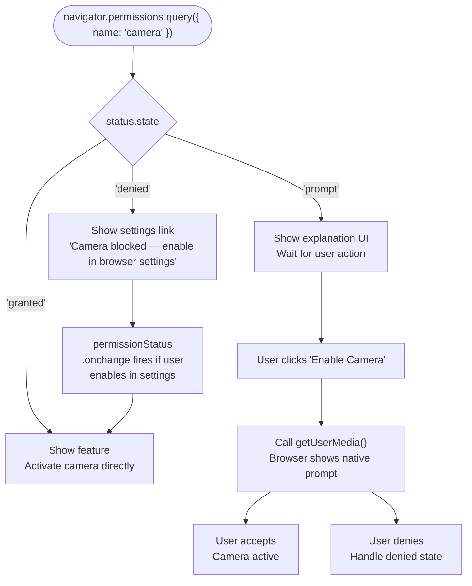

# Permissions API

Browser APIs that access sensitive resources (camera, microphone, geolocation,
notifications, clipboard, MIDI) each have their own permission gating. Before
the Permissions API, the only way to know if a permission had been granted was to
call the API and see if it succeeded. `navigator.permissions.query()` provides a
way to check the current state of any permission before invoking the API, enabling
UX that adapts to the user's permission state without triggering a new prompt.

The Permissions API models three states: `granted` (the user has allowed),
`denied` (the user has blocked, and the browser will not prompt again), and
`prompt` (the browser will show a prompt when the API is invoked). This
three-state model lets applications show an in-app explanation UI (`prompt`
state), a settings-link UI (`denied` state, since the browser won't re-prompt),
or proceed directly to the feature (`granted` state).

Permissions are increasingly policy-controlled through Permissions Policy
(formerly Feature Policy), which allows pages to restrict what permissions iframes
can request and what origins can use certain capabilities. Understanding the
Permissions API in isolation is incomplete without understanding how server-sent
Permissions Policy headers compose with user grants.

## Context

You are building a feature that uses the camera for a QR code scanner. The current implementation calls `getUserMedia()` immediately on page load, which triggers a permission prompt before the user understands why the camera is needed. The Permissions API lets you query whether a permission has already been granted, denied, or not yet requested, so you can show an explanatory UI before triggering the browser prompt and handle the denied state gracefully without triggering another prompt.

## Design Thinking

### Querying vs. requesting permissions

`navigator.permissions.query()` only reads state; it does not request permission.
Requesting happens when the underlying API is called. The query tells you the
current state; the request happens at the point of use when the user triggers the
feature. This separation matters for UX design: an application can pre-render the
correct UI for each state (affordance, explanation panel, or settings link)
without changing what the browser will prompt for or when. Developers sometimes
expect `query()` to show a prompt, leading to UI that waits for a permission
decision that will never arrive. The query is purely a read operation; it is safe
to call on page load, in a component's mount lifecycle, or in any situation where
knowing the current state is useful, without concern about triggering unexpected
browser dialogs.

The underlying API call is what triggers a permission request. For `camera`, that
call is `getUserMedia`. For `notifications`, it is `Notification.requestPermission()`.
For `geolocation`, it is `navigator.geolocation.getCurrentPosition()` or
`watchPosition()`. Calling these while the permission state is `prompt` shows the
browser's native permission dialog. The Permissions API gives applications a way
to decide when (and whether) to make that call, based on the current state. A
well-designed flow queries first, presents context to the user in the `prompt`
state to prime the request, and only invokes the underlying API after the user
has taken a deliberate action, improving the acceptance rate of permission prompts
by surfacing them at a moment of clear intent.

### Permission change events

`permissionStatus.addEventListener('change', handler)` fires when the user changes
the permission in browser settings while the page is open. Applications should
update their UI in response. For example, a camera button can be enabled when the user
grants camera access in settings while the page is visible. This event-driven
approach avoids polling: rather than checking permission state on every user
interaction, the application registers once and reacts to changes as they happen.
The handler receives the `PermissionStatus` object as `this`, and the updated
state is available via `this.state` or by referencing the captured `status`
variable. Tearing down the listener when the component or feature is unmounted
prevents stale handlers from accumulating across navigation events in single-page
applications.

A common scenario where the `change` event is critical is video conferencing: a
user who revokes camera or microphone permission from the browser's address bar
indicator while in a call should see immediate feedback (a muted indicator, a
"camera blocked" banner) rather than a frozen feed with no explanation. The
`change` event makes this reactive response straightforward. It is also relevant
for applications that detect `denied` state and direct users to settings: after
the user follows those instructions and grants the permission, the `change` event
fires and the application can automatically transition from the settings-link UI
to the active feature without requiring a page reload.

### Permissions Policy (server-side)

The `Permissions-Policy` HTTP header and the `allow` attribute on `<iframe>`
control which permissions a page or embedded frame is allowed to use, independent
of user grants. A feature blocked by Permissions Policy (for example,
`Permissions-Policy: camera=()` sent with the page response) returns `denied`
from `navigator.permissions.query({ name: 'camera' })` regardless of whether the
user has previously granted camera access in their browser settings. This means
`denied` from the Permissions API can indicate either a user decision or a policy
decision, and the application cannot distinguish between the two from the API
response alone.

Iframes face an additional layer: a cross-origin iframe requires the parent to
explicitly grant it permission via the `allow` attribute (e.g.,
`allow="camera; microphone"`) before the iframe can request those permissions from
the user. If the attribute is absent, `query()` inside the iframe returns `denied`
and calls to `getUserMedia` are rejected. Developers embedding third-party widgets
or micro-frontends that need camera or microphone access must coordinate with the
embedding page to ensure the `allow` attribute is present. Permissions Policy
errors are commonly mistaken for user-side `denied` states, leading to unhelpful
"please enable camera in settings" messages when the real fix is a server
configuration change.

### Designing for the permission lifecycle

Permissions are stateful values that can change over the course of a session. A user who grants camera access at the start of a video call may revoke it mid-call using the browser's address bar indicator or OS-level controls. A user who denies notifications initially may reconsider after understanding the feature's value and grant the permission from browser settings. Applications that model permissions as one-time decisions (reading state once at startup and never updating) will degrade incorrectly when state transitions occur mid-session.

The complete permission lifecycle has four phases that well-designed applications handle explicitly:

1. **Initial state query**: check permission state before rendering permission-gated controls; adapt the UI to `granted`, `prompt`, or `denied` without triggering a new browser prompt.
2. **Permission request**: invoke the underlying API (not `query()`) from a user gesture when the state is `prompt`; present contextual explanation before the browser dialog appears to improve acceptance rate.
3. **Post-grant activation**: when the request succeeds, transition the UI to the active feature state without requiring a page reload.
4. **Mid-session state change**: subscribe to `permissionStatus.onchange` to detect revocations or late grants; update UI in real time rather than leaving the user with a stale state.

Failing to handle any of these phases produces a class of broken state: a UI that never activates after late permission grant, a frozen feed after mid-session revocation, or a loading spinner that never resolves after a denied request. Each phase is addressable with a small amount of code, but all four must be present for the feature to behave correctly across the full range of user interactions with the browser's permission system.

### Coverage and limitations

Not all permissions are queryable via the Permissions API in all browsers. Some
permission names (such as `clipboard-read` and `clipboard-write`) have partial
or inconsistent support across browsers. Others, such as `background-sync` and
`periodic-background-sync`, are Chromium-specific. The set of supported permission
names is not standardized to a fixed list; browsers implement what they choose,
and MDN's browser compatibility tables are the authoritative reference for which
names work where. Before relying on a specific permission name in production code,
check current compatibility.

The correct defensive pattern is to wrap `navigator.permissions.query()` in a
try/catch: if the browser does not recognize the permission name, the returned
Promise rejects with a `TypeError`. This rejection should be caught and treated
as a signal to fall through to the direct API call without pre-checking state.
Similarly, older browsers that do not implement `navigator.permissions` at all
require a feature-detection check (`'permissions' in navigator`) before calling
`query()`. Applications that skip this guard will throw synchronously on browsers
that lack the API entirely.

## Best Practices

**SHOULD query permission state on page load for features central to the page's
purpose, to pre-render the appropriate UI state without waiting for a user action.**
A photo editing app that queries camera permission state on load can immediately
show a "grant camera access" affordance if the state is `prompt`, rather than
showing it only after the user clicks a button and receives no camera feed. This
avoids a class of broken states where the user sees a feature area that silently
does nothing until they attempt to interact with it. Pre-querying on load is
appropriate when the feature is prominent (the primary call to action of the
page) and inappropriate when the feature is secondary or opt-in, where querying
should happen at the moment the user expresses intent to use it, to avoid
consuming browser resources or confusing the user with permission checks they
did not initiate.

**MUST provide explicit UI for the `denied` permission state that guides the user
to browser settings.** When permission is `denied`, the browser will not show a
re-prompt. The minimum acceptable UI is a message identifying which permission is
blocked and providing a link to the browser settings path where users can change
it. An application that silently swallows the `denied` state (rendering a blank
panel, an infinite spinner, or nothing at all) removes the user's ability to
recover. Instructions should be specific: "Camera access is blocked. To enable
it, open your browser's site settings." Different browsers place permission
settings in different locations, and overly generic instructions ("check your
settings") are unhelpful. Where possible, provide platform-specific phrasing or
a link that opens the browser's settings directly, though browser support for
deep settings links varies. Some teams supplement the message with a short
animated walkthrough showing where to find the settings toggle. The investment
is justified for features that are entirely unusable without the permission and
where the denied state represents a meaningful share of users.

**SHOULD subscribe to `permissionStatus.onchange` for permissions that users may
change in browser settings during a session.** Users who revoke camera access
while a video call is in progress should see an immediate UI response. The
`change` event allows the application to react in real time rather than only
detecting state changes at the next user interaction. When the permission
transitions from `denied` to `granted` (after the user follows settings
instructions), the `change` handler should re-invoke the feature setup function
so the application transitions automatically without requiring a page reload.
Attaching the listener in the same function that reads the initial state ensures
that the change handler is always in place whenever a `PermissionStatus` object
is held. In applications with multiple permission-gated features (camera,
microphone, and notifications all active simultaneously), each `PermissionStatus`
object should have its own `change` listener, scoped to the feature it controls,
to avoid coupling unrelated features through a shared handler.

## Visual



## Example

```js
async function setupCamera() {
  let status;
  try {
    status = await navigator.permissions.query({ name: 'camera' });
  } catch {
    // Permissions API not supported or 'camera' not queryable — fall through to direct call
    startCamera();
    return;
  }

  if (status.state === 'granted') {
    startCamera();
  } else if (status.state === 'prompt') {
    showGrantCameraButton();
  } else {
    showDeniedMessage(
      'Camera access is blocked. Enable it in your browser settings.'
    );
  }

  // Re-run when user changes permission in browser settings
  status.addEventListener('change', () => setupCamera());
}
```

## Common Mistakes

**Not handling the `denied` state: shows indefinite spinner.** When a permission
is `denied`, calls to the underlying API reject immediately or silently fail, but
they do not throw errors that clearly identify the cause. An application that
interprets all failures as transient network or hardware errors, retrying
indefinitely or showing a loading indicator, traps the user in an unresolvable
state. The `denied` state is permanent from the browser's perspective until the
user manually intervenes. Every permission-gated feature must have a distinct code
path for `denied` that communicates what happened and how to fix it, rather than
treating it as a recoverable error condition. In monitoring and analytics, `denied`
state occurrences should be tracked separately from other failures; a spike in
`denied` states often signals an onboarding problem (permissions requested without
sufficient context) rather than a technical defect.

**Calling `navigator.permissions.query()` expecting it to prompt the user: it
only reads state.** The query does not trigger a browser dialog. Developers who
expect querying `{ name: 'notifications' }` to request notification permission
will find that the returned state is `prompt`, but no dialog appears. The browser
dialog appears only when `Notification.requestPermission()` is called explicitly.
The Permissions API and the permission-requesting API are separate; the Permissions
API is a state-reading facility. This confusion most often surfaces in applications
that add `navigator.permissions.query()` as an optimization to an existing
permission flow without fully understanding its read-only nature, resulting in a
query call that correctly reads state but provides no permission dialog to the
user, while the actual prompt-triggering call is either missing or placed
incorrectly in the flow.

**Not re-checking permission state after the `change` event fires.** Some
implementations read the state once at setup and never update. If a user revokes
a permission while the application is open, the application continues operating
as if the permission is still granted, attempting API calls that will fail
silently or with unhelpful errors. The `change` event exists precisely to
enable real-time state tracking. Failing to subscribe to it, or subscribing but
ignoring the new state value, defeats the purpose of the event. A common variant
of this mistake is to subscribe correctly but call `setupFeature()` with cached
state rather than re-reading `status.state` inside the handler. The handler
fires, but the application logic reads an outdated value and takes no action.
Always read `status.state` inside the `change` handler, or re-invoke the full
setup function to guarantee fresh state.

**Assuming all permission names are queryable in all browsers: check MDN
compatibility.** The set of permission names recognized by `navigator.permissions.query()`
varies by browser and browser version. Querying an unsupported name causes the
returned Promise to reject with a `TypeError`, not to return `denied`. Code that
does not handle this rejection will surface an unhandled Promise rejection.
Always wrap `query()` in a try/catch and treat rejections as a signal to fall
back to direct API invocation. Consulting MDN's browser compatibility table
before shipping code that depends on a specific permission name is mandatory
due diligence. The `clipboard-read` permission is a common example: it is
queryable in Chromium browsers but not in Firefox as of recent versions, meaning
the same code behaves differently depending on browser, and the try/catch fallback
is the mechanism that allows clipboard functionality to degrade gracefully rather
than break entirely.

## Related FEEs

- [FEE-400 — Browser APIs & Web Platform Overview](./400.md)
- [FEE-413 — Geolocation, Device Orientation & Device APIs](./413.md)
- [FEE-1204 — CORS & CSRF](../Security/1204.md)

## References

- MDN: Permissions API — https://developer.mozilla.org/en-US/docs/Web/API/Permissions_API
- MDN: navigator.permissions.query() — https://developer.mozilla.org/en-US/docs/Web/API/Permissions/query
- MDN: PermissionStatus — https://developer.mozilla.org/en-US/docs/Web/API/PermissionStatus
- MDN: Permissions Policy — https://developer.mozilla.org/en-US/docs/Web/HTTP/Permissions_Policy
- W3C Permissions specification — https://www.w3.org/TR/permissions/
- Can I Use: Permissions API — https://caniuse.com/permissions-api
- MDN: Permissions Policy `allow` on iframe — https://developer.mozilla.org/en-US/docs/Web/HTTP/Headers/Permissions-Policy
- web.dev: Asking permission responsibly — https://web.dev/articles/permission-ux
- MDN: Notifications API requestPermission — https://developer.mozilla.org/en-US/docs/Web/API/Notification/requestPermission_static
- MDN: MediaDevices.getUserMedia — https://developer.mozilla.org/en-US/docs/Web/API/MediaDevices/getUserMedia
- MDN: Clipboard API permissions — https://developer.mozilla.org/en-US/docs/Web/API/Clipboard_API#security_considerations
