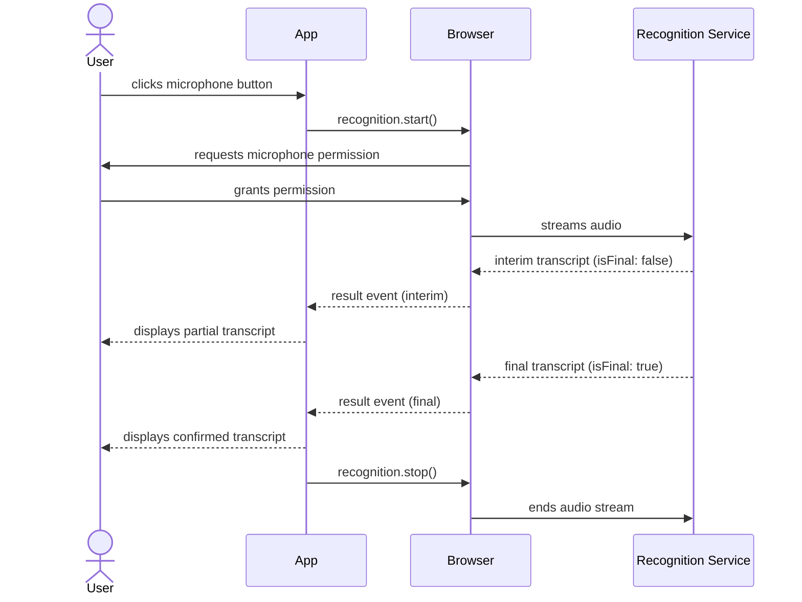

# [FEE-416] Web Speech API

:::info
The Web Speech API gives web applications speech synthesis and speech recognition through browser-provided speech engines. `SpeechSynthesis` converts text to audio, and `SpeechRecognition` converts spoken audio to text. Neither capability requires the application to run its own transcription or audio infrastructure. Synthesis mostly uses the operating system's voices; recognition uses a vendor cloud service by default (Chrome sends audio to Google's servers) or, since Chrome 139, an optional on-device model. Support is uneven across browsers, so the recommendations below state which browsers and which mode they apply to wherever support differs.
:::

## Context

Speech input and output on the web predate the Web Speech API, but prior approaches generally required a plugin or a round trip to a third-party dictation service before browsers exposed a native hook. Speech synthesis reached broad support first: every major browser has shipped `SpeechSynthesis` for years, though voice inventories and event behavior still vary by platform. Speech recognition has been slower and more fragmented across browsers, and the constructor's presence does not reliably indicate that recognition works, which is the gap this article's feature-detection and error-handling guidance fills. Recognition gets more attention in this article than synthesis because its browser support, privacy model, and failure modes are the parts most likely to surprise a team shipping voice input for the first time.

## Visual



## Example

```js
const SpeechRecognition =
  window.SpeechRecognition || window.webkitSpeechRecognition;

if (!SpeechRecognition) {
  console.warn('Speech recognition not supported. Falling back to text input.');
} else {
  const recognition = new SpeechRecognition();
  recognition.continuous = true;
  recognition.interimResults = true;
  recognition.lang = 'en-US';

  let listening = false;

  recognition.onresult = (event) => {
    const transcript = Array.from(event.results)
      .map((result) => result[0].transcript)
      .join('');
    document.querySelector('#output').textContent = transcript;
  };

  recognition.onerror = (event) => {
    console.error('Speech recognition error:', event.error);
  };

  // continuous=true does not guarantee an unbroken session: Chrome ends
  // recognition on silence timeouts, network hiccups, and, in some
  // versions and platforms, after a maximum session duration even while
  // continuous is true. Restart only while the user has not explicitly
  // stopped, so an intentional stop() or abort() does not trigger an
  // infinite restart loop.
  recognition.onend = () => {
    if (listening) recognition.start();
  };

  document.querySelector('#mic-btn').addEventListener('click', () => {
    listening = true;
    recognition.start();
  });

  document.querySelector('#stop-btn').addEventListener('click', () => {
    listening = false;
    recognition.stop();
  });

  // Stop recognition when the page is hidden.
  document.addEventListener('visibilitychange', () => {
    if (document.visibilityState === 'hidden') {
      listening = false;
      recognition.stop();
    }
  });
}
```

## Best Practices

**MUST disclose to users, before requesting microphone permission, that speech recognition may send audio to a third-party server.** Chrome's default recognition mode transmits audio to Google's servers. Since Chrome 139 (August 2025), Chrome also supports on-device recognition: call `SpeechRecognition.available()` to check whether an on-device model is installed for the target language, call `install()` to download it if not, and set `recognition.processLocally = true` before `start()` to require local processing. Applications subject to GDPR, HIPAA, or enterprise data-residency requirements should feature-gate on `processLocally` support and prefer it. Where it is unavailable, disclosure remains mandatory, and only a self-hosted transcription service keeps audio off external servers; a hosted third-party API is not a substitute, since it is itself a data processor under the same rules. Place the disclosure next to the microphone control, before the browser's own permission prompt appears. A privacy-policy link alone does not satisfy this requirement.

**MUST feature-detect both `SpeechSynthesis` and `SpeechRecognition` before use, and provide fallback UI.** Check `'speechSynthesis' in window` and `'SpeechRecognition' in window || 'webkitSpeechRecognition' in window` before rendering speech-dependent UI. Constructor presence is not sufficient: Edge and Brave both expose `webkitSpeechRecognition`, but recognition never succeeds there. Edge failures may surface as an error event (`'network'`, `'service-not-allowed'`, or `'language-not-supported'`) or as no events at all, so detection cannot rely on constructor absence alone: pair the `onerror` fallback with a timeout that falls back to text input when no result or error arrives. Features that render a microphone button unconditionally and then fail silently when the button is pressed on an unsupporting browser create a broken experience with no recovery path. A text input is always the correct fallback for voice input, and a visible text display is always the correct fallback for speech output. The feature-detection check is synchronous and cheap, so there is no reason to defer it. In frameworks that use server-side rendering, run the check in the client-side lifecycle, since `window` is undefined during server render, and run it before the component reaches a state where the user can interact with speech-dependent controls.

**SHOULD enumerate available voices in the `speechSynthesis.onvoiceschanged` handler, not synchronously at page load.** `getVoices()` can return an empty array before the browser has finished loading its voice list. See Voice loading async behavior below for the full pattern, including the persisted-preference case.

**MUST stop `SpeechRecognition` when the user navigates away, the component unmounts, or the user explicitly stops recording.** `recognition.stop()` terminates recognition gracefully, letting the engine finalize any pending result before shutting down; `recognition.abort()` terminates immediately without finalizing. Not stopping recognition leaves the microphone genuinely live; the browser's tab or address bar indicator is the only clue that recording continues. Clean up recognition in response to `visibilitychange` events, stopping when `document.visibilityState === 'hidden'`, and in component unmount lifecycle hooks. In single-page applications, navigating between routes does not reload the page, so a recognition session started on one route and not stopped before the route change continues recording in the background with no UI for the user to know it is active or to stop it.

## Design Thinking

### SpeechSynthesisUtterance properties

A `SpeechSynthesisUtterance` instance carries all the configuration for a single speech output request. The `text` property sets what will be spoken. The `voice` property accepts a `SpeechSynthesisVoice` object from `speechSynthesis.getVoices()`; leaving it `null` selects the browser's default voice. The `rate` property accepts values from 0.1 to 10, where 1 is the normal speaking speed, and values above 2 become difficult for most listeners to follow. The `pitch` property ranges from 0 to 2, with 1 as the baseline. The `volume` property ranges from 0 to 1.

The utterance fires lifecycle events that enable reactive UI: `start` fires when speech begins, `end` fires when the utterance finishes, `pause` and `resume` fire when `speechSynthesis.pause()` and `speechSynthesis.resume()` are called, `boundary` fires at word and sentence boundaries (useful for highlighting synchronized text), and `error` fires when the utterance cannot be spoken. `speechSynthesis.cancel()` clears the entire utterance queue immediately, including any currently-speaking utterance. Applications that queue multiple utterances (for example, reading a list of items aloud) should monitor the `end` event to know when to advance to the next item and the `error` event to know when to skip or retry. The `boundary` event is useful but inconsistently implemented: not all browsers fire it at word boundaries, so UI that depends on it for word-level highlighting needs testing across browsers before shipping.

### Voice loading async behavior

`speechSynthesis.getVoices()` may return an empty array synchronously on page load. Voices load asynchronously and trigger `speechSynthesis.onvoiceschanged` when they are ready. The correct pattern is to call `getVoices()` inside the `onvoiceschanged` handler. As a secondary optimization, some browsers finish loading voices before the script runs, so `getVoices()` can return a non-empty array on the very first synchronous call; when that happens, the array can be used immediately without waiting for the event.

Applications that call `getVoices()` synchronously at page load without handling the asynchronous case find their voice list empty on the first call in most browsers. The result is a silent fall-through to the default voice, which means voice selection logic is bypassed without raising any error. If the application requires a specific voice, such as a particular language variant, that requirement must be applied inside the `onvoiceschanged` handler, not at the top-level script. In single-page applications, set up the `onvoiceschanged` handler once globally and cache the voice list at the application level, because components mounted after the initial voice load have missed the event that already fired, and the event can fire again when the voice list changes mid-session. The same constraint applies to restoring a persisted voice preference: read the stored preference and match it against the freshly loaded array inside the `onvoiceschanged` handler, not before the array is populated, or the match will run against an empty list and silently fall back to the default voice.

### SpeechRecognition modes

`SpeechRecognition` operates in two primary modes controlled by the `continuous` property. When `continuous` is `false` (the default), recognition stops automatically after the first final result, which suits single commands or short dictation bursts. When `continuous` is `true`, recognition keeps running until explicitly stopped via `recognition.stop()`, and multiple `result` events fire over time, which suits long-form dictation.

`continuous = true` does not guarantee an unbroken session. Chrome ends recognition on a silence timeout (firing a `'no-speech'` error), on network hiccups, and, in some versions and platforms, after a maximum session duration regardless of the `continuous` setting; Android's implementation behaves differently again. A dictation UI that relies on `continuous` alone stops transcribing after the first pause and gives no indication why. The fix is to restart recognition from the `onend` handler, guarded by a flag that tracks whether the user still intends to be listening:

```js
let listening = false;

recognition.onend = () => {
  if (listening) recognition.start();
};
```

The guard matters because `onend` also fires after an intentional `stop()` or `abort()`. Without it, calling `abort()` to cancel recognition immediately triggers a new `start()`, and the session never actually ends.

Setting `interimResults` to `true` causes the `result` event to fire with partial transcripts while the user is still speaking. This gives users visual feedback that the microphone is active and their words are being captured. Interim results are marked with `result.isFinal === false`; only final results should be committed to application state, since interim results may be revised substantially as the recognition engine processes more audio. The `lang` attribute accepts BCP 47 language tags, such as `'en-US'`, `'zh-TW'`, or `'fr-FR'`. Leaving it unset defaults to the document's HTML lang attribute, falling back to the browser's UI language when that attribute is absent, either of which may not match the user's intended input language when the application targets multilingual audiences.

### Browser support and polyfill strategy

Chrome and Safari expose the recognition constructor only as `webkitSpeechRecognition`; no shipping browser exposes the unprefixed constructor, so the prefixed lookup covers Chrome and Safari while the unprefixed lookup future-proofs for Firefox's flagged implementation. The feature-detection pattern resolves both forms: `const SpeechRecognition = window.SpeechRecognition || window.webkitSpeechRecognition`. The unprefixed `SpeechRecognition` name is what Firefox exposes behind the `media.webspeech.recognition.enable` and `media.webspeech.recognition.force_enable` preferences; that flagged implementation itself relays audio to a cloud service, and Firefox is not shipping recognition by default as of mid-2026. Mozilla has recorded a positive standards position on the on-device recognition additions (mozilla/standards-positions#1157) but has made no commitment to build or ship such a feature. If both `window.SpeechRecognition` and `window.webkitSpeechRecognition` are `undefined`, the feature is not available in the current browser, and the fallback UI path should be taken. Run feature detection before rendering any recognition-dependent UI element, not only at the moment the user interacts with it, so the application never shows controls that silently do nothing.

Constructor presence does not mean recognition will produce a result. Edge inherits Chromium's `SpeechRecognition` implementation, but recognition does not function there in current releases. Brave exposes the constructor too, but its privacy-focused build disables the Google-keyed cloud service the constructor depends on, so `start()` fails at runtime. Brave's failure surfaces as a `'network'` or `'service-not-allowed'` error on `onerror`, not as a missing constructor. Edge's failure may surface the same way, or as no error event at all, which is why the error handling covered in Best Practices needs a timeout fallback in addition to feature detection and `onerror`.

Chrome's default recognition mode sends audio to Google's servers for processing. Since Chrome 139 (August 2025), the API also supports on-device recognition: `SpeechRecognition.available({ processLocally: true, langs: [...] })` reports whether an on-device model is ready for the requested languages, `SpeechRecognition.install({ processLocally: true, langs: [...] })` downloads the model if it is not, and setting `recognition.processLocally = true` before `start()` requires local processing (the call fails with a `'language-not-supported'` error if the model is not installed). This closes the original privacy gap for Chrome users, but only in that browser and only once the language pack is installed. Applications with a hard requirement to keep audio off external servers everywhere still need a fallback for browsers where `processLocally` is unavailable.

That fallback is a server-side pipeline: capture audio with the Web Audio API and `getUserMedia`, then transcribe it with a hosted or self-hosted speech-to-text service. The distinction between the two matters for compliance. A hosted API such as OpenAI's Whisper API sends audio to that provider's servers, so it carries the same disclosure and data processing agreement requirements as Google's recognition service. Only a self-hosted model, such as an in-house Whisper deployment, or the browser's own on-device mode keeps audio processing under the application's direct control. This approach also requires more implementation effort than the native API: encoding audio streams for transmission and handling streaming or chunked transcription responses, on top of the `getUserMedia` capture itself.

### Accessibility implications

For users with motor impairments who find keyboard or pointer input difficult or impossible, speech recognition is often the only usable input channel, so every keyboard-reachable action needs a voice path. A voice feature that covers only some form fields leaves those users unable to complete the rest. The fallback for when speech recognition is unavailable also needs to be a fully accessible text input, with a proper label and full keyboard operability, since that fallback is what those same users depend on when recognition fails to load or errors out.

Speech output via `SpeechSynthesis` serves users with visual impairments who supplement or replace a screen reader's output with application-provided audio. Applications that use synthesis as a notification mechanism, speaking status updates or alerts aloud, should also put the same information in the DOM for screen readers, since users who run their own screen reader will not hear `SpeechSynthesis` output through that reader's voice. Duplicating speech output as visible text or an aria-live region is the correct pattern; relying on `SpeechSynthesis` alone removes that information from users who have disabled the browser's speech subsystem or are in a context where audio output is unavailable.

## Common Mistakes

**Calling `getVoices()` synchronously and finding an empty array.** On most browsers, voices are not available at the moment the script first runs, so code that calls `getVoices()` at the top level and uses the result immediately receives an empty array and silently discards any voice selection logic. A common variant of this mistake sets `onvoiceschanged` correctly but also calls `getVoices()` synchronously as a shortcut, then conditionally skips setting the handler if the synchronous call returns a non-empty array. On browsers where voices load synchronously, the handler is never attached, so a voice change triggered later, such as the user switching the system language mid-session, is never detected.

**Long `SpeechSynthesisUtterance` playback silently stopping around 15 seconds in Chrome.** Chrome has a long-standing bug where utterances spoken with a remote (network) voice stop mid-sentence after roughly 15 seconds unless something keeps the synthesis engine alive; local platform voices are not affected. Check the selected voice's `localService` property, and apply the workaround whenever it is `false`. The common workaround is a keep-alive: call `speechSynthesis.pause()` immediately followed by `speechSynthesis.resume()` on an interval of about 10 to 14 seconds while an utterance is speaking. Applications that skip this on long text, such as reading an article aloud, see playback cut off partway through with no error event.

**Losing the `end` event because the utterance object was garbage-collected.** A `SpeechSynthesisUtterance` created without being kept in a live reference can be collected by the browser before speech finishes, which silences its `end` and `error` events. Keep a reference to the utterance, in a variable, array, or component state, for as long as it may still be speaking, not just long enough to call `speak()`.

**Calling `speak()` before any user interaction.** Browsers apply autoplay-style user-activation requirements to speech synthesis: a `speak()` call made before the user has interacted with the page can be blocked or silently ignored. Trigger the first `speak()` call from a click or other user-gesture handler, not from a page-load or route-change effect.

**Not handling `SpeechRecognitionErrorEvent`: network errors, `aborted`, `no-speech`.** The `onerror` handler receives an event whose `error` property is a string identifying the error type. Common values include `'network'` (the recognition service could not be reached), `'no-speech'` (the microphone captured no speech before a timeout), `'aborted'` (recognition was stopped before a result was produced), `'not-allowed'` (microphone permission was denied), and `'service-not-allowed'` (the browser does not permit recognition in the current context). Applications that attach no `onerror` handler silently fail on network errors, leaving the microphone button in an active-looking state with no user feedback. Each error type needs a different UX response: `'no-speech'` is retryable, `'not-allowed'` requires a permission explanation, and `'network'` requires a connection error message or a suggestion to try the text input fallback.

**Leaving speech recognition running after component unmount, so the microphone indicator stays active.** In frameworks with component lifecycle management, forgetting to call `recognition.stop()` or `recognition.abort()` in the cleanup or unmount hook is a common oversight. The microphone activity indicator in the browser's tab remains visible, and users see the recording dot without any UI explaining what is recording or how to stop it. In some browsers, this also prevents the garbage collection of the recognition object and any closures it holds, creating a memory leak in applications that mount and unmount the voice-input component repeatedly. The cleanup hook should call `recognition.abort()`, not `stop()`, to prevent a spurious `result` event from firing into a component that no longer exists.

**Not disclosing audio transmission in GDPR-regulated applications.** Chrome's default implementation sends audio to Google's servers unless the application opts into `processLocally`. Presenting a microphone button without disclosing this, in an application deployed in the EU or serving users subject to GDPR, fails informed consent requirements. The disclosure must be legible and next to the microphone control, and it must appear before the browser's own permission prompt, not after it. In enterprise deployments, an audio-to-cloud restriction may be organizational policy rather than a legal requirement; deploying browser-native speech recognition without checking the organization's data handling policy creates compliance exposure regardless of which regulation applies.

## Related Topics

- [Browser APIs & Web Platform Overview](/en/Browser%20APIs%20and%20Web%20Platform/400)
- [Permissions API](/en/Browser%20APIs%20and%20Web%20Platform/415)
- [Accessibility Overview](/en/Accessibility/1000)

## References

- MDN Contributors, "Web Speech API," MDN Web Docs (2026). https://developer.mozilla.org/en-US/docs/Web/API/Web_Speech_API
- MDN Contributors, "SpeechSynthesis," MDN Web Docs (2026). https://developer.mozilla.org/en-US/docs/Web/API/SpeechSynthesis
- MDN Contributors, "SpeechRecognition," MDN Web Docs (2026). https://developer.mozilla.org/en-US/docs/Web/API/SpeechRecognition
- MDN Contributors, "SpeechRecognition: processLocally property," MDN Web Docs (2026). https://developer.mozilla.org/en-US/docs/Web/API/SpeechRecognition/processLocally
- MDN Contributors, "SpeechSynthesisUtterance," MDN Web Docs (2026). https://developer.mozilla.org/en-US/docs/Web/API/SpeechSynthesisUtterance
- MDN Contributors, "SpeechRecognitionErrorEvent," MDN Web Docs (2026). https://developer.mozilla.org/en-US/docs/Web/API/SpeechRecognitionErrorEvent
- Can I Use, "SpeechRecognition API," caniuse.com (accessed 2026). https://caniuse.com/mdn-api_speechrecognition
- Can I Use, "Speech Synthesis API," caniuse.com (accessed 2026). https://caniuse.com/speech-synthesis
- Audio Community Group, "Web Speech API" (Draft Community Group Report), webaudio.github.io (2026). https://webaudio.github.io/web-speech-api/
- Chromium Issue Tracker, "Speech Synthesis stops abruptly after about 15 seconds," issues.chromium.org (2026). https://issues.chromium.org/issues/41294170
