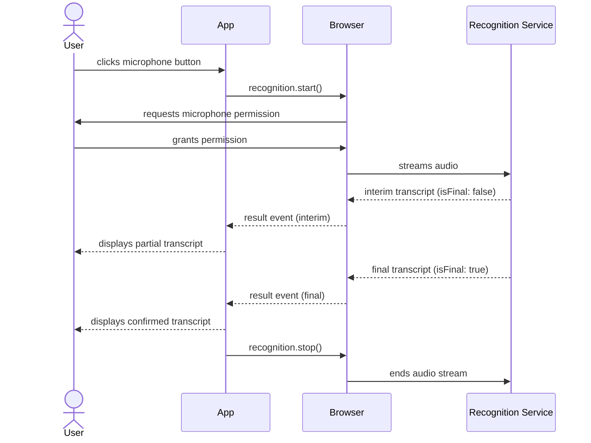

# Web Speech API

The Web Speech API provides two capabilities: speech synthesis (text-to-speech via
`SpeechSynthesis`) and speech recognition (speech-to-text via `SpeechRecognition`).
Speech synthesis is available in all modern browsers; speech recognition has broader
support in Chromium-based browsers and limited support in Safari. Neither capability
is available in all deployment environments, making progressive enhancement the
default approach. Applications that depend exclusively on speech input or output will
fail silently or with unhelpful errors for a meaningful share of users — designing
with fallbacks from the start is not optional.

Speech synthesis is the simpler half. `speechSynthesis.speak(new SpeechSynthesisUtterance('Hello'))`
converts text to audio using the platform's built-in voices. `SpeechSynthesisUtterance`
properties control rate, pitch, volume, and voice selection. Voice availability varies
by operating system and browser; applications should enumerate available voices and
handle the case where a desired voice is not present. The system voices exposed by
`getVoices()` differ between macOS, Windows, Android, and iOS — a voice that exists
in one environment may not exist in another, and relying on a hardcoded voice name
produces silent failures on other platforms.

Speech recognition enables voice input: a user speaks, the browser sends audio to a
speech recognition service (typically server-side), and the result arrives as a
transcript. This raises privacy considerations — audio leaves the device — and requires
microphone permission. Applications that use speech recognition must disclose this data
flow to users, particularly in regulated environments. The speech recognition implementation
in Chrome sends audio to Google's servers; this is not a local, on-device process. Users
in jurisdictions with data protection regulations, or in enterprise environments with data
residency requirements, need to understand where their audio is processed before granting
microphone permission.

## Principle

Engineers MUST treat the Web Speech API as a progressive enhancement and provide
functional fallback UI for all features that use it. `SpeechRecognition` is not
available in Firefox and has limited availability in Safari. `SpeechSynthesis` voice
availability varies across platforms. Features that rely solely on speech input or
output without keyboard or pointer fallbacks exclude users on non-supporting browsers
and on platforms where voices are unavailable. The correct model is to treat speech
capabilities as an enrichment layer over a baseline UI that functions without them,
not as a dependency the page requires in order to be usable.

Engineers MUST disclose to users that speech recognition sends audio to a third-party
server for processing, before requesting microphone permission. The Web Speech API's
speech recognition implementation in Chrome sends audio to Google's servers. This is a
data privacy consideration requiring informed user consent, particularly in applications
subject to GDPR, HIPAA, or similar regulations. The disclosure must be presented before
the microphone permission prompt appears — not buried in a privacy policy — so that the
user can make an informed decision before audio capture begins. Applications in regulated
sectors that cannot allow audio to leave the device should evaluate server-side alternatives
such as Whisper API, where the audio transport and processing location are under the
application's control.

## Design Thinking

### SpeechSynthesisUtterance properties

A `SpeechSynthesisUtterance` instance carries all the configuration for a single
speech output request. The `text` property sets what will be spoken. The `voice`
property accepts a `SpeechSynthesisVoice` object from `speechSynthesis.getVoices()`;
leaving it `null` selects the browser's default voice. The `rate` property accepts
values from 0.1 to 10, where 1 is the normal speaking speed; values above 2 become
difficult for most listeners to follow. The `pitch` property ranges from 0 to 2, with
1 as the baseline. The `volume` property ranges from 0 to 1.

The utterance fires lifecycle events that enable reactive UI: `start` fires when speech
begins, `end` fires when the utterance finishes, `pause` and `resume` fire when
`speechSynthesis.pause()` and `speechSynthesis.resume()` are called, `boundary` fires
at word and sentence boundaries (useful for highlighting synchronized text), and `error`
fires when the utterance cannot be spoken. `speechSynthesis.cancel()` clears the entire
utterance queue immediately, including any currently-speaking utterance. Applications
that queue multiple utterances — for example, reading a list of items aloud — should
monitor the `end` event to know when to advance to the next item and the `error` event
to know when to skip or retry. The `boundary` event in particular is a useful but
inconsistently-implemented event; not all browsers fire it at word boundaries, so UI
that depends on it for word-level highlighting should be tested across browsers before
shipping.

### Voice loading async behavior

`speechSynthesis.getVoices()` may return an empty array synchronously on page load;
voices load asynchronously and trigger `speechSynthesis.onvoiceschanged` when they
are ready. The correct pattern is to call `getVoices()` inside the `onvoiceschanged`
handler. As a secondary optimization, if `getVoices()` returns a non-empty array on
the first synchronous call — which happens in some browsers that complete voice loading
before the script runs — that array can be used immediately without waiting for the
event.

Applications that call `getVoices()` synchronously at page load without handling the
asynchronous case will find their voice list empty on the first call in most browsers.
The consequence is typically a silent fall-through to the default voice, which is not
always an error, but means voice selection logic is silently bypassed. If the
application has specific voice requirements — a particular language, a particular gender,
or a particular quality level — those requirements must be applied inside the
`onvoiceschanged` handler, not at the top-level script. In single-page applications,
the `onvoiceschanged` handler should be set up once globally rather than inside each
component, since the event fires once and components mounted after it fires will not
receive it unless the voice list is cached at the application level.

### SpeechRecognition modes

`SpeechRecognition` operates in two primary modes controlled by the `continuous`
property. When `continuous` is `false` (the default), recognition stops automatically
after the first final result — suitable for single commands or short dictation bursts.
When `continuous` is `true`, recognition continues until explicitly stopped via
`recognition.stop()`, and multiple result events fire over time — suitable for
long-form dictation.

Setting `interimResults` to `true` causes the `result` event to fire with partial
transcripts while the user is still speaking. This enables real-time display of in-progress
speech, giving users visual feedback that the microphone is active and their words are
being captured. Interim results are marked with `result.isFinal === false`; only final
results should be committed to application state, since interim results may be revised
substantially as the recognition engine processes more audio. The `lang` attribute
accepts BCP 47 language tags (such as `'en-US'`, `'zh-TW'`, `'fr-FR'`); leaving it
unset causes the recognition engine to use the browser's UI language, which may not
match the user's intended input language when the application targets multilingual
audiences.

### Browser support and polyfill strategy

`SpeechRecognition` may be prefixed as `webkitSpeechRecognition` in some Chromium-based
browsers. The correct feature-detection pattern resolves both: `const SpeechRecognition =
window.SpeechRecognition || window.webkitSpeechRecognition`. If both are `undefined`,
the feature is not available in the current browser, and the fallback UI path should be
taken. Feature detection must happen before rendering any recognition-dependent UI
element, not at the point where the user interacts with it, to avoid showing controls
that silently do nothing.

For environments where browser-native speech recognition is unavailable or where the
privacy profile of sending audio to Google's servers is unacceptable, a server-side
alternative using the Web Audio API to capture raw audio and Whisper API (or an equivalent
self-hosted model) for transcription provides a universal fallback. This approach
requires more implementation effort — capturing audio streams via `getUserMedia`,
encoding them for transmission, and handling streaming or chunked transcription responses —
but it removes the dependency on `SpeechRecognition` browser support and gives the
application full control over where audio is processed, which is necessary for
GDPR-compliant or enterprise deployments.

### Accessibility implications

Voice input is a meaningful accessibility feature for users with motor impairments who
find keyboard or pointer input difficult or impossible. For these users, speech recognition
is not a convenience feature — it is the primary input channel. This has two design
implications. First, the speech input path must be a complete input method, not a
supplemental shortcut; every action accessible via keyboard must also be accessible via
voice. Second, the fallback for when speech recognition is unavailable must itself be
accessible — a text input with proper label and keyboard operability, not an interface
that simply omits the voice option with no alternative.

Speech output via `SpeechSynthesis` serves users with visual impairments who supplement
or replace a screen reader's output with application-provided audio. Applications that
use synthesis as a notification mechanism — speaking status updates or alerts aloud —
should ensure the same information is also available in the DOM for screen readers,
since users who prefer their own screen reader will not hear `SpeechSynthesis` output
through the reader's voice. Duplication of speech output and visible text (or aria-live
regions) is the correct pattern; exclusive reliance on `SpeechSynthesis` for conveying
state removes the information from users who have disabled the browser's speech
subsystem or are in a context where audio output is unavailable.

## Best Practices

**MUST feature-detect both `SpeechSynthesis` and `SpeechRecognition` before use and
provide fallback UI.** Check `'speechSynthesis' in window` and `'SpeechRecognition' in window
|| 'webkitSpeechRecognition' in window` before rendering speech-dependent UI. A text input
is always the correct fallback for voice input; a visible text display is always the correct
fallback for speech output. Features that render a microphone button unconditionally and then
fail silently when the button is pressed on an unsupporting browser create a broken experience
with no recovery path. The feature detection check is synchronous and cheap; there is no
reason to defer it. In frameworks that use server-side rendering, the check must run in the
client-side lifecycle (not during server render, where `window` is undefined), but it should
run before the component reaches a state where the user can interact with speech-dependent
controls.

**SHOULD enumerate available voices in the `speechSynthesis.onvoiceschanged` event handler,
not synchronously at page load.** `getVoices()` returns an empty array before voices have
loaded on many browsers. Selecting a voice at startup from an empty array produces silent
failures or incorrect voice selection — the application believes it has applied a voice
preference, but the preference was discarded because the array was empty when it was applied.
The `onvoiceschanged` event fires once voices are loaded; the handler is the correct place
to populate a voice selector UI and to apply any stored user voice preference. In applications
that persist voice preferences across sessions, the restore logic must run inside the handler:
read the stored preference, find the matching voice in the freshly-loaded array, and apply it.
A synchronous restore at startup will not find the voice and will silently fall back to
the default.

**MUST stop `SpeechRecognition` when the user navigates away, the component unmounts, or
the user explicitly stops recording.** `recognition.stop()` terminates recognition gracefully,
allowing the engine to finalize any pending result before shutting down. `recognition.abort()`
terminates immediately without finalizing. Not stopping recognition may leave the microphone
indicator active in the browser's tab or address bar, confusing users into thinking they are
still being recorded when they are not. Always clean up recognition in response to
`visibilitychange` events — stopping when `document.visibilityState === 'hidden'` — and in
component unmount lifecycle hooks. In single-page applications, navigating between routes
does not reload the page; a recognition session started on one route and not stopped before
the route change will continue recording in the background, with no UI for the user to know
it is active or to stop it.

## Visual



## Example

```js
const SpeechRecognition =
  window.SpeechRecognition || window.webkitSpeechRecognition;

if (!SpeechRecognition) {
  console.warn('Speech recognition not supported — falling back to text input');
} else {
  const recognition = new SpeechRecognition();
  recognition.continuous = false;
  recognition.interimResults = true;
  recognition.lang = 'en-US';

  recognition.onresult = (event) => {
    const transcript = Array.from(event.results)
      .map((result) => result[0].transcript)
      .join('');
    document.querySelector('#output').textContent = transcript;
  };

  recognition.onerror = (event) => {
    console.error('Speech recognition error:', event.error);
  };

  document.querySelector('#mic-btn').addEventListener('click', () => {
    recognition.start();
  });

  // Stop recognition when the page is hidden
  document.addEventListener('visibilitychange', () => {
    if (document.visibilityState === 'hidden') recognition.stop();
  });
}
```

## Common Mistakes

**Calling `getVoices()` synchronously and finding an empty array.** On most browsers,
voices are not available at the moment the script first runs. Code that calls `getVoices()`
at the top level and uses the result immediately will receive an empty array and silently
discard any voice selection logic. The `onvoiceschanged` event is the correct synchronization
point. A common variant of this mistake is to set `onvoiceschanged` correctly but also call
`getVoices()` synchronously as a shortcut, then conditionally skip the handler if the
synchronous call returns a non-empty array — the logic is correct, but on browsers where
voices load synchronously, the handler is never set, meaning voice changes triggered by
the user switching system language settings mid-session are never detected.

**Not handling `SpeechRecognitionErrorEvent` — network errors, `aborted`, `no-speech`.**
The `onerror` handler receives an event whose `error` property is a string identifying the
error type. Common values include `'network'` (the recognition service could not be reached),
`'no-speech'` (the microphone captured no speech before a timeout), `'aborted'` (recognition
was stopped before a result was produced), `'not-allowed'` (microphone permission was denied),
and `'service-not-allowed'` (the browser does not permit recognition in the current context).
Applications that attach no `onerror` handler will silently fail on network errors, leaving
the microphone button in an active-looking state with no user feedback. Each error type
requires a different UX response: `'no-speech'` is retryable, `'not-allowed'` requires a
permission explanation, and `'network'` requires a connection error message or a suggestion
to try the text input fallback.

**Leaving speech recognition running after component unmount — microphone indicator stays
active.** In frameworks with component lifecycle management, forgetting to call
`recognition.stop()` or `recognition.abort()` in the cleanup or unmount hook is a common
oversight. The microphone activity indicator in the browser's tab remains visible, and users
see the recording dot without any UI explaining what is recording or how to stop it. In
some browsers, this also prevents the garbage collection of the recognition object and any
closures it holds, creating a memory leak in applications that mount and unmount the
voice-input component repeatedly. The cleanup hook should call `recognition.abort()` (not
`stop()`) to prevent a spurious `result` event from firing into a component that no longer
exists.

**Not disclosing audio transmission in GDPR-regulated applications.** The default Chrome
implementation sends audio to Google's servers. Applications that present a microphone
button without disclosing this fact, and that are deployed in the EU or to users subject
to GDPR, are not compliant with informed consent requirements. The disclosure must be
legible, proximate to the microphone control, and appear before the browser's permission
prompt — not after. In enterprise deployments, audio-to-cloud constraints may be
organizational policy rather than just regulatory; deploying browser-native speech recognition
without checking whether it is permitted by the organization's data handling policy creates
compliance exposure regardless of the applicable regulation.

## Related FEEs

- [FEE-400 — Browser APIs & Web Platform Overview](./400.md)
- [FEE-415 — Permissions API (microphone permission)](./415.md)
- [FEE-1000 — Accessibility Overview (voice input as accessibility feature)](../Accessibility/1000.md)

## References

- MDN: Web Speech API — https://developer.mozilla.org/en-US/docs/Web/API/Web_Speech_API
- MDN: SpeechSynthesis — https://developer.mozilla.org/en-US/docs/Web/API/SpeechSynthesis
- MDN: SpeechRecognition — https://developer.mozilla.org/en-US/docs/Web/API/SpeechRecognition
- MDN: SpeechSynthesisUtterance — https://developer.mozilla.org/en-US/docs/Web/API/SpeechSynthesisUtterance
- MDN: SpeechRecognitionErrorEvent — https://developer.mozilla.org/en-US/docs/Web/API/SpeechRecognitionErrorEvent
- Can I Use: Speech Recognition — https://caniuse.com/speech-recognition
- Can I Use: Speech Synthesis — https://caniuse.com/speech-synthesis
- W3C Web Speech API specification — https://wicg.github.io/speech-api/
