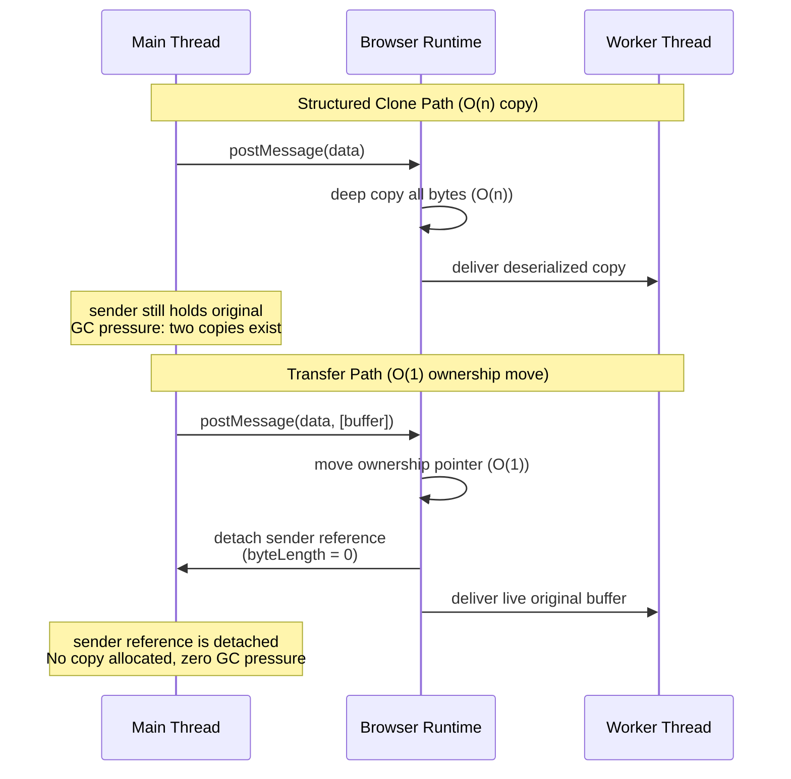

# [FEE-417] Transferable Objects

:::info
The browser's default mechanism for passing data across `postMessage` boundaries is the structured clone algorithm: a full deep copy of the payload that allocates new memory and copies every byte, adding GC pressure on both sides. Transferable Objects are a zero-copy alternative. Instead of cloning, ownership of the underlying memory buffer moves atomically from sender to receiver in O(1) time, regardless of data size. After the transfer, the sender's reference is *detached*: its `byteLength` becomes 0, and any read attempt throws a `TypeError`. Only one thread owns the data at any moment. Understanding when to transfer rather than clone is essential for building high-throughput worker pipelines that move large binary payloads such as video frames or decoded audio.
:::

## Context

Every call to `postMessage` must serialize the payload so it can cross the thread boundary safely, whether between a main thread and a dedicated worker, two frames, or two ends of a `MessageChannel`. By default, the browser uses the **structured clone algorithm**: a recursive deep copy that walks the object graph, allocates new memory for each value, and constructs an independent replica on the receiving side. For primitive data and small objects, this cost is negligible. For large binary payloads (a 100 MB `ArrayBuffer` holding decoded video pixels, a 50 MB `AudioData` buffer, or even a modest 4 MB image `Uint8ClampedArray` at 30 fps), the copy overhead becomes the bottleneck: memory allocation, byte-by-byte copying, and the subsequent GC pressure from the now-orphaned sender copy all add up.

The **transfer mechanism** eliminates this cost. When an object is listed in the transfer array passed as the second argument to `postMessage`:

```js
postMessage(data, [transferList]);
```

the browser moves ownership of the object's underlying memory from sender to receiver in O(1) time, with no allocation and no copy. The sender's handle is immediately **detached**: reading `byteLength` returns `0`, and reading or writing through a view into the same buffer throws a `TypeError`. The receiver obtains the live, original buffer, not a copy.

Detaching enforces single ownership: at any moment, exactly one execution context holds a valid reference to the memory, so transfer needs no locks or synchronization. (Older material sometimes calls this state "neutered"; the WHATWG spec renamed the term to "detached" in 2016.) This differs from `SharedArrayBuffer`, where sender and receiver share the same memory and must coordinate access with `Atomics` operations.

The transfer list syntax accepts an array of transferable objects:

```js
// Single buffer
worker.postMessage({ pixels: buffer }, [buffer]);

// Multiple transferables in one message
// frame is a VideoFrame, port is a MessagePort; both are transferable
worker.postMessage({ frame, port }, [frame, port]);
```

If an object is transferable but is **not** listed in the transfer array, the browser falls back to structured clone for that object. The transfer list must be explicit: there is no automatic detection.

One important subtlety: the transfer list must contain the *object itself*, not a view into it. If you hold a `Uint8ClampedArray` called `pixels` whose `.buffer` is the underlying `ArrayBuffer`, you must list `pixels.buffer` (or the variable holding the `ArrayBuffer`) in the transfer array, not `pixels` itself. `TypedArray` views are serializable but not transferable: listing `pixels` in the transfer array throws a `DataCloneError` `DOMException` rather than transferring the underlying buffer. The browser rejects the message entirely rather than silently falling back to structured clone, so the mistake surfaces immediately as a thrown error.

Transfer applies wherever `postMessage` exists, not only in `Worker`. The complete list of `postMessage` boundaries where the transfer list is accepted: dedicated workers (`Worker.postMessage`), shared workers (`SharedWorker.port.postMessage`), service workers (`client.postMessage` and `ServiceWorkerRegistration.active.postMessage`), `MessageChannel` ports (`MessagePort.postMessage`), cross-frame messaging (`window.postMessage`), WebRTC data channels (`RTCDataChannel.send` does not accept a transfer list, but the channel itself is transferable as described below), and WebTransport streams. `BroadcastChannel` is the notable exception: it uses structured clone and does not accept a transfer list at all, because broadcasts are inherently one-to-many and cannot transfer exclusive ownership to a single receiver.

The structured clone algorithm is also exposed as a standalone function, `structuredClone(value, { transfer })`, available since Node 17 and in all modern browsers. This form is useful for deep-cloning complex objects within a single thread, and it also accepts a transfer list. When a transfer list is supplied to `structuredClone`, the listed objects are transferred into the clone and detached in the original, while the rest of the object graph is deep-cloned. This is rarely needed in practice but can be useful when you want to clone a large object while simultaneously transferring the expensive binary parts out of the original rather than duplicating them.

A browser-based video color grading tool illustrates the stakes. The tool captures frames from a `<video>` element using the WebCodecs API, and the main thread receives each `VideoFrame` at 30 to 60 fps. Color grading (per-pixel HSL transformation across millions of pixels) must run off the main thread to avoid dropping frames, so the main thread transfers each `VideoFrame` to a dedicated worker, which processes the pixels and transfers an `ImageBitmap` result back to the main thread for compositing onto an `OffscreenCanvas`.

Without transfer, each round trip would clone megabytes of pixel data twice per frame: once sending to the worker, once receiving the result. That saturates memory bandwidth and triggers GC pauses that show up as dropped frames. With transfer, each crossing is O(1): the worker takes full ownership of the `VideoFrame`, processes it, and returns ownership of the result, without allocating a single extra byte of pixel data. At 30 fps and a 1080p frame size (~8 MB per frame), avoiding the double copy on both legs of the round trip saves roughly 480 MB/s of memory bandwidth.

Transfer matters less for small payloads. Surma's benchmark of `postMessage` overhead (see References) found that structured-clone payloads up to about 10 KiB stay within a single frame's 16 ms animation budget (and up to 100 KiB within the 100 ms interaction budget), and that transferring an `ArrayBuffer` is fast and independent of its size. A JSON-serializable configuration object (a few dozen properties, no binary data) falls well under that threshold, so the clone overhead is negligible next to the latency of posting the message itself. The decision to transfer is driven by data size and pipeline throughput: a worker that processes frames or audio chunks continuously benefits from eliminating per-crossing allocation, while a worker that only receives its configuration once at startup does not, and structured clone is the right default there.

## Visual



**Reading the diagram:** The top sequence shows structured clone: the browser allocates new memory, copies every byte, and the sender retains its original, leaving two copies in memory until GC collects the now-unreachable sender copy. The bottom sequence shows transfer: the browser moves the ownership pointer in O(1) time, immediately detaches the sender's reference, and delivers the original buffer to the worker. No allocation occurs, no bytes are copied, and GC pressure is eliminated.

## Example

### 1. ArrayBuffer transfer: off-main-thread image processing

```js
// Main thread: create pixel buffer, do some processing, then transfer to worker
const worker = new Worker('image-processor.js');

// Create a 4 MB image buffer (1024x1024, 4 bytes per pixel)
const width = 1024;
const height = 1024;
const buffer = new ArrayBuffer(width * height * 4);
const pixels = new Uint8ClampedArray(buffer);

// Fill with image data (e.g., from canvas.getContext('2d').getImageData())
for (let i = 0; i < pixels.length; i += 4) {
  pixels[i]     = 128; // R
  pixels[i + 1] = 200; // G
  pixels[i + 2] = 255; // B
  pixels[i + 3] = 255; // A
}

// Transfer the buffer: do NOT list 'pixels' (the view), list 'buffer' (the ArrayBuffer)
worker.postMessage({ width, height, buffer }, [buffer]);

// Confirm detachment: sender can no longer access the data
console.log(buffer.byteLength); // 0 (detached)
// console.log(pixels[0]);      // Would throw TypeError in strict mode

// Worker receives result and transfers back
// Assumes: const ctx = canvas.getContext('2d');
worker.addEventListener('message', (event) => {
  const { resultBuffer } = event.data;
  const resultPixels = new Uint8ClampedArray(resultBuffer);
  // resultPixels is the processed image from the worker
  const imageData = new ImageData(resultPixels, width, height);
  ctx.putImageData(imageData, 0, 0);
});
```

```js
// image-processor.js (worker)
self.addEventListener('message', (event) => {
  const { width, height, buffer } = event.data;
  const pixels = new Uint8ClampedArray(buffer);

  // Apply grayscale transformation in-place
  for (let i = 0; i < pixels.length; i += 4) {
    const luma = Math.round(
      0.299 * pixels[i] + 0.587 * pixels[i + 1] + 0.114 * pixels[i + 2]
    );
    pixels[i]     = luma; // R
    pixels[i + 1] = luma; // G
    pixels[i + 2] = luma; // B
    // Alpha unchanged
  }

  // Transfer the (now modified) buffer back to the main thread
  self.postMessage({ resultBuffer: buffer }, [buffer]);
});
```

### 2. RTCDataChannel transfer with feature detection

```js
// RTCDataChannel is transferred like any other transferable: by listing it
// directly in the postMessage transfer array. There is no dedicated
// transfer() method. Chrome 130+ and Safari support this; Firefox does
// not, as of 2026, and throws a DataCloneError DOMException synchronously
// (before the message is sent), so a try/catch is a safe capability check.

const worker = new Worker('rtc-worker.js');
const peerConnection = new RTCPeerConnection(config);
const dataChannel = peerConnection.createDataChannel('game-data');

dataChannel.addEventListener('open', () => {
  try {
    // Chrome 130+ and Safari: transfer the channel to the worker by
    // listing it directly in the transfer array. The main thread no
    // longer intermediates; the worker sends and receives directly
    // on this channel.
    worker.postMessage({ channel: dataChannel }, [dataChannel]);
  } catch (err) {
    // Fallback for Firefox (throws DataCloneError): relay via MessagePort.
    // Create a MessageChannel; give one port to the worker.
    // The main thread proxies dataChannel messages to/from the port.
    const { port1, port2 } = new MessageChannel();
    worker.postMessage({ relayPort: port2 }, [port2]);

    dataChannel.addEventListener('message', (e) => port1.postMessage(e.data));
    port1.addEventListener('message', (e) => dataChannel.send(e.data));
    port1.start();

    // Note: this relay adds one hop and keeps the main thread in the hot path.
    // Acceptable for low-frequency control messages; avoid for high-throughput streams.
  }
});
```

**Why the relay fallback matters:** In the fallback path, `port1` stays on the main thread and proxies `dataChannel` messages to the worker via `port2`. The `port1.start()` call is required when using `addEventListener` instead of the `onmessage` property; without it, messages queue but never dispatch. The relay keeps the main thread in the message path, which is acceptable for low-frequency control signals (game state updates, signaling messages) but inappropriate for bulk data transfer at video frame rates. In those cases, prefer `ReadableStream`/`WritableStream` transfer over a `MessageChannel` relay.

## Best Practices

**MUST include the transfer list as the second argument to `postMessage`.** Omitting the second argument causes structured clone of the entire payload, regardless of whether the objects are transferable. The browser does not auto-detect transferables: `worker.postMessage({ buffer })` clones; `worker.postMessage({ buffer }, [buffer])` transfers. This is the single most common mistake in transfer-based worker code.

**MUST NOT read from or write to a transferred object after sending.** Once the sender posts the message with a transfer list, the object is immediately detached, synchronously, before any microtask runs. Modern browsers throw a `TypeError` on any access; older browsers silently return stale or zeroed data. Treat the transferred reference as `null` after the `postMessage` call and do not reference it again. If you need to retain data from the buffer, read it before transferring.

**SHOULD transfer `VideoFrame` and `AudioData` rather than clone them.** These WebCodecs types hold references to hardware-allocated memory and are explicitly designed for transfer-based pipelines. Cloning a `VideoFrame` allocates a full copy of potentially megabytes of pixel data on every crossing. Always transfer, and always call `.close()` on `VideoFrame` when the receiving side is done with it to release the underlying memory promptly.

**SHOULD feature-detect `RTCDataChannel` transfer support before relying on it.** There is no `RTCDataChannel.prototype.transfer` method to probe; support means the browser accepts the channel directly in the `postMessage` transfer array. Wrap the transfer attempt in a `try/catch`: browsers without support throw a `DataCloneError` `DOMException` synchronously, before the message is sent, so catching it is a reliable way to detect the fallback path. If unsupported (Firefox, as of 2026), provide a `MessagePort`-based relay fallback. Hard-coding the transfer path will throw in browsers that lack it.

**AVOID reaching for `SharedArrayBuffer` when transferable `ArrayBuffer` can accomplish the goal.** SharedArrayBuffer requires COOP/COEP headers that may not be achievable in all deployment environments, introduces synchronization complexity (Atomics, lock design, race condition risk), and is disabled in some browser profiles. For the dominant pattern (sending large binary data from main thread to worker and receiving a result), transfer is simpler, safer, requires no headers, and is sufficient. Reserve SharedArrayBuffer for genuine concurrent shared-memory use cases such as WebAssembly multi-threading.

**SHOULD use `structuredClone(value, { transfer })` when you need both a deep clone of a complex object and ownership transfer of specific binary fields.** For example, if a record contains metadata (strings, numbers) and a large pixel buffer, `structuredClone(record, { transfer: [record.buffer] })` deep-clones the metadata while transferring the buffer and detaching the original: a single operation instead of two.

**SHOULD use `MessageChannel` to establish direct worker-to-worker communication rather than routing all messages through the main thread.** When two workers need to exchange data, the naive approach is to have each worker send messages to the main thread and have the main thread relay them to the other worker. This places the main thread in the hot path of every exchange. The correct pattern is: create a `MessageChannel` on the main thread, transfer `port1` to worker A and `port2` to worker B, then step back; the two workers can now communicate directly and transfer `ArrayBuffer` objects between themselves without involving the main thread at all. The main thread's only role is the initial handshake.

**MUST call `.close()` on `VideoFrame` and `AudioData` objects when the receiving side is done with them.** These WebCodecs types allocate hardware-backed memory (GPU buffers, DMA-mapped regions) that is not automatically released when the JavaScript reference is garbage collected. Failing to call `.close()` will exhaust the browser's media memory budget and cause decoder stalls or pipeline failures long before GC runs. The receiving worker must call `.close()` in a `finally` block after processing to guarantee release even if the processing throws. This is distinct from `ArrayBuffer` transfer, where GC eventually reclaims the memory. `VideoFrame` memory sits outside the JS heap, and the GC is unaware of it.

**SHOULD consider Comlink for ergonomic transfer in application code.** Comlink wraps `postMessage` in a proxy-based RPC layer and exposes `Comlink.transfer(value, [transferables])` as a standard way to opt into transfer without hand-assembling the transfer-list array shown throughout this article. For codebases that already treat workers as plain async objects, Comlink automates the wiring for the common cases; reach for manual `postMessage` and an explicit transfer list when you need full control over message shape or sit outside Comlink's RPC model.

## Design Thinking

### Three-way decision: clone vs. transfer vs. SharedArrayBuffer

Choosing the right data-sharing strategy is the first design decision for any worker-based pipeline. The three options differ along three axes: copy cost, ownership model, and synchronization requirement.

| Strategy | Transfer cost | Sender retains copy? | Synchronization needed? | When to use |
|----------|--------------|---------------------|------------------------|-------------|
| Structured clone | O(n), full deep copy | Yes | No | Small data; object graph with non-transferable types; sender needs its own copy after send |
| Transfer | O(1), ownership move | No (detached) | No | Large binary data; sender is done with the object after sending |
| SharedArrayBuffer | O(1), no copy at all | Shared (same memory) | Yes (Atomics) | Two threads must concurrently read/write the same memory region |

**Structured clone** is the default and requires no explicit opt-in. It is appropriate when the payload is small (for example, a JSON-serializable configuration object), when the data contains non-transferable references (DOM nodes cannot be transferred or cloned), or when the sender genuinely needs its own independent copy after the send, such as keeping a local copy of the last processed frame for comparison.

**Transfer** is the right choice for large binary data that the sender is finished with: the sender gives up the object permanently. Anything that would be garbage collected shortly after the send anyway might as well be transferred, eliminating the GC pressure from the now-unreachable sender copy.

**SharedArrayBuffer** is reserved for use cases that require true concurrent shared memory: WebAssembly multi-threading where multiple workers collaborate on the same memory image, or a ring buffer where a producer thread writes and a consumer thread reads simultaneously. SharedArrayBuffer introduces real synchronization complexity: incorrect use of `Atomics` can produce race conditions. It also has infrastructure prerequisites: the page must be served with `Cross-Origin-Opener-Policy: same-origin` and `Cross-Origin-Embedder-Policy: require-corp` response headers. These headers isolate the browsing context and were mandated by browsers as a Spectre mitigation after 2018. Missing either header causes `SharedArrayBuffer` to be `undefined` at runtime. Transferable `ArrayBuffer` has no such requirement: it works in any context and is the default choice for large-data worker patterns. Only reach for SharedArrayBuffer when transfer genuinely cannot solve the problem.

### SharedArrayBuffer COOP/COEP requirement

For completeness: `SharedArrayBuffer` requires the page to be served with two HTTP response headers:

```
Cross-Origin-Opener-Policy: same-origin
Cross-Origin-Embedder-Policy: require-corp
```

These enable cross-origin isolation, which is a prerequisite for `SharedArrayBuffer` and high-resolution timers (`performance.now()` with sub-millisecond precision). Without them, `SharedArrayBuffer` is `undefined` at runtime and no polyfill can substitute for it. CDN-hosted applications, embedded iframes, and pages that load cross-origin resources without CORP headers require additional coordination to enable these headers. Transferable `ArrayBuffer` has no such requirement and should be preferred wherever shared concurrent access is not genuinely needed.

You can detect cross-origin isolation at runtime with the read-only `crossOriginIsolated` property on both `self` (in workers) and `window` (on the main thread). A value of `true` means both COOP and COEP headers are correctly set and `SharedArrayBuffer` is available. Checking this at startup lets you branch between a `SharedArrayBuffer` path and a transfer-based fallback without shipping two separate builds:

```js
if (self.crossOriginIsolated) {
  // SharedArrayBuffer is available: use shared-memory path
} else {
  // Fall back to ArrayBuffer transfer
}
```

## Transferable Types Reference

The set of transferable types has grown significantly with newer APIs. The following reference groups them by API family for quick lookup.

**Core memory**

- **`ArrayBuffer`**: The canonical transferable type and the foundation of all typed array operations. Every `TypedArray` (e.g., `Uint8ClampedArray`, `Float32Array`) and `DataView` has a `.buffer` property that is an `ArrayBuffer` and transfers cleanly. Transferring the underlying `ArrayBuffer` invalidates all `TypedArray` views attached to it on the sender side. This is the most broadly supported transferable type and should be the first choice for raw binary data. A resizable `ArrayBuffer`, created via `new ArrayBuffer(n, { maxByteLength })`, is also transferable and retains its resizability after transfer: the receiving context can resize it within the bounds established at construction. Resizable `ArrayBuffer` is supported in Chrome 111+, Firefox 128+, and Safari 16.4+.
- **`ArrayBuffer.prototype.transfer()`**: An ES2024 (Baseline 2024) instance method that detaches a buffer and returns a new `ArrayBuffer` with the same contents, entirely within one thread and with no `postMessage` involved. `transfer()` preserves resizability if the source buffer is resizable; `transferToFixedLength()` produces a fixed-length buffer regardless of the source. Useful for handing a buffer to another part of the same thread's code while revoking the caller's own access to it.

**Messaging**

- **`MessagePort`**: One end of a `MessageChannel`. Transferring a `MessagePort` to a worker routes a direct bidirectional channel between the recipient and whoever holds the other port, without having to relay messages through the main thread. This is the standard pattern for establishing worker-to-worker communication: the main thread creates the `MessageChannel`, transfers one port to each worker, and then steps out of the relay.

**Streams (Web Streams API)**

- **`ReadableStream`**: A source of streaming data. Transferring a `ReadableStream` to a worker allows off-main-thread consumption of the stream without buffering the entire payload first. A readable stream locked to a reader cannot be transferred; call `reader.releaseLock()` to unlock it first, or finish consuming the stream. Calling `.cancel()` would destroy the stream rather than release the lock, so use that only if you intend to abandon the stream entirely. The same constraint applies to `WritableStream` locked to a writer (`writer.releaseLock()`).
- **`WritableStream`**: A sink for streaming data. Transferring a `WritableStream` allows a worker to write directly to a destination (e.g., a network sink, a file, an `OffscreenCanvas`) without the main thread intermediating every chunk.
- **`TransformStream`**: A combined readable and writable pair that transforms data in transit. Transferring a `TransformStream` moves both the input and output ends atomically, enabling a worker to own an entire processing stage in a pipe chain.

**Media and rendering**

- **`ImageBitmap`**: A decoded, GPU-ready image that can be painted to a canvas without re-decoding. Transferring an `ImageBitmap` to a worker (or back from one) avoids re-decoding and allows off-main-thread compositing when used with `OffscreenCanvas`. `ImageBitmap` objects can be created from ``, `<canvas>`, `Blob`, `ImageData`, or `VideoFrame` via `createImageBitmap()`.
- **`OffscreenCanvas`**: Transfers full canvas rendering responsibility to a worker. Once transferred, the main thread can no longer draw to it; the worker drives all rendering. This enables GPU-accelerated rendering completely off the main thread. See FEE-407 for the full OffscreenCanvas treatment.

**WebCodecs**

The WebCodecs API introduces high-throughput primitives explicitly designed for AV pipelines. Of the four types below, only `VideoFrame` and `AudioData` are transferable, and those two **must always be transferred** rather than cloned: the API is architected around this expectation, and cloning these objects defeats the pipeline design. `EncodedVideoChunk` and `EncodedAudioChunk` are serializable but not transferable. Listing either in a `postMessage` transfer array throws a `DataCloneError` DOMException.

- **`VideoFrame`**: A single decoded video frame, wrapping pixel data in a specific color space and format. A `VideoFrame` holds a reference to GPU or CPU memory, so cloning it is expensive and wasteful. Always transfer. `VideoFrame` objects must be explicitly closed (`.close()`) when the receiver is done with them, or memory leaks will occur.
- **`AudioData`**: A chunk of decoded audio samples, analogous to `VideoFrame` for audio. Always transfer.
- **`EncodedVideoChunk`**: A chunk of encoded (compressed) video data, typically from an encoder or network packet. Not transferable, only serializable: it is structured-cloned across the worker boundary, which is cheap because its encoded byte payload is immutable. To move the backing `ArrayBuffer` without a copy, pass it via the constructor's `transfer` option at construction time (e.g., `new EncodedVideoChunk({ ..., data, transfer: [data] })`).
- **`EncodedAudioChunk`**: A chunk of encoded audio data, with the same considerations as `EncodedVideoChunk`.

**WebRTC**

- **`RTCDataChannel`**: Transfers an established WebRTC data channel to a worker, letting the worker send and receive data directly without the main thread intermediating. Like other transferable types, `RTCDataChannel` is transferred by listing it directly in the `postMessage` transfer array: `worker.postMessage({ channel: dataChannel }, [dataChannel])`. There is no dedicated `transfer()` instance method. **Browser support**: Chrome 130+ and Safari support this; Firefox does not, as of 2026. Feature-detect by wrapping the transfer attempt in a `try/catch`: browsers without support throw a `DataCloneError` `DOMException` synchronously, before the message is sent. The benefit is significant when it is available: the main thread no longer needs to stay in the hot path for real-time data exchange. Without support, the fallback is to relay messages through a `MessagePort`, which adds one hop but works everywhere.

**WebTransport**

- **`WebTransportReceiveStream`**: The readable side of a WebTransport stream, representing incoming data from the network. Transferring to a worker allows off-main-thread network reading.
- **`WebTransportSendStream`**: The writable side of a WebTransport stream, representing outgoing data to the network. Transferring to a worker allows off-main-thread network writing. Together these let a worker own both sides of a WebTransport stream, keeping all I/O off the main thread.

## Related Topics

| FEE | Relationship |
|-----|-------------|
| [FEE-405 Web Workers & Concurrency](./405.md) | Primary consumer of Transferable Objects. FEE-417 extracts and deepens the transfer subsection from FEE-405, which covers the broader Workers lifecycle and concurrency model. |
| [FEE-407 Canvas 2D & SVG](./407.md) | `OffscreenCanvas` is transferred via the mechanism described here; FEE-407 covers the rendering API surface once the canvas is in the worker. |
| [FEE-411 WebTransport](./411.md) | `WebTransportReceiveStream` and `WebTransportSendStream` are transferable; FEE-411 covers the WebTransport connection and stream model. |
| [FEE-306 Memory Management & GC](../JavaScript%20Core%20and%20Runtime/306.md) | Detaching and zero-copy transfer directly reduce GC pressure by eliminating double allocation. FEE-306 provides the memory model that explains why this matters. |
| [FEE-403 Fetch, Streams & Network](./403.md) | `ReadableStream`, `WritableStream`, and `TransformStream` are transferable; FEE-403 covers the Web Streams API and its composability model. |

## References

- [MDN: Transferable objects](https://developer.mozilla.org/en-US/docs/Web/API/Web_Workers_API/Transferable_objects). Comprehensive list of all transferable types with browser compatibility notes.
- [MDN: Worker.postMessage()](https://developer.mozilla.org/en-US/docs/Web/API/Worker/postMessage). API reference for the transfer list parameter and structured clone fallback behavior.
- [MDN: RTCDataChannel](https://developer.mozilla.org/en-US/docs/Web/API/RTCDataChannel). API reference; documents `RTCDataChannel` as a transferable object moved via the `postMessage` transfer array.
- [WHATWG HTML: Structured clone algorithm](https://html.spec.whatwg.org/multipage/structured-data.html#structured-cloning). Normative spec defining what can be cloned, what can be transferred, and the detachment semantics.
- [W3C WebCodecs specification](https://www.w3.org/TR/webcodecs/). Normative spec for `VideoFrame`, `AudioData`, `EncodedVideoChunk`, `EncodedAudioChunk` and their transfer behavior.
- [web.dev: Worker postMessage performance](https://web.dev/articles/off-main-thread). Practical guide to off-main-thread patterns with transferable objects in real applications.
- [Surma, "Is postMessage slow?"](https://surma.dev/things/is-postmessage-slow/). Measured benchmark of `postMessage` overhead across payload sizes; the source for the ~10 KiB structured-clone threshold and the size-independence of transfer cost cited in Context.
- [MDN: MessageChannel](https://developer.mozilla.org/en-US/docs/Web/API/MessageChannel). API reference for `MessageChannel` and `MessagePort`, including the `start()` requirement and the worker-to-worker pattern.
- [Comlink (GitHub)](https://github.com/GoogleChromeLabs/comlink). RPC-style library that wraps `postMessage`; its `Comlink.transfer()` helper is the common ergonomic entry point for transfer in application code.
- [MDN: VideoFrame](https://developer.mozilla.org/en-US/docs/Web/API/VideoFrame). API reference including the `.close()` lifecycle requirement and memory management notes.
- [MDN: MessagePort: start() method](https://developer.mozilla.org/en-US/docs/Web/API/MessagePort/start). Documents why `start()` is required with `addEventListener` and the implicit start behavior of the `onmessage` setter.
- [WHATWG HTML: Transferring objects](https://html.spec.whatwg.org/multipage/structured-data.html#transferable-objects). Normative algorithm for how transfer lists are processed and how detachment is enforced at the spec level.
- [Chrome Status: Transferable RTCDataChannel to dedicated workers](https://chromestatus.com/feature/6612726584180736). Browser intent and shipping status for `RTCDataChannel` transfer; useful for tracking cross-browser adoption.
- [W3C WebCodecs explainer: memory management](https://github.com/w3c/webcodecs/blob/main/explainer.md). Design rationale for why `VideoFrame` and `AudioData` require explicit `.close()` calls rather than relying on GC.
- [MDN: structuredClone()](https://developer.mozilla.org/en-US/docs/Web/API/Window/structuredClone). Documents the standalone structured clone function including its `transfer` option for mixed clone-and-transfer operations.
- [MDN: crossOriginIsolated](https://developer.mozilla.org/en-US/docs/Web/API/Window/crossOriginIsolated). Documents the `crossOriginIsolated` property and how to use it to detect whether COOP/COEP headers are active at runtime.
- [MDN: ArrayBuffer, resizable buffers](https://developer.mozilla.org/en-US/docs/Web/JavaScript/Reference/Global_Objects/ArrayBuffer#resizable_arraybuffers). Documents the resizable variant of `ArrayBuffer`, created via `new ArrayBuffer(n, { maxByteLength })`, and its behavior after transfer.
- [MDN: ArrayBuffer.prototype.transfer()](https://developer.mozilla.org/en-US/docs/Web/JavaScript/Reference/Global_Objects/ArrayBuffer/transfer). API reference for the ES2024 in-thread detach-and-move method, including `transferToFixedLength()`.
