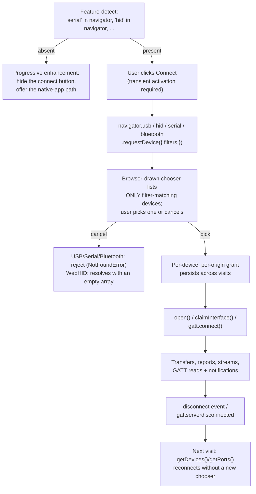

# [FEE-422] WebUSB, WebHID, Web Serial & Web Bluetooth — Hardware Device APIs

:::info
Four sibling APIs let a web page talk to physical hardware: WebUSB for raw USB transfers, WebHID for input-style devices that speak the HID report protocol, Web Serial for anything that looks like a serial port (Arduino, 3D printers, ESP32 boards), and Web Bluetooth for BLE peripherals over GATT. They share one security model: secure context, a user gesture, and a browser-drawn device chooser that grants access to exactly one device at a time. They also share a political reality. All four are Chromium-led, Mozilla and WebKit have published negative positions citing fingerprinting and the impossibility of explaining "this page may reprogram your device" in a permission prompt, and none is Baseline. That makes them progressive-enhancement APIs by definition: superb for firmware flashers, keyboard configurators, and lab tooling aimed at Chrome-capable audiences, and wrong as the only path to a mass-market feature. One position did move in 2026: Firefox Nightly shipped Web Serial behind an opt-in after Mozilla softened its stance on that one API to neutral.
:::

## Context

The gap these APIs fill used to be filled by native "companion apps": a keyboard's remapping tool, a printer's firmware updater, an IDE's board flasher. Each meant a download, an installer, and a driver. Chromium shipped Web Bluetooth in Chrome 56 and WebUSB in Chrome 61 (both 2017), then WebHID and Web Serial together in Chrome 89 (2021), and an ecosystem grew on top: browser-based Arduino/MicroPython workflows, the VIA/Vial keyboard configurators, Android flashing tools, point-of-sale and lab-equipment dashboards. Mozilla's standards positions record WebUSB, WebHID, and Web Bluetooth as negative ("harmful" in the dashboard's earlier taxonomy), Apple's WebKit team declined the whole family in its 2020 statement on 16 tracking-prone APIs, and MDN marks all four as limited availability, not Baseline. Web Serial is the exception that moved: Mozilla softened its position to neutral and shipped the API in Firefox Nightly in 2026. Planning should still assume a Chromium-only feature for the other three. This article covers the shared permission model, the code shape of each API, and where the safety boundaries (blocklists and protected classes) actually sit.

## Visual



## Example

**Web Serial** is the friendliest of the four because it hands you standard streams. Reading newline-delimited JSON telemetry from a microcontroller takes a `TextDecoderStream`, a small line-splitting transform, and a loop:

```js
class LineBreakTransformer {
  constructor() { this.buffer = ""; }
  transform(chunk, controller) {
    this.buffer += chunk;
    const lines = this.buffer.split("\n");
    this.buffer = lines.pop(); // keep the trailing partial line
    lines.forEach((line) => controller.enqueue(line));
  }
  flush(controller) { controller.enqueue(this.buffer); }
}

connectButton.addEventListener("click", async () => {
  const port = await navigator.serial.requestPort({
    filters: [{ usbVendorId: 0x2341 }], // only Arduino-vendor devices in the chooser
  });
  await port.open({ baudRate: 115200 });

  // Writing:
  const writer = port.writable.getWriter();
  await writer.write(new TextEncoder().encode("LED ON\n"));
  writer.releaseLock();

  // Reading (simplified; Deep Dive shows the canonical two-loop shape
  // that survives recoverable errors):
  const decoder = new TextDecoderStream();
  port.readable.pipeTo(decoder.writable);
  const reader = decoder.readable
    .pipeThrough(new TransformStream(new LineBreakTransformer()))
    .getReader();
  while (true) {
    const { value, done } = await reader.read();
    if (done) break;
    render(JSON.parse(value));
  }
});
```

**WebHID** deals in *reports*: fixed-format binary packets the device describes via its report descriptor. A configurator for a custom keyboard listens for input reports and sends feature/output reports:

```js
const [device] = await navigator.hid.requestDevice({
  filters: [{ vendorId: 0x1234, usagePage: 0xff60 }], // vendor-defined usage page
});
if (!device) return; // user cancelled: WebHID resolves with an empty array
await device.open();

device.addEventListener("inputreport", ({ device, reportId, data }) => {
  // data is a DataView over the report payload (report ID already stripped)
  updateUi(reportId, new Uint8Array(data.buffer));
});

await device.sendReport(0x00, new Uint8Array([SET_KEYMAP, layer, key, code]));
```

**Web Bluetooth** models BLE's GATT hierarchy directly (device, service, characteristic), and its chooser doubles as the scanner. Subscribing to a heart-rate monitor:

```js
const device = await navigator.bluetooth.requestDevice({
  filters: [{ services: ["heart_rate"] }],
  optionalServices: ["battery_service"], // undeclared services are unreachable later
});
device.addEventListener("gattserverdisconnected", scheduleReconnect);

const server = await device.gatt.connect();
const service = await server.getPrimaryService("heart_rate");
const hrm = await service.getCharacteristic("heart_rate_measurement");

await hrm.startNotifications();
hrm.addEventListener("characteristicvaluechanged", ({ target }) => {
  const flags = target.value.getUint8(0);
  const bpm = flags & 0x1 ? target.value.getUint16(1, true) : target.value.getUint8(1);
  chart.push(bpm);
});
```

**WebUSB** sits lowest: after `open()`, `selectConfiguration()`, and `claimInterface()`, you speak the device's own protocol through `transferIn`/`transferOut` (bulk/interrupt endpoints) and `controlTransfer`, which amounts to writing the driver in JavaScript. The shape is the same chooser-then-open flow; the payload logic is entirely device-specific.

On every one of these, reconnection across visits skips the chooser: `getDevices()`/`getPorts()` returns previously granted devices, and `connect`/`disconnect` events keep the UI in sync with the actual hardware when cables move.

## Best Practices

- **MUST** treat all four as progressive enhancement: feature-detect (`"hid" in navigator`), hide the capability when absent, and keep a native-tool fallback documented. None of these APIs is Baseline, and three of the four carry standing negative positions at Mozilla and WebKit.
- **MUST** call `requestDevice()`/`requestPort()` from a click handler, because transient activation (a fresh user gesture) is required, and design for the user cancelling the chooser: WebUSB, Web Serial, and Web Bluetooth reject with `NotFoundError`, while WebHID resolves with an empty array. Either way, cancellation is a normal outcome, not an exception path.
- **MUST** pass the narrowest filters you can (`vendorId`/`productId`, HID `usagePage`, BLE `services`): the chooser lists only matching devices, which is both better UX and less accidental exposure. An empty filter list that shows every device on the machine is a smell, and Web Bluetooth refuses it outright: `filters: []` throws a `TypeError`, and listing every nearby device requires an explicit `acceptAllDevices: true`.
- **MUST** declare every BLE service you will ever touch in `filters` or `optionalServices` at request time: services omitted there are permanently invisible to the granted session.
- **SHOULD** re-acquire granted devices on load via `getDevices()`/`getPorts()` and subscribe to `connect`/`disconnect` (or `gattserverdisconnected`) instead of forcing a fresh chooser every visit.
- **SHOULD** release what you hold: `reader.releaseLock()` before `port.close()`, `device.close()` when done, `gatt.disconnect()` on teardown. A claimed interface or locked stream blocks every other page and often the OS too.
- **SHOULD** wrap transfer loops in real error handling: hardware unplugs mid-transfer, and the failure arrives as a rejected promise in the middle of your protocol.
- **SHOULD** remember Windows-specific USB reality: WebUSB can only claim interfaces bound to the WinUSB driver; devices with vendor drivers installed will enumerate but fail to claim.
- **MAY** ship firmware-update flows on WebUSB/Web Serial, the strongest fit for these APIs (no installer, and the flasher is always current), and **MAY** combine WebHID with the Gamepad API where the generic mapping is not enough.

## Design Thinking

**The chooser is the security model.** Unlike camera/geolocation permissions ("this origin may use the capability"), the device family grants *this origin may use this one device*. The browser draws the picker, the page never sees devices the user did not select, and filters constrain what the picker even lists. That design deliberately trades away discovery (a page cannot enumerate hardware to fingerprint a machine) at the cost of one extra click per device, and it forecloses any "connect to whatever is plugged in" UX.

**Why the engines split.** Chromium's position: with per-device consent, blocklists, and protected classes, the residual risk is worth the escape from driver installers. Mozilla's position, recorded as negative for WebUSB and WebHID: the risk that a page reprograms a device into an attack platform (the classic demo turns a dev board into a USB keyboard that types commands) cannot be conveyed in any prompt a non-expert can evaluate, and USB-level identifiers are a fingerprinting surface. WebKit takes the same side. As of 2026 the standings are: negative positions on WebUSB, WebHID, and Web Bluetooth at Mozilla, opposition across the family at WebKit, and one exception in Web Serial, where Mozilla moved to neutral and shipped a Nightly experiment. Plan Chromium-only for the other three.

**The blocklists encode the threat model.** WebUSB refuses to claim *protected interface classes* (audio, HID, hub, mass storage, smart card, video, audio/video, wireless controller), so a page cannot keylog through a USB keyboard's interface or read a flash drive. WebHID strips system keyboards and mice from enumeration and blocks FIDO usage pages. Web Bluetooth's GATT blocklist refuses the HID service and FIDO traffic, so a page cannot phish an authenticator over any of the three transports. The common thread: the APIs hand you *your* gadget and carve out every device class whose compromise would break someone else's trust boundary.

## Deep Dive

**HID reports and usage pages.** A HID device self-describes through a report descriptor: *input* reports flow device-to-host (`inputreport` events), *output* reports host-to-device (`sendReport()`), and *feature* reports move configuration in both directions (`sendFeatureReport()`/`receiveFeatureReport()`). Devices are addressed by usage page and usage; the vendor-defined page range `0xFF00`-`0xFFFF` is where configurator protocols (like QMK's Raw HID) live, which is why WebHID filters take `usagePage`/`usage` alongside vendor/product IDs. `HIDDevice.collections` exposes the parsed descriptor so generic tools can adapt to unknown report layouts.

**Serial options beyond baudRate.** `port.open()` accepts `dataBits` (7/8), `stopBits` (1/2), `parity` (`"none"`/`"even"`/`"odd"`), `flowControl` (`"none"`/`"hardware"`), and `bufferSize`. The `readable` stream ends (with `done: true`) on fatal errors and produces a new stream object on recoverable ones. The canonical read loop is therefore *two* nested loops: `while (port.readable)` outside, `reader.read()` inside, `releaseLock()` in `finally`.

**USB transfer types.** Endpoints come in four flavors: control (setup/configuration, via `controlTransfer`), bulk (large reliable transfers), interrupt (small time-sensitive packets), and isochronous (bandwidth-guaranteed streaming, `isochronousTransferIn/Out`). `claimInterface()` takes exclusive ownership of an interface's endpoints, which is also why an OS driver and a web page can never share a device.

**BLE constraints.** Web Bluetooth supports BLE/GATT only: no Classic Bluetooth profiles (A2DP audio, SPP serial), so a Bluetooth speaker is out of scope by design. It is also the one API of the four with no Worker exposure (there is no `WorkerNavigator.bluetooth`). Characteristic payloads are small, bounded by the ATT MTU (the Attribute Protocol's negotiated packet size), and `writeValueWithResponse`/`writeValueWithoutResponse` expose the reliability/latency trade explicitly. Standard 16-bit UUIDs (`"heart_rate"`) are shorthand for the Bluetooth SIG's assigned numbers, while custom hardware uses full 128-bit UUIDs. Connections drop aggressively on mobile power management; production code treats `gattserverdisconnected` plus exponential-backoff reconnect as part of the normal flow.

## API and Support Matrix

| | WebUSB | WebHID | Web Serial | Web Bluetooth |
|---|---|---|---|---|
| Abstraction | Raw USB endpoints | HID reports | Byte streams | GATT services |
| Entry point | `navigator.usb` | `navigator.hid` | `navigator.serial` | `navigator.bluetooth` |
| Typical device | Flashable board, custom gadget | Keyboard configurator, macro pad, gamepad-adjacent | Arduino/ESP32, 3D printer, POS hardware | Heart-rate belt, sensor beacon, smart lock |
| Data primitive | `transferIn/Out`, `controlTransfer` | `sendReport` / `inputreport` | `ReadableStream`/`WritableStream` | `readValue`/`writeValue`/notifications |
| In Workers | Yes (dedicated) | Yes (dedicated) | Yes (dedicated) | No |
| Chromium desktop | Yes (61+) | Yes (89+) | Yes (89+) | Yes (56+) |
| Chromium Android | Yes | No | No | Yes |
| Firefox | No (negative position) | No (negative position) | Nightly experiment (2026); position neutral | No (negative position) |
| Safari | No (opposed) | No (opposed) | No (opposed) | No (opposed) |
| Baseline | No | No | No | No |

Support facts worth re-verifying at design time rather than memorizing: the Android row (HID and Serial are desktop-only), the Windows WinUSB driver requirement for WebUSB, and the evolving Firefox Serial experiment.

## Related Topics

- [Geolocation, Device Orientation & Device APIs](/en/Browser APIs and Web Platform/413)
- [Permissions API](/en/Browser APIs and Web Platform/415)
- [Fetch, Streams & Network APIs](/en/Browser APIs and Web Platform/403)
- [Web Workers & Concurrency](/en/Browser APIs and Web Platform/405)

## References

- MDN contributors, "WebUSB API," MDN Web Docs (2026). https://developer.mozilla.org/en-US/docs/Web/API/WebUSB_API
- MDN contributors, "WebHID API," MDN Web Docs (2026). https://developer.mozilla.org/en-US/docs/Web/API/WebHID_API
- MDN contributors, "Web Serial API," MDN Web Docs (2026). https://developer.mozilla.org/en-US/docs/Web/API/Web_Serial_API
- MDN contributors, "Web Bluetooth API," MDN Web Docs (2026). https://developer.mozilla.org/en-US/docs/Web/API/Web_Bluetooth_API
- WICG, "WebUSB API," Draft Community Group Report (maintained). https://wicg.github.io/webusb/
- Web Bluetooth CG, "GATT Blocklist," WebBluetoothCG/registries, GitHub (maintained). https://github.com/WebBluetoothCG/registries/blob/master/gatt_blocklist.txt
- Mozilla, "Mozilla Standards Positions," mozilla.github.io (maintained). https://mozilla.github.io/standards-positions/
- WebKit, "WebKit Standards Positions," GitHub (maintained). https://github.com/WebKit/standards-positions
- Chris Coyier, "Apple declined to implement 16 Web APIs in Safari due to privacy concerns," CSS-Tricks (2020). https://css-tricks.com/apple-declined-to-implement-16-web-apis-in-safari-due-to-privacy-concerns/
- Thomas Claburn, "Firefox Nightly adds Web Serial after years of saying no," The Register (2026). https://www.theregister.com/software/2026/04/14/firefox-nightly-adds-web-serial-after-years-of-saying-no/5225521

## Changelog

- **2026-04** — Web Serial shipped in Firefox Nightly behind an opt-in, after Mozilla's standards position on the API moved to neutral: the first non-Chromium movement in this family.
- **2021** — WebHID and Web Serial shipped in Chrome 89.
- **2017** — Web Bluetooth shipped in Chrome 56; WebUSB in Chrome 61.
