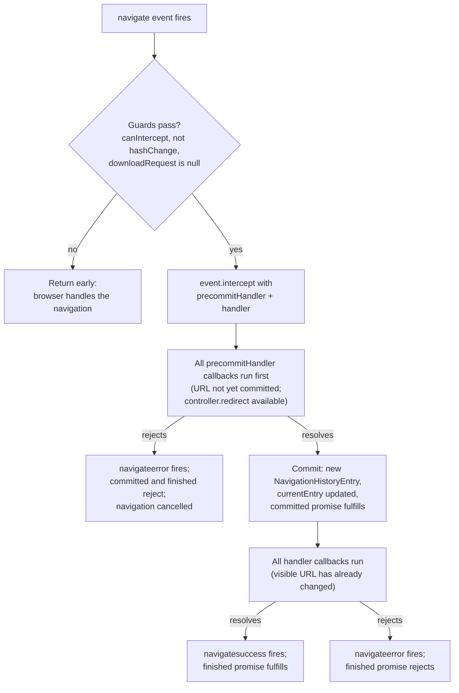

# [FEE-418] Navigation API — Intercepting and Managing SPA Navigation

:::info
The Navigation API is the successor to the History API and `window.location`, designed specifically for the needs of single-page applications, and it reached Baseline Newly Available in January 2026 when Safari and Firefox support landed. Instead of intercepting link clicks one by one, calling `preventDefault()`, and pushing state manually, an SPA registers a single `navigation.addEventListener("navigate")` listener that sees every same-origin navigation — link clicks, back/forward traversals, form submissions, and programmatic calls alike. Calling `event.intercept()` converts a navigation into a same-document transition with automatic URL and history-stack updates plus built-in focus management for accessibility. The API also exposes an inspectable history view via `currentEntry`, `entries()`, and `traverseTo()`, replacing the History API's opaque, iframe-polluted joint session history with a per-frame, same-origin list the application actually created.
:::

## Context

Before the Navigation API, SPA routing meant listening for link clicks, calling `preventDefault()`, invoking `History.pushState()` by hand, and reconstructing the view from the URL — and that ritual only covered user-initiated link clicks, not every way a navigation can start. The History API compounds the problem: its `popstate` event does not fire when `pushState` or `replaceState` are called programmatically, it cannot detect all navigation trigger types, and it cannot read or edit non-current history entries. It also surfaces the joint session history, including entries created by iframe navigations, which is painful for SPAs that only care about their own frame. The Navigation API launched in Chrome 102 (an earlier `transitionWhile()` design was replaced by `intercept()` in Chrome 105), graduated from WICG incubation into the WHATWG HTML Standard, and became Baseline Newly Available across all major browsers in early 2026 — though some parts may still have varying levels of support.

## Visual



## Example

A minimal SPA router lives in one listener. The three guard checks come first: `canIntercept` is false for cross-origin destinations and cross-document traversals, `hashChange` marks in-page fragment jumps that need no routing, and a non-null `downloadRequest` means the user clicked a download link.

```js
navigation.addEventListener("navigate", (event) => {
  if (!event.canIntercept) return;             // cross-origin or cross-document traversal
  if (event.hashChange) return;                 // fragment navigation, no view change needed
  if (event.downloadRequest !== null) return;   // download link, let the browser handle it

  const url = new URL(event.destination.url);

  // POST form submissions arrive in the same listener via event.formData.
  if (event.formData) {
    event.intercept({
      async handler() {
        const response = await fetch("/api/subscribe", {
          method: "POST",
          body: event.formData,
          signal: event.signal, // aborts if the user stops or navigates elsewhere
        });
        renderSubscribeResult(await response.json());
      },
    });
    return;
  }

  event.intercept({
    async handler() {
      // Runs after currentEntry has updated: the visible URL already shows url.
      const response = await fetch(`/api/content${url.pathname}`, {
        signal: event.signal,
      });
      renderView(await response.json());
    },
    focusReset: "after-transition", // default: focus [autofocus] element, or <body>
    scroll: "after-transition",     // default: scroll to fragment or restore position
  });
});
```

`event.signal` is an `AbortSignal` that becomes aborted if the navigation is cancelled — the user presses Stop or starts another navigation — so passing it to `fetch()` cancels in-flight requests when a navigation is preempted.

For route guards that must decide *before* the URL bar changes, `precommitHandler` runs before `currentEntry` is updated and receives a `NavigationPrecommitController` whose `redirect()` method can send the navigation somewhere else entirely:

```js
navigation.addEventListener("navigate", (event) => {
  if (!event.canIntercept || event.hashChange || event.downloadRequest !== null) return;

  const url = new URL(event.destination.url);
  if (!url.pathname.startsWith("/account/")) return;

  // Passing precommitHandler when event.cancelable is false throws SecurityError.
  if (!event.cancelable) return;

  event.intercept({
    async precommitHandler(controller) {
      const session = await fetch("/api/session", { signal: event.signal });
      if (!(await session.json()).authenticated) {
        controller.redirect("/signin/", { state: "signin-redirect", history: "push" });
      }
    },
    async handler() {
      renderAccountPage();
    },
  });
});
```

Programmatic navigation and history state round out the router. Every navigation method returns a pair of promises, and per-entry state replaces `history.state`:

```js
// committed fulfills when the visible URL changes and the entry is created;
// finished fulfills when every intercept() handler promise fulfills.
const { committed, finished } = navigation.navigate("/articles", {
  state: { section: "featured" },
});
await committed;
await finished;

// Update state without navigating -- e.g. remember an expanded <details> element.
// Fires the currententrychange event.
navigation.updateCurrentEntry({
  state: { ...navigation.currentEntry.getState(), detailsOpen: true },
});

// entries() is a snapshot of this frame's same-origin history;
// each entry's key feeds traverseTo().
const firstEntry = navigation.entries()[0];
await navigation.traverseTo(firstEntry.key).finished;
```

One caveat shapes app startup: the specification does not fire a `navigate` event on a page's first load, so a client-side-rendered app needs a separate initialization path that renders the initial route directly.

## Best Practices

- **MUST** guard every listener with the three checks — skip when `canIntercept` is false, `hashChange` is true, or `downloadRequest` is not null — before calling `intercept()`. Calling `intercept()` when `canIntercept` is false throws a `SecurityError` DOMException.
- **MUST** verify `event.cancelable` before passing a `precommitHandler`; doing so on a non-cancelable event throws a `SecurityError` DOMException.
- **MUST** pass `event.signal` to every `fetch()` issued inside a handler so preempted navigations cancel their in-flight requests instead of racing the next view.
- **MUST** provide a separate initialization path for the first page load, because no `navigate` event fires for it.
- **SHOULD** perform redirects (auth walls, canonicalization) in `precommitHandler` rather than `handler` — the pre-commit phase runs before the URL commits and its controller supports `redirect()`, whereas `handler` runs after the visible URL has already changed.
- **SHOULD** handle POST form submissions in the same `navigate` listener via `event.formData` instead of a parallel submit-listener code path.
- **SHOULD** use `navigation.updateCurrentEntry({ state })` for UI state that changes without navigation (such as an expanded `<details>` element), and read it back with `getState()`; the call fires `currententrychange`.
- **SHOULD** use an entry's `key` (stable across replacements) with `traverseTo()`, not its `id` (regenerated per entry state), when returning to a known point in history.
- **MAY** set `focusReset: "manual"` or `scroll: "manual"` to take over the browser's default focus and scrolling behavior, and **MAY** call `event.scroll()` inside a handler to trigger browser-driven scrolling early — for example, scroll once main content renders, then keep loading secondary content.
- **MAY** pass transient data between the initiating call and the listener via the `info` option, surfaced as `event.info`.

## Design Thinking

The two-phase handler design trades URL optimism against guard correctness. The post-commit `handler` gives users an immediately updated URL bar — the navigation *feels* instant even while content loads — but by the time it runs, the destination is already committed as `currentEntry`, so it is the wrong place to decide whether the navigation should happen at all. `precommitHandler` inverts the trade: it can modify, cancel, or redirect before anything becomes visible, at the cost of delaying the commit until its promise resolves. If it rejects, `navigateerror` fires, both the `committed` and `finished` promises reject, and the navigation is cancelled cleanly.

The API's restrictions are themselves a design position: sites should not be able to trap users. You cannot cancel a navigation via `preventDefault()` when the user presses the browser's Back or Forward buttons, cross-document traversals are uncancelable for performance reasons, and the history list cannot be programmatically modified or rearranged. Where the History API handed applications the joint session history — including iframe entries they never created — the Navigation API deliberately scopes its view to history entries created in the current browsing context that are same-origin with the current page, operating within a single frame. Less power, but a model an SPA can actually reason about.

## Deep Dive

Every navigation method — `navigate()`, `reload()`, `back()`, `forward()`, `traverseTo(key)` — returns `{ committed, finished }`. `committed` fulfills when the visible URL changes and a new `NavigationHistoryEntry` is created; `finished` fulfills when all promises returned by `intercept()` handlers fulfill, which is equivalent to `navigatesuccess` firing. The `Navigation` object fires four events in total: `navigate`, `navigatesuccess`, `navigateerror`, and `currententrychange`. When multiple `intercept()` calls register on one event, all `precommitHandler` callbacks execute first, then all `handler` callbacks — a fulfilled pre-commit phase commits the navigation (new entry, `committed` fulfills), and only then does the post-commit phase run. The `NavigationPrecommitController` also exposes `addHandler()` for registering additional post-commit handlers from within the pre-commit phase.

`NavigateEvent` carries the full decision surface: `canIntercept`, `destination` (a `NavigationDestination`), `downloadRequest`, `formData`, `hashChange`, `hasUAVisualTransition`, `info`, `navigationType` (`"push"`, `"reload"`, `"replace"`, or `"traverse"`), `signal`, `sourceElement` (the initiating element, such as a clicked link), and `userInitiated`. Beyond `SecurityError`, `intercept()` throws an `InvalidStateError` DOMException if the current document is not yet active or the navigation has already been cancelled; the method itself returns `undefined`. A `SecurityError` is also thrown if the event was dispatched synthetically via `dispatchEvent()` rather than by the user agent.

On the history side, each `NavigationHistoryEntry` distinguishes `id` — a user-agent-generated UUID for that specific entry state — from `key`, a UUID stable across replacements, and additionally exposes `index`, `sameDocument`, `url`, `getState()` (a copy of stored state, initially `undefined`), and a `dispose` event fired when the entry is removed from history. The `Navigation` interface itself exposes `currentEntry`, `transition` (a `NavigationTransition` while a navigation is in progress, otherwise null), `activation` (a `NavigationActivation` describing the most recent cross-document navigation), `canGoBack`, and `canGoForward`. The API also integrates with `document.startViewTransition()` for animated view transitions.

## Guard Conditions and Known Limits

The `navigate` event fires on almost any navigation that would update `navigation.currentEntry` — including programmatic navigations via `location.href`, form submissions, and back/forward traversals — but a specific set of cases falls outside the API's reach. Ship a router assuming these boundaries:

| Situation | Behavior |
|---|---|
| First page load | No `navigate` event fires; apps need a separate initialization path |
| Cross-document navigation from browser UI (URL bar, bookmarks, reload button) | No `navigate` event fires |
| Navigation initiated by a cross-origin window, or via `document.open()` | No `navigate` event fires |
| Destination differs in scheme, username, password, host, or port | `canIntercept` is false |
| Cross-document back/forward traversal | `canIntercept` is false; uncancelable for performance reasons |
| User presses browser Back/Forward | Cannot be cancelled via `preventDefault()` — sites must not trap users |
| History entries from embedded iframes or cross-origin pages | Not exposed; the API sees only same-origin entries created in the current browsing context, one frame at a time |
| Rearranging or editing the history list | Not possible; the API cannot programmatically modify the history list |
| `intercept()` on a hash change or download | Guard with `hashChange` and `downloadRequest` — these navigations should normally pass through |

Each `window` object has its own `navigation` instance (the API is accessed via the `Window.navigation` property), so an iframe's router and the top frame's router never observe each other's navigations. Note also that Baseline Newly Available status comes with MDN's caveat that some parts of the API may have varying levels of support across implementations.

## Related Topics

- [Events & Event Delegation](/en/Browser APIs and Web Platform/402)
- [Fetch, Streams & Network APIs](/en/Browser APIs and Web Platform/403)
- [URL State & Routing](/en/State Management/606)
- [View Transitions — Level 1](/en/Web Platform Proposals/CSS Experimental/11103)

## References

- MDN contributors, "Navigation API," MDN Web Docs (2026). https://developer.mozilla.org/en-US/docs/Web/API/Navigation_API
- web.dev team, "The Navigation API is now Baseline Newly available," web.dev (2026). https://web.dev/blog/baseline-navigation-api
- MDN contributors, "NavigateEvent: intercept() method," MDN Web Docs (2026). https://developer.mozilla.org/en-US/docs/Web/API/NavigateEvent/intercept
- MDN contributors, "NavigateEvent," MDN Web Docs (2026). https://developer.mozilla.org/en-US/docs/Web/API/NavigateEvent
- MDN contributors, "Navigation," MDN Web Docs (2026). https://developer.mozilla.org/en-US/docs/Web/API/Navigation
- WICG, "Navigation API (explainer)," GitHub / WICG (2023). https://github.com/WICG/navigation-api
- Jake Archibald, "Modern client-side routing: the Navigation API," Chrome for Developers (2022). https://developer.chrome.com/docs/web-platform/navigation-api

## Changelog

- **2026-01** — Baseline Newly Available: Safari and Firefox support landed, joining Chrome across all major browsers.
- **Spec migration** — The API graduated from WICG incubation and is now developed in the WHATWG HTML Standard.
- **Chrome 105** — `navigateEvent.transitionWhile(promise)` was replaced by `navigateEvent.intercept({ handler })` (breaking change from the original shipping design).
- **Chrome 102** — Initial launch of the Navigation API.
