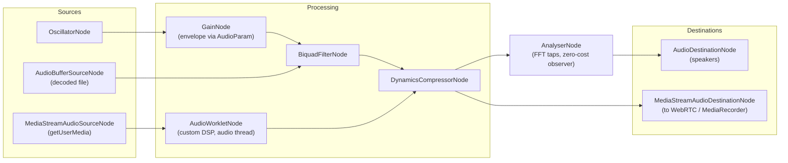

# [FEE-420] Web Audio API — The Browser's Audio Graph

:::info
The Web Audio API is not "play a sound file" — that is what `<audio>` is for. It is a modular synthesis and processing engine: sources, effects, analysers, and destinations are `AudioNode`s wired into an audio routing graph inside an `AudioContext`, and everything renders on a dedicated real-time audio thread with sample-accurate timing. The API has been Baseline Widely Available since April 2021 and is the substrate for browser games, DAWs, meeting products (level meters, noise gates), and data sonification. The parts that bite in production are not the node graph — they are the autoplay policy that starts contexts suspended, the two-clock scheduling problem, and writing custom DSP in an `AudioWorklet` without violating its 3 ms budget.
:::

## Context

The Web Audio API grew out of the death of Flash and the inadequacy of `<audio>` for anything interactive: an element can play, pause, and seek, but it cannot mix twenty overlapping sound effects with sample accuracy, apply a low-pass filter that follows a game character behind a wall, or synthesize a tone from scratch. The spec — largely designed at Google and shipped in Chrome in 2011, standardized as W3C Recommendation 1.0 in June 2021, with a 1.1 revision in progress — chose a graph model borrowed from modular synthesizers and audio frameworks like CoreAudio rather than a callback model. Native nodes (`GainNode`, `BiquadFilterNode`, `ConvolverNode`, `DynamicsCompressorNode`, `PannerNode`, and friends) run as optimized C++ on the audio rendering thread; the deprecated main-thread `ScriptProcessorNode` escape hatch was replaced by `AudioWorklet`, which runs developer JavaScript (or WebAssembly) on that same real-time thread. This article covers the graph, scheduling, worklets, and the autoplay rules that gate all of it.

## Visual



## Example

Everything starts with a context, and because of the autoplay policy the context is only reliably usable after a user gesture:

```js
const ctx = new AudioContext({ latencyHint: "interactive" });

playButton.addEventListener("click", async () => {
  // Without prior user interaction the context starts (or gets) suspended.
  if (ctx.state === "suspended") await ctx.resume();
  startEngine();
});
```

A synthesized note demonstrates the two ideas that make the API musical: nodes are cheap, disposable one-shots, and `AudioParam`s are scheduled, not set. Jumping `gain.value` directly produces an audible click; ramps are how you avoid it:

```js
function playNote(freq, at = ctx.currentTime) {
  const osc = new OscillatorNode(ctx, { type: "sawtooth", frequency: freq });
  const amp = new GainNode(ctx, { gain: 0 });

  // ADSR-ish envelope, scheduled sample-accurately on the audio clock.
  amp.gain.setValueAtTime(0, at);
  amp.gain.linearRampToValueAtTime(0.8, at + 0.02);           // attack
  amp.gain.setTargetAtTime(0.0001, at + 0.25, 0.08);          // release (exponential decay)

  osc.connect(amp).connect(ctx.destination);
  osc.start(at);
  osc.stop(at + 1);
  osc.onended = () => { osc.disconnect(); amp.disconnect(); }; // let GC reclaim
}
```

Playing decoded assets uses the same shape — fetch, decode once, then stamp out `AudioBufferSourceNode`s per playback (a source node can be started exactly once):

```js
const buffer = await ctx.decodeAudioData(
  await (await fetch("/sfx/hit.wav")).arrayBuffer(),
);
function playHit() {
  const src = new AudioBufferSourceNode(ctx, { buffer });
  src.connect(ctx.destination);
  src.start();
}
```

Custom DSP lives in an `AudioWorkletProcessor` — a class that runs on the audio rendering thread and receives audio in render quanta (128 frames per call today; read the array length, don't hardcode it):

```js
// noise-gate-processor.js -- loaded into the AudioWorkletGlobalScope
class NoiseGateProcessor extends AudioWorkletProcessor {
  static get parameterDescriptors() {
    return [{ name: "threshold", defaultValue: 0.01, automationRate: "k-rate" }];
  }
  process(inputs, outputs, parameters) {
    const input = inputs[0], output = outputs[0];
    const threshold = parameters.threshold[0];
    for (let ch = 0; ch < input.length; ch++) {
      const inCh = input[ch], outCh = output[ch];
      for (let i = 0; i < inCh.length; i++) {
        outCh[i] = Math.abs(inCh[i]) < threshold ? 0 : inCh[i];
      }
    }
    return true; // keep the processor alive
  }
}
registerProcessor("noise-gate", NoiseGateProcessor);
```

```js
// Main thread: load the module once, then instantiate like any node.
await ctx.audioWorklet.addModule("noise-gate-processor.js");
const mic = ctx.createMediaStreamSource(
  await navigator.mediaDevices.getUserMedia({ audio: true }),
);
const gate = new AudioWorkletNode(ctx, "noise-gate");
mic.connect(gate).connect(ctx.destination);
gate.parameters.get("threshold").setValueAtTime(0.02, ctx.currentTime);
```

## Best Practices

- **MUST** create or `resume()` the `AudioContext` from a user gesture and handle the `"suspended"` state; the autoplay policy uses sticky activation, and `navigator.getAutoplayPolicy("audiocontext")` tells you up front whether audible playback is `"allowed"`, `"allowed-muted"`, or `"disallowed"`.
- **MUST** use `AudioWorklet` for custom DSP. `ScriptProcessorNode` is deprecated, runs on the main thread, and turns every jank into an audible glitch.
- **MUST** keep `process()` allocation-free: no object creation, no closures, no `postMessage` per quantum. A garbage-collection pause on the audio thread is a dropout; at 48 kHz the budget for 128 frames is roughly 3 ms.
- **MUST** schedule musical time on the audio clock (`ctx.currentTime` plus `AudioParam` automation and `start(when)`), never with `setTimeout`/`Date.now()` alone — the main-thread clock jitters by tens of milliseconds under load.
- **SHOULD** use one `AudioContext` per page and suspend it when idle; contexts own OS audio resources, and browsers cap the number of concurrent contexts.
- **SHOULD** ramp every user-audible parameter change (`linearRampToValueAtTime`, `setTargetAtTime`) instead of assigning `param.value` — instantaneous jumps produce clicks and zipper noise.
- **SHOULD** render non-real-time work (mixdown, export, waveform pre-computation) with `OfflineAudioContext`, which processes the same graph faster than real time into an `AudioBuffer`.
- **SHOULD** feed visualizations from `AnalyserNode` (`getByteFrequencyData` / `getFloatTimeDomainData` per animation frame) rather than tapping samples through a worklet.
- **MAY** pass `latencyHint: "playback"` for non-interactive media to let the browser buffer more aggressively and save power, and **MAY** request a specific `sampleRate` at construction.
- **MAY** bridge graphs into the rest of the platform via `MediaStreamAudioDestinationNode` — the resulting `MediaStream` plugs into `RTCPeerConnection` or `MediaRecorder`.

## Design Thinking

**Graph, not callbacks.** The Web Audio API could have been a single "give me a buffer callback" hook — that is what the audio APIs of most operating systems expose, and what `ScriptProcessorNode` tried. The graph model costs a learning curve and some flexibility, but it buys the browser the right to run the entire native-node pipeline off the main thread, fuse and optimize it, and keep audio glitch-free while the page stutters. The design bet is that 95% of applications compose from stock nodes, and the remaining 5% get `AudioWorklet` on the engine's terms (fixed quantum, real-time constraints) rather than the main thread's terms.

**Two clocks, one seam.** `ctx.currentTime` advances on the audio hardware clock; `performance.now()` and `setTimeout` live on the main thread. The API's answer is Chris Wilson's lookahead pattern: a sloppy main-thread timer wakes up every ~25 ms and schedules, on the precise audio clock, everything that must happen in the next ~100 ms window. The main thread stays in control (tempo changes, user input) while the audio thread executes with sample accuracy — and a blocked main thread merely delays *new* scheduling instead of breaking what is already queued.

**Parameters are signals.** An `AudioParam` is not a number, it is a timeline that can itself be driven by another node's output (an LFO oscillator connected into `gain.gain`). That single decision — parameters are audio-rate inputs — is what makes the API a synthesizer rather than a mixer, at the cost of the `value` property being the API's most common false friend.

## Deep Dive

**The rendering loop.** The audio thread pulls the graph once per render quantum — 128 frames in the 1.0 spec (a 1.1 revision makes the quantum configurable). At 48 kHz that is one `process()` call every 2.67 ms per worklet node. Inside a quantum, native nodes process in topological order; cycles are only legal through a `DelayNode`. `AudioParam` automation distinguishes `a-rate` parameters (evaluated per sample — the parameter array has one value per frame) from `k-rate` (one value per quantum); worklet authors declare the rate in `parameterDescriptors` and must handle both array shapes, since an a-rate array with no scheduled changes arrives with length 1.

**Worklet lifetime and messaging.** `process()` returning `true` pins the processor alive; returning `false` lets the engine reclaim it once it is no longer sourcing or receiving audio. Each `AudioWorkletNode`/`AudioWorkletProcessor` pair shares a `MessagePort` — fine for control messages, wrong for audio data. The established pattern for streaming samples between a Worker and the audio thread is a `SharedArrayBuffer` ring buffer with `Atomics` for coordination, which is also the bridge for running existing C/C++ DSP compiled to WebAssembly inside the worklet.

**Decoding and memory.** `decodeAudioData()` inflates compressed audio to 32-bit float PCM: a 3-minute stereo MP3 becomes roughly 60 MB of `AudioBuffer` (48,000 samples × 2 channels × 4 bytes × 180 s). Decode once and share buffers across source nodes, prefer streaming via `MediaElementAudioSourceNode` for long-form material, and treat `AudioBuffer`s as the dominant memory cost of any sample-based app.

**State machine.** A context is `"suspended"`, `"running"`, or `"closed"` (a proposed `"interrupted"` state covers OS-level preemption such as phone calls); `statechange` fires on every transition. `suspend()` releases the audio hardware without tearing down the graph — the right idle behavior for apps that only sometimes make noise.

## Scheduling Reference

The automation methods on `AudioParam` are the vocabulary of the two-clock pattern; all take absolute times in seconds on the context's clock.

| Method | Behavior | Typical use |
|---|---|---|
| `setValueAtTime(v, t)` | Instant step at `t` | Anchoring a ramp's start point |
| `linearRampToValueAtTime(v, t)` | Linear glide from previous event to `t` | Attack envelopes, crossfades |
| `exponentialRampToValueAtTime(v, t)` | Exponential glide (values must be non-zero, same sign) | Perceptually smooth volume/pitch |
| `setTargetAtTime(v, t, timeConstant)` | Asymptotic approach starting at `t` | Releases, de-clicking a live control |
| `setValueCurveAtTime(curve, t, dur)` | Follow an arbitrary `Float32Array` curve | Custom fades, ducking shapes |
| `cancelScheduledValues(t)` | Drop automation at/after `t` | Rescheduling on tempo change |
| `cancelAndHoldAtTime(t)` | Cancel but freeze at the in-flight value | Interrupting a ramp without a jump |

The lookahead scheduler that drives them:

```js
const LOOKAHEAD_MS = 25;     // how often the main thread wakes
const HORIZON_S = 0.1;       // how far ahead it schedules on the audio clock
let nextNoteTime = 0;

function scheduler() {
  while (nextNoteTime < ctx.currentTime + HORIZON_S) {
    playNote(440, nextNoteTime);          // scheduled sample-accurately
    nextNoteTime += 60 / tempo / 4;       // sixteenth notes
  }
  setTimeout(scheduler, LOOKAHEAD_MS);    // jitter here is harmless
}
```

Shrinking `HORIZON_S` toward zero increases responsiveness to tempo/input changes but risks underruns when the main thread stalls; growing it makes playback bulletproof but laggy to control. 25 ms/100 ms is the classic starting point.

## Related Topics

- [WebRTC — Peer-to-Peer Media and Data Channels](/en/Browser APIs and Web Platform/webrtc)
- [Web Workers & Concurrency](/en/Browser APIs and Web Platform/405)
- [WebGL & WebGPU](/en/Browser APIs and Web Platform/408)
- [requestAnimationFrame & Animation Timing](/en/Browser APIs and Web Platform/412)
- [Web Speech API](/en/Browser APIs and Web Platform/416)

## References

- MDN contributors, "Web Audio API," MDN Web Docs (2026). https://developer.mozilla.org/en-US/docs/Web/API/Web_Audio_API
- MDN contributors, "Background audio processing using AudioWorklet," MDN Web Docs (2026). https://developer.mozilla.org/en-US/docs/Web/API/Web_Audio_API/Using_AudioWorklet
- MDN contributors, "Autoplay guide for media and Web Audio APIs," MDN Web Docs (2026). https://developer.mozilla.org/en-US/docs/Web/Media/Guides/Autoplay
- W3C, "Web Audio API 1.1," W3C Working Draft (2026). https://www.w3.org/TR/webaudio-1.1/
- W3C, "Web Audio API," W3C Recommendation (2021). https://www.w3.org/TR/webaudio-1.0/
- Chris Wilson, "A tale of two clocks," web.dev (2013, maintained). https://web.dev/articles/audio-scheduling
- Hongchan Choi, "Audio Worklet design patterns," Chrome for Developers (2018). https://developer.chrome.com/blog/audio-worklet-design-pattern/
