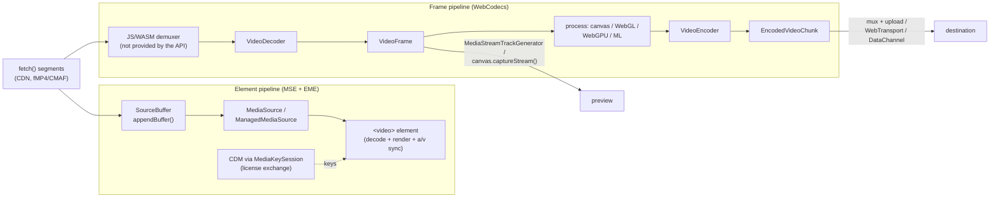

# [FEE-421] WebCodecs, MSE & EME — The Browser Media Pipeline

:::info
Three APIs partition the space between "set `video.src` and hope" and "ship your own player". Media Source Extensions (MSE) lets JavaScript feed a `<video>` element segment by segment: the machinery behind hls.js, dash.js, and Shaka Player. Encrypted Media Extensions (EME) adds the license exchange that lets that same element play DRM-protected content through a Content Decryption Module. WebCodecs drops below both, exposing the browser's hardware encoders and decoders frame by frame for editors, transcoders, and low-latency streaming. MSE and EME have been Baseline (supported in every major engine) for years. WebCodecs shipped in Chrome in 2021 and has since landed in Firefox and Safari, but it is not yet Baseline and codec coverage still varies per browser. On iPhone, plain MSE never shipped at all; the Safari-led `ManagedMediaSource` is the required doorway, and it comes with strings attached. This article maps the seams between the three layers, the code at each one, and the compatibility cliffs.
:::

## Context

The `<video>` element made playback declarative but monolithic: one URL, browser-controlled buffering, no way to switch quality mid-stream or to protect content. Flash and Silverlight filled that gap until MSE (W3C Recommendation 2016) moved adaptive streaming into JavaScript and EME (W3C Recommendation 2017, Baseline since 2019) standardized the DRM handshake, decisions born directly from the era's largest streaming services and the plugin deprecations of the mid-2010s. What remained closed was the codec itself: to touch decoded pixels you rendered video to a canvas and paid for it, and to encode you shipped a WebAssembly build of FFmpeg and burned CPU on work the device's media block does for free. WebCodecs (2021, W3C Working Draft) opened that last box with a deliberately thin abstraction over platform codecs.

## Visual



## Example

**MSE** hands a `<video>` element a constructed timeline. Three rules break first-time implementations: appends are asynchronous and must be serialized on `updateend`; the container must be fragmented MP4 (fMP4/CMAF, the streaming-friendly packaging where a progressive MP4's trailing `moov` index atom is replaced by per-segment metadata) or WebM; and on iPhone, `ManagedMediaSource` only streams once remote playback is addressed:

```js
const video = document.querySelector("video");
const MediaSourceCtor = self.ManagedMediaSource ?? self.MediaSource; // iPhone: MMS only
// MMS prerequisite: disable remote playback (or provide an AirPlay
// <source> alternative), or Safari will not start streaming.
video.disableRemotePlayback = true;
const ms = new MediaSourceCtor();
video.src = URL.createObjectURL(ms);

ms.addEventListener("sourceopen", async () => {
  const mime = 'video/mp4; codecs="avc1.64001f, mp4a.40.2"';
  if (!MediaSourceCtor.isTypeSupported(mime)) throw new Error("unsupported");
  const sb = ms.addSourceBuffer(mime);
  const segments = ["/seg/init.mp4", "/seg/1.m4s", "/seg/2.m4s"];

  const queue = [];
  let fetched = 0;
  const pump = () => {
    if (sb.updating) return;
    if (queue.length) sb.appendBuffer(queue.shift());
    else if (fetched === segments.length) ms.endOfStream(); // finite demo asset
  };
  sb.addEventListener("updateend", pump);

  for (const url of segments) {
    queue.push(await (await fetch(url)).arrayBuffer());
    fetched++;
    pump(); // serialized: appendBuffer while updating throws InvalidStateError
  }
});
```

**EME** attaches keys to that same element. The *shape* of the flow is shared across keysystems, but the parameters are not: the keysystem string, `initDataTypes`, robustness values, and certificate handling all vary. FairPlay diverges most, with `"sinf"`/`"skd"` initData instead of `"cenc"` (Common Encryption) and a mandatory `setServerCertificate()` step before licensing:

```js
const access = await navigator.requestMediaKeySystemAccess("com.widevine.alpha", [{
  initDataTypes: ["cenc"],
  videoCapabilities: [{ contentType: 'video/mp4; codecs="avc1.64001f"',
                        robustness: "SW_SECURE_CRYPTO" }], // keysystem-specific ladder
}]);
const mediaKeys = await access.createMediaKeys();
await video.setMediaKeys(mediaKeys);

// "encrypted" fires once per stream (audio and video initData both arrive);
// real players dedupe initData before opening sessions.
video.addEventListener("encrypted", async ({ initDataType, initData }) => {
  const session = mediaKeys.createSession();
  session.addEventListener("message", async ({ message }) => {
    const license = await fetch("/license", { method: "POST", body: message });
    await session.update(await license.arrayBuffer()); // CDM installs the keys
  });
  await session.generateRequest(initDataType, initData);
});
```

**WebCodecs** skips the element entirely. A decoder is a queue with two callbacks; feed it demuxed `EncodedVideoChunk`s and paint the `VideoFrame`s it emits. Close every frame: frames wrap GPU/decoder memory that garbage collection will not save you from:

```js
const decoder = new VideoDecoder({
  output: (frame) => {
    ctx.drawImage(frame, 0, 0, canvas.width, canvas.height);
    frame.close(); // not optional: decoders stall when their frame pool is exhausted
  },
  error: (e) => console.error(e),
});

const config = { codec: "avc1.64001f", codedWidth: 1920, codedHeight: 1080 };
const { supported } = await VideoDecoder.isConfigSupported(config);
if (!supported) throw new Error("pick another codec");
decoder.configure(config);

// Demuxing is your job (e.g. mp4box.js). For real files, watch
// decoder.decodeQueueSize instead of queueing everything at once.
for (const sample of demuxedSamples) {
  decoder.decode(new EncodedVideoChunk({
    type: sample.isKeyframe ? "key" : "delta",
    timestamp: sample.timestampMicros,
    data: sample.bytes,
  }));
}
await decoder.flush(); // drain once at the end -- not per frame
decoder.close();
```

Encoding mirrors it: `VideoFrame` in (from a canvas, camera track, or decoder output), `EncodedVideoChunk` out, with `encodeQueueSize` as the backpressure signal.

## Best Practices

- **MUST** call `frame.close()` on every `VideoFrame`/`AudioData` as soon as it is consumed. These objects hold hardware memory outside the JS heap; leaking them stalls the decoder long before the GC notices anything.
- **MUST** use fully specified codec strings (`"avc1.64001f"`, `"vp09.00.40.08"`, `"av01.0.04M.08"`) and check `isConfigSupported()`/`isTypeSupported()` before configuring; support genuinely differs per browser, per OS, and per hardware.
- **MUST** serialize `appendBuffer()` calls behind `updateend`; appending while `sb.updating` is true throws `InvalidStateError`.
- **MUST** feed MSE fragmented containers (fMP4/CMAF or WebM) with the init segment first; progressive MP4s must be re-fragmented at packaging time.
- **MUST** use `ManagedMediaSource` (with a plain-`MediaSource` fallback) to reach iPhone, and satisfy its activation contract: set `video.disableRemotePlayback = true` or provide an AirPlay `<source>` alternative, and prefer appending while its `streaming` attribute says the UA wants data. Classic MSE has never been available in iPhone Safari; MMS, shipped with iOS 17.1, is the only entry point there.
- **SHOULD** run media pipelines in a Worker: WebCodecs is fully available in dedicated workers, and MSE-in-Workers (via `MediaSource.handle` transferred to the element's `srcObject`) keeps appends off a busy main thread.
- **SHOULD** handle `QuotaExceededError` from `appendBuffer()` by calling `sourceBuffer.remove()` on played ranges; buffer quota varies wildly across devices, and with `ManagedMediaSource` also listen for `bufferedchange` eviction events.
- **SHOULD** watch `encodeQueueSize`/`decodeQueueSize` (and the `dequeue` event) for backpressure instead of queueing an entire file into a codec.
- **SHOULD** request the lowest EME robustness level the business actually requires; higher levels (hardware-backed paths) reduce device reach and can trigger extra permission UX.
- **MAY** use `ImageDecoder` from the same API family to step through animated AVIF/GIF/WebP frames instead of `` hacks.

## Design Thinking

**Three layers, one trade: control versus what the element does for free.** The `<video>` element gives you buffering, decode, audio/video sync, rotation metadata, PiP, remote playback, and power management. MSE keeps all of that and hands you only the *delivery* seam: you choose the bytes, the element still plays them. WebCodecs hands you the codec seam and nothing else. It does not demux, mux, synchronize, or render; the spec's scope is deliberately "codecs, not containers," which is why every real WebCodecs app pairs it with a JS/WASM demuxer and its own presentation clock. Choosing WebCodecs means re-implementing the element; the payoff is frame-level access the element will never give you.

**EME's shape is a political settlement as much as an architecture.** The browser standardizes only the *handshake* (`requestMediaKeySystemAccess`, opaque `message` blobs, `update()`); the actual decryption lives in a proprietary CDM (Widevine, PlayReady, FairPlay) that the browser sandboxes. That is why one player codebase can target every keysystem by swapping configuration, and also why debugging stops at the CDM boundary. The settlement was real and contested: EME advanced to Recommendation over formal objections, and the EFF resigned from the W3C over it in 2017.

**ManagedMediaSource inverts MSE's memory contract.** Classic MSE lets the app plan the buffer, but the UA may still evict buffered data during your own appends, and it signals memory pressure only by throwing `QuotaExceededError`. MMS goes further: the UA owns the buffer outright, may evict at any moment, and reports what changed through `bufferedchange`. Apple's stated reason for never shipping classic MSE on iPhone is power; page-controlled buffering keeps the network radio busy, and MMS makes UA-owned eviction plus batched, radio-friendly appends the price of entry.

## Deep Dive

**WebCodecs' processing model** is a control-message queue per codec instance. `configure()`, `encode()`/`decode()`, and `flush()` append messages; `reset()` synchronously purges the queue (dropping in-flight work) and `close()` does so terminally. Output arrives through callbacks rather than promises: a promise per frame at 60 fps is measurable overhead. The one promise in the hot path, `flush()`, is meant to be awaited once per stream or seek, and after a flush the decoder requires a fresh key frame, so flushing per frame turns a delta stream into an error source. Decoders must be fed a key frame first in any case: after a seek, that means locating the preceding sync sample in your demuxer, decoding forward, and discarding frames before the target timestamp. `VideoFrame` carries `timestamp`/`duration` in microseconds plus `VideoColorSpace`; an encoded chunk is typically 10-100x smaller than the frame it came from, which is also a fair mental model of what leaking frames costs.

**The seams between the APIs are first-class.** `VideoFrame` accepts a `CanvasImageSource` and is itself a `CanvasImageSource`, so canvases, `ImageBitmap`s, and WebGL/WebGPU textures flow both ways. Camera tracks meet WebCodecs through `MediaStreamTrackProcessor` (a `ReadableStream` of `VideoFrame`s) and frames become tracks again via `MediaStreamTrackGenerator`/`VideoTrackGenerator`, the Chromium-led "breakout box" path that is still uneven across engines. Encoded chunks travel over WebTransport datagrams or WebRTC data channels for custom low-latency streaming, the niche between MSE (seconds of latency, easy) and full WebRTC (sub-second, but bringing its own transport and topology machinery).

**EME session mechanics** go beyond the happy path. `MediaKeySession.keyStatuses` maps key IDs to states (`"usable"`, `"expired"`, `"output-restricted"`; the last is how HDCP failures surface, HDCP being the display-link encryption that protected content requires, typically seen as black frames on an external display). `waitingforkey` fires on the element when playback stalls for a missing key, and session types split into `"temporary"` and `"persistent-license"` for offline playback where the CDM and the license policy both allow it. Robustness strings are keysystem-specific (Widevine's ladder runs `SW_SECURE_CRYPTO` through `HW_SECURE_ALL`); servers commonly gate 1080p+ behind hardware levels, which is why the same stream tops out at different resolutions per device.

## Pipeline Selection Matrix

| Need | Reach for | Why not the others |
|---|---|---|
| Play a file, default controls | `<video src>` | Everything else is extra code for no gain |
| Adaptive bitrate VOD/live (DASH/HLS) | MSE (via hls.js/dash.js/Shaka) | WebCodecs re-implements the element; `src` can't switch renditions |
| Same, reaching iPhone | Native HLS (`src=*.m3u8`) or `ManagedMediaSource` | Classic MSE does not exist on iPhone |
| Protected content | EME on top of MSE | There is no other sanctioned decryption path |
| Video editor, transcoder, frame-accurate processing | WebCodecs (+ WASM demuxer/muxer, Worker) | The element exposes no frames; wasm-only codecs waste the hardware block |
| Sub-second live to many viewers | WebCodecs over WebTransport | MSE buffers too much; WebRTC topology may not fit fan-out |
| Conferencing | [WebRTC (FEE-419)](/en/Browser APIs and Web Platform/webrtc) | Everything else lacks NAT traversal + congestion control |
| Camera effects into a call | `MediaStreamTrackProcessor` + WebCodecs/canvas | Element pipeline never exposes the track's frames |

The support picture in one line: MSE and EME are Baseline and everywhere (with the iPhone caveat), while WebCodecs is Chromium 94+, Firefox 130+ (desktop only), and Safari 16.4+ for video with audio codecs completed in Safari 26. Capable, but not Baseline, so feature-detect per codec, not per API.

## Related Topics

- [WebRTC — Peer-to-Peer Media and Data Channels](/en/Browser APIs and Web Platform/webrtc)
- [WebTransport](/en/Browser APIs and Web Platform/411)
- [Web Audio API — The Browser's Audio Graph](/en/Browser APIs and Web Platform/web-audio-api)
- [Web Workers & Concurrency](/en/Browser APIs and Web Platform/405)
- [Transferable Objects](/en/Browser APIs and Web Platform/417)

## References

- MDN contributors, "WebCodecs API," MDN Web Docs (2026). https://developer.mozilla.org/en-US/docs/Web/API/WebCodecs_API
- MDN contributors, "Media Source Extensions API," MDN Web Docs (2026). https://developer.mozilla.org/en-US/docs/Web/API/Media_Source_Extensions_API
- MDN contributors, "Encrypted Media Extensions API," MDN Web Docs (2026). https://developer.mozilla.org/en-US/docs/Web/API/Encrypted_Media_Extensions_API
- W3C, "WebCodecs," W3C Working Draft (2026). https://www.w3.org/TR/webcodecs/
- W3C, "Media Source Extensions," W3C (maintained). https://www.w3.org/TR/media-source-2/
- WebKit team, "Managed Media Source," WebKit Blog (2023). https://webkit.org/blog/14735/managed-media-source/
- Eugene Zemtsov, François Beaufort, "Video processing with WebCodecs," Chrome for Developers (2020, updated). https://developer.chrome.com/docs/web-platform/best-practices/webcodecs
- caniuse.com, "ManagedMediaSource API," Can I use (2026). https://caniuse.com/mdn-api_managedmediasource
- EFF, "An open letter to the W3C Director, CEO, team and membership," Electronic Frontier Foundation (2017). https://www.eff.org/deeplinks/2017/09/open-letter-w3c-director-ceo-team-and-membership

## Changelog

- **2024-2025** — WebCodecs completed its spread: Firefox 130 shipped it on desktop (2024), and Safari 26 added the audio codecs (2025); still short of Baseline, with codec coverage varying.
- **2023** — Safari 16.4 shipped video WebCodecs (March); `ManagedMediaSource` shipped in Safari 17 (October), reaching iPhone via iOS 17.1 as the first MSE-family API available there.
- **2021** — WebCodecs shipped in Chrome 94.
- **2017 / 2016** — EME and MSE published as W3C Recommendations; EME Baseline since 2019.
