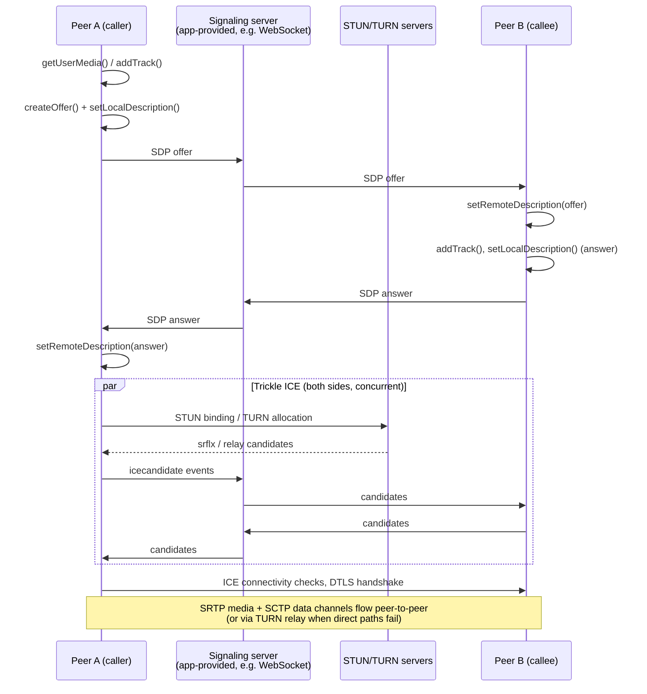

# [FEE-419] WebRTC — Peer-to-Peer Media and Data Channels

:::info
WebRTC (Web Real-Time Communication) lets browsers exchange audio, video, and arbitrary data directly with each other — no plugin, and in the best case no media server in the path. The API surface is small (`RTCPeerConnection`, `RTCDataChannel`, `getUserMedia`, `getDisplayMedia`) but the machinery underneath is not: every connection is negotiated through an SDP offer/answer exchange over an application-provided signaling channel, punched through NATs with ICE using STUN and TURN servers, and encrypted end-to-end with DTLS and SRTP. WebRTC 1.0 has been a W3C Recommendation since January 2021, all major browsers default to DTLS 1.3 as of early 2025, and the standardized Encoded Transform API reached cross-browser Baseline in 2025 — the platform is mature, and the hard parts today are negotiation correctness and deployment topology, not browser support.
:::

## Context

Before WebRTC, real-time media in the browser meant Flash or proprietary plugins, and "peer-to-peer" meant a desktop app. The project began at Google in 2011 with the open-sourcing of codec and echo-cancellation code, was standardized jointly by the W3C (the JavaScript API) and the IETF (the wire protocols), and reached W3C Recommendation status on 26 January 2021. Adoption long preceded the stamp: video conferencing, live streaming ingestion, cloud gaming, and file-transfer tools all shipped on pre-1.0 WebRTC. What kept the technology hard was never browser availability — it is that WebRTC deliberately standardizes only what happens *after* two peers know about each other. Signaling transport, session management, and multi-party topology are the application's problem. This article covers the connection machinery, the negotiation pattern that survives real-world race conditions, screen capture as a media source, and the topology decisions every production deployment faces. Companion transports are covered in [WebSockets & Server-Sent Events](/en/Browser APIs and Web Platform/409) and [WebTransport](/en/Browser APIs and Web Platform/411).

## Visual



## Example

The recommended negotiation code is the **perfect negotiation** pattern from the WebRTC spec and MDN: both peers run identical logic, and a boolean `polite` flag (assigned by the application, e.g. "the peer that joined second is polite") deterministically resolves *glare* — both sides sending an offer at once. The polite peer rolls back its own offer and accepts the incoming one; the impolite peer ignores the collision and wins.

```js
const pc = new RTCPeerConnection({
  iceServers: [
    { urls: "stun:stun.example.net" },
    { urls: "turn:turn.example.net", username: "u", credential: "c" },
  ],
});

let makingOffer = false;
let ignoreOffer = false;
let isSettingRemoteAnswerPending = false;

pc.onnegotiationneeded = async () => {
  try {
    makingOffer = true;
    // Argument-less setLocalDescription() creates the right description
    // for the current signalingState -- here, always an offer.
    await pc.setLocalDescription();
    signaler.send({ description: pc.localDescription });
  } finally {
    makingOffer = false;
  }
};

pc.onicecandidate = ({ candidate }) => signaler.send({ candidate });

signaler.onmessage = async ({ description, candidate }) => {
  if (description) {
    const readyForOffer =
      !makingOffer &&
      (pc.signalingState === "stable" || isSettingRemoteAnswerPending);
    const offerCollision = description.type === "offer" && !readyForOffer;

    ignoreOffer = !polite && offerCollision;
    if (ignoreOffer) return; // impolite peer wins the glare

    isSettingRemoteAnswerPending = description.type === "answer";
    // For the polite peer mid-collision, this implicitly rolls back
    // its own pending offer before applying the remote one.
    await pc.setRemoteDescription(description);
    isSettingRemoteAnswerPending = false;

    if (description.type === "offer") {
      await pc.setLocalDescription(); // creates the answer
      signaler.send({ description: pc.localDescription });
    }
  } else if (candidate) {
    try {
      await pc.addIceCandidate(candidate);
    } catch (err) {
      if (!ignoreOffer) throw err; // candidate errors for ignored offers are expected
    }
  }
};
```

Attaching media and reacting to it is symmetric on both ends:

```js
const stream = await navigator.mediaDevices.getUserMedia({
  video: true,
  audio: true,
});
for (const track of stream.getTracks()) {
  pc.addTrack(track, stream); // fires negotiationneeded on the other fields above
}

pc.ontrack = ({ track, streams }) => {
  track.onunmute = () => {
    remoteVideo.srcObject = streams[0];
  };
};
```

Data channels ride the same connection over SCTP, DTLS-encrypted like everything else. Reliability is tunable per channel — a game's position updates can afford loss; a file transfer cannot:

```js
// Reliable, ordered (TCP-like) -- the default.
const fileChannel = pc.createDataChannel("file-transfer");

// Unordered, drop after one retransmit attempt (UDP-like).
const gameChannel = pc.createDataChannel("positions", {
  ordered: false,
  maxRetransmits: 1,
});

// Backpressure: never blindly push a large file into the buffer.
fileChannel.bufferedAmountLowThreshold = 256 * 1024;
fileChannel.onbufferedamountlow = () => sendNextChunk();
```

Connection health is observable and recoverable. `connectionState` reaching `"failed"` calls for an ICE restart, which renegotiates candidates without tearing down the session:

```js
pc.onconnectionstatechange = () => {
  if (pc.connectionState === "failed") {
    pc.restartIce(); // triggers negotiationneeded with new ICE credentials
  }
};
```

## Best Practices

- **MUST** deploy a TURN server for production. Symmetric NATs and enterprise firewalls make direct and STUN-derived paths impossible for a meaningful fraction of real users; without a `relay` fallback those calls simply fail.
- **MUST** implement the perfect negotiation pattern (polite/impolite roles, `makingOffer`, `ignoreOffer`) rather than ad-hoc caller/callee logic — glare is not an edge case once both sides can add tracks or channels at runtime.
- **MUST** call `track.stop()` on every capture track when a call ends. Closing the peer connection does not release the camera, microphone, or screen; the recording indicator stays on and users notice.
- **MUST** serve over HTTPS: `getUserMedia`, `getDisplayMedia`, and the rest of the capture surface exist only in secure contexts.
- **SHOULD** use trickle ICE (send candidates as `icecandidate` fires) instead of waiting for `iceGatheringState === "complete"` — it cuts connection setup from many seconds to typically under one.
- **SHOULD** watch `connectionState` and call `restartIce()` on `"failed"`; networks change (Wi-Fi to cellular) and sessions are expected to survive it.
- **SHOULD** respect data-channel backpressure via `bufferedAmount` and `bufferedamountlow`, and keep individual messages small: without a negotiated `max-message-size`, RFC 8841 specifies a 64 KB default, and large messages cause head-of-line blocking across every channel sharing the SCTP association.
- **SHOULD** monitor call quality with `getStats()` (packet loss, jitter, round-trip time, selected candidate pair) rather than waiting for user complaints.
- **MAY** use `RTCRtpScriptTransform` (Encoded Transforms, Baseline since 2025) to process encoded frames in a worker — the standard hook for end-to-end encryption across an SFU.
- **MAY** create data channels with `negotiated: true` and matching `id`s on both sides when the channel set is static, skipping in-band channel announcement.

## Design Thinking

**Signaling is unspecified on purpose.** The standard defines what peers say (SDP) but not how the messages travel. That is a real cost — every team rebuilds a signaling layer, usually on WebSockets — but it buys deployment freedom: signaling can piggyback on an existing session server, a queue, or a QR code, and it keeps the trust decision (who may call whom) in the application where it belongs.

**Topology is the scaling decision.** Peer-to-peer *mesh* needs no media infrastructure but every participant uploads to every other participant — upstream bandwidth and encoding cost grow linearly with participants, which in practice caps mesh at roughly a handful of peers. An *SFU* (Selective Forwarding Unit) terminates each peer's single upstream and forwards packets selectively to the others: server bandwidth scales, clients don't re-encode, and simulcast lets the SFU pick a quality per receiver — this is the default architecture for group calling. An *MCU* (Multipoint Control Unit) decodes and mixes everything into one stream per client: cheapest for clients and legacy interop, most expensive on the server, and it forecloses per-receiver layout. The trade is always client upstream cost versus server compute versus flexibility. Note that an SFU or MCU is itself "just" a WebRTC peer — the browser API does not change; the topology lives entirely in infrastructure.

**Reliability is a per-channel dial, not a property of the transport.** By exposing `ordered`, `maxRetransmits`, and `maxPacketLifeTime` per data channel, WebRTC lets one connection carry TCP-like file transfer next to UDP-like telemetry. The cost is that the developer must actually choose — defaults are fully reliable, which silently turns a "real-time" channel into a latency amplifier on lossy links.

## Deep Dive

**ICE candidate types.** Each peer gathers `host` candidates (local interface addresses), `srflx` server-reflexive candidates (the public address a STUN server observed), and `relay` candidates (an address allocated on a TURN server that will forward traffic). `prflx` peer-reflexive candidates are discovered during connectivity checks themselves, typically behind symmetric NATs. ICE pairs local and remote candidates, checks them in priority order, and one agent (the *controlling* agent) nominates the pair that carries the session; `getStats()` exposes which pair won. End-of-candidates is signaled by an `icecandidate` event whose `candidate` is empty or null — forward it like any other candidate so the remote side can finish checking.

**The encrypted stack.** Media flows as SRTP and data as SCTP, both keyed through a DTLS handshake performed directly between the peers — there is no unencrypted mode in WebRTC. Certificate fingerprints ride in the SDP, so a tampered signaling channel is the main man-in-the-middle risk: protecting signaling with TLS and authenticating users there is part of the security model, not an optional extra. Since February 2025, Chrome, Firefox, and Safari all default to DTLS 1.3.

**Encoded Transforms.** `RTCRtpScriptTransform` inserts a `TransformStream` running in a Worker between the encoder and the packetizer (and its mirror on the receive side), operating on `RTCEncodedVideoFrame`/`RTCEncodedAudioFrame`. Because the transform sees encoded frames, it enables end-to-end encryption that an SFU cannot read while still letting the SFU route packets — the frames it forwards are opaque payloads. Safari shipped the standardized API in 2022, Firefox in 2023, and with Chrome's alignment the feature reached Baseline in 2025.

**Renegotiation and ICE restarts.** Adding a track, changing directionality, or calling `restartIce()` fires `negotiationneeded` and runs the same offer/answer machinery over the existing connection. `setLocalDescription({ type: "rollback" })` returns to the last stable state — this is the primitive perfect negotiation leans on. An ICE restart issues new credentials and re-gathers candidates without interrupting already-flowing media until the new pair takes over, which is what makes network handoff survivable.

## Screen Capture and Display Surfaces

Screen sharing is the same pipeline with a different source: `navigator.mediaDevices.getDisplayMedia()` resolves to a `MediaStream` whose video track carries a *display surface* — a `"monitor"`, `"window"`, or `"browser"` tab, chosen by the user in a browser-drawn picker. The API is deliberately more restrictive than `getUserMedia`: it requires transient activation (a click), the site cannot preselect the surface, permission is granted per invocation rather than persisted, and `min`/`exact` constraints throw a `TypeError` so a site cannot force resolution on a surface it has not seen.

```js
const screen = await navigator.mediaDevices.getDisplayMedia({
  video: { displaySurface: "window" }, // a hint, not a guarantee
  audio: { suppressLocalAudioPlayback: true },
  selfBrowserSurface: "exclude",  // hide this tab from the picker (avoids hall-of-mirrors)
  surfaceSwitching: "include",    // let the user switch surfaces mid-capture
  monitorTypeSurfaces: "include",
  systemAudio: "exclude",
});
const [screenTrack] = screen.getVideoTracks();

// Share into an existing call: replaceTrack avoids renegotiation.
const sender = pc.getSenders().find((s) => s.track?.kind === "video");
await sender.replaceTrack(screenTrack);

// The browser's own "Stop sharing" UI ends the track -- observe it.
screenTrack.onended = () => sender.replaceTrack(cameraTrack);
```

Two younger companions narrow what gets captured when a tab shares itself (`preferCurrentTab: true`): **Region Capture** (`CropTarget.fromElement()` plus `track.cropTo()`) crops the captured video to one element's rendered box, and **Element Capture** (`RestrictionTarget.fromElement()` plus `track.restrictTo()`) goes further by excluding occluding content entirely. A **CaptureController** passed in the options can additionally forward wheel events and zoom the captured tab (Captured Surface Control). These extensions are Chromium-led and not Baseline; treat them as progressive enhancements, and note that audio capture support differs per browser and per surface type. Every captured surface is a privacy risk the user cannot fully assess mid-share — incoming-notification anecdotes are legion — so prefer `"window"`/`"browser"` sharing flows over whole-monitor defaults in your UI copy.

## Related Topics

- [WebSockets & Server-Sent Events](/en/Browser APIs and Web Platform/409)
- [WebTransport](/en/Browser APIs and Web Platform/411)
- [Web Workers & Concurrency](/en/Browser APIs and Web Platform/405)
- [Transferable Objects](/en/Browser APIs and Web Platform/417)
- [Fetch, Streams & Network APIs](/en/Browser APIs and Web Platform/403)

## References

- MDN contributors, "WebRTC API," MDN Web Docs (2026). https://developer.mozilla.org/en-US/docs/Web/API/WebRTC_API
- MDN contributors, "Establishing a connection: The WebRTC perfect negotiation pattern," MDN Web Docs (2026). https://developer.mozilla.org/en-US/docs/Web/API/WebRTC_API/Perfect_negotiation
- MDN contributors, "WebRTC connectivity," MDN Web Docs (2026). https://developer.mozilla.org/en-US/docs/Web/API/WebRTC_API/Connectivity
- MDN contributors, "Using WebRTC data channels," MDN Web Docs (2026). https://developer.mozilla.org/en-US/docs/Web/API/WebRTC_API/Using_data_channels
- MDN contributors, "MediaDevices: getDisplayMedia() method," MDN Web Docs (2026). https://developer.mozilla.org/en-US/docs/Web/API/MediaDevices/getDisplayMedia
- MDN contributors, "Screen Capture API," MDN Web Docs (2026). https://developer.mozilla.org/en-US/docs/Web/API/Screen_Capture_API
- W3C, "WebRTC: Real-Time Communication in Browsers," W3C Recommendation (2021, maintained). https://www.w3.org/TR/webrtc/
- W3C, "WebRTC Encoded Transform," W3C Working Draft (2026). https://www.w3.org/TR/webrtc-encoded-transform/
- webstatus.dev, "WebRTC encoded transform," Web Platform Status (2026). https://webstatus.dev/features/webrtc-encoded-transform

## Changelog

- **2025** — Encoded Transform (`RTCRtpScriptTransform`) reached cross-browser Baseline; Chrome, Firefox, and Safari default to DTLS 1.3 (February 2025).
- **2023** — Firefox shipped the standardized Encoded Transform API (Safari had shipped it in 2022), replacing Chromium's earlier non-standard `createEncodedStreams()` design.
- **2021-01** — WebRTC 1.0 published as a W3C Recommendation.
