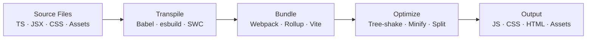
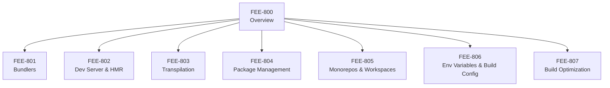

# Build Tooling & Module Systems Overview

:::info
This category covers the full pipeline that transforms human-readable source code — TypeScript, JSX, raw npm imports — into the optimized assets that browsers actually execute.
:::

## Context

Browsers speak a narrow dialect. They understand HTML, CSS, and JavaScript (ES2015+ in modern environments), and they load files over HTTP. They do not understand TypeScript, JSX syntax, bare module specifiers like `import React from 'react'`, or the package graph that lives inside `node_modules`. Every modern frontend project must bridge that gap before a single line of your application code reaches a user's screen.

Build tools exist to close this gap. A build tool takes your source tree — multiple languages, hundreds of modules, assets of every kind — and produces a small set of static files the browser can load directly. Along the way it performs transpilation (converting TypeScript or JSX to plain JS), bundling (resolving and inlining module dependencies), and optimization (tree-shaking dead code, minifying output, splitting chunks for parallel loading). The resulting artifact is leaner, faster to transfer, and compatible with target browser environments.

This category, FEE-800 through FEE-807, examines every layer of that pipeline: what bundlers do and how they differ (801), how dev servers accelerate the inner development loop with Hot Module Replacement (802), how transpilers like Babel and esbuild convert source to target JS (803), how package managers resolve and lock dependencies (804), how monorepos coordinate builds across multiple packages (805), how environment variables and build-time configuration are injected safely (806), and how to optimize the final bundle for production (807).

## Design Thinking

JavaScript was not designed for large applications. When Brendan Eich wrote the first version in ten days in 1995, scripts were short snippets embedded in web pages. There was no module system, no concept of a build step, and no expectation that a "frontend project" would comprise hundreds of thousands of lines of code. The language grew organically for nearly two decades before ES2015 introduced a native module syntax, and even then browsers needed years to fully implement it.

The toolchain complexity you see today is a historical accident. Each tool entered the ecosystem to solve a real, immediate problem. **Grunt** (2012) automated repetitive tasks — concatenating files, running linters, compiling Sass — by expressing them as a single large configuration object. It worked, but large Grunt files became maintenance burdens. **Gulp** (2013) improved the ergonomics by replacing configuration with code: tasks were composable Node.js streams, easier to understand and debug. Both were task runners rather than bundlers; they orchestrated external programs but did not deeply understand JavaScript module graphs.

**Webpack** (2014) changed the model. Instead of running tasks on files, Webpack traced the full module dependency graph of an application and bundled everything into one or more output files. It understood `require()` and, later, `import`. It could handle CSS, images, and fonts through loaders. By 2016–2018 it had become the default infrastructure for React, Angular, and Vue applications, baked into create-react-app, Angular CLI, and Vue CLI. Webpack solved bundling decisively, but its power came with a cost: complex configuration, slow cold-start times as projects grew, and HMR latency that scaled with bundle size. A 20-second dev server startup became a normal frustration on large codebases.

**Vite** (2020) broke the mold by exploiting what had changed in the decade since Webpack launched: browsers natively support ES modules. During development, Vite does not bundle your application at all. It pre-bundles third-party dependencies once with esbuild (written in Go, orders of magnitude faster than JS-based tools), then serves your own source files as native ES modules on demand. The browser requests a module; Vite transforms and returns that one file. Hot updates are surgical: only the changed module is re-transformed. The result is near-instant server start regardless of project size and HMR that stays fast as the codebase grows. For production Vite still uses Rollup to produce an optimized, tree-shaken bundle — because network waterfalls from thousands of small module requests remain a real concern in HTTP/1.1 deployments.

The trajectory points toward a future where the dev/prod gap shrinks further. HTTP/2 and HTTP/3 make fine-grained module loading more viable at scale. Import maps let browsers resolve bare specifiers without a bundler. Tools like Deno and Bun ship their own fast runtimes and bundlers. The open question is whether production bundling will remain necessary — the honest answer today is "yes, for most apps" — but the tooling landscape continues to evolve rapidly, and understanding the pipeline at each layer is what allows you to make informed choices as it does.

## Visual

### The Build Pipeline

### Category Map

## Related FEEs

- [FEE-307 — ES Modules Specification](/en/JavaScript%20Language%20and%20Runtime/307) — The language-level module system that Vite's dev server is built on
- [FEE-705 — Code Splitting](/en/Performance%20and%20Optimization/705) — Splitting the bundle into demand-loaded chunks
- [FEE-801 — Bundlers](/en/Build%20Tooling%20and%20Module%20Systems/801) — Webpack, Rollup, esbuild, and Vite's production mode in depth
- [FEE-802 — Dev Server & HMR](/en/Build%20Tooling%20and%20Module%20Systems/802) — How the development feedback loop works
- [FEE-803 — Transpilation](/en/Build%20Tooling%20and%20Module%20Systems/803) — Babel, SWC, esbuild: converting modern syntax to target environments
- [FEE-804 — Package Management](/en/Build%20Tooling%20and%20Module%20Systems/804) — npm, pnpm, Yarn: dependency resolution and lockfiles
- [FEE-805 — Monorepos & Workspaces](/en/Build%20Tooling%20and%20Module%20Systems/805) — Coordinating builds across multiple packages
- [FEE-806 — Env Variables & Build Config](/en/Build%20Tooling%20and%20Module%20Systems/806) — Injecting configuration at build time safely
- [FEE-807 — Build Optimization](/en/Build%20Tooling%20and%20Module%20Systems/807) — Tree-shaking, minification, chunk splitting, and asset hashing
