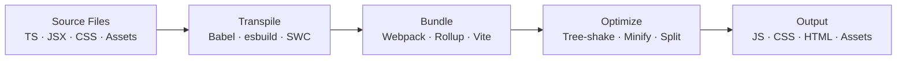
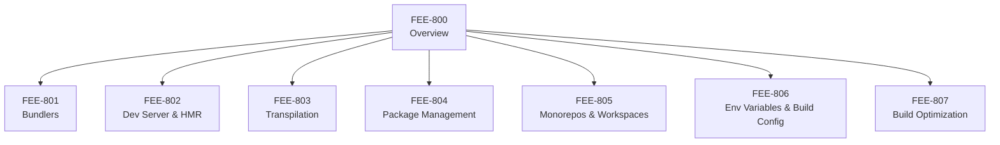

# Build Tooling & Module Systems Overview

:::info
This category covers the full pipeline that transforms human-readable source code —
TypeScript, JSX, raw npm imports — into the optimized assets that browsers actually execute.
:::

## Context

Browsers speak a narrow dialect.
They understand HTML, CSS, and JavaScript (ES2015+ in modern environments), and they load files over HTTP.
They do not understand TypeScript, JSX syntax, bare module specifiers like `import React from 'react'`,
or the package graph that lives inside `node_modules`.
Every modern frontend project must bridge that gap before a single line of your application code reaches a user's screen.

To be concrete about why this matters: if you send a TypeScript file directly to the browser,
it will throw a parse error — the browser's JavaScript engine does not know what a type annotation is.
If you write JSX and send it unprocessed, the angle-bracket syntax is illegal JavaScript
and execution halts immediately.
If you write `import React from 'react'`, the browser cannot resolve that bare specifier —
it expects a full URL or a relative path; it has no concept of `node_modules`
and no algorithm for walking into it.
These are not theoretical limitations but hard constraints baked into how browsers
implement the HTML and JavaScript specifications.

Build tools exist to close this gap.
A build tool takes your source tree — multiple languages, hundreds of modules, assets of every kind —
and produces a small set of static files the browser can load directly.
Along the way it performs three main transformations:
transpilation (converting TypeScript or JSX to plain JS),
bundling (resolving and inlining module dependencies),
and optimization (tree-shaking dead code, minifying output, splitting chunks for parallel loading).
The resulting artifact is leaner, faster to transfer, and compatible with target browser environments.

This category, FEE-800 through FEE-807, examines every layer of that pipeline:

- **FEE-801 — Bundlers:** What bundlers do at the algorithmic level — graph traversal, chunk splitting,
  tree-shaking — and how Webpack, Rollup, esbuild, and Vite's production mode each approach the problem
  with different trade-offs in speed and output quality.
- **FEE-802 — Dev Server & HMR:** How a development server accelerates the inner loop by serving modules
  on demand, and how Hot Module Replacement (HMR) surgically updates running state in the browser
  without a full page reload.
- **FEE-803 — Transpilation:** How Babel, SWC, and esbuild convert TypeScript, JSX, and modern syntax
  into JavaScript a target environment can execute, and what each tool trades away to achieve its speed.
- **FEE-804 — Package Management:** How npm, pnpm, and Yarn resolve the dependency graph,
  why lockfiles are non-negotiable for reproducible builds,
  and how pnpm's content-addressed store differs from npm's flat `node_modules`.
- **FEE-805 — Monorepos & Workspaces:** How Turborepo, Nx, and native workspace protocols
  let you coordinate builds, share code, and cache outputs across a repository containing many packages
  without rebuilding the world every time.
- **FEE-806 — Env Variables & Build Config:** How environment variables are injected at build time
  (versus runtime), why secrets must never be embedded in client bundles,
  and how tools like Vite and webpack DefinePlugin handle the distinction.
- **FEE-807 — Build Optimization:** The concrete techniques — tree-shaking, minification,
  chunk splitting, content hashing, image optimization — that determine whether a production bundle
  is 50 KB or 2 MB and whether returning users hit the cache.

## Design Thinking

JavaScript was not designed for large applications.
When Brendan Eich wrote the first version in ten days in 1995, scripts were short snippets embedded in web pages.
There was no module system, no concept of a build step,
and no expectation that a "frontend project" would comprise hundreds of thousands of lines of code.
The language grew organically for nearly two decades before ES2015 introduced a native module syntax,
and even then browsers needed years to fully implement it.

The toolchain complexity you see today is a historical accident.
Each tool entered the ecosystem to solve a real, immediate problem,
and understanding that sequence explains why the landscape looks the way it does.

**The Grunt/Gulp era (2012–2014)** solved the problem of repetitive manual work.
Before task runners, a developer building for production would manually concatenate JavaScript files,
run a minifier from the command line, compile Sass by hand, and copy assets into a `dist` folder.
Grunt automated those steps by expressing them as a large configuration object with named tasks.
Gulp improved ergonomics by replacing configuration with code —
tasks were Node.js streams that piped one transformation into the next, making complex pipelines readable.
Both tools were enormously useful, but they shared a fundamental limitation:
they operated on files and external processes, not on the JavaScript module graph itself.
They could concatenate files in a fixed order, but they could not understand
that `import foo from './foo'` meant file B depended on file A,
or automatically exclude unused exports.
They were powerful scripting layers, not semantic build systems.

**The Webpack era (2014–2019)** changed the model fundamentally.
Instead of running tasks on files, Webpack traced the full module dependency graph of an application
starting from an entry point and bundled everything into one or more output files.
It understood `require()` and, later, `import`.
Crucially, it could handle CSS, images, and fonts through loaders —
any file type could be treated as a module if you had a loader that knew how to transform it.
By 2016–2018 it had become the default infrastructure for React, Angular, and Vue applications,
baked into create-react-app, Angular CLI, and Vue CLI.
Webpack solved bundling decisively and introduced concepts — code splitting, lazy loading, the module graph —
that are still foundational today.
But its power came with real costs: configuration grew complex
(a full webpack config could span hundreds of lines),
cold-start times degraded as projects grew because it needed to bundle everything
before the dev server could start,
and HMR latency scaled with bundle size because updating one module often required rebuilding large chunks.
A 20-second dev server startup became a normal frustration on large codebases.

**The Vite era (2020–present)** broke the mold by exploiting what had changed
in the decade since Webpack launched: modern browsers natively support ES modules.
The key insight is that during development, you do not need a bundler at all
if you can just serve modules directly.
Vite pre-bundles third-party dependencies once with esbuild —
written in Go, benchmarks show it is 10–100x faster than equivalent JavaScript-based tools —
then serves your own source files as native ES modules on demand.
When the browser parses a module and encounters an import, it sends a request to Vite;
Vite transforms that one file and returns it.
The result is near-instant server start regardless of project size
(Vite's startup time is dominated by esbuild's dependency pre-bundle, not by your source tree),
and HMR that stays fast as the codebase grows because only the changed module needs re-transformation.
For production, Vite still delegates to Rollup, which produces a well-optimized, tree-shaken bundle —
because sending thousands of individual module requests over a real network, even with HTTP/2,
still has overhead that a bundled artifact avoids for most applications.

**The future** points toward a continued closing of the dev/prod gap.
HTTP/2 and HTTP/3 multiplexing make fine-grained module loading more viable at scale.
Import maps, now supported in all modern browsers, let browsers resolve bare specifiers
without a bundler step at all — you just point the import map at a CDN URL.
Tools like Deno and Bun ship their own TypeScript-native runtimes and built-in bundlers,
eliminating entire categories of tooling for projects that adopt them.
Whether production bundling will remain necessary is still an open question —
for most applications serving a global audience over commodity networks, the answer today is "yes" —
but the direction is clear: the build step will get smaller, faster, and in some cases optional.

## Visual

### The Build Pipeline

The following diagram shows how source files flow through a build pipeline.
Each stage is a distinct transformation: transpilation changes the language (TypeScript to JS),
bundling resolves the dependency graph,
optimization reduces size and improves cache behavior,
and the output is what actually gets deployed.

### Category Map

The following diagram shows how the seven sub-articles in this category relate to the overview.
Each node represents a focused deep-dive into one layer of the pipeline;
FEE-800 provides the orientation that makes the others navigable.

## Related FEEs

- [FEE-307 — ES Modules Specification](/en/JavaScript%20Language%20and%20Runtime/307) —
  The language-level module system that Vite's dev server is built on
- [FEE-705 — Code Splitting](/en/Performance%20and%20Optimization/705) —
  Splitting the bundle into demand-loaded chunks
- [FEE-801 — Bundlers](/en/Build%20Tooling%20and%20Module%20Systems/801) —
  Webpack, Rollup, esbuild, and Vite's production mode in depth
- [FEE-802 — Dev Server & HMR](/en/Build%20Tooling%20and%20Module%20Systems/802) —
  How the development feedback loop works
- [FEE-803 — Transpilation](/en/Build%20Tooling%20and%20Module%20Systems/803) —
  Babel, SWC, esbuild: converting modern syntax to target environments
- [FEE-804 — Package Management](/en/Build%20Tooling%20and%20Module%20Systems/804) —
  npm, pnpm, Yarn: dependency resolution and lockfiles
- [FEE-805 — Monorepos & Workspaces](/en/Build%20Tooling%20and%20Module%20Systems/805) —
  Coordinating builds across multiple packages
- [FEE-806 — Env Variables & Build Config](/en/Build%20Tooling%20and%20Module%20Systems/806) —
  Injecting configuration at build time safely
- [FEE-807 — Build Optimization](/en/Build%20Tooling%20and%20Module%20Systems/807) —
  Tree-shaking, minification, chunk splitting, and asset hashing
