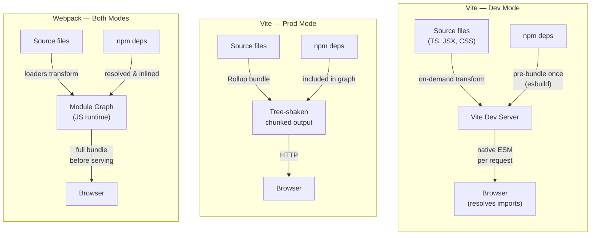

# Bundlers: Webpack, Vite, Rollup & esbuild

## Context

A bundler is a program that takes your source code — many files spread across many directories,
referencing each other through import statements and referencing npm packages by bare specifiers —
and produces a small, optimized set of files the browser can load efficiently.
The core algorithm is graph traversal: starting from an entry point, the bundler follows every
`import` and `require`, builds a complete module dependency graph, and then decides how to
group those modules into output files called chunks.
Along the way it tree-shakes (removes exports that are never imported anywhere in the graph),
code-splits (separates rarely-needed code into lazily-loaded chunks), and minifies the result
before writing it to disk.

Bundlers became essential because the browser and the Node.js module ecosystem evolved independently.
Browsers load files over HTTP and for years had no native module system at all.
The npm ecosystem built on CommonJS (`require`/`module.exports`), a synchronous in-process format
that browsers cannot execute directly.
When ES modules arrived in ES2015, they took years to land in all browsers and still cannot
resolve bare specifiers like `import React from 'react'` without a build step or import map.
Bundlers filled that gap: they translated bare specifiers into paths, compiled TypeScript and JSX,
inlined CSS or emitted separate stylesheets, and produced a single coherent artifact.

Today, four tools dominate the landscape, each with a different philosophy:
Webpack (the original, ecosystem-dominant bundler), Rollup (the clean-output library bundler),
esbuild (the Go-powered speed outlier), and Vite (the framework-first tool that composites the others).
A fifth tool, Rspack, is gaining ground as a Rust-rewritten Webpack-compatible drop-in.
Understanding what each tool optimizes for — and why — makes choosing between them straightforward.

## Design Thinking

**Why Webpack dominated.**
Webpack arrived in 2014 with a decisive insight: treat every asset as a module.
Not just JavaScript, but CSS, images, fonts, JSON — anything could enter the dependency graph
if you provided a loader for it.
This unified model solved a real problem: before Webpack, you needed separate pipelines for JS,
CSS, and assets, coordinated by Grunt or Gulp task runners that had no understanding of inter-file dependencies.
Webpack replaced that patchwork with a single, coherent graph.
It introduced code splitting and lazy loading, gave React and Vue ecosystems a standard build platform,
and accumulated the largest plugin and loader ecosystem in frontend tooling.
By 2016, `create-react-app`, Angular CLI, and Vue CLI all shipped Webpack under the hood.

The cost showed up at scale.
Webpack bundles everything before the dev server can serve anything.
On a large application, that cold start easily reached 30–60 seconds.
HMR worked by invalidating and re-evaluating entire module subtrees, so updating a component
deep in a large graph could take 2–5 seconds even when only one file changed.
Neither limitation was a design flaw; both were natural consequences of the all-upfront-bundling model.
But they created a persistent, daily developer experience tax on large teams.

**Why Vite disrupted the model.**
Vite's key insight, from Evan You's 2020 release, was that in a world where all target browsers
support ES modules natively, the dev server does not need to bundle anything.
The browser is the module resolver during development.
You give it a module, it parses the imports, and requests each dependency as a separate HTTP request.
Vite intercepts those requests, transforms the requested file (compile TypeScript, process JSX,
resolve CSS modules) on the fly, and returns the result — without ever bundling.
The dev server starts as soon as Vite is ready to intercept requests,
which means startup time is nearly constant regardless of how many source files your project has.

The one exception is npm dependencies.
Third-party packages often ship CommonJS, have hundreds of internal modules,
or do things like re-export from hundreds of sub-paths.
Serving them as thousands of individual ESM files would flood the browser with waterfall requests.
Vite pre-bundles npm deps once using esbuild — the Go-based bundler that runs 10–100x faster
than JavaScript-based alternatives — caches the result, and serves it as a single ESM file per package.
This pre-bundling step runs in milliseconds and is invalidated only when dependencies change.

For production, Vite switches to Rollup.
Native ESM over a real network, even with HTTP/2 multiplexing, has overhead:
hundreds of round trips add up, and browsers impose connection limits.
Rollup produces a compact, tree-shaken, well-chunked bundle suited for production delivery.
The dev/prod asymmetry is an intentional trade-off: the best tool for DX (native ESM, no bundling)
differs from the best tool for production delivery (optimized, concatenated bundle).

**Why Rollup is the library bundler.**
Rollup was the first bundler to make tree shaking a first-class feature, and it still produces
the cleanest output for library authors.
When you publish an npm package and a consumer's bundler processes it,
that bundler needs to tree-shake your package's exports.
Rollup's output is straightforward: the code you wrote, with dead exports removed and imports resolved,
wrapped in whatever module format you specify (ESM, CJS, UMD, IIFE).
Webpack's output, by contrast, wraps everything in Webpack's own module runtime —
a custom `__webpack_require__` system — which is correct and efficient for applications
but opaque for downstream bundlers trying to analyze your exports.
If you publish a Webpack bundle as an npm package, the consumer's bundler cannot tree-shake it
because the module boundary information is hidden inside Webpack's runtime.
Rollup output keeps that information intact, making it the standard choice for publishing to npm.

**Why esbuild changed expectations.**
esbuild is written in Go, not JavaScript.
Go programs compile to native machine code and run without a virtual machine startup overhead.
Go's goroutines make parallelism cheap — esbuild can parse, link, and minify multiple files
in parallel with very low coordination cost.
The result: in esbuild's benchmark, bundling 10 copies of the three.js library takes 0.39 seconds.
The same task takes Webpack 5 about 41 seconds — more than 100x slower.
This is not an edge case; the gap holds across a wide range of real-world project sizes.

The trade-off is intentional.
esbuild achieves its speed partly by doing less.
It does not perform TypeScript type-checking (it strips type annotations and moves on,
leaving type errors for `tsc` to report separately).
Its plugin API, while functional, is far smaller and less flexible than Webpack's.
It does not have loaders for every asset type that Webpack's ecosystem covers.
For these reasons, esbuild is rarely used standalone to build full applications.
Instead, it is embedded as a high-speed transform engine inside Vite (for dep pre-bundling and
TypeScript/JSX transforms) and other toolchains, where it handles the CPU-intensive work
while the host tool provides configuration and plugin ergonomics.

**The composability pattern.**
Modern build tooling increasingly works by composing specialized engines:
Vite = esbuild (transforms, dep pre-bundling) + Rollup (production bundle).
Rspack = Webpack-compatible JavaScript API + Rust core for the actual compilation.
This composability lets each layer optimize for its strengths.
Users get Rollup's plugin ecosystem, Vite's dev server ergonomics, and esbuild's speed
without choosing between them.
The same pattern explains why Rspack is compelling for teams on large Webpack projects:
it preserves the configuration API, loader/plugin ecosystem, and mental model you already have,
while replacing the slow JavaScript core with a Rust implementation that is significantly faster.
You get most of the Vite-era speed wins without rewriting your build config.

## Best Practices

**Choose Vite for new application projects unless a specific constraint requires otherwise.**
Webpack remains appropriate for projects that require Module Federation, depend on loaders with no Vite equivalent, or have a large existing Webpack configuration that would be costly to migrate. For every other new greenfield application, teams SHOULD default to Vite — its native-ESM dev server provides dramatically faster startup and HMR with no meaningful production trade-off.

**Use Rollup (or a Rollup-based tool such as `tsup`) when publishing packages to npm.**
MUST NOT publish a Webpack bundle to npm. Rollup's output preserves module boundary information in a form that downstream bundlers can statically analyze for tree shaking. Webpack's runtime wrapper (`__webpack_require__`) hides that information, preventing consumers from eliminating unused exports.

**Mark all peer dependencies as `external` in every Rollup library configuration.**
Bundling a peer dependency such as React inside a component library causes consumers to load two separate React instances, which breaks hooks and context. The `external` array in `rollup.config.js` MUST include every package listed under `peerDependencies` in `package.json`.

**Treat Vite dev mode and Vite production mode as distinct environments that require explicit compatibility testing.**
Vite uses native ESM in development and Rollup in production. Edge cases — dynamic imports with certain patterns, CJS interop behavior, or plugin transforms — can behave differently between the two modes. SHOULD run `vite build && vite preview` before shipping any feature, not only `vite dev`.

**Prefer packages with ESM output when tree shaking matters.**
Tree shaking requires static ESM `import`/`export` statements. A package that ships only a CommonJS `main` entry cannot be tree-shaken regardless of which bundler you use. SHOULD check the `package.json` `exports` field for an ESM-format entry before adding a dependency to a bundle-sensitive project.

## Visual

### Bundler Architecture Comparison

The diagram below contrasts how the three main development and production strategies differ.
Vite dev mode sends no bundle to the browser at all; Vite production mode delegates to Rollup;
Webpack bundles everything in both modes.



## Example

### 1. Vite config with a plugin

```ts
// vite.config.ts
import { defineConfig } from 'vite'
import react from '@vitejs/plugin-react'

export default defineConfig({
  plugins: [react()],
  build: {
    // Rollup options are passed here for production builds
    rollupOptions: {
      output: {
        manualChunks: {
          vendor: ['react', 'react-dom'],
        },
      },
    },
  },
})
```

Vite's plugin API is a superset of Rollup's plugin API.
A plugin that works in Vite's production Rollup build usually also works in dev mode,
with Vite-specific hooks (`configureServer`, `handleHotUpdate`) available for dev-only behavior.

### 2. Webpack config with loaders and plugins

```js
// webpack.config.js
import path from 'path'
import HtmlWebpackPlugin from 'html-webpack-plugin'
import MiniCssExtractPlugin from 'mini-css-extract-plugin'

export default {
  entry: './src/index.tsx',
  output: {
    path: path.resolve(import.meta.dirname, 'dist'),
    filename: '[name].[contenthash].js',
    clean: true,
  },
  module: {
    rules: [
      // Loaders transform non-JS files into modules
      { test: /\.tsx?$/, use: 'ts-loader', exclude: /node_modules/ },
      { test: /\.css$/, use: [MiniCssExtractPlugin.loader, 'css-loader'] },
      { test: /\.(png|svg|jpg)$/, type: 'asset/resource' },
    ],
  },
  plugins: [
    // Plugins extend the pipeline beyond per-file transforms
    new HtmlWebpackPlugin({ template: './public/index.html' }),
    new MiniCssExtractPlugin({ filename: '[name].[contenthash].css' }),
  ],
  resolve: { extensions: ['.tsx', '.ts', '.js'] },
}
```

**Module Federation.**
Module Federation, introduced in Webpack 5, lets separately deployed applications share code at runtime.
A host shell application can load a remote team's independently deployed component bundle via a URL,
with no shared build step between the two teams.
This is distinct from code splitting, which divides a single application's bundle into lazily-loaded chunks —
Module Federation operates across application boundaries and separate deployment units entirely.
It is the Webpack-native approach to micro-frontends: each team ships their own remote entry file,
and consumers reference it through a URL that is resolved at runtime.
The tradeoff is runtime coupling: if a remote changes its exposed API without coordination,
consumers that depend on it will break at load time rather than at build time.

### 3. Rollup config for a library (ESM + CJS dual output)

```js
// rollup.config.js
import { defineConfig } from 'rollup'
import typescript from '@rollup/plugin-typescript'
import resolve from '@rollup/plugin-node-resolve'

export default defineConfig({
  input: 'src/index.ts',
  external: ['react', 'react-dom'], // peer deps — do not bundle them
  plugins: [resolve(), typescript()],
  output: [
    {
      file: 'dist/index.esm.js',
      format: 'esm',
      sourcemap: true,
    },
    {
      file: 'dist/index.cjs.js',
      format: 'cjs',
      sourcemap: true,
    },
  ],
})
```

Marking peer dependencies as `external` keeps them out of your bundle.
Consumers provide them from their own node_modules, which avoids duplicate React instances
and lets the consuming bundler tree-shake your library against their React version.

### 4. esbuild CLI — fast one-off bundle

```bash
# Bundle an entrypoint, minify, target ES2020, output to dist/
esbuild src/index.ts \
  --bundle \
  --minify \
  --target=es2020 \
  --outfile=dist/bundle.js \
  --platform=browser

# Build time on a mid-size project: ~50ms vs Webpack's ~8s
```

esbuild is most useful in scripts, CI pre-checks, or inside other tools.
Running it standalone for an application means giving up loaders for non-standard asset types,
a smaller plugin ecosystem, and no HMR dev server out of the box.

## Common Mistakes

- **Using esbuild directly for application builds and expecting Webpack-level plugin support.**
  esbuild's plugin API is intentionally minimal. If you need CSS modules, image optimization,
  or framework-specific transforms, embed esbuild inside Vite rather than replacing Vite with it.

- **Expecting consistent behavior between Vite dev and prod.**
  Because Vite uses native ESM in dev and Rollup in prod, edge cases can appear only in production.
  Always test production builds (`vite build && vite preview`) before shipping;
  do not rely solely on the dev server.

- **Treating Rspack as a drop-in that requires zero config changes.**
  Rspack is highly compatible with Webpack's API but not 100% identical.
  Run your test suite and check for loader/plugin version compatibility before switching.

- **Assuming tree shaking works automatically with CommonJS modules.**
  Tree shaking requires static ESM imports. If a dependency ships only CJS,
  bundlers cannot statically analyze its exports and will include the whole module.
  Prefer packages that ship an `"exports"` field with ESM output.

## Related FEEs

- [FEE-800 — Build Tooling Overview](/en/Build%20Tooling%20and%20Module%20Systems/800) —
  Historical context and the full category map
- [FEE-307 — ES Modules](/en/JavaScript%20Core%20and%20Runtime/307) —
  The language-level module system that Vite's dev mode is built on
- [FEE-705 — Code Splitting](/en/Rendering%20and%20Performance/705) —
  How bundlers split the graph into lazily-loaded chunks
- [FEE-802 — Dev Server & HMR](/en/Build%20Tooling%20and%20Module%20Systems/802) —
  How Vite's dev server and Hot Module Replacement work in depth
- [FEE-807 — Build Optimization](/en/Build%20Tooling%20and%20Module%20Systems/807) —
  Tree-shaking, minification, chunk splitting, and content hashing

## References

- Vite — Why Vite: <https://vite.dev/guide/why.html>
- esbuild — Getting Started & Benchmarks: <https://esbuild.github.io/>
- Rollup — Introduction: <https://rollupjs.org/introduction/>
- Webpack — Core Concepts: <https://webpack.js.org/concepts/>
- Webpack — Module Federation: <https://webpack.js.org/concepts/module-federation/>
- Rspack — Introduction: <https://rspack.dev/guide/introduction>
