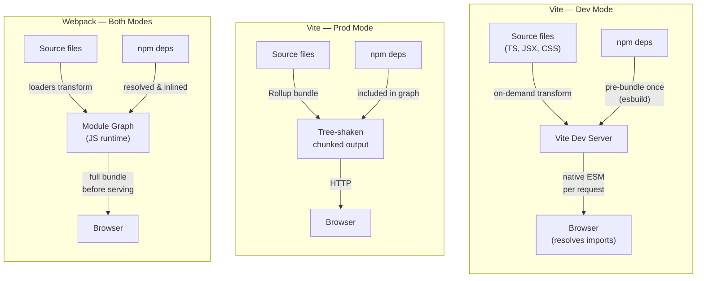

# Bundlers: Webpack, Vite, Rollup & esbuild

## Context

A bundler is a program that takes your source code (many files spread across many directories,
referencing each other through import statements and referencing npm packages by bare specifiers)
and produces a small, optimized set of files the browser can load efficiently.
The core algorithm is graph traversal: starting from an entry point, the bundler follows every
`import` and `require`, builds a complete module dependency graph, and then decides how to
group those modules into output files called chunks.
Along the way it tree-shakes (removes exports that are never imported anywhere in the graph),
code-splits (separates rarely-needed code into lazily-loaded chunks), and minifies the result
before writing it to disk.

Bundlers became essential because the browser and the Node.js module ecosystem evolved independently.
Browsers load files over HTTP and for years had no native module system at all.
The npm ecosystem built on CommonJS (`require`/`module.exports`), a synchronous in-process format
that browsers cannot execute directly.
When ES modules arrived in ES2015, they took years to land in all browsers and still cannot
resolve bare specifiers like `import React from 'react'` without a build step or import map.
Bundlers filled that gap: they translated bare specifiers into paths, compiled TypeScript and JSX,
inlined CSS or emitted separate stylesheets, and produced a single coherent artifact.

Several tools compete for that job today, and adoption is partial and parallel rather than one tool
succeeding the last everywhere. Webpack, first released in 2012, still holds the largest deployed
base: most production applications running today were built on it, and its plugin and loader
ecosystem remains the widest of any bundler. Rollup produces the cleanest output and is the
standard choice for publishing libraries to npm. esbuild, written in Go, is used less often as a
standalone application bundler and more often as an embedded transform engine inside other tools.
Vite composes those pieces into a framework-first dev server; as of Vite 8, its default bundler is
Rolldown, a Rust engine that unifies the dev and production paths Vite previously split between
esbuild and Rollup. Rspack is a Rust rewrite of Webpack's engine that targets drop-in compatibility
with Webpack's configuration API. Turbopack, built from scratch in Rust, is the default bundler for
both dev and build in Next.js 16. Bun ships its own native bundler (`bun build`) as part of its
runtime. The Design Thinking section below maps each tool to the specific trade-off it was built to
solve, and the When to Choose Which table translates that into a decision per project.

## Visual

### Bundler Architecture Comparison

The diagram below contrasts how the three main development and production strategies differ.
Vite dev mode sends no bundle to the browser at all; Vite production mode, in the esbuild-plus-Rollup
architecture used through Vite 7, delegates to Rollup; Webpack bundles everything in both modes.
Vite 8's Rolldown engine unifies the two Vite paths shown here into a single bundler; see Design
Thinking below for what that changes.



## Example

### 1. Vite config with a plugin

```ts
// vite.config.ts
import { defineConfig } from 'vite'
import react from '@vitejs/plugin-react'

export default defineConfig({
  plugins: [react()],
  build: {
    // Rollup options are passed here for production builds
    rollupOptions: {
      output: {
        manualChunks: {
          vendor: ['react', 'react-dom'],
        },
      },
    },
  },
})
```

Vite's plugin API is a superset of Rollup's plugin API.
A plugin that works in Vite's production build (Rollup through Vite 7, Rolldown from Vite 8) usually
also works in dev mode, with Vite-specific hooks (`configureServer`, `handleHotUpdate`) available for
dev-only behavior.

### 2. Webpack config with loaders and plugins

```js
// webpack.config.js
import path from 'path'
import HtmlWebpackPlugin from 'html-webpack-plugin'
import MiniCssExtractPlugin from 'mini-css-extract-plugin'

export default {
  entry: './src/index.tsx',
  output: {
    path: path.resolve(import.meta.dirname, 'dist'),
    filename: '[name].[contenthash].js',
    clean: true,
  },
  module: {
    rules: [
      // Loaders transform non-JS files into modules
      { test: /\.tsx?$/, use: 'ts-loader', exclude: /node_modules/ },
      { test: /\.css$/, use: [MiniCssExtractPlugin.loader, 'css-loader'] },
      { test: /\.(png|svg|jpg)$/, type: 'asset/resource' },
    ],
  },
  plugins: [
    // Plugins extend the pipeline beyond per-file transforms
    new HtmlWebpackPlugin({ template: './public/index.html' }),
    new MiniCssExtractPlugin({ filename: '[name].[contenthash].css' }),
  ],
  resolve: { extensions: ['.tsx', '.ts', '.js'] },
}
```

**Module Federation.**
Module Federation, introduced in Webpack 5, lets separately deployed applications share code at runtime.
A host shell application can load a remote team's independently deployed component bundle via a URL,
with no shared build step between the two teams.
This is distinct from code splitting, which divides a single application's bundle into lazily-loaded
chunks. Module Federation operates across application boundaries and separate deployment units entirely.
It is the Webpack-native approach to micro-frontends: each team ships their own remote entry file,
and consumers reference it through a URL that is resolved at runtime.
The tradeoff is runtime coupling: if a remote changes its exposed API without coordination,
consumers that depend on it will break at load time rather than at build time.

### 3. Rollup config for a library (ESM + CJS dual output)

```js
// rollup.config.js
import { defineConfig } from 'rollup'
import typescript from '@rollup/plugin-typescript'
import resolve from '@rollup/plugin-node-resolve'

export default defineConfig({
  input: 'src/index.ts',
  external: ['react', 'react-dom'], // peer deps — do not bundle them
  plugins: [resolve(), typescript()],
  output: [
    {
      file: 'dist/index.esm.js',
      format: 'esm',
      sourcemap: true,
    },
    {
      file: 'dist/index.cjs.js',
      format: 'cjs',
      sourcemap: true,
    },
  ],
})
```

Marking peer dependencies as `external` keeps them out of your bundle.
Consumers provide them from their own node_modules, which avoids duplicate React instances
and lets the consuming bundler tree-shake your library against their React version.

### 4. esbuild CLI — fast one-off bundle

```bash
# Bundle an entrypoint, minify, target ES2020, output to dist/
esbuild src/index.ts \
  --bundle \
  --minify \
  --target=es2020 \
  --outfile=dist/bundle.js \
  --platform=browser

# Illustrative only: a build like this commonly finishes in tens of milliseconds,
# versus single-digit seconds for a comparable Webpack build. Exact numbers vary by project.
```

esbuild is most useful in scripts, CI pre-checks, or inside other tools.
Running it standalone for an application means giving up loaders for non-standard asset types,
a smaller plugin ecosystem, and no HMR dev server out of the box.

## Best Practices

**Choose Vite for new application projects unless a specific constraint requires otherwise.**
Webpack remains appropriate for projects that require Module Federation, depend on loaders with no Vite equivalent, or have a large existing Webpack configuration that would be costly to migrate. Next.js applications are a separate exception: Next.js 16 defaults to Turbopack, not Vite, and teams SHOULD stay on that default rather than overriding it. For every other new greenfield application, teams SHOULD default to Vite, whose native-ESM dev server (dependency pre-bundling by esbuild through Vite 7, by Rolldown from Vite 8) provides dramatically faster startup and HMR with no meaningful production trade-off.

**Use Rollup (or a Rollup-based tool such as `tsup`) when publishing packages to npm.**
MUST NOT publish a Webpack bundle to npm. Rollup's output preserves module boundary information in a form that downstream bundlers can statically analyze for tree shaking. Webpack's runtime wrapper (`__webpack_require__`) hides that information, preventing consumers from eliminating unused exports.

**Mark all peer dependencies as `external` in every Rollup library configuration.**
Bundling a peer dependency such as React inside a component library causes consumers to load two separate React instances, which breaks hooks and context. The `external` array in `rollup.config.js` MUST include every package listed under `peerDependencies` in `package.json`.

**Treat Vite dev mode and Vite production mode as distinct environments that require explicit compatibility testing, especially on Vite 7 and earlier.**
Through Vite 7, Vite used native ESM in development and Rollup in production; edge cases (dynamic imports with certain patterns, CJS interop behavior, or plugin transforms) could behave differently between the two modes. Vite 8's Rolldown engine narrows this gap by running dev and production through the same bundler, but teams SHOULD still run `vite build && vite preview` before shipping any feature, not only `vite dev`, until a project's plugins have been verified against Rolldown.

**Prefer packages with ESM output when tree shaking matters.**
Tree shaking requires static ESM `import`/`export` statements. A package that ships only a CommonJS `main` entry cannot be tree-shaken regardless of which bundler you use. SHOULD check the `package.json` `exports` field for an ESM-format entry before adding a dependency to a bundle-sensitive project.

**Do not expect Webpack-level plugin coverage from esbuild used directly for application builds.**
esbuild's plugin API is intentionally minimal. If a project needs CSS modules, image optimization, or framework-specific transforms, embed esbuild inside Vite rather than replacing Vite with a standalone esbuild build.

**Verify Rspack compatibility before treating it as a zero-config swap for Webpack.**
Rspack is highly compatible with Webpack's API but not 100% identical. SHOULD run the project's test suite and check loader/plugin version compatibility before switching.

## Design Thinking

**Why Webpack dominated.**
Webpack, first released in 2012 with 1.0 landing in 2014, arrived with a decisive insight: treat every
asset as a module. Not just JavaScript: CSS, images, fonts, and JSON could all enter the dependency
graph as long as a loader existed for them. This unified model solved a real problem. Before Webpack,
teams needed separate pipelines for JS, CSS, and assets, coordinated by Grunt or Gulp task runners
that had no understanding of inter-file dependencies. Webpack replaced that patchwork with a single,
coherent graph. It introduced code splitting and lazy loading, gave React and Vue ecosystems a
standard build platform, and accumulated the largest plugin and loader ecosystem in frontend tooling.
By 2016, `create-react-app`, Angular CLI, and Vue CLI all shipped Webpack under the hood. All three
have since moved off it as their default: Create React App was officially deprecated in February 2025,
Angular's default builder is now esbuild/Vite-based, and Vue CLI is in maintenance mode, superseded
by `create-vue` on Vite.

The cost showed up at scale. Webpack bundles everything before the dev server can serve anything, so
cold start time grows with project size; on a large application, cold starts can run into the tens of
seconds. HMR worked by invalidating and re-evaluating entire module subtrees, so updating a component
deep in a large graph could take several seconds even when only one file changed, since everything
between the change and the entry point had to be re-bundled. Neither limitation was a design flaw;
both were natural consequences of the all-upfront-bundling model. Repeated many times a day across a
team, though, tens-of-seconds cold starts and multi-second HMR delays add up to real lost engineering
time.

**Why Vite disrupted the model.**
Adoption was additive rather than a wholesale replacement: most existing Webpack applications are
still on Webpack today. What changed, following Vite's 2020 release from creator Evan You, was the
default for new projects, plus competitive pressure on every bundler that followed to answer for its
dev-server startup time. Vite's key insight was that in a world where all target browsers support ES
modules natively, the dev server does not need to bundle anything. The browser is the module resolver
during development. You give it a module, it parses the imports, and requests each dependency as a
separate HTTP request. Vite intercepts those requests, transforms the requested file (compiles
TypeScript, processes JSX, resolves CSS modules) on the fly, and returns the result without bundling
anything. The dev server starts as soon as Vite is ready to intercept requests, so startup time is
nearly constant regardless of how many source files a project has.

The one exception is npm dependencies. Third-party packages often ship CommonJS, have hundreds of
internal modules, or re-export from hundreds of sub-paths. Serving them as thousands of individual
ESM files would flood the browser with waterfall requests. From Vite 2 through Vite 7, Vite
pre-bundled npm dependencies once using esbuild, a Go-based bundler considerably faster than
JavaScript-based alternatives, cached the result, and served it as a single ESM file per package;
the step ran in milliseconds and was invalidated only when dependencies changed. For production,
that era of Vite switched to Rollup: native ESM over a real network, even with HTTP/2 multiplexing,
has overhead (hundreds of round trips add up, and browsers impose connection limits), so Rollup
produced a compact, tree-shaken, chunked bundle suited for production delivery. That dev/prod split
was an intentional trade-off between the best tool for developer experience and the best tool for
delivery, but it also meant dev and production ran on two different bundlers with two different sets
of edge cases.

Vite 8, which reached stable in March 2026 after a December 2025 beta, closes that gap. Its default
bundler is Rolldown, a Rust bundler built by the Vite and VoidZero team specifically to unify the dev
and production paths: dependency pre-bundling, transforms, and the production bundle all run through
the same engine, with no opt-in required. VoidZero reports Rolldown running 10 to 30 times faster
than Rollup and roughly on par with esbuild; early adopters such as Linear reported cutting build
times from 46 seconds to 6. The esbuild-plus-Rollup split described above still applies to projects
on Vite 7 and earlier, and Rolldown's plugin interface was kept deliberately Rollup-compatible so
most existing plugins continue to work, but new Vite projects no longer carry the dev/prod asymmetry
this section describes.

**Why Rollup is the library bundler.**
Rollup was the first bundler to make tree shaking a first-class feature, and it still produces the
cleanest output for library authors. When a consumer's bundler processes a published npm package,
that bundler needs to tree-shake the package's exports. Rollup's output is straightforward: the code
as written, with dead exports removed and imports resolved, wrapped in whatever module format is
specified (ESM, CJS, UMD, IIFE). Webpack's output, by contrast, wraps everything in Webpack's own
module runtime (a custom `__webpack_require__` system), which is correct and efficient for
applications but opaque for downstream bundlers trying to analyze exports. A Webpack bundle published
as an npm package cannot be tree-shaken by the consumer's bundler, because the module boundary
information is hidden inside Webpack's runtime. Rollup output keeps that information intact, making
it the standard choice for publishing to npm.

**Why esbuild changed expectations.**
esbuild is written in Go, not JavaScript. Go programs compile to native machine code and run without
a virtual machine startup overhead. Go's goroutines make parallelism cheap: esbuild can parse, link,
and minify multiple files in parallel with very low coordination cost. The result, per esbuild's own
benchmark: bundling 10 copies of the three.js library takes 0.39 seconds. The same task takes
Webpack 5 about 41 seconds, more than 100 times slower. This is not an edge case; the gap holds
across a wide range of real-world project sizes.

The trade-off is intentional. esbuild achieves its speed partly by doing less. It does not perform
TypeScript type checking (it strips type annotations and moves on, leaving type errors for `tsc` to
report separately). Its plugin API, while functional, is far smaller and less flexible than Webpack's.
It does not have loaders for every asset type that Webpack's ecosystem covers. For these reasons,
esbuild is rarely used standalone to build full applications. Instead, it gets embedded as a
high-speed transform and bundling engine inside other toolchains, handling the CPU-intensive work
while the host tool provides configuration and plugin ergonomics. Vite used it this way from version
2 through version 7, for both dependency pre-bundling and TypeScript/JSX transforms. Vite 8 folded
esbuild's bundling and dependency pre-bundling into Rolldown and moved its TypeScript/JSX transform
role to Oxc, a sibling Rust toolchain from the same team that built Rolldown, but the underlying
reason for embedding rather than replacing outright is unchanged: esbuild, and now Oxc, optimizes
for raw transform speed rather than plugin surface area.

**The composability pattern.**
Modern build tooling increasingly pairs a familiar configuration surface with a faster underlying
engine, though the exact pairing varies by tool. Rspack keeps a Webpack-compatible JavaScript API on
top of a Rust core, so teams retain their existing config, loaders, and mental model while the slow
JavaScript core gets replaced. Vite 8 took a related but different path: instead of composing two
separate engines the way esbuild and Rollup did through Vite 7, it replaced both with the single
Rolldown engine, keeping the plugin ecosystem and dev-server ergonomics while unifying the internals
around one Rust bundler. Turbopack goes further in a different direction: rather than wrapping or
replacing an existing bundler, it was built from scratch in Rust specifically for Next.js's routing
and caching model, trading general-purpose portability for deep framework integration. That is also
why it is not a drop-in choice for non-Next.js projects. Bun's bundler follows a similar from-scratch
approach at the runtime layer, shipping as part of the Bun binary rather than composing with a
separate JavaScript toolchain.

For teams already invested in Webpack, Rspack remains the most direct option: it preserves the
configuration API, loader and plugin ecosystem, and mental model already in place, while replacing
the slow JavaScript core with a significantly faster Rust implementation. That gets most of the
Rust-era speed wins without rewriting the build config.

## When to Choose Which

Every project sits somewhere on the trade-off this article has been describing: dev-server speed,
output cleanliness for downstream consumers, plugin and loader breadth, and how much existing
configuration a team is willing to rewrite. The table below is a starting point, not a substitute
for testing against an actual codebase.

| Tool | Best for | Avoid when | Dev speed | Output cleanliness |
| --- | --- | --- | --- | --- |
| Webpack | Large existing codebases; Module Federation; loaders with no equivalent elsewhere | Starting a new project with no legacy constraint | Slowest: bundles everything before serving | Wraps output in `__webpack_require__`; not suited for publishing to npm |
| Vite (Rolldown) | New application projects | A Next.js app (use Turbopack) or Module Federation (most mature in Webpack/Rspack; Vite only via the @module-federation/vite plugin) | Fast: near-instant dev start; unified dev/prod engine as of Vite 8 | Good: Rolldown produces tree-shaken, chunked output |
| Rollup | Publishing libraries to npm | Building applications with many asset pipelines (images, CSS, etc.) | Moderate | Best: preserves module boundaries for downstream tree shaking |
| esbuild | Embedded transform/bundle engine, scripts, CI pre-checks | A full application build needing a large plugin ecosystem | Fastest as a standalone tool | Good, but a minimal plugin surface limits complex output shaping |
| Rspack | Large Webpack codebases that want Rust-level speed without a config rewrite | Projects with no existing Webpack investment (start with Vite) | Fast: Rust core under a Webpack-compatible API | Same model as Webpack's (wrapped runtime) |
| Turbopack | Next.js apps, dev and build | Any non-Next.js project (not a general-purpose bundler) | Fast: Next.js reports 2-5x faster production builds, up to 10x faster Fast Refresh | Framework-optimized; not designed for standalone library output |
| Bun's bundler (`bun build`) | Bun-based projects wanting one native toolchain | Projects that depend on the Webpack or Vite plugin ecosystem | Fast | Adequate for straightforward single-format bundles |

If a project is a Next.js application, Next.js 16 already defaults to Turbopack, and there is little
reason to override that default. If it is anything else that is not already tied to a specific
framework's bundler, Vite (via Rolldown) is the default starting point as of 2026, with Webpack or
Rspack reserved for the constraints listed in the table above.

## Related Topics

- [FEE-800 — Build Tooling Overview](/en/Build%20Tooling%20and%20Module%20Systems/800) —
  Historical context and the full category map
- [FEE-307 — ES Modules](/en/JavaScript%20Core%20and%20Runtime/307) —
  The language-level module system that Vite's dev mode is built on
- [FEE-705 — Code Splitting](/en/Rendering%20and%20Performance/705) —
  How bundlers split the graph into lazily-loaded chunks
- [FEE-802 — Dev Server & HMR](/en/Build%20Tooling%20and%20Module%20Systems/802) —
  How Vite's dev server and Hot Module Replacement work in depth
- [FEE-807 — Build Optimization](/en/Build%20Tooling%20and%20Module%20Systems/807) —
  Tree-shaking, minification, chunk splitting, and content hashing

## References

- Vite Team, "Why Vite," Vite Documentation. https://vite.dev/guide/why.html
- Vite Team, "Vite 8 Beta: The Rolldown-Powered Vite," Vite Blog (2025). https://vite.dev/blog/announcing-vite8-beta
- Vite Team, "Vite 8.0 Is Out!," Vite Blog (2026). https://vite.dev/blog/announcing-vite8
- VoidZero, "Announcing Rolldown 1.0," VoidZero Blog (2026). https://voidzero.dev/posts/announcing-rolldown-1-0
- esbuild, "Why Is esbuild Fast?," esbuild FAQ. https://esbuild.github.io/faq/
- esbuild, "Getting Started & Benchmarks," esbuild Documentation. https://esbuild.github.io/
- Rollup Team, "Introduction," Rollup Documentation. https://rollupjs.org/introduction/
- Webpack Team, "Concepts," Webpack Documentation. https://webpack.js.org/concepts/
- Webpack Team, "Module Federation," Webpack Documentation. https://webpack.js.org/concepts/module-federation/
- Rspack Team, "Introduction," Rspack Documentation. https://rspack.dev/guide/introduction
- Next.js Team, "Next.js 16," Next.js Blog (2025). https://nextjs.org/blog/next-16
