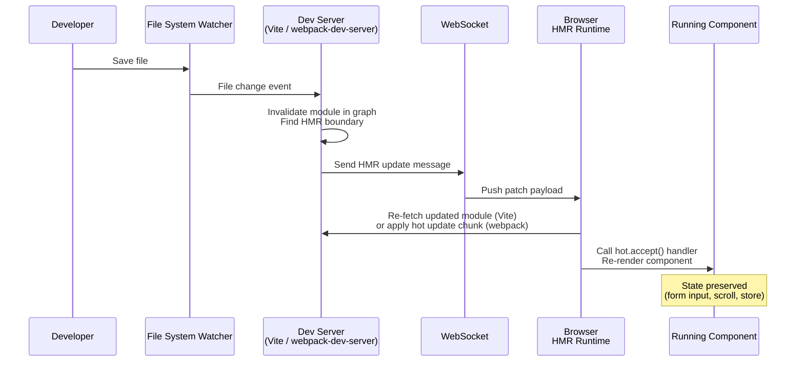

# Dev Server, HMR & Development Experience

## Context

The gap between writing code and seeing its effect in the browser is called the feedback loop.
For most of the 2010s, that loop involved saving a file, waiting for a full rebuild, and then
manually refreshing the browser — a sequence that could take 10–60 seconds on large applications.
Each interruption broke concentration. Research on developer productivity consistently finds
that a context switch — triggered by a slow build, a failed test, or a tool timeout — costs
roughly 20 minutes to fully recover from. A 30-second rebuild does not just cost 30 seconds;
it trains engineers to start multitasking while they wait, fragmenting attention across the day.

Modern dev servers compress that feedback loop to milliseconds.
They serve your source files without a full bundle step, resolve module specifiers so bare imports
like `import React from 'react'` work in the browser, proxy API requests to avoid CORS issues,
inject Hot Module Replacement (HMR) runtimes to push updates without a page reload,
and rewrite imports where the browser would otherwise fail.
The result is an environment where saving a file and seeing the update in the browser takes
under 100ms on well-configured projects.

Source maps and HTTPS in development are often treated as optional polish, but both are
correctness concerns as much as convenience features.
Without source maps, a bug in your TypeScript or JSX-compiled code surfaces as an opaque
line number in transpiled output.
Without HTTPS, certain browser APIs — geolocation, service workers, the Web Crypto API —
are silently unavailable or behave differently than production.
A development environment that does not match the constraints of production is a source of
latent bugs that only appear after deployment.

## Best Practices

**SHOULD use source maps in development; `eval-cheap-module-source-map` is the recommended type for most projects.**
This setting provides accurate line numbers that point to your original TypeScript or JSX source, with fast rebuild speed on every HMR update. The performance gap between `eval` and `eval-cheap-module-source-map` is small; the debugging gap is large. MUST NOT disable source maps in development to "speed up the build" — the rebuild cost is negligible compared to the debugging time lost.

**MUST NOT expose full source maps in production by leaving the `//# sourceMappingURL` reference in the bundle.**
Use `hidden-source-map` in Webpack (`devtool: 'hidden-source-map'`) or `sourcemap: 'hidden'` in Vite's build config. Upload the resulting `.map` files to an error tracker such as Sentry so your team gets symbolicated stack traces — without end users being able to read your original source through DevTools.

**SHOULD enable HTTPS in development when the project uses any secure-context browser API.**
Geolocation, Service Workers, Web Crypto, camera/microphone access via `getUserMedia`, and the Payment Request API all require a secure context. Use `mkcert` to generate a locally-trusted certificate. Running HTTPS in development removes the class of bugs where code works in production but silently fails in development due to a missing secure context.

**SHOULD proxy API requests through the dev server rather than configuring CORS on the backend just for development.**
Both Vite (`server.proxy`) and webpack-dev-server (`devServer.proxy`) can forward `/api/*` requests to a backend running on a different port. This avoids modifying backend CORS headers for a development-only constraint and matches production routing behavior more closely.

**SHOULD add explicit `import.meta.hot.accept()` handlers to shared utility modules that are imported by many components.**
Framework plugins handle HMR boundaries for component files automatically. Shared modules — API clients, feature flag stores, configuration objects — have no framework-managed boundary. Without an explicit handler, a change to any of these modules bubbles up the dependency chain and falls back to a full page reload, losing all in-memory application state.

## Design Thinking

**Why dev server speed compounds.**
A fast feedback loop is not just a comfort feature — it changes what is possible to build.
When a change takes 500ms to appear, engineers experiment freely: they tweak layout, try
a different API shape, verify edge case behavior in the running app.
When a change takes 30 seconds, engineers batch their changes, context-switch while waiting,
and lose confidence that what they see reflects what they just wrote.
Every 1 second shaved from the feedback loop compounds across thousands of saves per sprint.
Teams with fast tooling ship more experiments, catch bugs closer to where they were introduced,
and report higher satisfaction with their development setup.

**Why Vite HMR is faster than Webpack HMR.**
Both tools implement HMR — the mechanism for pushing a file change to the browser without
a full reload — but they reach that mechanism through different architectures.

In Webpack, all source files are pre-bundled into one or more chunk files before the dev server
starts serving anything.
When a file changes, Webpack must: re-run any loaders for that file (Babel, CSS processors,
TypeScript compiler), re-evaluate which modules in the graph are affected, regenerate a
"hot update chunk" — a patch file containing the updated module code — and push it via WebSocket.
The loader pipeline runs on every HMR update, and on a large graph with many dependents,
the chain of invalidations can cascade.
On large React or Vue applications, Webpack HMR updates commonly take 2–5 seconds.

In Vite, files are never pre-bundled; the browser fetches each source file as an individual
ESM module via HTTP.
When a file changes, Vite's file watcher identifies the changed module in the server-side
module graph, determines the HMR boundary (the nearest module that has registered an
`import.meta.hot.accept()` handler), and sends a minimal WebSocket message telling the
browser to re-fetch that one file.
No loader pipeline reruns on the changed file; Vite transforms files on request, and the
browser already has everything else cached.
HMR update time is decoupled from total application size: updating a single component on
a 500-module app is the same speed as on a 50-module app.
Vite's documentation notes that HMR updates with the Oxc transformer can reflect in the
browser in under 50ms.

**Why source maps matter for debugging.**
When you write TypeScript or JSX, the code the browser actually executes is different from
the code you wrote.
Column numbers are collapsed, variable names are mangled, and multiple files are concatenated.
When an exception fires, the stack trace points to line 1, column 8432 of `main.bundle.js`.
Source maps are files (or inline data URLs) that map from that generated position back to
the original file, line, and column in your source.
DevTools use them transparently: you see your TypeScript, not the compiled output.
Breakpoints, watch expressions, and call stacks all reference your original code.

The choice of source map type is a deliberate trade-off between build speed and map fidelity.
`eval` is the fastest (each module wrapped in `eval()` with a `//# sourceURL` annotation)
but line numbers map to transpiled output, not original source.
`eval-cheap-module-source-map` adds loader-level source maps with line-only precision —
a good balance for development: rebuild speed is fast, and line numbers are accurate.
`eval-source-map` provides full original-source fidelity with column mappings, at the cost
of slower initial build.

**Why full source maps in production are a security concern.**
A full `source-map` in production generates a `.map` file and links it in the bundle via
a `//# sourceMappingURL=` comment.
Any user who opens browser DevTools will see your original source code: TypeScript,
JSX, business logic, internal API structures, environment variable names used in code.
For closed-source commercial applications, this is an unintended disclosure.

`hidden-source-map` generates the same full-fidelity `.map` file but omits the reference
comment from the bundle.
End users loading your site receive no pointer to the map file.
You can upload the map files to an error tracker like Sentry using its `--sourcemap` CLI flag,
so that stack traces in error reports are symbolicated using your source — without the
source being reachable by anyone with a browser and curiosity.

**Why some browser APIs require HTTPS even in development.**
The browser's secure-contexts model restricts certain powerful APIs to origins served over
HTTPS (or `localhost`).
Geolocation, the Web Crypto API, service worker registration, the Payment Request API,
and camera/microphone access via `getUserMedia` all require a secure context.
If your dev server runs over plain HTTP on a non-localhost hostname (common for testing
on a physical device, a VM, or a staging hostname like `dev.myapp.local`), these APIs
are silently unavailable.
The symptom is code that works in production but fails in development, which inverts the
expected debugging flow.
Running HTTPS in development with a locally-trusted certificate removes the discrepancy.

## Visual

HMR update flow from file save to browser re-render:



## Example

### 1. Vite dev server configuration with HMR and source maps

```javascript
// vite.config.js
import { defineConfig } from 'vite'
import react from '@vitejs/plugin-react'

export default defineConfig({
  plugins: [react()],

  server: {
    port: 3000,
    // Proxy API requests to avoid CORS in development
    proxy: {
      '/api': {
        target: 'http://localhost:8080',
        changeOrigin: true,
      },
    },
    // HTTPS with mkcert-generated certs (see mkcert setup below)
    // https: {
    //   key: fs.readFileSync('./.cert/key.pem'),
    //   cert: fs.readFileSync('./.cert/cert.pem'),
    // },
    hmr: {
      // Overlay error messages in the browser
      overlay: true,
    },
  },

  build: {
    // Full source map for production — use hidden-source-map to avoid exposing source
    sourcemap: 'hidden',
  },

  // Development source maps: 'inline' gives full fidelity inside Vite's transform pipeline
  // Vite uses eval-based source maps internally during dev; override via css.devSourcemap for CSS
})
```

### 2. Manual `import.meta.hot.accept()` for a custom module

Framework plugins (vite-plugin-react, @vitejs/plugin-vue) wire up `import.meta.hot` automatically
for components.
For a plain utility module where you want custom HMR behavior, you register the handler yourself:

```javascript
// src/config/featureFlags.js

let flags = await fetchFeatureFlags()

export function isEnabled(name) {
  return flags[name] ?? false
}

// Accept updates to this module itself.
// When this file changes, Vite calls this callback with the new module.
// The running app keeps the reference to `isEnabled`, so we update `flags` in place.
if (import.meta.hot) {
  import.meta.hot.accept((newModule) => {
    if (newModule) {
      // newModule is the updated module's exports — for a self-accept, re-initialize state
      flags = newModule.flags // or re-fetch
    }
  })

  // Dispose handler: clean up side effects before the module is replaced
  import.meta.hot.dispose(() => {
    // e.g., clear timers, close sockets
  })
}
```

The `if (import.meta.hot)` guard ensures the code is tree-shaken in production builds
where `import.meta.hot` is `undefined`.

### 3. webpack-dev-server configuration with source maps and HTTPS

```javascript
// webpack.config.js
const path = require('path')

module.exports = (env, argv) => {
  const isDev = argv.mode !== 'production'

  return {
    entry: './src/index.js',
    output: {
      path: path.resolve(__dirname, 'dist'),
      filename: '[name].[contenthash].js',
    },

    // Source map strategy:
    // Development: eval-cheap-module-source-map — fast rebuilds, accurate line numbers
    // Production:  hidden-source-map — full fidelity map file, no browser link
    devtool: isDev ? 'eval-cheap-module-source-map' : 'hidden-source-map',

    devServer: {
      port: 3000,
      hot: true,          // Enable HMR
      open: true,         // Open browser on start
      historyApiFallback: true, // SPA routing

      // Proxy API requests
      proxy: {
        '/api': {
          target: 'http://localhost:8080',
          changeOrigin: true,
        },
      },

      // HTTPS with mkcert certs
      // server: {
      //   type: 'https',
      //   options: {
      //     key: './.cert/key.pem',
      //     cert: './.cert/cert.pem',
      //   },
      // },
    },
  }
}
```

### 4. Setting up HTTPS in development with mkcert

`mkcert` creates locally-trusted certificates signed by a certificate authority that it installs
into your system and browser trust stores.
No browser security warning, no self-signed certificate exceptions.

```bash
# Install mkcert (macOS with Homebrew)
brew install mkcert

# Install the local CA into the system and browser trust stores
mkcert -install

# Generate a certificate for localhost and local hostnames
mkdir -p .cert
mkcert -key-file .cert/key.pem -cert-file .cert/cert.pem localhost 127.0.0.1 ::1

# The cert and key files are now in .cert/
# Add .cert/ to .gitignore — never commit private keys
echo ".cert/" >> .gitignore
```

After generating the certificates, uncomment the `https` / `server` block in the Vite
or webpack config examples above.

## Common Mistakes

- **Using `source-map` in production without hiding the reference.** The bundle includes
  `//# sourceMappingURL=main.js.map`, and anyone with DevTools can read your source.
  Use `hidden-source-map` in webpack or `sourcemap: 'hidden'` in Vite's build config,
  then upload `.map` files to your error tracker separately.

- **Ignoring HMR boundaries.** If no module in the dependency chain has registered an
  `import.meta.hot.accept()` handler (or the equivalent), HMR bubbles up to the application
  root and falls back to a full page reload.
  Framework plugins handle this for component files, but changes to shared utility modules
  used across many components often trigger full reloads unless you add an explicit handler.

- **Assuming `localhost` and `127.0.0.1` behave identically for secure contexts.**
  `localhost` is treated as a secure context in most browsers; `127.0.0.1` is not guaranteed
  to be.
  When testing on a device or hostname other than `localhost`, HTTPS is required for
  secure-context APIs regardless.

- **Committing generated certificate files.** The private key in `.cert/key.pem` must not
  be committed to version control.
  Each developer should run `mkcert` locally, or your team should share a setup script
  that generates certs on first use.

- **Disabling source maps in development to speed up the build.** The performance difference
  between `eval` and `eval-cheap-module-source-map` is small, but the debugging difference
  is large.
  Without source maps, TypeScript type errors, JSX problems, and CSS module issues all
  surface as cryptic references to generated code.

- **Running a Webpack-based dev server on a very large app without profiling HMR.**
  If individual HMR updates are slow, the root cause is usually a deeply shared module
  that invalidates a large portion of the graph on every change.
  Isolate shared utilities behind stable interfaces, or consider migrating to a Rspack-based
  configuration which implements the Webpack API in Rust and significantly reduces HMR latency.

## Related FEEs

- [FEE-800: Build Tooling Overview](./800.md) — context on why the tooling layer exists
- [FEE-801: Bundlers: Webpack, Vite, Rollup & esbuild](./801.md) — the bundler architectures that underpin the dev server behavior described here
- [FEE-807: Build Optimization](./807.md) — production source map strategy, chunk splitting, and asset optimization

## References

- [Vite — Features: Hot Module Replacement](https://vite.dev/guide/features#hot-module-replacement)
- [Vite — HMR API](https://vite.dev/guide/api-hmr)
- [Webpack — Devtool (source map types)](https://webpack.js.org/configuration/devtool/)
- [Webpack — Hot Module Replacement guide](https://webpack.js.org/guides/hot-module-replacement/)
- [mkcert — locally-trusted development certificates](https://github.com/FiloSottile/mkcert)
