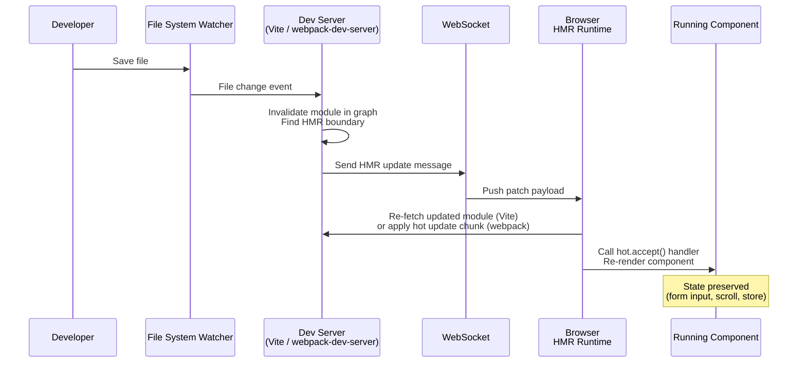

# Dev Server, HMR & Development Experience

## Context

The gap between writing code and seeing its effect in the browser is called the feedback loop.
For most of the 2010s, that loop involved saving a file, waiting for a full rebuild, and then
manually refreshing the browser: a sequence that could take 10-60 seconds on large applications.
Each interruption broke concentration. Gloria Mark's 2008 lab study interrupted university
students during a simulated email task and found that, although interrupted work
was completed no slower (and in some conditions faster) than uninterrupted work, participants
reported significantly higher stress, frustration, and effort. That experiment measured
repeated, periodic supervisor interruptions during a roughly 90-minute lab session, not
build-tool wait times, so it does not yield a specific recovery-time figure for this context. The stress and frustration effect
plausibly compounds with a slow rebuild, though: a 10-60 second wait is long enough to open
another tab, and the task resumed afterward is rarely the one left off.

Native-ESM dev servers have since compressed that wait to milliseconds for a large share of new
projects, but adoption is still partial. Many mature codebases, especially large
monorepos with webpack-specific loader chains, still run a webpack-based dev server today, which
is why this article covers both architectures.

Native-ESM dev servers serve your source files without a full production-style bundle step,
resolving module specifiers so bare imports like `import React from 'react'` work directly in
the browser and rewriting imports where the browser would otherwise fail. Bundle-based dev
servers instead compile a development bundle before serving anything, skipping only the
production optimizations (minification, tree-shaking) rather than the bundling step itself.
Both architectures proxy API requests to avoid CORS issues and inject Hot Module Replacement
(HMR) runtimes to push updates without a page reload. On a native-ESM dev server, where only the
changed module is re-sent, saving a file and seeing the update can take under 100ms; bundle-based
servers rebuild more of the graph and their HMR latency grows with application size, as the
Design Thinking section details.

Source maps and HTTPS in development are often treated as optional polish, but both are
correctness concerns as much as convenience features.
Without source maps, a bug in your TypeScript or JSX-compiled code surfaces as an opaque
line number in transpiled output.
Without HTTPS, certain browser APIs are silently unavailable or behave differently than
production: geolocation, service workers, and the Web Crypto API all require a secure context.
A development environment that does not match the constraints of production is a source of
latent bugs that only appear after deployment.

## Design Thinking

**Why dev server speed changes engineering behavior.**
The practical difference between a 500ms and a 30-second feedback loop is what an engineer
will risk trying. At 500ms, tweaking a layout value, trying a different API shape, or checking
an edge case in the running app costs nothing, so engineers do it as a matter of course.
At 30 seconds, each of those checks costs a context switch, so engineers batch several changes
together before testing any of them. When something breaks in a batch, the bug can be in any
of the changes bundled into it, so it surfaces further from the change that caused it and takes
longer to isolate.

**Why HMR speed differs across dev server architectures.**
All of the tools discussed here implement HMR, the mechanism for pushing a file change to the
browser without a full reload, but they reach it through different architectures: webpack
pre-bundles, Vite serves native ESM, and Turbopack (Next.js's Rust-based dev bundler) and Rspack
(a Rust-based, webpack-API-compatible bundler) each take their own approach to avoiding
unnecessary rework.

In webpack, all source files are pre-bundled into one or more chunk files before the dev server
starts serving anything.
When a file changes, webpack re-runs any loaders for that file (Babel, CSS processors, the
TypeScript compiler), re-evaluates which modules in the graph are affected, regenerates a
"hot update chunk" (a patch file containing the updated module code), and pushes it via
WebSocket. The loader pipeline runs on every HMR update, and on a large graph with many
dependents, the chain of invalidations can cascade. On large React or Vue applications, webpack
HMR updates can take several seconds; the exact number depends on graph size and loader
configuration, and webpack does not publish a benchmark figure for it, so treat any specific
number, including ones elsewhere in this article, as illustrative rather than a controlled
comparison.

In Vite, your source files are never pre-bundled: the browser fetches each one as an individual
ESM module via HTTP, and Vite transforms it on request. Third-party dependencies are the
exception. Vite pre-bundles `node_modules` packages, using Rolldown as of Vite 8
(March 2026) and esbuild in earlier versions, into single ESM files before serving them. This
does two things: it converts CommonJS or UMD packages into ESM so the browser can load them at
all, and it collapses packages with many internal modules (`lodash-es` ships 600+) into one
file, so a single import does not fire off hundreds of HTTP requests. That pre-bundling step
runs once at cold start, which is also why loading a Vite dev server for the first time involves
a brief pause before per-file HMR speed kicks in: the pause comes from dependency analysis.

When a file changes, Vite's file watcher identifies the changed module in the server-side
module graph, determines the HMR boundary (the nearest module that has registered an
`import.meta.hot.accept()` handler), and sends a minimal WebSocket message telling the
browser to re-fetch that one file.
No loader pipeline reruns on the changed file; Vite transforms files on request, and the
browser already has everything else cached.
HMR update time is decoupled from total application size: updating a single component on
a 500-module app is the same speed as on a 50-module app.
Vite's documentation states that HMR updates using the Oxc transformer can reflect in the browser
in under 50ms.

Turbopack takes a comparable approach: an incremental, function-level cache means a file change
only re-runs the compiler work that actually depends on that file, so Fast Refresh (Next.js's HMR)
scales with the size of the change rather than the size of the app. `next dev --turbo` reached
stable status in Next.js 15 and became the default dev bundler in Next.js 16. Rspack, which
implements the webpack configuration API in Rust, targets teams that want webpack-compatible
config with faster HMR; Rspack 2.1 (June 2026) reports roughly a 5% HMR improvement over 2.0.

**Why source maps matter for debugging.**
When you write TypeScript or JSX, the code the browser actually executes is different from
the code you wrote.
Column numbers are collapsed, variable names are mangled, and multiple files are concatenated.
When an exception fires, the stack trace points to line 1, column 8432 of `main.bundle.js`.
Source maps are files (or inline data URLs) that map from that generated position back to
the original file, line, and column in your source.
DevTools use them transparently: you see your TypeScript, not the compiled output.
Breakpoints, watch expressions, and call stacks all reference your original code.

The choice of source map type is a deliberate trade-off between build speed and map fidelity.
`eval` is the fastest (each module wrapped in `eval()` with a `//# sourceURL` annotation)
but line numbers map to transpiled output, not original source.
`eval-cheap-module-source-map` adds loader-level source maps with line-only precision: a good
balance for development, since rebuild speed stays fast and line numbers stay accurate.
`eval-source-map` provides full original-source fidelity with column mappings, at the cost
of slower initial build.

**Why full source maps in production are a security concern.**
A full `source-map` in production generates a `.map` file and links it in the bundle via
a `//# sourceMappingURL=` comment.
Any user who opens browser DevTools will see your original source code: TypeScript,
JSX, business logic, internal API structures, environment variable names used in code.
For closed-source commercial applications, this is an unintended disclosure.

`hidden-source-map` generates the same full-fidelity `.map` file but omits the reference
comment from the bundle.
End users loading your site receive no pointer to the map file.
You can upload the map files to an error tracker like Sentry using its `--sourcemap` CLI flag,
so that stack traces in error reports are symbolicated using your source. The map files never
ship in the public bundle, so they are not reachable from the browser.

**Why some browser APIs require HTTPS even in development.**
The browser's secure-contexts model restricts certain powerful APIs to origins served over
HTTPS (or `localhost`).
Geolocation, the Web Crypto API, service worker registration, the Payment Request API,
and camera/microphone access via `getUserMedia` all require a secure context.
If your dev server runs over plain HTTP on a non-localhost hostname (common for testing
on a physical device, a VM, or a staging hostname like `dev.myapp.local`), these APIs
are silently unavailable.
The symptom is code that works in production but fails in development, which inverts the
expected debugging flow.
Running HTTPS in development with a locally-trusted certificate removes the discrepancy.

## Best Practices

**SHOULD use source maps in development; `eval-cheap-module-source-map` is the recommended type for most projects.**
This setting provides accurate line numbers that point to your original TypeScript or JSX source, with fast rebuild speed on every HMR update. The performance gap between `eval` and `eval-cheap-module-source-map` is small; the debugging gap is large. MUST NOT disable source maps in development to "speed up the build": the rebuild cost is negligible compared to the debugging time lost.

**MUST NOT expose full source maps in production by leaving the `//# sourceMappingURL` reference in the bundle.**
Use `hidden-source-map` in Webpack (`devtool: 'hidden-source-map'`) or `sourcemap: 'hidden'` in Vite's build config. Upload the resulting `.map` files to an error tracker such as Sentry so your team gets symbolicated stack traces. End users cannot read your original source through DevTools, because the bundle never references the map file.

**SHOULD enable HTTPS in development when the project uses any secure-context browser API.**
Geolocation, Service Workers, Web Crypto, camera/microphone access via `getUserMedia`, and the Payment Request API all require a secure context. Use `mkcert` to generate a locally-trusted certificate. Running HTTPS in development removes the class of bugs where code works in production but silently fails in development due to a missing secure context.

**SHOULD proxy API requests through the dev server rather than configuring CORS on the backend just for development.**
Both Vite (`server.proxy`) and webpack-dev-server (`devServer.proxy`) can forward `/api/*` requests to a backend running on a different port. This avoids modifying backend CORS headers for a development-only constraint and matches production routing behavior more closely.

**SHOULD add explicit `import.meta.hot.accept()` handlers to shared utility modules that are imported by many components.**
Framework plugins handle HMR boundaries for component files automatically. Shared modules such as API clients, feature flag stores, and configuration objects have no framework-managed boundary. Without an explicit handler, a change to any of these modules bubbles up the dependency chain and falls back to a full page reload, losing all in-memory application state.

## Visual

HMR update flow from file save to browser re-render:



## Example

### 1. Vite dev server configuration with HMR and source maps

```javascript
// vite.config.js
import { defineConfig } from 'vite'
import react from '@vitejs/plugin-react'

export default defineConfig({
  plugins: [react()],

  server: {
    port: 3000,
    // Proxy API requests to avoid CORS in development
    proxy: {
      '/api': {
        target: 'http://localhost:8080',
        changeOrigin: true,
      },
    },
    // HTTPS with mkcert-generated certs (see mkcert setup below)
    // https: {
    //   key: fs.readFileSync('./.cert/key.pem'),
    //   cert: fs.readFileSync('./.cert/cert.pem'),
    // },
    hmr: {
      // Overlay error messages in the browser
      overlay: true,
    },
  },

  build: {
    // Full source map for production — use hidden-source-map to avoid exposing source
    sourcemap: 'hidden',
  },

  // Development source maps: Vite emits standard source maps from its transform pipeline for
  // JS/TS/JSX on by default. There is no webpack-style eval-devtool wrapping.
  // Override CSS source maps specifically via css.devSourcemap.
})
```

### 2. Manual `import.meta.hot.accept()` for a custom module

Framework plugins (vite-plugin-react, @vitejs/plugin-vue) wire up `import.meta.hot` automatically
for components.
For a plain utility module where you want custom HMR behavior, you register the handler yourself:

```javascript
// src/config/featureFlags.js

export let flags = await fetchFeatureFlags()

export function isEnabled(name) {
  return flags[name] ?? false
}

// Accept updates to this module itself.
// When this file changes, Vite re-executes the module top to bottom, so newModule.flags
// already holds the freshly re-fetched flags. We only need to copy the reference over so
// that isEnabled(), whose closure reads this file's local `flags` binding, sees the update.
if (import.meta.hot) {
  import.meta.hot.accept((newModule) => {
    if (newModule) {
      flags = newModule.flags
    }
  })

  // Dispose handler: clean up side effects before the module is replaced
  import.meta.hot.dispose(() => {
    // e.g., clear timers, close sockets
  })
}
```

`flags` must be exported for this to work. If it is not, `newModule.flags` is `undefined`, the
accept callback sets the module's `flags` binding to `undefined`, and the next call to
`isEnabled()` throws a `TypeError: Cannot read properties of undefined` rather than failing
silently. To degrade to `false` instead of throwing, change `isEnabled` to
`return flags?.[name] ?? false`.

The `if (import.meta.hot)` guard ensures the code is tree-shaken in production builds
where `import.meta.hot` is `undefined`.

### 3. webpack-dev-server configuration with source maps and HTTPS

```javascript
// webpack.config.js
const path = require('path')

module.exports = (env, argv) => {
  const isDev = argv.mode !== 'production'

  return {
    entry: './src/index.js',
    output: {
      path: path.resolve(__dirname, 'dist'),
      filename: '[name].[contenthash].js',
    },

    // Source map strategy:
    // Development: eval-cheap-module-source-map — fast rebuilds, accurate line numbers
    // Production:  hidden-source-map — full fidelity map file, no browser link
    devtool: isDev ? 'eval-cheap-module-source-map' : 'hidden-source-map',

    devServer: {
      port: 3000,
      hot: true,          // Enable HMR
      open: true,         // Open browser on start
      historyApiFallback: true, // SPA routing

      // Proxy API requests
      proxy: {
        '/api': {
          target: 'http://localhost:8080',
          changeOrigin: true,
        },
      },

      // HTTPS with mkcert certs
      // server: {
      //   type: 'https',
      //   options: {
      //     key: './.cert/key.pem',
      //     cert: './.cert/cert.pem',
      //   },
      // },
    },
  }
}
```

### 4. Setting up HTTPS in development with mkcert

`mkcert` creates locally-trusted certificates signed by a certificate authority that it installs
into your system and browser trust stores.
No browser security warning, no self-signed certificate exceptions.

```bash
# Install mkcert (macOS with Homebrew)
brew install mkcert

# Install the local CA into the system and browser trust stores
mkcert -install

# Generate a certificate for localhost and local hostnames
mkdir -p .cert
mkcert -key-file .cert/key.pem -cert-file .cert/cert.pem localhost 127.0.0.1 ::1

# The cert and key files are now in .cert/
# Add .cert/ to .gitignore — never commit private keys
echo ".cert/" >> .gitignore
```

After generating the certificates, uncomment the `https` / `server` block in the Vite
or webpack config examples above.

## Common Mistakes

- **Using `source-map` in production without hiding the reference.** The bundle includes
  `//# sourceMappingURL=main.js.map`, and anyone with DevTools can read your source.
  Use `hidden-source-map` in webpack or `sourcemap: 'hidden'` in Vite's build config,
  then upload `.map` files to your error tracker separately.

- **Ignoring HMR boundaries.** If no module in the dependency chain has registered an
  `import.meta.hot.accept()` handler (or the equivalent), HMR bubbles up to the application
  root and falls back to a full page reload.
  Framework plugins handle this for component files, but changes to shared utility modules
  used across many components often trigger full reloads unless you add an explicit handler.

- **Assuming `localhost` and `127.0.0.1` behave identically for secure contexts.**
  `localhost` is treated as a secure context in most browsers; `127.0.0.1` is not guaranteed
  to be.
  When testing on a device or hostname other than `localhost`, HTTPS is required for
  secure-context APIs regardless.

- **Committing generated certificate files.** The private key in `.cert/key.pem` must not
  be committed to version control.
  Each developer should run `mkcert` locally, or your team should share a setup script
  that generates certs on first use.

- **Running a webpack-based dev server on a very large app without profiling HMR.**
  If individual HMR updates are slow, the root cause is usually a deeply shared module
  that invalidates a large portion of the graph on every change.
  Isolate shared utilities behind stable interfaces. If migrating off webpack entirely is an
  option, Rspack keeps the existing webpack config format while implementing the bundler in
  Rust, and Next.js projects can move to Turbopack, which is the default dev bundler as of
  Next.js 16.

## Related FEEs

- [FEE-800: Build Tooling Overview](./800.md) — context on why the tooling layer exists
- [FEE-801: Bundlers: Webpack, Vite, Rollup & esbuild](./801.md) — the bundler architectures that underpin the dev server behavior described here
- [FEE-807: Build Optimization](./807.md) — production source map strategy, chunk splitting, and asset optimization

## References

- Gloria Mark, Daniel Gudith, and Ujwal Klocke, "The Cost of Interrupted Work: More Speed and Stress," Proceedings of the ACM CHI Conference on Human Factors in Computing Systems (2008). https://ics.uci.edu/~gmark/chi08-mark.pdf
- Vite Team, "Why Vite," Vite Documentation. https://vite.dev/guide/why
- Vite Team, "Features: Hot Module Replacement," Vite Documentation. https://vite.dev/guide/features#hot-module-replacement
- Vite Team, "HMR API," Vite Documentation. https://vite.dev/guide/api-hmr
- Vite Team, "Dependency Pre-Bundling," Vite Documentation. https://vite.dev/guide/dep-pre-bundling
- Vite Team, "Vite 8.0 is out!," Vite Blog (2026). https://vite.dev/blog/announcing-vite8
- webpack Contributors, "Devtool (source map types)," webpack Documentation. https://webpack.js.org/configuration/devtool/
- webpack Contributors, "Hot Module Replacement," webpack Guides. https://webpack.js.org/guides/hot-module-replacement/
- Next.js Team, "Turbopack Dev is Now Stable," Next.js Blog (2024). https://nextjs.org/blog/turbopack-for-development-stable
- Next.js Team, "Next.js 16," Next.js Blog (2025). https://nextjs.org/blog/next-16
- Rspack Team, "Announcing Rspack 2.0," Rspack Blog (2026). https://rspack.rs/blog/announcing-2-0
- Rspack Team, "Announcing Rspack 2.1," Rspack Blog (2026). https://rspack.rs/blog/announcing-2-1
- Filippo Valsorda, "mkcert: A simple zero-config tool to make locally trusted development certificates," GitHub. https://github.com/FiloSottile/mkcert
