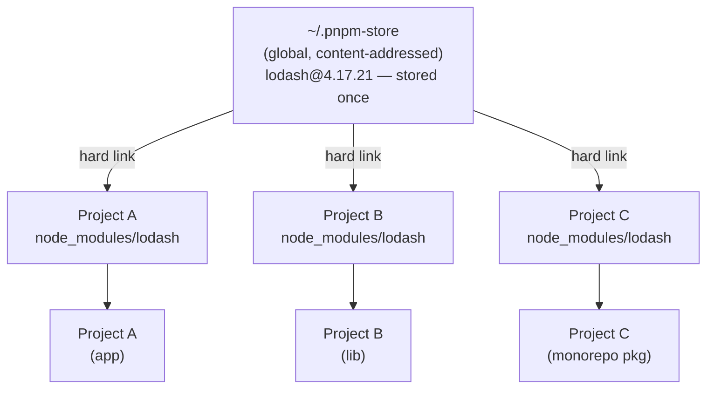

# [FEE-804] Package Management: npm, pnpm & Yarn

:::info
npm, pnpm, and Yarn all read the same `package.json` and produce a working `node_modules`, but
they get there through different on-disk layouts, and that difference drives most of the bugs and
tradeoffs teams hit in practice. npm's flat, hoisted layout is what makes phantom dependencies
possible: code that imports a package it never declared, because npm quietly moved that package to
the top level. pnpm's symlinked store closes that gap by construction. Yarn's Plug'n'Play mode
removes `node_modules` entirely and trades some tool compatibility for install speed. This article
works through what each layout actually does on disk, where the phantom-dependency and lockfile
risks come from, and how Bun and Deno's built-in managers fit into the picture as of 2026.
:::

## Context

Before package managers existed, adding a third-party library to a web project meant downloading
a zip file, copying files into the project, and manually tracking version compatibility. npm,
released alongside Node.js in 2010, automated that workflow: declare your dependencies in
`package.json`, run `npm install`, and the registry does the rest. That single abstraction
unlocked the JavaScript ecosystem's explosive growth. npm today hosts millions of packages and
remains, by its own description, the world's largest software registry.

But the original model had structural flaws that only became visible at scale. Early npm
(versions 1 and 2) nested every dependency's own `node_modules` inside its parent, so the same
package could end up duplicated many times over in one project. npm 3 (2015) replaced this with a
maximally flat, hoisted layout that both deduplicated packages and relieved Windows' 260-character
path-length limit on deeply nested directories.
Flattening created a new class of subtle bugs: code could silently import packages it never
declared as dependencies. Registry fetches were also redundant. If ten projects on a machine all
depended on `lodash@4.17.21`, npm downloaded and stored ten separate copies. The `node_modules`
directory itself, sometimes containing hundreds of thousands of files, became one of the largest
contributors to developer disk usage.

pnpm (initial commit in 2016, first stable release in 2017) and Yarn (2016, with the Yarn Berry
rewrite in 2020) are alternatives that coexist with npm rather than replace it. npm ships bundled
with Node.js and remains the default most engineers meet first; pnpm and Yarn are opt-in installs
on top of that baseline. Both target the same two problems from different angles: duplicate
package storage on disk, and code that silently depends on packages it never declared.

npm, pnpm, and Yarn are not the only options as of 2026. Bun ships its own installer
(`bun install`) with a text-based `bun.lock` lockfile (the older binary `bun.lockb` was the
default before Bun 1.2); Bun's own documentation claims installs up to 25x faster than
`npm install`, and `bun install` automatically migrates an existing `package-lock.json`,
`yarn.lock`, or `pnpm-lock.yaml` on first run. That lockfile format is not readable by npm, pnpm,
or Yarn, and Bun does not run lifecycle scripts such as `postinstall` unless the package is
explicitly listed in `trustedDependencies`. Deno 2 added a comparable built-in manager
(`deno add`, `deno install`) that writes a `node_modules` directory and its own `deno.lock`,
seeded from an existing `package-lock.json` when one is present. Both are reasonable choices for a
project already committed to that runtime. Teams staying on Node.js still get the deepest
monorepo tooling support (Turborepo, Nx, Changesets) and the longest production track record from
pnpm and Yarn.

The rest of this article shows how each layout produces or prevents phantom dependencies, and why
the lockfile is the one thing that makes a build reproducible.

## Visual

### pnpm Content-Addressable Store



One package version on disk. Three projects reference it via hard links. Updating one project's
`lodash` to a new version adds only the differing files to the store. Unchanged files are shared
with previous versions.

### npm vs pnpm node_modules Layout

```
npm (flat, hoisted):            pnpm (isolated, symlinked):
node_modules/                   node_modules/
  lodash/          ← hoisted      .pnpm/
  react/           ← hoisted        lodash@4.17.21/
  A/                                  node_modules/
    (no own lodash)               react@18.3.1/
  B/                                  node_modules/
    (no own react)              lodash  → .pnpm/lodash@4.17.21  (symlink)
                                react   → .pnpm/react@18.3.1   (symlink)
```

In the npm layout, your code can import `lodash` without declaring it. In the pnpm layout,
only packages in your `package.json` appear as symlinks at the top level; transitive deps
are invisible to your code.

## Example

### 1. npm workspaces: `package.json`

```json
{
  "name": "my-app",
  "private": true,
  "workspaces": [
    "packages/*"
  ],
  "scripts": {
    "build": "npm run build --workspace=packages/ui --workspace=packages/app",
    "test": "npm test --workspaces --if-present"
  }
}
```

Run a script in one workspace:

```bash
# -w is short for --workspace
npm run build -w packages/ui
```

Run across all workspaces:

```bash
npm run test --workspaces --if-present
```

### 2. pnpm workspace configuration

`pnpm-workspace.yaml` (place at the repository root):

```yaml
packages:
  - 'packages/*'
  - 'apps/*'
  # Explicitly exclude test fixtures that are not real packages
  - '!**/test/**'
```

`.npmrc` (recommended settings for pnpm projects):

```ini
# pnpm's node_modules is strict by default: your own code can only import
# packages declared in package.json. This comes from the symlinked .pnpm
# virtual store (see Design Thinking below), not from any setting here.

# Fail the install, not just warn, when a peer dependency requirement is
# unmet. Defaults to false.
strict-peer-dependencies=true

# Link a local package into another workspace package's node_modules only
# when the dependency uses the `workspace:` protocol (e.g. "workspace:*"
# in package.json), not by name-matching alone. Default since pnpm v9;
# set explicitly here for clarity.
link-workspace-packages=false
```

The `workspace:` protocol tells pnpm to resolve a dependency to the local workspace package
instead of the registry, for example `"ui": "workspace:*"` in an app's `package.json`. Range
prefixes such as `workspace:^` and `workspace:~` are rewritten to real semver ranges automatically
when the package is published, so consumers outside the monorepo still get an ordinary version
range.

Install a package in a specific workspace:

```bash
# Add lodash to the 'ui' package only
pnpm add lodash --filter ui

# Add a dev dependency to every workspace
pnpm add -D vitest --filter '*'
```

### 3. `npm ci` vs `npm install`

```bash
# npm install
# - Resolves versions from package.json semver ranges
# - Creates or UPDATES package-lock.json
# - Use during development when you want to add or upgrade packages
npm install

# npm ci ("clean install")
# - Reads package-lock.json exactly; never updates it
# - Fails if package.json and package-lock.json are out of sync
# - Deletes node_modules before installing (clean slate)
# - Faster than npm install in CI because no resolution step
# - USE THIS IN CI pipelines, Docker builds, and release scripts
npm ci
```

pnpm equivalent in CI:

```bash
# pnpm install with frozen lockfile — same semantics as npm ci
pnpm install --frozen-lockfile
```

### 4. Yarn Berry: enabling PnP

`.yarnrc.yml` (Yarn Berry configuration file):

```yaml
# "pnp" is the default in Yarn Berry. Set explicitly for clarity.
nodeLinker: pnp

# Compression level for .yarn/cache zip files.
# 0 = no compression; faster CI, easier git diffs.
compressionLevel: 0

# Yarn version to use (managed by Corepack).
yarnPath: .yarn/releases/yarn-4.5.1.cjs
```

Opt out of PnP and use classic `node_modules` (if tool compatibility is a concern):

```yaml
# Falls back to node_modules layout — compatible with all tools
nodeLinker: node-modules
```

Set up editor support for PnP (VSCode example):

```bash
# Generate the TypeScript SDK shim that VSCode needs for PnP import resolution
yarn dlx @yarnpkg/sdks vscode
```

### 5. Security: npm audit in CI

```bash
# Scan the current project for known vulnerabilities.
# Exits non-zero if any vulnerabilities are found (fails the CI job).
npm audit --audit-level=moderate

# Auto-fix vulnerabilities by upgrading to non-breaking patched versions.
# Review the diff before committing — upgrades can introduce behavior changes.
npm audit fix

# For vulnerabilities that require a semver-major upgrade (breaking changes),
# review manually before applying:
npm audit fix --force   # use cautiously

# pnpm equivalent:
pnpm audit --audit-level=moderate
```

Publish an npm package with provenance attestation (requires npm 9.5+ and GitHub Actions):

```yaml
# .github/workflows/publish.yml
jobs:
  publish:
    runs-on: ubuntu-latest
    permissions:
      id-token: write   # Required for OIDC-based provenance
      contents: read
    steps:
      - uses: actions/checkout@v4
      - uses: actions/setup-node@v4
        with:
          node-version: '20'
          registry-url: 'https://registry.npmjs.org'
      - run: npm ci
      - run: npm publish --provenance --access public
        env:
          NODE_AUTH_TOKEN: ${{ secrets.NPM_TOKEN }}
```

Provenance links the published package to its source repository and the specific CI run that
built it, making it verifiable that the package on npmjs.com matches the source code it claims
to come from.

## Best Practices

**MUST commit lockfiles (`package-lock.json`, `pnpm-lock.yaml`, or `yarn.lock`) to version control.**
Without a committed lockfile, `npm install` resolves fresh versions on every machine and CI run. Two developers running install a week apart can end up with different transitive dependency versions that produce different behavior. Commit the lockfile: it is the source of truth for reproducible builds.

**SHOULD use `npm ci` (not `npm install`) in all CI pipelines.**
`npm ci` reads the lockfile exactly, fails loudly if `package.json` and the lockfile are out of sync, and never updates the lockfile. `npm install` performs version resolution and may silently update the lockfile, meaning the dependencies that CI installs may not match what is committed. The pnpm equivalent is `pnpm install --frozen-lockfile`.

**SHOULD use pnpm for new projects that have no existing tooling constraints.**
pnpm's content-addressed global store avoids redundant downloads and reduces disk usage significantly across multiple projects. Its strict symlinked `node_modules` layout prevents phantom dependencies: packages not declared in `package.json` are inaccessible, which makes dependency declarations accurate by design. Bun's installer is faster still and worth adopting if the team already runs on Bun, but its `bun.lock` format cannot be read by npm, pnpm, or Yarn, and pnpm and Yarn have a longer track record with monorepo tooling; pnpm remains the safer default otherwise.

**SHOULD run `npm audit` (or `pnpm audit`) as a required CI step.**
Running audit locally is easily forgotten. A required CI step means newly published vulnerability advisories are caught the next time CI runs, whether or not anyone remembers to run it manually. Set `--audit-level=moderate` as a baseline; adjust based on your team's risk tolerance.

**MUST NOT mix package managers in one repository.**
Using `npm install` in a repo with `pnpm-lock.yaml` creates a second conflicting lockfile. The two lockfiles resolve different versions, and installs become non-deterministic depending on which tool each developer or CI job uses. Declare the intended package manager with the `packageManager` field in `package.json`, and enable Corepack (`corepack enable`) so that field pins the exact pnpm or Yarn version whenever pnpm or Yarn is invoked. Corepack does not install npm shims by default, so it will not stop someone from running `npm install`; add a `preinstall` guard such as `npx only-allow pnpm` to block the wrong manager outright.

## Design Thinking

**Why npm's flat hoisting was a pragmatic hack that introduced phantom dependencies.**
Node.js resolves `require('lodash')` by walking up the directory tree, looking for
`node_modules/lodash` at each level. A deeply nested structure, where package A's `lodash` lives
at `node_modules/A/node_modules/lodash` and package B's lodash lives at
`node_modules/B/node_modules/lodash`, works correctly for require resolution. It is also
wasteful: duplicate copies of the same package pile up throughout the tree, and on Windows, whose
Win32 API caps a full path at 260 characters (MAX_PATH), the deepest chains could exceed the
limit outright. npm 3 solved both problems by hoisting: it flattens the dependency tree, moving
packages from deep nesting up to the top-level `node_modules` whenever version ranges are
compatible. A package at the top level is accessible from anywhere in the project.

The side effect of hoisting is the phantom dependency problem. If your project depends on package
A, and package A depends on `lodash`, then after hoisting, `lodash` lives at
`node_modules/lodash`. That is the top level, directly accessible from your own code. You can
write `import _ from 'lodash'` and it works. But `lodash` is not in your `package.json`. You are
depending on a transitive dependency: a package that belongs to A, not to you. When A upgrades
and drops `lodash`, or when A pins `lodash` to a version that breaks your usage, your code breaks
for reasons that have nothing to do with anything you changed. In a large application with hundreds
of transitive dependencies, flat hoisting virtually guarantees that some phantom dependency usage
exists. Teams typically only discover it when an unrelated upgrade causes an unexpected import
failure.

**Why pnpm's content-addressed store achieves both efficiency and strictness.**
pnpm stores every package version once in a global content-addressable store (typically
`~/.pnpm-store`). When you install a project, pnpm creates hard links from your project's
`node_modules` into the global store rather than copying files. The result: if you have ten
projects that all use `lodash@4.17.21`, there is exactly one copy of that package on disk. All
ten projects hard-link to the same bytes. On a machine with many projects, this can reduce
package storage by an order of magnitude.

Strictness follows from the directory layout. pnpm does not hoist packages to the top-level
`node_modules`. Instead, it uses a `.pnpm` virtual store directory where every package's
`node_modules` contains only the packages that package explicitly declared. Your own project's
`node_modules` contains only the packages listed in your `package.json`. If you try to import
a package you did not declare, Node's module resolution walks up the tree and finds nothing, and
the import fails rather than silently succeeding until a future upgrade breaks it. This is the
correct behavior. pnpm achieves it without breaking packages that assume a flat structure by
making declared top-level packages directly accessible while keeping transitive dependencies
isolated.

**Why Yarn PnP is architecturally clever but ecosystem-constrained.**
Yarn Berry's Plug'n'Play mode starts from a different question: what if `node_modules` did not
exist at all? PnP stores packages as zip files in `.yarn/cache` and generates a single
`.pnp.cjs` file, a lookup table mapping package names and versions to their zip file locations.
Node's `require()` is patched at startup to consult this table instead of walking the filesystem.

The benefits are real. Installs are nearly instantaneous on cache hits because there are no files
to extract to `node_modules`. The `.yarn/cache` directory can be committed to version control
(zero-installs), making CI `yarn install` a no-op. The repository itself already contains every
package.

The tradeoff is ecosystem compatibility. Every tool in the JavaScript ecosystem (build tools,
test runners, editors, native module compilers) was written assuming that packages live as
extracted directories in `node_modules`. PnP's zip-based storage breaks that assumption. IDEs
require a special SDK setup. Native modules (`.node` files) cannot be loaded from within a zip.
Some build tools never gained PnP support. The result is that adopting Yarn PnP requires
evaluating each tool in your stack for compatibility. For teams with stable, well-supported tool
stacks, PnP works well. For teams with diverse tooling or native modules, the compatibility work
may outweigh the install-speed benefit.

**Why lockfiles are non-negotiable in CI.**
`npm install` resolves the "best" version for each package according to the semver range in
`package.json`. If `package.json` specifies `"lodash": "^4.17.0"`, npm might resolve
`4.17.20` on a developer's machine Monday and `4.17.21` on CI Tuesday if a new patch was
published overnight. If `4.17.21` introduced a bug, CI breaks while the developer's machine still
passes. Worse, this divergence is invisible. Both environments claim to run the same declared
dependency. A lockfile pins the exact resolved version and checksum of every package in the
dependency tree. `npm ci` reads the lockfile and installs exactly what it specifies, without
re-resolving anything. The only way to get a reproducible build is to commit the lockfile and
use the lockfile-only install command in CI.

## Common Mistakes

**Using `npm install` instead of `npm ci` in CI.**
`npm install` performs version resolution and may update the lockfile. In CI, this means the
lockfile committed to the repository may not match what actually gets installed. Use `npm ci` or
`pnpm install --frozen-lockfile` in all automated pipelines. If the lockfile and `package.json`
are out of sync, `npm ci` will fail loudly, which is the correct behavior.

**Mixing package managers in one repository.**
Using `npm install` in a repo with a `pnpm-lock.yaml` creates a second, conflicting lockfile.
The two lockfiles will resolve different versions, and the resulting installs are non-deterministic
depending on which tool each developer or CI job uses. Pick one package manager per repository and
enforce it. Most package managers respect the `packageManager` field in `package.json`:

```json
{
  "packageManager": "pnpm@11.17.0"
}
```

Corepack (`corepack enable`) reads this field and pins the exact pnpm version whenever pnpm is
invoked, refusing to run if a different version is requested. It does not cover npm: Corepack
does not install npm shims unless they are explicitly requested, so a bare `npm install` still
runs and still writes the conflicting `package-lock.json`. To block the wrong manager outright,
add a `preinstall` script that runs an enforcement tool such as `npx only-allow pnpm`, which exits
with an error if the install was not invoked through the named manager.

**Relying on phantom dependencies.**
If your code imports a package that is not in your `package.json`, it is a phantom dependency:
accessible only because npm hoisted it from a transitive dependency. This works until an upgrade
removes the hoisting. When migrating to pnpm, these imports fail immediately because pnpm's
strict layout makes phantom deps inaccessible. The fix is to explicitly add the package to your
`package.json`. Each install failure pnpm surfaces here is a missing dependency declaration that
npm's hoisting had been silently covering for.

**Using `--legacy-peer-deps` as a permanent solution.**
When npm reports an `ERESOLVE` peer dependency conflict, the temptation is to add
`--legacy-peer-deps` to silence it. This flag disables npm's peer dependency resolution
entirely, allowing incompatible packages to be installed together. The install now succeeds, but
the underlying incompatibility remains. The package may work, or it may fail in subtle ways when
the conflicting peer is actually invoked, and nothing in the install output will say which. The
correct fix is to resolve the version conflict explicitly: upgrade the package that requires the
newer peer, or find an intermediate version that satisfies both ranges. Use `--legacy-peer-deps`
only as a temporary workaround while you file a bug report upstream or wait for a package update.

**Treating `npm audit fix --force` as safe.**
`npm audit fix` upgrades packages within their semver range, which is generally safe. `--force`
upgrades through major version boundaries, where breaking changes are expected. Running `--force`
unreviewed can silently upgrade an API-consuming package to a version with a different interface,
causing runtime failures that are not caught by `npm audit` itself. Always review the diff after
`--force` and run your test suite before committing.

## Related Topics

- [Build Tooling & Module Systems Overview](/en/Build%20Tooling%20and%20Module%20Systems/800): the broader pipeline that package management feeds into.
- [Monorepos & Workspaces](/en/Build%20Tooling%20and%20Module%20Systems/monorepos-and-workspaces): how the `workspace:` protocol, Turborepo, and Nx build on the workspace features introduced here.
- [Bundlers: Webpack, Vite, Rollup & esbuild](/en/Build%20Tooling%20and%20Module%20Systems/bundlers-webpack-vite-rollup-esbuild): how bundlers traverse `node_modules` during the bundle step.

## References

- [pnpm Motivation](https://pnpm.io/motivation)
- [pnpm Symlinked node_modules structure](https://pnpm.io/symlinked-node-modules-structure)
- [pnpm Workspaces (the `workspace:` protocol)](https://pnpm.io/workspaces)
- [pnpm Settings reference](https://pnpm.io/settings)
- [pnpm v9.0.0 release notes (link-workspace-packages default change)](https://github.com/orgs/pnpm/discussions/7932)
- [Yarn Plug'n'Play](https://yarnpkg.com/features/pnp)
- [Yarn Install Modes (linkers)](https://yarnpkg.com/features/linkers)
- [npm ci documentation](https://docs.npmjs.com/cli/v10/commands/npm-ci)
- [npm audit documentation](https://docs.npmjs.com/cli/v10/commands/npm-audit)
- [Generating provenance statements — npm Docs](https://docs.npmjs.com/generating-provenance-statements/)
- [Introducing npm package provenance — GitHub Blog](https://github.blog/security/supply-chain-security/introducing-npm-package-provenance/)
- [Phantom dependencies — Rush](https://rushjs.io/pages/advanced/phantom_deps/)
- [npm workspaces](https://docs.npmjs.com/cli/v10/using-npm/workspaces)
- [About npm — npm Docs](https://docs.npmjs.com/about-npm)
- [Maximum Path Length Limitation — Win32 apps, Microsoft Learn](https://learn.microsoft.com/en-us/windows/win32/fileio/maximum-file-path-limitation)
- [Corepack — Node.js](https://github.com/nodejs/corepack#readme)
- [only-allow — npm](https://www.npmjs.com/package/only-allow)
- [Bun install — Bun Docs](https://bun.com/docs/cli/install)
- [Bun Lockfile — Bun Docs](https://bun.com/docs/pm/lockfile)
- [Introducing your new JavaScript package manager: Deno](https://deno.com/blog/your-new-js-package-manager)
- [Migrate from npm — Deno Docs](https://docs.deno.com/runtime/migrate/switch_package_manager/)
