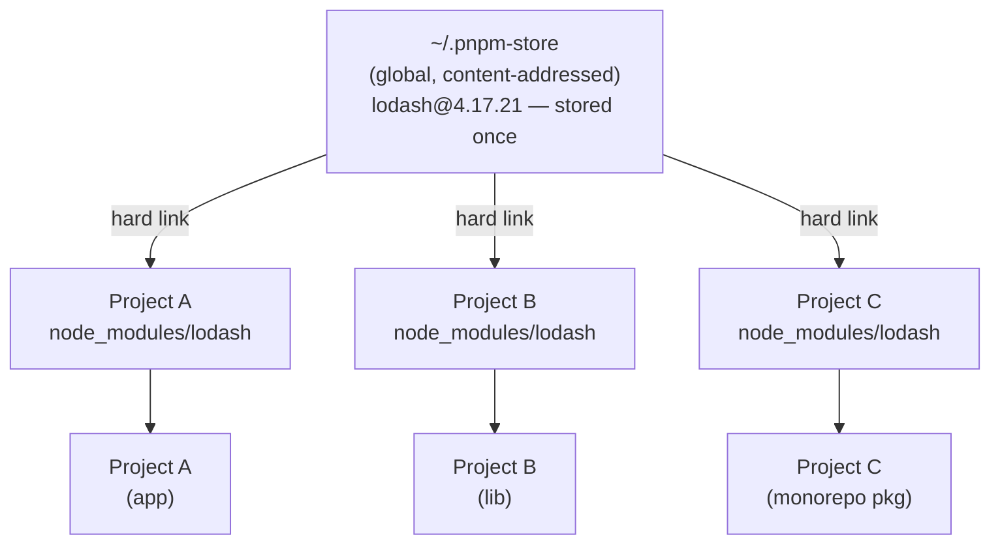

# Package Management: npm, pnpm & Yarn

## Context

Before package managers existed, adding a third-party library to a web project meant downloading
a zip file, copying files into the project, and manually tracking version compatibility. npm,
released alongside Node.js in 2010, automated that workflow: declare your dependencies in
`package.json`, run `npm install`, and the registry does the rest. That single abstraction
unlocked the JavaScript ecosystem's explosive growth — npm today hosts over two million packages.

But the original model had structural flaws that only became visible at scale. npm's flat
`node_modules` layout, introduced to work around Windows path-length limits, created a class of
subtle bugs where code could silently import packages it never declared as dependencies. Registry
fetches were redundant — if ten projects on a machine all depended on `lodash@4.17.21`, npm
downloaded and stored ten separate copies. And the `node_modules` directory itself, sometimes
containing hundreds of thousands of files, became the single largest contributor to developer disk
usage (a well-known joke: `node_modules` is heavier than a black hole).

pnpm (2016) and Yarn (2016, with Yarn Berry in 2020) emerged to fix these problems, each making
different architectural choices. Understanding what each one actually does — and why — is the
prerequisite for making an informed choice about which to use and for understanding the phantom
dependency and lockfile problems that affect every JavaScript project.

## Principle

- SHOULD commit lockfiles (`package-lock.json`, `pnpm-lock.yaml`, `yarn.lock`) to version
  control. Without a committed lockfile, installs are not reproducible.
- SHOULD use `npm ci` (not `npm install`) in CI pipelines. `npm ci` installs from the lockfile
  exactly, fails if `package.json` and the lockfile disagree, and never updates the lockfile.
- SHOULD use pnpm in new projects that have no existing tooling constraints. It is strict by
  default (preventing phantom dependencies) and saves significant disk space on developer machines.
- SHOULD run `npm audit` (or `pnpm audit`) as a required CI step to catch known vulnerabilities.
- MUST NOT mix package managers in one repository. Multiple lockfiles create inconsistent
  dependency trees and non-reproducible installs.

## Design Thinking

**Why npm's flat hoisting was a pragmatic hack that introduced phantom dependencies.**
Node.js resolves `require('lodash')` by walking up the directory tree, looking for
`node_modules/lodash` at each level. A deeply nested structure where package A's `lodash` lives
at `node_modules/A/node_modules/lodash` and package B's lodash lives at
`node_modules/B/node_modules/lodash` works correctly for require resolution, but Windows
imposes a 260-character maximum path length that deeply nested structures exceed. npm solved this
by hoisting: it flattens the dependency tree, moving packages from deep nesting up to the top-level
`node_modules` whenever version ranges are compatible. A package at the top level is accessible
from anywhere in the project.

The side effect of hoisting is the phantom dependency problem. If your project depends on package
A, and package A depends on `lodash`, then after hoisting, `lodash` lives at
`node_modules/lodash` — at the top level, directly accessible from your own code. You can write
`import _ from 'lodash'` and it works. But `lodash` is not in your `package.json`. You are
depending on a transitive dependency — a package that belongs to A, not to you. When A upgrades
and drops `lodash`, or when A pins `lodash` to a version that breaks your usage, your code breaks
for reasons that have nothing to do with anything you changed. In a large application with hundreds
of transitive dependencies, flat hoisting virtually guarantees that some phantom dependency usage
exists — teams only discover it when an unrelated upgrade causes an unexpected import failure.

**Why pnpm's content-addressed store achieves both efficiency and strictness.**
pnpm stores every package version once in a global content-addressable store (typically
`~/.pnpm-store`). When you install a project, pnpm creates hard links from your project's
`node_modules` into the global store rather than copying files. The result: if you have ten
projects that all use `lodash@4.17.21`, there is exactly one copy of that package on disk —
all ten projects hard-link to the same bytes. On a machine with many projects, this can reduce
package storage by an order of magnitude.

Strictness follows from the directory layout. pnpm does not hoist packages to the top-level
`node_modules`. Instead, it uses a `.pnpm` virtual store directory where every package's
`node_modules` contains only the packages that package explicitly declared. Your own project's
`node_modules` contains only the packages listed in your `package.json`. If you try to import
a package you did not declare, Node's module resolution walks up the tree and finds nothing —
the import fails at install time rather than silently succeeding until a future upgrade breaks it.
This is the correct behavior. pnpm achieves it without breaking packages that assume a flat
structure by making declared top-level packages directly accessible while keeping transitive
dependencies isolated.

**Why Yarn PnP is architecturally clever but ecosystem-constrained.**
Yarn Berry's Plug'n'Play mode starts from a different question: what if `node_modules` did not
exist at all? PnP stores packages as zip files in `.yarn/cache` and generates a single
`.pnp.cjs` file — a lookup table mapping package names and versions to their zip file locations.
Node's `require()` is patched at startup to consult this table instead of walking the filesystem.

The benefits are real. Installs are nearly instantaneous on cache hits because there are no files
to extract to `node_modules`. The `.yarn/cache` directory can be committed to version control
(zero-installs), making CI `yarn install` a no-op — the repository itself contains all packages.

The tradeoff is ecosystem compatibility. Every tool in the JavaScript ecosystem — build tools,
test runners, editors, native module compilers — was written assuming that packages live as
extracted directories in `node_modules`. PnP's zip-based storage breaks that assumption. IDEs
require a special SDK setup. Native modules (`.node` files) cannot be loaded from within a zip.
Some build tools never gained PnP support. The result is that adopting Yarn PnP requires
evaluating each tool in your stack for compatibility. For teams with stable, well-supported tool
stacks, PnP works well. For teams with diverse tooling or native modules, the compatibility work
may outweigh the install-speed benefit.

**Why lockfiles are non-negotiable in CI.**
`npm install` resolves the "best" version for each package according to the semver range in
`package.json`. If `package.json` specifies `"lodash": "^4.17.0"`, npm might resolve
`4.17.20` on a developer's machine Monday and `4.17.21` on CI Tuesday if a new patch was
published overnight. If `4.17.21` introduced a bug, CI breaks while the developer's machine still
passes. Worse, this divergence is invisible — both environments claim to be running the same
declared dependency. A lockfile pins the exact resolved version and checksum of every package in
the dependency tree. `npm ci` reads the lockfile and installs exactly what it specifies, without
re-resolving anything. The only way to get a reproducible build is to commit the lockfile and
use the lockfile-only install command in CI.

## Visual

### pnpm Content-Addressable Store



One package version on disk. Three projects reference it via hard links. Updating one project's
`lodash` to a new version adds only the differing files to the store — unchanged files are shared
with previous versions.

### npm vs pnpm node_modules Layout

```
npm (flat, hoisted):            pnpm (isolated, symlinked):
node_modules/                   node_modules/
  lodash/          ← hoisted      .pnpm/
  react/           ← hoisted        lodash@4.17.21/
  A/                                  node_modules/
    (no own lodash)               react@18.3.1/
  B/                                  node_modules/
    (no own react)              lodash  → .pnpm/lodash@4.17.21  (symlink)
                                react   → .pnpm/react@18.3.1   (symlink)
```

In the npm layout, your code can import `lodash` without declaring it. In the pnpm layout,
only packages in your `package.json` appear as symlinks at the top level; transitive deps
are invisible to your code.

## Example

### 1. npm workspaces: `package.json`

```json
{
  "name": "my-app",
  "private": true,
  "workspaces": [
    "packages/*"
  ],
  "scripts": {
    "build": "npm run build --workspace=packages/ui --workspace=packages/app",
    "test": "npm test --workspaces --if-present"
  }
}
```

Run a script in one workspace:

```bash
# -w is short for --workspace
npm run build -w packages/ui
```

Run across all workspaces:

```bash
npm run test --workspaces --if-present
```

### 2. pnpm workspace configuration

`pnpm-workspace.yaml` (place at the repository root):

```yaml
packages:
  - 'packages/*'
  - 'apps/*'
  # Explicitly exclude test fixtures that are not real packages
  - '!**/test/**'
```

`.npmrc` (enforce strict mode — recommended for all pnpm projects):

```ini
# Prevent importing packages not listed in package.json.
# This is the default in pnpm v9+; set explicitly for clarity.
hoist=false
strict-peer-dependencies=true

# Use the workspace protocol for internal packages.
# link-workspace-packages=true is the default in workspace mode.
link-workspace-packages=true
```

Install a package in a specific workspace:

```bash
# Add lodash to the 'ui' package only
pnpm add lodash --filter ui

# Add a dev dependency to every workspace
pnpm add -D vitest --filter '*'
```

### 3. `npm ci` vs `npm install`

```bash
# npm install
# - Resolves versions from package.json semver ranges
# - Creates or UPDATES package-lock.json
# - Use during development when you want to add or upgrade packages
npm install

# npm ci ("clean install")
# - Reads package-lock.json exactly; never updates it
# - Fails if package.json and package-lock.json are out of sync
# - Deletes node_modules before installing (clean slate)
# - Faster than npm install in CI because no resolution step
# - USE THIS IN CI pipelines, Docker builds, and release scripts
npm ci
```

pnpm equivalent in CI:

```bash
# pnpm install with frozen lockfile — same semantics as npm ci
pnpm install --frozen-lockfile
```

### 4. Yarn Berry: enabling PnP

`.yarnrc.yml` (Yarn Berry configuration file):

```yaml
# "pnp" is the default in Yarn Berry. Set explicitly for clarity.
nodeLinker: pnp

# Compression level for .yarn/cache zip files.
# 0 = no compression; faster CI, easier git diffs.
compressionLevel: 0

# Yarn version to use (managed by Corepack).
yarnPath: .yarn/releases/yarn-4.5.1.cjs
```

Opt out of PnP and use classic `node_modules` (if tool compatibility is a concern):

```yaml
# Falls back to node_modules layout — compatible with all tools
nodeLinker: node-modules
```

Set up editor support for PnP (VSCode example):

```bash
# Generate the TypeScript SDK shim that VSCode needs for PnP import resolution
yarn dlx @yarnpkg/sdks vscode
```

### 5. Security: npm audit in CI

```bash
# Scan the current project for known vulnerabilities.
# Exits non-zero if any vulnerabilities are found (fails the CI job).
npm audit --audit-level=moderate

# Auto-fix vulnerabilities by upgrading to non-breaking patched versions.
# Review the diff before committing — upgrades can introduce behavior changes.
npm audit fix

# For vulnerabilities that require a semver-major upgrade (breaking changes),
# review manually before applying:
npm audit fix --force   # use cautiously

# pnpm equivalent:
pnpm audit --audit-level=moderate
```

Publish an npm package with provenance attestation (requires npm 9.5+ and GitHub Actions):

```yaml
# .github/workflows/publish.yml
jobs:
  publish:
    runs-on: ubuntu-latest
    permissions:
      id-token: write   # Required for OIDC-based provenance
      contents: read
    steps:
      - uses: actions/checkout@v4
      - uses: actions/setup-node@v4
        with:
          node-version: '20'
          registry-url: 'https://registry.npmjs.org'
      - run: npm ci
      - run: npm publish --provenance --access public
        env:
          NODE_AUTH_TOKEN: ${{ secrets.NPM_TOKEN }}
```

Provenance links the published package to its source repository and the specific CI run that
built it, making it verifiable that the package on npmjs.com matches the source code it claims
to come from.

## Common Mistakes

**Committing only `package.json` and not the lockfile.**
Without a committed lockfile, `npm install` resolves fresh versions on every machine and CI run.
Two developers running `npm install` a week apart can end up with different transitive dependency
versions. The lockfile (`package-lock.json`, `pnpm-lock.yaml`, or `yarn.lock`) is not a generated
artifact to be gitignored — it is source of truth for reproducible installs and MUST be committed.

**Using `npm install` instead of `npm ci` in CI.**
`npm install` performs version resolution and may update the lockfile. In CI, this means the
lockfile committed to the repository may not match what actually gets installed. Use `npm ci` or
`pnpm install --frozen-lockfile` in all automated pipelines. If the lockfile and `package.json`
are out of sync, `npm ci` will fail loudly — which is the correct behavior.

**Mixing package managers in one repository.**
Using `npm install` in a repo with a `pnpm-lock.yaml` creates a second, conflicting lockfile.
The two lockfiles will resolve different versions, and the resulting installs are non-deterministic
depending on which tool each developer or CI job uses. Pick one package manager per repository and
enforce it. Most package managers respect the `packageManager` field in `package.json`:

```json
{
  "packageManager": "pnpm@9.15.0"
}
```

With Corepack enabled (`corepack enable`), running `npm install` in a pnpm repo will print a
warning and redirect to pnpm automatically.

**Relying on phantom dependencies.**
If your code imports a package that is not in your `package.json`, it is a phantom dependency —
accessible only because npm hoisted it from a transitive dep. This works until an upgrade
removes the hoisting. When migrating to pnpm, these imports fail immediately because pnpm's
strict layout makes phantom deps inaccessible. The fix is to explicitly add the package to your
`package.json`. Treat pnpm's install failures as finding real bugs, not as migration friction.

**Using `--legacy-peer-deps` as a permanent solution.**
When npm reports an `ERESOLVE` peer dependency conflict, the temptation is to add
`--legacy-peer-deps` to silence it. This flag disables npm's peer dependency resolution
entirely, allowing incompatible packages to be installed together. The conflict is now hidden, not
resolved. The runtime behavior is undefined — the package may work, or it may fail in subtle ways
when the conflicting peer is actually invoked. The correct fix is to resolve the version conflict
explicitly: upgrade the package that requires the newer peer, or find an intermediate version that
satisfies both ranges. Use `--legacy-peer-deps` only as a temporary workaround while you file a
bug report upstream or wait for a package update.

**Treating `npm audit fix --force` as safe.**
`npm audit fix` upgrades packages within their semver range — generally safe. `--force` upgrades
through major version boundaries, where breaking changes are expected. Running `--force`
unreviewed can silently upgrade an API-consuming package to a version with a different interface,
causing runtime failures that are not caught by `npm audit` itself. Always review the diff after
`--force` and run your test suite before committing.

**Not running `npm audit` in CI.**
Running `npm audit` locally is optional and easily forgotten. Making it a required CI step means
newly published vulnerability advisories are caught the next time CI runs, not the next time a
developer happens to think of it. Set an `--audit-level` appropriate to your risk tolerance
(`moderate` is a reasonable baseline for most projects).

## Related FEEs

- **FEE-800** — Build Tooling & Module Systems Overview: the broader pipeline that package
  management feeds into.
- **FEE-805** — Monorepos & Workspaces: how workspace protocols, Turborepo, and Nx build on top
  of the workspace features introduced here.
- **FEE-801** — Bundlers: how bundlers traverse `node_modules` during the bundle step.

## References

- [pnpm Motivation](https://pnpm.io/motivation)
- [pnpm Symlinked node_modules structure](https://pnpm.io/symlinked-node-modules-structure)
- [Yarn Plug'n'Play](https://yarnpkg.com/features/pnp)
- [Yarn Install Modes (linkers)](https://yarnpkg.com/features/linkers)
- [npm ci documentation](https://docs.npmjs.com/cli/v10/commands/npm-ci)
- [npm audit documentation](https://docs.npmjs.com/cli/v10/commands/npm-audit)
- [Generating provenance statements — npm Docs](https://docs.npmjs.com/generating-provenance-statements/)
- [Introducing npm package provenance — GitHub Blog](https://github.blog/security/supply-chain-security/introducing-npm-package-provenance/)
- [Phantom dependencies — Rush](https://rushjs.io/pages/advanced/phantom_deps/)
- [npm workspaces](https://docs.npmjs.com/cli/v10/using-npm/workspaces)
